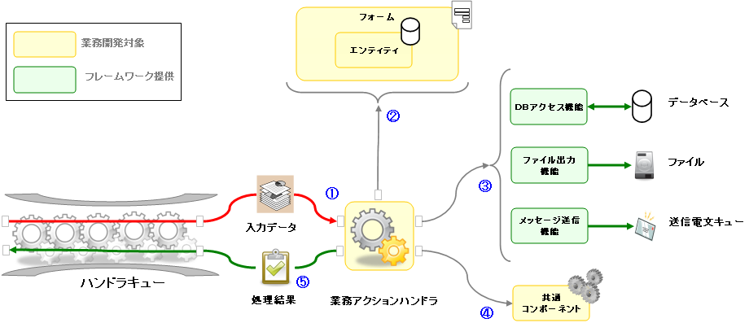
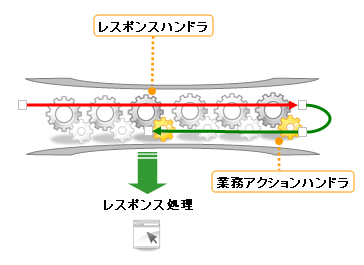

# Nablarch Application Framework 概要

この節では、業務アプリケーションを実装するために最低限必要となる
Nablarch Application Framework (NAF) の基本的な概念について解説する。

NAFは、オンライン画面入力、バッチ入力、メッセージング処理など、
基幹システムで必要とされる広範な形態の処理をサポートする一方で、
アプリケーション側の処理に関しては、非常に簡潔かつ単一のモデルに沿った制御を行う。

本節ではまず、この処理モデルについて解説した後、業務処理実装の概要について述べる。

## NAFのアプリケーション処理モデル

まず、アプリケーションに対して入力データが与えられる。
例えば、画面オンライン処理であればブラウザから送信されるHTTPリクエストが入力となり、
バッチ処理であればファイルもしくはDB上のデータレコードが入力となる。

次にアプリケーションは与えられた入力データに対して処理を行い、その処理結果を返す。
画面オンライン処理であれば、HTTPレスポンスの内容が返され、
バッチ処理では入力レコードに対する処理結果ステータスが返される。

ここまでの処理を最小の単位とし、それを繰り返すことによってアプリケーションの機能が実現される。

**アプリケーションの基本構造**

NAFにおけるアプリケーションの処理は、「トランザクション制御」や「応答電文の送信」といったステップごとに
細かく分割され、それぞれ **ハンドラ** と呼ばれるモジュールによって実装される。

これらのハンドラは、あらかじめ定められた順序に従って実行される。
この際、各ハンドラを実行順に並べたキューを内部的に作成する。これを **ハンドラキュー** とよぶ。

各ハンドラは、入力データを処理した後、同じ入力データを引数としてハンドラキュー上の次のハンドラを呼び出す。
こうして、ハンドラキュー上のハンドラは先頭から順々に実行され、
最終的に業務ロジックを実装したハンドラが呼び出される。
このハンドラを **業務アクションハンドラ** と呼ぶ。
業務アクションハンドラは業務処理を実行し、その結果をリターンする。
各ハンドラはリターンされた処理結果に対して(必要であれば)処理を行い、再びリターンする。
これにより、処理結果オブジェクトはハンドラキューを入力データとは逆の方向に遡り、
先頭のハンドラまで処理結果が戻された時点で処理が完了する。

次の図はこの内容を表した模式図である。
(①～⑥の順)

**NAFにおけるアプリケーションの基本構造**

## 標準ハンドラ構成

フレームワークが提供するハンドラには、以下に挙げるように、様々な機能を実装したものが存在している。
基本的に、NAFの機能はこれらのハンドラの組み合わせによって実現されている。

* **汎用的に利用できるハンドラ**

  * トランザクション制御ハンドラ
  * リクエストディスパッチハンドラ
  * 認可制御ハンドラ
  * 開閉局制御ハンドラ   ... など
* **画面オンライン処理に固有のハンドラ**

  * HTTPレスポンスハンドラ
  * HTTPアクセスログハンドラ
  * Nablarchカスタムタグ制御ハンドラ  ... など
* **バッチ処理に固有のハンドラ**

  * プロセス常駐化ハンドラ
  * マルチスレッド実行制御ハンドラ
  * プロセス多重起動防止ハンドラ   ... など
* **メッセージング処理に固有のハンドラ**

  * 電文応答制御ハンドラ
  * 再送電文制御ハンドラ          ... など

NAFでは、標準的なハンドラキューの構成を用途ごとに定義しており、それらを **標準ハンドラ構成** と呼んでいる。

以下の図は、オンライン画面処理で使用される標準ハンドラ構成を表した概念図である。

**画面オンライン処理ハンドラ構成(簡易版)**

バッチ処理では以下のようになる。

入出力データの型や、使用しているハンドラの一部が異なっているものの、
基本的な処理フローは同じだということがわかる。

**バッチ処理ハンドラ構成(簡易版)**

> **Note:**
> ここであげた標準ハンドラ構成は、主要なハンドラの一部のみをピックアップしたものであり、
> 実際の構成とは異なる。
> 標準ハンドラ構成の詳細については、「アーキテクチャ解説書」を参照すること。

## 業務アプリケーションの実装

業務アプリケーションの開発者が実装するハンドラは **業務アクションハンドラ** のみである。
それ以外のハンドラについては、フレームワークで提供しているものをそのまま使用することができる。

業務アクションハンドラが行う業務処理のおおまかな流れは下図のようになる。

図中の番号は処理の順番を示している。以下は上図の説明である。

1. **入力データの取得**

入力データの内容は、基本的にMap形式で取得できるようになっている。(図中①)

(以降で使用する入力精査やDBアクセスといったライブラリも、基本的にMapを引数や戻り値として使用する。)

1. **入力精査**

前段で取得した入力データのMapに対して精査処理を行う。(図中②)
精査ロジックはフォーム定義に沿って行なう。

**フォーム定義に沿った入力精査**

フォームとは「システムへの入力項目」の精査と値の保持を行うクラスであり、画面項目定義や
電文フォーマット定義などに沿って作成される。
フォームクラスの各項目には宣言的に精査仕様を設定できるようになっており、
精査ロジックを簡便に実装できる。

なお、DB内容との比較などの処理を含む精査については、ビジネスロジックの一部として実装する。

> **Note:**
> フォームのうち、下記の特徴を持つクラスを特にエンティティと呼称する。
> エンティティはテーブル定義に沿って作成される。

> * >   フォームクラスがRDBMS上のテーブルと1対1にひもづく。
> * >   フォームクラスのプロパティとテーブルのカラムが1対1にひもづく。

1. **ビジネスロジックの実行**

精査が完了した入力データはフォームもしくはエンティティオブジェクトとして取得できる。
この内容をもとに、ビジネスロジックを実行する。
また、フレームワークが提供するライブラリを利用することで、
DB、データファイル、メッセージキューを通じた入出力を行うことができる。 (図中③)
これらのライブラリについても、Mapインターフェースを通じて利用できるようになっている。

**業務共通コンポーネントの利用**

複数の業務アクションから共用しうるロジックについては、業務アクションハンドラに直接実装するのではなく
個別のクラス(業務共通コンポーネント)として実装することを推奨する。(図中④)
また、既存の業務共通コンポーネントが適用可能であれば、積極的に利用すること。

1. **処理結果の返却**

ビジネスロジックの処理結果を表すオブジェクトを返却する。(図中⑤)
バッチ処理など応答を伴わない場合は、
単に正常終了をあらわすマーカとなるオブジェクトをリターンすればよい。

また、業務アクションハンドラから実行時例外が送出された場合は、
ハンドラキュー上のハンドラによって、自動的にトランザクションがロールバックされる。

**レスポンス処理**

画面オンライン処理や同期応答を行うメッセージング処理では
応答の内容を指定するオブジェクトを処理結果として返却する必要がある。
例えば、画面オンライン処理であれば、遷移先画面となるJSPのパスを指定したオブジェクト(HttpResponse)
返す必要がある。
メッセージング処理では応答電文の内容や宛先キュー名を指定したオブジェクト(ResponseMessage) を返す。

これらのオブジェクトは、ハンドラキュー上の特定のハンドラによって処理され、送信元にレスポンスとして返される。
この処理を行うハンドラをレスポンスハンドラと呼ぶ。(下図参照)

## 業務コンポーネントの責務配置

前節で述べたように、業務機能は業務アクションハンドラ、フォーム/エンティティ、業務共通コンポーネントに実装される。
しかし、業務処理の責務を各クラスにどのように責務配置するかについては様々な考え方があり、特定の方法に絞ることはできない。
ここでは、典型的なプロジェクトで採用される責務配置の1例を示す。
以降のガイドに示される実装例は、全てここで挙げた指針に沿って実装されている。

| 名称 (クラス接尾辞) | 責務 |
|---|---|
| 業務アクションハンドラ (Action) | フレームワークから直接コールバックされ、業務処理のエントリーポイントとなるモジュール。 Actionは、ユーザ一覧照会、ユーザ情報登録といった取引ごとに、1つずつ作成し、 比較的単純な業務処理であれば、このクラスに直接実装する。  一方、複雑な業務処理や、複数の業務および処理形態(バッチと画面オンラインなど)から共用される 業務処理については、業務共通コンポーネントを作成し、そこに実装する。  > **Note:** > 業務アクションハンドラは、HTTPリクエストオブジェクトや実行コンテキストなどの、 > フレームワークが作成するオブジェクトに依存するため、自動テストは後述するリクエスト単体テストによって行う必要がある。 > このため、複雑な内部条件をもつ業務ロジックを実装した場合、 > テストデータのセットアップ作業が煩雑となり、作業効率が低下する。 > このような場合は、業務処理部分を業務共通コンポーネントとして切り出した上で、 > クラス単体テストを行うこと。 |
| 業務共通コンポーネント (Component) | 業務ロジックを実装するクラス。 このクラスでは、HTTPリクエストオブジェクトや実行コンテキストなどの実行制御基盤に属するオブジェクトに 直接依存することは避けること。 |
| 業務フォーム (Form) | アプリケーションで使用するデータの保持と、外部入力値の精査を実行するモジュール。 業務処理のうち、単項目入力精査および、項目間入力精査を実装する。 ただし、データベース等へのアクセスが必要となる精査処理については、業務アクションハンドラにて実装する。 |
| 業務画面 (View) | 画面オンライン処理において、ユーザが使用するインタフェースを提供する。(通常はJSPを使用する。) 業務処理は実装せず、業務アクションハンドラから渡される処理結果を表示する。 |

各構成要素間の処理の流れは以下のようになる。(図は画面オンライン処理での例)

View(を表示している、Webクライアント)からリクエストが送られる。

アプリケーションフレームワークが、リクエストを受信し、Actionを呼び出す。

Actionはバリデーションを実行し、画面入力値が格納されたオブジェクト(Form)を生成して、Componentを呼び出す。

Componentはビジネスロジックを実行し、結果をActionに返す。

Actionは必要に応じて、Componentの戻り値を処理(リクエストスコープへの値の格納など)し、アプリケーションフレームワークに処理を返す。

アプリケーションフレームワークはViewを処理(JSPをHTMLに変換など)し、クライアントにレスポンスを返す。

## 実行コンテキストとスコープ

データベースへの検索処理の結果を業務アクションハンドラから業務画面にデータを渡したり、業務アクションハンドラ間でデータを
保持する際は、入力データ、処理結果とは別に実行コンテキストと呼ばれるオブジェクトにデータを保持できる。

実行コンテキストに保持できるデータは、リクエストスコープとセッションスコープと呼ぶ2つのスコープに分けられる。
また、さらにWebアプリケーションでは、画面間でデータをやり取りする際に使用するウィンドウスコープと呼ぶスコープも提供している。

これら3種類のスコープについて、以下に概要を示す。

| 名称 | 説明 |
|---|---|
| リクエストスコープ | 1リクエストの処理の間データを保持するスコープ。 画面オンライン処理とメッセージング処理の場合はユーザからの1リクエストの処理、 バッチ処理の場合は1データの処理の間で、同じデータを保持できる。 |
| セッションスコープ | 複数のリクエストの処理の間を保持するスコープ。 画面オンライン処理ではログアウトするまでの間、メッセージング処理では1リクエスト 処理する間、バッチ処理ではバッチ処理開始から終了までの間で、同じデータを保持できる。 |
| ウィンドウスコープ | 画面オンライン処理のみで使用できる、セッションスコープと同様に複数のリクエストの処理の間を保持するスコープ。 セッションスコープと異なり、複数画面を同時に使用した際、それぞれの画面毎に別々の データが保持できる特徴がある。 使用方法は他の2種類のスコープと異なり、単純に実行コンテキストに保持するわけではない。 ウィンドウスコープの動作イメージについては [Appendix A: ウィンドウスコープ概要](../../guide/web-application/web-application-02-WindowScope.md#appendix-a-ウィンドウスコープ概要) を参照のこと。 詳細な使用方法については後述する。 |

> **Note:**
> ここでは、バッチ、オンラインといった処理の形態に依存しない、共通的な概念についてのみ述べた。
> より具体的なアプリケーションの実装方法については、以下の各ドキュメントを参照すること。

> ../04_Explanation/index
> ../04_Explanation_batch/index
> ../04_Explanation_messaging/index
> ../04_Explanation_messaging/04_Explanation_real/index
> ../04_Explanation_messaging/04_Explanation_delayed_receive/index
> ../04_Explanation_messaging/04_Explanation_delayed_send/index
> ../04_Explanation_messaging/04_Explanation_send_sync/index
> ../04_Explanation_other/04_Explanation_mail/index
