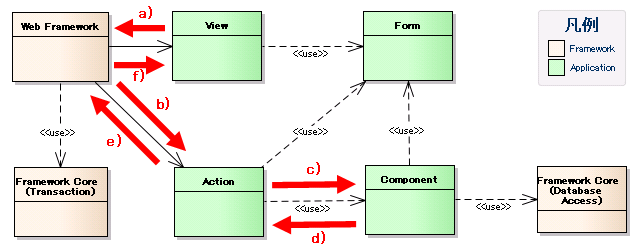

# 業務コンポーネントの責務配置

[業務アクションハンドラの実装](../../about/about-nablarch/about-nablarch-architectural-pattern-concept.md#業務アクションハンドラの実装) で述べるように、本フレームワークにおける業務機能は、
業務アクションハンドラ、フォーム/エンティティ、業務共通コンポーネントと呼ばれるクラスにそれぞれ実装される。
しかしながら、業務処理の複雑な責務をこれらのクラスに対してどのように配置するかについては様々な考え方があり、特定の方法に絞ることはできない。
以下では、典型的なプロジェクトで採用することができる責務配置の1例を示す。

なお、本書に記載される業務アプリケーションの実装例は、ここで述べる責務配置を前提として記述されている。

| 名称 (クラス接尾辞) | 責務 |
|---|---|
| 業務アクションハンドラ (Action) | フレームワークから直接コールバックされ、業務処理のエントリーポイントとなるモジュール。 Actionは、ユーザ一覧照会、ユーザ情報登録といった取引ごとに1つずつ作成する。 業務処理が比較的単純なものであれば、このクラスに直接実装してもよい。  複雑な業務処理や、複数の業務および処理形態(バッチと画面オンラインなど)から共用される 業務処理については、別途、業務共通コンポーネントを作成し、そこに実装する。  > **Note:** > 業務アクションハンドラは、HTTPリクエストオブジェクトや実行コンテキストなどの、 > フレームワークが作成するオブジェクトに依存するため、自動テストは後述するリクエスト単体テストによって行う必要がある。 > このため、複雑な内部条件をもつ業務ロジックを実装した場合、 > テストデータのセットアップ作業が煩雑となり、作業効率が低下する。 > このような場合は、業務処理部分を業務共通コンポーネントとして切り出した上で、 > クラス単体テストを行うこと。 |
| 業務共通コンポーネント (Component) | 業務ロジックを実装するクラス。 このクラスでは、HTTPリクエストオブジェクトや実行コンテキストなどの実行制御基盤に属するオブジェクトに 直接依存することは避けること。 |
| 業務フォーム (Form) | アプリケーションで使用するデータの保持と、外部入力値の精査を実行するモジュール。 業務処理のうち、単項目入力精査および、項目間入力精査を実装する。 ただし、データベース等へのアクセスが必要となる精査処理については、業務アクションハンドラにて実装する。 |
| 業務画面 (View) | 画面オンライン処理において、ユーザが使用するインタフェースを提供する。(通常はJSPを使用する。) 業務処理は実装せず、業務アクションハンドラから渡される処理結果を表示する。 |

各構成要素間の処理の流れは以下のようになる。(図は画面オンライン処理での例)

View(を表示している、Webクライアント)からリクエストが送られる。

アプリケーションフレームワークが、リクエストを受信し、Actionを呼び出す。

Actionはバリデーションを実行し、画面入力値が格納されたオブジェクト(Form)を生成して、Componentを呼び出す。

Componentはビジネスロジックを実行し、結果をActionに返す。

Actionは必要に応じて、Componentの戻り値を処理(リクエストスコープへの値の格納など)し、アプリケーションフレームワークに処理を返す。

アプリケーションフレームワークはViewを処理(JSPをHTMLに変換など)し、クライアントにレスポンスを返す。
