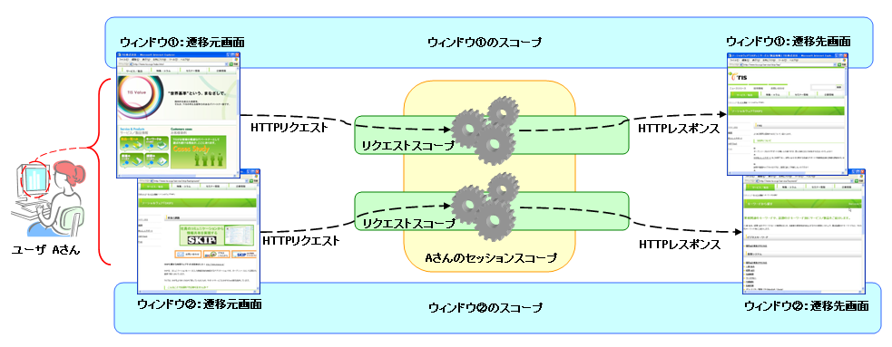

# 画面オンライン処理用業務アクションハンドラ

## 

**クラス名**: `nablarch.fw.web.HttpMethodBinding`

画面オンライン処理用業務アクションハンドラ。

**リクエストスコープ**

3つの変数スコープのうち最も維持期間が短い。各HTTPリクエストごとに作成され、レスポンス処理が完了するまで維持される。次画面以降に引き継ぐ必要のないデータを保存する。

画面オンライン処理方式におけるリクエストスコープは、ServletAPIの `HTTPServletRequest#getAttribute()/setAttribute()` メソッドのラッパー。

**リクエストスコープに保持するデータ**
- 画面に表示するデータオブジェクト（次画面以降に引き継がないもの）
- バリデーションエラー等のメッセージ
- JSP側で表示用に使用するフラグ

<details>
<summary>keywords</summary>

HttpMethodBinding, nablarch.fw.web.HttpMethodBinding, 業務アクションハンドラ, 画面オンライン処理, クラス名, リクエストスコープ, HTTPServletRequest, getAttribute, setAttribute, 変数スコープ, リクエストスコープに保持するデータ, バリデーションエラー

</details>

## 概要

[../architectural_pattern/web_gui](../../processing-pattern/web-application/web-application-web_gui.md) における標準的な業務アクションハンドラの実装方式。

- レスポンス時のファイルダウンロード: [../02_FunctionDemandSpecifications/02_Fw/01_Web/05_FileDownload](../libraries/libraries-05_FileDownload.md)
- ファイルアップロードを伴う業務処理: [../common_library/file_upload_utility](../libraries/libraries-file_upload_utility.md)

**ウィンドウスコープ**

ブラウザのウィンドウ・タブ・フレームごとに作成される。ウィンドウが閉じられるかセッションが終了するまで維持される。

ウィンドウ間で同一の値を共有しなければならない一部のデータ（ログインユーザIDなど）を除き、画面遷移を跨って使用するデータはすべてウィンドウスコープに保持する。これにより、複数ウィンドウを用いた並行操作やブラウザのヒストリバックによる遷移が可能となる。

**ウィンドウスコープに保持するデータ**
- 画面の入力項目（入力項目復帰が必要なもの）
- 他業務画面からの引き継ぎデータ
- 画面遷移履歴情報
- 楽観ロック用バージョン番号（※複数のリクエスト（画面）を跨いだトランザクションを実装する場合に使用する制御情報。あるデータに対する複数ユーザからの変更を制御するために用いる）

**使用方法**

ウィンドウスコープ変数はhidden属性のinputタグとして各ウィンドウの画面内に維持され、通常のリクエストパラメータと同等に扱われる。

- リクエストパラメータへのアクセス: [validation](../libraries/libraries-validation-core_library.md) 機能のAPIを使用
- ウィンドウスコープへの変数追加: `HttpRequest#setParam()` を使用

```java
public class HttpRequest extends Request {
    @Published
    public HttpRequest setParam(String name, String... params);
}
```

**セキュリティ上の考慮**

フレームワークが出力したhiddenタグの値は、リクエストURIおよびname属性のハッシュ値とともに暗号化される。暗号化に使用する共通鍵はユーザログイン時に作成され、ログアウトまたはセッションタイムアウト時に廃棄される。

<details>
<summary>keywords</summary>

概要, 業務アクションハンドラ, ファイルダウンロード, ファイルアップロード, web_gui, ウィンドウスコープ, HttpRequest, setParam, hiddenタグ, 暗号化, セキュリティ, 楽観ロック, ヒストリバック, ウィンドウスコープに保持するデータ, 画面遷移, @Published

</details>

## 

**ハンドラキュー**（処理順）:
1. HttpResponseHandler
2. HttpErrorHandler
3. TransactionManagementHandler
4. HttpMethodBinding

**関連ハンドラ**:

| ハンドラ | 内容 |
|---|---|
| [HttpResponseHandler](handlers-HttpResponseHandler.md) | 業務アクションが返却/送出したHTTPレスポンスオブジェクトをもとにレスポンス処理を行う |
| [HttpErrorHandler](handlers-HttpErrorHandler.md) | 業務アクションが送出した実行時例外を捕捉し、対応するエラー遷移先のHTTPレスポンスオブジェクトに変換する |
| [TransactionManagementHandler](handlers-TransactionManagementHandler.md) | 業務アクションが実行時例外を送出することで業務トランザクションをロールバックする |

**セッションスコープ**

ログインユーザごとに作成されるスコープ。複数のウィンドウで共有されるデータを保持する目的で使用する。ユーザログイン時に作成され、ログアウトまたはセッションタイムアウトまで維持される。

セッションスコープ上のデータは複数のウィンドウから同時にアクセスされる可能性があり、適切に同期化しなければならない。

**セッションスコープに保持するデータ**
- ログインユーザに紐づくデータ（ログインユーザID、認証・認可情報）
- ウィンドウ間で同一のデータを参照・更新する必要があるデータ（ショッピングカート内の商品情報など）

**セッションスコープの実装方式**

| 方式 | 説明 | スケーリング上の制約 |
|---|---|---|
| HTTPSession（セッションアフィニティ） | 同じログインユーザからのリクエストをセッションスコープが存在するサーバインスタンスに振り分ける | セッションが存在するサーバインスタンスへのルーティングが必要 |
| HTTPSession（セッションパーシステント） | サーバクラスタ内の全インスタンスでセッションスコープを同期する | クラスタ全体での同期が必要 |
| データベースを使用した独自実装 | アプリケーションサーバをほぼ制約なくスケールアップ可能 | データベースへの負荷が増加する |

> **注意**: データベースを使用したHTTPセッション実装は現時点では提供されていない。

<details>
<summary>keywords</summary>

ハンドラキュー, HttpResponseHandler, HttpErrorHandler, TransactionManagementHandler, 関連ハンドラ, ハンドラ処理概要, セッションスコープ, HTTPSession, セッションアフィニティ, セッションパーシステント, セッションスコープに保持するデータ, ログインユーザ, 同期化, スケーリング

</details>

## 業務アクションハンドラの実装内容

業務アクションは `Handler` インターフェースを実装せず、HTTPリクエストの内容に従い動的にメソッドが呼び分けられる。実装の3要素: ① ビジネスメソッドのディスパッチ、② ビジネスロジックの実行とHTTPレスポンスの返却、③ 例外制御。

```java
public class LoginAction {
    // ① ビジネスメソッドのディスパッチ
    public HttpResponse getLoginHtml(HttpRequest request, ExecutionContext context) {
        // ② ビジネスロジックの実行とHTTPレスポンスの返却
        context.invalidateSession();
        return new HttpResponse("./login.jsp");
    }

    public HttpResponse doLogin(HttpRequest request, ExecutionContext context) {
        try {
            authenticate(request, context);
            return new HttpResponse("forward:///app/MainMenu");
        // ③ 例外制御
        } catch(AuthenticationFailedException e) {
            throw new HttpErrorResponse(403, "forward://login.html", e);
        }
    }
}
```

<details>
<summary>keywords</summary>

LoginAction, HttpRequest, ExecutionContext, 業務アクション実装, HttpResponse, HttpErrorResponse, AuthenticationFailedException

</details>

## 

**① ビジネスメソッドのディスパッチ**

[../architectural_pattern/web_gui](../../processing-pattern/web-application/web-application-web_gui.md) の業務アクションでは `Handler` インターフェースの実装不要。HTTPリクエストの内容に従い動的にメソッドが呼び分けられる。

ディスパッチ対象メソッドの条件:
1. 戻り値の型が `HttpResponse`、引数が `HttpRequest`・`ExecutionContext`
2. メソッド名が `(HTTPメソッド名 or "do") + (リクエストURIのリソース名)` に一致（大文字小文字区別なし、URIの"."は無視、メソッド名の"_"は無視）

| HTTPリクエスト | 委譲対象メソッドシグニチャ例 |
|---|---|
| GET /app/index.html | `HttpResponse getIndexHtml(HttpRequest, ExecutionContext)`, `HttpResponse get_index_html(HttpRequest, ExecutionContext)`, `HttpResponse doIndexHtml(HttpRequest, ExecutionContext)` など |
| POST /app/message | `HttpResponse postMessage(HttpRequest, ExecutionContext)`, `HttpResponse doMessage(HttpRequest, ExecutionContext)` など |

該当メソッドが存在しない場合はステータスコード404の `HttpErrorResponse` が送出される。

**② ビジネスロジックの実行とHTTPレスポンスオブジェクトの返却**

レスポンスボディの指定方法:
1. `HttpResponse` オブジェクトに直接設定（主にファイルダウンロード [../02_FunctionDemandSpecifications/02_Fw/01_Web/05_FileDownload](../libraries/libraries-05_FileDownload.md)）
2. コンテンツパス文字列で指定（通常の業務機能）

**コンテンツパス書式**:

1. **サーブレットフォーワード** `servlet://(パス)` — JSP画面表示等に使用。ハンドラキューを再実行しない。
   - 相対パス: 現在のリクエストURIを起点 / 絶対パス: サーブレットコンテキストを起点
   - 例: `servlet://index.jsp` / `servlet:///appContext/jsp/index.jsp`
   > **注意**: ハンドラキューを含めたフォーワードが必要な場合は [ForwardingHandler](handlers-ForwardingHandler.md) の内部フォーワードを使用すること（[WebFrontController](handlers-WebFrontController.md) がサーブレットフィルタとして実装されているため、サーブレットフォーワードでハンドラキューを再実行すると無限ループになる）。

2. **内部フォーワード** `forward://(パス)` — ハンドラキューの処理を再実行する。業務アクションでの処理を伴う遷移先に使用。
   - 相対パス: 現在のリクエストURIを起点 / 絶対パス: サーブレットコンテキスト名を起点
   - 例: `forward://registerForm.html` / `forward:///app/user/registerForm.html`
   > **注意**: 内部フォーワード処理の詳細は [ForwardingHandler](handlers-ForwardingHandler.md) を参照すること。

3. **HTTPリダイレクション**:
   - `redirect://(パス)` — サーブレットコンテキスト配下。絶対パスはサーブレットコンテキストルートからの相対パス。
   - `http(s)://(URL)` — サーブレットコンテキスト外、完全URLを指定可能。
   - 例: `redirect://login` / `redirect:///UserAction/login` / `http://www.example.com/login`

4. **ファイルシステムリソース** `file://(パス)`:
   - 相対パス: JVMプロセスのワーキングディレクトリを起点 / 絶対パス: ファイルシステムのルートディレクトリを起点
   - 例: `file://webapps/style/common.css` / `file:///www/docroot/style/common.css`

5. **クラスパスリソース** `classpath://(リソース名)` — 相対・絶対パス区別なし:
   - 例: `classpath://nablarch/sample/webapp/common.css`

<details>
<summary>keywords</summary>

ビジネスメソッドディスパッチ, メソッド名規約, HTTPメソッドバインディング, 404, HttpErrorResponse, コンテンツパス, サーブレットフォーワード, 内部フォーワード, HTTPリダイレクション, content-path, ForwardingHandler

</details>

## 

**③ 例外制御**

`HttpErrorResponse` 以外の実行時例外はデフォルトでHTTPステータス500を返す。他の応答を返すには、例外を明示的に捕捉して `HttpResponse` を生成するか `HttpErrorResponse` でラップして再送出する。

**`@OnError`** アノテーション（`nablarch.fw.web.interceptor.OnError`）で例外制御を簡略化:

```java
@OnError(
    type = ApplicationException.class
  , path ="forward://registerForm.html"
)
public HttpResponse handle(HttpRequest req, ExecutionContext ctx) {
    UserForm form = validateUser(req);
    registerUser(form);
    return new HttpResponse(200, "servlet://registrationCompleted.jsp");
}
```

複数例外には **`@OnErrors`**（`nablarch.fw.web.interceptor.OnErrors`）を使用:

```java
@OnErrors({
    @OnError(type = OptimisticLockException.class, path ="forward://searchForm.html"),
    @OnError(type = ApplicationException.class, path ="forward://updatingForm.html")
})
public HttpResponse handle(HttpRequest req, ExecutionContext ctx) { ... }
```

> **重要**: `@OnErrors` は定義順（上から順）に例外を処理する。サブクラス例外（例: `OptimisticLockException`）は必ずスーパークラス例外（例: `ApplicationException`）より前に定義すること。逆順にすると、サブクラス例外がスーパークラスの処理で捕捉される。

**インターセプタの実行順**

実行順は設定ファイルの `interceptorsOrder` という名前の `list` コンポーネントで定義した順となる。

```xml
<list name="interceptorsOrder">
  <value>nablarch.common.web.token.OnDoubleSubmission</value>
  <value>nablarch.fw.web.interceptor.OnErrors</value>
  <value>nablarch.fw.web.interceptor.OnError</value>
</list>
```

> **重要**: 設定ファイルに未定義のインターセプタが使用された場合は実行時例外が送出される。`interceptorsOrder` `list` コンポーネントが未定義の場合は `Method#getDeclaredAnnotations` の逆順で実行されるが、順序保証がないため実行環境によって変わる可能性がある。

<details>
<summary>keywords</summary>

例外制御, @OnError, @OnErrors, インターセプタ実行順, interceptorsOrder, OnDoubleSubmission, ApplicationException, OptimisticLockException, HttpErrorResponse, nablarch.fw.web.interceptor.OnError, nablarch.fw.web.interceptor.OnErrors

</details>

## 画面オンライン処理における変数スコープの利用

各画面に自動出力されるhidden項目で実装される **ウィンドウスコープ** を含む3種類のスコープが定義されている。ウィンドウスコープにはウィンドウ・タブごとに個別の変数を保持でき、複数ウィンドウからの並行操作時も矛盾なく業務処理を遂行可能。

| スコープ名称 | 用途 | 作成単位 | 維持期間 |
|---|---|---|---|
| リクエストスコープ | 単一HTTPリクエスト内でのみ使用するデータ（画面間共有不要）を保持 | HTTPリクエストごと | リクエスト開始〜終了 |
| ウィンドウスコープ | 画面間共有データのうちウィンドウ間共有不要なデータを保持 | ブラウザのウィンドウ・タブ・フレームごと | ウィンドウを開いてから閉じるまで、もしくはセッション終了まで |
| セッションスコープ | 画面間共有データのうちウィンドウ間共有が必要なデータを保持 | ユーザのログインごと | ログインからログアウトまで、もしくはセッションタイムアウトまで |



<details>
<summary>keywords</summary>

ウィンドウスコープ, リクエストスコープ, セッションスコープ, 変数スコープ, hidden項目, 並行操作, web_scope

</details>
