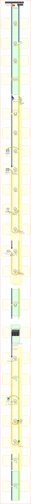

## リクエストハンドラエントリ

**クラス名:** `nablarch.fw.RequestHandlerEntry`

このハンドラは、対象のハンドラをラップし、そのハンドラを特定の [リクエストパス](../../about/about-nablarch/about-nablarch-architectural-pattern-concept.md#request-path) に対してのみ実行することができる。

**リクエストパスのパターン指定**

このハンドラでは、リクエストパスとして、URIや Unixのシステムパス、Javaの名前空間のように、"/"で区切られた
階層構造を想定しており、
ハンドラを実行するリクエストパスのパターンを **Glob式** に似た書式で指定することができる。

1. ワイルドカードの指定等、基本的にUnixやDOSで使用されるGlob式の記法に準じる。
  '*'はワイルドカードであり'.'と'/'を除く任意の文字の任意個の列にマッチする。

  | requestPattern | リクエストパス | 結果 |
  |---|---|---|
  | / | / | 呼ばれる |
  |  | /index.jsp | 呼ばれない |
  | /* | / | 呼ばれる |
  |  | /app | 呼ばれる |
  |  | /app/ | 呼ばれない (* は'/'にはマッチしない) |
  |  | /index.jsp | 呼ばれない (* は'.'にはマッチしない) |
  | /app/*.jsp | /app/index.jsp | 呼ばれる |
  |  | /app/admin | 呼ばれない |
  | /app/*/test | /app/admin/test | 呼ばれる |
  |  | /app/test/ | 呼ばれない |
2. 最後尾の'/'が'//'と重ねられていた場合、それ以前の文字列について
  前方一致すればマッチ成功と判定する。
  リソース名を表す'//'以降の文字列については別途マッチ判定が行われる。
  (すなわち、"サブディレクトリ全体"に対してマッチする。)

  | requestPattern | リクエストパス | 結果 |
  |---|---|---|
  | /app// | / | 呼ばれない |
  |  | /app/ | 呼ばれる |
  |  | /app/admin/ | 呼ばれる |
  |  | /app/admin/index.jsp | 呼ばれる |
  | //*.jsp | /app/index.jsp | 呼ばれる |
  |  | /app/admin/index.jsp | 呼ばれる |
  |  | /app/index.html | 呼ばれない('*.jsp'がマッチしない) |

-----

-----

### ハンドラ処理フロー

**[往路処理]**
**1. (ハンドラ実行判定)**
ハンドラの引数として渡されたリクエストオブジェクトから、リクエストパスを取得し、
本ハンドラに設定された **実行対象リクエストパスパターン**  と合致するかどうかを上述した判定ロジックに沿って判定する。
**2. (実行対象外リクエストパス)**
**1.**  の判定でパターンが合致しなかった場合は、それ以上このハンドラでは処理を行わず、
後続のハンドラに処理移譲し、その結果を取得する。
**2a. (実行対象リクエストパス)**
**1.**  の判定でパターンが合致した場合は、このハンドラに設定された **委譲対象ハンドラ** に処理を委譲し、
その結果を取得する。

**[復路処理]**
**3. (正常終了)**
**2.** もしくは **2a.** の結果をリターンして終了する。

**[例外処理]**
**2b. (エラー終了)**
後続のハンドラ、もしくは **委譲対象ハンドラの** 処理中にエラーが発生した場合は、
特段の例外処理は行なわず、後続ハンドラで送出された例外をそのまま送出する。

### 設定項目・拡張ポイント

本ハンドラの設定項目の一覧は以下のとおり。

| 設定項目 | プロパティ名 | データ型 | 備考 |
|---|---|---|---|
| 委譲対象ハンドラ | handler | Handler | (必須指定) |
| 実行対象リクエストパスパターン | requestPattern | String | (必須指定) 委譲対象のハンドラを実行するリクエストパスのパターン。 |

**画面オンライン処理での設定例**

宣言的トランザクション制御の対象範囲を、特定のパス(/action) 配下に限定する場合。

```xml
<!-- トランザクション制御ハンドラ -->
<component class="nablarch.fw.RequestHandlerEntry">
  <property name="requestPattern" value="/action//"/>
  <property name="handler" ref="transactionManagementHandler"/>
</component>
```

**複数のパッケージを使用する設定例**

上記の設定例のように、単一のリクエストハンドラエントリを使用した場合、
ベースパッケージが異なるパッケージに対してディスパッチすることははできない（下図参照）。

*【図：ss11AAをベースパッケージに指定した場合のディスパッチ範囲】*

```text
nablarch
   +-sample
       +- ss11AA <-- ベースパッケージ
       |     +- RM11AA0101Action   <-- 委譲可
       |     +- RM11AA0102Action   <-- 委譲可
       +- ss99ZZ
             +- RM99ZZ0101Action   <-- 委譲不可
```

異なるリクエストパスにマッチするリクエストハンドラエントリを複数使用することにより、
複数のベースパッケージ配下のクラスにディスパッチすることができる。

以下に設定例を記載する。
リクエストパスのパターンとベースパッケージの対応関係に注目されたい。

```xml
<!-- サブシステムss11AA向け -->
<component class="nablarch.fw.RequestHandlerEntry">
  <property name="requestPattern" value="/RM11AA*"/>
  <property name="handler">
    <component class="nablarch.fw.handler.RequestPathJavaPackageMapping">
      <property name="basePackage" value="nablarch.sample.ss11AA" />
      <property name="immediate"   value="false" />
    </component>
  </property>
</component>

<!-- サブシステムss99ZZ向け -->
<component class="nablarch.fw.RequestHandlerEntry">
  <property name="requestPattern" value="/RM99ZZ*"/>
  <property name="handler">
    <component class="nablarch.fw.handler.RequestPathJavaPackageMapping">
      <property name="basePackage" value="nablarch.sample.ss99ZZ" />
      <property name="immediate"   value="false" />
    </component>
  </property>
</component>
```
