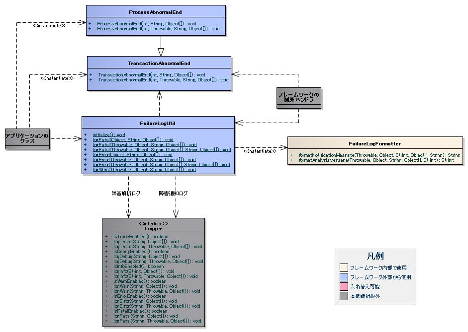

# 障害ログの出力

障害ログは、フレームワーク又はアプリケーションから出力することを想定している。
フレームワークでは、処理方式毎の例外ハンドラにおいて出力する。
アプリケーションでは、バッチ処理の障害発生時に後続処理を継続する場合などに出力する。

## 障害ログの出力方針

障害通知ログと障害解析ログで想定している出力方針を下記に示す。
障害通知ログは、ログ監視ツールから監視することで障害を検知することを想定しているので、
ロガー名を付けて障害通知専用のファイルに出力する。
障害解析ログは、アプリケーション全体のログ出力を行うアプリケーションログに出力する。

| ログの種類 | ログレベル | ロガー名 |
|---|---|---|
| 障害通知ログ | FATAL、ERROR | MONITOR |
| 障害解析ログ | FATAL、ERROR | 指定なし(クラス名) |

上記出力方針に対するログ出力の設定例を下記に示す。

log.propertiesの設定例

```bash
writerNames=monitorFile,appFile

# 障害通知ログの出力先
writer.monitorFile.className=nablarch.core.log.basic.SynchronousFileLogWriter
writer.monitorFile.filePath=/var/log/app/monitor.log
writer.monitorFile.formatter.className=nablarch.core.log.basic.BasicLogFormatter
writer.monitorFile.formatter.format=<障害通知ログ用のフォーマット>
writer.monitorFile.lockFilePath=/var/log/lock/monitor.lock
writer.monitorFile.lockRetryInterval=10
writer.monitorFile.lockWaitTime=3000
writer.monitorFile.failureCodeCreateLockFile=MSG00101
writer.monitorFile.failureCodeReleaseLockFile=MSG00102
writer.monitorFile.failureCodeForceDeleteLockFile=MSG00103
writer.monitorFile.failureCodeInterruptLockWait=MSG00104

# アプリケーションログの出力先
writer.appFile.className=nablarch.core.log.basic.FileLogWriter
writer.appFile.filePath=/var/log/app/app.log
writer.appFile.maxFileSize=10000
writer.appFile.formatter.className=nablarch.core.log.basic.BasicLogFormatter
writer.appFile.formatter.format=<アプリケーションログ用のフォーマット>

availableLoggersNamesOrder=MON,ROO

# アプリケーションログの設定
loggers.ROO.nameRegex=.*
loggers.ROO.level=INFO
loggers.ROO.writerNames=appFile

# 障害通知ログの出力設定
loggers.MON.nameRegex=MONITOR
loggers.MON.level=ERROR
loggers.MON.writerNames=monitorFile
```

## 障害ログの出力項目

障害通知ログと障害解析ログの出力項目を下記に示す。
障害通知ログと障害解析ログ毎に出力を想定している項目には、Yマークを入れている。

障害通知ログは、ログ監視ツールから通知を受けた運用オペレータが1次切り分け担当者の特定に使用する。
運用オペレータは、障害通知ログのリクエストIDを参照し、1次切り分け担当者を特定することを想定しているため、
リクエストIDには、業務コードなど、1次切り分け担当者を特定できるだけの情報(下記ノートを参照)を含める必要がある。
リクエストIDに1次切り分け担当者を特定できるだけの情報を含めることができない場合は、 [障害の連絡先情報の追加方法](../../component/libraries/libraries-01-FailureLog.md#failurelog-contact) を使用することで、
リクエストID毎に連絡先情報をログに含めることができる。

| 項目名 | 説明 | 障害通知 | 障害解析 |
|---|---|---|---|
| 出力日時 | ログ出力時のシステム日時。 | Y | Y |
| 障害レベル | 障害のレベルを判断するために使用する。 | Y | Y |
| 障害コード | 障害を一意に識別するコード。障害内容の特定に使用する。 | Y | Y |
| 起動プロセス | 障害が発生したアプリケーションを起動したプロセス名。実行環境の特定に使用する。 | Y | Y |
| 処理方式区分 | 障害が発生した処理方式の特定に使用する。 | Y | Y |
| リクエストID | 障害が発生した処理を一意に識別するID。1次切り分け担当者の特定に使用する。 | Y | Y |
| 実行時ID | 障害が発生した処理の実行を一意に識別するID。 | Y | Y |
| ユーザID | ログインユーザのユーザID。 | Y | Y |
| メッセージ | 障害コードに対応するメッセージ。障害内容の特定に使用する。 | Y | Y |
| 処理対象データ | 障害が発生した処理が対象としていたデータを特定するために使用する。 データリーダを使用して読み込まれたデータオブジェクトのtoStringメソッド を呼び出し出力される。  > **Warning:** > システムのセキュリティ要件により、 > 障害解析ログであっても個人情報や機密情報の出力が許されない場合は、 > この項目に対する出力処理をプロジェクトでカスタマイズすること。 > カスタマイズ方法は、 [プレースホルダのカスタマイズ方法](../../component/libraries/libraries-01-FailureLog.md#failurelog-placeholdercustomize) を参照。  > **Note:** > 処理対象データの出力により、障害ログに派生元実行時情報を出力することができる。 > 派生元実行時情報とは、例えば、画面処理からバッチ処理にデータ連携する場合であれば、 > 画面処理を実行した時点の実行時情報(リクエストIDや実行時IDなど)が > バッチ処理での派生元実行時情報となる。 > 派生元実行時情報の出力方法は、 [派生元実行時情報の出力方法](../../component/libraries/libraries-01-FailureLog.md#failurelog-derivedexecutioninfo) を参照。 |  | Y |
| スタックトレース | 障害発生箇所の特定に使用する。 |  | Y |
| 付加情報 | フレームワーク又はアプリケーションで追加する付加情報。 |  | Y |

障害ログの個別項目は下記となる。残りの項目は、 [BasicLogFormatter](../../component/libraries/libraries-01-Log.md#log-basiclogformatter) の設定で指定する共通項目となる。
共通項目と個別項目を組み合わせたフォーマットについては、 [各種ログの共通項目のフォーマット](../../component/libraries/libraries-01-Log.md#applog-format) を参照。

* 障害コード
* メッセージ
* 処理対象データ

> **Note:**
> 起動プロセスとリクエストIDは、システムの規模に応じてプロジェクト毎にID体系を規定する。
> 例えば、大規模なシステムでは、下記のようなID体系となる。

> 起動プロセス:

> サーバ名(8桁)＋識別文字列(4桁)･･･識別文字列にはバッチ処理のJOBIDなどが入る。

> リクエストID:

> システムID(1桁)＋サブシステムID(2桁)＋業務コード(3桁)＋画面ID(2桁)+イベントID(2桁)

## 障害ログの出力方法

障害ログの出力に使用するクラスを下記に示す。



| クラス名 | 概要 |
|---|---|
| nablarch.core.log.app.FailureLogUtil | 障害ログを出力するクラス。 |
| nablarch.core.log.app.FailureLogFormatter | 障害ログの個別項目をフォーマットするクラス。 |
| nablarch.fw.TransactionAbnormalEnd | トランザクションデータの処理中に異常が発生した場合に送出する例外クラス。  この例外は、フレームワークの例外ハンドラに捕捉され、障害ログの出力に使用される。 この例外に障害コードを指定することで、障害コードに対応するメッセージが障害ログに出力される。 |
| nablarch.fw.launcher.ProcessAbnormalEnd | アプリケーションを異常終了させる際に送出する例外クラス。  この例外は、TransactionAbnormalEndを継承しており使用方法はTransactionAbnormalEndと同じである。 |

アプリケーションでの障害ログの出力は、下記の2通りの方法がある。

* FailureLogUtilを使用して直接出力する。
* TransactionAbnormalEndやProcessAbnormalEndを送出し例外ハンドラに出力を依頼する。

障害ログを出力し業務処理を終了する場合は、TransactionAbnormalEndやProcessAbnormalEndを使用する。
障害ログを出力するが後続の業務処理を継続する場合は、FailureLogUtilを使用する。
FailureLogUtilを使用した場合は、例外が送出されるわけではないのでトランザクションがコミットされる。

ProcessAbnormalEndの使用例を下記に示す。

※TransactionAbnormalEndを使用した場合の実装例は、ProcessAbnormalEndと全く同じとなる。
このため、本実装例での説明は省略する。

```java
// 障害ログを出力し業務処理を終了する場合

// バリデーションエラーの場合
ValidationContext<UserForm> context =
    ValidationUtil.validateAndConvertRequest("user", UserForm.class, inputData, "registerUser");
if (!context.isValid()) {
    // 終了コード、バリデーションの例外、障害コードを指定している。
    // 終了コードとはプロセスを終了する際に System#exit(int) メソッドに設定する値である。
    throw new ProcessAbnormalEnd(100, new ApplicationException(context.getMessages()), "UM900001");
}

// 自ら例外を生成する場合
if (user == null) {
    // 終了コード、障害コードを指定している。
    throw new ProcessAbnormalEnd(100, "UM900002");
}

// 例外を捕捉した場合
try {
    // 業務処理
} catch (UserNotFoundException e) {
    // 終了コード、捕捉した例外、障害コードを指定している。
    throw new ProcessAbnormalEnd(100, e, "UM900003");
}
```

FailureLogUtilの使用例を下記に示す。

```java
// 障害ログを出力し後続処理を継続する場合

// 障害を検知した場合
if (user == null) {
    // 処理対象データ、障害コードを指定している。
    FailureLogUtil.logError(inputData, "UM800001");
}

// 例外を捕捉した場合
try {
    // 業務処理
} catch (UserNotFoundException e) {
    // 捕捉した例外、処理対象データ、障害コードを指定している。
    FailureLogUtil.logError(e, inputData, "UM800001");
}
```

上記使用例のように、障害ログの出力では、ログから障害内容を特定するために障害コードを指定する。
障害コードのコード体系は、プロジェクト毎に規定すること。

障害ログに出力されるメッセージは、 [メッセージ管理](../../component/libraries/libraries-07-Message.md) 機能を使用して障害コードに対応するメッセージを取得する。
[メッセージ管理](../../component/libraries/libraries-07-Message.md) 機能では、メッセージが見つからない場合に例外が発生する。
メッセージ取得処理で例外が発生した場合は、障害ログとは別に、メッセージ取得処理で発生した例外をWARNレベルでログ出力し、
障害ログには下記のメッセージを出力する。

```bash
failed to get the message to output the failure log. failureCode = [<障害コード>]
```

メッセージが見つからない場合の障害通知ログの出力例を下記に示す。

```bash
# 障害コード(fail_code = [AP112233])の後にメッセージを出力している。
2011-02-23 18:23:45.680 -FATAL- usr_id = [9999999999] fail_code = [AP112233] failed to get the message to output the failure log. failureCode = [AP112233]
```

ソース上で指定した障害コードは、設定によりアプリケーションの実行時に変更することができる。
アプリケーションの障害コードの変更方法については、 [アプリケーションの障害コードの変更方法](../../component/libraries/libraries-01-FailureLog.md#failurelog-appmsgid) を参照。
また、フレームワークで例外が発生した場合の障害コードの変更方法については、 [フレームワークの障害コードの変更方法](../../component/libraries/libraries-01-FailureLog.md#failurelog-fwmsgid) を参照。

フレームワークの例外ハンドラでRuntimeExceptionを捕捉した場合など、障害コードの指定がない場合は、
設定で指定するデフォルトの障害コードとメッセージを出力する。

## 障害ログの設定方法

FailureLogUtilは、プロパティファイル(app-log.properties)を読み込み、
FailureLogFormatterオブジェクトを生成して、個別項目のフォーマット処理を委譲する。
プロパティファイルのパス指定や実行時の設定値の変更方法は、 [各種ログの設定](../../component/libraries/libraries-01-Log.md#applog-config) を参照。
障害ログの設定例を下記に示す。

app-log.propertiesの設定例

```bash
failureLogFormatter.className=nablarch.core.log.app.FailureLogFormatter
failureLogFormatter.defaultFailureCode=ZZ999999
failureLogFormatter.defaultMessage=an unexpected exception occurred.
failureLogFormatter.language=en
failureLogFormatter.notificationFormat=fail_code = [$failureCode$] $message$
failureLogFormatter.analysisFormat=fail_code = [$failureCode$] $message$
failureLogFormatter.derivedRequestIdPropName=insertRequestId
failureLogFormatter.derivedUserIdPropName=updatedUserId
failureLogFormatter.contactFilePath=classpath:failure-log-contact.properties
failureLogFormatter.appFailureCodeFilePath=classpath:failure-log-app-codes.properties
failureLogFormatter.fwFailureCodeFilePath=classpath:failure-log-fw-codes.properties
```

プロパティの説明を下記に示す。

| プロパティ名 | 設定値 |
|---|---|
| failureLogFormatter.className | FailureLogFormatterのクラス名。  デフォルトはnablarch.core.log.app.FailureLogFormatter。 FailureLogFormatterを差し替える場合に指定する。 |
| failureLogFormatter.defaultFailureCode(必須) | デフォルトの障害コード。  例外ハンドラでRuntimeExceptionを捕捉した場合など、障害コードの指定がない場合に使用する。 |
| failureLogFormatter.defaultMessage(必須) | デフォルトのメッセージ。  デフォルトの障害コードを使用する場合に出力するメッセージ。 |
| failureLogFormatter.language | メッセージの言語。 障害コードからメッセージを取得する際に使用する言語。  指定がない場合はThreadContextに設定されている言語を使用する。 |
| failureLogFormatter.notificationFormat | 障害通知ログの個別項目のフォーマット。 |
| failureLogFormatter.analysisFormat | 障害解析ログの個別項目のフォーマット。 |
| failureLogFormatter.contactFilePath | 障害の連絡先情報を指定したプロパティファイルのパス。  障害の連絡先情報を出力する場合に指定する。 詳細は [障害の連絡先情報の追加方法](../../component/libraries/libraries-01-FailureLog.md#failurelog-contact) を参照。 |
| failureLogFormatter.appFailureCodeFilePath | アプリケーションの障害コードの変更情報を指定したプロパティファイルのパス。  障害ログ出力時にアプリケーションの障害コードを変更する場合に指定する。 詳細は [アプリケーションの障害コードの変更方法](../../component/libraries/libraries-01-FailureLog.md#failurelog-appmsgid) を参照。 |
| failureLogFormatter.fwFailureCodeFilePath | フレームワークの障害コードの変更情報を指定したプロパティファイルのパス。  障害ログ出力時にフレームワークの障害コードを変更する場合に指定する。 詳細は [フレームワークの障害コードの変更方法](../../component/libraries/libraries-01-FailureLog.md#failurelog-fwmsgid) を参照。 |

フォーマットに指定可能なプレースホルダの一覧を下記に示す。

| 項目名 | プレースホルダ |
|---|---|
| 障害コード | $failureCode$ |
| メッセージ | $message$ |
| 処理対象データ | $data$ |
| 連絡先 | $contact$ |

デフォルトのフォーマットを下記に示す。

```bash
fail_code = [$failureCode$] $message$
```

## 障害ログの出力例

障害ログの出力例を下記に示す。
データベースに接続できない障害が発生したため、FailureLogFormatterの設定で指定したデフォルトの障害コードとデフォルトのメッセージが出力されている。

app-log.propertiesの設定例

```bash
# FailureLogFormatterの設定(デフォルトの障害コードと個別項目のフォーマット)
failureLogFormatter.defaultFailureCode=ZZ999999
failureLogFormatter.defaultMessage=an unexpected exception occurred.
failureLogFormatter.notificationFormat=[$failureCode$:$message$]
failureLogFormatter.analysisFormat=fail_code = [$failureCode$] $message$
```

log.propertiesの設定例

```bash
writerNames=monitorFile,appFile

# 障害通知ログの出力先
writer.monitorFile.className=nablarch.core.log.basic.SynchronousFileLogWriter
writer.monitorFile.filePath=/var/log/app/monitor.log
writer.monitorFile.formatter.className=nablarch.core.log.basic.BasicLogFormatter
writer.monitorFile.formatter.format=$date$ -$logLevel$- [$executionId$] R[$requestId$] U[$userId$] $message$
writer.monitorFile.lockFilePath=/var/log/lock/monitor.lock
writer.monitorFile.lockRetryInterval=10
writer.monitorFile.lockWaitTime=3000
writer.monitorFile.failureCodeCreateLockFile=MSG00101
writer.monitorFile.failureCodeReleaseLockFile=MSG00102
writer.monitorFile.failureCodeForceDeleteLockFile=MSG00103
writer.monitorFile.failureCodeInterruptLockWait=MSG00104

# アプリケーションログの出力先
writer.appFile.className=nablarch.core.log.basic.FileLogWriter
writer.appFile.filePath=/var/log/app/app.log
writer.appFile.maxFileSize=10000
writer.appFile.formatter.className=nablarch.core.log.basic.BasicLogFormatter
writer.appFile.formatter.format=$date$ -$logLevel$- [$executionId$] R[$requestId$] U[$userId$] $message$$information$$stackTrace$

availableLoggersNamesOrder=MON,ROO

# アプリケーションログの設定
loggers.ROO.nameRegex=.*
loggers.ROO.level=INFO
loggers.ROO.writerNames=appFile

# 障害通知ログの出力設定
loggers.MON.nameRegex=MONITOR
loggers.MON.level=ERROR
loggers.MON.writerNames=monitorFile
```

ログの出力例

```bash
# 障害通知ログ
2011-02-15 14:47:17.745 -FATAL- [APUSRMGR0001201102151447176990004] R[USERS00101] U[0000000001] [ZZ999999:an unexpected exception occurred.]

# 障害解析ログ
2011-02-15 14:47:17.745 -FATAL- [APUSRMGR0001201102151447176990004] R[USERS00101] U[0000000001] fail_code = [ZZ999999] an unexpected exception occurred.
Stack Trace Information :
nablarch.core.db.DbAccessException: failed to get database connection.
    at nablarch.core.db.connection.BasicDbConnectionFactoryForDataSource.getConnection(BasicDbConnectionFactoryForDataSource.java:35)
    at nablarch.common.handler.DbConnectionManagementHandler.handle(DbConnectionManagementHandler.java:72)
    at nablarch.common.handler.DbConnectionManagementHandler.handle(DbConnectionManagementHandler.java:1)
    at nablarch.fw.ExecutionContext.handleNext(ExecutionContext.java:59)
    # 以降のスタックトレースは省略。
```

## 障害の連絡先情報の追加方法

障害ログの出力では、リクエストIDに1次切り分け担当者を特定するための情報として、業務コードなどを含めることを推奨している。
しかし、プロジェクトによっては、リクエストIDに1次切り分け担当者を特定するための情報を含めることができないケースが考えられる。
このため、障害ログの出力では、リクエストID毎に1次切り分け担当者の連絡先情報を指定する機能を提供する。

連絡先情報の追加は、プロパティファイルに指定する。キーにリクエストID、値に連絡先情報を指定する。
キーに指定されたリクエストIDは、ThreadContextから取得したリクエストIDに対して、前方一致で検索する。
このため、プロパティファイルの内容は読み込み後に、より限定的なリクエストIDから検索するように、キー名の長さの降順にソートする。

連絡先情報の追加例を下記に示す。

ます、プロパティファイルを準備する。
"failure-log-contact.properties"というファイル名でクラスパス直下に配置しているものとする。

failure-log-contact.propertiesの設定例

```bash
# リクエストID=連絡先情報
USERS=USRMGR999
USERS003=USRMGR300
USERS00301=USRMGR301
USERS00302=USRMGR302
USERS00303=USRMGR303
```

上記プロパティファイルは、読み込み後下記の通りソートされ、上から順に検索に使用する。

```bash
# 上3つの並び順は、キー名の長さが等しいため、実行毎に変わる。
USERS00301=USRMGR301
USERS00302=USRMGR302
USERS00303=USRMGR303
USERS003=USRMGR300
USERS=USRMGR999
```

次に、障害ログのフォーマットで連絡先情報を表すプレースホルダ$contact$を指定する。
さらに、プロパティファイルのパスを指定する。

app-log.propertiesの設定例

```bash
# FailureLogFormatterの設定
failureLogFormatter.defaultFailureCode=ZZ999999
failureLogFormatter.defaultMessage=an unexpected exception occurred.
failureLogFormatter.notificationFormat=[$failureCode$:$message$] <$contact$>
failureLogFormatter.analysisFormat=fail_code = [$failureCode$] $message$ <$contact$>
failureLogFormatter.contactFilePath=classpath:failure-log-contact.properties
```

上記の設定により、リクエストID毎に連絡先情報が出力される。
リクエストIDが"USERS00302"の場合に発生した障害の出力例を下記に示す。
$contact$を指定した箇所(<>で囲った部分)に"USRMGR"が出力される。

```bash
# 障害通知ログ
2011-02-15 15:09:57.691 -FATAL- [APUSRMGR0001201102151509320020009] R[USERS00302] U[0000000001] [ZZ999999:an unexpected exception occurred.] <USRMGR302>

# 障害解析ログ
2011-02-15 15:09:57.707 -FATAL- [APUSRMGR0001201102151509320020009] R[USERS00302] U[0000000001] fail_code = [ZZ999999] an unexpected exception occurred. <USRMGR302>
# スタックトレースは省略。
```

リクエストIDに対応する連絡先情報が見つからない場合はnullが出力される。
連絡先情報が見つからない場合の障害通知ログの出力例を下記に示す。

```bash
# 障害通知ログ
# プロパティファイルにリクエストID"USERS00333"が定義されていないので連絡先情報はnullとなる。
2011-02-15 15:09:57.691 -FATAL- [APUSRMGR0001201102151509320020009] R[USERS00333] U[0000000001] [ZZ999999:an unexpected exception occurred.] <null>
```

## アプリケーションの障害コードの変更方法

アプリケーションでは、TransactionAbnormalEnd(ProcessAbnormalEnd)やFailureLogUtilを使用して障害ログの出力を行う。
この場合、アプリケーションでは、ソースコード上に直接障害コードを書き込む(ハードコーディング)。
障害ログの出力では、ソースコードに修正を加えることなく、アプリケーションの実行時にソースコード上にハードコードされた障害コードを変更することができる。

障害コードの変更は、プロパティファイルに指定する。
プロパティファイルには、ソースコード上の障害コード毎に出力に使用する障害コードを指定する。

アプリケーションの障害コードの変更例を下記に示す。
アプリケーションで下記のProcessAbnormalEndを送出していることを想定する。
※TransactionAbnormalEndの使用方法は、ProcessAbnormalEndと全く同じであるためここでの説明は省略する。

```java
if (userId == null) {
    throw new ProcessAbnormalEnd(100, "UM900003");
}
```

ます、プロパティファイルを準備する。
"failure-log-app-codes.properties"というファイル名でクラスパス直下に配置しているものとする。

failure-log-app-codes.propertiesの設定例

```bash
# ソース上の障害コード=出力に使用する障害コード
UM900003=MSG9003
```

次に、FailureLogFormatterの設定でプロパティファイルのパスを指定する。

app-log.propertiesの設定例

```bash
# FailureLogFormatterの設定
failureLogFormatter.defaultFailureCode=ZZ999999
failureLogFormatter.defaultMessage=an unexpected exception occurred.
failureLogFormatter.notificationFormat=[$failureCode$:$message$]
failureLogFormatter.analysisFormat=fail_code = [$failureCode$] $message$
failureLogFormatter.appFailureCodeFilePath=classpath:failure-log-app-codes.properties
```

上記の設定により、ソース上で指定された障害コード毎に出力に使用する障害コードが変更される。
ProcessAbnormalEndが送出された場合の出力例を下記に示す。
障害コードが"UM900003"から"MSG9003"に変更されて出力される。

```bash
# 障害通知ログ
2011-02-15 15:52:30.394 -FATAL- [APUSRMGR0001201102151552085470006] R[USERS00302] U[0000000001] [MSG9003:userId was invalid.]

# 障害解析ログ
2011-02-15 15:52:30.394 -FATAL- [APUSRMGR0001201102151552085470006] R[USERS00302] U[0000000001] fail_code = [MSG9003] userId was invalid.
# スタックトレースは省略。
```

ソース上で指定された障害コードに対応する出力に使用する障害コードが見つからない場合は、ソース上で指定された障害コードを使用する。

## フレームワークの障害コードの変更方法

フレームワークでは、想定しないエラーが発生した際にRuntimeException系の例外を送出している。
その結果、フレームワークが送出した例外は、全てデフォルトの障害コードが使用されて障害ログが出力される。
障害監視において、障害コードにより監視対象をフィルタリングしたいケースが考えられるため、
障害ログの出力では、フレームワークの障害コードを指定する機能を提供する。

フレームワークの障害コードは、例外が送出されたクラス名毎に指定することができる。
「例外が送出されたクラス」とは、スタックトレースのルート要素を指している。
例えば、下記のスタックトレースであれば、nablarch.core.message.StringResourceHolderクラスとなる。

```bash
Stack Trace Information :
java.lang.RuntimeException: ValidateFor method invocation failed. targetClass = java.lang.Class, method = validateForRegisterUser
    at nablarch.core.validation.ValidationManager.validateAndConvert(ValidationManager.java:202)
    # 途中のスタックトレースは省略。
Caused by: nablarch.core.message.MessageNotFoundException: message was not found. message id = MSG00010
    at nablarch.core.message.StringResourceHolder.get(StringResourceHolder.java:40)
    # 以降のスタックトレースは省略。(以降Caused byは出現しない)
```

ただし、フレームワークのクラス毎に障害コードを設定するのは、分類が細かすぎるため現実的ではない。
基本はパッケージ名単位に障害コードを指定することで、フレームワークのどの機能で例外が送出されたか判断することができる。

フレームワークの障害コードは、プロパティファイルに指定する。
プロパティファイルでは、キーにフレームワークのパッケージ名、値に障害コードを指定する。
キーに指定されたパッケージ名は、スタックトレースから取得した例外が送出されたクラスのFQCN(完全修飾クラス名)に対して、前方一致で検索する。
このため、プロパティファイルの内容は読み込み後に、より限定的なパッケージ名から検索するように、キー名の長さの降順にソートする。

フレームワークの障害コードの変更例を下記に示す。

ます、プロパティファイルを準備する。
"failure-log-fw-codes.properties"というファイル名でクラスパス直下に配置しているものとする。
nablarchというパッケージ名を指定することで、個別に指定していない全てのパッケージに対して障害コードを指定できる。

failure-log-fw-codes.propertiesの設定例

```bash
# フレームワークのパッケージ名=障害コード
nablarch=FW999999
nablarch.core.cache=FW020100
nablarch.core.date=FW020200
nablarch.core.db=FW020300
nablarch.core.message=FW020400
nablarch.core.repository=FW020500
nablarch.core.transaction=FW020600
```

上記プロパティファイルは、読み込み後下記の通りソートされ、上から順に検索に使用する。

```bash
nablarch.core.transaction=FW020600
nablarch.core.repository=FW020500
nablarch.core.message=FW020400
nablarch.core.cache=FW020100
nablarch.core.date=FW020200
nablarch.core.db=FW020300
nablarch=FW999999
```

次に、FailureLogFormatterの設定でプロパティファイルのパスを指定する。

app-log.propertiesの設定例

```bash
# FailureLogFormatterの設定
failureLogFormatter.defaultFailureCode=ZZ999999
failureLogFormatter.defaultMessage=an unexpected exception occurred.
failureLogFormatter.notificationFormat=[$failureCode$:$message$]
failureLogFormatter.analysisFormat=fail_code = [$failureCode$] $message$
failureLogFormatter.fwFailureCodeFilePath=classpath:failure-log-fw-codes.properties
```

上記の設定により、フレームワークの障害コードが変更される。
障害通知ログでいくつか出力例を下記に示す。

nablarch.core.date.BasicBusinessDateProviderクラスで例外を送出した場合

```bash
# プロパティファイルのnablarch.core.date=FW020200が該当する。
2011-02-15 16:48:54.993 -FATAL- [APUSRMGR0001201102151648315060002] R[LOGIN00102] U[9999999999] fail_code = [FW020200] segment was not found. segment:00.
Stack Trace Information :
java.lang.IllegalStateException: segment was not found. segment:00.
    at nablarch.core.date.BasicBusinessDateProvider.getDate(BasicBusinessDateProvider.java:103)
    # 以降のスタックトレースは省略。
```

nablarch.core.message.StringResourceHolderクラスで例外を送出した場合

```bash
# プロパティファイルのnablarch.core.message=FW020400が該当する。
2011-02-15 16:54:06.413 -FATAL- [APUSRMGR0001201102151653476260011] R[USERS00201] U[0000000001] fail_code = [FW020400] ValidateFor method invocation failed. targetClass = java.lang.Class, method = validateForRegisterUser
Stack Trace Information :
java.lang.RuntimeException: ValidateFor method invocation failed. targetClass = java.lang.Class, method = validateForRegisterUser
    at nablarch.core.validation.ValidationManager.validateAndConvert(ValidationManager.java:202)
    # 途中のスタックトレースは省略。
Caused by: nablarch.core.message.MessageNotFoundException: message was not found. message id = MSG00010
    at nablarch.core.message.StringResourceHolder.get(StringResourceHolder.java:40)
    # 以降のスタックトレースは省略。
```

nablarch.common.authentication.PasswordAuthenticatorクラスで例外を送出した場合

```bash
# プロパティファイルのnablarch=FW999999が該当する。
2011-02-15 16:59:03.076 -FATAL- [APUSRMGR0001201102151658551890017] R[LOGIN00102] U[9999999999] fail_code = [FW999999] authentication failed.
Stack Trace Information :
nablarch.common.authentication.AuthenticationFailedException
    at nablarch.common.authentication.PasswordAuthenticator.authenticate(PasswordAuthenticator.java:302)
    # 以降のスタックトレースは省略。
```

## 派生元実行時情報の出力方法

派生元実行時情報とは、例えば、画面処理からバッチ処理にデータ連携する場合であれば、
画面処理を実行した時点の実行時情報がバッチ処理での派生元実行時情報となる。
以降では、処理方式間でデータ連携した場合に、先に処理を行う側を前段処理、後に処理を行う側を後段処理と呼ぶ。
後段処理における障害発生時に、前段処理の追跡作業を軽減するために派生元実行時情報を出力する。

派生元実行時情報の出力には、本機能のプレースホルダ「$data$」が使用できる。
プレースホルダ「$data$」が指定された場合、データリーダを使用して読み込まれたデータが障害ログに出力される。
この機能を使用して、前段処理において予め実行時情報をデータに含めておくことで、
後段処理の障害発生時に処理対象データとして前段処理の実行時情報が出力されることになる。

前段処理における実行時情報の設定には、 [オブジェクトのフィールドの値のデータベースへの登録機能(オブジェクトのフィールド値を使用した検索機能)](../../component/libraries/libraries-04-ObjectSave.md#db-object-store-label) を使用する。
スレッドコンテキストに設定されたリクエストID、実行時ID、ユーザIDをオブジェクトに設定するアノテーションを提供している。
アノテーションの詳細については、 [AutoPropertyHandlerの実装クラス](../../component/libraries/libraries-04-ObjectSave.md#db-object-save-class-label) を参照。

ここでは、データベースを使用したデータ連携における派生元実行時情報の出力例を示す。
前段処理において下記のカラム名で実行時情報が設定されていることとする。

| 項目 | カラム名 |
|---|---|
| リクエストID | INSERT_REQUEST_ID |
| 実行時ID | INSERT_EXECUTION_ID |
| ユーザID | UPDATED_USER_ID |

app-log.propertiesの設定例

```bash
# FailureLogFormatterの設定
failureLogFormatter.defaultFailureCode=MSG99999
failureLogFormatter.defaultMessage=an unexpected exception occurred.
failureLogFormatter.notificationFormat=fail_code = [$failureCode$] $message$
# 処理対象データのプレースホルダ「data」を障害解析ログのフォーマットに指定する。
failureLogFormatter.analysisFormat=fail_code = [$failureCode$] $message$\nInput Data :\n$data$
```

障害解析ログの出力例

```bash
# 障害解析ログ
2011-09-26 21:06:35.745 -FATAL- root [EXECUTION_ID_0000000123456789] boot_proc = [] proc_sys = [] req_id = [RB11AC0160] usr_id = [batchuser1] fail_code = [NB11AA0107] ユーザ情報の登録に失敗しました。
Input Data :
{MOBILE_PHONE_NUMBER_AREA_CODE=002, KANJI_NAME=山本太郎, USER_INFO_ID=00000000000000000113, INSERT_EXECUTION_ID=EXECUTION_ID_2000000123456789, MAIL_ADDRESS=yamamoto@sample.com, MOBILE_PHONE_NUMBER_CITY_CODE=0003, UPDATED_USER_ID=batch_user, MOBILE_PHONE_NUMBER_SBSCR_CODE=0004, KANA_NAME=ヤマモトタロウ, EXTENSION_NUMBER_BUILDING=13, LOGIN_ID=12345678901234567890, EXTENSION_NUMBER_PERSONAL=1235, INSERT_REQUEST_ID=RB11AC0140}
Stack Trace Information :
[100 TransactionAbnormalEnd] ユーザ情報の登録に失敗しました。
    at nablarch.sample.ss11AC.B11AC016Action.handle(B11AC016Action.java:73)
    at nablarch.sample.ss11AC.B11AC016Action.handle(B11AC016Action.java:1)
    at nablarch.fw.action.BatchAction.handle(BatchAction.java:1)
    # 以降のスタックトレースは省略。
```

処理対象データ(出力例の「Input Data :」)に下記の実行時情報が出力される。

```bash
INSERT_REQUEST_ID=RB11AC0140
INSERT_EXECUTION_ID=EXECUTION_ID_2000000123456789
UPDATED_USER_ID=batch_user
```

## プレースホルダのカスタマイズ方法

処理対象データ($data$)はデフォルトでtoStringメソッドにより全てのデータ項目が出力されるため、
プロジェクトのセキュリティ要件で特定項目をマスクした出力が要求されるケースが考えられる。
このように、プレースホルダに対する出力処理をカスタマイズしたい場合は、
フォーマット処理を行うFailureLogFormatterの拡張と各項目の出力内容を提供するLogItemインタフェースの実装を行う。

ここでは、処理対象データ($data$)に対する出力処理のカスタマイズ例を示す。

まず、処理対象データ($data$)に対する出力内容を提供するクラスの実装例を示す。
今回はフレームワークが提供するDataItemクラスを継承して作成し、
処理対象データがMap型の場合のみマスク処理を行うように実装している。

処理対象データ($data$)に対する出力内容を提供するクラスの実装例

```java
// FailureLogFormatterの拡張クラスにインナークラスとして定義している。
private static final class CustomDataItem extends DataItem {

    /** マスク文字 */
    private static final char MASKING_CHAR = '*';

    /** マスク対象のパターン */
    private static final Pattern[] MASKING_PATTERNS
            = new Pattern[] { Pattern.compile(".*MOBILE_PHONE_NUMBER.*"),
                              Pattern.compile(".*MAIL.*")};

    /**
     * マップの値をマスキングするエディタ。
     * フレームワークが提供するMap編集用のユーティリティ。
     */
    private MapValueEditor mapValueEditor = new MaskingMapValueEditor(MASKING_CHAR, MASKING_PATTERNS);

    @Override
    @SuppressWarnings("unchecked")
    public String get(FailureLogContext context) {

        // FailureLogContextのgetDataメソッドを呼び出し処理対象データを取得する。
        Object data = context.getData();

        // Mapでない場合はフレームワークのデフォルト実装を呼び出す。
        if (!(data instanceof Map)) {
            return super.get(context);
        }

        // Mapをマスクした文字列を返す。
        Map<String, String> editedMap = new TreeMap<String, String>();
        for (Map.Entry<Object, Object> entry : ((Map<Object, Object>) data).entrySet()) {
            String key = entry.getKey().toString();
            editedMap.put(key, mapValueEditor.edit(key, entry.getValue()));
        }
        return editedMap.toString();
    }
}
```

次にFailureLogFormatterのgetLogItemsメソッドをオーバライドし、
プレースホルダ「$data$」に対して上記のCustomDataItemを設定する。
FailureLogFormatterを拡張したクラスの実装例を下記に示す。

FailureLogFormatterを拡張したクラスの実装例

```java
public class CustomDataFailureLogFormatter extends FailureLogFormatter {

    @Override
    protected Map<String, LogItem<FailureLogContext>> getLogItems(Map<String, String> props) {

        Map<String, LogItem<FailureLogContext>> logItems = super.getLogItems(props);

        // CustomDataItemで$data$を上書き設定する。
        logItems.put("$data$", new CustomDataItem());

        return logItems;
    }

    private static final class CustomDataItem extends DataItem {
        // 省略。
    }
 }
```

障害ログのフォーマッタとしてCustomDataFailureLogFormatterを使用するようにapp-log.propertiesに設定を行う。

app-log.propertiesの設定例

```bash
# CustomDataFailureLogFormatterを指定する。
failureLogFormatter.className=nablarch.core.log.app.CustomDataFailureLogFormatter
failureLogFormatter.defaultFailureCode=MSG99999
failureLogFormatter.defaultMessage=an unexpected exception occurred.
failureLogFormatter.notificationFormat=fail_code = [$failureCode$] $message$
failureLogFormatter.analysisFormat=fail_code = [$failureCode$] $message$\nInput Data :\n$data$
```

障害解析ログの出力例を下記に示す。
CustomDataItemクラスに定義したマスク対象のパターンにマッチするデータはマスクされて出力される。

```bash
# 障害解析ログ
2011-09-26 21:06:35.745 -FATAL- root [EXECUTION_ID_0000000123456789] boot_proc = [] proc_sys = [] req_id = [RB11AC0160] usr_id = [batchuser1] fail_code = [NB11AA0107] ユーザ情報の登録に失敗しました。
Input Data :
{EXTENSION_NUMBER_BUILDING=13, EXTENSION_NUMBER_PERSONAL=1235, INSERT_EXECUTION_ID=EXECUTION_ID_2000000123456789, INSERT_REQUEST_ID=RB11AC0140, KANA_NAME=ヤマモトタロウ, KANJI_NAME=山本太郎, LOGIN_ID=12345678901234567890, MAIL_ADDRESS=********************, MOBILE_PHONE_NUMBER_AREA_CODE=***, MOBILE_PHONE_NUMBER_CITY_CODE=****, MOBILE_PHONE_NUMBER_SBSCR_CODE=****, UPDATED_USER_ID=batch_user, USER_INFO_ID=00000000000000000113}
Stack Trace Information :
[100 TransactionAbnormalEnd] ユーザ情報の登録に失敗しました。
    at nablarch.sample.ss11AC.B11AC016Action.handle(B11AC016Action.java:73)
    at nablarch.sample.ss11AC.B11AC016Action.handle(B11AC016Action.java:1)
    at nablarch.fw.action.BatchAction.handle(BatchAction.java:1)
    # 以降のスタックトレースは省略。
```
