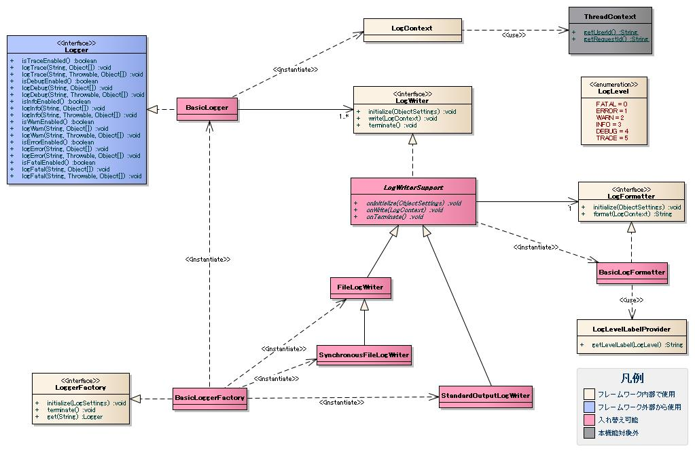

# ログ出力

## 概要

明示的な初期処理は不要。ただしリソース解放のため終了処理が必要で、フレームワークの他の機能で実行する。Webアプリケーションでは [../../handler/NablarchServletContextListener](../handlers/handlers-NablarchServletContextListener.md) で終了処理を行う。

**クラス**: `nablarch.core.log.basic.LogLevel`

ログレベルを表す列挙型。

**クラス**: `nablarch.core.log.basic.SynchronousFileLogWriter`

`FileLogWriter`を継承。ロックファイルを用いた排他制御で、複数プロセスから同一ファイルへのログ出力を直列化できる。

| プロパティ名 | 説明 |
|---|---|
| className | `nablarch.core.log.basic.SynchronousFileLogWriter`を指定 |
| filePath | 書き込み先ファイルパス |
| encoding | 文字エンコーディング |
| outputBufferSize | 出力バッファサイズ（KB単位、1000B=1KB換算）、デフォルト8KB |
| maxFileSize | ファイル最大サイズ（KB単位） |
| formatter.className | ログフォーマッタクラス名 |
| level | 出力ログレベル（このレベル以上を出力） |
| lockFilePath | ロックファイルパス |
| lockRetryInterval | ロック取得再試行間隔（ミリ秒） |
| lockWaitTime | ロック取得待機時間（ミリ秒） |
| failureCodeCreateLockFile | ロックファイル生成失敗時の障害通知コード |
| failureCodeReleaseLockFile | ロックファイル解放失敗時の障害通知コード |
| failureCodeForceDeleteLockFile | ロックファイル強制削除失敗時の障害通知コード |
| failureCodeInterruptLockWait | ロック待ち割り込み発生時の障害通知コード |

```bash
writerNames=monitorFile
writer.monitorFile.className=nablarch.core.log.basic.SynchronousFileLogWriter
writer.monitorFile.filePath=/var/log/app/monitor.log
writer.monitorFile.encoding=UTF-8
writer.monitorFile.outputBufferSize=8
writer.monitorFile.maxFileSize=50000
writer.monitorFile.formatter.className=nablarch.core.log.basic.BasicLogFormatter
writer.monitorFile.level=ERROR
writer.monitorFile.lockFilePath=/var/log/lock/monitor.lock
writer.monitorFile.lockRetryInterval=10
writer.monitorFile.lockWaitTime=3000
writer.monitorFile.failureCodeCreateLockFile=MSG00101
writer.monitorFile.failureCodeReleaseLockFile=MSG00102
writer.monitorFile.failureCodeForceDeleteLockFile=MSG00103
writer.monitorFile.failureCodeInterruptLockWait=MSG00104
```

**障害発生時の動作** (:ref:`FailureLogWriteDetail`):
1. ロック取得待機時間超過時: ロックファイルを強制削除→自スレッド用ロックファイル生成→ログ出力
2. ロックファイル強制削除不可時: ロック未取得のまま強制ログ出力して処理終了（呼び出し元に正常リターン）
3. ロックファイル生成失敗またはロック待ち割り込み発生時: ロック未取得のまま強制ログ出力して処理終了

ロック未取得で強制ログ出力する際、複数プロセスが競合するとログが正常出力されない場合がある。

障害発生時は同一ログファイルに障害ログも出力。障害コードを設定することで障害通知ログのフォーマットで出力可能（通常の障害通知と同様の監視が可能になるため推奨）。

| 障害の種類 | ログレベル | プロパティ名 | メッセージ設定例（`{0}`にはロックファイルパスが設定される） | デフォルト出力ログ（障害コードなし） |
|---|---|---|---|---|
| ロックファイルが生成できない | FATAL | failureCodeCreateLockFile | ロックファイルの生成に失敗しました。おそらくロックファイルのパスが間違っています。ロックファイルパス=[{0}]。 | failed to create lock file. perhaps lock file path was invalid. lock file path=[{0}]. |
| ロックファイルを解放（削除）できない | FATAL | failureCodeReleaseLockFile | ロックファイルの削除に失敗しました。ロックファイルパス=[{0}]。 | failed to delete lock file. lock file path=[{0}]. |
| ロックファイルを強制削除できない | FATAL | failureCodeForceDeleteLockFile | ロックファイルの強制削除に失敗しました。ロックファイルが不正に開かれています。ロックファイルパス=[{0}]。 | failed to delete lock file forcedly. lock file was opened illegally. lock file path=[{0}]. |
| ロック取得待ちで割り込みが発生 | FATAL | failureCodeInterruptLockWait | ロック取得中に割り込みが発生しました。 | interrupted while waiting for lock retry. |

> **警告**: 障害コードを設定した場合、障害通知ログのフォーマットで同一ログファイルにログが出力されるが、障害解析ログは出力されない。

`LogLevelLabelProvider`クラスを使用して、ログレベルを表す文言をプロパティファイルで設定できる。デフォルトは`LogLevel`列挙型の名称（FATAL, ERROR, WARN, INFO, DEBUG, TRACE）。`BasicLogFormatter`クラスが`LogLevelLabelProvider`を使用して文言変更をサポートする。

設定方法: `<ログライタのプレフィックス>.formatter.label.<LogLevel列挙型の名称の小文字>` に文言を指定する。

```properties
writer.appFile.formatter.label.fatal=F
writer.appFile.formatter.label.error=E
writer.appFile.formatter.label.warn=W
writer.appFile.formatter.label.info=I
writer.appFile.formatter.label.debug=D
writer.appFile.formatter.label.trace=T
```

文言変更後の出力例:
```
2011-02-28 12:33:39.569 -F- root [null] boot_proc = [] req_id = [null] usr_id = [null] FATALメッセージ
2011-02-28 12:33:39.569 -E- root [null] boot_proc = [] req_id = [null] usr_id = [null] ERRORメッセージ
```

<details>
<summary>keywords</summary>

ログ出力, 初期処理不要, 終了処理, NablarchServletContextListener, リソース解放, LogLevel, nablarch.core.log.basic.LogLevel, ログレベル, 列挙型, SynchronousFileLogWriter, nablarch.core.log.basic.SynchronousFileLogWriter, FileLogWriter, ロックファイル, 排他制御, 複数プロセス, lockFilePath, lockRetryInterval, lockWaitTime, failureCodeCreateLockFile, failureCodeReleaseLockFile, failureCodeForceDeleteLockFile, failureCodeInterruptLockWait, 障害ログ, LogLevelLabelProvider, BasicLogFormatter, formatter.label, ログレベル文言変更

</details>

## 特徴

## ログ出力機能の拡張性

ログ出力機能は以下3つの処理で構成され、それぞれ個別に差し替え可能:

- a) ログの書き込み処理
- b) ログのフォーマット処理
- c) アプリケーションからのログ出力要求受付処理

Log4Jについては専用のc実装を提供済み。過去プロジェクトのログ出力ライブラリを使用したい場合はcを差し替える。

## 提供する各種ログ

- :ref:`障害通知ログ<FailureLog>`
- :ref:`障害解析ログ<FailureLog>`
- :ref:`SQLログ<SqlLog>`
- :ref:`パフォーマンスログ<PerformanceLog>`
- :ref:`HTTPアクセスログ<HttpAccessLog>`

各ログのフォーマットは設定で変更可能。

フレームワーク実装の設定は、ロガーファクトリの設定と同じプロパティファイルに記述する。プロパティファイルのパスの指定方法は :ref:`loggerFactorySetting` 参照。記述ルールの詳細は :ref:`propsSettingRules` 参照。

```bash
loggerFactory.className=nablarch.core.log.basic.BasicLoggerFactory
writerNames=appFile,sqlFile,monitorFile,stdout
writer.appFile.className=nablarch.core.log.basic.FileLogWriter
writer.appFile.filePath=/var/log/app/app.log
writer.sqlFile.className=nablarch.core.log.basic.FileLogWriter
writer.sqlFile.filePath=/var/log/app/sql.log
writer.monitorFile.className=nablarch.core.log.basic.SynchronousFileLogWriter
writer.monitorFile.filePath=/var/log/app/monitoring.log
writer.monitorFile.lockFilePath=/var/log/lock/monitor.lock
writer.monitorFile.failureCodeCreateLockFile=MSG00101
writer.monitorFile.failureCodeReleaseLockFile=MSG00102
writer.monitorFile.failureCodeForceDeleteLockFile=MSG00103
writer.monitorFile.failureCodeInterruptLockWait=MSG00104
writer.stdout.className=nablarch.core.log.basic.StandardOutputLogWriter
availableLoggersNamesOrder=sql,monitoring,access,validation,root
loggers.root.nameRegex=.*
loggers.root.level=WARN
loggers.root.writerNames=appFile
loggers.monitoring.nameRegex=MONITOR
loggers.monitoring.level=ERROR
loggers.monitoring.writerNames=appFile,monitorFile
loggers.sql.nameRegex=SQL
loggers.sql.level=DEBUG
loggers.sql.writerNames=sqlFile
loggers.access.nameRegex=app\\.user\\.UserManager
loggers.access.level=INFO
loggers.access.writerNames=appFile,stdout
loggers.validation.nameRegex=nablarch\\.core\\.validation\\..*
loggers.validation.level=DEBUG
loggers.validation.writerNames=stdout
```

> **警告**: `availableLoggersNamesOrder`は記述順に意味がある。ロガー取得時にここに記述した順番でマッチングを行い、最初にマッチしたロガーを返す。より限定的な正規表現を指定したロガー設定から順に記述すること。例えば`availableLoggersNamesOrder=root,sql`と記述すると全てのロガー取得がロガー設定「root」にマッチし、ロガー名「SQL」でのログ出力が`sqlFile`ではなく`appFile`に出力される。

> **警告**: `availableLoggersNamesOrder`と`loggers.*`で指定するロガー設定の名称は必ず一致させること。`BasicLoggerFactory`の初期処理で不一致をチェックし、一致しない場合は例外をスローする。`availableLoggersNamesOrder`から設定名を削除した場合は、対応する`loggers.xxx.*`の設定も明示的に削除すること。

> **注意**: ロガー設定では全てのログ出力にマッチするロガー設定（`nameRegex=.*`）を1つ用意し、`availableLoggersNamesOrder`の最後に指定することを推奨する。設定漏れがあっても重要なログを逃す事態を防ぐことができる。

```bash
availableLoggersNamesOrder=sql,app,root
loggers.root.nameRegex=.*
loggers.root.level=WARN
loggers.root.writerNames=appFile
```

プロパティファイルの設定はシステムプロパティを使用して同じキー名で上書き可能。`-D`オプションによりプロセス毎にログ出力設定を変更できる。例: `java -Dloggers.root.level=INFO ...`

`BasicLoggerFactory`クラスは初期処理完了後に各ログライタに対してロガー設定の情報をINFOレベルで出力する。

`LogWriterSupport`を継承したクラスでは、ログライタレベルで出力制御が可能。

ロガー設定はロガー名単位のため、同一ロガー名で異なるレベルを別々のファイルに出力できない。例: アプリケーションログはINFOレベルまで出力し、通知ログはERRORレベル以上のみ出力したい場合→ロガー設定でINFOを指定し、通知用ログライタの設定でERRORを指定することで対応。

```bash
writerNames=appFile,monitorFile

writer.appFile.className=nablarch.core.log.basic.FileLogWriter
writer.appFile.filePath=/var/log/app/app.log

writer.monitorFile.className=nablarch.core.log.basic.SynchronousFileLogWriter
writer.monitorFile.filePath=/var/log/app/monitor.log
writer.monitorFile.level=ERROR
writer.monitorFile.lockFilePath=/var/log/lock/monitor.lock
writer.monitorFile.failureCodeCreateLockFile=MSG00101
writer.monitorFile.failureCodeReleaseLockFile=MSG00102
writer.monitorFile.failureCodeForceDeleteLockFile=MSG00103
writer.monitorFile.failureCodeInterruptLockWait=MSG00104

availableLoggersNamesOrder=root

loggers.root.nameRegex=.*
loggers.root.level=INFO
loggers.root.writerNames=appFile,monitorFile
```

`appFile`はレベル未指定のためロガー設定のINFO以上が出力。`monitorFile`はERROR指定のためERROR以上のみ出力。

ログライタとログフォーマッタのカスタマイズが可能。新規ログライタは`LogWriter`インタフェースを実装、新規ログフォーマッタは`LogFormatter`インタフェースを実装したクラスを作成する。

<details>
<summary>keywords</summary>

ログ出力機能の拡張性, 書き込み処理, フォーマット処理, ログ出力要求受付処理, Log4J, FailureLog, SqlLog, PerformanceLog, HttpAccessLog, 差し替え可能, BasicLoggerFactory, nablarch.core.log.basic.BasicLoggerFactory, writerNames, availableLoggersNamesOrder, FileLogWriter, SynchronousFileLogWriter, StandardOutputLogWriter, ログ設定, プロパティファイル設定, システムプロパティ上書き, LogWriterSupport, ログレベル出力制御, ロガー設定, ログライタレベル設定, 出力制御, LogWriter, LogFormatter, ログライタカスタマイズ, ログフォーマッタカスタマイズ

</details>

## 要求

## 実装済み

- ログ出力機能の実装を差し替え可能
- ログ毎にログレベルと出力先を設定可能
- パッケージ単位・クラス単位で設定対象のログを絞り込み可能
- 1つのログを複数の出力先に出力可能
- ログの出力先を変更可能
- ログをファイルに出力可能
- ログファイルが指定サイズに達したら出力ファイルを自動切り替え（バックアップ後初期化）
- ログのフォーマットを変更可能
- ログレベルを表す文言を変更可能
- オブジェクト情報（クラス名・フィールド値）をログ出力可能
- エラー情報（例外クラスのメッセージ・スタックトレース）をログ出力可能
- ログのフォーマットを設定のみで変更可能
- 性能測定目的のログ集計が可能
- アクセスログの取得が可能（リクエストパラメータの出力・特定項目のマスク、アクション処理結果のログ出力）
- ログ監視ツールから監視可能なフォーマットでのログ出力が可能
- 複数プロセスから1つのログファイルへの出力が可能

## 未実装

- データベースへのログ出力
- 日付毎の出力ファイル自動切り替え

## 未検討

- リクエストID単位でログの出力有無を制御
- アプリケーションを停止することなく設定変更を反映
- ログファイルの改竄防止
- ファイルパスへの置換文字の使用
- ログ出力用スレッドをワーカスレッドから独立させる
- ログ出力機能の実装を部分的に差し替え（Log4Jのアペンダだけ使用するなど）
- 外部ツールからログの出力ファイルを切り替え
- ログに出力するスタックトレース内のメッセージをマスク
- フレームワーク処理の実行時間を測定
- リクエスト処理の実行時間の上限値を指定し、超過時にアラートをログ出力
- 1トランザクションにおけるSQL文の発行回数の上限値を指定し、超過時にアラートをログ出力

ロガー設定では3つのプロパティを指定する。

| プロパティ | 説明 |
|---|---|
| `<プレフィックス>.nameRegex` | このロガー設定の対象となるロガーを絞り込むための正規表現 |
| `<プレフィックス>.level` | ログ出力有無の基準とするログレベル |
| `<プレフィックス>.writerNames` | 出力先ログライタの名称（複数可） |

`nameRegex`はロガー設定の対象ロガーを絞り込むために使用し、ロガー取得時に指定されたロガー名（`LoggerManager#get`メソッドの引数）に対してマッチングを行う。`level`と`writerNames`は`nameRegex`で絞り込まれたロガーに対して設定される。

`LoggerManager#get`メソッドでクラスを指定した場合は、FQCNがロガー名となる。例えば`LoggerManager.get(NumberRangeValidator.class)`の場合、ロガー名は`nablarch.core.validation.validator.NumberRangeValidator`となる。これにより`nameRegex=nablarch\.core\.validation\..*`のようなパターンでクラスベースのロガーを一括して対象にできる。

`nablarch.core.validation`パッケージ以下を対象にする設定例:

```bash
loggers.sample.nameRegex=nablarch\\.core\\.validation\\..*
loggers.sample.level=INFO
loggers.sample.writerNames=xxx,yyy,zzz
```

`RequiredValidator`のみを対象にする設定例:

```bash
loggers.sample.nameRegex=nablarch\\.core\\.validation\\.validator\\.RequiredValidator
loggers.sample.level=DEBUG
loggers.sample.writerNames=aaa,bbb,ccc
```

**クラス**: `nablarch.core.log.basic.StandardOutputLogWriter`

標準出力にログを書き込む。開発時のコンソール確認用。

```bash
writerNames=stdout
writer.stdout.className=nablarch.core.log.basic.StandardOutputLogWriter
writer.stdout.formatter.className=nablarch.core.log.basic.BasicLogFormatter
```

> **警告**: 開発時のデバッグ設定のまま本番運用で使用しないこと。

- 新規ログライタ: `LogWriter`インタフェースを実装したクラスを作成する。
- ログフォーマッタを使用するログライタ: `LogWriterSupport`クラスを継承して作成すると共通処理を利用できる。

<details>
<summary>keywords</summary>

ログレベル, 出力先設定, ファイルローテーション, アクセスログ, 複数プロセス, 実装済み, 未実装, マスク, 未検討, nameRegex, level, writerNames, LoggerManager, ロガー設定, 正規表現マッチング, FQCN, クラス指定, StandardOutputLogWriter, nablarch.core.log.basic.StandardOutputLogWriter, 標準出力, コンソール出力, LogWriter, LogWriterSupport, ログライタ実装

</details>

## ログ出力要求受付処理

ログ出力要求受付処理に関するクラス構成を示すセクション。クラス図・各クラスの責務・インタフェース定義・クラス定義で構成される。

- ロガーのインスタンスはロガー設定毎に生成され、複数のログ出力を要求するインスタンスから使用される。
- ログライタのインスタンスはログライタの設定毎に生成され、複数のロガーから使用される。


フレームワーク実装が提供するログフォーマッタの使用方法。`BasicLogFormatter`クラスが汎用フォーマッタとして提供されている。

- 新規ログフォーマッタ: `LogFormatter`インタフェースを実装したクラスを作成する。
- ログレベル文言の設定変更: `LogLevelLabelProvider`クラスを使用する。
- ログ出力時のパラメータ追加: `Logger`インタフェースのログ出力メソッドに`Object... options`可変長引数が用意されている。パラメータを増やす場合はoptions引数を規定して使用する。

```java
// Logger#logInfoメソッドのシグネチャ
public void logInfo(String message, Object... options)
public void logInfo(String message, Throwable cause, Object... options)
```

<details>
<summary>keywords</summary>

ログ出力要求受付処理, Log_LoggerProcess, ロガー, ロガーファクトリ, ロガーマネージャ, ロガーインスタンス構造, ログライタインスタンス, インスタンス共有, ログフォーマッタ, BasicLogFormatter, フォーマッタ設定, LogFormatter, LogLevelLabelProvider, Logger, options, ログフォーマッタ実装, logInfo

</details>

## クラス図


フレームワーク実装が提供するログライタ: `nablarch.core.log.basic.FileLogWriter`、`nablarch.core.log.basic.SynchronousFileLogWriter`、`nablarch.core.log.basic.StandardOutputLogWriter`。

**クラス**: `nablarch.core.log.basic.BasicLogFormatter`

汎用的なログフォーマッタ。

特徴:
- 日時、リクエストID、ユーザIDなど最低限必要な情報を出力
- システムプロパティで指定されたプロセス名（起動プロセス）をログに出力
- オブジェクトのフィールド情報を出力（`$information$`プレースホルダ）
- 例外オブジェクトのスタックトレースを出力（`$stackTrace$`プレースホルダ）
- フォーマットを設定のみで変更可能

出力項目: 起動プロセス（[boot_process](#)）、処理方式（[processing_system](#)）、実行時ID（[execution_id](../../about/about-nablarch/about-nablarch-concept.md)）

`BasicLogFormatter`は`LogItem`インタフェースで各プレースホルダの出力項目を取得する。

既存プレースホルダの出力内容変更・新規プレースホルダ追加の手順:
1. `LogItem`を実装したカスタムクラスを作成する（`ObjectSettings`からプロパティ取得可）。
2. `BasicLogFormatter`を継承したクラスで`getLogItems`メソッドをオーバーライドし、`logItems.put("$placeholder$", new CustomItem(settings))`でカスタム項目を登録する。

設定例（ログフォーマッタの設定から起動プロセスを取得する場合）:
```properties
writer.appFile.formatter.className=nablarch.core.log.basic.CustomLogFormatter
writer.appFile.formatter.format=$logLevel$ $loggerName$ [$bootProcess$]
writer.appFile.formatter.bootProcess=CUSTOM_PROCESS
```

```java
public class CustomBootProcessItem implements LogItem<LogContext> {
    private String bootProcess;
    public CustomBootProcessItem(ObjectSettings settings) {
        bootProcess = settings.getProp("bootProcess");
    }
    public String get(LogContext context) {
        return bootProcess;
    }
}

public class CustomLogFormatter extends BasicLogFormatter {
    protected Map<String, LogItem<LogContext>> getLogItems(ObjectSettings settings) {
        Map<String, LogItem<LogContext>> logItems = super.getLogItems(settings);
        logItems.put("$bootProcess$", new CustomBootProcessItem(settings));
        return logItems;
    }
}
```

<details>
<summary>keywords</summary>

クラス図, ログ出力要求受付処理, Log_ClassDiagram, FileLogWriter, SynchronousFileLogWriter, StandardOutputLogWriter, ログライタ一覧, BasicLogFormatter, nablarch.core.log.basic.BasicLogFormatter, 起動プロセス, 処理方式, 実行時ID, $information$, $stackTrace$, ログフォーマッタ, LogItem, getLogItems, CustomLogFormatter, CustomBootProcessItem, プレースホルダ追加, ObjectSettings

</details>

## 各クラスの責務

ログ出力要求受付処理を構成するインタフェース・クラスの責務一覧。インタフェース定義とクラス定義の2つで構成される。

**クラス**: `nablarch.core.log.basic.FileLogWriter`

ファイルにログを書き込むログライタ。

特徴:
- ログフォーマッタを設定で指定できる
- ログファイルが指定サイズに達したら出力ファイルを自動で切り替える
- 初期処理・終了処理・ログファイル切り替え時に書き込み先のログファイルにINFOレベルでメッセージを出力する

設定例（記述ルールは :ref:`propsSettingRules` 参照）:

```bash
writerNames=appFile
writer.appFile.className=nablarch.core.log.basic.FileLogWriter
writer.appFile.filePath=/var/log/app/app.log
writer.appFile.encoding=UTF-8
writer.appFile.outputBufferSize=8
writer.appFile.maxFileSize=50000
writer.appFile.formatter.className=nablarch.core.log.basic.BasicLogFormatter
writer.appFile.level=INFO
```

設定プロパティ:

| プロパティ名 | 説明 |
|---|---|
| `filePath` | 書き込み先ファイルパス |
| `encoding` | 書き込み時の文字エンコーディング |
| `outputBufferSize` | 出力バッファサイズ（KB単位、1000バイト=1KB、デフォルト8KB） |
| `maxFileSize` | 書き込み先ファイルの最大サイズ（KB単位） |
| `formatter.className` | ログフォーマッタのクラス名 |
| `level` | ログレベル（`LogLevel`列挙型の名称、指定したレベル以上を全て出力） |

`maxFileSize`を指定した場合、出力ファイルが最大サイズに達すると自動で切り替わる。古いログファイルは`<ファイル名>.yyyyMMddHHmmssSSS.old`の命名ルールで同じディレクトリにバックアップされる。

起動プロセス: アプリケーションを起動した実行環境を特定する名前。サーバ名やJOBIDなどの識別文字列を組み合わせることで、同一サーバの複数プロセスから出力されたログの実行環境を特定できる。プロジェクト毎にID体系を規定することを想定。

**設定方法**: システムプロパティのキー `nablarch.bootProcess` で指定（javaコマンドの`-D`オプション）。設定がない場合はブランク。

```bash
>java -Dnablarch.bootProcess=APP0001 ...
```

**ロガーファクトリの設定**:

| プロパティ名 | 設定値 |
|---|---|
| loggerFactory.className | ロガーファクトリのクラス名。`LoggerFactory`を実装したクラスのFQCNを指定する。 |

**ログライタの設定**:

| プロパティ名 | 必須 | 設定値 |
|---|---|---|
| writerNames | ○ | 使用する全ログライタの名称。複数はカンマ区切り。`"writer." + <名称>`をキープレフィックスとして各ログライタの設定を行う。 |
| writer.<ログライタの名称>.className | ○ | ログライタのクラス名。`LogWriter`を実装したクラスのFQCNを指定する。 |
| writer.<ログライタの名称>.<プロパティ名> | | ログライタ毎のプロパティ値。詳細は各ログライタのJavadoc参照。 |

**ロガーの設定**:

| プロパティ名 | 必須 | 設定値 |
|---|---|---|
| availableLoggersNamesOrder | ○ | 使用する全ロガー設定の名称。複数はカンマ区切り。`"loggers." + <名称>`をキープレフィックスとして各ロガーの設定を行う。 |
| loggers.<ロガー設定の名称>.nameRegex | ○ | ロガー名とのマッチングに使用する正規表現。`LoggerManager#get`メソッドの引数に指定されたロガー名に対してマッチングを行う。 |
| loggers.<ロガー設定の名称>.level | ○ | ログレベルの名称（`LogLevel`列挙型の名称）。指定レベル以上のログを全て出力する。 |
| loggers.<ロガー設定の名称>.writerNames | ○ | 出力先ログライタの名称。複数はカンマ区切り。 |

<details>
<summary>keywords</summary>

Logger, LoggerFactory, LoggerManager, ロガー, ロガーファクトリ, ロガーマネージャ, FileLogWriter, nablarch.core.log.basic.FileLogWriter, filePath, encoding, outputBufferSize, maxFileSize, formatter.className, level, ログファイル自動切り替え, ファイルローテーション, BasicLogFormatter, 起動プロセス, nablarch.bootProcess, bootProcess, システムプロパティ, loggerFactory.className, writerNames, availableLoggersNamesOrder, nameRegex, LogWriter, ロガーファクトリ設定, ログライタ設定, ロガー設定

</details>

## インタフェース定義

| インタフェース名 | 概要 |
|---|---|
| `nablarch.core.log.Logger` | ログを出力するインタフェース。ログ出力機能の実装毎に実装クラスを作成する。実装クラス・インスタンスをロガーと呼ぶ。 |
| `nablarch.core.log.LoggerFactory` | ロガーを生成するインタフェース。フレームワーク内部でログ出力実装に対応するロガーを生成するために使用する。実装クラス・インスタンスをロガーファクトリと呼ぶ。 |

処理方式: 画面オンライン処理、バッチ処理、ディレード処理などを識別する名前。アプリケーションの処理方式を識別したい場合にプロジェクト毎に規定して使用。

**設定方法**: プロパティファイルのキー `nablarch.processingSystem` で指定（プロパティファイルのパス指定方法は :ref:`loggerFactorySetting` を参照）。設定がない場合はブランク。

```bash
nablarch.processingSystem=1
```

**FileLogWriterの設定** (`:ref:\`file_log_writer_config\``):

| プロパティ名 | 必須 | デフォルト値 | 設定値 |
|---|---|---|---|
| writer.<名称>.level | ○ | | LogLevel列挙型の名称。指定レベル以上を出力。未指定時は全レベル出力。 |
| writer.<名称>.formatter.className | | | LogFormatterを実装したクラスのFQCN。 |
| writer.<名称>.formatter.<プロパティ名> | | | ログフォーマッタ毎のプロパティ値。 |
| writer.<名称>.filePath | ○ | | 書き込み先ファイルパス。 |
| writer.<名称>.encoding | | システムプロパティ(file.encoding) | 書き込み時の文字エンコーディング。`java.nio.charset.Charset#forName`に指定する形式と同じ。 |
| writer.<名称>.outputBufferSize | | 8KB | 出力バッファサイズ（キロバイト、1KB=1000バイト）。1以上を指定する。 |
| writer.<名称>.maxFileSize | | 自動切替なし | 書き込み先ファイルの最大サイズ（キロバイト）。超過時に自動切替。古いファイル名: `<ファイル名>.yyyyMMddHHmmssSSS.old`。0以下または解析不能な値の場合は自動切替なし。 |

**SynchronousFileLogWriterの設定**（FileLogWriter設定に加えて）:

| プロパティ名 | 必須 | デフォルト値 | 設定値 |
|---|---|---|---|
| writer.<名称>.lockFilePath | ○ | | ロックファイルのパス。 |
| writer.<名称>.lockRetryInterval | | 1ms | ロック取得失敗時の再試行間隔（ミリ秒）。 |
| writer.<名称>.lockWaitTime | | 1800ms | ロック取得待機時間（ミリ秒）。超過時は例外をスロー。 |
| writer.<名称>.failureCodeCreateLockFile | | `"failed to create lock file. perhaps lock file path was invalid. lock file path=[{0}]."`（{0}はロックファイルのパス） | ロックファイル生成失敗時の障害通知コード。 |
| writer.<名称>.failureCodeReleaseLockFile | | `"failed to delete lock file. lock file path=[{0}]."`（{0}はロックファイルのパス） | ロックファイル解放（削除）失敗時の障害通知コード。 |
| writer.<名称>.failureCodeForceDeleteLockFile | | `"failed to delete lock file forcedly. lock file was opened illegally. lock file path=[{0}]."`（{0}はロックファイルのパス） | ロックファイル強制削除失敗時の障害通知コード。 |
| writer.<名称>.failureCodeInterruptLockWait | | `"interrupted while waiting for lock retry."` | ロック待ち中の割り込み発生時の障害通知コード。 |

**BasicLogFormatterの設定**:

| プロパティ名 | 必須 | デフォルト値 | 設定値 |
|---|---|---|---|
| writer.<名称>.formatter.format | | | フォーマット文字列。 |
| writer.<名称>.formatter.datePattern | | yyyy-MM-dd HH:mm:ss.SSS | 日時フォーマットパターン。 |
| writer.<名称>.formatter.label.<LogLevel列挙型の名称の小文字> | | LogLevel列挙型の名称 | ログレベルを表す文言。 |

<details>
<summary>keywords</summary>

nablarch.core.log.Logger, nablarch.core.log.LoggerFactory, Logger, LoggerFactory, ロガー, ロガーファクトリ, 処理方式, nablarch.processingSystem, processingSystem, FileLogWriter, SynchronousFileLogWriter, BasicLogFormatter, filePath, maxFileSize, lockFilePath, formatter.format, outputBufferSize, encoding, lockRetryInterval, lockWaitTime, failureCodeCreateLockFile, failureCodeReleaseLockFile, failureCodeForceDeleteLockFile, failureCodeInterruptLockWait, datePattern

</details>

## クラス定義

### a) ロガー

| クラス名 | 概要 |
|---|---|
| `nablarch.core.log.basic.BasicLogger` | ロガーの基本実装クラス。 |
| `nablarch.core.log.log4j.Log4JLogger` | Log4Jを使用してログ出力を行うクラス。 |

### b) ロガーファクトリ

| クラス名 | 概要 |
|---|---|
| `nablarch.core.log.basic.BasicLoggerFactory` | BasicLoggerを生成するロガーファクトリの基本実装クラス。 |
| `nablarch.core.log.log4j.Log4JLoggerFactory` | Log4JLoggerを生成するクラス。 |

### c) その他のクラス

| クラス名 | 概要 |
|---|---|
| `nablarch.core.log.LoggerManager` | ログ出力機能の全体を取りまとめるクラス。設定で指定されたロガーファクトリを生成・保持し、初期処理・終了処理・ロガー生成をロガーファクトリに委譲する。 |
| `nablarch.core.log.LogSettings` | ログ出力機能の設定をロードして保持するクラス。 |

実行時ID: リクエストIDに対するアプリケーションの個々の実行を識別するID。1つのリクエストIDに対して実行された数だけ発行される（1対多）。複数ログを紐付けるために使用。

**発行タイミング**: 各処理方式のThreadContextを初期化するタイミングで発行し、ThreadContextに設定。

**ID体系**:
```
起動プロセス（指定された場合のみ）＋システム日時(yyyyMMddHHmmssSSS)＋連番(4桁)
```

ログの種類:

| ログの種類 | 説明 |
|---|---|
| :ref:`障害通知ログ<FailureLog>` | 障害発生時の1次切り分けに必要な情報を出力する。 |
| :ref:`障害解析ログ<FailureLog>` | 障害原因特定に必要な情報を出力する。 |
| :ref:`SQLログ<SqlLog>` | SQL文の実行時間とSQL文を出力する。 |
| :ref:`パフォーマンスログ<PerformanceLog>` | 任意の処理の実行時間とメモリ使用量を出力する。 |
| :ref:`HTTPアクセスログ<HttpAccessLog>` | 画面オンライン処理のアプリケーション実行状況・性能測定・負荷測定情報、全リクエスト・レスポンス情報（証跡ログ）を出力する。 |

障害通知ログと障害解析ログを合わせて障害ログと呼ぶ。

<details>
<summary>keywords</summary>

nablarch.core.log.basic.BasicLogger, nablarch.core.log.log4j.Log4JLogger, nablarch.core.log.basic.BasicLoggerFactory, nablarch.core.log.log4j.Log4JLoggerFactory, nablarch.core.log.LoggerManager, nablarch.core.log.LogSettings, BasicLogger, Log4JLogger, BasicLoggerFactory, Log4JLoggerFactory, LoggerManager, LogSettings, 実行時ID, executionId, ThreadContext, リクエストID, 実行識別, 障害通知ログ, 障害解析ログ, SQLログ, パフォーマンスログ, HTTPアクセスログ, FailureLog, SqlLog, PerformanceLog, HttpAccessLog, ログの種類

</details>

## ログレベルの定義

ログレベルは FATAL > ERROR > WARN > INFO > DEBUG > TRACE の6段階。FATAL から TRACE に向かって順にレベルが低くなる。指定されたレベル以上のログをすべて出力する（例：WARN 指定時は FATAL・ERROR・WARN のみ出力）。

| レベル | 意味 |
|---|---|
| FATAL | アプリケーションの継続が不可能になる深刻な問題。監視必須、即通報・即対応が必要。 |
| ERROR | アプリケーションの継続に支障をきたす問題。監視必須だが FATAL ほどの緊急性はない。 |
| WARN | すぐには影響しないが放置するとアプリケーションの継続に支障をきたす恐れがある事象。できれば監視した方が良い。 |
| INFO | 本番運用時にアプリケーション情報を出力するログレベル。アクセスログや統計ログが該当。 |
| DEBUG | 開発時にデバッグ情報を出力するログレベル。SQLログや性能ログが該当。 |
| TRACE | 開発時にデバッグ情報よりさらに細かい情報を出力したい場合に使用。 |

> **警告（FATAL/ERROR/WARN/INFO）**: 通常は運用監視体制と密接に関わるためフレームワークで出力する。例外として業務的に必要なログ（バッチ処理の処理件数など）はプロジェクトの方針に従い個別アプリケーションからも出力可能。

> **警告（DEBUG/TRACE）**: ログの出力量が増えることにより性能劣化とログファイルのサイズ肥大化が発生するため、通常の本番運用時には出力してはならない。

通常は本番運用時に INFO レベルでログを出力する。ログファイルのサイズが肥大化しないよう各プロジェクトで出力内容を規定すること。

BasicLogFormatterはプレースホルダを使用してフォーマットを指定する。

| プレースホルダ | 説明 |
|---|---|
| $date$ | ログ出力要求時点の日時 |
| $logLevel$ | ログレベル（デフォルトはLogLevel列挙型の名称。変更は :ref:`logLevelLabelChanges` を参照） |
| $loggerName$ | ロガー設定の名称 |
| $bootProcess$ | [boot_process](#) の名前 |
| $processingSystem$ | [processing_system](#) の名前 |
| $requestId$ | ログ出力要求時点のリクエストID |
| $executionId$ | ログ出力要求時点の [execution_id](../../about/about-nablarch/about-nablarch-concept.md) |
| $userId$ | ログ出力要求時点のログインユーザのユーザID |
| $message$ | ログのメッセージ（指定がない場合はブランク） |
| $information$ | オプション情報オブジェクトのフィールド情報（先頭に改行を付加）。基本データ型ラッパ・CharSequence・Dateクラスの場合はtoString()結果のみ表示。オブジェクト情報の指定がない場合は表示しない。 |
| $stackTrace$ | エラー情報の例外オブジェクトのスタックトレース（先頭に改行を付加）。エラー情報の指定がない場合は表示しない。 |

フォーマットに改行コード・タブ文字を含める場合は`\n`・`\t`を使用（Java同様の記述）。改行コードはJava標準のシステムプロパティ`line.separator`から取得するため、`line.separator`を変更しなければOSの改行コードが使用される。BasicLogFormatterは`\n`・`\t`という文字列自体を出力することはできない。

**デフォルトフォーマット**:
```
$date$ -$logLevel$- $loggerName$ [$executionId$] boot_proc = [$bootProcess$] proc_sys = [$processingSystem$] req_id = [$requestId$] usr_id = [$userId$] $message$$information$$stackTrace$
```

**datePatternプロパティ**: 日時フォーマットのパターンを変更可能。

```bash
writer.appFile.formatter.className=nablarch.core.log.basic.BasicLogFormatter
writer.appFile.formatter.datePattern=yyyy/MM/dd HH:mm:ss[SSS]
writer.appFile.formatter.format=$date$ -$logLevel$- $loggerName$ [$executionId$]\n\tboot_proc = [$bootProcess$]\n\tproc_sys = [$processingSystem$]\n\treq_id = [$requestId$]\n\tusr_id = [$userId$]\n\t$message$$information$$stackTrace$
```

各種ログは :ref:`Log_LoggerProcess` を使用してログ出力を行う。各種ログの共通項目は :ref:`Log_BasicLogFormatter` の出力項目を使用する。フレームワーク以外のログ出力実装を使用する場合は :ref:`Log_BasicLogFormatter` と同等の出力項目を出力できるように実装が必要。

各種ログのフォーマットは以下2つの組み合わせ:
1. 共通項目のフォーマット（BasicLogFormatterのフォーマット、`$message$`プレースホルダ含む）
2. 個別項目のフォーマット（各種ログの個別項目をフォーマットした結果を`$message$`に指定）

設定例（HTTPアクセスログ）:
```properties
# 共通項目のフォーマット
$date$ req_id = [$requestId$] <$message$> usr_id = [$userId$]

# 個別項目のフォーマット
url:$url$ port:$port$ method:$method$
```

出力例:
```
2011-02-07 19:07:30.970 req_id = [USERS00302] <url:/action/management/user/UserRegisterAction/USERS00302 port:8090 method:POST> usr_id = [0000000001]
```

各種ログの詳細:
- [01/01_FailureLog](libraries-01_FailureLog.md)
- [01/02_SqlLog](libraries-02_SqlLog.md)
- [01/03_PerformanceLog](libraries-03_PerformanceLog.md)
- [01/04_HttpAccessLog](libraries-04_HttpAccessLog.md)

<details>
<summary>keywords</summary>

ログレベル, FATAL, ERROR, WARN, INFO, DEBUG, TRACE, Log_LevelDefinition, 本番運用, 性能劣化, 6段階, BasicLogFormatter, フォーマット指定, $date$, $logLevel$, $loggerName$, $bootProcess$, $processingSystem$, $requestId$, $executionId$, $userId$, $message$, $information$, $stackTrace$, datePattern, プレースホルダ, format, app-log.properties, message, 共通項目フォーマット, 個別項目フォーマット, FailureLog, SqlLog, PerformanceLog, HttpAccessLog

</details>

## ログ出力

アプリケーションからログを出力するにはロガーを使用する。ロガーはロガーマネージャから取得し、クラス変数（`static final`）に保持する。

```java
// ロガーの取得。クラス変数に保持する。
private static final Logger LOGGER = LoggerManager.get(UserManager.class);
```

```java
// ログの出力有無を事前にチェックし、ログ出力を行う。
if (LOGGER.isDebugEnabled()) {
    String message = "userId[" + user.getId() + "],name[" + user.getName() + "]";
    LOGGER.logDebug(message);
}
```

**ロガー名の指定:**

- クラスを指定した場合はそのクラスの FQCN がロガー名として使用される
- SQL ログや監視ログなど特定用途のログには用途を表す名前（`SQL`、`MONITOR` 等）を指定
- それ以外はクラスの FQCN を指定（クラス毎・パッケージ毎にログ出力設定を変更できる）

**事前チェック（`is<ログレベル>Enabled`）:**

メッセージの組み立て処理が必要な場合は `Logger#is<ログレベル>Enabled` メソッドで事前に出力有無をチェックすること。ログ出力を行わない場合に不要なメッセージ組み立て処理が実行されることによる性能劣化を防ぐためである。

ただし、常にログ出力することになっているレベルは事前チェック不要（ソースコードの可読性が落ちるため）。例えば本番運用時のログレベルが INFO であれば FATAL〜INFO レベルは事前チェックしなくてよい。

デフォルトフォーマットの出力例（システムプロパティ: `-Dnablarch.bootProcess=APP0001`、処理方式: `nablarch.processingSystem=1`、ThreadContext設定値: ユーザID=0000000001、リクエストID=USERS00302、実行時ID=APP001201102041542175080001）。

```java
User user = new User(null, "山田太郎", 28);
String userId = null;
String name = "山田花子";
long price = 2000000;

try {
    doSomething(); // new IllegalArgumentException("error test.")が送出される。
} catch (IllegalArgumentException e) {
    LOGGER.logInfo("テストメッセージ", e, user, userId, name, price);
    throw e;
}
```

ログ出力例（デフォルトフォーマット）:
```
2011-02-14 16:01:37.578 -INFO- root [APP001201102041542175080001] boot_proc = [APP001] proc_sys = [1] req_id = [USERS00302] usr_id = [0000000001] テストメッセージ
Object Information[0]: Class Name = [nablarch.core.log.basic.User]
    id = [null]
    name = [山田太郎]
    age = [28]
    toString() = [nablarch.core.log.basic.User@10b4199]
Object Information[1]: null
Object Information[2]: Class Name = [java.lang.String]
    toString() = [山田花子]
Object Information[3]: Class Name = [java.lang.Long]
    toString() = [2000000]
Stack Trace Information : 
java.lang.IllegalArgumentException: error test.
    at my.log.BasicLogFormatterSample.doSomething(BasicLogFormatterSample.java:50)
```

ログ出力例（フォーマット指定、datePattern使用）:
```
2011/02/14 16:08:55[107] -INFO- root [APP001201102041542175080001]
    boot_proc = [APP001]
    proc_sys = [1]
    req_id = [USERS00302]
    usr_id = [0000000001]
    テストメッセージ
```

各種ログの設定はクラスパス直下の`app-log.properties`ファイルに指定する。

- 配置場所の変更: システムプロパティ`nablarch.appLog.filePath`にファイルパスを指定する。
- 設定値の実行時上書き: プロパティ名と同じキー名でシステムプロパティを指定することで実行時に変更できる。

```bash
java -Dnablarch.appLog.filePath=/var/log/app/app-log.properties ...
```

<details>
<summary>keywords</summary>

LoggerManager.get, isDebugEnabled, loggerUses, ロガー取得, static final, ロガー名, FQCN, SQL, MONITOR, 事前チェック, logDebug, BasicLogFormatter, 出力例, フォーマット指定例, datePattern, ログ出力サンプル, nablarch.appLog.filePath, app-log.properties, システムプロパティ, 各種ログ設定

</details>

## 初期処理と終了処理

ログの出力先によってはリソースの確保と解放が必要なため、ロガーマネージャが初期処理と終了処理を行う。

- **初期処理**: 最初のロガー取得時にロガーマネージャが内部的に自動実行する。明示的な呼び出しは不要。
- **終了処理**: フレームワーク側で実行タイミングを判断できないため、**個別アプリケーション毎にアプリケーションの終了時に `LoggerManager#terminate` メソッドを呼び出すこと**。

> **警告**: 終了処理を呼び出さないと、アプリケーション終了後にメモリリークが発生する可能性があるため、必ず終了処理を呼び出すこと。

Webアプリケーションでの終了処理は [../../handler/NablarchServletContextListener](../handlers/handlers-NablarchServletContextListener.md) の機能で行う。

| ログレベル | 出力方針 |
|---|---|
| FATAL / ERROR | :ref:`障害ログ<FailureLog>`は障害監視対象。原則として1件の障害に対して1件の障害ログを出力する。:ref:`実行制御基盤<executionBase>`では単一のハンドラ（例外処理ハンドラ）が障害通知ログを出力する。出力レベルおよび方針の詳細は各実行制御基盤のハンドラ構成および例外処理ハンドラの仕様を参照。 |
| WARN | 障害発生時に連鎖した例外で障害ログとして出力できないものをWARNで出力する（例: 業務処理とトランザクション終了処理の両方で例外発生した場合、後者をWARNで出力）。 |
| INFO | URLパラメータ改竄エラーや認可エラーなど、アプリケーションの実行状況に関連するエラーを検知した場合に出力する。 |
| DEBUG | アプリケーション開発時のデバッグ情報を出力する。DEBUGレベル設定で開発に必要な情報が出力される。 |
| TRACE | フレームワーク開発時のデバッグ情報を出力する。アプリケーション開発での使用は想定していない。 |

<details>
<summary>keywords</summary>

初期処理, 終了処理, LoggerManager#terminate, メモリリーク, log_initialize_terminate, terminate, FATAL, ERROR, WARN, INFO, DEBUG, TRACE, 障害ログ, ログレベル, ログ出力方針, executionBase

</details>

## ロガーファクトリの設定方法

使用する実装（フレームワーク実装や Log4J など）はどのロガーファクトリを使用するかで決まる。プロパティファイルに `loggerFactory.className` キーで `LoggerFactory` インタフェースの実装クラスを設定する。

```bash
# フレームワーク実装を使用する例
loggerFactory.className=nablarch.core.log.basic.BasicLoggerFactory
```

```bash
# Log4J を使用する例
loggerFactory.className=nablarch.core.log.log4j.Log4JLoggerFactory
```

**プロパティファイルのパス指定:**

システムプロパティ `nablarch.log.filePath` をキーにファイルパスを指定する。クラスパスとファイルシステム上のパスのどちらも指定可能。

```bash
java -Dnablarch.log.filePath=classpath:nablarch/core/log/log.properties ...
```

システムプロパティを指定しなかった場合は、クラスパス直下の `log.properties` が使用される。

> プロパティファイルが存在しない場合は、ロガーマネージャが例外を送出する。

<details>
<summary>keywords</summary>

loggerFactory.className, BasicLoggerFactory, Log4JLoggerFactory, nablarch.log.filePath, log.properties, プロパティファイル, loggerFactorySetting, システムプロパティ

</details>

## 書き込み処理とフォーマット処理

ログの書き込み処理とフォーマット処理について示す。インタフェース定義とクラス定義で構成される。



<details>
<summary>keywords</summary>

書き込み処理, フォーマット処理, Log_Basic_ClassDiagram, クラス図, ログライタ, ログフォーマッタ

</details>

## 書き込み処理 インタフェース定義

| インタフェース名 | 概要 |
|---|---|
| `nablarch.core.log.basic.LogWriter` | ログを出力先に書き込むインタフェース。出力先の媒体毎に実装クラスを作成する。実装クラス・インスタンスをログライタと呼ぶ。 |
| `nablarch.core.log.basic.LogFormatter` | ログのフォーマットを行うインタフェース。フォーマットの種類毎に実装クラスを作成する。実装クラス・インスタンスをログフォーマッタと呼ぶ。 |

<details>
<summary>keywords</summary>

LogWriter, LogFormatter, ログライタ, ログフォーマッタ, nablarch.core.log.basic.LogWriter, nablarch.core.log.basic.LogFormatter

</details>

## 書き込み処理 クラス定義

### a) ログライタ

| クラス名 | 概要 |
|---|---|
| `nablarch.core.log.basic.LogWriterSupport` | ログライタの実装をサポートするクラス。ログレベルに応じた出力制御とログフォーマッタを使用したフォーマットを行う。サブクラスでフォーマット済みログの書き込み処理を実装する。 |
| `nablarch.core.log.basic.FileLogWriter` | ファイルにログを書き込むクラス。ファイルへのログ出力であれば基本的にはそのまま使用すれば良い。ただし、ファイルサイズや日付以外の条件でログファイルの自動切り替えを実現する必要がある場合は、サブクラスを作成して入れ替える。プロセス単位にログを出力する。複数プロセスから単一ファイルに出力したい場合は `SynchronousFileLogWriter` を使用すること。 |
| `nablarch.core.log.basic.SynchronousFileLogWriter` | 複数プロセスから単一ファイルにログを書き込むクラス。ロックファイルを使用してプロセス間を同期する。出力頻度が低い障害通知ログなどの用途を想定。**頻繁にログ出力が行われる場面（アプリケーションログやアクセスログなど）での使用は推奨しない**（ロック取得待ちによって性能が著しく劣化する）。 |
| `nablarch.core.log.basic.StandardOutputLogWriter` | 標準出力にログを書き込むクラス。 |

### b) ログフォーマッタ

| クラス名 | 概要 |
|---|---|
| `nablarch.core.log.basic.BasicLogFormatter` | ログフォーマッタの基本実装クラス。日時・ユーザID・リクエストIDなどの最低限必要な情報、オブジェクトのフィールド情報、例外オブジェクトのスタックトレースなどをフォーマットする。デバッグ情報・アクセスログ・障害解析用のログなど多目的に使用可能。 |

### c) その他のクラス

| クラス名 | 概要 |
|---|---|
| `nablarch.core.log.basic.LogContext` | ログ出力に必要な情報を保持するクラス。メッセージ・エラー情報・日時・ユーザID・リクエストIDなどを保持する。ユーザID・リクエストIDは ThreadContext から取得する。 |
| `nablarch.core.log.basic.LogLevelLabelProvider` | ログに出力するログレベルを表す文言を提供するクラス。 |

<details>
<summary>keywords</summary>

LogWriterSupport, FileLogWriter, SynchronousFileLogWriter, StandardOutputLogWriter, BasicLogFormatter, LogContext, LogLevelLabelProvider, ロックファイル, 複数プロセス, 性能劣化, ThreadContext, サブクラス, 自動切り替え

</details>
