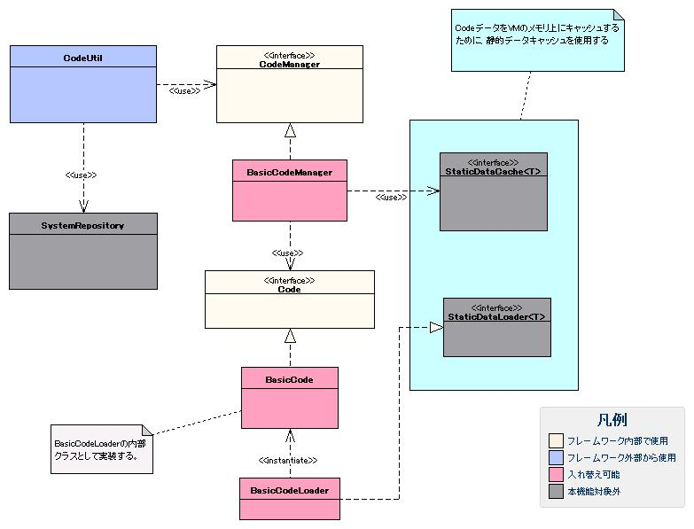

# コード管理

## 概要

アプリケーションで使用するコード値、コード名称を管理する機能を提供する。

本機能では、例えば性別区分(1:男性、2:女性)や年代区分(01:10歳未満、02:10代、03:20代、04:30代、05:40代以上)のようなコードの値(コード値)とその意味を表わす文字列(コード名称)を容易に扱うための機能を提供する。
性別区分や年代区分といったコードの種別は、コードIDと呼ぶIDを設定し、コードID毎に別々に定義する。

なお、一般にコードという名称には「商品コード」や「企業コード」といった、コード値に紐付く値が動的に変化する数多くのデータのキー値も含まれる。
しかし本機能では、これらのコードは対象としない。これらのコードはアプリケーションでマスタ用のテーブルを作成し、対処する。
また、本機能を使用する場合、コードの名称を持つテーブルとコード値を持つテーブルにRDBMSの参照整合性制約を設定できない。
このような制約のチェックには [コード値の有効性をチェックするバリデーション](../../component/libraries/libraries-02-CodeManager.md#コード値の有効性をチェックするバリデーション) を使用すること。

本機能は、あくまで先に示した性別区分や年代区分など、コードに含まれるコード値とコード名称の関係が静的なコードのみに使用すること。

本機能は、リポジトリに登録して使用する。
このため、本機能に必要な初期化処理は [リポジトリ](../../component/libraries/libraries-02-Repository.md#リポジトリ) が実行する。

アプリケーションプログラマは、本機能を画面表示に使用するコード名称の取得と、コード値の取得に使用する。

## 特徴

### 国際化

国際化対応が必要なアプリケーションでは、言語ごとに異なる名称が取得できる。

### パターン指定によるコード値の取得

アプリケーションで使用するコード値のうち、一部のコード値のみを取得するパターン指定によるコード値の取得ができる。
この機能によって、コード値の入力チェックや特定のコード値のみを表示するコンボボックスを容易に作成できる。

### 高速なコードへのアクセス

本機能では、コード値とコード名称を [静的データのキャッシュ](../../component/libraries/libraries-05-StaticDataCache.md#静的データのキャッシュ) の機能を使用してキャッシュする。
このため、データベース上に保持しているコード値のデータを何度もロードすることがなく、アプリケーションの動作を高速化できる。

また、 [静的データのキャッシュ](../../component/libraries/libraries-05-StaticDataCache.md#静的データのキャッシュ) の機能を使用しているため、
キャッシュにデータをロードするタイミングを設定変更のみで変更できる。
この機能により、下記例のようにアプリケーションの特性に合わせてキャッシュにデータをロードするタイミングを選択できる。

キャッシュをロードするタイミングの選択例

| アプリケーションの種類 | キャッシュにデータをロードするタイミング |
|---|---|
| Web アプリケーション | 一括ロードを使用 ※アプリケーション起動中にほぼ全てのコードが使用されるため |
| バッチアプリケーション | オンデマンドロードを使用 ※処理過程で全てのコードを使用しないため |

> **Note:**
> [概要](../../component/libraries/libraries-02-CodeManager.md#概要) で述べた通り、本機能は「コード値とコード名称の関係が静的なコード」を前提として設計、実装している。

> この前提では、コード値の意味が変更された際には、アプリケーションにもなんらかの修正が必要となると想定されるため、
> 本機能ではアプリケーションを再起動せずにコードのキャッシュをリロードすることが想定されていない。

> しかし、 [静的データのキャッシュ](../../component/libraries/libraries-05-StaticDataCache.md#静的データのキャッシュ) にはキャッシュをリロードする機能が実装されており、実際にはキャッシュのリロードが可能である。
> このリロードの使用は、プロジェクトの責任で行うこと。

## 要求

### 実装済み

* 国際化ができる。
* コード値に対応するコード名称が取得できる。
* 1つのコード値に対して、複数のコード名称が取得できる。
* コードIDに対応するコード値を全て取得できる。
* 文字列がコード値として妥当であるかチェックできる。
* コードが使われるパターンに応じて、そのパターンで使用できるコードを取得する、パターン指定によるコード値の取得ができる。
* コード値がパターンに含まれるかチェックできる。

### 未検討

* 外部システム用にコード変換できる。(自システムのコード値⇔外部システムのコード値ができる機能)
* コード値の有効期限を管理できる。

## 構造

### クラス図



#### インタフェース定義

| インタフェース名 | 概要 |
|---|---|
| nablarch.common.code.CodeManager | コードの値と名称を取り扱うインタフェース。 コード値、コード名称を取得するメソッドとコード値の存在チェックを行うメソッドを持つ。 |
| nablarch.common.code.Code | 単一のコードデータ(コードIDに紐づくデータ)にアクセスするインタフェース。 |

#### クラス定義

| クラス名 | 概要 |
|---|---|
| nablarch.common.code.BasicCodeManager | コードの値と名称を取り扱うクラス。 |
| nablarch.common.code.BasicCodeLoader | データベースからコードをロードするクラス。 |
| nablarch.common.code.BasicCode | Codeの基本実装クラス。 BasicCodeLoaderの内部クラスとして実現する。 |
| nablarch.common.code.CodeUtil | コードの値と名称の取り扱いに使用するユーティリティクラス。 |

### テーブル定義

本機能では、コード値と名称のマスタはデータベースのテーブル上に持つ。
データベースのテーブルは、コードの値とパターンを持つコードパターンテーブルとコード名称を持つコード名称テーブルから成る。
これらテーブルのテーブル名およびカラム名には制約はなく、設定により任意の名称が使用できる。

#### コードパターンテーブルの定義

| 定義 | Javaの型 | 制約 |
|---|---|---|
| コードID | java.lang.String | ユニークキー |
| コード値 | java.lang.String | ユニークキー |
| パターン  [1] | java.lang.String | パターンに含める場合 "1" 、含めない場合 "0" を設定する。 |

パターンに使用するカラム名は任意に設定可能であり、プロジェクトで必要な数だけパターンを定義できる。
複数のパターンを使用する場合、パターンの数だけ別々のカラム名でパターンカラムをテーブルに持たせることになる。

#### コード名称テーブルの定義

| 定義 | Javaの型 | 制約 |
|---|---|---|
| コードID | java.lang.String | ユニークキー |
| コード値 | java.lang.String | ユニークキー |
| 言語 | java.lang.String | ユニークキー |
| ソート順 | java.lang.String |  |
| 名称 | java.lang.String | コードの名称 |
| 略称 | java.lang.String | コードの略称 |
| オプション名称  [2] | java.lang.String | コードのオプション名称 |

コードのオプション名称は、1つのコード値に対して複数持つことができる。
1つのコード値に対して持つことのできるオプション名称の数は、任意に設定できる。
また、オプション名称を設定するカラムの名称も任意のカラム名が使用できる。

#### テーブル定義の例

以下にテーブル定義の例を示す。

この例では、1つのコードIDごとに取得できるパターンの数を3種類設定している。
コード名称には、名称を NAME 、略称 を SHORT_NAME のカラムに持ち、さらにコード名称にコード値を含めた NAME_WITH_VALUE というオプション名称のカラムを持つ。


## コード値とコード名称のデータ

以下にコード値とコード名称のデータ保持の例を示す。

例えば、性別の区分(性別区分)を表すコードID "0001" のコードと、バッチの処理状態を表すコードID "0002" のコードを考える。

これら2つのコードを [テーブル定義の例](../../component/libraries/libraries-02-CodeManager.md#テーブル定義の例) で示したテーブルで保持する場合、下記のようにデータを作成する。

CODE_PATTERN テーブルのデータ例

| ID | VALUE | PATTERN1 | PATTERN2 | PATTERN3 |
|---|---|---|---|---|
| 0001 | 1 | 1 | 0 | 0 |
| 0001 | 2 | 1 | 0 | 0 |
| 0001 | 9 | 0 | 0 | 0 |
| 0002 | 01 | 1 | 0 | 0 |
| 0002 | 02 | 1 | 0 | 0 |
| 0002 | 03 | 0 | 1 | 0 |
| 0002 | 04 | 0 | 1 | 0 |
| 0002 | 05 | 1 | 0 | 0 |

CODE_NAME テーブルのデータ例

| ID | VALUE | SORT_ORDER | LANG | NAME | SHORT_NAME | NAME_WITH_VALUE |
|---|---|---|---|---|---|---|
| 0001 | 1 | 1 | ja | 男性 | 男 | 1:男性 |
| 0001 | 2 | 2 | ja | 女性 | 女 | 2:女性 |
| 0001 | 9 | 3 | ja | 不明 | 不 | 9:不明 |
| 0002 | 01 | 1 | ja | 初期状態 | 初期 |  |
| 0002 | 02 | 2 | ja | 処理開始待ち | 待ち |  |
| 0002 | 03 | 3 | ja | 処理実行中 | 実行 |  |
| 0002 | 04 | 4 | ja | 処理実行完了 | 完了 |  |
| 0002 | 05 | 5 | ja | 処理結果確認完了 | 確認 |  |
| 0001 | 1 | 2 | en | Male | M | 1:Male |
| 0001 | 2 | 1 | en | Female | F | 2:Female |
| 0001 | 9 | 3 | en | Unknown | U | 9:Unknown |
| 0002 | 01 | 1 | en | Initial State | Initial |  |
| 0002 | 02 | 2 | en | Waiting For Batch Start | Waiting |  |
| 0002 | 03 | 3 | en | Batch Running | Running |  |
| 0002 | 04 | 4 | en | Batch Execute Completed Checked | Completed |  |
| 0002 | 05 | 5 | en | Batch Result Checked | Checked |  |

以降の実装例では、上記データがテーブルに入っていることを前提にして説明する。

## コード名称の取得

コード名称は、CodeUtilのgetNameメソッドで取得できる。

例えば [コード値とコード名称のデータ](../../component/libraries/libraries-02-CodeManager.md#コード値とコード名称のデータ) で設定した性別区分に対応するコード名称を取得する場合、下記のように実装する。

```java
// 性別区分(コードID:0001)、コード値 "1"に対応する文字列を取得する。
// ThreadContextに持つ言語によって、 "男性" または "Male" が取得できる。
String maleDisplayName = CodeUtil.getName("0001", "1");

// 言語を指定して 性別区分(コードID:0001)のコード値 "1"に対応する文字列を取得する。
// "男性" が取得できる。
String japaneseMaleDisplayName = CodeUtil.getName("0001", "1", Locale.JAPANESE);
```

コード名称を画面表示する際は、詳細画面では完全な名称、一覧画面では略称で表示することがある。

このように使用する箇所に応じてコード値の表示を変更するために、本機能では1つのコード値に対して複数のコード名称を持たせることができる。
これらのコード名称の別名を取得するため、 CodeUtil には getName 以外にコードの略称を取得するメソッドとコードのオプション名称を取得するメソッドを持つ。
これらメソッドの使用例を下記に示す。

```java
// コード略称を取得する。
// ThreadContextに持つ言語によって、 "男" または "M" が取得できる。
String shortMaleDisplayName = CodeUtil.getShortName("0001", "1");

// コードのオプション名称を取得する。
// ThreadContextに持つ言語によって、 "1:男性" または "1:Male" が取得できる。
String shortMaleDisplayName = CodeUtil.getOptionalName("0001", "1", "NAME_WITH_VALUE");
```

名称を取得するメソッドの一覧は下記の通り。

| メソッド名 | 説明 |
|---|---|
| getName | コード名称を取得する。 |
| getShortName | コードの略称を取得する。 |
| getOptionalName | コードのオプション名称を取得する。 取得するオプション名称のカラムは、このメソッドの第3引数で指定する。 |

## コード値の取得

コードが取り得る全てのコード値は、CodeUtilの下記メソッドで取得できる。

* getValues(String codeId)
* getValues(String codeId, Locale locale)

上記メソッドで取得したコード値の配列は、コード名称テーブルのソート順カラムとして設定したカラム(この例では SORT_ORDER カラム)
の昇順でソートされた順序で取得できる。
ソート順をコード名称テーブルに持つため、例えば言語ごとのコード名称の表示名にあわせてソートを行うことができる。
この機能を使用することで、例えば国名を選択する場面で、日本語では「アメリカ」「カナダ」「日本」とアイウエオ順で表示し、
英語では「Canada」「Japan」「United States」のようにアルファベット順に表示するという表示の変更ができる。

例えば [コード値とコード名称のデータ](../../component/libraries/libraries-02-CodeManager.md#コード値とコード名称のデータ) で設定した性別区分とバッチの処理状態を意味するコード値を取得する場合、下記のように実装する。

```java
// 性別区分(コードID:0001) に対応するコード値を全て取得する。
// ThreadContextに持つ言語によって、{"1", "2", "9" } または {"2", "1", "9"} の文字列のリストが取得できる。
List<String> genderCodeValues = CodeUtil.getValues("0001");

// バッチの処理状態(コードID:0002) に対応するコード値を全て取得する。
// "01" 、 "02" 、 "03" 、 "04" 、 "05" の文字列のリストが取得できる。
List<String> executionStateCodeValues = CodeUtil.getValues("0002");
```

## コード値の有効性チェック

画面やバッチ処理におけるファイルからの入力では、コード値として有効であるかチェックする必要がある。
このようなチェックは CodeUtil の contains メソッドで行える。

例えば [コード値とコード名称のデータ](../../component/libraries/libraries-02-CodeManager.md#コード値とコード名称のデータ) で設定した性別区分として有効であるかチェックする場合、下記のようにコードが有効であるかチェックできる。

```java
// 性別区分(コードID:0001) のコード値として有効であるかどうかチェックする

// 性別区分として、 "1" は有効であるため、true
CodeUtil.contains("0001", "1");

// 性別区分として、 "3" は有効でないため、false
CodeUtil.contains("0001", "3");
```

## コード値のパターン

[コード値とコード名称のデータ](../../component/libraries/libraries-02-CodeManager.md#コード値とコード名称のデータ) のデータの例で示した、コードID 0001 の性別区分のうち、コード値 "9" 
(不明)は外部システムから入力したデータに性別区分がなかった場合に使用する特殊なコード値を表わしている。
このコード値は、画面から入力してほしくない。

本機能では、このようなケースのために、コード値の集合に「パターン」を設定し、パターンに含まれるコード値の集合のみを取得する機能を持つ。
例えば上記の性別区分の例では、全てのコード値（1:男性、2:女性、9:不明） のうち、画面入力に使用するコード値のみを集めたパターン1(1:男性、2:女性) を用意している。

パターンに含まれるコード値のみを取得するには、 CodeUtilの下記メソッドを使用する。
pattern引数には、使用するパターンのカラム名を指定する。

* getValues(String codeId, String pattern)
* getValues(String codeId, String pattern, Locale locale)

下記に実装例を示す。

```java
// 性別区分(コードID:0001) のコード値のうち、 "PATTERN1" に対応するコード値を取得する。
// ThreadContextに持つ言語によって、 {"1" , "2"} または {"2" , "1"} の文字列のリストが取得できる。
List<String> executionStateCodeValues = CodeUtil.getValues("0001", "PATTERN1");
```

また、パターンに対して有効であるかチェックするために、containsメソッドにもパターンが指定できる。
下記に例を示す。

```java
// 性別区分(コードID:0001) のコード値として有効であるかどうかチェックする

// 性別区分のうち、 "1" は "PATTERN1" で有効であるため、 true が取得できる。
CodeUtil.contains("0001", "1", "PATTERN1");

// 性別区分として、 "3" は "PATTERN1" で有効でないため、 false が取得できる。
CodeUtil.contains("0001", "3", "PATTERN1");
```

## 設定方法

### 設定ファイル例

コード管理を使用する際は、リポジトリに "codeManager" というコンポーネント名で CodeManager インタフェースを実装したクラスを登録する必要がある。

以下に CodeManager インタフェースのデフォルト実装である、BasicCodeManagerクラスを使用した設定例を示す。

```xml
<!-- DbManagerの設定 -->
<component name="codeDbManager" class="nablarch.core.db.transaction.SimpleDbTransactionManager">
    <property name="dbTransactionName" value="code"/>
</component>

<component name="codeLoader"
           class="nablarch.common.code.BasicCodeLoader">

    <property name="dbManager" ref="codeDbManager"/>

    <!-- コードパターンテーブルのスキーマ情報 -->
    <property name="codePatternSchema">
        <component class="nablarch.common.code.schema.CodePatternSchema">
            <property name="tableName" value="CODE_PATTERN"/>
            <property name="idColumnName" value="ID"/>
            <property name="valueColumnName" value="VALUE"/>
            <property name="patternColumnNames" value="PATTERN1,PATTERN2,PATTERN3"/>
        </component>
    </property>

    <!-- コード名称テーブルのスキーマ情報 -->
    <property name="codeNameSchema">
        <component class="nablarch.common.code.schema.CodeNameSchema">
            <property name="tableName" value="CODE_NAME"/>
            <property name="idColumnName" value="ID"/>
            <property name="valueColumnName" value="VALUE"/>
            <property name="langColumnName" value="LANG"/>
            <property name="sortOrderColumnName" value="SORT_ORDER"/>
            <property name="nameColumnName" value="NAME"/>
            <property name="shortNameColumnName" value="SHORT_NAME"/>
            <property name="optionNameColumnNames" value="NAME_WITH_VALUE,OPTION01"/>
        </component>
    </property>
</component>

<component name="codeCache"
           class="nablarch.core.cache.BasicStaticDataCache" >

    <property name="loader" ref="codeLoader"/>

    <property name="loadOnStartup" value="false"/>
</component>

<component name="codeManager"
    class="nablarch.common.code.BasicCodeManager" autowireType="None">
    <property name="codeDefinitionCache" ref="codeCache"/>
</component>

<component name="initializer" class="nablarch.core.repository.initialization.BasicApplicationInitializer">
    <property name="initializeList">
        <list>
            <component-ref name="codeCache"/>
        </list>
    </property>
</component>
```

### 設定内容詳細

#### nablarch.common.code.BasicCodeManager の設定

| property名 | 設定内容 |
|---|---|
| codeDefinitionCache(必須) | Code インタフェースを実装したクラスを保持する StaticDataCache を設定する。 |

#### nablarch.core.cache.BasicStaticDataCache クラスの設定

[静的データのキャッシュ](../../component/libraries/libraries-05-StaticDataCache.md) を参照。

> **Warning:**
> このプロパティに設定する StaticDataLoader は、 BasicCodeLoader クラスのように、 StaticDataLoader<Code> を実装すること。

#### nablarch.common.code.BasicCodeLoader クラスの設定

| property名 | 設定内容 |
|---|---|
| dbManager(必須) | コードのロード時に使用する SimpleDbTransactionManager クラスを指定する。 |
| codePatternSchema(必須) | コードパターンテーブルのスキーマ情報。 CodePatternSchema クラスのインスタンス。 |
| codeNameSchema(必須) | コード名称テーブルのスキーマ情報。 CodeNameSchema クラスのインスタンス。 |

#### nablarch.common.code.schema.CodePatternSchema クラスの設定

| property名 | 設定内容 |
|---|---|
| tableName(必須) | テーブル名。 |
| idColumnName(必須) | コードIDカラムの名前。 |
| valueColumnName(必須) | コード値カラムの名前。 |
| patternColumnNames | パターンに使用するカラム名の文字列を配列で設定する。 パターン機能を使用する場合、設定必須。 |

#### nablarch.common.code.schema.CodeNameSchema クラスの設定

| property名 | 設定内容 |
|---|---|
| tableName(必須) | テーブル名。 |
| idColumnName(必須) | コードIDカラムの名前。 |
| valueColumnName(必須) | コード値カラムの名前。 |
| langColumnName(必須) | 言語カラムの名前。 |
| sortOrderColumnName(必須) | ソート順カラムの名前。 |
| nameColumnName(必須) | 名称カラムの名前。 |
| shortNameColumnName(必須) | 略称カラムの名前。 |
| optionNameColumnNames | コードのオプション名称に使用するカラム名の文字列を配列で設定する。 指定しなかった場合、オプション名称が取得ができない。 |

## コード値の有効性をチェックするバリデーション

性別区分等、データベース上に永続化するコード値は、通常の文字列による画面入力値と同様にバリデーションを行う必要がある。
本機能では [バリデーションの機能](../../component/libraries/libraries-core-library-validation.md#入力値のバリデーション) を使用して、コード値が有効であるか(つまり contains メソッドの戻り値が true であるか)をチェックする機能を持つ。

### エンティティの実装

バリデーションは、通常のバリデーション同様にEntityのプロパティに対してアノテーションを付けることで実現できる。

例えば、コードID "0001"、パターン "PATTERN1" に含まれる文字列のみを受けつけるプロパティ gender を持つエンティティは下記のように実装する。
pattern属性には、使用するパターンのカラム名を指定する。

```java
public class Customer {

    // その他のプロパティは省略
    private String gender;

    @PropertyName("性別")
    @CodeValue(codeId="0001", pattern="PATTERN1")
    public String setGender(String gender) {
        this.gender = gender;
    }
}
```

上記実装を行った上で、 [バリデーションの実行と入力値の変換](../../component/libraries/libraries-08-02-validation-usage.md#バリデーションの実行と入力値の変換) で記述した方法で ValidationUtil クラスの validateAndConvertRequest メソッドを呼び出すことで、 gender に "1",
"2"以外の文字を設定した際のバリデーション結果はエラーになる。

なお、上記例はパターンに含まれるかまでをチェックするバリデーションであるため、 @CodeValue アノテーションの pattern 属性を指定しているが、 pattern 属性の指定を省略することで、
コード値として有効であるかのみチェックするバリデーションも実装できる。

### Validatorの設定

@CodeValue アノテーションで指定されたコード値のチェックは、 CodeValueValidator クラス が行う。

CodeValueValidator クラス は、 [バリデーションの設定](../../component/libraries/libraries-08-01-validation-architecture.md#設定例) で記述した他のバリデータと同様に ValidationManager クラスの validators プロパティに追加することで使用できる。
設定例を以下に示す。

```xml
<component name="validationManager" class="nablarch.core.validation.ValidationManager">
    <property name="validators" >
        <list>
            <!-- その他のバリデータ設定は省略。 -->
            <component class="nablarch.common.code.validator.CodeValueValidator">
                <property name="messageId" value="MSGXXXXX"/>

            </component>
        </list>
    </property>
    <!-- その他のプロパティは省略。 -->
</component>
```

### 設定内容詳細

CodeValueValidator の設定値の意味は下記の通り。

| property名 | 設定内容 |
|---|---|
| messageId(必須) | コード値のパターンに含まれない文字列が入力された場合のデフォルトのエラーメッセージのメッセージIDを設定する。 メッセージに使用できる置き換え文字は下記の通り。 * 0 : 設定するプロパティの名称 * 1 : 使用できるコード値の一覧 メッセージの例 : "{0}には'{'{1}'}'のいずれかの値を指定してください。" フォーマット後のメッセージの例 : "性別には{"01" , "02"}のいずれかの値を指定してください。"  ※本メッセージはコンボボックスで入力するコードをを改竄した場合と、テキストボックスでコード値を入力する場合 (コードの性質上、テキストで入力することは非常にまれである) という特殊なケースでのみ使用される。 メッセージはこの使用状況を考慮して設計すること。 |
