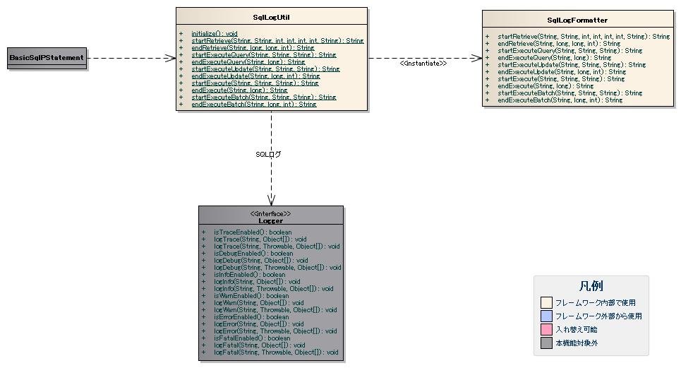

# SQLログの出力

SQLログは、パフォーマンスチューニングに使用するために、SQL文の実行時間やSQL文を出力する。
アプリケーションでは、ログ出力の設定を行うことにより出力する。

## SQLログの出力方針

SQLログで想定している出力方針を下記に示す。
SQLログは、開発時の使用を想定しているためDEBUGレベル以下で出力する。

| ログレベル | ロガー名 |
|---|---|
| DEBUG、TRACE | SQL |

ログレベルと出力内容を下記に示す。

| ログレベル | 出力内容 |
|---|---|
| DEBUG | SQL文、実行時間、 件数(検索件数や更新件数など)、 トランザクションの処理結果(コミット又はロールバック) |
| TRACE | SQLパラメータ(バインド変数の値) |

上記出力方針に対するログ出力の設定例を下記に示す。

log.propertiesの設定例

```bash
# SQL
loggers.SQL.nameRegex=SQL
loggers.SQL.level=TRACE
loggers.SQL.writerNames=<出力先のログライタ>
```

## SQLログの出力項目

SQLログの個別項目を下記に示す。
SQLログは、SQL文を発行する方法に応じて出力項目が異なる。

ここでは、 [BasicLogFormatter](../../component/libraries/libraries-01-Log.md#log-basiclogformatter) の設定で指定できる共通項目については省略する。
共通項目と個別項目を組み合わせたフォーマットについては、 [各種ログの共通項目のフォーマット](../../component/libraries/libraries-01-Log.md#applog-format) を参照。

### SqlPStatement#retrieveメソッドの検索開始時

出力項目

| 項目名 | 説明 |
|---|---|
| メソッド名 | クラス名#メソッド名形式。 |
| SQL文 | SQL文。 |
| 取得開始位置 | 検索結果のデータ取得を開始する行数。 |
| 取得最大件数 | 検索結果に含める最大行数。 |
| タイムアウト時間 | 検索のタイムアウト時間。 |
| フェッチする行数 | データ取得時のフェッチ件数。 |
| 付加情報 | BasicSqlPStatementの設定で指定された付加情報。 |

### SqlPStatement#retrieveメソッドの検索終了時

出力項目

| 項目名 | 説明 |
|---|---|
| メソッド名 | クラス名#メソッド名形式。 |
| 実行時間 | 実行時間。 |
| データ取得時間 | 検索後のデータ取得に要した時間。 |
| 検索件数 | 検索結果の件数。 |

### SqlPStatement#executeメソッドの実行開始時

出力項目

| 項目名 | 説明 |
|---|---|
| メソッド名 | クラス名#メソッド名形式。 |
| SQL文 | SQL文。 |
| 付加情報 | BasicSqlPStatementの設定で指定された付加情報。 |

### SqlPStatement#executeメソッドの実行終了時

出力項目

| 項目名 | 説明 |
|---|---|
| メソッド名 | クラス名#メソッド名形式。 |
| 実行時間 | 実行時間。 |

### SqlPStatement#executeQueryメソッドの検索開始時

出力項目

| 項目名 | 説明 |
|---|---|
| メソッド名 | クラス名#メソッド名形式。 |
| SQL文 | SQL文。 |
| 付加情報 | BasicSqlPStatementの設定で指定された付加情報。 |

### SqlPStatement#executeQueryメソッドの検索終了時

出力項目

| 項目名 | 説明 |
|---|---|
| メソッド名 | クラス名#メソッド名形式。 |
| 実行時間 | 検索の実行時間。 |

### SqlPStatement#executeUpdateメソッドの更新開始時

出力項目

| 項目名 | 説明 |
|---|---|
| メソッド名 | クラス名#メソッド名形式。 |
| SQL文 | SQL文。 |
| 付加情報 | BasicSqlPStatementの設定で指定された付加情報。 |

### SqlPStatement#executeUpdateメソッドの更新終了時

出力項目

| 項目名 | 説明 |
|---|---|
| メソッド名 | クラス名#メソッド名形式。 |
| 実行時間 | 実行時間。 |
| 更新件数 | 更新件数。 |

### SqlPStatement#executeBatchメソッドの更新開始時

出力項目

| 項目名 | 説明 |
|---|---|
| メソッド名 | クラス名#メソッド名形式。 |
| SQL文 | SQL文。 |
| 付加情報 | BasicSqlPStatementの設定で指定された付加情報。 |

### SqlPStatement#executeBatchメソッドの更新終了時

出力項目

| 項目名 | 説明 |
|---|---|
| メソッド名 | クラス名#メソッド名形式。 |
| 実行時間 | 実行時間。 |
| バッチ件数 | バッチ件数。 |

## SQLログの出力方法

SQLログの出力に使用するクラスを下記に示す。



| クラス名 | 概要 |
|---|---|
| nablarch.core.db.statement.SqlLogUtil | SQLログのフォーマットを助けるクラス。 |
| nablarch.core.db.statement.SqlLogFormatter | SQLログの個別項目をフォーマットするクラス。 |

BasicSqlPStatementは、SQL文、実行時間、件数のフォーマットにSqlLogUtilを使用する。
トランザクションの処理結果とSQLパラメータの出力では、SqlLogUtilを使用せずに直接Loggerを使用して出力する。

SQLログは、ログ出力の設定でロガー名にSQLを指定することで出力される。
ログ出力の設定を下記に示す。

log.propertiesの設定例

```bash
# SQL
loggers.SQL.nameRegex=SQL
loggers.SQL.level=TRACE
loggers.SQL.writerNames=<出力先のログライタ>
```

SQLログの出力例を下記に示す。SQLログの個別項目は、デフォルトのフォーマットを使用した場合の出力例である。

log.propertiesの設定例

```bash
writerNames=appFile

# appFile
writer.appFile.className=nablarch.core.log.basic.FileLogWriter
writer.appFile.filePath=./app.log
writer.appFile.encoding=UTF-8
writer.appFile.maxFileSize=10000
writer.appFile.formatter.className=nablarch.core.log.basic.BasicLogFormatter
writer.appFile.formatter.format=$date$ -$logLevel$- R[$requestId$] U[$userId$] E[$executionId$] $message$

availableLoggersNamesOrder=SQL

# SQL
loggers.SQL.nameRegex=SQL
loggers.SQL.level=TRACE
loggers.SQL.writerNames=appFile
```

ログの出力例

```bash
2011-02-08 23:07:25.182 -DEBUG- R[LOGIN00102] U[9999999999] E[AP01201102082307249470003] nablarch.core.db.statement.BasicSqlPStatement#retrieve
    SQL = [SELECT BIZ_DATE FROM BUSINESS_DATE WHERE SEGMENT = ?]
    start_position = [1] size = [0]
    query_timeout = [0] fetch_size = [500]
    additional_info:
2011-02-08 23:07:25.182 -TRACE- R[LOGIN00102] U[9999999999] E[AP01201102082307249470003] nablarch.core.db.statement.BasicSqlPStatement#Parameters
    01 = [00]
2011-02-08 23:07:25.182 -DEBUG- R[LOGIN00102] U[9999999999] E[AP01201102082307249470003] nablarch.core.db.statement.BasicSqlPStatement#retrieve
    execute_time(ms) = [0] retrieve_time(ms) = [0] count = [1]
```

SqlLogUtilは、プロパティファイル(app-log.properties)を読み込み、
SqlLogFormatterオブジェクトを生成して、個別項目のフォーマット処理を委譲する。
プロパティファイルのパス指定や実行時の変更方法は、 [各種ログの設定](../../component/libraries/libraries-01-Log.md#applog-config) を参照。

SQLログの設定例を下記に示す。

app-log.propertiesの設定例

```bash
# SqlLogFormatter
sqlLogFormatter.className=nablarch.core.db.statement.SqlLogFormatter
sqlLogFormatter.startRetrieveFormat=$methodName$\n\tSQL:$sql$\n\tstart:$startPosition$ size:$size$\n\tadditional_info:\n\t$additionalInfo$
sqlLogFormatter.endRetrieveFormat=$methodName$\n\texe:$executeTime$ms ret:$retrieveTime$ms count:$count$
sqlLogFormatter.startExecuteFormat=$methodName$\n\tSQL:$sql$\n\tadditional_info:\n\t$additionalInfo$
sqlLogFormatter.endExecuteFormat=$methodName$\n\texe:$executeTime$ms
sqlLogFormatter.startExecuteQueryFormat=$methodName$\n\tSQL:$sql$\n\tadditional_info:\n\t$additionalInfo$
sqlLogFormatter.endExecuteQueryFormat=$methodName$\n\texe:$executeTime$ms
sqlLogFormatter.startExecuteUpdateFormat=$methodName$\n\tSQL:$sql$\n\tadditional_info:\n\t$additionalInfo$
sqlLogFormatter.endExecuteUpdateFormat=$methodName$\n\texe:$executeTime$ms count:$updateCount$
sqlLogFormatter.startExecuteBatchFormat=$methodName$\n\tSQL:$sql$\n\tadditional_info:\n\t$additionalInfo$
sqlLogFormatter.endExecuteBatchFormat=$methodName$\n\texe:$executeTime$ms count:$updateCount$
```

プロパティの説明を下記に示す。

| プロパティ名 | 設定値 |
|---|---|
| sqlLogFormatter.className | SqlLogFormatterのクラス名。  SqlLogFormatterクラスを差し替える場合に指定する。 |
| sqlLogFormatter.startRetrieveFormat | SqlPStatement#retrieveメソッドの検索開始時に使用するフォーマット。 |
| sqlLogFormatter.endRetrieveFormat | SqlPStatement#retrieveメソッドの検索終了時に使用するフォーマット。 |
| sqlLogFormatter.startExecuteFormat | SqlPStatement#executeメソッドの実行開始時に使用するフォーマット。 |
| sqlLogFormatter.endExecuteFormat | SqlPStatement#executeメソッドの実行終了時に使用するフォーマット。 |
| sqlLogFormatter.startExecuteQueryFormat | SqlPStatement#executeQueryメソッドの検索開始時に使用するフォーマット。 |
| sqlLogFormatter.endExecuteQueryFormat | SqlPStatement#executeQueryメソッドの検索終了時に使用するフォーマット。 |
| sqlLogFormatter.startExecuteUpdateFormat | SqlPStatement#executeUpdateメソッドの更新開始時に使用するフォーマット。 |
| sqlLogFormatter.endExecuteUpdateFormat | SqlPStatement#executeUpdateメソッドの更新終了時に使用するフォーマット。 |
| sqlLogFormatter.startExecuteBatchFormat | SqlPStatement#executeBatchメソッドの更新開始時に使用するフォーマット。 |
| sqlLogFormatter.endExecuteBatchFormat | SqlPStatement#executeBatchメソッドの更新終了時に使用するフォーマット。 |

フォーマットに指定可能なプレースホルダの一覧とデフォルトのフォーマットを下記に示す。
デフォルトのフォーマットは、フォーマット内の改行位置で改行して表示する。

### SqlPStatement#retrieveメソッドの検索開始時

プレースホルダ一覧

| 項目名 | プレースホルダ |
|---|---|
| メソッド名 | $methodName$ |
| SQL文 | $sql$ |
| 取得開始位置 | $startPosition$ |
| 取得最大件数 | $size$ |
| タイムアウト時間 | $queryTimeout$ |
| フェッチする行数 | $fetchSize$ |
| 付加情報 | $additionalInfo$ |

デフォルトのフォーマット

```bash
$methodName$
    \n\tSQL = [$sql$]
    \n\tstart_position = [$startPosition$] size = [$size$]
    \n\tquery_timeout = [$queryTimeout$] fetch_size = [$fetchSize$]
    \n\tadditional_info:
    \n\t$additionalInfo$
```

### SqlPStatement#retrieveメソッドの検索終了時

プレースホルダ一覧

| 項目名 | プレースホルダ |
|---|---|
| メソッド名 | $methodName$ |
| 実行時間 | $executeTime$ |
| データ取得時間 | $retrieveTime$ |
| 検索件数 | $count$ |

デフォルトのフォーマット

```bash
$methodName$
    \n\texecute_time(ms) = [$executeTime$] retrieve_time(ms) = [$retrieveTime$] count = [$count$]
```

### SqlPStatement#executeメソッドの実行開始時

プレースホルダ一覧

| 項目名 | プレースホルダ |
|---|---|
| メソッド名 | $methodName$ |
| SQL文 | $sql$ |
| 付加情報 | $additionalInfo$ |

デフォルトのフォーマット

```bash
$methodName$
    \n\tSQL = [$sql$]
    \n\tadditional_info:
    \n\t$additionalInfo$
```

### SqlPStatement#executeメソッドの実行終了時

プレースホルダ一覧

| 項目名 | プレースホルダ |
|---|---|
| メソッド名 | $methodName$ |
| 実行時間 | $executeTime$ |

デフォルトのフォーマット

```bash
$methodName$
    \n\texecute_time(ms) = [$executeTime$]
```

### SqlPStatement#executeQueryメソッドの検索開始時

プレースホルダ一覧

| 項目名 | プレースホルダ |
|---|---|
| メソッド名 | $methodName$ |
| SQL文 | $sql$ |
| 付加情報 | $additionalInfo$ |

デフォルトのフォーマット

```bash
$methodName$
    \n\tSQL = [$sql$]
    \n\tadditional_info:
    \n\t$additionalInfo$
```

### SqlPStatement#executeQueryメソッドの検索終了時

プレースホルダ一覧

| 項目名 | プレースホルダ |
|---|---|
| メソッド名 | $methodName$ |
| 実行時間 | $executeTime$ |

デフォルトのフォーマット

```bash
$methodName$
    \n\texecute_time(ms) = [$executeTime$]
```

### SqlPStatement#executeUpdateメソッドの更新開始時

プレースホルダ一覧

| 項目名 | プレースホルダ |
|---|---|
| メソッド名 | $methodName$ |
| SQL文 | $sql$ |
| 付加情報 | $additionalInfo$ |

デフォルトのフォーマット

```bash
$methodName$
    \n\tSQL = [$sql$]
    \n\tadditional_info:
    \n\t$additionalInfo$
```

### SqlPStatement#executeUpdateメソッドの更新終了時

プレースホルダ一覧

| 項目名 | プレースホルダ |
|---|---|
| メソッド名 | $methodName$ |
| 実行時間 | $executeTime$ |
| 更新件数 | $updateCount$ |

デフォルトのフォーマット

```bash
$methodName$
    \n\texecute_time(ms) = [$executeTime$] update_count = [$updateCount$]
```

### SqlPStatement#executeBatchメソッドの更新開始時

プレースホルダ一覧

| 項目名 | プレースホルダ |
|---|---|
| メソッド名 | $methodName$ |
| SQL文 | $sql$ |
| 付加情報 | $additionalInfo$ |

デフォルトのフォーマット

```bash
$methodName$
    \n\tSQL = [$sql$]
    \n\tadditional_info:
    \n\t$additionalInfo$
```

### SqlPStatement#executeBatchメソッドの更新終了時

プレースホルダ一覧

| 項目名 | プレースホルダ |
|---|---|
| メソッド名 | $methodName$ |
| 実行時間 | $executeTime$ |
| バッチ件数 | $batchCount$ |

デフォルトのフォーマット

```bash
$methodName$
    $\n\texecute_time(ms) = [$executeTime$] batch_count = [$updateCount$]
```

## SQLログの出力例

SQLログの出力例を下記に示す。

log.propertiesの設定例

```bash
writerNames=appFile

# ログの出力先
writer.appFile.className=nablarch.core.log.basic.FileLogWriter
writer.appFile.filePath=./app.log
writer.appFile.encoding=UTF-8
writer.appFile.maxFileSize=10000
writer.appFile.formatter.className=nablarch.core.log.basic.BasicLogFormatter
writer.appFile.formatter.format=$date$ -$logLevel$- R[$requestId$] U[$userId$] E[$executionId$] $message$

availableLoggersNamesOrder=SQL

# SQL
loggers.SQL.nameRegex=SQL
loggers.SQL.level=TRACE
loggers.SQL.writerNames=appFile
```

app-log.propertiesの設定例

```bash
# SqlLogFormatterの設定(個別項目のフォーマット)
sqlLogFormatter.startRetrieveFormat=$methodName$\n\tSQL:$sql$\n\tstart:$startPosition$ size:$size$\n\tadditional_info:\n\t$additionalInfo$
sqlLogFormatter.endRetrieveFormat=$methodName$\n\texe:$executeTime$ms ret:$retrieveTime$ms count:$count$
```

上記設定から出力した結果を下記に示す。

```bash
2011-02-15 18:06:05.952 -DEBUG- R[LOGIN00102] U[9999999999] E[APUSRMGR0001201102151806058420002] nablarch.core.db.statement.BasicSqlPStatement#retrieve
    SQL:SELECT BIZ_DATE FROM BUSINESS_DATE WHERE SEGMENT = ?
    start:1 size:0
    additional_info:
2011-02-15 18:06:05.952 -TRACE- R[LOGIN00102] U[9999999999] E[APUSRMGR0001201102151806058420002] nablarch.core.db.statement.BasicSqlPStatement#Parameters
    01 = [00]
2011-02-15 18:06:05.952 -DEBUG- R[LOGIN00102] U[9999999999] E[APUSRMGR0001201102151806058420002] nablarch.core.db.statement.BasicSqlPStatement#retrieve
    exe:0ms ret:0ms count:1
2011-02-15 18:06:05.952 -DEBUG- R[LOGIN00102] U[9999999999] E[APUSRMGR0001201102151806058420002] nablarch.core.db.transaction.JdbcTransaction#commit()
```
