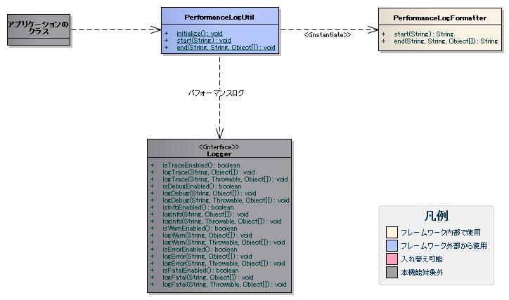

# パフォーマンスログの出力

パフォーマンスログは、任意の処理範囲に対する実行時間とメモリ使用量を出力し、開発時のパフォーマンスチューニングに使用する。
アプリケーションでは、ソースコード上でフレームワークが提供するAPIを呼び出し、計測対象の処理範囲を指定して出力する。

## パフォーマンスログの出力方針

パフォーマンスログで想定している出力方針を下記に示す。
パフォーマンスログは、開発時の使用を想定しているためDEBUGレベルで出力する。

| ログレベル | ロガー名 |
|---|---|
| DEBUG | PERFORMANCE |

上記出力方針に対するログ出力の設定例を下記に示す。

log.propertiesの設定例

```bash
# PERFORMANCE
loggers.PER.nameRegex=PERFORMANCE
loggers.PER.level=DEBUG
loggers.PER.writerNames=<出力先のログライタ>
```

## パフォーマンスログの出力項目

パフォーマンスログの個別項目を下記に示す。

ここでは、 [BasicLogFormatter](../../component/libraries/libraries-01-Log.md#basiclogformatter) の設定で指定できる共通項目については省略する。
共通項目と個別項目を組み合わせたフォーマットについては、 [各種ログの共通項目のフォーマット](../../component/libraries/libraries-01-Log.md#各種ログの共通項目のフォーマット) を参照。

| 項目名 | 説明 |
|---|---|
| ポイント | 測定対象を識別するID。 |
| 処理結果 | 処理結果を表す文字列。 |
| 開始日時 | 処理の開始日時。 |
| 終了日時 | 処理の終了日時。 |
| 実行時間 | 処理の実行時間（終了日時－開始日時）。 |
| 最大メモリ量 | 処理の開始時点のヒープサイズ。 |
| 開始時の空きメモリ量 | 処理の開始時点の空きヒープサイズ。 |
| 開始時の使用メモリ量 | 処理の開始時点の使用ヒープサイズ。 |
| 終了時の空きメモリ量 | 処理の開始時点の空きヒープサイズ。 |
| 終了時の使用メモリ量 | 処理の開始時点の使用ヒープサイズ。 |

## パフォーマンスログの出力方法

パフォーマンスログの出力に使用するクラスを下記に示す。



| クラス名 | 概要 |
|---|---|
| nablarch.core.log.app.PerformanceLogUtil | パフォーマンスログを出力するクラス。 |
| nablarch.core.log.app.PerformanceLogFormatter | パフォーマンスログの個別項目をフォーマットするクラス。 |

パフォーマンスログは、フレームワークが提供するPerformanceLogUtilクラスを使用して出力する。
PerformanceLogUtilは、処理の開始時に呼び出すstartメソッドと終了時に呼び出すendメソッドを提供する。
PerformanceLogUtilは、endメソッドが呼ばれた時点で、startメソッドで取得した日時とメモリ使用量を合わせて出力する。
PerformanceLogUtilの使用例を下記に示す。

```java
// startメソッドでは、測定対象を識別するポイントを指定する。
String point = "UserSearchAction#doUSERS00101";
PerformanceLogUtil.start(point);

// 検索実行
UserSearchService searchService = new UserSearchService();
SqlResultSet searchResult = searchService.selectByCondition(condition);

// endメソッドでは、ポイント、処理結果を表す文字列、ログ出力のオプション情報を指定できる。
// 以下ではログ出力のオプション情報は指定していない。
PerformanceLogUtil.end(point, String.valueOf(searchResult.size()));
```

> **Warning:**
> PerformanceLogUtilは、測定対象を実行時ID＋ポイント名で一意に識別している。
> このため、再帰呼び出しの中でPerformanceLogUtilを使用すると計測を実施出来ないため注意すること。

PerformanceLogUtilは、プロパティファイル(app-log.properties)を読み込み、
PerformanceLogFormatterオブジェクトを生成して、個別項目のフォーマット処理を委譲する。
プロパティファイルのパス指定や実行時の変更方法は、 [各種ログの設定](../../component/libraries/libraries-01-Log.md#各種ログの設定) を参照。
パフォーマンスログの設定例を下記に示す。

app-log.propertiesの設定例

```bash
# PerformanceLogFormatter
performanceLogFormatter.className=nablarch.core.log.app.PerformanceLogFormatter
performanceLogFormatter.targetPoints=UserSearchAction#doUSERS00101
performanceLogFormatter.datePattern=yyyy-MM-dd HH:mm:ss.SSS
performanceLogFormatter.format=point:$point$ result:$result$ exe_time:$executionTime$ms
```

プロパティの説明を下記に示す。

| プロパティ名 | 設定値 |
|---|---|
| performanceLogFormatter.className | PerformanceLogFormatterのクラス名。  PerformanceLogFormatterを差し替える場合に指定する。 |
| performanceLogFormatter.format | パフォーマンスログの個別項目のフォーマット。  フォーマットに指定可能なプレースホルダについては下記を参照。 |
| performanceLogFormatter.datePattern | 開始日時と終了日時に使用する日時パターン。  パターンには、java.text.SimpleDateFormatが規程している構文を指定する。 デフォルトは"yyyy-MM-dd HH:mm:ss.SSS"。 |
| performanceLogFormatter.targetPoints | 出力対象とするポイント名。  複数指定する場合はカンマ区切り。 パフォーマンスログは、誤設定による無駄な出力を防ぐため、この設定に基づき出力する。 |

フォーマットに指定可能なプレースホルダの一覧を下記に示す。

| プレースホルダ | 説明 |
|---|---|
| $point$ | 測定対象を識別するID。 |
| $result$ | 処理結果を表す文字列。 |
| $startTime$ | 処理の開始日時。 |
| $endTime$ | 処理の終了日時。 |
| $executionTime$ | 処理の実行時間（終了日時－開始日時）。 |
| $maxMemory$ | 処理の開始時点のヒープサイズ。 |
| $startFreeMemory$ | 処理の開始時点の空きヒープサイズ。 |
| $startUsedMemory$ | 処理の開始時点の使用ヒープサイズ。 |
| $endFreeMemory$ | 処理の開始時点の空きヒープサイズ。 |
| $endUsedMemory$ | 処理の開始時点の使用ヒープサイズ。 |

デフォルトのフォーマットを下記に示す。
フォーマット内の改行位置で改行して表示する。

```bash
\n\tpoint = [$point$] result = [$result$]
\n\tstart_time = [$startTime$] end_time = [$endTime$]
\n\texecution_time = [$executionTime$]
\n\tmax_memory = [$maxMemory$]
\n\tstart_free_memory = [$startFreeMemory$] start_used_memory = [$startUsedMemory$]
\n\tend_free_memory = [$endFreeMemory$] end_used_memory = [$endUsedMemory$]
```

### パフォーマンスログの出力例

パフォーマンスログの出力例を下記に示す。

log.propertiesの設定例

```bash
writerNames=appFile

# ログの出力先
writer.appFile.className=nablarch.core.log.basic.FileLogWriter
writer.appFile.filePath=./app.log
writer.appFile.encoding=UTF-8
writer.appFile.maxFileSize=10000
writer.appFile.formatter.className=nablarch.core.log.basic.BasicLogFormatter
writer.appFile.formatter.format=$date$ -$logLevel$- R[$requestId$] U[$userId$] E[$executionId$] $message$

availableLoggersNamesOrder=PER

# PER
loggers.PER.nameRegex=PERFORMANCE
loggers.PER.level=DEBUG
loggers.PER.writerNames=appFile
```

app-log.propertiesの設定例

```bash
# PerformanceLogFormatterの設定(個別項目のフォーマット)
performanceLogFormatter.targetPoints=UserSearchAction#doUSERS00101
performanceLogFormatter.format=point:$point$ result:$result$ exe_time:$executionTime$ms
```

上記設定から出力した結果を下記に示す。
PerformanceLogUtilの使用例で示した検索処理の出力を示す。

```bash
2011-02-15 18:25:50.577 -DEBUG- R[USERS00101] U[0000000001] E[APUSRMGR0001201102151825504990004] point:UserSearchAction#doUSERS00101 result:17 exe_time:16ms
```
