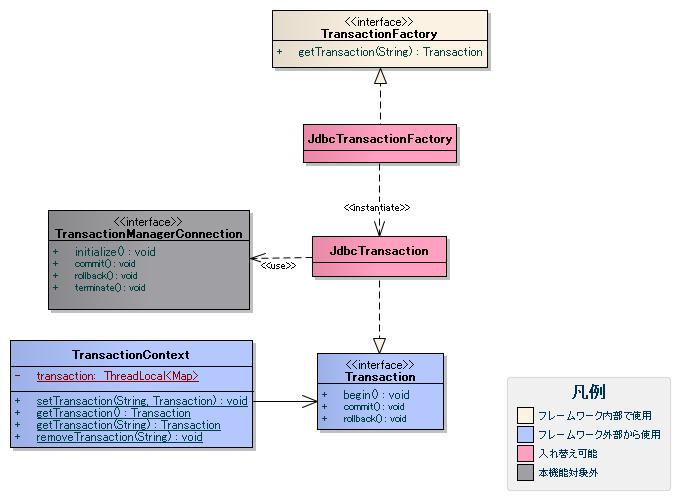

# トランザクション管理

## 概要

様々なリソース（主にデータベースやメッセージキュー）に対するトランザクション管理機能を提供する。

本機能は、本フレームワークの他の機能から使用されることを想定している。
Webアプリケーションでは、 [トランザクション制御ハンドラ](../../component/handlers/handlers-TransactionManagementHandler.md) の機能が使用する。
このため、アプリケーションプログラマは、本機能を直接使用することはない。

## 特徴

### 任意のリソースに対するトランザクション制御を追加可能

トランザクション制御部品を追加することにより、任意のリソースに対するトランザクション制御を行うことが可能となっている。

### 分散トランザクション機能(未実装機能)

Webコンテナが提供するトランザクションマネージャ(ユーザトランザクション)機能を使用して分散トランザクションを行う機能。
分散トランザクションを使用するかどうかは、設定ファイルに記述するのみで実現可能となっている。

## 要求

### 実装済み

* RDBMSのトランザクション管理ができる。
* アイソレーションレベルが設定できる。
* トランザクション開始時に任意のSQL文を実行できる。
* トランザクションタイムアウト処理ができる。

### 未実装

* 分散トランザクションに対応できる。
* トランザクションのリトライ(デッドロックやロック要求タイムアウト発生時のリトライ)ができる。
  データベースに対するトランザクション使用時に、特定のエラーの発生を検知しトランザクションを自動リトライする機能。
  リトライ対象のエラーは、SQLStateまたはベンダー依存のSQLエラーコードで設定が可能である。

## 構造

### クラス図

#### 各クラスの責務

##### インタフェース定義

| インタフェース名 | 概要 |
|---|---|
| nablarch.core.transaction.TransactionFactory | トランザクション制御オブジェクト(Transaction)を取得するインタフェース |
| nablarch.core.transaction.Transaction | トランザクション制御オブジェクト。  新たなトランザクション方式を追加する場合は、このインタフェースの実装クラスを新たに追加する必要がある。 |

##### クラス定義

a) nablarch.core.transaction.TransactionFactoryの実装クラス

| クラス名 | 概要 |
|---|---|
| nablarch.core.db.transaction.JdbcTransactionFactory | JdbcTransactionを生成するクラス。 トランザクションタイムアウトの設定は本クラスに行う。  設定内容の詳細は、 [トランザクションタイムアウトを使用するための設定](../../component/libraries/libraries-04-TransactionTimeout.md#transactiontimeoutsettings) を参照。 |

b) nablarch.core.transaction.Transactionの実装クラス

| クラス名 | 概要 |
|---|---|
| nablarch.core.db.transaction.JdbcTransaction | JDBCで提供されるトランザクション機能を使用して、トランザクション制御を行うクラス。 |

c) その他のクラス

| クラス名 | 概要 |
|---|---|
| nablarch.core.transaction.TransactionContext | ThreadLocal(スレッド内)にTransactionを保持するクラス。  保持するTransactionには、任意の名前(トランザクション名)を付加することができる。 トランザクション名の詳細は、 [データベースコネクション名とトランザクション名](../../component/libraries/libraries-04-Connection.md#db-connection-name-label) を参照すること。  > **Warning:** > ThreadLocalでTransactionが管理されるため、アプリケーションのスレッドと同一のスレッドでTransactionを設定する必要がある。  > マルチスレッド環境では、各スレッドに対してTransactionを設定する必要があるため、注意が必要である。 |

## 使用例

### データベースに対するトランザクション管理

詳細は、 [データベースアクセス(検索、更新、登録、削除)機能](../../component/libraries/libraries-04-DbAccessSpec.md) を参照。
