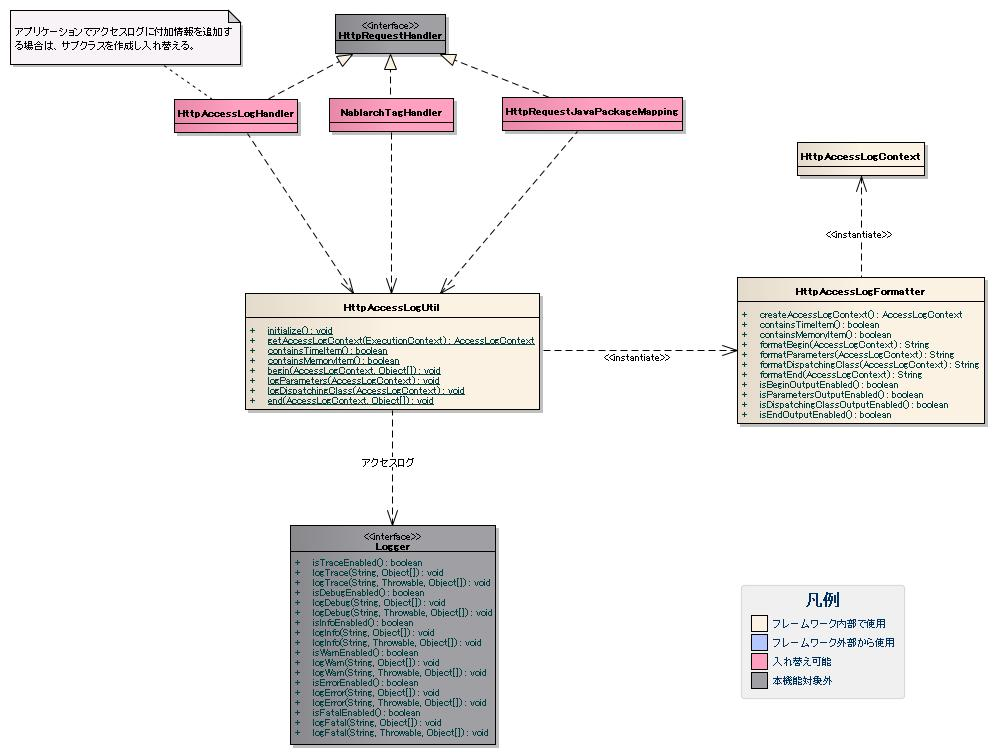
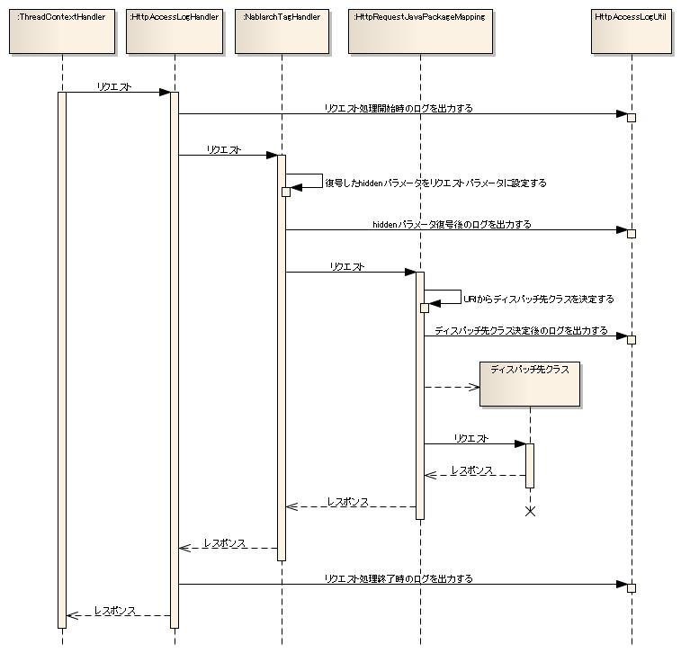

# HTTPアクセスログの出力

HTTPアクセスログは、フレームワークが提供するハンドラを使用して出力する。
アプリケーションでは、ハンドラの設定を行うことでHTTPアクセスログを出力する。

リクエストパラメータを含めたリクエスト情報を出力することで、個別アプリケーションの証跡ログの要件を満たせる場合は、
HTTPアクセスログと証跡ログを兼用することも想定している。

## HTTPアクセスログの出力方針

HTTPアクセスログで想定している出力方針と出力項目を下記に示す。
HTTPアクセスログは、アプリケーション全体のログ出力を行うアプリケーションログに出力する。

| ログレベル | ロガー名 |
|---|---|
| INFO | HTTP_ACCESS |

上記出力方針に対するログ出力の設定例を下記に示す。

log.propertiesの設定例

```bash
writerNames=appFile

# アプリケーションログの出力先
writer.appFile.className=nablarch.core.log.basic.FileLogWriter
writer.appFile.filePath=/var/log/app/app.log
writer.appFile.encoding=UTF-8
writer.appFile.maxFileSize=10000
writer.appFile.formatter.className=nablarch.core.log.basic.BasicLogFormatter
writer.appFile.formatter.format=<アプリケーションログ用のフォーマット>

availableLoggersNamesOrder=ACC,ROO

# アプリケーションログの設定
loggers.ROO.nameRegex=.*
loggers.ROO.level=INFO
loggers.ROO.writerNames=appFile

# HTTPアクセスログの設定
loggers.ACC.nameRegex=HTTP_ACCESS
loggers.ACC.level=INFO
loggers.ACC.writerNames=appFile
```

## HTTPアクセスログの出力項目

HTTPアクセスログの出力項目を下記に示す。

| 項目名 | 説明 |
|---|---|
| 出力日時 | ログ出力時のシステム日時。 |
| 起動プロセスID | アプリケーションを起動したプロセス名。実行環境の特定に使用する。 |
| 処理方式区分 | 処理方式の特定に使用する。 |
| リクエストID | 処理を一意に識別するID。 |
| 実行時ID | 処理の実行を一意に識別するID。 |
| ユーザID | ログインユーザのユーザID。 |
| URL | リクエストURL。 |
| ポート番号 | リクエストを受信したサーバの使用ポート。 |
| HTTPメソッド | リクエストの種類（GET、POSTなど）。 |
| セッションID | HTTPセッションのセッションID。 |
| セッションスコープ情報 | セッションスコープ情報のダンプ。  セッションスコープに含まれる個人情報や機密情報は、マスクして出力する。 (マスク用の設定が必要となる。) |
| ディスパッチ先クラス | リクエストのディスパッチ先のクラス名。 |
| リクエストパラメータ | リクエストパラメータのダンプ。  リクエストパラメータに含まれる個人情報や機密情報は、マスクして出力する。 (マスク用の設定が必要となる。) |
| クライアント端末IPアドレス | リクエストを送信したクライアントのIPアドレス。 |
| クライアント端末ホスト | リクエストを送信したクライアントのホスト名。 |
| ステータスコード(内部) | 内部で保持するレスポンスのステータスコード。  [ステータスコードの変換](../../component/handlers/handlers-HttpResponseHandler.md#ステータスコードの変換) で示した HTTPレスポンスハンドラによるステータスコードの変換を行う前のステータスコード を出力する。  レスポンスとして返されるステータスコードの詳細は、 [HTTPエラー制御ハンドラ](../../component/handlers/handlers-HttpErrorHandler.md#httpエラー制御ハンドラ) を参照。  > **Note:** > [HTTPレスポンスハンドラ](../../component/handlers/handlers-HttpResponseHandler.md#httpレスポンスハンドラ) のフォーワード処理でコンテンツパスに > "servlet://" が指定された場合、 > フォワード先のサーブレットで200以外のステータスコードを返却した際も、 > アクセスログには 200 が出力される。  > これは、 JavaEE 5 の仕様上フォワードした先のサーブレットの処理結果を取得 > できない制約により発生したアクセスログの仕様である。 |
| ステータスコード(クライアント) | クライアントに実際に返されるステータスコード。  [ステータスコードの変換](../../component/handlers/handlers-HttpResponseHandler.md#ステータスコードの変換) で示した HTTPレスポンスハンドラによるステータスコードの変換を行った後のステータスコードを出力する。  > **Warning:** > "ステータスコード(クライアント)" の値は、 HTTPアクセスログハンドラの処理の後に > JSP のエラーなどシステムエラーが発生場合、実際の内部コードと異なることがある。 > この場合、システムエラーとして別途障害監視ログが出力されるため、障害監視ログが > 発生した際にはこの値が正しくない可能性があることを考慮してログを検証すること。 |
| コンテンツパス | レスポンスのコンテンツパス。 |
| 開始日時 | 処理の開始日時。 |
| 終了日時 | 処理の終了日時。 |
| 実行時間 | 処理の実行時間（終了日時－開始日時）。 |
| 最大メモリ量(開始時) | 処理の開始時点のヒープサイズ。 |
| 空きメモリ量(開始時) | 処理の開始時点の空きヒープサイズ。 |
| 付加情報 | アプリケーションで追加する付加情報。 |

HTTPアクセスログの個別項目は、リクエストID、ユーザID、URLから空きメモリ量(開始時)までとなる。
残りの項目は、 [BasicLogFormatter](../../component/libraries/libraries-01-Log.md#basiclogformatter) の設定で指定する共通項目となる。
共通項目と個別項目を組み合わせたフォーマットについては、 [各種ログの共通項目のフォーマット](../../component/libraries/libraries-01-Log.md#各種ログの共通項目のフォーマット) を参照。

リクエストIDとユーザIDは、 [BasicLogFormatter](../../component/libraries/libraries-01-Log.md#basiclogformatter) が出力を提供する共通項目と重複するが、
HTTPアクセスログのフォーマットの自由度を高めるために個別項目として指定できるようにしている。

## HTTPアクセスログの出力方法

HTTPアクセスログの出力に使用するクラスを下記に示す。



| クラス名 | 概要 |
|---|---|
| nablarch.common.web.handler.HttpAccessLogHandler | HTTPアクセスログを出力するハンドラ。 リクエスト処理開始時と終了時のログを出力する。 |
| nablarch.common.web.handler.NablarchTagHandler | Nablarchのカスタムタグ機能に必要なリクエスト処理を行うハンドラ。 [hiddenタグの暗号化](../../component/libraries/libraries-07-FormTag.md#hiddenタグの暗号化) 機能に対応する改竄チェックと復号を行う。 hiddenパラメータ復号後のログを出力する。 |
| nablarch.fw.web.handler.HttpRequestJavaPackageMapping | URI中の部分文字列をJavaパッケージへマッピングすることで動的に委譲先を決定するディスパッチャ。 ディスパッチ先クラス決定後のログを出力する。 |
| nablarch.fw.web.handler.HttpAccessLogUtil | HTTPアクセスログを出力するクラス。 |
| nablarch.fw.web.handler.HttpAccessLogFormatter | HTTPアクセスログの個別項目をフォーマットするクラス。 |

HTTPアクセスログ出力時の処理シーケンスを下記に示す。
各ハンドラは、HttpAccessLogUtilを使用してHTTPアクセスログを出力する。



上記処理シーケンスの通り、HTTPアクセスログを出力するには、下記の順番にハンドラを指定する必要がある。
説明のために省略しているが、NablarchTagHandlerとHttpRequestJavaPackageMappingの間には、データベース接続管理、トランザクション管理、
認可チェックなど、 [汎用のハンドラ](../../component/handlers/handlers-handler.md#汎用のハンドラ) で記載したハンドラが入る。

```bash
ThreadContextHandler
 ↓
HttpAccessLogHandler
 ↓
NablarchTagHandler
 ↓
HttpRequestJavaPackageMapping
```

HttpAccessLogHandlerのハンドラキューへの設定例を下記に示す。
HttpAccessLogHandlerはプロパティを持たないため、HttpAccessLogHandlerへの設定項目は不要である。

```xml
<component name="webFrontController"
           class="nablarch.fw.web.servlet.WebFrontController">
    <property name="handlerQueue">
        <list>

            <!-- HttpAccessLogHandler以外の設定は省略 -->

            <!-- HttpAccessLogHandlerの設定 -->
            <component name="nablarchTagHandler"
                       class="nablarch.common.web.handler.HttpAccessLogHandler" />

        </list>
    </property>
</component>
```

## HTTPアクセスログの設定方法

HttpAccessLogUtilは、プロパティファイル(app-log.properties)を読み込み、
HttpAccessLogFormatterオブジェクトを生成して、個別項目のフォーマット処理を委譲する。
プロパティファイルのパス指定や実行時の設定値の変更方法は、 [各種ログの設定](../../component/libraries/libraries-01-Log.md#各種ログの設定) を参照。
HTTPアクセスログの設定例を下記に示す。

app-log.propertiesの設定例

```bash
# HttpAccessLogFormatter
httpAccessLogFormatter.className=nablarch.fw.web.handler.HttpAccessLogFormatter
httpAccessLogFormatter.beginFormat=> sid = [$sessionId$] @@@@ BEGIN @@@@\n\turl = [$url$]\n\tmethod = [$method$]
httpAccessLogFormatter.parametersFormat=> sid = [$sessionId$] @@@@ PARAMETERS @@@@\n\tparameters  = [$parameters$]
httpAccessLogFormatter.dispatchingClassFormat=> sid = [$sessionId$] @@@@ DISPATCHING CLASS @@@@ class = [$dispatchingClass$]
httpAccessLogFormatter.endFormat=< sid = [$sessionId$] @@@@ END @@@@ url = [$url$] status_code = [$statusCode$] content_path = [$contentPath$]
httpAccessLogFormatter.datePattern="yyyy-MM-dd HH:mm:ss.SSS"
httpAccessLogFormatter.maskingChar=#
httpAccessLogFormatter.maskingPatterns=\\.*password\\.*,\\.*mobilePhoneNumber\\.*
httpAccessLogFormatter.parametersSeparator=,
httpAccessLogFormatter.sessionScopeSeparator=,
httpAccessLogFormatter.beginOutputEnabled=true
httpAccessLogFormatter.parametersOutputEnabled=true
httpAccessLogFormatter.dispatchingClassOutputEnabled=true
httpAccessLogFormatter.endOutputEnabled=true
```

プロパティの説明を下記に示す。

| プロパティ名 | 設定値 |
|---|---|
| httpAccessLogFormatter.className | HttpAccessLogFormatterのクラス名。  HttpAccessLogFormatterクラスを差し替える場合に指定する。 |
| httpAccessLogFormatter.beginFormat | リクエスト処理開始時のログ出力に使用するフォーマット。 |
| httpAccessLogFormatter.parametersFormat | hiddenパラメータ復号後のログ出力に使用するフォーマット。 |
| httpAccessLogFormatter.dispatchingClassFormat | ディスパッチ先クラス決定後のログ出力に使用するフォーマット。 |
| httpAccessLogFormatter.endFormat | リクエスト処理終了時のログ出力に使用するフォーマット。 |
| httpAccessLogFormatter.datePattern | 開始日時と終了日時に使用する日時パターン。  パターンには、java.text.SimpleDateFormatが規程している構文を指定する。 デフォルトは"yyyy-MM-dd HH:mm:ss.SSS"。 |
| httpAccessLogFormatter.maskingPatterns | マスク対象のパラメータ名又は変数名を正規表現で指定する。  複数指定する場合はカンマ区切り。 リクエストパラメータとセッションスコープ情報の両方のマスキングに使用する。 指定した正規表現は、Pattern.CASE_INSENSITIVEを指定してコンパイルする。 コンパイル処理の呼び出しを下記に示す。  ```java Pattern.compile(<指定した正規表現>, Pattern.CASE_INSENSITIVE) ``` |
| httpAccessLogFormatter.maskingChar | マスクに使用する文字。 デフォルトは'*'。 |
| httpAccessLogFormatter.parametersSeparator | リクエストパラメータのセパレータ。 デフォルトは"\\n\\t\\t"。 |
| httpAccessLogFormatter.sessionScopeSeparator | セッションスコープ情報のセパレータ。 デフォルトは"\\n\\t\\t"。 |
| httpAccessLogFormatter.beginOutputEnabled | リクエスト処理開始時の出力が有効か否か。デフォルトはtrue。 falseを指定するとリクエスト処理開始時の出力を行わない。 |
| httpAccessLogFormatter.parametersOutputEnabled | hiddenパラメータ復号後の出力が有効か否か。デフォルトはtrue。 falseを指定するとhiddenパラメータ復号後の出力を行わない。 |
| httpAccessLogFormatter.dispatchingClassOutputEnabled | ディスパッチ先クラス決定後の出力が有効か否か。デフォルトはtrue。 falseを指定するとディスパッチ先クラス決定後の出力を行わない。 |
| httpAccessLogFormatter.endOutputEnabled | リクエスト処理終了時の出力が有効か否か。デフォルトはtrue。 falseを指定するとリクエスト処理終了時の出力を行わない。 |

フォーマットに指定可能なプレースホルダの一覧とデフォルトのフォーマットを下記に示す。
フォーマットの改行位置で改行して表示する。

### リクエスト処理開始時のログ出力に使用するフォーマット

プレースホルダ一覧

| 項目名 | プレースホルダ |
|---|---|
| リクエストID | $requestId$ |
| ユーザID | $userId$ |
| URL | $url$ |
| ポート番号 | $port$ |
| HTTPメソッド | $method$ |
| セッションID | $sessionId$ |
| リクエストパラメータ | $parameters$ |
| セッションスコープ情報 | $sessionScope$ |
| クライアント端末IPアドレス | $clientIpAddress$ |
| クライアント端末ホスト | $clientHost$ |
| HTTPヘッダのUser-Agent | $clientUserAgent$ |
| リクエストパラメータ | $parameters$ |

リクエストパラメータは、 [hiddenタグの暗号化](../../component/libraries/libraries-07-FormTag.md#hiddenタグの暗号化) 機能の復号前の状態となる。

デフォルトのフォーマット

```bash
@@@@ BEGIN @@@@ rid = [$requestId$] uid = [$userId$] sid = [$sessionId$]
    \n\turl         = [$url$]
    \n\tmethod      = [$method$]
    \n\tport        = [$port$]
    \n\tclient_ip   = [$clientIpAddress$]
    \n\tclient_host = [$clientHost$]
    \n\tparameters  = [$parameters$]
```

### hiddenパラメータ復号後のログ出力に使用するフォーマット

プレースホルダ一覧

[リクエスト処理開始時のプレースホルダ一覧](../../component/libraries/libraries-04-HttpAccessLog.md#リクエスト処理開始時のログ出力に使用するフォーマット) と同じ。
ただし、リクエストパラメータは、 [hiddenタグの暗号化](../../component/libraries/libraries-07-FormTag.md#hiddenタグの暗号化) 機能の復号後の状態となる。

デフォルトのフォーマット

```bash
@@@@ PARAMETERS @@@@
    \n\tparameters  = [$parameters$]
```

### ディスパッチ先クラス決定後のログ出力に使用するフォーマット

プレースホルダ一覧

[リクエスト処理開始時のプレースホルダ一覧](../../component/libraries/libraries-04-HttpAccessLog.md#リクエスト処理開始時のログ出力に使用するフォーマット) に加えて、下記のプレースホルダを指定できる。
リクエストパラメータは、 [hiddenタグの暗号化](../../component/libraries/libraries-07-FormTag.md#hiddenタグの暗号化) 機能の復号後の状態となる。

| 項目名 | プレースホルダ |
|---|---|
| ディスパッチ先クラス | $dispatchingClass$ |

デフォルトのフォーマット

```bash
@@@@ DISPATCHING CLASS @@@@ class = [$dispatchingClass$]
```

### リクエスト処理終了時のログ出力に使用するフォーマット

プレースホルダ一覧

[リクエスト処理開始時のプレースホルダ一覧](../../component/libraries/libraries-04-HttpAccessLog.md#リクエスト処理開始時のログ出力に使用するフォーマット) に加えて、下記のプレースホルダを指定できる。
リクエストパラメータは、 [hiddenタグの暗号化](../../component/libraries/libraries-07-FormTag.md#hiddenタグの暗号化) 機能の復号後の状態となる。

| 項目名 | プレースホルダ |
|---|---|
| ディスパッチ先クラス | $dispatchingClass$ |
| ステータスコード(内部) | $statusCode$ |
| ステータスコード(クライアント) | $responseStatusCode$ |
| コンテンツパス | $contentPath$ |
| 開始日時 | $startTime$ |
| 終了日時 | $endTime$ |
| 実行時間 | $executionTime$ |
| 最大メモリ量 | $maxMemory$ |
| 空きメモリ量(開始時) | $freeMemory$ |

デフォルトのフォーマット

```bash
@@@@ END @@@@ rid = [$requestId$] uid = [$userId$] sid = [$sessionId$] url = [$url$] status_code = [$statusCode$] content_path = [$contentPath$]
    \n\tstart_time     = [$startTime$]
    \n\tend_time       = [$endTime$]
    \n\texecution_time = [$executionTime$]
    \n\tmax_memory     = [$maxMemory$]
    \n\tfree_memory    = [$freeMemory$]
```

## HTTPアクセスログの出力例

HTTPアクセスログの出力例を下記に示す。
ユーザ登録を依頼するリクエストの例である。
パラメータ名にpasswordが含まれるリクエストパラメータは、マスク対象とする。
HTTPアクセスログの個別項目のフォーマットは、デフォルトのフォーマットを使用する。

app-log.propertiesの設定例

```xml
# HttpAccessLogFormatterの設定
httpAccessLogFormatter.maskingChar=#
httpAccessLogFormatter.maskingPatterns=\\.*password\\.*
```

log.propertiesの設定例

```bash
writerNames=appFile

# appFile
writer.appFile.className=nablarch.core.log.basic.FileLogWriter
writer.appFile.filePath=./app.log
writer.appFile.encoding=UTF-8
writer.appFile.maxFileSize=10000
writer.appFile.formatter.className=nablarch.core.log.basic.BasicLogFormatter
writer.appFile.formatter.format=$date$ -$logLevel$- $loggerName$ [$executionId$] $message$$information$$stackTrace$

availableLoggersNamesOrder=ACC

# ACC
loggers.ACC.nameRegex=HTTP_ACCESS
loggers.ACC.level=INFO
loggers.ACC.writerNames=appFile
```

パラメータ名にpasswordを含むパラメータは、HttpAccessLogFormatterの設定で指定した文字にマスクして出力される。

```bash
2011-03-03 19:35:47.848 -INFO- ACC [201103031935478480009] @@@@ BEGIN @@@@ rid = [USERS00302] uid = [0000000001] sid = [60174985E7D35DB7B80681107098C426]
    url         = [http://localhost:8090/action/management/user/UserRegisterAction/USERS00302]
    method      = [POST]
    port        = [8090]
    client_ip   = [127.0.0.1]
    client_host = [127.0.0.1]
2011-03-03 19:35:47.848 -INFO- ACC [201103031935478480009] @@@@ PARAMETERS @@@@
    parameters  = [{
        users.extensionNumberBuilding = [12],
        ugroupSystemAccount.ugroupId = [0000000000],
        users.mailAddress = [yamada@sample.co.jp],
        systemAccount.loginId = [U03021934],
        users.mobilePhoneNumberAreaCode = [090],
        users.extensionNumberPersonal = [3456],
        users.kanjiName = [山田太郎],
        systemAccount.confirmPassword = [########],
        systemAccount.useCase = [UC00000000, UC00000001, UC00000002],
        users.mobilePhoneNumberCityCode = [1234],
        nablarch_token = [UmNDw+Z2nuTQPwsZ],
        users.kanaName = [ヤマダタロウ],
        systemAccount.newPassword = [########],
        users.mobilePhoneNumberSbscrCode = [5678]}]
2011-03-03 19:35:47.848 -INFO- ACC [201103031935478480009] @@@@ DISPATCHING CLASS @@@@ class = [nablarch.sample.management.user.UserRegisterAction]
2011-03-03 19:35:48.362 -INFO- ACC [201103031935478480009] @@@@ END @@@@ rid = [USERS00302] uid = [0000000001] sid = [60174985E7D35DB7B80681107098C426] url = [http://localhost:8090/action/management/user/UserRegisterAction/USERS00302] status_code = [200] content_path = [/management/user/USER-004.jsp]
    start_time     = [2011-03-03 19:35:47.848]
    end_time       = [2011-03-03 19:35:48.362]
    execution_time = [514]
    max_memory     = [66650112]
    free_memory    = [53128512]
```
