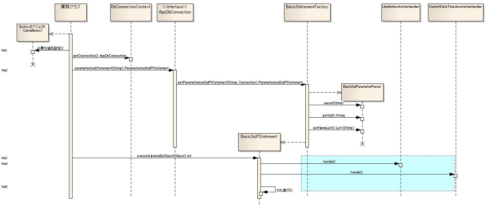

# オブジェクトのフィールドの値のデータベースへの登録機能(オブジェクトのフィールド値を使用した検索機能)

本章では、 [Javaオブジェクトのフィールドの値を容易にデータベースに登録できる機能](../../component/libraries/libraries-04-DbAccessSpec.md#javaオブジェクトのフィールドの値を容易にデータベースに登録できる機能) 、 [LIKE検索を簡易的に実装出来る機能](../../component/libraries/libraries-04-DbAccessSpec.md#like検索を簡易的に実装出来る機能) 、 [条件が可変のSQL文を組み立てる機能](../../component/libraries/libraries-04-DbAccessSpec.md#条件が可変のsql文を組み立てる機能) の機能説明を行う。
本機能を使用した場合、SQL文のバインド変数には「?」ではなく、名前付きの変数名を記述する必要がある。

下記は、名前付き変数を使用した場合とJDBCの標準機能を使用した場合のSQL文の記述例である。

```sql
-- JDBC標準機能の場合

INSERT INTO USER_MTR
VALUES (?, ?, ?, ?)

-- 本機能を使用した場合
INSERT INTO USER_MTR
VALUES (:userId, :userName, :userNameKana, :tel)

-- 部分一致検索の「%」を使用した場合
SELECT USER_NAME
  FROM USER_MTR
 WHERE USER_NAME LIKE :userName%

-- 可変条件を定義できる。
SELECT USER_NAME
  FROM USER_MTR
 WHERE $if(userName) {USER_NAME LIKE :userName%}
```

## クラス図


### 各クラスの責務

本章に記載のないインタフェース、クラスは、 [SQL文実行部品の構造とその使用方法](../../component/libraries/libraries-04-Statement.md#sql文実行部品の構造とその使用方法) を参照。

#### インタフェース定義

| インタフェース名 | 概要 |
|---|---|
| nablarch.core.db.statementパッケージ |  |
| SqlParameterParserFactory | 名前付きバインド変数をもつSQL文を解析するためのオブジェクト(SqlParameterParser)を 取得するンタフェース |
| SqlParameterParser | 名前付きバインド変数をもつSQL文を解析するインタフェース  実装クラスでは、SQL文を解析し下記情報を取得できるようにすること。  * java.sql.PreparedStatementで実行できる形式のSQL文(バインド変数を「?」に置き換えたSQL文) * 名前付きバインド変数のList |
| SqlConvertor | SQL文の変換を行うインタフェース。 |
| AutoPropertyHandler | オブジェクトの自動設定項目のフィールドに値を設定するインタフェース。  実装クラスでは、フィールドのアノテーションやフィールド名等を元に値を自動設定する。 |

#### クラス定義

a) nablarch.core.db.statement.SqlParameterParserFactoryの実装クラス

| クラス名 | 概要 |
|---|---|
| nablarch.core.db.statementパッケージ |  |
| BasicSqlParameterParserFactory | BasicSqlParameterParserを生成するSqlParameterParserFactoryの基本実装クラス。 |

b) nablarch.core.db.statement.SqlParameterParserの実装クラス

| クラス名 | 概要 |
|---|---|
| nablarch.core.db.statementパッケージ |  |
| BasicSqlParameterParser | SqlParameterParserのBasic実装クラス。  本クラスでは、下記ルールにしたがいSQL文の解析、及びJDBC実行用のSQL文の変換処理を行う。  * 名前付きバインド変数は、コロン(":")で開始され英(大文字、小文字)数字、   アンダースコア("_")、パーセント("%")で構成されている。 * LIKE検索条件の構築    本機能でサポートする部分一致検索のパターンは下記の3パターンとなっている。    > **Note:** > a) 前方一致検索    > バインド変数名の末尾にパーセントを付加する。   > 例：「:userName%」    > b) 後方一致検索の場合    > バインド変数名の先頭にパーセントを付加する。   > 例：「:%userName」    > c) 部分一致検索の場合    > バインド変数名の前後にパーセントを付加する。   > 例：「:%userName%」    > > **Warning:** > > 後方、部分一致検索は、顧客要件で回避不可能である場合に、顧客と下記デメリットを合意した上で使用すること。    > > デメリット    > > ```   > > 後方、部分一致検索では、インデックスが使用されずにテーブルフルスキャンとなる。   > > これにより、極端な性能劣化が発生する。   > > ``` * Nablarchの拡張構文が埋め込まれたSQL文をJDBC標準のSQL文に変換する。    デフォルトでは、下記の拡張構文を変換する。    * 可変条件構文   * 可変IN構文   * 可変ORDER BY構文 |

c) nablarch.core.db.statement.SqlConvertorの実装クラス

| クラス名 | 概要 |
|---|---|
| nablarch.core.db.statement.sqlconvertorパッケージ |  |
| SqlConvertorSupport | SQL文の変換を行うクラスをサポートするクラス。  バインド変数に対応するフィールドの値を取得する機能を提供する。 |
| VariableConditionSyntaxConvertor | SQL文の可変条件構文を変換するクラス。  可変条件(入力有無によって条件に含めるか否かの条件)は、 $if(フィールド名) {SQL文の条件}となっていること。  可変条件部分を本クラスでは、下記例のようにJDBC実行用のSQL文に変換を行う。  JDBC実行用SQLに変換後のSQL文が不正な場合は、SQL実行時エラーが発生する。 このため変換後のSQL文が、不正なSQL文とならないように本機能独自のSQL文を記述する必要がある。 特に、$if構文が使用できる箇所は条件部分(WHERE句)のみであるため、その他の部分で使用した場合には、 不正なSQL文が生成される原因となる。  以下に例を示す。  ```java public class UserMtr {     /** ユーザ名 */     private String userName;     /** ユーザ区分 */     private String userKbn;      // アクセスメソッドなどは省略 }  // 可変条件の部分は、$if(フィールド名) {SQL文の条件}形式で実装する。 // UserMtr#userNameがnull、空文字列以外(配列の場合は、サイズが1以上)の場合には、 // 「user_name = :user_name」が有効な条件となる。 // UserMtr#userKbnがnull、空文字列以外(配列の場合は、サイズが1以上)の場合には、 // 「user_kbn = ('1', '2')」が有効な条件となる。 String sql =       "SELECT "         + "USER_ID, "         + "USER_NAME, "         + "USER_KBN "     + "FROM "         + "USER_MTR "     + "WHERE "         + "$if (userName) {USER_NAME = :user_name} "         + "AND $if (userKbn) {USER_KBN IN ('1', '2')}"  //*********************************************************************** // 上記SQL文は、本クラスで、下記の形に変換される。 // 条件に含める場合(フィールドの値がnull以外かつ空文字列 // (配列の場合は、サイズが1以上)以外の場合条件を // 「(0 = 1 or (user_name = ?))」形式に変換する。 // 0 = 1はfalseになるため、必ず(user_name = ?)が評価される。 // // 条件に含めない場合(フィールドの値がnullまたは、 // 空文字列(配列の場合は、サイズが0)の場合条件を // 「(0 = 0 or (user_name = ?))」形式に変換する。 // 0 = 0はtrueになるため、(user_name = ?)は評価されない。 //***********************************************************************   "SELECT "     + "USER_ID, "     + "USER_NAME, "     + "USER_KBN " + "FROM "     + "USER_MTR" + "WHERE (0 = 0 OR (USER_NAME = ?))"     + "AND (0 = 1) OR (USER_KBN IN ('1', '2'))"  //*********************************************************************** // 本クラスで「$if」構文を利用できる箇所は条件部分(WHERE句)のみとなっている。 // また、$ifをネストして利用することはできない。 // このような構文を利用した場合は、本クラスで生成されるJDBC実行用のSQLが // 不正な構文となり、SQL実行時エラーが発生する。 // 以下が、NGとなるSQL文の例である。 //***********************************************************************  // SELECT句で、$if構文を使用しているため不正 "SELECT $if (user) {:user} FROM USER_MTR"  // WHERE句で$if構文を使用しているが、ネストしているため不正   "SELECT "     + "USER_ID " + "FROM "     + "USER_MTR " + "WHERE $if (user) {USER = :user $if(userId) {USER_ID = :userId}}" ``` |
| VariableInSyntaxConvertor | SQL文の可変IN構文を変換するクラス。  IN句の条件部分を動的に生成する場合は、バインド変数名の末尾を角括弧([])で終わらすこと。 角括弧で終了しているバインド変数名は、無条件にIN句の条件項目であると判断し 動的にIN句の構築を行う。  また、IN句のバインド変数名に対応するフィールドのデータタイプは 配列または、Collectionとして定義されている必要がある。 この配列(Collection)の要素数がIN句の条件数となる。  以下に例を示す。  ```java // IN句に対応するフィールドは、配列またはCollectionとして宣言すること。 public class UserSearchCondition {     /** ユーザ区分 */     private List userKbn; }  // IN区のバインド変数名は、末尾に角括弧([])を付加する。 // IN句と可変条件を合わせて使用する場合には、 // 可変条件の条件部分には角括弧を付加せずに記述する。 String sql =       "SELECT "         + "USER_ID, "         + "USER_NAME, "         + "USER_KBN "     + "FROM "         + "USER_MTR "     + "WHERE "         + "$if (userKbn) {USER_KBN IN (:userKbn[])}";  // 上記のSQL文に、['1', '2']をもつListを設定した場合。 // 条件部分は、「(0 = 1 OR (USER_KBN IN (?, ?)))」と変換される。  // 上記のSQL文に、サイズ0のListを設定した場合、 // 条件部分は、「(0 = 0 OR (USER_KBN IN (?)))」と変換される。 // この場合、条件部分には固定で"null"が設定される。 ```  > **Note:** > IN句の条件数は、データベースベンダーによって上限が設けられている。 > 各アプリケーションでは、この上限を超えることがないように設計を行うこと。  > **Warning:** > IN句の拡張構文は、本機能は、検索条件のオブジェクトにMapインタフェースの実装クラスを指定することは出来ない。 > なぜなら、Mapは値に対する型情報が存在しないため、IN句を構築する際に値が配列またはCollectionであることの > チェックが確実に行えないためである。  > これは、テスト時に確実に型チェックを行えないことを意味し(例えば値がnullの場合は、その型が何かは実行時にはわからない)、 > 予期せぬ不具合の温床となるため本フレームワークでは敢えてMapの使用を制限している。  > **Warning:** > IN句の条件項目に設定する配列(Collection)がnullや要素数が0になる可能性がある場合は、 > 必ず可変条件と組み合わせて使用すること。 > 可変条件としなかった場合に、サイズ0の配列(Collection)やnullのオブジェクトを設定した場合、 > 条件が「IN (null)」となり、想定したデータが取得できない可能性がある。  > ※IN句は、条件式(カッコの中)を空にすることはできないため、サイズ0の配列やnullが指定された場合は、 > 条件式を「IN (null)」とする仕様としている。  > **Warning:** > IN句以外の箇所に、IN句用のバインド変数を設定しないこと。 > IN句以外の箇所に指定されていた場合、不正なSQL文が生成されSQL実行時エラーとなる。  > 不正な例:  > ``` > 条件:USER_ID = :userId[] > フィールド値:["00001", "00002"] > 生成されるSQL文:USER_ID = ?, ? > ```  * リテラル部分に名前付きバインド変数と同じ形式の文字列が記述されていてもバインド変数として扱わない。 * リテラル文字は、シングルクォート("'")で囲われている。 * リテラル文字のエスケープ文字は、シングルクォート("'")である。 * SQL文にコメントが存在しない。  > **Warning:** > 本クラスでは、SQL文の妥当性のチェックは行わない。 > このため、不正な構文のSQL文があった場合には、SQL文実行時に例外が発生する。 |
| VariableOrderBySyntaxConvertor | SQL文の可変ORDER BY構文を変換するクラス。  可変ORDER BY構文の仕様は下記のとおり。  書き方:  ``` $sort(フィールド名) {(ケース1)(ケース2)・・・(ケースn)}  フィールド名: 検索条件オブジェクトからソートIDを取得する際に使用するフィールド名を表す。  ケース: ORDER BY句の切り替え候補を表す。         候補を一意に識別するソートIDとORDER BY句に指定する文字列(以降はケース本体と称す)を記述する。         どの候補にも一致しない場合に使用するデフォルトのケースには、ソートIDに"default"を指定する。 ```  ケース部分の仕様は下記のとおり。  * 各ケースは、ソートIDとケース本体を半角丸括弧で囲んで表現する。 * ソートIDとケース本体は、半角スペースで区切る。 * ソートIDには半角スペースを使用不可とする。 * ケース本体には半角スペースを使用できる。 * 括弧開き以降で最初に登場する文字列をソートIDとする。 * ソートID以降で括弧閉じまでの間をケース本体とする。 * ソートIDおよびケース本体はトリミングする。  検索条件オブジェクトからフィールド名で指定された値を取得し、 取得した値が一致するケースのケース本体をORDER BY句としてSQL文に追加する。 取得した値が一致するケースが存在しない、かつデフォルトのケースが存在する場合は、 デフォルトのケース本体をORDER BY句としてSQL文に追加する。 取得した値が一致するケースが存在しない、かつデフォルトのケースも存在しない場合は、 可変ORDER BY構文を削除しただけのSQL文を返す。  以下に例を示す。  ```java public class UserMtr {     /** ユーザ名 */     private String userName;     /** 可変ORDER BYのソートID */     private String sortId;      // アクセスメソッドなどは省略 }  // 可変ORDER BYの部分は、$sort(フィールド名) {(ケース1) (ケース2)・・・(ケースn)}形式で実装する。 String sql =       "SELECT "         + "USER_ID, "         + "USER_NAME, "     + "FROM "         + "USER_MTR "     + "WHERE "         + "USER_NAME = :user_name "     + "$sort(sortId) {(1 USER_ID ASC) (2 USER_ID DESC) (3 USER_NAME ASC) (4 USER_NAME DESC) (default USER_ID)}";  //*********************************************************************** // 上記SQL文に対するORDER BY句の変換例を下記に示す。 // // UserMtr#sortId -> 変換後のORDER BY句 // null -> ORDER BY USER_ID  ・・・(デフォルトのケースが使用される) // 1    -> ORDER BY USER_ID ASC // 2    -> ORDER BY USER_ID DESC // 3    -> ORDER BY USER_NAME ASC // 4    -> ORDER BY USER_NAME DESC // 5    -> ORDER BY USER_ID  ・・・(デフォルトのケースが使用される) //*********************************************************************** ```  > **Warning:** > 本クラスでは、SQL文の妥当性のチェックは行わない。 > このため、不正な構文のSQL文があった場合には、SQL文実行時に例外が発生する。 |

d) nablarch.core.db.statement.AutoPropertyHandlerの実装クラス

| クラス名 | 概要 |
|---|---|
| nablarch.core.db.statement.autopropertyパッケージ |  |
| FieldAnnotationHandlerSupport | フィールドのアノテーション情報を元に値を設定するクラスをサポートするクラス。 |
| CurrentDateTimeAnnotationHandler | nablarch.core.db.statement.autoproperty.CurrentDateTimeアノテーションが 設定されているフィールドにシステム日時を設定するクラス。  システム日時は、下記ルールで設定される。  \| フィールドのデータ型 \| 設定方法 \| \|---\|---\| \| java.sql.Date \| システム日時をjava.sql.Dateに変換して設定する。 \| \| Timestamp \| システム日時をjava.sql.Timestampに変換して設定する。 \| \| Time \| システム日時をjava.sql.Timeに変換して設定する。 \| \| String \| CurrentDateTimeのformatプロパティに設定されている値で、 SimpleDateFormatを使用してフォーマットした値を設定する。 formatプロパティが指定されていない場合は、 [設定ファイル](../../component/libraries/libraries-04-ObjectSave.md#設定ファイル例) に記述されたデフォルトのフォーマットを使用する。 \| \| Integer \|  \| \| Long \|  \|  > **Note:** > システム日時は、 [システム日時機能](../../component/libraries/libraries-06-SystemTimeProvider.md#システム日時機能) を使用して取得する。 |
| UserIdAnnotationHandler | nablarch.core.db.statement.autoproperty.UserIdアノテーションが 設定されているフィールドにユーザIDを設定するクラス。  ユーザIDは、ThreadContextから取得する。  > **Note:** > ThreadContextに設定されるユーザIDについては、 [同一スレッド内でのデータ共有(スレッドコンテキスト)](../../component/libraries/libraries-thread-context.md#同一スレッド内でのデータ共有スレッドコンテキスト) を参照 |
| RequestIdAnnotationHandler | nablarch.core.db.statement.autoproperty.RequestIdアノテーションが 設定されているフィールドにリクエストIDを設定するクラス。  リクエストIDは、ThreadContextから取得する。  > **Note:** > ThreadContextに設定されるリクエストIDについては、 [同一スレッド内でのデータ共有(スレッドコンテキスト)](../../component/libraries/libraries-thread-context.md#同一スレッド内でのデータ共有スレッドコンテキスト) を参照 |

e) オブジェクトのフィールドの値をデータベースに登録するためのクラス

| クラス名 | 概要 |
|---|---|
| nablarch.core.db.statement.autopropertyパッケージ |  |
| FieldAndAnnotationLoader | オブジェクトに定義されたフィールド情報とフィールドのアノテーション情報をロードするクラス。  このクラスでロードした値は、オブジェクトのフィールドの値をSQL文のバインド変数にセットする際に 使用される。  なお、ロードした値は、 [静的データのキャッシュ](../../component/libraries/libraries-05-StaticDataCache.md) を使用してキャッシュされるため、 同一のクラスに対してフィールド情報の取得処理が複数回実行されることはない。 これにより、リフレクションを使用してフィールド情報を取得する再のコストを 軽減でき性能劣化を防止することができる。 |

## 使用例

### 処理シーケンス

本章では、オブジェクトのフィールドの値をデータベースに登録する場合のシーケンス、実装例について解説を行う。



#### 処理概要

No1.登録対象のオブジェクトを生成し、必要な情報を設定する。

ユーザID、システム日時アノテーションが設定されているフィールドには値を設定する必要はない。

No2.AppDbConnection#prepareParameterizedSqlStatementを呼び出し、SQL文実行用のstatementを取得する。

SQL文のバインド変数部分には、JDBC標準の「?」を記述するのではなく名前付き変数名を記述する。
ここで指定された名前付き変数名をもつSQL文は、BasicSqlParameterParserで解析が行われJDBC標準機能で実行可能な下記情報が取得される。

* JDBC標準のSQL文(名前付きバインド変数名を、「?」に置き換えたSQL文)
* バインド変数「?」に対応するバインド変数名

> **Note:**
> BasicSqlParameterParserの仕様に付いては、 BasicSqlParameterParserの概要 を参照すること。
> BasicSqlParameterParserの仕様では不十分な場合は、 [SqlParameterParser](../../component/libraries/libraries-04-ObjectSave.md#nablarchcoredbstatementパッケージ) の実装クラスを追加し、実装を置き換えて使用すること。

No3.BasicSqlPStatement#executeUpdateByObjectを呼び出しオブジェクトのフィールドの値を登録する。

No4.オブジェクトのフィールドの値に自動設定値を設定する。

2でexecuteUpdateByObjectに設定されたオブジェクトに対して、フィールドに対して自動設定値を設定する。
以下が、自動設定項目を示すアノテーションである。

| アノテーション名 | 概要 |
|---|---|
| @UserId | UserIdAnnotationHandlerによって、ユーザIDが設定される。 |
| @CurrentDateTime | CurrentDateTimeAnnotationHandlerによって、システム日時が設定される。 |
| @RequestId | RequestIdAnnotationHandlerによって、リクエストIDが設定される。 |

※自動設定値の取得元は、 [AutoPropertyHandlerの実装クラスのクラス概要](../../component/libraries/libraries-04-ObjectSave.md#nablarchcoredbstatementsqlconvertorパッケージ) を参照すること。

No5.SQL文を実行する。

オブジェクトのフィールドの値をバインド変数に設定し、SQL文を実行する。
バインド変数への設定は、PreparedStatement#setObjectを使用して行う。
フィールドの値が不正な値(データベースへ登録できない値)の場合には、SQL文の実行時例外が発生する。

> **Note:**
> 使用するハンドラクラスを追加や変更することにより、各プロジェクトで作成したアノテーションやカラム名で自動設定項目を判断する事もできる。

### Java実装例(Objectのフィールド値を登録する場合)

```java
// オブジェクトの実装
public class MyEntity {
    // 顧客ID
    private String cstId;

    // 金額
    private long kingaku;

    // 登録日時
    @CurrentDateTime(format="yyyyMMddHHmmss")
    private String insDateTime;

    // 登録ユーザID
    @UserId
    private String insUserId;

    // 更新日時
    @CurrentDateTime(format="yyyyMMddHHmmss")
    private String updDateTime;

    // 更新ユーザID
    @UserId
    private String updUserId;

    // リクエストID
    @RequestId
    private String requestId;

    // 本来はここに各フィールドのアクセスメソッドを定義する。

}

// Entityを生成し、自動設定項目以外を設定する。
MyEntity entity = new MyEnitity();
entity.setCstId("1000000001");
entity.setKingaku(1000);

AppDbConnection perCon = DbConnectionContext.getConnection();

// 指定するSQL文のバインド変数部分には、「?」を設定するのではなく、「:」＋「オブジェクトのフィールド名」とすること。
ParameterizedSqlPStatement insert = perCon.prepareParameterizedSqlStatement(
        "INSERT INTO "
          + "MY_TABLE "
          + "("
          + "CST_ID, "
          + "KINGAKU, "
          + "INS_DATE_TIME, "
          + "INS_USER_ID, "
          + "UPD_DATE_TIME, "
          + "UPD_USER_ID, "
          + "EXECUTION_ID, "
          + "REQUEST_ID"
          + ")"
      + "VALUES"
          + "("
          + ":cstId, "
          + ":kingaku, "
          + ":insDateTime, "
          + ":insUserId, "
          + ":updDateTime, "
          + ":updUserId, "
          + ":executionId, "
          + ":requestId)");
insert.executeUpdateByObject(entity);
```

> **Note:**
> 本フレームワークではSQL文を外部化(外部ファイルに記述)することを推奨している。
> SQL外部化した場合のの実装例は、 [推奨するJavaの実装例(SQL文を外部ファイル化した場合)](../../component/libraries/libraries-04-Statement.md#推奨するjavaの実装例sql文を外部ファイル化した場合) を参照すること。

## 設定ファイル例

```xml
<!-- StatementFactoryの設定 -->
<component name="statementFactory"
           class="nablarch.core.db.statement.BasicStatementFactory">

    <!-- 名前付きバインド変数をもつSQL文を解析するための設定 -->
    <property name="sqlParameterParserFactory">
        <component class="nablarch.core.db.statement.BasicSqlParameterParserFactory">
            <!-- SQLの変換を行うクラスの設定 -->
            <property name="sqlConvertors">
                <list>
                    <!-- SQL文の可変条件構文を変換するクラスの設定 -->
                    <component class="nablarch.core.db.statement.sqlconvertor.VariableConditionSyntaxConvertor">
                        <property name="allowArrayEmptyString" value="false" />
                    </component>
                    <!-- SQL文の可変IN構文を変換するクラスの設定 -->
                    <component class="nablarch.core.db.statement.sqlconvertor.VariableInSyntaxConvertor" />
                    <!-- SQL文の可変ORDER BY構文を変換するクラスの設定 -->
                    <component class="nablarch.core.db.statement.sqlconvertor.VariableOrderBySyntaxConvertor" />
                </list>
            </property>
        </component>
    </property>

    <!-- Objectのフィールド情報をキャッシュするための設定 -->
    <property name="objectFieldCache" ref="fieldAnnotationCache"/>

    <!-- オブジェクトのフィールドに値を自動設定するための設定 -->
    <property name="updatePreHookObjectHandlerList">
        <list>
            <component class="nablarch.core.db.statement.autoproperty.CurrentDateTimeAnnotationHandler">
                <property name="dateFormat" value="yyyyMMdd"/>
                <property name="fieldAnnotationCache" ref="fieldAnnotationCache"/>
                <property name="dateProvider">
                    <component class="nablarch.core.date.BasicSystemTimeProvider"/>
                </property>
            </component>
            <component class="nablarch.core.db.statement.autoproperty.UserIdAnnotationHandler">
                <property name="fieldAnnotationCache" ref="fieldAnnotationCache"/>
            </component>
            <component class="nablarch.core.db.statement.autoproperty.RequestIdAnnotationHandler">
                <property name="fieldAnnotationCache" ref="fieldAnnotationCache"/>
            </component>
        </list>
    </property>

    <!--
    LIKE条件のエスケープ文字(SQL文のESCAPE句に設定される文字)
    ここで設定した文字は、escapeTargetCharListに設定がなくても自動でエスケープされる。
    -->
    <property name="likeEscapeChar" value="\">

    <!--
    LIKE条件のエスケープ対象文字一覧
    エスケープが必要な文字をカンマ区切りで設定する。
    -->
    <property name="likeEscapeTargetCharList" value="%,％,_,＿">

</component>

<!--
フィールドとアノテーション情報をキャッシュするための設定
ここでキャッシュした値は、フィールドの値のデータベース登録処理と、
アノテーションを元に値の自動設定処理で使用される。
-->
<component name="fieldAnnotationCache" class="nablarch.core.cache.BasicStaticDataCache">
    <property name="loader">
        <component class="nablarch.core.statement.autoproperty.FieldAndAnnotationLoader"/>
    </property>
    <property name="loadOnStartup" value="false"/>
</component>

<!-- 初期化機能の設定 -->
<component name="initializer" class="nablarch.core.repository.initialization.BasicApplicationInitializer">
    <property name="initializeList">
        <list>
            <component-ref name="fieldAnnotationCache"/>
        </list>
    </property>
</component>
```

### 設定内容詳細

a) StatementFactoryの設定

| property名 | 設定内容 |
|---|---|
| sqlParameterParserFactory(必須) | nablarch.core.db.statement.SqlParameterParserFactoryを実装したクラスの設定を行う。 本サンプルでは、「nablarch.core.db.statement.BasicSqlParameterParserFactory」を設定している。 |
| objectFieldCache(必須) | nablarch.core.cache.StaticDataCacheを実装したクラスの設定を行う。 本サンプルでは、component名:fieldAnnotationCacheへの参照を設定している。 |
| updatePreHookObjectHandlerList(必須) | nablarch.core.ObjectHandlerを実装したクラスをListで設定を行う。 本サンプルでは、本機能で提供する下記の実装クラスを設定している。  * nablarch.core.db.statement.autoproperty.CurrentDateTimeAnnotationHandler * nablarch.core.db.statement.autoproperty.UserIdAnnotationHandler * nablarch.core.db.statement.autoproperty.RequestIdAnnotationHandler |
| likeEscapeChar(必須) | LIKE条件の文字列のエスケープに使用するエスケープ文字を設定する。ここで設定した値は、LIKE条件を持つSQL文に自動で設定される。 本設定値の指定がない場合は、デフォルトで「\\」がエスケープ文字として使用される。 また、この設定値は「likeEscapeTargetCharList」で指定がなくても自動でエスケープが行われる。 |
| likeEscapeTargetCharList(必須) | LIKE条件の文字列の中でエスケープが必要となる文字をカンマ(,)区切りで設定する。 本設定値の指定がない場合は、デフォルトで「%」、「_」がエスケープ対象の文字となる。 |

a)-1.BasicSqlParameterParserFactoryへの設定

| property名 | 設定内容 |
|---|---|
| sqlConvertors | SqlConvertorの実装クラスをlistコンポーネントとして設定する。  本設定を省略した場合は、以下のSqlConvertor実装クラスがデフォルトの設定として使用される。  * VariableConditionSyntaxConvertor * VariableInSyntaxConvertor * VariableOrderBySyntaxConvertor |

a)-2.VariableConditionSyntaxConvertorへの設定

| property名 | 設定内容 |
|---|---|
| allowArrayEmptyString | 配列(Collection)の要素数が1で、その要素の値が空文字列かnullの場合に条件に含めるか否かを設定する。  falseを設定した場合には、配列(Collection)の要素数が1で、その要素の値が空文字列またはnullの場合には、 $if構文から実行用SQLの変換時に該当の条件を除外するように「(0 = 0) or」条件を付加する。  本設定を省略した場合の設定値は「true」となる。このため設定を省略した場合は、「true」を設定した時と同じ動作となり、 配列(Collection)の要素数が1で、その要素の値が空文字列またはnullの場合であっても条件から除外されることはない。  > **Note:** > 画面アプリケーションのでは、リクエストパラメータとしてキーが存在していて値が空文字列の場合、 > 精査後に生成されるオブジェクトが持つプロパティの配列サイズは1となり、その値は空文字列となる。 > この場合、値が送信されていないため$if構文の条件を除外する事が正しい動作となる。 > このため本プロパティには「false」を設定する必要がある。  > 逆にバッチ処理では、条件の配列に要素が存在する場合は必ず条件に含める必要があるため、 > 本設定値には「true(デフォルト値)」を設定すること。 |

a)-3.VariableInSyntaxConvertorへの設定

本クラスは、プロパティを持たないため特に設定は不要である。

a)-4.VariableOrderBySyntaxConvertorへの設定

本クラスは、プロパティを持たないため特に設定は不要である。

b) フィールドに自動で値を設定するコンポーネントの設定

b)-1.CurrentDateTimeAnnotationHandlerの設定

| property名 | 設定内容 |
|---|---|
| dateFormat(必須) | デフォルトの日付フォーマットを指定する。指定できるフォーマット形式は、java.text.SimpleDateFormatに準拠する。 このフォーマットはCurrentDateTimeAnnotationHandlerで、フィールドにシステム日時を設定する際に使用される。 |
| dateProvider(必須) | システム日付を取得するためのクラスを設定する。 本サンプルでは、「nablarch.core.date.BasicSystemTimeProvider」を設定している。 |
| fieldAnnotationCache(必須) | nablarch.core.cache.StaticDataCacheを実装したクラスの設定を行う。 本サンプルでは、component名:fieldAnnotationCacheへの参照を設定している。 |

b)-2.UserIdAnnotationHandlerの設定

| property名 | 設定内容 |
|---|---|
| fieldAnnotationCache(必須) | nablarch.core.cache.StaticDataCacheを実装したクラスの設定を行う。 本サンプルでは、component名:fieldAnnotationCacheへの参照を設定している。 |

b)-3.RequestIdAnnotationHandlerの設定

| property名 | 設定内容 |
|---|---|
| fieldAnnotationCache(必須) | nablarch.core.cache.StaticDataCacheを実装したクラスの設定を行う。 本サンプルでは、component名:fieldAnnotationCacheへの参照を設定している。 |

b)-4.FieldAnnotationHandlerSupportのサブクラス(CurrentDateTimeAnnotationHandlerやUserIdAnnotationHandlerなど)から参照されるBasicStaticDataCacheの設定

| property名 | 設定内容 |
|---|---|
| loader(必須) | nablarch.core.db.statement.autoproperty.FieldAndAnnotationLoaderを設定する。  > **Attention:** > 本プロパティには、必ず「nablarch.core.db.statement.autoproperty.FieldAndAnnotationLoader」を設定すること。 > これは、FieldAndAnnotationLoaderを使用しているクラスと密結合になっているためである。 > 本来は、この設定は不変であるため設定ファイルに記述する必要はないが、StaticDataCacheの実装クラスの > BasicStaticDataCacheを置き換える可能性があるため設定ファイルに記述を行うようにしている。 |

> **Attention:**
> 下記のコンポーネントはpropertyのref属性を使用して同一のBasicStaticDataCacheを参照すること。

> * >   BasicStatementFactory
> * >   CurrentDateTimeAnnotationHandler
> * >   UserIdAnnotationHandler
> * >   RequestIdAnnotationHandler

> 別々のBasicStaticDataCacheを設定した場合、まったく同じ情報が別々のメモリ上にキャッシュされ、不必要にメモリを消費してしまう。
> これにより、メモリ不足が発生しシステムに重大な影響を与える可能性がある。

c) initializerの設定

本機能で使用する、BasicStaticDataCacheを初期化する設定を行う。
initializerの詳細な設定方法は、 [リポジトリ](../../component/libraries/libraries-02-Repository.md) を参照すること。
