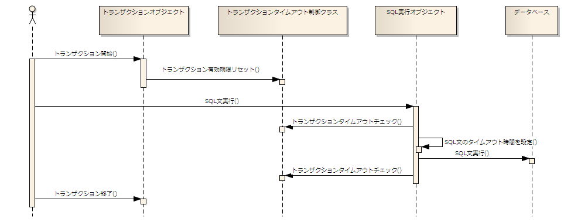

# トランザクションタイムアウト機能

本章では、本機能で提供するトランザクションタイムアウト機能について解説を行う。

トランザクションタイムアウト機能では、トランザクションを開始してから一定秒数（設定ファイルで指定した秒数）を超過した場合、
トランザクションタイムアウト例外を送出しアプリケーションの処理を強制的に中止する。
トランザクションタイムアウト例外が発生するタイミングは、データベースへのアクセス時となる。
これは、データベースアクセス時にトランザクションタイムアウトチェックを行なっているためである。

トランザクションタイムアウトチェックのタイミング等の詳細は、後述の 処理シーケンス を参照。

本機能を使用する際には、必ず 注意点 の内容を確認すること。

## 処理シーケンス

トランザクションタイムアウトの処理シーケンス（概要）を以下に示す。



### 各処理の概要

**1). トランザクション開始**

トランザクションを開始する。

トランザクションの開始時に、トランザクションタイムアウト秒数と現在日時からトランザクションの有効期限を算出する。

**2). SQL実行**

アプリケーションからSQL文(SQL文の種類は問わない)を実行する。

**2-1). トランザクションタイムアウトチェック**

SQL文を実行する前に、トランザクションタイムアウトの事前チェックを行う。
この時点で、現在日時がトランザクションの有効期限を過ぎている場合、トランザクションタイムアウトエラーを送出する。

**2-2). SQL文のタイムアウト時間を設定**

現在日時を元にトランザクション有効期限までの残り秒数を求め、クエリタイムアウト秒数 [1] を設定する。
これは、データベース側でのロック解放待ちや、単純にパフォーマンスの悪いSQLの場合であっても、
トランザクション有効期限を過ぎた場合にSQL文の実行を強制的に中止するために設定する。

**2-3). トランザクションタイムアウトチェック**

**2-3-1). SQL文の実行が成功した場合**

SQL文の実行が成功した場合でも、既にトランザクション有効期限を超過している可能性があるためトランザクションタイムアウトチェックを行う。
もし、トランザクション有効期限を過ぎている場合には、トランザクションタイムアウトエラーを送出する。 [2]

**2-3-2). SQL文の実行に失敗した場合**

SQL文の実行に失敗した場合、発生した例外がトランザクションタイムアウト対象の例外かをチェックする。 [3]
トランザクションタイムアウト対象の例外の場合で、トランザクションの有効期限を過ぎている場合には、トランザクションタイムアウト例外を送出する。

> **Note:**
> トランザクションの有効期限内であれば、トランザクションタイムアウト対象の例外が発生してもトランザクションタイムアウトエラーとはしない。
> この場合は、通常のSQL文実行時例外として例外の送出を行う。

**3). トランザクション終了**

トランザクションを終了（コミットまたはロールバック）する。
トランザクションタイムアウトエラーが発生した場合には、必ずロールバック処理が行われる。

> **Note:**
> トランザクション終了時にはトランザクションタイムアウトチェックは行わない。

> これは、トランザクション終了時にトランザクションの有効期限が過ぎていたとしても、クライアント（ユーザ）に対する応答時間は変わらないため、
> 利便性を考え処理を正常に終了させることを優先させるためである。

クエリタイムアウト設定は、java.sql.Statement#setQueryTimeoutを使用して行う。

クエリタイムアウトは、厳密に設定秒数を超過した場合にエラーとなるわけではない。
このため、設定したタイムアウト秒数を超過しても例外が発生せずに、SQL文の実行が正常終了する場合がある。
このような場合でも、トランザクションタイムアウトエラーを発生させるために、SQL文の実行が成功した場合でもトランザクションのタイムアウトチェックを実施している。

トランザクションタイムアウト対象の例外の判定は、ベンダー依存の例外コード(SQLException#getErrorCodeから取得される値)で行う。
トランザクションタイムアウト対象としたい例外コードは設定ファイルに指定する。

なお、上述の通りSQL文実行時にクエリタイムアウト設定を行なっている。
このため、トランザクションタイムアウトの例外コードの設定には、クエリタイムアウト発生時に送出される例外の例外コードを設定する必要がある。
クエリタイムアウト発生時の例外コードの詳細は各データベースベンダより提供されるマニュアル等を参照すること。

## トランザクションタイムアウトを使用するための設定

トランザクションタイムアウトを有効化するためには、「JdbcTransactionFactory」に対してトランザクションタイムアウト秒数を設定する。

以下に設定例を示す。

```xml
<component class="nablarch.core.db.transaction.JdbcTransactionFactory">
  <property name="isolationLevel" value="READ_COMMITTED" />
  <!-- トランザクションタイムアウト秒数 -->
  <property name="transactionTimeoutSec" value="15" />
  <!-- トランザクションタイムアウトに付け替えを行うSQLExceptionのエラーコード一覧 -->
  <property name="transactionTimeoutErrorCodeList" value="1013,30006" />
  </property>
</component>
```

各設定値の詳細

| プロパティ名 | 設定値 |
|---|---|
| transactionTimeoutSec | トランザクションタイムアウト秒数を設定する。  本設定値を省略した場合や0以下の値を設定した場合には、 トランザクションタイムアウト機能は有効化されない。 |
| transactionTimeoutErrorCodeList | トランザクションタイムアウト対象とするベンダー依存の例外コード (SQLException#getErrorCodeから取得できる値)を設定する。(複数指定可能)  処理シーケンス で説明したように、最低限クエリタイムアウト時に発生する ベンダー依存の例外コードを設定すること。  また、データベースベンダーによってはロック解放待ちが一定時間に達すると、タイムアウトエラーが 発生するものがある。 このロック解放待ちのエラーが発生した場合で、トランザクション有効期限を過ぎていた場合に、 トランザクションタイムアウトとしたい場合がある。 この場合は、追加でロック解放待ちの例外コードを指定すると良い。 |

## 注意点

### クエリタイムアウト時の動作について

本機能ではSQL文の実行タイムアウト(クエリタイムアウト)をトランザクションタイムアウトの判定で使用している。
このクエリタイムアウトの動作は、データベースベンダーのJDBC実装に依存するため、必ず各ベンダー提供のマニュアルを確認すること。
特に注意すべき点は、クエリタイムアウト時にデータベース側のSQL文の実行処理が確実に取り消されるかどうかである。
万が一SQL文の実行が取り消されない場合、データ不整合などの原因になる可能性があるため、トランザクションタイムアウト機能は使用しないようにすること。

### アプリケーションロジックでの処理遅延について

トランザクションタイムアウト機能は、データベースアクセス時に有効期限を過ぎていないかの判定を行う。
このため、データベースアクセスを伴わない処理や、アプリケーションロジックで無限ループなどが発生した場合は、
トランザクションタイムアウトエラーとはならない点に注意すること。
