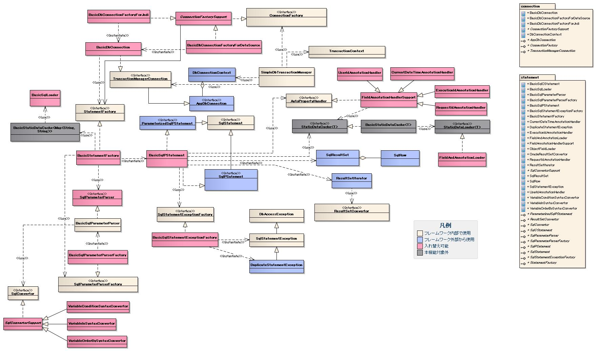

# データベースアクセス(検索、更新、登録、削除)機能

## 概要

データベース接続方法（2種類）:

**a) JNDI接続**: Webアプリケーションサーバに登録したDB接続を使用。**Webアプリでは本方式を推奨**。

**b) DataSource接続**: `javax.sql.DataSource`実装クラスを使用。バッチアプリなどWebアプリサーバのDataSourceを使用できない場合に使用。自動テストでもWebアプリサーバ起動不要でテスト実行が可能。

> **注意**: 接続方式の切り替えは設定ファイルで行えるため、アプリケーションコードに影響を与えない。

上記2種類以外の接続方法を使用したい場合には、データベース接続を取得するカスタムコンポーネント（例: `java.sql.DriverManager`から接続を取得する部品）を追加することで実現可能。

Webアプリでは :ref:`NablarchServletContextListener` によりDB接続が初期化される。

## データベース接続のプール機能について

本機能はDB接続プール機能を提供しない。プール機能を使用する場合は以下の方法で有効化すること。

**JNDI接続の場合**: WebアプリケーションサーバのDB接続プール機能を有効化する（設定方法はサーバのマニュアル参照）。

**DataSource接続の場合**: プール機能を持つDataSource実装クラスを使用する。

> **注意**: Oracleの場合、`oracle.jdbc.pool.OracleDataSource` や `oracle.ucp.jdbc.PoolDataSourceImpl` にプール用プロパティを設定することでプール機能を使用できる。DBベンダーによってはプール機能を持つDataSourceが提供されていない場合がある（各ベンダーのJDBCマニュアル参照）。

## SQLインジェクション対策について

一般的にSQLインジェクション対策として、`PreparedStatement`を使用して入力値をバインド変数化することが推奨されている。ただし、この対策は各アプリケーションプログラマにルールを徹底させるものであり、対策としては不十分である。SQLインジェクションの脆弱性を含んだ実装が業務ロジック内で行われた場合、問題を検出することが非常に困難である。

> **注**: 「入力値」とは、ユーザ入力値や外部システムからの連携データのことである。

この問題への対策として、SQL文を外部ファイルに記述することで、業務ロジックからSQL文を直接参照・文字連結することを完全に防止でき、SQLインジェクション対策として最も有効な手段となる。業務ロジックでSQL実行時に使用する値はSQL文ではなく、SQL文を一意に識別するIDを指定する。

詳細は [sql-gaibuka-label](libraries-04_Statement.md) を参照。

**安全な実装例（SQL外部化）**:
```java
private final String sqlResource = this.getClass().getName() + "#";

public List getUserName(String userId) {
    // SQL文ではなくSQLを識別するIDを指定。SQL文の直接編集（文字連結）ができないためSQLインジェクション対策になる
    AppDbConnection connection = DbConnectionContext.getConnection();
    connection.prepareStatementBySqlId(sqlResource + "SQL_ID");
    // 以下省略
}
```

> **警告**: 入力値をSQL文に文字列連結する実装はSQLインジェクションの脆弱性があるため行うべきでない。
```java
public List getUserName(String userId) {
    // 入力値を連結しているため、SQLインジェクションの脆弱性を含んだ実装となる。
    String sql =
         "SELECT "
           + "USER_NAME"
       + "FROM "
           + "USER_MTR "
       + "WHERE "
           + "ID = " + userId;
    AppDbConnection connection = DbConnectionContext.getConnection();
    connection.prepareStatement(sql);
    // 以下省略
}
```

<details>
<summary>keywords</summary>

データベース接続, JNDI接続, DataSource接続, 接続方式切り替え, NablarchServletContextListener, Webアプリ推奨, カスタムコンポーネント, DriverManager, 接続方法拡張, データベース接続プール, プール機能の有効化, oracle.jdbc.pool.OracleDataSource, oracle.ucp.jdbc.PoolDataSourceImpl, SQLインジェクション対策, PreparedStatement, バインド変数化, 入力値, ユーザ入力値, 外部システム連携データ, SQL外部化, prepareStatementBySqlId, AppDbConnection, DbConnectionContext, sql-gaibuka-label

</details>

## JDBCのAPIを踏襲した機能

本機能はJDBCのAPIをラップ（踏襲）。JDBCを拡張している機能: [db-feature-4-label](#)、[db-feature-5-label](#)、[db-feature-6-label](#)、[db-feature-7-label](#)

## 実装済み

- データベースへの接続
- SQL文の実行
- SQL文の実行ログの出力
- 各種リソース（Connection、Statement、ResultSet）の解放
- バイナリ（LOBやBYTE型）型の検索・更新
- プリフェッチ（`SQLStatement#setFetchSize`）
- バッチ更新（`SQLStatement#addBatch`）
- 重複エラー等のアプリケーションハンドリング
- 共通項目（最終更新者、最終更新日時など）の値の自動設定
- 条件が可変の場合のSQL文生成（IN句の項目数可変含む）
- LIKE検索時のエスケープ処理
- SQL文の外部ファイル定義・Javaコードとの分離
- データベースアクセス時のトランザクションタイムアウトチェック

## 未実装

- PL/SQLの実行
- 1トランザクション内でのSQL文の実行回数チェック
- テーブル更新順序チェック
- テーブル更新順序違反時の振る舞い指定（警告または例外）
- SQL文の実行ログを指定機能（リクエストID）のみ出力
- データベース接続パスワードの暗号化管理

<details>
<summary>keywords</summary>

JDBCラップ, JDBC API踏襲, データベースアクセス拡張機能, 実装済み機能, 未実装機能, Connection, Statement, ResultSet, LOB, BYTE型, バイナリ型, プリフェッチ, バッチ更新, SQLStatement, setFetchSize, addBatch, LIKE検索エスケープ, トランザクションタイムアウト, 共通項目自動設定, PL/SQL, パスワード暗号化

</details>

## 頻繁に使用するデータベースリソースの自動解放機能

下記リソースの解放処理はアプリケーションで実装不要:
- `java.sql.Connection`
- `java.sql.Statement`
- `java.sql.ResultSet`（Statement解放時に自動解放）

> **重要**: BLOB型から取得した`InputStream`やバイナリファイルリソース等は自動解放対象外のため、アプリケーションで実装すること。

本機能の全体構造図。各クラスの責務については、以降の章で解説を行う。



<details>
<summary>keywords</summary>

リソース自動解放, Connection, Statement, ResultSet, BLOB, InputStream, リソース解放対象外, 全体構造, クラス図, DbAccess, DbAccessSpec_AllClassDesign, 全体構造図, アーキテクチャ

</details>

## SQL文の実行ログ(SQLログ)の出力機能

SQLログはロガー名「SQL」（SQLロガー）で出力。SQLログを出力する場合はSQLロガーをログ出力対象に含める必要がある。

ロガー設定方法: [./01_Log](libraries-01_Log.md)、SQLログ詳細: :ref:`SQLログの出力<SqlLog>`

| ログレベル | 出力内容 |
|---|---|
| DEBUG | 実行されたSQL、SELECT文の取得件数、実行時間、SQL ID（外部ファイル化した場合） |
| TRACE | バインド変数に設定した値 |

**SQLログの抑制**: SQLログの出力を抑制したい場合には、SQLカテゴリの上記ログレベル（DEBUGおよびTRACE）をログ出力対象外に設定する。

> **警告**: SQLログは本番環境では出力すべきでない。性能劣化（ディスクI/O起因）やディスクリソース圧迫の原因となる。

- 04/04_Connection
- 04/04_Statement
- 04/04_ObjectSave
- 04/04_TransactionTimeout

<details>
<summary>keywords</summary>

SQLログ, SQLロガー, ログレベル, DEBUG, TRACE, 本番環境出力禁止, バインド変数ログ, SQLログ抑制, 04_Connection, 04_Statement, 04_ObjectSave, 04_TransactionTimeout, 接続, ステートメント, オブジェクト保存, トランザクションタイムアウト

</details>

## 件数指定でデータを取得(簡易検索機能)できる機能

開始位置・取得件数を指定してデータを取得可能。ページ切り替え機能をもつ画面で、アプリケーションの表示データフィルタリングが不要になる。

<details>
<summary>keywords</summary>

簡易検索, 件数指定取得, ページング, 取得件数, 開始位置, ページ切り替え

</details>

## Javaオブジェクトのフィールドの値を容易にデータベースに登録できる機能

オブジェクト自体を指定してDBへフィールド値を登録可能（1ステップで実行）。

対応データ型:
- 任意のオブジェクト（主に [../../determining_stereotypes](../../about/about-nablarch/about-nablarch-determining_stereotypes.md) に定義されているFormオブジェクト）のフィールド値
- Map実装クラスのvalue

**自動設定**: ログインユーザIDとタイムスタンプはオブジェクトに設定されていなくても自動でDBに登録される。処理後に参照可能。

> **注意**: 自動設定項目は開発プロジェクトで追加・変更可能。アノテーションを使用せずカラム名（フィールド名）で判断して値を設定することも可能。

```java
UserEntity entity = new UserEntity();
entity.setName("名前");
entity.setAddress("住所");
// ログインユーザID、タイムスタンプはexecuteUpdateByObject内で自動設定
statement.executeUpdateByObject(entity);
```

詳細: [オブジェクトのフィールドの値のデータベースへの登録例](libraries-04_ObjectSave.md)

<details>
<summary>keywords</summary>

executeUpdateByObject, 自動設定, ログインユーザID自動設定, タイムスタンプ自動設定, オブジェクト登録, Formオブジェクト

</details>

## LIKE検索を簡易的に実装出来る機能

LIKE部分一致検索の簡易実装機能。

メリット:
- エスケープ処理が不要（フレームワークが自動挿入）
- Javaコードに「%」の付加が不要（SQL文に記述する）
- オブジェクトのフィールド値を条件に設定可能（[db-feature-5-label](#) と同様）

```java
UserEntity entity = new UserEntity();
entity.setUserName("ユーザ");
ParameterizedSqlPStatement st = dbConnection.prepareParameterizedSqlStatement(
    "SELECT USER_ID, USER_NAME FROM USER_MTR WHERE USER_NAME LIKE :userName%");
// escape句はフレームワークが自動挿入、エスケープ処理は不要
st.retrieve(entity);
```

<details>
<summary>keywords</summary>

LIKE検索, 部分一致検索, エスケープ自動処理, prepareParameterizedSqlStatement, ParameterizedSqlPStatement, SqlPStatement

</details>

## 条件が可変のSQL文を組み立てる機能

画面入力がある場合のみ検索条件に含める可変条件のSQL文を自動生成。Javaでの入力判定・SQL組み立てが不要。

`$if(フィールド名) {条件式}` 構文でnull/空文字のフィールドをWHERE句から自動除外。

```java
Entity entity = new Entity();
entity.setUserName(null);        // nullのため検索条件から除外
entity.setUserKanaName("ユーザメイ");
ParameterizedSqlPStatement sqlPStatement = dbConnection.prepareParameterizedSqlStatement(
    "SELECT USER_ID, USER_NAME, USER_KANA_NAME FROM USER_MST "
    + "WHERE $if(userName) {user_name LIKE :userName%} "
    + "AND $if(userKanaName) {user_kana_name LIKE :userKanaName%}", entity);
SqlResultSet resultSet = sqlPStatement.retrieve(entity);
```

<details>
<summary>keywords</summary>

可変条件SQL, $if構文, 動的SQL組み立て, prepareParameterizedSqlStatement, ParameterizedSqlPStatement, SqlResultSet, SqlPStatement

</details>

## データベーストランザクションのタイムアウト機能

DBアクセス時にトランザクションが有効期限内かチェックする機能。

処理遅延（DBのロック解放待ち、SQL応答待ちなど）でトランザクション有効期限を過ぎた場合、トランザクションタイムアウト例外を送出→処理遅延した業務処理を強制終了。大量の遅延処理の残存を防止できる。

特に画面処理（Web）では、DB接続プールおよびリクエスト処理スレッドの枯渇防止に有効。

<details>
<summary>keywords</summary>

トランザクションタイムアウト, 処理遅延, 接続プール枯渇防止, タイムアウト例外, スレッド枯渇防止

</details>
