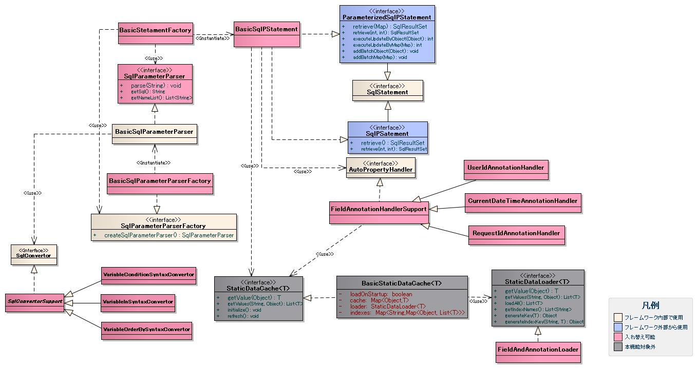

# オブジェクトのフィールドの値のデータベースへの登録機能(オブジェクトのフィールド値を使用した検索機能)

## 

SQL文のバインド変数には「?」ではなく、名前付きの変数名を記述する必要がある。

```sql
-- JDBC標準機能の場合
INSERT INTO USER_MTR
VALUES (?, ?, ?, ?)

-- 本機能を使用した場合
INSERT INTO USER_MTR
VALUES (:userId, :userName, :userNameKana, :tel)

-- 部分一致検索の「%」を使用した場合
SELECT USER_NAME
  FROM USER_MTR
 WHERE USER_NAME LIKE :userName%

-- 可変条件を定義できる。
SELECT USER_NAME
  FROM USER_MTR
 WHERE $if(userName) {USER_NAME LIKE :userName%}
```

## a) SqlParameterParserFactory実装クラス (`nablarch.core.db.statement`パッケージ)

| クラス名 | 概要 |
|---|---|
| `BasicSqlParameterParserFactory` | BasicSqlParameterParserを生成するSqlParameterParserFactoryの基本実装クラス |

## b) SqlParameterParser実装クラス (`nablarch.core.db.statement`パッケージ)

**クラス**: `BasicSqlParameterParser` — SQL文の解析およびJDBC実行用SQL文への変換を行う基本実装クラス。

変換ルール:
- 名前付きバインド変数はコロン(`:`)で始まり、英大小文字・数字・アンダースコア(`_`)・パーセント(`%`)で構成される
- LIKE検索のバインド変数パターン:
  - 前方一致: バインド変数名末尾に`%`を付加（例: `:userName%`）
  - 後方一致: バインド変数名先頭に`%`を付加（例: `:%userName`）
  - 部分一致: バインド変数名前後に`%`を付加（例: `:%userName%`）

> **警告**: 後方・部分一致検索はインデックスが使用されずテーブルフルスキャンとなり、極端な性能劣化が発生する。顧客要件で回避不可能な場合にのみ、顧客と合意の上で使用すること。

デフォルトでJDBC標準SQL文に変換する拡張構文:
- :ref:`可変条件構文<variable_condition_syntax_convertor-label>`
- :ref:`可変IN構文<variable_in_syntax_convertor-label>`
- :ref:`可変ORDER BY構文<variable_order_by_syntax_convertor-label>`

## c) SqlConvertor実装クラス (`nablarch.core.db.statement.sqlconvertor`パッケージ)

**クラス**: `SqlConvertorSupport` — SQL変換クラスのサポートクラス。バインド変数に対応するフィールドの値を取得する機能を提供する。

---

**クラス**: `VariableConditionSyntaxConvertor` — SQL文の可変条件構文 `$if(フィールド名) {SQL文の条件}` をJDBC実行用SQLに変換するクラス。

変換ルール:
- フィールド値がnull/空文字列以外（配列の場合はサイズ1以上）: 条件を `(0 = 1 OR (条件))` に変換（条件が有効）
- フィールド値がnull/空文字列（配列の場合はサイズ0）: 条件を `(0 = 0 OR (条件))` に変換（条件が無効）

> **警告**: `$if`構文が使用できる箇所はWHERE句のみ。ネストは不可。違反した場合、不正なSQL文が生成されSQL実行時エラーが発生する。

> **警告**: SQL文の妥当性チェックは行わない。不正な構文のSQL文はSQL実行時に例外が発生する。

```java
// $if構文の例
String sql =
      "SELECT USER_ID, USER_NAME, USER_KBN "
    + "FROM USER_MTR "
    + "WHERE $if (userName) {USER_NAME = :user_name} "
    + "AND $if (userKbn) {USER_KBN IN ('1', '2')}";

// NG例: SELECT句での$if使用
// "SELECT $if (user) {:user} FROM USER_MTR"
// NG例: $ifのネスト
// "WHERE $if (user) {USER = :user $if(userId) {USER_ID = :userId}}"
```

---

**クラス**: `VariableInSyntaxConvertor` — SQL文の可変IN構文を変換するクラス。

変換ルール:
- IN句のバインド変数名末尾を`[]`で終わらせること（例: `:userKbn[]`）
- バインド変数名に対応するフィールドは配列またはCollectionとして定義すること
- 配列(Collection)のサイズがIN句の条件数となる
- サイズ0のList設定時: 条件は `IN (null)` となる（`(0 = 0 OR (... IN (?)))` の形式）

パーサー制約:
- リテラル部分に名前付きバインド変数と同じ形式の文字列が記述されていてもバインド変数として扱わない
- リテラル文字はシングルクォート(`'`)で囲われている
- リテラル文字のエスケープ文字はシングルクォート(`'`)である
- SQL文にコメントが存在しない

> **警告**: IN句拡張構文でMapインタフェースの実装クラスを検索条件オブジェクトに指定することはできない。Mapは値の型情報がないため、IN句構築時に値が配列/Collectionかどうかの型チェックが確実に行えないためである。

> **警告**: IN句の配列(Collection)がnullや要素数0になる可能性がある場合は、必ず可変条件と組み合わせること。可変条件としなかった場合、サイズ0の配列やnullは `IN (null)` となり、想定したデータが取得できない。

> **警告**: IN句以外の箇所にIN句用バインド変数(`[]`付き)を設定しないこと。IN句以外で指定すると不正なSQL文が生成されSQL実行時エラーとなる。（例: `USER_ID = :userId[]` に `["00001", "00002"]` を設定すると `USER_ID = ?, ?` が生成される）

> **警告**: SQL文の妥当性チェックは行わない。不正な構文のSQL文はSQL実行時に例外が発生する。

> **注意**: IN句の条件数はデータベースベンダーによって上限がある。上限を超えないよう設計すること。

```java
public class UserSearchCondition {
    private List userKbn; // 配列またはCollectionとして宣言
}
String sql =
      "SELECT USER_ID, USER_NAME, USER_KBN "
    + "FROM USER_MTR "
    + "WHERE $if (userKbn) {USER_KBN IN (:userKbn[])}";
// ['1', '2']を設定した場合: (0 = 1 OR (USER_KBN IN (?, ?))) に変換
// サイズ0のListを設定した場合: (0 = 0 OR (USER_KBN IN (?))) に変換（値はnull固定）
```

---

**クラス**: `VariableOrderBySyntaxConvertor` — SQL文の可変ORDER BY構文を変換するクラス。

構文: `$sort(フィールド名) {(ケース1)(ケース2)・・・(ケースn)}`
- ケース形式: `(ソートID ケース本体)` ※ソートIDに半角スペース不可、ケース本体には半角スペース使用可
- デフォルトケース: ソートIDに`default`を指定
- 取得値が一致するケースが存在しない場合:
  - デフォルトケースがある → デフォルトのケース本体をORDER BY句に追加
  - デフォルトケースもない → 可変ORDER BY構文を削除したSQL文を返す

> **警告**: SQL文の妥当性チェックは行わない。不正な構文のSQL文はSQL実行時に例外が発生する。

```java
String sql =
      "SELECT USER_ID, USER_NAME "
    + "FROM USER_MTR "
    + "WHERE USER_NAME = :user_name "
    + "$sort(sortId) {(1 USER_ID ASC) (2 USER_ID DESC) (3 USER_NAME ASC) (4 USER_NAME DESC) (default USER_ID)}";
// sortId=null/5 → ORDER BY USER_ID（デフォルト）
// sortId=1 → ORDER BY USER_ID ASC
// sortId=2 → ORDER BY USER_ID DESC
```

## d) AutoPropertyHandler実装クラス (`nablarch.core.db.statement.autoproperty`パッケージ)

**クラス**: `FieldAnnotationHandlerSupport` — フィールドのアノテーション情報をもとに値を設定するクラスをサポートするクラス。

---

**クラス**: `CurrentDateTimeAnnotationHandler` — `@CurrentDateTime`アノテーションが設定されているフィールドにシステム日時を設定するクラス。

| フィールドのデータ型 | 設定方法 |
|---|---|
| `java.sql.Date` | システム日時をjava.sql.Dateに変換して設定 |
| `Timestamp` | システム日時をjava.sql.Timestampに変換して設定 |
| `Time` | システム日時をjava.sql.Timeに変換して設定 |
| `String`, `Integer`, `Long` | CurrentDateTimeの`format`プロパティで指定したSimpleDateFormatでフォーマットした値を設定。`format`未指定の場合は [db-object-config-label](#) のデフォルトフォーマットを使用 |

> **注意**: システム日時は [system-date-time-feature](libraries-06_SystemTimeProvider.md) を使用して取得する。

---

**クラス**: `UserIdAnnotationHandler` — `@UserId`アノテーションが設定されているフィールドにユーザIDを設定するクラス。ユーザIDはThreadContextから取得する。

> **注意**: ThreadContextに設定されるユーザIDについては [thread-context-label](libraries-thread_context.md) を参照。

---

**クラス**: `RequestIdAnnotationHandler` — `@RequestId`アノテーションが設定されているフィールドにリクエストIDを設定するクラス。リクエストIDはThreadContextから取得する。

> **注意**: ThreadContextに設定されるリクエストIDについては [thread-context-label](libraries-thread_context.md) を参照。

## e) オブジェクトのフィールド値をDBに登録するクラス (`nablarch.core.db.statement.autoproperty`パッケージ)

**クラス**: `FieldAndAnnotationLoader` — オブジェクトに定義されたフィールド情報とアノテーション情報をロードするクラス。ロードした値は [../05_StaticDataCache](libraries-05_StaticDataCache.md) を使用してキャッシュされるため、同一クラスに対してフィールド情報の取得処理が複数回実行されることはない（リフレクションのコストを軽減し性能劣化を防止）。

本章では、オブジェクトのフィールドの値をデータベースに登録する場合のシーケンスと実装例について解説する。処理シーケンス、Java実装例（Objectのフィールド値を登録する場合）、設定ファイル例・設定内容詳細の3構成で説明する。

<details>
<summary>keywords</summary>

名前付きバインド変数, SQL文バインド変数, 可変条件, $if, 名前付き変数, BasicSqlParameterParserFactory, BasicSqlParameterParser, SqlConvertorSupport, VariableConditionSyntaxConvertor, VariableInSyntaxConvertor, VariableOrderBySyntaxConvertor, FieldAnnotationHandlerSupport, CurrentDateTimeAnnotationHandler, UserIdAnnotationHandler, RequestIdAnnotationHandler, FieldAndAnnotationLoader, SQLパラメータ解析, LIKE検索, 可変条件構文, 可変IN構文, 可変ORDER BY構文, 自動プロパティ設定, AutoPropertyHandler, @CurrentDateTime, @UserId, @RequestId, オブジェクトフィールド値のDB登録, 使用例概要, 処理シーケンス, Java実装例

</details>

## クラス図



オブジェクトのフィールド値をDBに登録する処理手順:

1. 登録対象オブジェクトを生成し、必要な情報を設定する。`@UserId`・`@CurrentDateTime` アノテーションが付いたフィールドへの値設定は不要。
2. `AppDbConnection#prepareParameterizedSqlStatement` を呼び出しSQL実行用statementを取得する。バインド変数には「?」でなく名前付き変数名（`:フィールド名` 形式）を記述する。`BasicSqlParameterParser` がSQL解析を行い、JDBC標準SQL文とバインド変数名マッピングを生成する。

   > **注意**: `BasicSqlParameterParser` の仕様については :ref:`BasicSqlParameterParserの概要<basic-sql-parameter-parser-label>` を参照。仕様が不十分な場合は [SqlParameterParser](#) の実装クラスを追加して置き換えること。

3. `BasicSqlPStatement#executeUpdateByObject` を呼び出しオブジェクトのフィールド値を登録する。
4. オブジェクトのフィールドに自動設定値を設定する。以下のアノテーションが自動設定項目を示す:

| アノテーション名 | 概要 |
|---|---|
| `@UserId` | `UserIdAnnotationHandler` によってユーザIDが設定される |
| `@CurrentDateTime` | `CurrentDateTimeAnnotationHandler` によってシステム日時が設定される |
| `@RequestId` | `RequestIdAnnotationHandler` によってリクエストIDが設定される |

5. SQL文を実行する。フィールド値を `PreparedStatement#setObject` でバインド変数に設定し実行する。フィールド値が不正な場合はSQL実行時例外が発生する。

> **注意**: ハンドラクラスの追加・変更により、各プロジェクト独自のアノテーションやカラム名で自動設定項目を判断することもできる。

<details>
<summary>keywords</summary>

クラス図, DbAccessSpec_ObjectStatementClassDesign, オブジェクトステートメントクラス設計, AppDbConnection, prepareParameterizedSqlStatement, BasicSqlPStatement, executeUpdateByObject, BasicSqlParameterParser, SqlParameterParser, @UserId, @CurrentDateTime, @RequestId, UserIdAnnotationHandler, CurrentDateTimeAnnotationHandler, RequestIdAnnotationHandler, PreparedStatement, 名前付きバインド変数, 自動設定項目, 処理シーケンス

</details>

## インタフェース定義

`nablarch.core.db.statement` パッケージのインタフェース:

| インタフェース名 | 概要 |
|---|---|
| `SqlParameterParserFactory` | 名前付きバインド変数をもつSQL文を解析するためのSqlParameterParserを取得するインタフェース |
| `SqlParameterParser` | 名前付きバインド変数をもつSQL文を解析するインタフェース。PreparedStatement実行形式のSQL（「?」置換後）と名前付きバインド変数のListを取得する |
| `SqlConvertor` | SQL文の変換を行うインタフェース |
| `AutoPropertyHandler` | オブジェクトの自動設定項目のフィールドに値を設定するインタフェース。フィールドのアノテーションやフィールド名等を元に値を自動設定する |

バインド変数には「?」でなく「`:フィールド名`」形式を使用する。

```java
public class MyEntity {
    private String cstId;
    private long kingaku;
    @CurrentDateTime(format="yyyyMMddHHmmss")
    private String insDateTime;
    @UserId
    private String insUserId;
    @CurrentDateTime(format="yyyyMMddHHmmss")
    private String updDateTime;
    @UserId
    private String updUserId;
    @RequestId
    private String requestId;
}

MyEntity entity = new MyEntity();
entity.setCstId("1000000001");
entity.setKingaku(1000);

AppDbConnection perCon = DbConnectionContext.getConnection();
ParameterizedSqlPStatement insert = perCon.prepareParameterizedSqlStatement(
    "INSERT INTO MY_TABLE "
    + "(CST_ID, KINGAKU, INS_DATE_TIME, INS_USER_ID, UPD_DATE_TIME, UPD_USER_ID, EXECUTION_ID, REQUEST_ID) "
    + "VALUES (:cstId, :kingaku, :insDateTime, :insUserId, :updDateTime, :updUserId, :executionId, :requestId)");
insert.executeUpdateByObject(entity);
```

> **注意**: SQL文の外部化（外部ファイルへの記述）を推奨する。SQL外部化の実装例は [sql-gaibuka-label](libraries-04_Statement.md) を参照。

<details>
<summary>keywords</summary>

SqlParameterParserFactory, SqlParameterParser, SqlConvertor, AutoPropertyHandler, 名前付きバインド変数解析, インタフェース定義, MyEntity, AppDbConnection, DbConnectionContext, ParameterizedSqlPStatement, executeUpdateByObject, @CurrentDateTime, @UserId, @RequestId, Java実装例, SQL外部化, 名前付きバインド変数

</details>

## 設定内容詳細

**設定ファイル例**:

```xml
<component name="statementFactory"
           class="nablarch.core.db.statement.BasicStatementFactory">
    <property name="sqlParameterParserFactory">
        <component class="nablarch.core.db.statement.BasicSqlParameterParserFactory">
            <property name="sqlConvertors">
                <list>
                    <component class="nablarch.core.db.statement.sqlconvertor.VariableConditionSyntaxConvertor">
                        <property name="allowArrayEmptyString" value="false" />
                    </component>
                    <component class="nablarch.core.db.statement.sqlconvertor.VariableInSyntaxConvertor" />
                    <component class="nablarch.core.db.statement.sqlconvertor.VariableOrderBySyntaxConvertor" />
                </list>
            </property>
        </component>
    </property>
    <property name="objectFieldCache" ref="fieldAnnotationCache"/>
    <property name="updatePreHookObjectHandlerList">
        <list>
            <component class="nablarch.core.db.statement.autoproperty.CurrentDateTimeAnnotationHandler">
                <property name="dateFormat" value="yyyyMMdd"/>
                <property name="fieldAnnotationCache" ref="fieldAnnotationCache"/>
                <property name="dateProvider">
                    <component class="nablarch.core.date.BasicSystemTimeProvider"/>
                </property>
            </component>
            <component class="nablarch.core.db.statement.autoproperty.UserIdAnnotationHandler">
                <property name="fieldAnnotationCache" ref="fieldAnnotationCache"/>
            </component>
            <component class="nablarch.core.db.statement.autoproperty.RequestIdAnnotationHandler">
                <property name="fieldAnnotationCache" ref="fieldAnnotationCache"/>
            </component>
        </list>
    </property>
    <property name="likeEscapeChar" value="\\"/>
    <property name="likeEscapeTargetCharList" value="%,％,_,＿"/>
</component>

<component name="fieldAnnotationCache" class="nablarch.core.cache.BasicStaticDataCache">
    <property name="loader">
        <component class="nablarch.core.statement.autoproperty.FieldAndAnnotationLoader"/>
    </property>
    <property name="loadOnStartup" value="false"/>
</component>

<component name="initializer" class="nablarch.core.repository.initialization.BasicApplicationInitializer">
    <property name="initializeList">
        <list>
            <component-ref name="fieldAnnotationCache"/>
        </list>
    </property>
</component>
```

**a) StatementFactory プロパティ**

| プロパティ名 | 必須 | 説明 |
|---|---|---|
| sqlParameterParserFactory | ○ | `nablarch.core.db.statement.SqlParameterParserFactory` 実装クラスを設定。サンプルでは `BasicSqlParameterParserFactory` を使用 |
| objectFieldCache | ○ | `nablarch.core.cache.StaticDataCache` 実装クラスを設定。`fieldAnnotationCache` への参照を設定 |
| updatePreHookObjectHandlerList | ○ | `nablarch.core.ObjectHandler` 実装クラスをListで設定。`CurrentDateTimeAnnotationHandler`、`UserIdAnnotationHandler`、`RequestIdAnnotationHandler` を設定 |
| likeEscapeChar | ○ | LIKE条件エスケープ文字を設定。省略時デフォルトは `\`。`likeEscapeTargetCharList` の指定がなくても自動エスケープされる |
| likeEscapeTargetCharList | ○ | LIKEエスケープ対象文字をカンマ区切りで設定。省略時デフォルトは `%`、`_` |

**a-1) BasicSqlParameterParserFactory プロパティ**

| プロパティ名 | 必須 | 説明 |
|---|---|---|
| sqlConvertors | | `SqlConvertor` 実装クラスをlistで設定。省略時デフォルト: `VariableConditionSyntaxConvertor`、`VariableInSyntaxConvertor`、`VariableOrderBySyntaxConvertor` |

**a-2) VariableConditionSyntaxConvertor プロパティ**

| プロパティ名 | 必須 | 説明 |
|---|---|---|
| allowArrayEmptyString | | 配列(Collection)の要素数が1で値が空文字またはnullの場合に条件に含めるか否か。`false` 設定時は `$if` 構文変換時に該当条件を除外する `(0 = 0) or` 条件を付加する。省略時デフォルトは `true` |

> **注意**: 画面アプリケーションでは本プロパティに `false` を設定すること（リクエストパラメータとしてキーが存在して値が空文字の場合、精査後オブジェクトの配列サイズは1・値は空文字となるため、`$if` 条件を除外するのが正しい動作）。バッチ処理では `true`（デフォルト値）を設定すること。

**a-3) VariableInSyntaxConvertor**: プロパティなし。特に設定不要。

**a-4) VariableOrderBySyntaxConvertor**: プロパティなし。特に設定不要。

**b-1) CurrentDateTimeAnnotationHandler プロパティ**

| プロパティ名 | 必須 | 説明 |
|---|---|---|
| dateFormat | ○ | デフォルト日付フォーマット（`java.text.SimpleDateFormat` 準拠） |
| dateProvider | ○ | システム日付取得クラス。サンプルでは `nablarch.core.date.BasicSystemTimeProvider` を使用 |
| fieldAnnotationCache | ○ | `nablarch.core.cache.StaticDataCache` 実装クラスを設定 |

**b-2) UserIdAnnotationHandler プロパティ**

| プロパティ名 | 必須 | 説明 |
|---|---|---|
| fieldAnnotationCache | ○ | `nablarch.core.cache.StaticDataCache` 実装クラスを設定 |

**b-3) RequestIdAnnotationHandler プロパティ**

| プロパティ名 | 必須 | 説明 |
|---|---|---|
| fieldAnnotationCache | ○ | `nablarch.core.cache.StaticDataCache` 実装クラスを設定 |

**b-4) BasicStaticDataCache (FieldAnnotationHandlerSupportサブクラスから参照) プロパティ**

| プロパティ名 | 必須 | 説明 |
|---|---|---|
| loader | ○ | `nablarch.core.db.statement.autoproperty.FieldAndAnnotationLoader` を設定すること。`FieldAndAnnotationLoader` を使用するクラスと密結合のため必須 |

> **重要**: `BasicStatementFactory`、`CurrentDateTimeAnnotationHandler`、`UserIdAnnotationHandler`、`RequestIdAnnotationHandler` は `ref` 属性で同一の `BasicStaticDataCache` を参照すること。別々のキャッシュを設定すると同一情報が複数のメモリ領域にキャッシュされ、メモリ不足によるシステム障害の可能性がある。

**c) initializerの設定**

本機能で使用する `BasicStaticDataCache` を初期化するため、`BasicApplicationInitializer` を使用して設定を行う。詳細は [../02_Repository](libraries-02_Repository.md) を参照。

<details>
<summary>keywords</summary>

BasicStatementFactory, BasicSqlParameterParserFactory, VariableConditionSyntaxConvertor, VariableInSyntaxConvertor, VariableOrderBySyntaxConvertor, CurrentDateTimeAnnotationHandler, UserIdAnnotationHandler, RequestIdAnnotationHandler, BasicStaticDataCache, FieldAndAnnotationLoader, BasicSystemTimeProvider, BasicApplicationInitializer, FieldAnnotationHandlerSupport, SqlParameterParserFactory, StaticDataCache, ObjectHandler, SqlConvertor, sqlParameterParserFactory, objectFieldCache, updatePreHookObjectHandlerList, likeEscapeChar, likeEscapeTargetCharList, allowArrayEmptyString, dateFormat, dateProvider, fieldAnnotationCache, loader, 設定ファイル, キャッシュ共有, LIKE条件エスケープ

</details>
