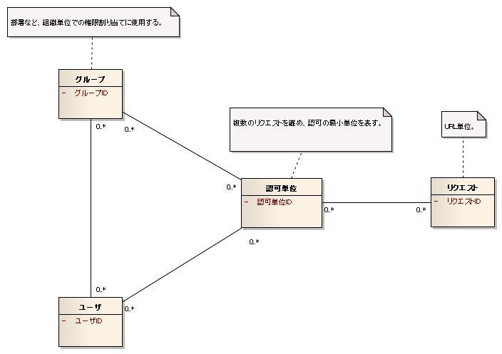
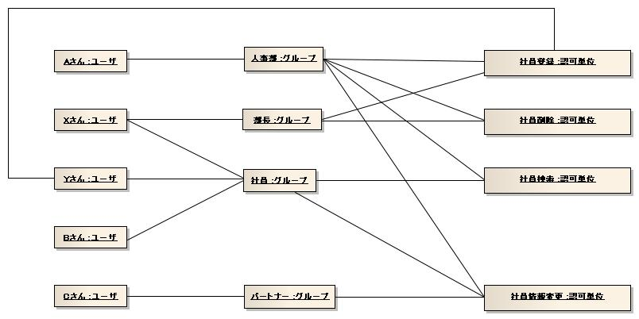
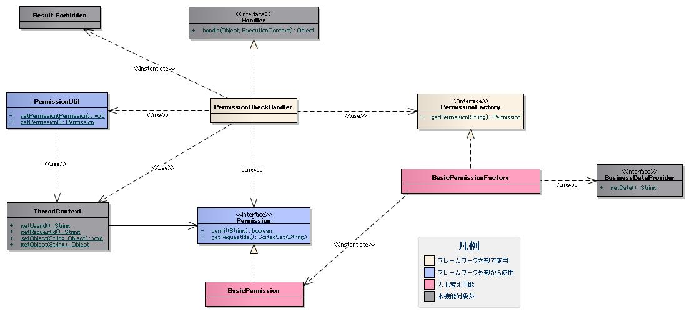
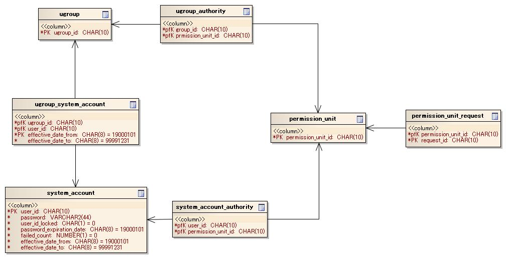

# 認可

## 概要

リクエストに対して認可チェックを行う機能。ハンドラ（[../../handler/PermissionCheckHandler](../handlers/handlers-PermissionCheckHandler.md)）として使用することを想定。

> **注意**: アーキテクトが認可処理を局所化するために使用するため、アプリケーションプログラマは本機能を直接使用しない。

## BasicPermissionFactoryの設定方法

**クラス**: `nablarch.common.handler.PermissionCheckHandler`, `nablarch.common.permission.BasicPermissionFactory`

PermissionCheckHandlerとBasicPermissionFactoryをDIコンテナで設定する。設定例:

```xml
<component name="webFrontController"
           class="nablarch.fw.web.servlet.WebFrontController">
    <property name="handlerQueue">
        <list>
            <component class="nablarch.fw.RequestHandlerEntry">
                <property name="requestPattern" value="/action//" />
                <property name="handler">
                    <component class="nablarch.common.handler.PermissionCheckHandler">
                        <property name="permissionFactory" ref="permissionFactory" />
                        <property name="ignoreRequestIds" value="RW11AA0101, RW11AA0102, RW99ZZ0601, RW99ZZ0602, RW99ZZ0603, RW99ZZ0604, RW99ZZ0605" />
                    </component>
                </property>
            </component>
        </list>
    </property>
</component>

<component name="permissionFactory" class="nablarch.common.permission.BasicPermissionFactory">
    <property name="dbManager">
        <component class="nablarch.core.db.transaction.SimpleDbTransactionManager">
            <property name="dbTransactionName" value="PermissionCheck" />
            <property name="transactionFactory" ref="transactionFactory" />
            <property name="connectionFactory" ref="connectionFactory" />
        </component>
    </property>
    <property name="groupTableSchema">
        <component class="nablarch.common.permission.schema.GroupTableSchema">
            <property name="tableName" value="UGROUP" />
            <property name="groupIdColumnName" value="UGROUP_ID" />
        </component>
    </property>
    <property name="systemAccountTableSchema">
        <component class="nablarch.common.permission.schema.SystemAccountTableSchema">
            <property name="tableName" value="SYSTEM_ACCOUNT" />
            <property name="userIdColumnName" value="USER_ID" />
            <property name="userIdLockedColumnName" value="USER_ID_LOCKED" />
            <property name="effectiveDateFromColumnName" value="EFFECTIVE_DATE_FROM" />
            <property name="effectiveDateToColumnName" value="EFFECTIVE_DATE_TO" />
        </component>
    </property>
    <property name="groupSystemAccountTableSchema">
        <component class="nablarch.common.permission.schema.GroupSystemAccountTableSchema">
            <property name="tableName" value="UGROUP_SYSTEM_ACCOUNT" />
            <property name="groupIdColumnName" value="UGROUP_ID" />
            <property name="userIdColumnName" value="USER_ID" />
            <property name="effectiveDateFromColumnName" value="EFFECTIVE_DATE_FROM" />
            <property name="effectiveDateToColumnName" value="EFFECTIVE_DATE_TO" />
        </component>
    </property>
    <property name="permissionUnitTableSchema">
        <component class="nablarch.common.permission.schema.PermissionUnitTableSchema">
            <property name="tableName" value="PERMISSION_UNIT" />
            <property name="permissionUnitIdColumnName" value="PERMISSION_UNIT_ID" />
        </component>
    </property>
    <property name="permissionUnitRequestTableSchema">
        <component class="nablarch.common.permission.schema.PermissionUnitRequestTableSchema">
            <property name="tableName" value="PERMISSION_UNIT_REQUEST" />
            <property name="permissionUnitIdColumnName" value="PERMISSION_UNIT_ID" />
            <property name="requestIdColumnName" value="REQUEST_ID" />
        </component>
    </property>
    <property name="groupAuthorityTableSchema">
        <component class="nablarch.common.permission.schema.GroupAuthorityTableSchema">
            <property name="tableName" value="UGROUP_AUTHORITY" />
            <property name="groupIdColumnName" value="UGROUP_ID" />
            <property name="permissionUnitIdColumnName" value="PERMISSION_UNIT_ID" />
        </component>
    </property>
    <property name="systemAccountAuthorityTableSchema">
        <component class="nablarch.common.permission.schema.SystemAccountAuthorityTableSchema">
            <property name="tableName" value="SYSTEM_ACCOUNT_AUTHORITY" />
            <property name="userIdColumnName" value="USER_ID" />
            <property name="permissionUnitIdColumnName" value="PERMISSION_UNIT_ID" />
        </component>
    </property>
    <property name="businessDateProvider" ref="businessDateProvider" />
</component>

<component name="businessDateProvider" class="nablarch.core.date.BasicBusinessDateProvider" />
```

スキーマ情報クラス一覧:

| クラス名 | 概要 |
|---|---|
| `nablarch.common.permission.schema.GroupTableSchema` | グループテーブルのスキーマ情報 |
| `nablarch.common.permission.schema.SystemAccountTableSchema` | システムアカウントテーブルのスキーマ情報 |
| `nablarch.common.permission.schema.GroupSystemAccountTableSchema` | グループシステムアカウントテーブルのスキーマ情報 |
| `nablarch.common.permission.schema.PermissionUnitTableSchema` | 認可単位テーブルのスキーマ情報 |
| `nablarch.common.permission.schema.PermissionUnitRequestTableSchema` | 認可単位リクエストテーブルのスキーマ情報 |
| `nablarch.common.permission.schema.GroupAuthorityTableSchema` | グループ権限テーブルのスキーマ情報 |
| `nablarch.common.permission.schema.SystemAccountAuthorityTableSchema` | システムアカウント権限テーブルのスキーマ情報 |

### PermissionCheckHandlerの設定

| プロパティ名 | 必須 | 説明 |
|---|---|---|
| permissionFactory | ○ | Permissionを生成するPermissionFactory |
| ignoreRequestIds | | 認可判定を行わないリクエストID（複数指定はカンマ区切り） |

### BasicPermissionFactoryの設定

| プロパティ名 | 必須 | 説明 |
|---|---|---|
| dbManager | ○ | SimpleDbTransactionManagerのインスタンス（[../01_Core/04_DbAccessSpec](libraries-04_DbAccessSpec.md) 参照） |
| groupTableSchema | ○ | GroupTableSchemaクラスのインスタンス |
| systemAccountTableSchema | ○ | SystemAccountTableSchemaクラスのインスタンス |
| groupSystemAccountTableSchema | ○ | GroupSystemAccountTableSchemaクラスのインスタンス |
| permissionUnitTableSchema | ○ | PermissionUnitTableSchemaクラスのインスタンス |
| permissionUnitRequestTableSchema | ○ | PermissionUnitRequestTableSchemaクラスのインスタンス |
| groupAuthorityTableSchema | ○ | GroupAuthorityTableSchemaクラスのインスタンス |
| systemAccountAuthorityTableSchema | ○ | SystemAccountAuthorityTableSchemaクラスのインスタンス |
| businessDateProvider | ○ | BusinessDateProviderのインスタンス。有効日（From/To）のチェックに使用（:ref:`BusinessDateProvider-label` 参照） |

### GroupTableSchemaの設定

| プロパティ名 | 必須 | 説明 |
|---|---|---|
| tableName | ○ | テーブル名 |
| groupIdColumnName | ○ | グループIDカラムの名前 |

### SystemAccountTableSchemaの設定

| プロパティ名 | 必須 | 説明 |
|---|---|---|
| tableName | ○ | テーブル名 |
| userIdColumnName | ○ | ユーザIDカラムの名前 |
| userIdLockedColumnName | ○ | ユーザIDロックカラムの名前 |
| failedCountColumnName | ○ | 認証失敗回数カラムの名前 |
| effectiveDateFromColumnName | ○ | 有効日(From)カラムの名前 |
| effectiveDateToColumnName | ○ | 有効日(To)カラムの名前 |

### GroupSystemAccountTableSchemaの設定

| プロパティ名 | 必須 | 説明 |
|---|---|---|
| tableName | ○ | テーブル名 |
| groupIdColumnName | ○ | グループIDカラムの名前 |
| userIdColumnName | ○ | ユーザIDカラムの名前 |
| effectiveDateFromColumnName | ○ | 有効日(From)カラムの名前 |
| effectiveDateToColumnName | ○ | 有効日(To)カラムの名前 |

### PermissionUnitTableSchemaの設定

| プロパティ名 | 必須 | 説明 |
|---|---|---|
| tableName | ○ | テーブル名 |
| permissionUnitIdColumnName | ○ | 認可単位IDカラムの名前 |

### PermissionUnitRequestTableSchemaの設定

| プロパティ名 | 必須 | 説明 |
|---|---|---|
| tableName | ○ | テーブル名 |
| permissionUnitIdColumnName | ○ | 認可単位IDカラムの名前 |
| requestIdColumnName | ○ | リクエストIDカラムの名前 |

### GroupAuthorityTableSchemaの設定

| プロパティ名 | 必須 | 説明 |
|---|---|---|
| tableName | ○ | テーブル名 |
| groupIdColumnName | ○ | グループIDカラムの名前 |
| permissionUnitIdColumnName | ○ | 認可単位IDカラムの名前 |

### SystemAccountAuthorityTableSchemaの設定

| プロパティ名 | 必須 | 説明 |
|---|---|---|
| tableName | ○ | テーブル名 |
| userIdColumnName | ○ | ユーザIDカラムの名前 |
| permissionUnitIdColumnName | ○ | 認可単位IDカラムの名前 |

BasicPermissionFactoryは :ref:`repository_initialize` のInitializableインタフェースを実装しているため、BasicApplicationInitializerで初期化設定が必要:

```xml
<component name="initializer" class="nablarch.core.repository.initialization.BasicApplicationInitializer">
    <property name="initializeList">
        <list>
            <component-ref name="permissionFactory"/>
        </list>
    </property>
</component>
```

<details>
<summary>keywords</summary>

PermissionCheckHandler, 認可チェック, 認可機能, ハンドラ, BasicPermissionFactory, nablarch.common.handler.PermissionCheckHandler, nablarch.common.permission.BasicPermissionFactory, GroupTableSchema, SystemAccountTableSchema, GroupSystemAccountTableSchema, PermissionUnitTableSchema, PermissionUnitRequestTableSchema, GroupAuthorityTableSchema, SystemAccountAuthorityTableSchema, nablarch.common.permission.schema.GroupTableSchema, nablarch.common.permission.schema.SystemAccountTableSchema, nablarch.common.permission.schema.GroupSystemAccountTableSchema, nablarch.common.permission.schema.PermissionUnitTableSchema, nablarch.common.permission.schema.PermissionUnitRequestTableSchema, nablarch.common.permission.schema.GroupAuthorityTableSchema, nablarch.common.permission.schema.SystemAccountAuthorityTableSchema, BasicApplicationInitializer, SimpleDbTransactionManager, permissionFactory, dbManager, groupTableSchema, systemAccountTableSchema, groupSystemAccountTableSchema, permissionUnitTableSchema, permissionUnitRequestTableSchema, groupAuthorityTableSchema, systemAccountAuthorityTableSchema, businessDateProvider, tableName, groupIdColumnName, userIdColumnName, userIdLockedColumnName, failedCountColumnName, effectiveDateFromColumnName, effectiveDateToColumnName, permissionUnitIdColumnName, requestIdColumnName, BasicBusinessDateProvider, BusinessDateProvider, 認可設定, DIコンテナ認可設定

</details>

## 特徴

## グループ単位とユーザ単位を併用した権限設定

グループに権限を設定しユーザにグループを割り当てることで、グループ単位の権限設定が可能。ユーザへの直接権限設定も可能なため、イレギュラーな権限付与に対応できる。

## 自由度の高いテーブル定義

テーブル名・カラム名は自由に設定可能。フレームワークが規定するJavaの型に変換可能であれば任意のデータ型を使用できるため、プロジェクトの命名規約を使用してテーブル定義を作成できる。

## 特定のリクエストIDを認可判定の対象から除外する方法

ログイン処理など一部の処理を認可判定から除外するには、PermissionCheckHandlerの`ignoreRequestIds`プロパティにリクエストIDをカンマ区切りで指定する。

```xml
<component class="nablarch.common.handler.PermissionCheckHandler">
    <property name="permissionFactory" ref="permissionFactory" />
    <property name="ignoreRequestIds" value="RW11AA0101, RW11AA0102" />
</component>
```

<details>
<summary>keywords</summary>

グループ権限, ユーザ権限, 権限設定, テーブル定義, イレギュラー権限付与, ignoreRequestIds, ignoreRequestIds除外設定, 認可判定, PermissionCheckHandler, nablarch.common.handler.PermissionCheckHandler

</details>

## 要求

### 実装済み

- 機能（任意のリクエストのかたまり）単位で認可判定の設定を行うことができる。
- ユーザに対してグループを設定することができ、グループ単位で認可判定の設定を行うことができる。
- リクエストIDを設定し、特定のリクエストIDを認可判定の対象から除外できる。
- ユーザに有効日（From/To）を設定できる。
- ユーザとグループの関連に有効日（From/To）を設定できる。
- 認可判定の結果に応じて画面項目（メニューやボタンなど）の表示・非表示を切り替えることができる。

### 未実装

- 本機能で使用するマスタデータをメンテナンスできる。
- 本機能で使用するマスタの初期データを一括登録できる。
- 認証機能によりユーザIDがロックされているユーザの認可判定を失敗にできる。

### 未検討

- データへのアクセスを制限できる。
- 機能単位の権限に有効日（From/To）を設定できる。

## 認可判定の使用例

> **注意**: 下記のコードはフレームワークが行う処理であり、通常のアプリケーションでは実装する必要がない。

```java
// PermissionCheckHandlerにより、スレッドローカルにPermissionが保持されている。
Permission permission = PermissionUtil.getPermission();

if (permission.permit("リクエストID")) {
    // 認可に成功した場合の処理
} else {
    // 認可に失敗した場合の処理
}
```

<details>
<summary>keywords</summary>

認可判定, 有効日, リクエストID除外, 画面表示制御, グループ単位認可, PermissionUtil, Permission, 権限チェック, permit

</details>

## 構成 - 概念モデル

本機能では**リクエストID**を使用して認可判定を行う。リクエストIDの体系はアプリケーション毎に設計する。

**認可単位**: ユーザが機能として認識する最小単位の概念。認可単位には複数のリクエスト（Webアプリケーションであれば画面のイベント）が紐付く。

- **グループ権限**: グループに認可単位を紐付ける
- **ユーザ権限**: ユーザに認可単位を直接紐付ける

> **注意**: グループ権限とユーザ権限が異なる場合は、双方の権限に紐づく認可単位が足し合わされる。

> **注意**: 通常はグループ権限でメンテナンス性を確保し、ユーザ権限はイレギュラーな権限付与に使用する。






<details>
<summary>keywords</summary>

概念モデル, 認可単位, リクエストID, グループ権限, ユーザ権限

</details>

## 構成 - クラス図



### インタフェース

| インタフェース名 | 概要 |
|---|---|
| `nablarch.common.permission.Permission` | 認可を行うインタフェース。認可判定の実現方法毎に実装クラスを作成する。 |
| `nablarch.common.permission.PermissionFactory` | Permissionを生成するインタフェース。認可情報の取得先毎に実装クラスを作成する。 |

### `Permission`の実装クラス

| クラス名 | 概要 |
|---|---|
| `nablarch.common.permission.BasicPermission` | 保持しているリクエストIDを使用して認可を行うPermissionの基本実装クラス。 |

### `PermissionFactory`の実装クラス

| クラス名 | 概要 |
|---|---|
| `nablarch.common.permission.BasicPermissionFactory` | BasicPermissionを生成するPermissionFactoryの基本実装クラス。DBのユーザ・グループ毎の認可単位テーブル構造からユーザに紐付く認可情報を取得する。 |

### その他のクラス

| クラス名 | 概要 |
|---|---|
| `nablarch.common.handler.PermissionCheckHandler` | 認可判定を行うハンドラ。 |
| `nablarch.common.permission.PermissionUtil` | 権限管理に使用するユーティリティ。 |

<details>
<summary>keywords</summary>

nablarch.common.permission.Permission, nablarch.common.permission.PermissionFactory, nablarch.common.permission.BasicPermission, nablarch.common.permission.BasicPermissionFactory, nablarch.common.handler.PermissionCheckHandler, nablarch.common.permission.PermissionUtil, BasicPermission, BasicPermissionFactory, PermissionUtil

</details>

## 構成 - シーケンス図


1. `PermissionCheckHandler`は、リクエストの度にユーザに紐付く`Permission`を取得し、認可判定後にPermissionをスレッドローカルに格納する。
2. 個別アプリケーションで認可判定が必要な場合は、`PermissionUtil`からPermissionを取得して認可判定を行う。
3. 認証機能によりユーザIDがロックされている場合は認可失敗となる。
4. 認可判定の対象リクエストのチェックには、設定で指定されたリクエストIDを使用する（:ref:`ignoreRequestIdsSetting`参照）。
5. ユーザIDとリクエストIDは、`PermissionCheckHandler`よりも先に処理を行うハンドラにより、ThreadContextに設定しておく必要がある。ThreadContextへの設定は:ref:`ThreadContextHandler`が行う。

<details>
<summary>keywords</summary>

シーケンス図, PermissionCheckHandler, PermissionUtil, スレッドローカル, ThreadContextHandler, ignoreRequestIdsSetting

</details>

## 構成 - テーブル定義

テーブル名・カラム名はBasicPermissionFactoryの設定で指定するため任意の名前を使用できる。DBの型もJavaの型に変換可能な型であれば任意の型を使用できる。

### グループテーブル

| 定義 | Javaの型 | 制約 |
|---|---|---|
| グループID | `java.lang.String` | ユニークキー |

### システムアカウントテーブル

| 定義 | Javaの型 | 制約 |
|---|---|---|
| ユーザID | `java.lang.String` | ユニークキー |
| ユーザIDロック | `boolean` | |
| 有効日(From) | `java.lang.String` | 書式 yyyyMMdd / 未指定時は"19000101" |
| 有効日(To) | `java.lang.String` | 書式 yyyyMMdd / 未指定時は"99991231" |

### グループシステムアカウントテーブル

| 定義 | Javaの型 | 制約 |
|---|---|---|
| グループID | `java.lang.String` | ユニークキー |
| ユーザID | `java.lang.String` | ユニークキー |
| 有効日(From) | `java.lang.String` | ユニークキー / 書式 yyyyMMdd / 未指定時は"19000101" |
| 有効日(To) | `java.lang.String` | 書式 yyyyMMdd / 未指定時は"99991231" |

### 認可単位テーブル

| 定義 | Javaの型 | 制約 |
|---|---|---|
| 認可単位ID | `java.lang.String` | ユニークキー |

### 認可単位リクエストテーブル

| 定義 | Javaの型 | 制約 |
|---|---|---|
| 認可単位ID | `java.lang.String` | ユニークキー |
| リクエストID | `java.lang.String` | ユニークキー |

### グループ権限テーブル

| 定義 | Javaの型 | 制約 |
|---|---|---|
| グループID | `java.lang.String` | ユニークキー |
| 認可単位ID | `java.lang.String` | ユニークキー |

### システムアカウント権限テーブル

| 定義 | Javaの型 | 制約 |
|---|---|---|
| ユーザID | `java.lang.String` | ユニークキー |
| 認可単位ID | `java.lang.String` | ユニークキー |



> **注意**: システムアカウントテーブルは認証機能と同じテーブルを想定しているため、パスワード等の認証機能用データ項目も含まれる。

<details>
<summary>keywords</summary>

テーブル定義, グループシステムアカウント, システムアカウント権限, 認可単位リクエスト, システムアカウントテーブル, グループ権限テーブル

</details>
