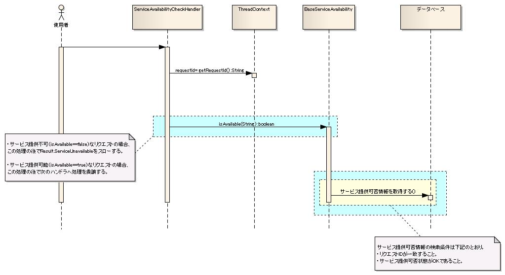
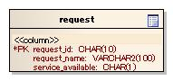

# 開閉局

## 概要

サービスの提供可否状態をチェックおよび設定する（切り替える）機能を提供する。

* サービス提供可否状態のチェックは、本機能が提供する共通ハンドラおよびユーティリティを使用する。
* サービス提供可否状態の設定は、本機能が提供するユーティリティを使用する。

11| 共通ハンドラ及びユーティリティは特定の実行制御基盤には依存しない。本機能をハンドラ構成に組み込むだけで、画面オンライン実行制御基盤でもバッチ実行制御基盤でも開閉局を実現できる。
| ユーティリティは、業務アクションなどの任意のロジックからサービス提供可否状態を取得する際に使用されることを想定している。

> **Note:**
> 「サービス提供可否状態の設定」とはサービス提供可否状態のON/OFFを切り替えることを示す。
> サービス提供可否状態はデータベースのテーブルに格納されている。テーブル構造については、  [テーブル定義の例](../../component/libraries/libraries-05-ServiceAvailability.md#テーブル定義の例) を参照すること。

### 概要図


## 特徴

リクエスト、各機能（複数のリクエストの集合）、システム全体の単位で、サービス提供可否状態を設定することが可能。

## 要求

### 実装済み

* アクション(リクエスト)単位でサービス提供可否状態をチェックすることができる。

> **Note:**
> サービス提供可否状態をチェックする方式としては、フレームワーク側で指定時間にサービス提供可否を切り替えるパターンと、運用JOBスケジューラ側で指定時間にサービス提供可否を切り替えるパターンの２種類が考えられる。
> 前者の方式では、フレームワークがデータベースに格納されたリクエストごとの開局時間、閉局時間、曜日などの日時情報をもとにサービス提供可否を判定し、後者の方式では、フレームワークがデータベースに格納されたリクエストごとのサービス提供可否フラグをもとにサービス提供可否を判定する。
> 前者の方式では、 フレームワークが日時情報を管理するため、機能は豊富だがアーキテクチャが複雑になり、データベースのテーブルの構造にも制約が生まれ、柔軟性・カスタマイズ性が若干低下する。
> 後者の方式では、 フレームワークが日時情報を管理しないため、運用JOBスケジュールや常駐バッチで日時情報の管理を行う必要があるが、フレームワークのアーキテクチャはシンプルになり、要件に対して柔軟に対応できる。
> 本フレームワークでは、まず、シンプルで柔軟性の高い後者の方式に対応した機能を提供し、前者のパターンに関しては未検討の項目に追加し、別途、取り込み検討を行う。なお、前者の方式にも対応できるインタフェースにしているので、前者を取り込む際にもインタフェースの変更等は発生しない。

* 開閉局が必要なすべての実行制御基盤でサービス提供可否状態のチェックができる。

### 未実装

* アクション(リクエスト)単位でサービス提供可否状態の設定を行うことができる。
* 各機能（複数のリクエストの集合）単位でサービス提供可否状態の設定を行うことができる。
* システム全体でサービス提供可否状態の設定を行うことができる。
* 特定のイベントをトリガとしてサービス提供可否状態の設定を行うことができる。

### 未検討

* 指定時間にサービス提供可否を切り替えることができる。
* サービスの提供可否判定の結果に応じて画面項目（メニューやボタンなど）の表示・非表示を切り替えることができる（カスタムタグ等を提供する）。
* サービス提供不可の場合に、個別画面へ遷移できる。

> **Note:**
> 現時点での設計判断では、サービス提供不可の場合に個別画面へ遷移する要件はないと想定している。

### 取り下げ

* 各機能（複数のリクエストの集合）単位でサービス提供可否状態をチェックする機能。

  柔軟性確保の観点より、各機能単位でのチェック機能は提供せず、リクエスト単位でのチェック機能のみ提供する。
  また、今後提供する各機能単位でサービス提供可否状態を一括設定する機能を使用することで、代替が可能である。

## 構成

### クラス図


### 各クラスの責務

#### インタフェース定義

| インタフェース名 | 概要 |
|---|---|
| nablarch.common.availability.ServiceAvailability | リクエストIDをもとに、サービス提供可否状態を判定するインタフェース。 独自のサービス提供可否状態判定の実装が必要となった場合には、本インタフェースを実装することにより実現可能。 |

##### クラス定義

a) nablarch.common.availability.ServiceAvailabilityの実装クラス

| クラス名 | 概要 |
|---|---|
| nablarch.common.availability.BasicServiceAvailability | リクエストIDをもとに、サービス提供可否状態を判定するクラス。 サービス提供可否状態の判定には、リクエストテーブルを参照する。 リクエストテーブルのテーブル名、カラム名は、設定ファイルにより設定が可能。 |

b) その他のクラス

| クラス名 | 概要 |
|---|---|
| nablarch.common.handler.ServiceAvailabilityCheckHandler | サービス提供可否状態の判定をするハンドラ。 |
| nablarch.common.availability.ServiceAvailabilityUtil | サービス提供可否状態判定用ユーティリティ。 アプリケーションプログラマは本クラスを使用することで、容易にサービス提供可否状態を判定できる。 |

### シーケンス図

#### 全処理方式共通

ユーティリティ使用時におけるシーケンス図を下記に示す。


#### 画面オンライン

画面オンライン時におけるシーケンス図を下記に示す。

* ServiceAvailabilityCheckHandlerは、リクエストIDをもとにサービス提供可否状態を判定する。
* リクエストIDは、ServiceAvailabilityCheckHandlerよりも先に処理を行うハンドラにより、ThreadContextに設定しておく必要がある。ThreadContextへの設定は、 [スレッドコンテキスト変数管理ハンドラ](../../component/handlers/handlers-ThreadContextHandler.md#スレッドコンテキスト変数管理ハンドラ) が行う。
* サービス提供不可の場合、一律サービス提供不可エラー画面へ遷移する。



### テーブル定義の例

* テーブル名、カラム名は任意。
* データベースの型は、Javaの型に変換可能な型を選択する。



#### リクエスト

リクエストテーブルには、リクエストごとのサービス提供可否状態を格納する。

| 定義 | Javaの型 | 制約 |
|---|---|---|
| リクエストID | java.lang.String | PK |
| リクエスト名 | java.lang.String |  |
| サービス提供可否状態 | java.lang.String |  |

「リクエスト名」カラムは、保守の際など業務的に使用する項目であり、本機能では使用しない。
「サービス提供可否状態」カラムには、サービス提供可能状態を表す値を設定する。
標準ではサービス提供可否状態の値として"1"が設定されている場合に、サービス提供可能だと判定するが、
設定ファイルを修正することでこの値を変更できる。
詳細は [nablarch.core.web.service.BasicServiceAvailabilityクラスの設定](../../component/libraries/libraries-05-ServiceAvailability.md#nablarchcorewebservicebasicserviceavailabilityクラスの設定) を参照すること。

## 設定の記述

開閉局機能は、リポジトリ機能を利用して設定を行う。

### 全処理方式共通

```xml
<!-- 開閉局機能を提供するフレームワーク基本実装。 -->
<component name="serviceAvailability" class="nablarch.common.availability.BasicServiceAvailability">
    <!-- 開閉局機能で使用するテーブル名／カラム名／サービス提供可能状態の文字列。 -->
    <property name="tableName" value="REQUEST"/>
    <property name="requestTableRequestIdColumnName" value="REQUEST_ID"/>
    <property name="requestTableServiceAvailableColumnName" value="SERVICE_AVAILABLE"/>
    <property name="requestTableServiceAvailableOkStatus" value="1"/>
    <property name="dbManager" ref="serviceAvailabilityDbManager"/>
</component>

<!-- DbManagerの設定 -->
<component name="dbManager" class="nablarch.core.db.transaction.SimpleDbTransactionManager">
    <property name="dbTransactionName" value="serviceAvailability" />
    <property name="transactionFactory" ref="transactionFactory" />
    <property name="connectionFactory" ref="connectionFactory" />
</component>

<!-- サービス提供可否状態を判定するハンドラ -->
<component name="serviceAvailabilityCheckHandler" class="nablarch.common.handler.ServiceAvailabilityCheckHandler">
    <property name="serviceAvailability" ref="serviceAvailability"/>
</component>
```

BasicServiceAvailabilityクラスは初期化が必要なため、  [初期化処理の使用手順](../../component/libraries/libraries-02-02-Repository-initialize.md#初期化処理の使用手順)  に記述したInitializableインタフェースを実装している。
[初期化処理の使用手順](../../component/libraries/libraries-02-02-Repository-initialize.md#初期化処理の使用手順) を参考にして、下記のように serviceAvailabilityCheckHandler.serviceAvailability が初期化されるよう設定すること。

```xml
<component name="initializer" class="nablarch.core.repository.initialization.BasicApplicationInitializer">
    <property name="initializeList">
        <list>
            <!-- 他のコンポーネントは省略 -->
            <component-ref name="serviceAvailability"/>
        </list>
    </property>
</component>
```

#### 設定内容詳細

##### nablarch.core.web.service.BasicServiceAvailabilityクラスの設定

| property名 | 設定内容 |
|---|---|
| dbManager(必須) | データベースへのトランザクション制御を行うSimpleDbTransactionManager。 nablarch.core.db.transaction.SimpleDbTransactionManagerクラスのインスタンスを指定する。 SimpleDbTransactionManagerについては、 [データベースアクセス(検索、更新、登録、削除)機能](../../component/libraries/libraries-04-DbAccessSpec.md) を参照すること。 |
| tableName(必須) | リクエストテーブルの名前。 |
| requestTableRequestIdColumnName(必須) | リクエストテーブルのリクエストIDカラムの名前。 |
| requestTableServiceAvailableColumnName(必須) | リクエストテーブルのサービス提供可否状態カラムの名前。 |
| requestTableServiceAvailableOkStatus | リクエストテーブルのサービス提供可否状態カラムに設定されるサービス提供可能な状態の値。本プロパティを省略した場合、「1」が設定される。 |

##### nablarch.common.handler.ServiceAvailabilityCheckHandlerの設定

| property名 | 設定内容 |
|---|---|
| serviceAvailability(必須) | ServiceAvailabilityインタフェースを実装したクラスを設定する。 |
