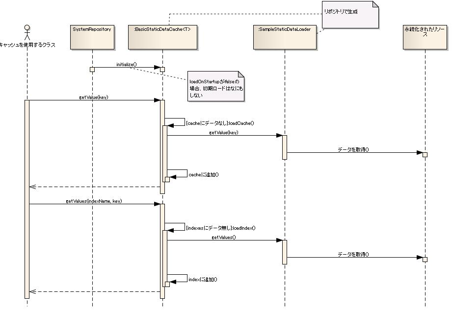
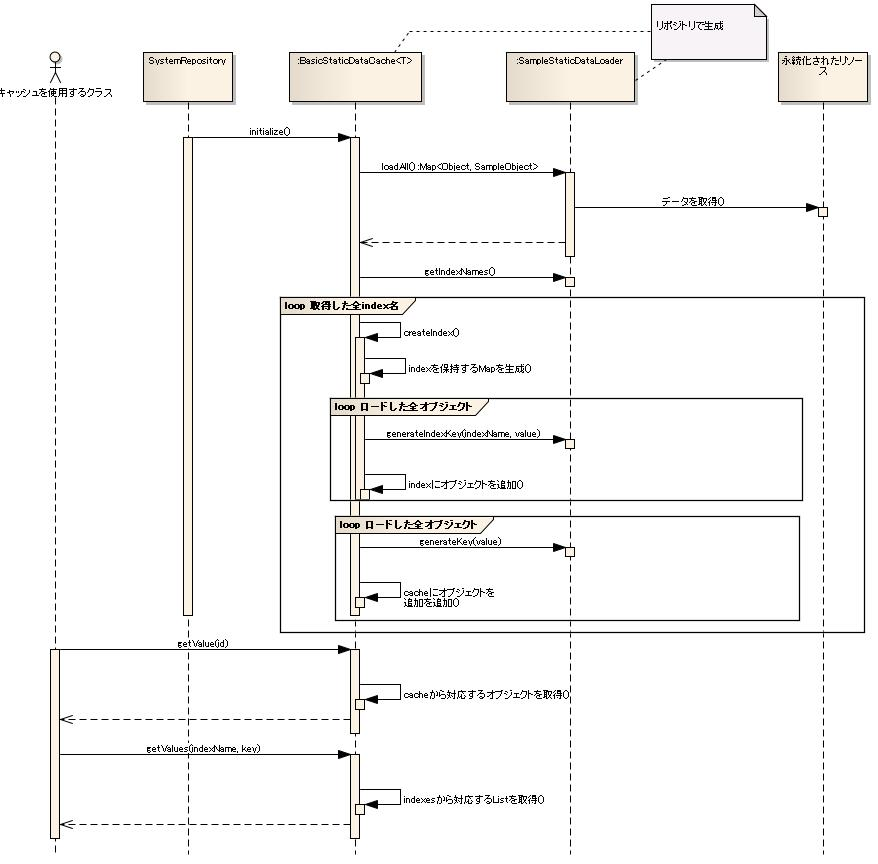

# 静的データのキャッシュ

## 概要

頻繁にアクセスする静的データをRDBMSやXMLファイル等の媒体に永続化している場合、媒体へのアクセス速度がアプリケーションの
パフォーマンスを大きく劣化させることがある。

本機能はこのようなデータアクセスによるパフォーマンスの劣化を抑えるために、静的データをよりアクセス速度が早い媒体にキャッシュ
することで、アクセスを高速化する機構を提供する。

本機能は、リポジトリに登録して使用する。
このため、本機能に必要な初期化処理は [リポジトリ](../../component/libraries/libraries-02-Repository.md#repository) が実行する。

また、本機能は他の機能の一部として使用されることを想定しており、単体で使用することはない。
このため、アプリケーションプログラマは、本機能を直接使用することはない。

## 特徴

### 静的データキャッシュの実装負荷軽減

本機能では、キャッシュしたデータの保持や、
キャッシュにデータが存在しなかった場合にロードする処理を本機能が提供するクラスが行う。

このため、キャッシュを使用する機能を実装する際に必要な実装が、静的データをRDBMSやXMLファイル等の媒体から
ロードする処理と、キャッシュした静的データを使用する処理の2つのみに集約され、実装負荷を軽減できる。

### インデックス機能

本機能は、キャッシュに保持した静的データの中から特定の値を持つ複数のデータを効率よく取得する機能を持つ。
この機能をインデックス機能と呼ぶ。
インデックス機能では、キャッシュから静的データを取得する際、ID以外の特定のキー(インデックスキー)を指定する。
インデックス機能を使用することで、ID以外のキーで頻繁にアクセスする静的データにも高速なアクセスが可能となる。

## 要求

### 実装済み

* 任意のクラスの静的データをキャッシュできる。
* IDを指定してキャッシュから静的データを取得できる。
* 任意のインデックスキーを指定して、キャッシュから複数の静的データを取得できる。
* アプリケーション起動時に永続化した媒体から静的データをロードできる。
* 静的データが必要になったタイミングで永続化した媒体からロードできる。
* プロセスを再起動することなく再ロードできる。

### 未検討

* 頻繁に参照されない静的データをキャッシュから削除することでメモリを節約できる。
* 複数のJavaプロセスでキャッシュした静的データを共有できる。
* ファイルから静的データをロードできる。
* SQL文を記述するだけで、データベース上にある静的データをキャッシュできる。

## 構成

### クラス図


#### インタフェース定義

| インタフェース名 | 概要 |
|---|---|
| nablarch.core.cache.StaticDataCache | 静的データのキャッシュを保持するインタフェース。 |
| nablarch.core.cache.StaticDataLoader | 静的データをロードするインタフェース。 RDBMSやXMLファイル等の媒体から静的データをクラスはこのインタフェースを実装する。 |

#### クラス定義

| クラス名 | 概要 |
|---|---|
| nablarch.core.cache.StaticDataCache | StaticDataCacheインタフェースの基本実装クラス。 静的データをHashMapに保持する。 |

## キャッシュした静的データの取得

概要で述べた通り、静的データキャッシュは、静的データキャッシュを使用する必要のあるクラスの一部として使用することを想定している。

キャッシュする必要のあるクラスは、データのキャッシュを行う StaticDataCache インタフェースをフィールドに持ち、
StaticDataCache インタフェースのメソッドを使用して静的データを取得する。

この際、StaticDataCache インタフェースを実装したフィールドには、本機能が提供している StaticDataCache インタフェースの実装クラスを
リポジトリの [リポジトリに保持するインスタンスの生成(DIコンテナ)](../../component/libraries/libraries-02-01-Repository-config.md#di-container) の機能で設定する。

以下に静的データを取得する実装方法について記述する。

### IDを指定した静的データの取得

静的データは、 StaticDataCache インタフェースの getValue メソッドまたは getValues メソッドで取得する。
StaticDataCache インタフェースを実装したクラスは、キャッシュにデータが存在しない場合には必要に応じてデータを取得する。
このため、呼び出し元は静的データがキャッシュに存在するか否かを意識する必要がない。

以下にキャッシュされるデータを保持する ExampleData クラスと、キャッシュに保持した ExampleData クラスを使用するクラスの実装例を示す。

#### キャッシュされるデータを保持するクラス(ExampleData)

```java
public class ExampleData {
    private String id;
    private String name;

    // setter, getterは省略
}
```

#### キャッシュしたデータを使用するクラス

```java
public class StaticDataUseExample {
    // DIによりStaticDataを設定
    private StaticDataCache<ExampleData> cache;

    public void setCache(StaticDataCache<ExampleData> cache) {
        this.cache = cache;
    }

    public void getById(String id) {
        // キャッシュからデータを取得する
        // 利用者は、キャッシュにデータがあるかを意識する必要はない
        ExampleData obj = cache.getValue(id);
        System.out.println("id = " + obj.getId());
        System.out.println("name = " + obj.getName());
    }
}
```

> **Warning:**
> StaticDataCache#getValue メソッドまたは StaticDataCache#getValues メソッドで取得した静的データは、
> クラスおよびインスタンスのフィールドに保持しないこと。
> これは、クラスおよびインスタンスのフィールドに保持された静的データが、後述する StaticDataCache
> のリロード機能が呼ばれた際に更新されない問題があるためである。

### インデックスを使用した静的データの取得

本機能は、ID以外のキーを指定して静的データを取得できるインデックス機能を持つ。
インデックス機能では、IDのように1つのキーに1つの静的データを紐付けるだけでなく、
1つのキーに複数の静的データを紐付けられる。

インデックスを StaticDataCache インタフェースに定義された getValues メソッドを使用する。

[IDを指定した静的データの取得](../../component/libraries/libraries-05-StaticDataCache.md#static-data-cache-get-example) で示した ExampleData クラスを "name" というインデックスを使用して静的データを取得する実装例を以下に示す。

```java
public class StaticDataUseExample {
    // DIによりStaticDataを設定
    private StaticDataCache<ExampleData> cache;

    public void setCache(StaticDataCache<ExampleData> cache) {
        this.cache = cache;
    }

    public void getByName(String name) {
        // キャッシュからデータを取得する
        // 利用者は、キャッシュにデータがあるかを意識する必要はない
        List<ExampleData> objs = cache.getValues("name", name);
        for (ExampleData obj : objs) {
            System.out.println("id = " + obj.getId());
            System.out.println("name = " + obj.getName());
        }
    }
}
```

## キャッシュにデータをロードする方法

本機能では、キャッシュにデータをロードする方法にオンデマンドロードと一括ロードの2種類の方法を提供している。

以下にそれぞれの方法の特徴と、処理順序の概要を記述する。

### オンデマンドロード

オンデマンドロードでは、キャッシュにデータがなかった際に、自動的にデータをロードする。
これに対して一括ロードでは、アプリケーション起動時に全てのデータをキャッシュにロードする。

オンデマンドロードは、一括ロードに対してアプリケーションの起動が速い利点がある。
このため、使用するデータがキャッシュに保持するデータの一部に偏る場面で有利なロード方法となる。
このような場面には、バッチやテスト時に使用するメッセージなどが想定される。

オンデマンドロード時の処理順序は下記シーケンス図のようになる。



### 一括ロード

一括ロードは、起動してしまえば全てのデータがキャッシュに存在するため、
オンデマンドロードがキャッシュにデータが存在しなかった際(キャッシュミスヒット時)に若干処理が遅くなる問題を回避できる。
このため、使用するデータがキャッシュに保持するデータのほぼ全てとなる場面で有利なロード方法となる。
このような場面には、Webアプリケーションで使用するメッセージなどが想定される。

一括ロード時の処理順序は下記シーケンス図のようになる。



いずれの方法でも、 [IDを指定した静的データの取得](../../component/libraries/libraries-05-StaticDataCache.md#static-data-cache-get-example) で示した通り、
キャッシュを使用する実装にはデータがどのようにロードされているか意識する必要がない。

それぞれのロードの使用方法について、以下に記述する。

## オンデマンドロードの使用方法

オンデマンドロードを使用する際データロードの実装方法について、IDを指定してデータを取得する際に必要なデータロードの実装方法と、
インデックスを指定してデータを取得する際に必要なデータロードの実装方法について以下に記述する。

### IDを指定してデータを取得する際に必要なデータロードの実装方法

データをロードする処理は、 StaticDataLoader インタフェースを実装したクラスに実装する。

StaticDataLoader インタフェースには、IDを使用するキャッシュへのアクセスと、インデックスを使用したキャッシュへのアクセスに必要なメソッドが定義されている。

[IDを指定した静的データの取得](../../component/libraries/libraries-05-StaticDataCache.md#static-data-cache-get-example) で示した、IDを指定してデータを取得する機能のみをオンデマンドロードで使用する場合、
StaticDataLoaderインタフェースに定義されたgetValueメソッドのみを実装すればよい。

以下に [IDを指定した静的データの取得](../../component/libraries/libraries-05-StaticDataCache.md#static-data-cache-get-example) で例に出した ExampleData をロードするクラスと、 StaticDataCache を使用するための設定ファイルの例を示す。

#### ExampleDataをロードするクラス

```java
// ******** 注意 ********
// 下記のコードはフレームワークが行う処理であり、通常のアプリケーションでは実装する必要がない。
// 従って、本フレームワークを使用する場合、アプリケーション・プログラマはこのような実装を行わない。

public class ExampleDataLoader implements StaticDataLoader<ExampleData> {
    /**
     * データロードに使用するSimpleDbTransactionManagerのインスタンス。
     */
    private SimpleDbTransactionManager dbManager;

    public ExampleData getValue(final Object id) {

        return new SimpleDbTransactionExecutor<ExampleData>(dbManager) {
            @Override
            public ExampleData execute(AppDbConnection connection) {
                // 永続化したオブジェクトをロード
                SqlPStatement stmt = connection
                        .prepareStatement("select id, name from example_data where id = ? order by id");
                stmt.setString(1, (String) id);
                SqlResultSet results = stmt.retrieve();
                if (results.size() > 0) {
                    SqlRow row = results.get(0);
                    ExampleData obj = createData(row);
                    return obj;
                } else {
                    return null;
                }
            }
        }.doTransaction();
    }

    // ...getValues以外のメソッドは省略...
}
```

#### 設定ファイル

```xml
<!-- cashLoaderの定義 -->
<component name="exampleDataCache" class="nablarch.core.cache.BasicStaticDataCache">
        <property name="loader">
                <component class="nablarch.core.cache.example.ExampleDataLoader" />
        </property>
</component>

<!-- cacheを使用するコンポーネントの定義 -->
<component name="staticDataUseExample" class="nablarch.core.cache.example.StaticDataUseExample">
        <property name="cache" ref="exampleDataCache" />
</component>
<component name="initializer" class="nablarch.core.repository.initialization.BasicApplicationInitializer">
    <property name="initializeList">
        <list>
            <!-- 他のコンポーネントは省略 -->
            <component-ref name="exampleDataCache"/>
        </list>
    </property>
</component>
```

### インデックスを指定してデータを取得する際に必要なデータロードの実装方法

オンデマンドロード時に、インデックスを使用して静的データを取得するには、 StaticDataLoader の getValues メソッドと
ロードしたデータに対するIDを取得する getId メソッドを実装する必要がある。

getValues メソッドはデータをロードする目的、 getId メソッドは、同一の静的データを2重に保持しない目的でそれぞれ
フレームワークから呼び出される。

このため、getIdメソッドは静的データを一意に決定する値を返すように実装されている必要がある。

以下に:ref:static_data_cache_get_example で例に出した ExampleData クラスの name をインデックスキーとして、インデックスを使用する場合の getValues の実装例を示す。

```java
// ******** 注意 ********
// 下記のコードはフレームワークが行う処理であり、通常のアプリケーションでは実装する必要がない。
// 従って、本フレームワークを使用する場合、アプリケーション・プログラマはこのような実装を行わない。

public class ExampleDataLoader implements StaticDataLoader<ExampleData> {

    public List<ExampleData> getValues(final String indexName, final Object key) {

        return new SimpleDbTransactionExecutor<List<ExampleData>>(dbManager) {
            @Override
            public List<ExampleData> execute(AppDbConnection connection) {
                if (indexName.equals("name")) {
                    String name = (String) key;
                    // 永続化したオブジェクトをロード
                    SqlPStatement stmt = connection.prepareStatement("select id, name from example_data where name = ? order by id");
                    stmt.setString(1, (String) name);
                    SqlResultSet results = stmt.retrieve();
                    List<ExampleData> objs = new ArrayList<ExampleData>();
                    for (SqlRow row : results) {
                        objs.add(createData(row));
                    }
                    return objs;
                } else {
                    throw new IllegalArgumentException("invalid indexName: indexName = " + indexName);
                }

            }
        }.doTransaction();
    }

    public Object getId(ExampleData value) {
        // オブジェクトの持つidを取得する。
        return value.getId();
    }
    // ...getValues以外のメソッドは省略...
}
```

## 一括ロード

一括ロードを使用する際データロードの実装方法と設定方法について以下に記述する。

### データロードの実装方法

一括ロードを使用する際は、 StaticDataLoader インタフェースに定義されたメソッドのうち、 loadAll, getId, generateIndexKey,
getIndexNames の4つのメソッドを実装する必要がある。
これらメソッドの用途は下記表の通り。

| メソッド名 | 用途 |
|---|---|
| loadAll | キャッシュするデータを取得する。 フレームワークはこのメソッドで返される全てのデータをキャッシュの初期データとして保持する。 |
| getId | データからデータのIDを取得する。 フレームワークは、このメソッドで返されるオブジェクトを java.util.Map のキーとしてデータを保持する。 このため、このメソッドの戻り値は、キャッシュ上で一意にオブジェクトでなくてはならない。 例えばデータベース上の複合キーでユニークとなるデータをキャッシュする場合、 equals メソッドと hashCode メソッドを適切に実装した、複合キーを表わすクラスを作成し、 このクラスのインスタンスをこのメソッドの戻り値とする。 |
| getIndexNames | 作成するインデックス名を全て取得する。 フレームワークは、このメソッドの戻り値から作成するインデックスを決定する。 |
| generateIndexKey | インデックスのキーとなる値を生成する。 ここで生成されるキーは、 getId がオブジェクトのキャッシュに使用されるのに対して、 インデックス上のどのキーにオブジェクトが属するかを示すために使われる。 このため、別々のデータ |

以下に [IDを指定した静的データの取得](../../component/libraries/libraries-05-StaticDataCache.md#static-data-cache-get-example) で例に出した ExampleData を一括ロードする実装例を示す。

#### ExampleDataをロードするクラス

```java
// ******** 注意 ********
// 下記のコードはフレームワークが行う処理であり、通常のアプリケーションでは実装する必要がない。
// 従って、本フレームワークを使用する場合、アプリケーション・プログラマはこのような実装を行わない。

public class ExampleDataLoader implements StaticDataLoader<ExampleData> {

    public Object getId(ExampleData value) {
        // オブジェクトの持つidを取得する。
        return value.getId();
    }

    public Object generateIndexKey(String indexName, ExampleData value) {
        // オブジェクトからインデックスのキー値を取得する。
        if (indexName.equals("name")) {
            return value.getName();
        } else {
            throw new IllegalArgumentException(
                    "invalid indexName: indexName = " + indexName);
        }
    }

    public List<String> getIndexNames() {
        // インデックスの名称を返す。
        // この例ではインデックス"name"のみ作成している
        List<String> indexNames = new ArrayList<String>();
        indexNames.add("name");
        return indexNames;
    }

    public List<ExampleData> loadAll() {

        return new SimpleDbTransactionExecutor<List<ExampleData>>(dbManager) {
            @Override
            public List<ExampleData> execute(AppDbConnection connection) {
                // キャッシュにロードする全てのオブジェクトを取得する
                SqlPStatement stmt = connection
                        .prepareStatement("select id, name from example_data order by id");
                SqlResultSet results = stmt.retrieve();
                List<ExampleData> objs = new ArrayList<ExampleData>();
                for (SqlRow row : results) {
                    objs.add(createData(row));
                }
                return objs;
            }
        }.doTransaction();
    }

    // ...getId, generateIndexKey, getIndexNames, loadAll以外のメソッドは省略...
}
```

### 設定例

一括ロードを行う場合、 BasicStaticDataCache の loadOnStartup プロパティに true を設定する必要がある。
その他の設定方法はオンデマンドロード時と同様となる。

以下に設定例を示す。

```xml
<!-- cashLoader の定義 -->
<component name="exampleDataCache" class="nablarch.core.cache.BasicStaticDataCache">
        <property name="loader">
                <component class="nablarch.core.cache.example.ExampleDataLoader" />
        </property>
<!-- 初期ロードを行う -->
        <property name="loadOnStartup" value="true"/>
</component>

<!-- cache を使用するコンポーネントの定義 -->
<component name="staticDataUseExample" class="nablarch.core.cache.example.StaticDataUseExample">
        <property name="cache" ref="exampleDataCache" />
</component>
```

また BasicStaticDataCache クラスは初期化が必要なため、  [初期化処理の使用手順](../../component/libraries/libraries-02-02-Repository-initialize.md#repository-initialize)  に記述した Initializable インタフェースを実装している。
[初期化処理の使用手順](../../component/libraries/libraries-02-02-Repository-initialize.md#repository-initialize) を参考にして、下記のように exampleDataCache が初期化されるよう設定すること。

```xml
<component name="initializer" class="nablarch.core.repository.initialization.BasicApplicationInitializer">
    <property name="initializeList">
        <list>
            <!-- 他のコンポーネントは省略 -->
            <component-ref name="exampleDataCache"/>
        </list>
    </property>
</component>
```

## 設定内容詳細

### nablarch.core.cache.BasicStaticDataCacheの設定

| property名 | 設定内容 |
|---|---|
| loader(必須) | 静的データをロードする、 StaticDataLoader インタフェースを実装したクラスのインスタンスを指定する。 |
| loadOnStartup | 一括ロードの要否を設定する。 指定しなければ一括ロードしない。 |

## 静的データの再読み込み

静的データは、元となるデータが更新された際には再読み込みを行う必要がある。
アプリケーションの再起動が頻繁に行えない場合、静的データのリロード機能を使用することで再起動なしに
静的データの再読み込みができる。

静的データの再読み込みを行うには、 StaticDataCache インタフェースの refresh メソッドを呼び出せばよい。

### 実装例

以下に再読み込みを行うクラスの実装例を示す。

```java
// ******** 注意 ********
// 下記のコードはプロジェクトのアーキテクトが作成するものである。
// 通常、各アプリケーション・プログラマはこのような実装を行わない。

public class StaticDataUseExample {
    // DIによりStaticDataを設定
    private StaticDataCache<ExampleData> cache;

    public void setCache(StaticDataCache<ExampleData> cache) {
        this.cache = cache;
    }

    public void refreshAndGetValue(String name) {

        // キャッシュをリロードする
        cache.refresh();

        // キャッシュから静的データを取得する
        // 使用者は、静的データがキャッシュにあるかを意識する必要はない
        List<ExampleData> objs = cache.getValues("name", name);
        for (ExampleData obj : objs) {
            System.out.println(obj);
        }
    }
}
```
