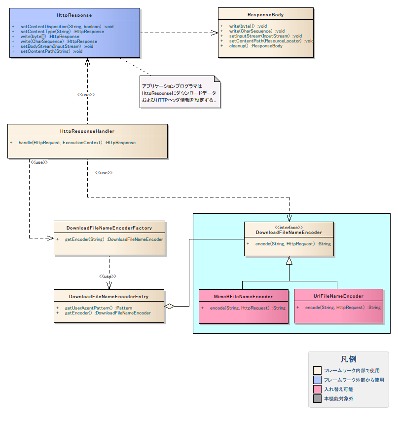

# ファイルダウンロード

## 概要

ファイルをクライアントへダウンロードする機能を提供する。

`HttpResponse` を使用した文字シーケンスデータのファイルダウンロード実装例。

- `HttpResponse.setContentType(String)`: Content-Typeを設定する（例: `"text/csv; charset=Shift_JIS"`）
- `HttpResponse.write(String)`: ダウンロードデータを書き込む（複数回呼び出し可能）
- `HttpResponse.setContentDisposition(String)`: ダウンロード時のファイル名を設定する

```java
public HttpResponse doDownloadCharSequence(HttpRequest req, ExecutionContext context) {
    HttpResponse res = new HttpResponse();
    res.setContentType("text/csv; charset=Shift_JIS");
    res.write("ユーザID, ユーザ名\n");
    res.write("0000001, nabla\n");
    res.write("0000002, arch\n");
    res.write("0000003, arch\n");
    res.setContentDisposition("サンプルCSVファイル.csv");
    return res;
}
```

<details>
<summary>keywords</summary>

ファイルダウンロード, HttpResponse, クライアントダウンロード, HttpRequest, ExecutionContext, setContentType, write, setContentDisposition, 文字シーケンスダウンロード, Shift_JIS, CSV出力, Content-Type設定

</details>

## 特徴

## 実装の容易性

`HttpResponse` クラスのメソッドのみでダウンロードを実現できる。バイト配列・文字シーケンス・入力ストリーム・ファイルパス指定の4種類のデータ型に対応。

使用メソッド:
1. `HttpResponse#setContentType(String)` — Content-Type・文字コード設定
2. `HttpResponse#setContentDisposition(String)` — ダウンロードファイル名・インライン表示有無設定
3. レスポンスボディへの書き込み:
   - `HttpResponse#write(byte[])` — バイト配列
   - `HttpResponse#write(CharSequence)` — 文字シーケンス
   - `HttpResponse#setBodyStream(InputStream)` — 入力ストリーム
   - `HttpResponse#setContentPath(String)` — ファイルパス指定

> **注意**: writeメソッド・setBodyStreamメソッド・setContentPathメソッドが同時に使用された場合の優先順位: 1. setContentPath 2. setBodyStream 3. write。例: setBodyStreamとwriteが同時に呼ばれた場合、setBodyStreamの内容がダウンロードされ、writeの内容は無視される。

> **注意**: writeメソッドで文字シーケンスをダウンロードする場合、Content-Typeヘッダに設定した文字コード（charset）でエンコードされる。writeメソッド実行前に必ず文字コードを設定すること。文字コード未設定時はUTF-8でエンコードされる。

コード例（Shift_JIS文字シーケンスのダウンロード）:
```java
public HttpResponse doDownloadCharSequence(HttpRequest req, ExecutionContext context) {
    HttpResponse res = new HttpResponse();
    res.setContentType("text/csv; charset=Shift_JIS");
    res.write("ユーザID, ユーザ名\n");
    res.write("0000001, nabla\n");
    res.setContentDisposition("サンプルCSVファイル.csv");
    return res;
}
```

## 大容量ファイルのメモリ管理

writeメソッドでデータを作成する際、データサイズが一定の閾値を超えると自動的にメモリから一時ファイルに切り替える。データサイズを意識した実装は不要。

<details>
<summary>keywords</summary>

HttpResponse, setContentType, setContentDisposition, write, setBodyStream, setContentPath, 文字シーケンスエンコード, 大容量ファイル, 一時ファイル切り替え, メソッド優先順位

</details>

## 要求

## 実装済み

- ファイルのダウンロード（テキスト・バイナリ）
- ダウンロードしたファイルのインライン表示

> **注意**: インライン表示の挙動はブラウザの種類やセキュリティ設定に依存する。

- データサイズが大きい場合、データの保存先を一時ファイルに変更可能
- ダウンロードファイル名に非ASCII文字（多言語）を使用可能

> **注意**: ファイル名に非ASCII文字をサポートするブラウザ: Internet Explorer、Firefox、Google Chrome。Windows版Safariは非ASCII文字に未対応（ASCII文字は使用可能）。

## 未実装

- ダウンロード履歴を残すことができない

<details>
<summary>keywords</summary>

インライン表示, ブラウザ対応, 非ASCII文字ファイル名, ダウンロード要件, Internet Explorer, Firefox, Google Chrome, Windows版Safari

</details>

## 構成

ファイルダウンロード機能のクラス構成:



<details>
<summary>keywords</summary>

クラス図, ファイルダウンロード構成, クラス設計

</details>

## インタフェース定義

## インタフェース

| インタフェース名 | 概要 |
|---|---|
| `nablarch.fw.web.download.encorder.DownloadFileNameEncoder` | ダウンロードファイル名のエンコーダのインタフェース。URLエンコーディング方式とMIME-Bエンコーディング方式の実装クラスを標準提供。独自エンコーダが必要な場合は本インタフェースを実装する。通常は標準実装クラスで対応可能。 |

## DownloadFileNameEncoderの実装クラス

| クラス名 | 概要 |
|---|---|
| `nablarch.fw.web.download.encorder.MimeBDownloadFileNameEncoder` | RFC2047のMIME-Bエンコード方式でダウンロードファイル名をエンコード |
| `nablarch.fw.web.download.encorder.UrlDownloadFileNameEncoder` | URLエンコード方式でダウンロードファイル名をエンコード |

## Handlerの実装クラス

| クラス名 | 概要 |
|---|---|
| `nablarch.fw.web.handler.HttpResponseHandler` | HttpResponseクラスに設定されたダウンロードデータおよびHTTPヘッダ情報をレスポンスに出力するハンドラ。ダウンロードファイル名をエンコードしContent-Dispositionに設定する。一時ファイルはレスポンス出力後に削除される。 |

## その他のクラス

| クラス名 | 概要 |
|---|---|
| `nablarch.fw.web.HttpResponse` | ダウンロードデータおよびHTTPヘッダ情報を設定するHTTPレスポンスオブジェクト |
| `nablarch.fw.web.ResponseBody` | ダウンロードデータを保持するクラス。データサイズが一定量を超えると保存先をメモリから一時ファイルに変更 |
| `nablarch.fw.web.HttpResponseSetting` | レスポンス関連設定を保持するクラス（バッファリングサイズ上限、一時ファイル出力先フォルダ、一時ファイル使用有無）。設定の詳細は :ref:`compornentDifinitionResponse` を参照。 |
| `nablarch.fw.web.download.encorder.DownloadFileNameEncoderEntry` | User-Agentヘッダのパターンとダウンロードファイル名エンコーダの関連を保持するエントリ |
| `nablarch.fw.web.download.encorder.DownloadFileNameEncoderFactory` | User-Agentヘッダに基づいてダウンロードファイル名エンコーダを取得するクラス。設定の詳細は :ref:`compornentDifinition` を参照。 |

<details>
<summary>keywords</summary>

DownloadFileNameEncoder, MimeBDownloadFileNameEncoder, UrlDownloadFileNameEncoder, HttpResponseHandler, HttpResponseSetting, ResponseBody, DownloadFileNameEncoderEntry, DownloadFileNameEncoderFactory, インタフェース定義

</details>

## nablarch.fw.web.HttpResponseクラスのメソッド

| メソッド名 | 概要 |
|---|---|
| `setContentType(String contentType)` | Content-Typeヘッダを設定。省略した場合はsetContentDispositionで指定されたファイル名の拡張子から自動設定。writeメソッドで文字シーケンスを使用する場合はwriteメソッド実行前に必ず設定すること（設定したcharsetでエンコードされる）。**バイト配列・入力ストリーム・ファイルパスのデータをダウンロードする場合は、Content-Typeヘッダに設定した文字コードでエンコードは行われず、そのままデータがレスポンスに出力される。** |
| `setContentDisposition(String fileName)` | Content-Dispositionヘッダを設定。インライン表示は行われない。 |
| `setContentDisposition(String fileName, boolean inline)` | Content-Dispositionヘッダを設定。インライン表示の有無を指定可能。 |
| `write(byte[] bytes)` | バイト配列をダウンロードデータとして使用 |
| `write(CharSequence text)` | 文字シーケンスをダウンロードデータとして使用 |
| `setBodyStream(InputStream bodyStream)` | 入力ストリームをダウンロードデータとして使用 |
| `setContentPath(String path)` | ファイルパスを指定してダウンロード（指定パスのファイルがダウンロードされる） |


<details>
<summary>keywords</summary>

HttpResponse, setContentType, setContentDisposition, write, setBodyStream, setContentPath, シーケンス図, メソッド詳細

</details>

## 設定の記述

## HTTPレスポンスの設定

```xml
<component name="responseSetting" class="nablarch.fw.web.HttpResponseSetting">
    <property name="bufferLimitSizeKb" value="512" />
    <property name="tempDirPath" value="/temp/download" />
</component>
```

## ファイル名のエンコーダの設定

> **注意**: コンポーネント設定ファイルの定義をすべて省略した場合、User-Agentヘッダが「.*MSIE.*」または「.*WebKit.*」にマッチする場合はURLエンコーダ、「.*Gecko.*」にマッチする場合はMIME-Bエンコーダ、いずれにもマッチしない場合はURLエンコーダが使用される。独自設定を定義する場合は、初期ハンドラ構成を変更しHttpResponseHandlerにDownloadFileNameEncoderFactoryを設定する必要がある（[web_gui](../../processing-pattern/web-application/web-application-web_gui.md) の標準ハンドラ構成を参照）。

```xml
<list name="handlerQueue">
    <component class="nablarch.fw.web.handler.HttpResposeHandler">
        <property name="downloadFileNameEncoderFactory" ref="downloadFileNameEncoderFactory" />
    </component>
</list>

<component name="downloadFileNameEncoderFactory" class="nablarch.fw.web.download.encorder.DownloadFileNameEncoderFactory">
    <property name="downloadFileNameEncoderEntries" ref="downloadFileNameEncoderEntries" />
    <property name="defaultEncoder" ref="urlEncoder" />
</component>

<list name="downloadFileNameEncoderEntries">
    <component class="nablarch.fw.web.download.DownloadFileNameEncoderEntry">
        <property name="userAgentPattern" value=".*MSIE.*"/>
        <property name="encoder" ref="urlEncoder" />
    </component>
    <component class="nablarch.fw.web.download.DownloadFileNameEncoderEntry">
        <property name="userAgentPattern" value=".*WebKit.*"/>
        <property name="encoder" ref="urlEncoder" />
    </component>
    <component class="nablarch.fw.web.download.DownloadFileNameEncoderEntry">
        <property name="userAgentPattern" value=".*Gecko.*"/>
        <property name="encoder" ref="mimeBEncoder" />
    </component>
</list>

<component name="mimeBEncoder" class="nablarch.fw.web.download.encorder.MimeBDownloadFileNameEncoder">
    <property name="charset" value="UTF-8" />
</component>

<component name="urlEncoder" class="nablarch.fw.web.download.encorder.UrlDownloadFileNameEncoder">
    <property name="charset" value="UTF-8" />
</component>
```

<details>
<summary>keywords</summary>

HttpResponseSetting, bufferLimitSizeKb, tempDirPath, DownloadFileNameEncoderFactory, downloadFileNameEncoderEntries, エンコーダ設定, User-Agent, コンポーネント設定

</details>

## 設定内容詳細

### nablarch.fw.web.HttpResponseSettingの設定

| プロパティ名 | 型 | 必須 | デフォルト値 | 説明 |
|---|---|---|---|---|
| bufferLimitSizeKb | | | 1024 | データをメモリにバッファリングするサイズの上限（KB）。このサイズを超えるダウンロードデータは一時ファイルに保存される。 |
| tempDirPath | | | OSデフォルト一時ディレクトリ（例: Windowsなら `C:\WINDOWS\Temp`） | 一時ファイルが作成されるディレクトリパス。指定ディレクトリが存在しない場合は一時ファイル作成時に例外が発生する。本番環境では省略せず、適切なサイズ設計・権限設定済みのディレクトリを指定すること。 |

<details>
<summary>keywords</summary>

bufferLimitSizeKb, tempDirPath, HttpResponseSetting, 一時ファイル設定, バッファリングサイズ

</details>

## 設定内容詳細

### nablarch.fw.web.handler.HttpResposeHandlerの設定

| プロパティ名 | 型 | 必須 | デフォルト値 | 説明 |
|---|---|---|---|---|
| downloadFileNameEncoderFactory | | | DownloadFileNameEncoderFactoryのデフォルト値 | ダウンロードファイル名のエンコーダを取得するクラス。省略時はDownloadFileNameEncoderFactoryが使用される。デフォルト値の詳細は :ref:`downloadFileNameEncoderFactory` を参照。 |

### nablarch.fw.web.download.encorder.DownloadFileNameEncoderFactoryの設定

| プロパティ名 | 型 | 必須 | デフォルト値 | 説明 |
|---|---|---|---|---|
| downloadFileNameEncoderEntries | | | 3エントリ（1.「.*MSIE.*」→URLエンコーダ、2.「.*WebKit.*」→URLエンコーダ、3.「.*Gecko.*」→MIME-Bエンコーダ） | User-Agentヘッダパターンとエンコーダの関連エントリリスト |
| defaultEncoder | | | URLエンコーダ | いずれのUser-Agentパターンにもマッチしない場合に使用するエンコーダ |

### nablarch.fw.web.download.DownloadFileNameEncoderEntryの設定

| プロパティ名 | 型 | 必須 | デフォルト値 | 説明 |
|---|---|---|---|---|
| userAgentPattern | | ○ | | User-Agentヘッダにマッチするパターン。未設定時はDIコンテナ起動時に例外がスローされる。 |
| encoder | | | URLエンコーダ | ダウンロードファイル名をエンコードするクラス |

### nablarch.fw.web.download.encorder.MimeBDownloadFileNameEncoderの設定

| プロパティ名 | 型 | 必須 | デフォルト値 | 説明 |
|---|---|---|---|---|
| charset | | | UTF-8 | ファイル名のエンコードに使用する文字コード |

### nablarch.fw.web.download.encorder.UrlDownloadFileNameEncoderの設定

| プロパティ名 | 型 | 必須 | デフォルト値 | 説明 |
|---|---|---|---|---|
| charset | | | UTF-8 | ファイル名のエンコードに使用する文字コード |

<details>
<summary>keywords</summary>

downloadFileNameEncoderFactory, downloadFileNameEncoderEntries, defaultEncoder, userAgentPattern, encoder, charset, MimeBDownloadFileNameEncoder, UrlDownloadFileNameEncoder, HttpResposeHandler

</details>
