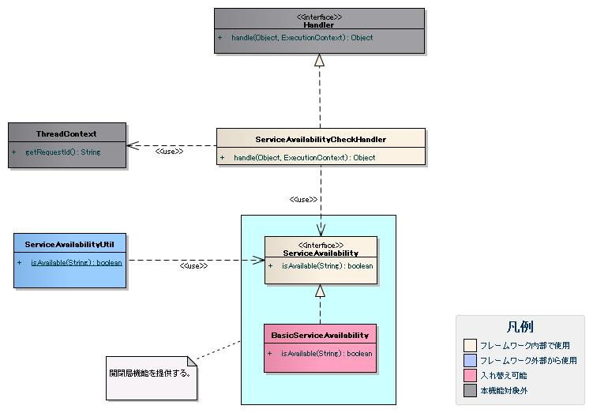

# 開閉局

## 概要

開閉局機能はサービスの提供可否状態をチェックおよび設定（ON/OFF切り替え）する機能を提供する。

- チェック: 共通ハンドラ（`ServiceAvailabilityCheckHandler`）およびユーティリティ（`ServiceAvailabilityUtil`）を使用
- 設定: ユーティリティを使用

特定の実行制御基盤に依存せず、画面オンライン実行制御基盤でもバッチ実行制御基盤でも使用可能。

> **注意**: サービス提供可否状態はデータベースのテーブルに格納されている。テーブル構造は :ref:`tableDefinition` を参照。


<details>
<summary>keywords</summary>

ServiceAvailabilityCheckHandler, ServiceAvailabilityUtil, 開閉局, サービス提供可否状態, 画面オンライン, バッチ実行制御基盤

</details>

## 特徴

リクエスト、各機能（複数のリクエストの集合）、システム全体の単位でサービス提供可否状態を設定可能。

<details>
<summary>keywords</summary>

開閉局, サービス提供可否, リクエスト単位, 機能単位, システム全体

</details>

## 要求

## 実装済み

- アクション(リクエスト)単位でサービス提供可否状態をチェックできる
- 開閉局が必要なすべての実行制御基盤でサービス提供可否状態をチェックできる

> **注意**: 本フレームワークでは、運用JOBスケジューラ側でサービス提供可否フラグを切り替える方式を採用（フレームワークが日時情報を管理しないシンプルな方式）。将来的には指定時間での自動切り替え方式も取り込み検討予定（インタフェースの変更は不要な設計）。

## 未実装

- アクション(リクエスト)単位でサービス提供可否状態の設定
- 各機能（複数のリクエストの集合）単位での設定
- システム全体での設定
- 特定のイベントをトリガとした設定

## 未検討

- 指定時間にサービス提供可否を切り替える機能
- 判定結果に応じた画面項目（メニューやボタン等）の表示・非表示切り替え
- サービス提供不可時の個別画面遷移

## 取り下げ

各機能（複数のリクエストの集合）単位でのチェック機能は提供しない。リクエスト単位のチェック機能のみ提供する。今後提供する各機能単位でサービス提供可否状態を一括設定する機能を使用することで、代替が可能である。

<details>
<summary>keywords</summary>

開閉局, 実装済み機能, 未実装機能, リクエスト単位チェック, サービス提供可否フラグ, 未検討, 取り下げ

</details>

## 構成



## インタフェース

**インタフェース**: `nablarch.common.availability.ServiceAvailability`

リクエストIDをもとにサービス提供可否状態を判定するインタフェース。独自の判定実装が必要な場合はこのインタフェースを実装する。

## クラス

**クラス**: `nablarch.common.availability.BasicServiceAvailability`

`ServiceAvailability`の実装クラス。リクエストテーブルを参照してサービス提供可否を判定する。テーブル名・カラム名は設定ファイルで変更可能。

**クラス**: `nablarch.common.handler.ServiceAvailabilityCheckHandler`

サービス提供可否状態の判定を行うハンドラ。

**クラス**: `nablarch.common.availability.ServiceAvailabilityUtil`

サービス提供可否状態判定用ユーティリティ。業務アクション等からサービス提供可否状態を取得する際に使用。

## シーケンス（画面オンライン）

1. `ServiceAvailabilityCheckHandler`がリクエストIDをもとにサービス提供可否状態を判定する
2. リクエストIDは、`ServiceAvailabilityCheckHandler`より先に処理を行うハンドラ（:ref:`ThreadContextHandler`）によりThreadContextに設定されている必要がある
3. サービス提供不可の場合、一律サービス提供不可エラー画面へ遷移する

## テーブル定義（リクエストテーブル）

テーブル名・カラム名は任意。データベースの型はJavaの型に変換可能な型を選択する。

| カラム | Javaの型 | 制約 | 備考 |
|---|---|---|---|
| リクエストID | java.lang.String | PK | |
| リクエスト名 | java.lang.String | | 業務用カラム（本機能では不使用） |
| サービス提供可否状態 | java.lang.String | | 「1」でサービス提供可能（デフォルト、設定で変更可） |

> **注意**: 「サービス提供可否状態」カラムの判定値はデフォルト「1」。設定ファイルで変更可能（:ref:`basicServiceAvailabilityDetail` 参照）。

<details>
<summary>keywords</summary>

ServiceAvailability, BasicServiceAvailability, ServiceAvailabilityCheckHandler, ServiceAvailabilityUtil, ThreadContextHandler, クラス図, シーケンス図, テーブル定義, リクエストテーブル

</details>

## 設定の記述

開閉局機能はリポジトリ機能を利用して設定する。

## 全処理方式共通

```xml
<!-- 開閉局機能を提供するフレームワーク基本実装 -->
<component name="serviceAvailability" class="nablarch.common.availability.BasicServiceAvailability">
    <property name="tableName" value="REQUEST"/>
    <property name="requestTableRequestIdColumnName" value="REQUEST_ID"/>
    <property name="requestTableServiceAvailableColumnName" value="SERVICE_AVAILABLE"/>
    <property name="requestTableServiceAvailableOkStatus" value="1"/>
    <property name="dbManager" ref="serviceAvailabilityDbManager"/>
</component>

<component name="dbManager" class="nablarch.core.db.transaction.SimpleDbTransactionManager">
    <property name="dbTransactionName" value="serviceAvailability" />
    <property name="transactionFactory" ref="transactionFactory" />
    <property name="connectionFactory" ref="connectionFactory" />
</component>

<component name="serviceAvailabilityCheckHandler" class="nablarch.common.handler.ServiceAvailabilityCheckHandler">
    <property name="serviceAvailability" ref="serviceAvailability"/>
</component>
```

`BasicServiceAvailability`は初期化が必要（`Initializable`インタフェースを実装）。:ref:`repository_initialize` を参考に、`BasicApplicationInitializer`の`initializeList`に`serviceAvailability`を追加すること。

```xml
<component name="initializer" class="nablarch.core.repository.initialization.BasicApplicationInitializer">
    <property name="initializeList">
        <list>
            <component-ref name="serviceAvailability"/>
        </list>
    </property>
</component>
```

## BasicServiceAvailabilityクラスの設定

| プロパティ名 | 必須 | デフォルト値 | 説明 |
|---|---|---|---|
| dbManager | ○ | | データベースのトランザクション制御（SimpleDbTransactionManager）。[../01_Core/04_DbAccessSpec](libraries-04_DbAccessSpec.md) 参照 |
| tableName | ○ | | リクエストテーブルの名前 |
| requestTableRequestIdColumnName | ○ | | リクエストIDカラムの名前 |
| requestTableServiceAvailableColumnName | ○ | | サービス提供可否状態カラムの名前 |
| requestTableServiceAvailableOkStatus | | 1 | サービス提供可能な状態の値（省略時は「1」） |

## ServiceAvailabilityCheckHandlerの設定

| プロパティ名 | 必須 | 説明 |
|---|---|---|
| serviceAvailability | ○ | ServiceAvailabilityインタフェースの実装クラス |

<details>
<summary>keywords</summary>

BasicServiceAvailability, ServiceAvailabilityCheckHandler, tableName, requestTableRequestIdColumnName, requestTableServiceAvailableColumnName, requestTableServiceAvailableOkStatus, dbManager, serviceAvailability, 初期化設定, BasicApplicationInitializer, SimpleDbTransactionManager

</details>
