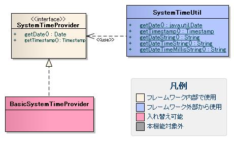
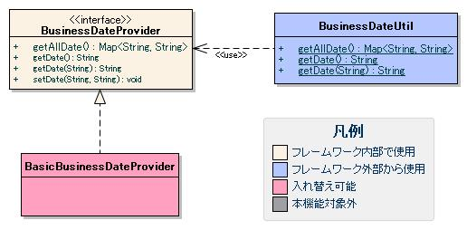
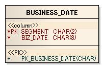

# 日付の管理機能

## 概要

業務日付とシステム日時(OS日時)の管理(取得)機能を提供する。あわせて、日付ユーティリティについても説明する。

## 特徴

### 高い拡張性

業務日付、システム日時の取得方法は切り替えることができる。これにより、本機能で提供されている機能では満たされない要件が出てきた場合でも柔軟に対応することができる。

### 業務日付は複数設定が可能

例えばオンラインとバッチで別の業務日付を使用するなど、複数の業務日付を設定できる。これにより、各業務日付ごとに個別の更新タイミングを指定することが可能である。

## 要求

### 実装済み

* システム日付を取得できる。
* 業務日付を取得できる。
* 業務日付を複数管理できる。
* 業務日付を任意の日付に上書き出来る。
  例えばバッチ処理で障害時の再実行時に過去日付をバッチ実行時の業務日付としたい場合がある。
  このような場合に、再実行を行うプロセスのみ任意の日付を業務日付として実行することが出来る。
* 業務日付をメンテナンスできる。

### 未実装

## 構造

### システム日時機能

本章では、システム日時機能について説明を行う。システム日時とは、OS日時(サーバ日時)のことを指し、業務日付のように営業日や非営業日の考え方を持たない日時である。

#### クラス図



##### インタフェース定義

| インタフェース名 | 概要 |
|---|---|
| nablarch.core.date.SystemTimeProvider | システム日時を取得するインタフェース。本インタフェースの実装クラスを追加することにより、システム日時の取得方法を切り替えることができる。 |

##### クラス定義

| クラス名 | 概要 |
|---|---|
| nablarch.core.date.BasicSystemTimeProvider | SystemTimeProviderの基本実装クラス。本クラスでは、JVMの稼働マシンのシステム日時(new java.util.Date())を取得する。 |
| nablarch.core.date.SystemTimeUtil | システム日時を取得するクラス。アプリケーションでは、本クラスからシステム日時を取得する。 |

#### SystemTimeUtilで提供される機能では不足している場合の対応方法

SystemTimeUtilで提供される機能に不足がある場合には、下記のサンプル実装のようにプロジェクト固有のシステム日時取得クラスを追加し対応すること。

```java
// ******** 注意 ********
// 本実装例は、各プロジェクトのアーキテクトが実装すべきクラスである。
// このため、このようなクラスをアプリケーションプログラマが実装することはない。

public class SampleSystemTimeUtil {
    /**
     * システム日時を取得する。
     * @return システム日時
     */
    public static Date getDate() {
        // SystemTimeUtilで実装されている機能については、SystemTimeUtilに処理を移譲する。
        return SystemTimeUtil.getDate();
    }

    //********************************************************************************
    // getDateと同じように、SystemTimeUtilで提供されている機能の、メソッドを実装する。
    //********************************************************************************

    // プロジェクト固有の実装を行う。

    /**
     * システム時間を取得する。
     * @return システム時間
     */
    public static Time getTime() {
        return new Time(SystemTimeUtil.getDate().getTime());
    }
}
```

### 業務日付機能

本章では、業務日付機能について説明を行う。

#### クラス図



##### インタフェース定義

| インタフェース名 | 概要 |
|---|---|
| nablarch.core.date.BusinessDateProvider | 業務日付を取得・設定するインタフェース。本インタフェースの実装クラスを追加することにより、業務日付の取得方法の切り替え・業務日付の設定をすることができる。 |

##### クラス定義

| クラス名 | 概要 |
|---|---|
| nablarch.core.date.BasicBusinessDateProvider | BusinessDateProviderの基本実装クラス。本クラスでは、データベースから業務日付を取得・設定する。 |
| nablarch.core.date.BusinessDateUtil | 業務日付を取得するクラス。アプリケーションでは、本クラスから業務日付を取得する。 |

#### テーブル定義

BasicBusinessDateProviderを使用する場合、以下に示すデータベーステーブルを用意する。テーブル名およびカラム名に制約はなく、
設定( [設定ファイル](../../component/libraries/libraries-06-SystemTimeProvider.md#date-businessconfiguration) 参照)により任意の名称が使用できる。

##### 業務日付テーブル

| 定義 | Javaの型 | 制約 | 備考 |
|---|---|---|---|
| 区分 | java.lang.String | プライマリキー |  |
| 日付 | java.lang.String |  | 値はyyyyMMdd形式であること |

##### テーブル定義の例



#### 複数の業務日付の設定

本フレームワークでは、設定したい業務日付ごとに区分を与えることで、複数の業務日付を管理する設計となっている。

基本実装クラスでは、区分で業務日付テーブルを検索し、取得したレコードの日付を返す。区分の割り振り方は、重複しないこと以外に制限はない。
業務日付を取得する際に区分を指定しない場合は、設定ファイル( [設定ファイル](../../component/libraries/libraries-06-SystemTimeProvider.md#date-businessconfiguration) 参照)で設定した区分を指定されたものとして、業務日付を取得する。

#### 設定ファイル

設定ファイルの記述を説明する。まず、設定ファイル例を示し、次に各設定項目の詳細を説明する。

* 設定ファイル例

  ```xml
  <component name="businessDateProvider" class="nablarch.core.date.BasicBusinessDateProvider">
      <property name="tableName" value="BUSINESS_DATE" />
      <property name="segmentColumnName" value="SEGMENT"/>
      <property name="dateColumnName" value="BIZ_DATE"/>
      <property name="defaultSegment" value="00"/>
      <property name="cacheEnabled" value="true" />
      <property name="dbTransactionName" value="transaction" />
      <property name="transactionManager" ref="transactionManager" />
  </component>
  ```
* componentの設定

  | 属性値 | 設定値 |
  |---|---|
  | name(必須) | "businessDateProvider"と設定する。 |
  | class(必須) | 使用するBusinessDateProviderの実装クラスを設定する。 |
* nablarch.core.date.BasicBusinessDateProviderの設定

  | 属性値 | 設定値 |
  |---|---|
  | tableName(必須) | 業務日付テーブルのテーブル物理名を設定する。 |
  | segmentColumnName(必須) | 業務日付テーブルの区分カラムの物理名を設定する。 |
  | dateColumnName(必須) | 業務日付テーブルの日付カラムの物理名を設定する。 |
  | defaultSegment(必須) | 区分を省略して業務日付取得を使用した際に、指定される区分を設定する。 |
  | cacheEnabled | 業務日付テーブルのデータをキャッシュするか否かを設定する。    キャッシュ機能を利用した場合、複数回業務日付処理が呼ばれた場合であってもデータベースへのアクセスは1回ですむため、   性能向上が見込まれる。このため、キャッシュ機能を有効にすることを推奨する。    特にバッチ処理のように大量データを繰り返し処理するような場合、必然的に業務日付機能へのアクセス回数も多くなる。   このような場合に、キャッシュ機能を無効にしてしまうと業務日付を取得するたびにデータベースへのアクセスが発生し、   本機能が性能劣化の一因となるため注意すること。    キャッシュを有効にした場合、初めて日付取得メソッドが呼び出されたタイミングで   全ての業務日付のデータをスレッドコンテキスト( [同一スレッド内でのデータ共有(スレッドコンテキスト)](../../component/libraries/libraries-thread-context.md#thread-context-label) を参照)にキャッシュする。   キャッシュされた値は、ハンドラキューに設定された Threadcontexthandler によってクリアされる。    なお、本設定値を省略した場合のデフォルト動作はキャッシュありとなっている。   このため、キャッシュを行わない場合のみ、本設定値にfalseを設定すれば良い。 |
  | dbTransactionName | データベースに対するトランザクション名を設定する。    本クラスは、業務アプリケーションと同一のデータベース接続を使用する。   このため、業務アプリケーションで使用するトランザクション名称を本プロパティに設定する必要がある。   ただし、業務アプリケーションが、デフォルトのトランザクション名を使用する場合は、   本プロパティへトランザクション名を設定する必要はない。    詳細は、以下のコードを参照    ```java   // 以下のコードでコネクションが取得できる場合は、本プロパティへの設定は省略可能   AppDbConnection con = DbConnectionContext.getConnection();      // 以下のコードでコネクションを取得する必要がある場合は、   // 本プロパティには、getConnectionへ設定している引数("appTransactionName")を設定する。   AppDbConnection con = DbConnectionContext.getConnection("appTransactionName");   ``` |
  | transactionManager(必須) | トランザクションマネージャを設定する。    業務日付をデータベースから取得する際に使用するトランザクションを設定する。 |

#### 日付の上書き機能

本フレームワークでは、 [業務日付テーブル](../../component/libraries/libraries-06-SystemTimeProvider.md#date-table) で管理されている日付を上書きする機能を提供する。
この機能は、プロセス単位に使用する日付を変更できるものであり、主にバッチ処理での障害復旧時に使用することを想定する。
例えば、現在の業務日付ではなく障害発生時の日付を業務日付として処理を実行したい場合に、データベース上の値ではなく任意の日付を業務日付として使用することが可能となる。

画面処理では、全ての機能が１プロセス内で実行されるため、本機能を使用するのではなく単純にデータベースで管理されている日付を変更すれば良い。

##### 業務日付の上書き方法

業務日付の上書きは、 [リポジトリ](../../component/libraries/libraries-02-Repository.md#repository) に任意の日付を登録することにより実現できる。

リポジトリには、Java起動時に「-D」オプションを使用して上書きしたい日付を登録することが出来る。
「-D」オプションのキー、値には下記表を参照し設定を行うこと。

| キー | 値 |
|---|---|
| BasicBusinessDateProvider. + "区分" | 上書きしたい日付 |

例：区分00の日付を20110710に上書きしたい場合

```bash
java -DBasicBusinessDateProvider.00=20110710 Main
```

以下に例を示す。

* データベースの値(業務日付テーブルの値)

  | 区分 | 日付 |
  |---|---|
  | 00 | 20110710 |
  | 01 | 20110709 |
* リポジトリの内容

  | キー | 値 |
  |---|---|
  | BasicBusinessDateProvider.01 | 20110708 |

上記構成の場合取得される日付は、下記の通りとなる。

```java
// 20110710が取得される。
// リポジトリに日付が登録されていないため、
// データベースに登録された値が取得される。
getDate("00");

// 20110708が取得される。
// リポジトリに日付が登録されているため、
// リポジトリに登録された日付が取得される。
getDate("01");
```

#### 業務日付のメンテナンス

業務日付のメンテナンスはsetDateメソッドで行う。setDateメソッドの使用方法を以下に示す。

```java
// ******** 注意 ********
// 本実装例は、各プロジェクトのアーキテクトが実装すべきクラスである。
// このため、このようなクラスをアプリケーションプログラマが実装することはない。
// BusinessDateUtilクラスがsetDateメソッドを提供していない理由も、
// アプリケーションプログラマがsetDateメソッドを使用できないようにするためである。

// リポジトリから業務日付を操作するクラスを取得する
BusinessDateProvider bdp = (BasicBusinessDateProvider) SystemRepository.getObject("businessDateProvider");

// 更新対象の区分値、更新する値を入力し、更新実行
bdp.setDate(segment, date);
```

#### BusinessDateUtilで提供される機能では不足している場合の対応方法

BusinessDateUtilで提供される機能に不足がある場合には、下記のサンプル実装のようにプロジェクト固有の業務日付取得クラスを追加し対応すること。

```java
// ******** 注意 ********
// 本実装例は、各プロジェクトのアーキテクトが実装すべきクラスである。
// このため、このようなクラスをアプリケーションプログラマが実装することはない。

public class SampleBusinessDateUtil {
    /**
     * 業務日付を取得する。
     * @return 業務日付
     */
    public static String getDate() {
        // BusinessDateUtilで実装されている機能については、BusinessDateUtilに処理を移譲する。
        return BusinessDateUtil.getDate();
    }

    //**********************************************************************************
    // getDateと同じように、BusinessDateUtilで提供されている機能の、メソッドを実装する。
    //**********************************************************************************

    // プロジェクト固有の実装を行う。

    /**
     * 業務日付の前日を取得する
     * @return 前日
     */
    public static String getBeforeDate() {
        // 業務日付の前日を取得する処理
    }
}
```

## 日付ユーティリティ

日付に関する機能の中で、システム日時や業務日付に関係しないものを日付ユーティリティとして提供する。

詳細は、 [ユーティリティ](../../component/libraries/libraries-99-Utility.md#date-util-spec) を参照すること。
