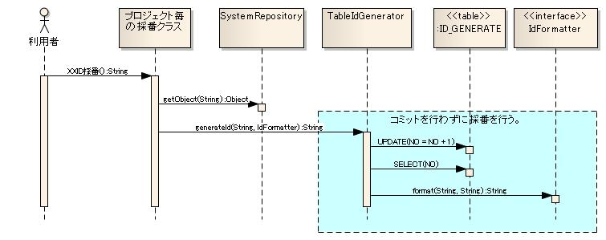

# 採番機能

## 概要

採番機能はリポジトリに登録して使用し、初期化処理は :ref:`repository` が実行する。

本機能は各プロジェクトのアーキテクトが作成する採番クラスから使用することを想定しており、アプリケーションプログラマが直接使用することはない。

<details>
<summary>keywords</summary>

採番機能, IdGenerator, リポジトリ登録, アーキテクト設計, 採番初期化

</details>

## 特徴

**採番方法の選択**

採番単位（取引IDや売上明細ID等）ごとに採番方法を指定可能。抜け番を許容するIDと許容しないIDで採番方法を切り替えられる。設定ファイルの変更のみで各DBベンダーの採番機能（Oracleシーケンス等）に切り替え可能。

**フォーマット機能**

採番したIDのフォーマットを各プロジェクトで独自に追加・拡張可能。

<details>
<summary>keywords</summary>

採番方法選択, 抜け番, フォーマット, IdFormatter, Oracleシーケンス, 採番切り替え

</details>

## 要求

## 実装済み機能

- 連番採番（抜け番なし）: 業務処理のコミット時点でIDが確定し抜け番が発生しない
- 高速採番（抜け番あり）: ロック待機を最小限に抑えた高速採番（抜け番が発生する可能性あり）
- 採番付加機能: フォーマット指定（桁数揃え）

## 未実装機能

- テーブル採番でのサイクリック指定
- Oracleシーケンス・DB2シーケンスを使用した採番
- HILOアルゴリズムを使用したより高速な採番（テーブル採番の一部をメモリ上で行う）
- 採番IDへの業務日付・システム日付の付加
- 採番値の初期化

<details>
<summary>keywords</summary>

連番採番, 高速採番, 抜け番なし, LpadFormatter, HILOアルゴリズム, 未実装機能, 桁数揃え

</details>

## 構造


## インタフェース

| インタフェース名 | 概要 |
|---|---|
| `nablarch.common.idgenerator.IdGenerator` | IDを採番するインタフェース。独自の採番実装が必要な場合は本インタフェースを実装する |
| `nablarch.common.idgenerator.IdFormatter` | 採番したIDをフォーマットするインタフェース。独自フォーマットが必要な場合は本インタフェースを実装する |

## クラス（IdGenerator実装）

**クラス**: `nablarch.common.idgenerator.TableIdGenerator`

テーブルを使用して抜け番なしに採番するクラス。アプリケーションと同一のトランザクションで採番処理を行うことで、業務処理と同タイミングでIDが確定し抜け番を防止する。また、業務処理の確定順に採番を行うことができる。

> **警告**: 業務トランザクションと同一トランザクションが使用されるため、業務処理のコミットまで採番テーブルのロックが保持される。他の処理が同一IDを採番しようとするとロック解放待ちとなり性能劣化の原因になる。抜け番が許容されるIDには`FastTableIdGenerator`や`SequenceIdGeneratorSupport`の使用を強く推奨。DB2・SQLServerではロックエスカレーション（ロックの範囲がレコードからページ・テーブルへ拡大）により性能劣化がより顕著となる可能性あり。

**クラス**: `nablarch.common.idgenerator.FastTableIdGenerator`

テーブルを使用して高速に採番するクラス。アプリケーションとは異なるトランザクションで採番後即時コミットすることでロック待機時間を最小限に抑える。採番処理は`TableIdGenerator`に委譲し、トランザクション制御のみ実装。

## クラス（IdFormatter実装）

**クラス**: `nablarch.common.idgenerator.formatter.LpadFormatter`

採番されたIDの桁数を揃えるフォーマッタークラス。指定桁数になるまで指定文字を先頭に付加する。

<details>
<summary>keywords</summary>

IdGenerator, IdFormatter, TableIdGenerator, FastTableIdGenerator, LpadFormatter, SequenceIdGeneratorSupport, ロックエスカレーション, nablarch.common.idgenerator.IdGenerator, nablarch.common.idgenerator.IdFormatter, nablarch.common.idgenerator.TableIdGenerator, nablarch.common.idgenerator.FastTableIdGenerator, nablarch.common.idgenerator.formatter.LpadFormatter, ロック待機, トランザクション制御, 確定順, 業務処理の確定順

</details>

## テーブルを使用した採番機能 - 採番テーブルの構造とシーケンス図

## 採番テーブルの構造

| カラム | 型（Oracleの場合） | 備考 |
|---|---|---|
| ID | CHAR(4) | 採番対象を識別するID（採番対象ID）を格納するカラム |
| NO | NUMBER(10) | 採番対象IDの中で採番された値の最大値を保持するカラム |

> **注意**: テーブル名・カラム名は各プロジェクトの規約に従い命名。リポジトリ機能を使用して任意の名前を設定可能。

## シーケンス図




<details>
<summary>keywords</summary>

採番テーブル, TableIdGenerator, FastTableIdGenerator, シーケンス図, 抜け番なし採番, 抜け番あり採番, ID, NO

</details>

## テーブルを使用した採番機能 - 使用例

テーブルデータ例:

| ID | NO | 補足説明 |
|---|---|---|
| 1101 | 0 | サンプルID用レコード |
| 1102 | 10 | サンプルID2用レコード |

Java実装例（プロジェクトのアーキテクトが作成）:

```java
// フォーマット不要の場合（抜け番なし）
IdGenerator generator = (IdGenerator) SystemRepository.getObject("tableIdGenerator");
return generator.generateId("1101", null);  // 1が返却される

// フォーマット必要な場合（抜け番あり、10桁0埋め）
IdGenerator generator = (IdGenerator) SystemRepository.getObject("fastTableIdGenerator");
return generator.generateId("1102", new LpadFormatter(10, '0'));  // 0000000011が返却される
```

XML設定例:

```xml
<!-- 連番採番（抜け番なし） -->
<component name="tableIdGenerator" class="nablarch.common.idgenerator.TableIdGenerator">
    <property name="tableName" value="ID_GENERATE" />
    <property name="idColumnName" value="ID"/>
    <property name="noColumnName" value="NO"/>
</component>

<!-- 高速採番（抜け番あり） -->
<component name="fastTableIdGenerator" class="nablarch.common.idgenerator.FastTableIdGenerator">
    <property name="tableName" value="ID_GENERATE" />
    <property name="idColumnName" value="ID"/>
    <property name="noColumnName" value="NO"/>
    <property name="dbTransactionManager">
        <component class="nablarch.core.db.transaction.SimpleDbTransactionManager">
            <property name="dbTransactionName" value="generator"/>
        </component>
    </property>
</component>

<!-- テーブル採番クラスの初期化設定 -->
<component name="initializer" class="nablarch.core.repository.initialization.BasicApplicationInitializer">
    <property name="initializeList">
        <list>
            <component-ref name="TableIdGenerator"/>
            <component-ref name="FastTableIdGenerator"/>
        </list>
    </property>
</component>
```

<details>
<summary>keywords</summary>

generateId, LpadFormatter, SystemRepository, tableIdGenerator, fastTableIdGenerator, BasicApplicationInitializer, nablarch.common.idgenerator.TableIdGenerator, nablarch.common.idgenerator.FastTableIdGenerator, nablarch.core.db.transaction.SimpleDbTransactionManager, SimpleDbTransactionManager, 初期化設定

</details>

## テーブルを使用した採番機能 - 設定プロパティ詳細

**TableIdGeneratorのプロパティ**（採番テーブルのレイアウトは [id-table-label](#) を参照）:

| プロパティ名 | 必須 | 説明 |
|---|---|---|
| tableName | ○ | 採番テーブルのテーブル物理名 |
| idColumnName | ○ | 採番テーブルのIDカラムの物理名 |
| noColumnName | ○ | 採番テーブルのNOカラムの物理名 |
| dbTransactionName | | データベースコネクション名。無名のDB接続を使用する場合は設定不要 |

> **警告**: `dbTransactionName`を設定する場合は、アプリケーションで使用するデータベース接続と同一のデータベースコネクション名を設定すること。

**FastTableIdGeneratorのプロパティ**:

| プロパティ名 | 必須 | 説明 |
|---|---|---|
| tableName | ○ | 採番テーブルのテーブル物理名 |
| idColumnName | ○ | 採番テーブルのIDカラムの物理名 |
| noColumnName | ○ | 採番テーブルのNOカラムの物理名 |
| dbTransactionManager | ○ | `nablarch.core.db.transaction.SimpleDbTransactionManager`を設定する |

**SimpleDbTransactionManager（FastTableIdGenerator用）のプロパティ**:

| プロパティ名 | 必須 | 説明 |
|---|---|---|
| dbTransactionName | | DBトランザクション名。未設定時は`nablarch.common.idgenerator.FastTableIdGenerator`が自動設定される |

> **警告**: `dbTransactionName`はビジネスロジックで使用するトランザクション名と**異なる値**を設定すること。同一名を指定した場合、トランザクション開始時に例外が発生する。

<details>
<summary>keywords</summary>

tableName, idColumnName, noColumnName, dbTransactionManager, dbTransactionName, TableIdGenerator, FastTableIdGenerator, SimpleDbTransactionManager, nablarch.common.idgenerator.TableIdGenerator, nablarch.common.idgenerator.FastTableIdGenerator, nablarch.core.db.transaction.SimpleDbTransactionManager

</details>
