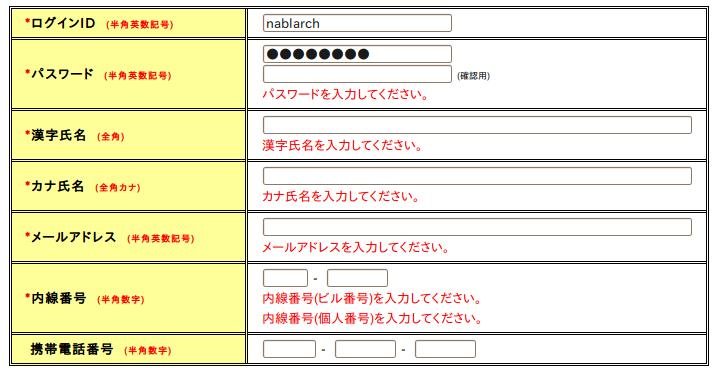
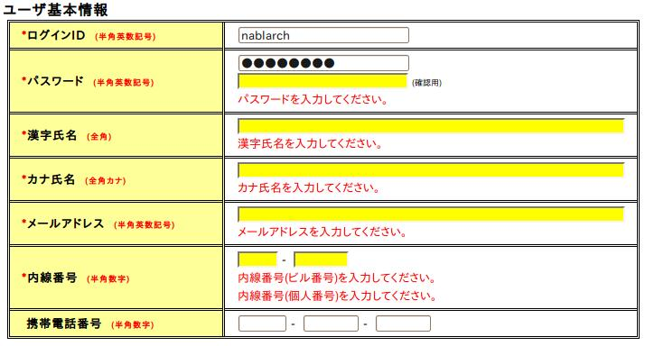
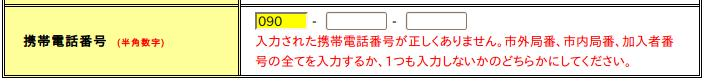
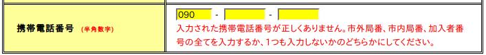
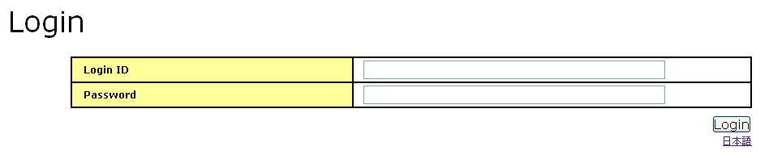

## 値のフォーマット出力

入力データを表示する際に、日付や金額などの値をフォーマットして出力することが要求される。
本機能では、 [writeタグ](../../component/libraries/libraries-07-TagReference.md#writeタグ) と [textタグ](../../component/libraries/libraries-07-TagReference.md#textタグ) については値をフォーマットして出力する機能を提供する。
valueFormat属性を指定することでフォーマット出力を指示する。
valueFormat属性の指定がない場合は、フォーマットせずに値を出力する。

| 属性 | 説明 |
|---|---|
| valueFormat | 出力時のフォーマット。  フォーマットは、"データタイプ{パターン}"形式で指定する。 フレームワークがデフォルトでサポートしているフォーマットを下記に示す。  > **Note:** > データタイプは、 アプリケーションでのフォーマットの変更方法 で設定するデータタイプを使用すること。  **dateTimeはwriteタグのみで使用できる。**  yyyymmdd:  年月日のフォーマット。  値はyyyyMMdd形式またはパターン形式の文字列を指定する。 パターンにはjava.text.SimpleDateFormatが規定している構文を指定する。 **パターン文字には、y(年)、M(月)、d(月における日)のみ指定可能。** パターン文字列を省略した場合は [カスタムタグのデフォルト値の設定](../../component/libraries/libraries-07-HowToSettingCustomTag.md#カスタムタグのデフォルト値の設定) に設定されたデフォルトのパターンが使用される。  また、パターンの後に区切り文字"\|"を使用してフォーマットのロケールを付加することができる。 ロケールを明示的に指定しない場合は、ThreadContextのロケール設定値を使用する。 ThreadContextも設定されていない場合は、システムデフォルトロケール値を使用する。  例:  valueFormat属性の指定例を下記に示す。  ```bash # デフォルトのパターンとスレッドコンテキストに設定されたロケールを使用する。 valueFormat="yyyymmdd"  # 明示的に指定されたパターンと、スレッドコンテキストに設定されたロケールを使用する。 valueFormat="yyyymmdd{yyyy/MM/dd}"  # デフォルトのパターンを使用し、ロケールのみ指定する場合。 valueFormat="yyyymmdd{\|ja}"  # パターン、ロケールの両方を明示的に指定する場合。 valueFormat="yyyymmdd{yyyy年MM月d日\|ja}" ```  > **Note:** > textタグのvalueFormat属性を指定した場合、 > 入力画面にもフォーマットした値が出力される。 > 入力された年月日をアクションで取得する場合は > [年月日コンバータ](../../component/libraries/libraries-validation-advanced-validators.md#年月日コンバータ) を使用する。 > textタグとコンバータが連携し、 > valueFormat属性に指定されたパターンを使用した値変換と入力精査を行う。  yyyymm:  年月のフォーマット。  値はyyyyMM形式またはパターン形式の文字列を指定する。使用方法は、yyyymmddと同様。  > **Note:** > yyyyMMの場合、コンバータには、 > [年月コンバータ](../../component/libraries/libraries-validation-advanced-validators.md#年月コンバータ) を使用する。  dateTime:  日時のフォーマット。  値はjava.util.Date型を指定する。 パターンにはjava.text.SimpleDateFormatが規定している構文を指定する。 デフォルトでは、スレッドコンテキストに設定されたロケールとタイムゾーンに応じた日時が出力される。 また、パターン文字列の後に区切り文字"\|"を使用してロケールおよびタイムゾーンを明示的に指定することができる。  [カスタムタグのデフォルト値の設定](../../component/libraries/libraries-07-HowToSettingCustomTag.md#カスタムタグのデフォルト値の設定) を使用して、パターンのデフォルト値の設定と、区切り文字"\|"の変更を行うことができる。  valueFormat属性の指定例を下記に示す。  ```bash # デフォルトのパターンとThreadContextに設定されたロケール、タイムゾーンを使用する場合。 valueFormat="dateTime"  #デフォルトのパターンを使用し、ロケールおよびタイムゾーンのみ指定する場合。 valueFormat="dateTime{\|ja\|Asia/Tokyo}"  # デフォルトのパターンを使用し、タイムゾーンのみ指定する場合。 valueFormat="dateTime{\|\|Asia/Tokyo}"  # パターン、ロケール、タイムゾーンを全て指定する場合。 valueFormat="dateTime{yyyy年MMM月d日(E) a hh:mm\|ja\|America/New_York}}"  # パターンとタイムゾーンを指定する場合。 valueFormat="dateTime{yy/MM/dd HH:mm:ss\|\|Asia/Tokyo}" ```  decimal:  10進数のフォーマット。  値はjava.lang.Number型又は数字の文字列を指定する。 文字列の場合、言語に対応する1000の区切り文字を取り除いた後でフォーマットされる。 パターンにはjava.text.DecimalFormatが規定している構文を指定する。  デフォルトでは、ThreadContextに設定された言語を使用して、言語に応じた形式で値が出力される。 言語を直接指定することで、指定された言語に応じた形式で値を出力することもできる。 言語の指定は、パターンの末尾に区切り文字"\|"を使用して言語を付加することで行う。  [カスタムタグのデフォルト値の設定](../../component/libraries/libraries-07-HowToSettingCustomTag.md#カスタムタグのデフォルト値の設定) を使用して、区切り文字"\|"の変更を行うことができる。  valueFormat属性の指定例を下記に示す。  ```bash # ThreadContextに設定された言語を使用し、パターンのみ指定する場合。 valueFormat="decimal{###,###,###.000}"  # パターンと言語を指定する場合。 valueFormat="decimal{###,###,###.000\|ja}" ```  > **Note:** > パターンに桁区切りと小数点を指定する場合は、言語に関係なく常に桁区切りにカンマ、小数点にドットを使用すること。  > ```bash > # es(スペイン語)の場合は、桁区切りがドット、小数点がカンマにフォーマットされる。 > # パターン指定では常に桁区切りにカンマ、小数点にドットを指定する。 > valueFormat="decimal{###,###,###.000\|es}" >  > # 下記は不正なパターン指定のため実行時例外がスローされる。 > valueFormat="decimal{###.###.###,000\|es}" > ```  > **Note:** > textタグのvalueFormat属性を指定した場合、 > 入力画面にもフォーマットした値が出力される。 > 入力された数値をアクションで取得する場合は > [数値コンバータ(BigDecimalConvertor、IntegerConvertor、LongConvertor)](../../component/libraries/libraries-validation-basic-validators.md#基本バリデータコンバータ) を使用する。 > textタグと数値コンバータが連携し、 > valueFormat属性に指定された言語に対応する値変換と入力精査を行う。 |

### フォーマット出力の使用例

フォーマット出力の使用例を下記に示す。
年月日に対して、yyyy/M/d形式のパターンを指定している。

```jsp
<tr>
    <td class="boldTd" width="300" bgcolor="#ffff99">
        有効期限
    </td>
    <td width="400">
        <n:write name="systemAccount.effectiveDateFrom" valueFormat="yyyymmdd{yyyy/M/d}" />
        ～
        <n:write name="systemAccount.effectiveDateTo" valueFormat="yyyymmdd{yyyy/M/d}" />
    </td>
</tr>
```

HTMLの出力例を下記に示す。
出力対象の年月日は、"20101203"とする。

```html
<tr>
    <td class="boldTd" width="300" bgcolor="#ffff99">
        有効期限
    </td>
    <td width="400">
        2010/12/3
        ～
        2011/12/3
    </td>
</tr>
```

> **Note:**
> 入力画面でフォーマット出力する際の注意点

> 本機能では、入力項目に指定されたフォーマットを入力項目と紐付けてウィンドウスコープで管理を行なっている。
> このため、入力値をウィンドウスコープに設定しないと、ウィンドウスコープにフォーマットが設定されずフォーマット編集が行えない。
> 入力画面でフォーマット出力を行う際には、以下のコード例のように入力値をウィンドウスコープに設定すること。

> ```jsp
> <%--
> 入力項目がウィンドウスコープに設定されるように、n:formのwindowScopePrefixes属性には、
> 「searchCondition」を設定する。
> --%>
> <n:form windowScopePrefixes="searchCondition">
>   <n:text name="searchCondition.yyyymmdd" valueFormat="yyyymmdd{yyyy年MM月dd日|ja}" />
>   <n:text name="searchCondition.yyyymm" valueFormat="yyyymm{yyyy年MM月|ja}" />
> </n:form>
> ```

### アプリケーションでのフォーマットの変更方法

フォーマットは、 **nablarch.common.web.tag.ValueFormatter** インタフェースを実装したクラスが行う。
実装したクラスをリポジトリに登録することでフォーマットを変更することができる。

リポジトリへの登録は、Map型でデータタイプ名をキーに、ValueFormatterを実装したクラスを値に指定する。
フレームワークがデフォルトでサポートしているフォーマットに対する設定例を下記に示す。
フォーマッタのマップは、"valueFormatters"という名前でリポジトリに登録する。
リポジトリにフォーマッタが登録されていない場合は、フレームワークがデフォルトでサポートしているフォーマットを使用する。

> **Note:**
> データタイプ名(Map型のキー値)は、valueFormat属性に指定する必要があるデータタイプ名となる。
> 詳細は、 値のフォーマット出力 を参照すること。

```xml
<map name="valueFormatters">
    <entry key="yyyymmdd">
        <value-component class="nablarch.common.web.tag.YYYYMMDDFormatter" />
    </entry>
    <entry key="dateTime">
        <value-component class="nablarch.common.web.tag.DateTimeFormatter" />
    </entry>
    <entry key="decimal">
        <value-component class="nablarch.common.web.tag.DecimalFormatter" />
    </entry>
</map>
```

## エラー表示

エラー表示のカスタムタグは、下記のタグを提供している。

| カスタムタグ | 説明 |
|---|---|
| [errorsタグ](../../component/libraries/libraries-07-TagReference.md#errorsタグ) | 複数のエラーメッセージをリスト表示する場合に使用する。 |
| [errorタグ](../../component/libraries/libraries-07-TagReference.md#errorタグ) | エラーの原因となった入力項目の近くにエラーメッセージを個別に表示する場合に使用する。 |

errorsタグとerrorタグは、リクエストスコープからApplicationExceptionを取得してエラーメッセージを出力する。
ApplicationExceptionは、Webフロントコントローラの例外制御(OnErrorアノテーション)を使用して、リクエストスコープに設定する。

ユーザ登録画面の登録ボタンに対する処理でのOnErrorアノテーションの使用例を下記に示す。
ユーザ登録画面を表示するリクエストIDにフォーワードしている。

```java
// ユーザ登録画面の登録ボタンに対するアクションのメソッド
@OnError(type = ApplicationException.class, path = "forward://MENUS00103")
public HttpResponse doUSERS00201(HttpRequest req, ExecutionContext ctx) {
    // 省略
}
```

### errorsタグ

errorsタグで指定できる属性を下記に示す。

| 属性 | 説明 |
|---|---|
| cssClass | リスト表示においてulタグに使用するCSSクラス名。 デフォルトは"nablarch_errors"。 |
| infoCss | 情報レベルのメッセージに使用するCSSクラス名。 デフォルトは"nablarch_info"。 |
| warnCss | 警告レベルのメッセージに使用するCSSクラス名。 デフォルトは"nablarch_warn"。 |
| errorCss | エラーレベルのメッセージに使用するCSSクラス名。 デフォルトは"nablarch_error"。 |
| filter | リストに含めるメッセージのフィルタ条件。 下記のいずれかを指定する。 all(全てのメッセージを表示する) global(入力項目に対応しないメッセージのみを表示) デフォルトはall。 globalの場合、ValidationResultMessageのプロパティ名が入っているメッセージを取り除いて出力する。 |

ユーザ登録画面での使用例を下記に示す。

```jsp
<n:errors />
```

errorsタグを使用した場合のHTML出力例を下記に示す。

```html
<ul class="nablarch_errors">
    <li class="nablarch_error">パスワードを入力してください。</li>
    <li class="nablarch_error">漢字氏名を入力してください。</li>
    <li class="nablarch_error">内線番号(ビル番号)を入力してください。</li>
    <li class="nablarch_error">内線番号(個人番号)を入力してください。</li>
    <li class="nablarch_error">カナ氏名を入力してください。</li>
    <li class="nablarch_error">メールアドレスを入力してください。</li>
</ul>
```


### errorタグ

errorタグで指定できる属性を下記に示す。

| 属性 | 説明 |
|---|---|
| name(必須) | エラーメッセージを表示する入力項目のname属性。 |
| errorCss | エラーレベルのメッセージに使用するCSSクラス名。 デフォルトは"nablarch_error"。 |
| messageFormat | メッセージ表示時に使用するフォーマット。 下記のいずれかを指定する。 div(divタグ) span(spanタグ) デフォルトはdiv。 |

ユーザ登録画面での使用例を下記に示す。
入力項目の下にそれぞれのエラーメッセージを表示する。

```jsp
<table class="data" width="700">
    <tr>
        <th width="300">
            <span class="essential">*</span>ログインID<span class="instruct">(半角英数記号)</span>
        </th>
        <td width="400">
            <n:text name="systemAccount.loginId" size="22" maxlength="20" />
            <n:error name="systemAccount.loginId" />
        </td>
    </tr>
    <tr>
        <th width="300">
            <span class="essential">*</span>パスワード<span class="instruct">(半角英数記号)</span>
        </th>
        <td width="400">
            <n:password name="systemAccount.newPassword" size="22" maxlength="20" /><br/>
            <n:password name="systemAccount.confirmPassword" size="22" maxlength="20" /><span class="dinstruct">(確認用)</span>
            <n:error name="systemAccount.newPassword" />
            <n:error name="systemAccount.confirmPassword" />
        </td>
    </tr>
    <tr>
        <th width="300">
            <span class="essential">*</span>漢字氏名<span class="instruct">(全角)</span>
        </th>
        <td width="400">
            <n:text name="users.kanjiName" size="52" maxlength="50" />
            <n:error name="users.kanjiName" />
        </td>
    </tr>
    <tr>
        <th width="300">
            <span class="essential">*</span>カナ氏名<span class="instruct">(全角カナ)</span>
        </th>
        <td width="400">
            <n:text name="users.kanaName" size="52" maxlength="50" />
            <n:error name="users.kanaName" />
        </td>
    </tr>
    <tr>
        <th width="300">
            <span class="essential">*</span>メールアドレス<span class="instruct">(半角英数記号)</span>
        </th>
        <td width="400">
            <n:text name="users.mailAddress" size="52" maxlength="50" />
            <n:error name="users.mailAddress" />
        </td>
    </tr>
    <tr>
        <th width="300">
            <span class="essential">*</span>内線番号<span class="instruct">(半角数字)</span>
        </th>
        <td width="400">
            <n:text name="users.extensionNumberBuilding" size="4" maxlength="2" />&nbsp;-&nbsp;
            <n:text name="users.extensionNumberPersonal" size="6" maxlength="4" />
            <n:error name="users.extensionNumberBuilding" />
            <n:error name="users.extensionNumberPersonal" />
        </td>
    </tr>
    <tr>
        <th width="300">
            携帯電話番号<span class="instruct">(半角数字)</span>
        </th>
        <td width="400">
            <n:text name="users.mobilePhoneNumberAreaCode" size="5" maxlength="3" />&nbsp;-&nbsp;
            <n:text name="users.mobilePhoneNumberCityCode" size="6" maxlength="4" />&nbsp;-&nbsp;
            <n:text name="users.mobilePhoneNumberSbscrCode" size="6" maxlength="4" />
            <n:error name="users.mobilePhoneNumberAreaCode" />
            <n:error name="users.mobilePhoneNumberCityCode" />
            <n:error name="users.mobilePhoneNumberSbscrCode" />
        </td>
    </tr>
</table>
```

errorタグを使用した場合のHTML出力例を下記に示す。
デフォルトでは、divタグでエラーメッセージが出力される。
エラーがない項目は、何も出力されない。

```html
<table class="data" width="700">
    <tr>
        <th width="300">
            <span class="essential">*</span>ログインID<span class="instruct">(半角英数記号)</span>
        </th>
        <td width="400">
            <input name="systemAccount.loginId" value="nablarch" size="22" maxlength="20" type="text">

        </td>
    </tr>
    <tr>
        <th width="300">
            <span class="essential">*</span>パスワード<span class="instruct">(半角英数記号)</span>
        </th>
        <td width="400">
            <input name="systemAccount.newPassword" value="password" size="22" maxlength="20" type="password"><br>
            <input class="nablarch_error" name="systemAccount.confirmPassword" value="" size="22" maxlength="20" type="password"><span class="dinstruct">(確認用)</span>
            <div class="nablarch_error">パスワードを入力してください。</div>
        </td>
    </tr>
    <tr>
        <th width="300">
            <span class="essential">*</span>漢字氏名<span class="instruct">(全角)</span>
        </th>
        <td width="400">
            <input class="nablarch_error" name="users.kanjiName" value="" size="52" maxlength="50" type="text">
            <div class="nablarch_error">漢字氏名を入力してください。</div>
        </td>
    </tr>
    <tr>
        <th width="300">
            <span class="essential">*</span>カナ氏名<span class="instruct">(全角カナ)</span>
        </th>
        <td width="400">
            <input class="nablarch_error" name="users.kanaName" value="" size="52" maxlength="50" type="text">
            <div class="nablarch_error">カナ氏名を入力してください。</div>
        </td>
    </tr>
    <tr>
        <th width="300">
            <span class="essential">*</span>メールアドレス<span class="instruct">(半角英数記号)</span>
        </th>
        <td width="400">
            <input class="nablarch_error" name="users.mailAddress" value="" size="52" maxlength="50" type="text">
            <div class="nablarch_error">メールアドレスを入力してください。</div>
        </td>
    </tr>
    <tr>
        <th width="300">
            <span class="essential">*</span>内線番号<span class="instruct">(半角数字)</span>
        </th>
        <td width="400">
            <input class="nablarch_error" name="users.extensionNumberBuilding" value="" size="4" maxlength="2" type="text">&nbsp;-&nbsp;
            <input class="nablarch_error" name="users.extensionNumberPersonal" value="" size="6" maxlength="4" type="text">
            <div class="nablarch_error">内線番号(ビル番号)を入力してください。</div>
            <div class="nablarch_error">内線番号(個人番号)を入力してください。</div>
        </td>
    </tr>
    <tr>
        <th width="300">
            携帯電話番号<span class="instruct">(半角数字)</span>
        </th>
        <td width="400">
            <input name="users.mobilePhoneNumberAreaCode" value="" size="5" maxlength="3" type="text">&nbsp;-&nbsp;
            <input name="users.mobilePhoneNumberCityCode" value="" size="6" maxlength="4" type="text">&nbsp;-&nbsp;
            <input name="users.mobilePhoneNumberSbscrCode" value="" size="6" maxlength="4" type="text">
        </td>
    </tr>
</table>
```



> **Note:**
> error タグで表示するエラーメッセージは、通常 [バリデーションの機能](../../component/libraries/libraries-core-library-validation.md#入力値のバリデーション) で自動的に設定される。

> もし、バリデーション機能以外から任意のメッセージを所定の個所に表示させる際は、
> [プロパティに紐付くメッセージの作成](../../component/libraries/libraries-08-02-validation-usage.md#プロパティに紐付くメッセージの作成) に記載した方法でエラーメッセージを作成すること。

### エラーの原因となった入力項目のハイライト表示

上記のHTML出力例にあるように、入力項目のカスタムタグは、エラーの原因となった入力項目のclass属性には、
元の値に対してCSSクラス名(デフォルトは"nablarch_error")を追記する。
CSSクラス名は、入力項目のカスタムタグのerrorCss属性を指定することで変更できる。
このクラス名にCSSでスタイルを指定することで、エラーがあった入力項目をハイライト表示できる。
ユーザ登録画面に下記のスタイルを適用することで、エラーがあった入力項目の背景色を黄色く表示することができる。

```css
input.nablarch_error,select.nablarch_error { background-color: #FFFF00; }
```



#### nameAlias属性の使用方法

エラーの原因となった入力項目が複数の場合は、nameAlias属性を使用することで、複数の入力項目をハイライト表示することができる。
項目間精査の例を使用してnameAlias属性の使用方法を説明する。
携帯電話番号(市外、市内、加入)の項目間精査では、全て入力されている、もしくは、全て入力されていないかをチェックし、
エラーがある場合は"mobilePhoneNumberAreaCode"というプロパティ名でメッセージを登録している。

```java
public static void validateForRegisterUser(ValidationContext<UsersEntity> context) {
    // userIdを無視してバリデーションを実行
    ValidationUtil.validateWithout(context, REGISTER_USER_SKIP_PROPS);

    // 単項目精査でエラーの場合はここで戻る
    if (!context.isValid()) {
        return;
    }

    // 携帯電話番号(市外、市内、加入)の項目間精査
    // 全て入力されている、もしくは、全て入力されていない
    String mobilePhoneNumberAereaCode = (String) context.getConvertedValue("mobilePhoneNumberAreaCode");
    String mobilePhoneNumberCityCode = (String) context.getConvertedValue("mobilePhoneNumberCityCode");
    String mobilePhoneNumberSbscrCode = (String) context.getConvertedValue("mobilePhoneNumberSbscrCode");

    if (!((mobilePhoneNumberAereaCode.length() != 0
                   && mobilePhoneNumberCityCode.length() != 0
                   && mobilePhoneNumberSbscrCode.length() != 0)
                  || (mobilePhoneNumberAereaCode.length() == 0
                              && mobilePhoneNumberCityCode.length() == 0
                              && mobilePhoneNumberSbscrCode.length() == 0))) {
        context.addResultMessage("mobilePhoneNumberAreaCode", "MSG00004");
    }
}
```

"mobilePhoneNumberAreaCode"というプロパティ名でメッセージを登録しているので、下記の通り、対応する入力項目がハイライト表示される。



上記のハイライト表示では、本来携帯電話番号の3つの入力項目に関係するエラーのため、
3つ全ての入力項目がハイライト表示されるべきである。
そこで、1つのエラーメッセージに対して、3つの入力項目でハイライト表示できるように、入力項目のカスタムタグでは、
name属性のエイリアスをnameAlias属性に指定できる。
携帯電話番号のJSPでname属性のエイリアスを指定する。

```jsp
<n:text name="users.mobilePhoneNumberAreaCode" nameAlias="users.mobilePhoneNumber" size="5" maxlength="3" />&nbsp;-&nbsp;
<n:text name="users.mobilePhoneNumberCityCode" nameAlias="users.mobilePhoneNumber" size="6" maxlength="4" />&nbsp;-&nbsp;
<n:text name="users.mobilePhoneNumberSbscrCode" nameAlias="users.mobilePhoneNumber" size="6" maxlength="4" />
```

エラーがある場合はエイリアス名に合わせて、"mobilePhoneNumber"というプロパティ名でメッセージを登録する。

```java
context.addResultMessage("mobilePhoneNumber", "MSG00004");
```

3つ全ての入力項目がハイライト表示される。



## コード値の表示

コード値の表示とは、コード管理機能から取得したコード値の選択項目や表示項目を出力する機能である。
コード管理機能については、 [コード管理](../../component/libraries/libraries-02-CodeManager.md) を参照。
下記のカスタムタグを提供している。

| カスタムタグ | 出力するHTMLタグ |
|---|---|
| [codeSelectタグ](../../component/libraries/libraries-07-TagReference.md#codeselectタグ) | selectタグ |
| WebView_CodeRadiobuttonsTag | 複数のinputタグ(type=radio) |
| [codeCheckboxesタグ](../../component/libraries/libraries-07-TagReference.md#codecheckboxesタグ) | 複数のinputタグ(type=checkbox) |
| [codeCheckboxタグ](../../component/libraries/libraries-07-TagReference.md#codecheckboxタグ) | 単一のinputタグ(type=checkbox) |
| [codeタグ](../../component/libraries/libraries-07-TagReference.md#codeタグ) | 指定されたファーマットに対応するタグ。 |

codeタグ以外は選択項目、codeタグは表示項目を出力する。
codeタグは [writeタグ](../../component/libraries/libraries-07-TagReference.md#writeタグ) と同様の使い方で、一覧表示や参照画面においてコード値を出力する場合に使用する。

codeCheckboxタグは、 [checkboxタグ](../../component/libraries/libraries-07-FormTagList.md#checkboxタグ) と同様に、単一のinputタグ(type=checkbox)を出力し、チェックなしに対応する値をリクエストパラメータに設定する。
codeCheckboxタグは、データベース上でフラグ(1or0)で表されるデータ項目に対して、コード管理機能を使用してチェック有無に応じたラベルを管理したい場合に使用する。

### codeSelectタグ、codeRadiobuttonsタグ、codeCheckboxesタグ、codeタグ

#### 共通属性

4つのタグに共通する属性について解説する。

| 属性 | 説明 |
|---|---|
| name(選択項目のみ必須) | 選択項目の場合は、選択されたコード値をリクエストパラメータ又は変数スコープから取得する際に使用するname属性。 表示項目の場合は、表示対象のコード値を変数スコープから取得する際に使用する名前。 |
| codeId(必須) | コードID。 |
| pattern | 使用するパターンのカラム名。 デフォルトは指定なし。 |
| optionColumnName | 取得するオプション名称のカラム名。 |
| labelPattern | ラベルを整形するパターン。  プレースホルダを下記に示す。 $NAME$: コード値に対応するコード名称 $SHORTNAME$: コード値に対応するコードの略称 $OPTIONALNAME$: コード値に対応するコードのオプション名称 $OPTIONALNAME$を使用する場合は、optionColumnName属性の指定が必須となる。 $VALUE$: コード値  デフォルトは"$NAME$"。 |
| listFormat | リスト表示時に使用するフォーマット。 下記のいずれかを指定する。 br(brタグ) div(divタグ) span(spanタグ) ul(ulタグ) ol(olタグ) sp(スペース区切り) デフォルトはbr。  > **Note:** > listFormat属性は、タグにより適用範囲が異なる。 > codeSelectタグの場合は、確認画面用の出力時のみ使用する。 > codeRadioButtonsタグとcodeCheckboxesタグの場合は、リスト要素をまとめるタグが元々存在しないため、入力画面と確認画面の両方で使用する。 > codeタグの場合は、表示専用タグのため、画面種類を問わず常に使用する。 |

共通属性の使用例を下記に示す。
コード管理のテーブルには、下記のデータが入っているものとする。

CODE_PATTERN テーブルのデータ例

| ID | VALUE | PATTERN1 | PATTERN2 | PATTERN3 |
|---|---|---|---|---|
| 0001 | 01 | 1 | 0 | 0 |
| 0001 | 02 | 1 | 0 | 0 |
| 0002 | 01 | 1 | 0 | 0 |
| 0002 | 02 | 1 | 0 | 0 |
| 0002 | 03 | 0 | 1 | 0 |
| 0002 | 04 | 0 | 1 | 0 |
| 0002 | 05 | 1 | 0 | 0 |

CODE_NAME テーブルのデータ例

| ID | VALUE | SORT_ORDER | LANG | NAME | SHORT_NAME | OPTION01 |
|---|---|---|---|---|---|---|
| 0001 | 01 | 1 | ja | 男性 | 男 | 0001-01-ja |
| 0001 | 02 | 2 | ja | 女性 | 女 | 0001-02-ja |
| 0002 | 01 | 1 | ja | 初期状態 | 初期 | 0002-01-ja |
| 0002 | 02 | 2 | ja | 処理開始待ち | 待ち | 0002-02-ja |
| 0002 | 03 | 3 | ja | 処理実行中 | 実行 | 0002-03-ja |
| 0002 | 04 | 4 | ja | 処理実行完了 | 完了 | 0002-04-ja |
| 0002 | 05 | 5 | ja | 処理結果確認完了 | 確認 | 0002-05-ja |
| 0001 | 01 | 2 | en | Male | M | 0001-01-en |
| 0001 | 02 | 1 | en | Female | F | 0001-02-en |
| 0002 | 01 | 1 | en | Initial State | Initial | 0002-01-en |
| 0002 | 02 | 2 | en | Waiting For Batch Start | Waiting | 0002-02-en |
| 0002 | 03 | 3 | en | Batch Running | Running | 0002-03-en |
| 0002 | 04 | 4 | en | Batch Execute Completed Checked | Completed | 0002-04-en |
| 0002 | 05 | 5 | en | Batch Result Checked | Checked | 0002-05-en |

上記テーブルからselectタグで出力する例を下記に示す。

```java
// アクションの実装例
BatchEntity batch = new BatchEntity();
batch.setStatus("03"); // "03"を設定
context.setRequestScopedVar("batch", batch);
```

```jsp
<n:codeSelect name="batch.status"
              codeId="0002" pattern="PATTERN2" optionColumnName="OPTION01"
              labelPattern="$VALUE$:$NAME$-$SHORTNAME$-$OPTIONALNAME$"
              listFormat="div" />
```

入力画面と確認画面のHTML出力例を下記に示す。

```html
<%-- 入力画面 --%>
<select name="batch.status">
    <option value="">選択なし</option>
    <option value="03" selected="selected">03:処理実行中-実行-0002-03-ja</option>
    <option value="04">04:処理実行完了-完了-0002-04-ja</option>
</select>

<%-- 確認画面 --%>
<div>03:処理実行中-実行-0002-03-ja</div>
```

### codeRadiobuttonsタグ、codeCheckboxesタグ

codeRadiobuttonsタグとcodeCheckboxesタグの追加属性は、上記の [共通属性](../../component/libraries/libraries-07-DisplayTag.md#共通属性) のみである。

codeRadiobuttonsタグとcodeCheckboxesタグでは、radiobButtonタグとcheckboxタグと同様に、ラベルを出力する際にlabelタグを出力する。
フレームワークで「nablarch_<radio|checkbox><連番>」形式でid属性の値を生成して使用する。
<連番>部分には、画面内でradioタグ(又はcheckboxタグ)の出現順に1から番号を振る。

また、tabindex属性で指定された値はそのまますべてのinputタグに出力する。

codeRadiobuttonsタグおよびcodeCheckboxesタグの使用例を下記に示す。

```jsp
<tr>
  <td>
    <n:codeRadioButtons name="team.color" tabindex="3"
              codeId="0001" labelPattern="$VALUE$:$NAME$" />
  </td>
  <td>
    <n:codeCheckboxes name="team.titles" tabindex="5"
              codeId="0002" labelPattern="$VALUE$:$NAME$" />
  </td>
</tr>
```

入力画面の出力例を下記に示す。

```html
<tr>
  <td>
    <input id="nablarch_radio1" tabindex="3" type="radio" name="team.color" value="001"><label for="nablarch_radio1">001:red</label><br>
    <input id="nablarch_radio2" tabindex="3" type="radio" name="team.color" value="002"><label for="nablarch_radio2">002:blue</label><br>
    <input id="nablarch_radio3" tabindex="3" type="radio" name="team.color" value="003"><label for="nablarch_radio3">003:green</label><br>
    <input id="nablarch_radio4" tabindex="3" type="radio" name="team.color" value="004"><label for="nablarch_radio4">004:yellow</label><br>
    <input id="nablarch_radio5" tabindex="3" type="radio" name="team.color" value="005"><label for="nablarch_radio5">005:pink</label><br>
  </td>
  <td>
    <input id="nablarch_checkbox1" tabindex="5" type="checkbox" name="team.titles" value="01"><label for="nablarch_checkbox1">01:地区優勝</label><br>
    <input id="nablarch_checkbox2" tabindex="5" type="checkbox" name="team.titles" value="02"><label for="nablarch_checkbox2">02:リーグ優勝</label><br>
    <input id="nablarch_checkbox3" tabindex="5" type="checkbox" name="team.titles" value="03"><label for="nablarch_checkbox3">03:ファイナル優勝</label><br>
  </td>
</tr>
```

### codeSelectタグ

codeSelectタグは、 [共通属性](../../component/libraries/libraries-07-DisplayTag.md#共通属性) に加えて、selectタグと同様に下記の属性を追加している。
使用例については、 [List型変数に対応するカスタムタグの共通属性](../../component/libraries/libraries-07-FormTagList.md#list型変数に対応するカスタムタグの共通属性) を参照。

| 属性 | 説明 |
|---|---|
| withNoneOption | リスト先頭に選択なしのオプションを追加するか否か。 追加する場合はtrue、追加しない場合はfalse。 デフォルトはfalse。 |
| noneOptionLabel | リスト先頭に選択なしのオプションを追加する場合に使用するラベル。 この属性は、withNoneOptionにtrueを指定した場合のみ有効となる。 デフォルトは""。 |

### codeタグ

codeタグの追加属性は、上記の [共通属性](../../component/libraries/libraries-07-DisplayTag.md#共通属性) のみである。
name属性を省略した場合には、codeId属性とpattern属性を指定して取得できる全てのコード値を表示する。

[共通属性](../../component/libraries/libraries-07-DisplayTag.md#共通属性) で示したテーブルからcodeタグで出力する例を下記に示す。

```java
// アクションの実装例
BatchEntity batch = new BatchEntity();
batch.setStatus("03"); // "03"を設定
context.setRequestScopedVar("batch", batch);
```

```jsp
<%-- name属性を指定した場合 --%>
<n:code name="batch.status"
        codeId="0002" pattern="PATTERN2" optionColumnName="OPTION01"
        labelPattern="$VALUE$:$NAME$-$SHORTNAME$-$OPTIONALNAME$"
        listFormat="div" />

<%-- name属性を省略した場合 --%>
<n:code codeId="0002" pattern="PATTERN2" optionColumnName="OPTION01"
        labelPattern="$VALUE$:$NAME$-$SHORTNAME$-$OPTIONALNAME$"
        listFormat="div" />
```

HTML出力例を下記に示す。

```html
<%-- name属性を指定した場合 --%>
<div>03:処理実行中-実行-0002-03-ja</div>

<%-- name属性を省略した場合 --%>
<div>03:処理実行中-実行-0002-03-ja</div>
<div>04:処理実行完了-完了-0002-04-ja</div>
```

name属性が指定された場合、codeタグは表示専用のため変数スコープから値を取得する。

### codeCheckboxタグ

codeCheckboxタグでは、XHTMLの属性以外に下記の属性を追加している。
説明のために、下記ではXHTMLのvalue属性を含めている。

| 属性 | 説明 |
|---|---|
| value | XHTMLのvalue属性。 チェックありの場合に使用するコード値。 デフォルトは"1"。 |
| codeId(必須) | コードID。 |
| optionColumnName | 取得するオプション名称のカラム名。 |
| labelPattern | ラベルを整形するパターン。  プレースホルダを下記に示す。 $NAME$: コード値に対応するコード名称 $SHORTNAME$: コード値に対応するコードの略称 $OPTIONALNAME$: コード値に対応するコードのオプション名称 $OPTIONALNAME$を使用する場合は、optionColumnName属性の指定が必須となる。 $VALUE$: コード値  デフォルトは"$NAME$"。 |
| offCodeValue | チェックなしの場合に使用するコード値。 offCodeValue属性が指定されない場合は、 codeId属性の値からチェックなしの場合に使用するコード値を検索する。 検索結果が2件、かつ1件がvalue属性の値である場合は、 残りの1件をチェックなしのコード値として使用する。 |

チェックなしに対応する値をリクエストパラメータに設定する仕組みについては、checkboxタグと同じため、 [checkboxタグ](../../component/libraries/libraries-07-FormTagList.md#checkboxタグ) の解説を参照。

value属性、offCodeValue属性、labelPattern属性のデフォルト値は、
[カスタムタグのデフォルト値の設定](../../component/libraries/libraries-07-HowToSettingCustomTag.md#カスタムタグのデフォルト値の設定) のonCheckboxValueプロパティ、offCheckboxValueプロパティ、codeLabelPatternプロパティで指定する。
設定方法については、 [カスタムタグのデフォルト値の設定](../../component/libraries/libraries-07-HowToSettingCustomTag.md#カスタムタグのデフォルト値の設定) を参照。

codeCheckboxタグの使用例を下記に示す。

コード管理のテーブルには、下記のデータが入っているものとする。
codeCheckboxタグは、フラグに相当する値を扱うため、コード管理のパターン指定は使用しない。

CODE_PATTERN テーブルのデータ例

| ID | VALUE |
|---|---|
| 0001 | 1 |
| 0001 | 0 |
| 0001 | 9 |
| 0002 | Y |
| 0002 | N |
| 0002 | Z |

CODE_NAME テーブルのデータ例

| ID | VALUE | SORT_ORDER | LANG | NAME | SHORT_NAME | OPTION01 |
|---|---|---|---|---|---|---|
| 0001 | 1 | 1 | ja | 許可 | OK | オーケー |
| 0001 | 0 | 2 | ja | 不許可 | NG | エヌジー |
| 0002 | Y | 1 | ja | はい | YES | イエス |
| 0002 | N | 2 | ja | いいえ | NO | ノー |
| 0002 | Z | 3 | ja | 未設定 | NOT SET | ノットセット |

**コード値が2件のデータ(codeId:0001)を使用する場合**

JSPの実装例を下記に示す。

```jsp
<%-- 入力画面(JSP)

     value属性、labelPattern属性は、
     デフォルトの値(value:1、labelPattern:$NAME$)を使用する。

     offCodeValue属性の値は、codeId属性から検索し、
     検索結果が2件、かつ1件がvalue属性の値(=1)であるため、
     残り1件(=0)の値を使用される。
     --%>
<n:codeCheckbox name="user.canUpdate" codeId="0001" />
```

入力画面の出力例を下記に示す。

```html
<%-- 入力画面(HTML) --%>
<input id="nablarch_checkbox1" type="checkbox" name="user.canUpdate" value="1" />
    <label for="nablarch_checkbox1">許可</label>
```

codeCheckboxタグは、ラベルを出力する際にlabelタグを出力する。
codeCheckboxタグのラベルは、ラベルがブランクでない場合のみ出力する。
id属性の指定がない場合は、フレームワークで「nablarch_<checkbox><連番>」形式でid属性の値を生成して使用する。
<連番>部分には、画面内でcheckboxタグの出現順に1から番号を振る。

確認画面の出力例を下記に示す。

```html
<%-- チェックありの場合。
     コード値:1に対するNAME列が出力される。
     リクエストパラメータのuser.canUpdateには、"1"が設定されている。 --%>
許可

<%-- チェックなしの場合。
     コード値:0に対するNAME列が出力される。
     リクエストパラメータのuser.canUpdateには、"0"が設定されている。 --%>
不許可
```

**コード値が2件以上のデータ(codeId:0002)を使用する場合**

JSPの実装例を下記に示す。

```jsp
<%-- 入力画面(JSP)

     コード値が2件以上存在するため、
     codeId属性から検索してもoffCodeValue属性が見つからない。
     このため、明示的にoffCodeValue属性を指定する。
     デフォルト値と異なるため、value属性も明示的に指定する。
     今回は、説明のためlabelPattern属性も指定する。--%>
<n:codeCheckbox name="user.join" codeId="0002"
                value="Y" offCodeValue="N"
                labelPattern="$VALUE$:$SHORTNAME$($OPTIONALNAME$)"
                optionColumnName="OPTION01" />
```

入力画面の出力例を下記に示す。

```html
<%-- 入力画面(HTML) --%>
<input id="nablarch_checkbox1" type="checkbox" name="user.join" value="Y" />
    <label for="nablarch_checkbox1">Y:YES(イエス)</label>
```

確認画面の出力例を下記に示す。

```html
<%-- チェックありの場合。
     コード値:Yに対するラベルが出力される。
     リクエストパラメータのuser.joinには、"Y"が設定されている。 --%>
Y:YES(イエス)

<%-- チェックなしの場合。
     コード値:Nに対するラベルが出力される。
     リクエストパラメータのuser.joinには、"N"が設定されている。 --%>
N:NO(ノー)
```

## メッセージの表示

メッセージの表示とは、メッセージ機能を使用して取得したメッセージを出力する機能である。
メッセージ機能については、 [メッセージ管理](../../component/libraries/libraries-07-Message.md) 機能を参照。
メッセージの表示には [messageタグ](../../component/libraries/libraries-07-TagReference.md#messageタグ) を使用する。

国際化を行うアプリケーションにおいて1つのJSPファイルで多言語に対応する場合、
messageタグを使用することでユーザが選択した言語に応じて画面の文言を切り替えることができる。

言語はスレッドコンテキストから取得する。
スレッドコンテキストへの言語設定については、 [同一スレッド内でのデータ共有(スレッドコンテキスト)](../../component/libraries/libraries-thread-context.md#同一スレッド内でのデータ共有スレッドコンテキスト) を参照。

messageタグの属性を下記に示す。

| 属性 | 説明 |
|---|---|
| messageId(必須) | メッセージID。 |
| option0～option9 | メッセージフォーマットに使用するインデックスが0～9のオプション引数。 最大10個までオプション引数が指定できる。 |
| language | メッセージの言語。 デフォルトはスレッドコンテキストに設定された言語。 |
| var | リクエストスコープに格納する際に使用する変数名。 var属性が指定された場合はメッセージを出力せずにリクエストスコープに設定する。 リクエストスコープに設定する場合はHTMLエスケープとHTMLフォーマットを行わない。 |
| htmlEscape | HTMLエスケープをするか否か。 HTMLエスケープをする場合はtrue、しない場合はfalse。 デフォルトはtrue。 |
| withHtmlFormat | HTMLフォーマット(改行と半角スペースの変換)をするか否か。 HTMLフォーマットはHTMLエスケープをする場合のみ有効となる。 デフォルトはtrue。 |

言語を切り替えるためのリンクを表示する場合など、ユーザが選択した言語と異なる言語で一部の文言だけ表示したい場合がある。
下記にログイン画面での例を示す。
下記の例ではログインボタンのすぐ下に言語を切り替えるリンクを表示しており、そのリンクのみユーザが選択した言語と異なり、
切り替え後の言語で表示している。



一部の文言だけ特定の言語で出力したい場合はlanguage属性を指定する。

```jsp
<%-- スレッドコンテキストに設定された言語に応じたメッセージが出力される。--%>
<n:message messageId="M7770001" language="ja" />

<%-- 常に日本語(ja)に応じたメッセージが出力される。 --%>
<n:message messageId="M7770001" language="ja" />
```

[メッセージ管理](../../component/libraries/libraries-07-Message.md) 機能は埋め込み文字をフォーマットして出力することができる。
JSP上で埋め込み文字を直接指定する場合はoption0～option9属性に指定すればよいが、
埋め込み文字もメッセージ機能で管理されたリソースから取得する場合は下記の手順で行う。

* var属性を指定してmessageタグを使用し埋め込み用の文言を取得する。
* 取得した埋め込み用の文言をoption0～option9属性に指定する。

```jsp
<%-- var属性を指定して埋め込み用の文言を取得する。--%>
<n:message var="title" messageId="M7770001" />
<n:message var="appName" messageId="M7770099" />

<%-- 埋め込み用の文言をoption属性に設定する。--%>
<n:message messageId="M7770008" option0="${title}" option1="${appName}" />
```

メッセージテーブルの内容が下記の場合の出力例を示す。

| メッセージID | 言語 | メッセージ |
|---|---|---|
| M7770001 | en | User Registration |
| M7770001 | ja | ユーザ登録 |
| M7770099 | en | Sample Application |
| M7770099 | ja | サンプルアプリケーション |
| M7770008 | en | {0}-{1} |
| M7770008 | ja | {0}-{1} |

```bash
# 【説明】スレッドコンテキストに設定された言語がenの場合。
User Registration-Sample Application

# 【説明】スレッドコンテキストに設定された言語がjaの場合。
ユーザ登録-サンプルアプリケーション
```
