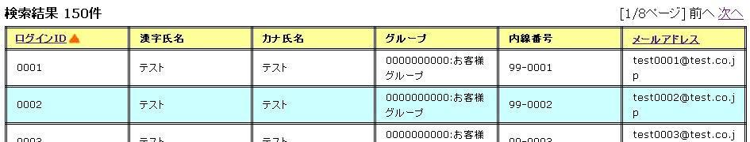
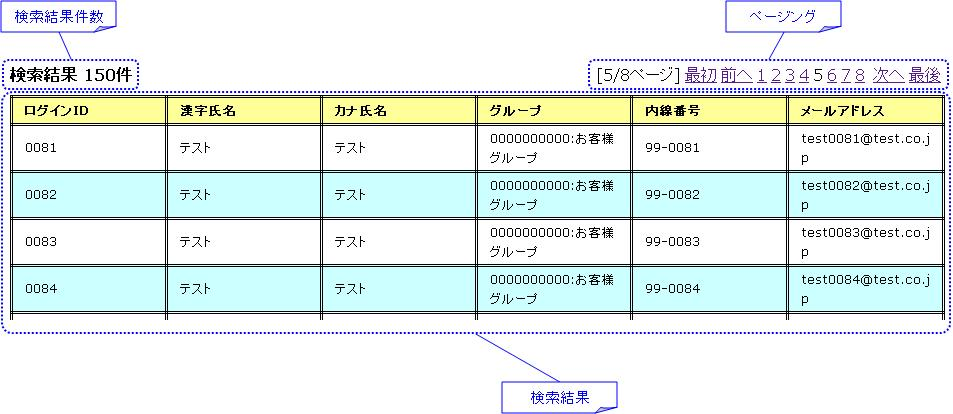
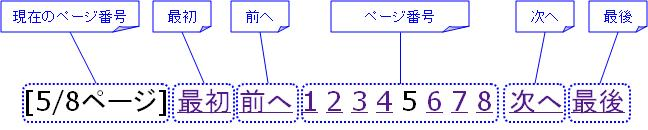
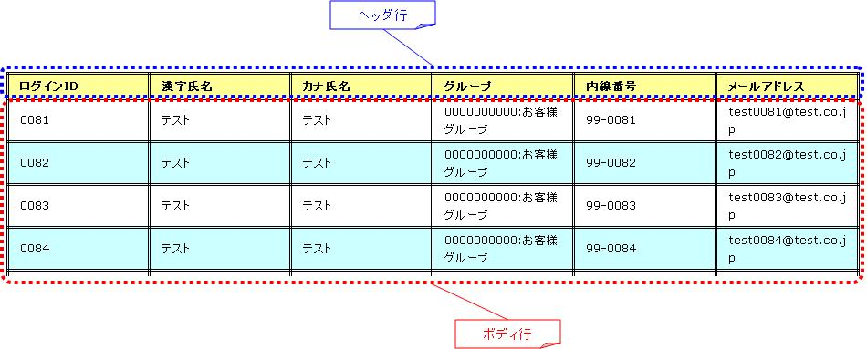
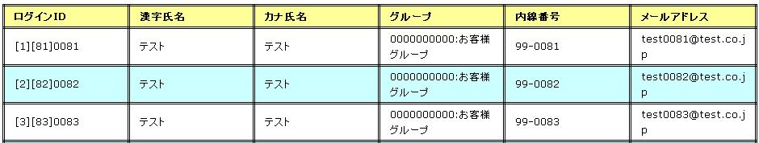
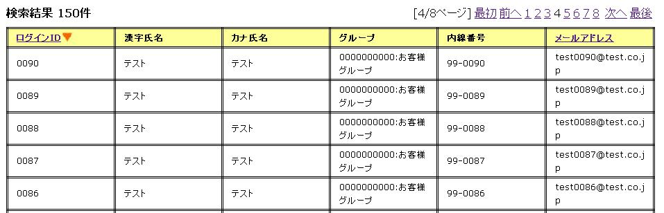
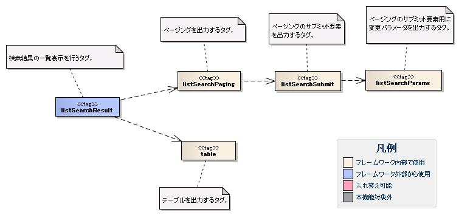
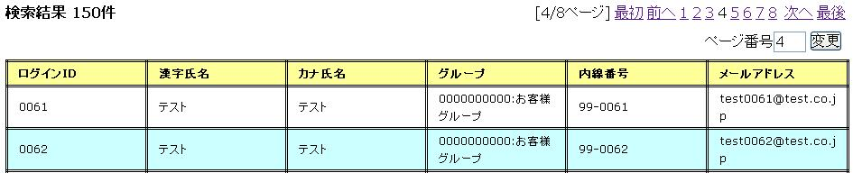

## 検索結果の一覧表示

検索結果の一覧表示では下記の機能を提供する。

* 検索結果件数の表示機能
* 1画面にすべての検索結果を表示する一覧表示機能
* 検索結果を指定件数毎に表示する機能(以降はページングと称す)
* 検索結果の並び替え機能

画面イメージを下記に示す。
この画面イメージでは、一覧の左上に検索結果件数、
一覧の右上にページング(現在のページ数、前のページ/次のページに移動するリンク)、
並び替え用の列見出しのリンク、1行毎に色分けされた一覧が表示されている。
検索結果の一覧表示では、これら全ての表示をサポートするカスタムタグ及びページング用の検索処理を簡易的に実装するためのクラスを提供する。



はじめに、検索結果の一覧表示の全体構造について解説する。
尚、検索結果の一覧表示機能のデフォルト値設定については、 [検索結果の一覧表示機能のデフォルト値設定](../../component/libraries/libraries-07-FacilitateTag.md#webview-listsearchresultsetting) を参照。

### 検索結果の一覧表示の全体構造

検索結果の一覧表示の全体構造を下記に示す。
全体構造には、フレームワークが提供するクラスやタグの位置付けを明示するため、
ユーザ検索を行う業務アプリケーションのクラスとJSPを含めている。


検索結果の一覧表示は、下記のクラスとタグにより実現される。

* 一覧検索用の検索処理を提供する [DbAccessSupportクラス](../../component/libraries/libraries-07-FacilitateTag.md#webview-listsearchresultdbaccesssupport)
* 一覧検索用の情報を保持する [ListSearchInfoクラス](../../component/libraries/libraries-07-FacilitateTag.md#webview-listsearchresultlistsearcinfo)
* 検索結果の一覧表示を行う [listSearchResultタグ](../../component/libraries/libraries-07-FacilitateTag.md#webview-listsearchresultlistsearchresulttag)

ページングを使用する場合、フレームワークが上記のタグとクラスによりページングに必要な処理を提供するため、
業務アプリケーションはページングを作り込みせずに実現できる。
次に、上記のクラスとタグについて解説する。
以降の解説では、ページングを使用する場合を想定して、ユーザ検索を行う業務アプリケーションのクラスやJSPを実装例に使用する。

### DbAccessSupportクラス

DbAccessSupportクラスは、データベースアクセス機能が提供するデータベースアクセス処理を簡易的に実装するためのサポートクラスである。
DbAccessSupportの詳細については、 [DbAccessSupportクラス](../../component/libraries/libraries-04-Statement.md#db-support-label) を参照。

DbAccessSupportは、一覧検索用の検索を実行するsearchメソッドを提供する。
searchメソッドは、SQL_IDとListSearchInfoを受け取り、下記の処理を行う。

* 指定されたSQL_IDとListSearchInfoから検索結果の件数取得を行う。
* 検索結果件数が上限を超えている場合は、TooManyResultExceptionを送出する。
* 検索結果件数が上限を超えていない場合は、検索を実行し検索結果を返す。検索結果件数は引数で指定されたListSearchInfoに設定される。

SQL_IDで指定するSQL文は、業務に必要な検索条件を基に検索を行うSQL文(つまりSELECT文)を指定する。
検索を行うSQL文を基にした検索結果の件数取得や検索結果の開始位置と取得件数を指定した検索の実行は、フレームワークで行う。

TooManyResultExceptionは、検索結果の最大件数(上限)と(実際の)検索結果の取得件数を保持する。
検索結果件数の上限設定については、 [検索結果の一覧表示機能のデフォルト値設定](../../component/libraries/libraries-07-FacilitateTag.md#webview-listsearchresultsetting) を参照。

searchメソッドを使用した検索処理の実装例を下記に示す。

```java
// 検索画面のアクション。
// searchメソッドを使用するためDbAccessSupportを継承する。
public class UserSearchAction extends DbAccessSupport {

    // 検索
    @OnError(type = ApplicationException.class, path = "/management/user/USER-001.jsp")
    public HttpResponse doUSERS00101(HttpRequest req, ExecutionContext ctx) {

        // 業務処理は省略。

        // 入力精査済みの検索条件の取得
        UserSearchCondition condition = ...;

        // 検索実行
        SqlResultSet searchResult = null;
        try {

            // ページング付きの検索処理。
            // "SELECT_USER_BY_CONDITION"は、ユーザ検索を行うSELECT文に対するSQL_ID。
            searchResult = search("SELECT_USER_BY_CONDITION", condition);

        } catch (TooManyResultException e) {

            // 検索結果件数が上限を超えた場合のエラー処理。
            // TooManyResultExceptionは、検索結果の最大件数(上限)、実際の検索結果件数を提供する。
            // "MSG00024"は「検索結果が上限件数({0}件)を超えました。」というメッセージに対するメッセージID。
            throw new ApplicationException(
                MessageUtil.createMessage(MessageLevel.ERROR, "MSG00024", e.getMaxResultCount()));
        }

        // 以降は省略。
    }
}
```

### ListSearchInfoクラス

ListSearchInfoクラスは、一覧検索用の情報を保持するクラスである。
業務アプリケーションで検索条件を保持するクラスは、ListSearchInfoを継承して作成する。

ListSearchInfoを継承するクラスでは、下記の実装が必要となる。

* ページング用の検索処理に必要な下記プロパティを他の検索条件と同様に入力精査に含める。

* pageNumber(取得対象のページ番号)

さらに、アクションでは、下記の実装が必要となる。

* 検索結果を表示する際は、ListSearchInfoを継承したクラスのオブジェクトをリクエストスコープに設定する。

ListSearchInfoを継承したクラス(UserSearchCondition)とアクション(UserSearchAction)の実装例を下記に示す。

```java
// ListSearchInfoを継承したクラス。
public class UserSearchCondition extends ListSearchInfo {

    // 検索条件のプロパティ定義は省略。

    // バリデーション機能に対応したコンストラクタ。
    public UserSearchCondition(Map<String, Object> params) {

       // 検索条件のプロパティ設定は省略。

       // ListSearchInfoのプロパティを設定する。
       setPageNumber((Integer) params.get("pageNumber"));
    }

    // オーバーライドして入力精査用のアノテーションを付加する。
    // 検索結果の最大件数(上限):200件、1ページの表示件数:20件の場合。
    @PropertyName("ページ番号")
    @Required
    @NumberRange(max = 10, min = 1)
    @Digits(integer = 2)
    public void setPageNumber(Integer pageNumber) {
        super.setPageNumber(pageNumber);
    }

    /** 精査対象プロパティ(検索条件のプロパティは省略) */
    private static final String[] SEARCH_COND_PROPS = new String[] { ..., "pageNumber"};

    // オーバーライドして検索条件のプロパティ名を返す。
    // 通常は精査対象プロパティと同じとなる。
    // ページングの各サブミット要素(前へや次へなど)が検索条件をサブミットする際に使用する。
    public String[] getSearchConditionProps() {
        return SEARCH_COND_PROPS;
    }
}
```

```java
// 検索画面のアクション。
public class UserSearchAction extends DbAccessSupport {

    // 初期表示
    public HttpResponse doMENUS00102(HttpRequest req, ExecutionContext ctx) {
        // 初期表示は、業務処理のみのため省略。
    }

    // 検索
    @OnError(type = ApplicationException.class, path = "/management/user/USER-001.jsp")
    public HttpResponse doUSERS00101(HttpRequest req, ExecutionContext ctx) {

        // 業務処理は省略。

        // 入力精査
        ValidationContext<UserSearchCondition> searchConditionCtx = ...;
        if (!searchConditionCtx.isValid()) {
            throw new ApplicationException(searchConditionCtx.getMessages());
        }
        UserSearchCondition condition = searchConditionCtx.createObject();

        // ListSearchInfoを継承したクラス(UserSearchCondition)をリクエストスコープに設定する。
        ctx.setRequestScopedVar("searchCondition", condition);

        // 検索実行
        SqlResultSet searchResult = null;
        try {
            searchResult = search("SELECT_USER_BY_CONDITION", condition);
        } catch (TooManyResultException e) {
            throw new ApplicationException(
                MessageUtil.createMessage(MessageLevel.ERROR, "MSG00024", e.getMaxResultCount()));
        }

        // 検索結果をリクエストスコープに設定
        ctx.setRequestScopedVar("searchResult", searchResult);

        return new HttpResponse("/management/user/USER-001.jsp");
    }
}
```

### listSearchResultタグ

[listSearchResultタグ](../../component/libraries/libraries-07-TagReference.md#webview-listsearchresulttag) は、検索結果のリスト表示を行うタグである。
listSearchResultタグで出力する画面要素を下記に示す。



> **Note:**
> 以下の解説では [listSearchResultタグ](../../component/libraries/libraries-07-TagReference.md#webview-listsearchresulttag) の設定項目のうち、
> 主要なものについてのみ解説している。
> しかし、検索結果の表示は各プロジェクトごとに大きく異なるため、
> 以下で解説する範囲では要求を満たせない場合もある。
> その場合は、以下のいずれかの対応を行うこと。

> 1. >   [listSearchResultタグ](../../component/libraries/libraries-07-FacilitateTag.md#webview-listsearchresultlistsearchresulttag) には一覧内の各UI要素のカスタマイズ等を行うためのオプションが
>   多く定義されており、これらを設定することで表示や挙動を変更することができる。

>   listSearchResultタグで指定できる全ての属性については、 [listSearchResultタグ](../../component/libraries/libraries-07-TagReference.md#webview-listsearchresulttag) を参照すること。
> 2. >   オプション設定では要件を実現できない場合は、各タグファイルを直接カスタマイズする必要がある。

>   タグファイルのカスタマイズ方法については、 [検索結果の一覧表示機能の画面表示のカスタマイズ方法](../../component/libraries/libraries-07-FacilitateTag.md#webview-listsearchresultcustomize) を参照すること。

#### listSearchResultタグの主要な属性

listSearchResultタグの主要な属性を下記に示す。

resultSetName属性で指定された検索結果がリクエストスコープに存在しない場合、listSearchResultタグは何も出力しない。
検索画面の初期表示が何も出力されないケースに該当する。

| 属性 | 説明 |
|---|---|
| 全体 |  |
| listSearchInfoName | ListSearchInfoをリクエストスコープから取得する際に使用する名前。 指定がない場合は「検索結果件数」および「ページング」を表示しない。 一括削除確認画面など、一覧表示のみを行う場合は指定しない。 |
| 検索結果件数 |  |
| useResultCount | 検索結果件数を表示するか否か。 デフォルトはtrue。 |
| ページング |  |
| usePaging | ページングを表示するか否か。 デフォルトはtrue。 |
| searchUri | ページングのサブミット要素に使用するURI。 ページングを表示する場合は必ず指定すること。 |
| 検索結果 |  |
| resultSetName(必須) | 検索結果をリクエストスコープから取得する際に使用する名前。 |
| headerRowFragment(必須) | ヘッダ行のJSPフラグメント。ヘッダ行については、 [検索結果](../../component/libraries/libraries-07-FacilitateTag.md#webview-listsearchresulttableelement) を参照。 |
| bodyRowFragment(必須) | ボディ行のJSPフラグメント。ボディ行については、 [検索結果](../../component/libraries/libraries-07-FacilitateTag.md#webview-listsearchresulttableelement) を参照。 |

#### 検索結果件数

検索結果件数は、useResultCount属性にtrue(デフォルトはtrue)が指定され、検索結果がリクエストスコープに存在する場合に表示される。
検索結果件数は、デフォルトでは下記の書式で出力される。

```jsp
検索結果 <%-- ListSearchInfoのresultCountプロパティ --%>件
```

デフォルトの書式を変更したい場合は、resultCountFragment属性にJSPフラグメントを指定する。
resultCountFragment属性の指定例を下記に示す。
JSPフラグメントは、カスタムタグから呼び出されて評価されるため、listSearchInfoName属性で指定した名前を使用して
ListSearchInfoオブジェクトにアクセスすることが可能となる。

```jsp
<n:listSearchResult listSearchInfoName="searchCondition"
                    searchUri="./USERS00101"
                    resultSetName="searchResult">

    <%-- resultCountFragment属性にJSPフラグメントを指定する。 --%>
    <jsp:attribute name="resultCountFragment">
       [サーチ結果 <n:write name="searchCondition.resultCount" />頁]
    </jsp:attribute>

    <%-- その他の属性は省略。 --%>

</n:listSearchResult>
```

上記指定後の検索結果件数の書式を下記に示す。

```jsp
[サーチ結果 <%-- ListSearchInfoのresultCountプロパティ --%>頁]
```

#### ページング

ページングは、usePaging属性にtrue(デフォルトはtrue)が指定された場合に表示される。
ページングの画面要素を下記に示す。
ページングは、現在のページ番号とページを移動するためのサブミット要素から構成される。



ページング全体は、検索結果件数が1件以上の場合に表示される。
ページング全体が表示される前提で、ページングの画面要素の表示について下記に示す。

| ページングの画面要素 | 説明 |
|---|---|
| 現在のページ番号 | 現在のページ番号は常に表示される。 |
| 最初、前へ、次へ、最後 | 現在のページ番号から各画面要素が示すページに遷移可能な場合は、サブミット可能な状態で表示される。 遷移不可の場合は、リンクであればラベル、ボタンであれば使用不可な状態で表示される。 |
| ページ番号 | ページ番号全体(1..n)は、総ページ数が2以上の場合のみ表示される。 各ページ番号は、上記の「最初」や「前へ」と同様に、遷移可否に応じて表示される。 |

ページングの画面要素で指定可能な属性のうち、代表的なものを下記に示す。
全ての属性の詳細については、 [listSearchResultタグ](../../component/libraries/libraries-07-TagReference.md#webview-listsearchresulttag) を参照。

* 各画面要素の使用有無
* 各画面要素のラベル(最初、前へ、次へ、最後など)

* 現在のページ番号はJSPフラグメントによる変更
* ページ番号はページ番号をラベルに使用するため変更不可

* 各サブミット要素に使用するタグ(n:submitLink、n:submit、n:buttonのいずれか)

ページング時の検索条件は、前回検索時の条件（現在表示されている検索結果を取得した時の条件）を使用する。
つまり、検索条件を変更してからページングを行った場合には、変更した検索条件の値は破棄されることを意味する。

検索条件の維持は、フレームワークがページングのサブミット要素に検索条件を変更パラメータとして設定することで実現する。
変更パラメータに指定する検索条件は、 [ListSearchInfoクラス](../../component/libraries/libraries-07-FacilitateTag.md#webview-listsearchresultlistsearcinfo) のgetSearchConditionPropsメソッドが返すプロパティ名を使用して、
ListSearchInfoから取得する。

**ページング使用時に検索結果が減少した場合の動作**

ここでは、ページングの各サブミット要素で検索結果ページを切り替えてる最中に、他のユーザオペレーションなどにより、
検索結果が減少した場合の動作について解説する。

本フレームワークでは、指定されたページ番号に基づき検索を実施し、ページングの各画面要素の表示を行う。
下記に検索結果が減少した場合のページングの動作例を示す。

前提として、検索結果の取得件数(1ページの表示件数)は20件とする。

まず、検索を実行し検索結果が100件であったとする。下記は3ページ目を選択した後のページングの表示である。


次に2ページ目(又は前へ)を選択した後、かつ検索結果が10件に減少した場合のページングの表示と表示内容の説明を示す。
2ページ目に対する検索結果としてページングの各画面要素が表示される。


| ページングの画面要素 | 表示内容の説明 |
|---|---|
| 現在のページ番号 | 2ページ目が指定され、検索結果が20件以下のため、2/1ページとなる。 |
| 最初、前へ | 現在2ページ目で検索結果が10件のため、前のページに遷移可能となりリンクで表示される。 |
| 次へ、最後 | 現在2ページ目で検索結果が10件のため、次のページに遷移不可となりラベルで表示される。 |
| ページ番号 | 検索結果が10件で総ページ数が1のため、ページ番号は表示されない。 |

現在のページ番号とサブミット要素の対応が取れているため、操作不能な状態にならず、
サブミット要素を選択することで検索結果のページに遷移することが可能である。
(もちろん検索フォームから検索しなおせば、1ページ目からの検索結果となる)

次に「前へ」を選択した後のページングの表示を示す。現在のページ番号と総ページ数の対応が正常な状態に戻る。


#### 検索結果

検索結果の画面要素を下記に示す。
検索結果は、列見出しを表示するヘッダ行と、行データを表示するボディ行から構成される。



検索結果は、検索結果がリクエストスコープに存在する場合は常に表示される。
検索結果が0件の場合は、ヘッダ行のみ表示される。

ヘッダ行とボディ行は、それぞれheaderRowFragment属性、bodyRowFragment属性にJSPフラグメントで指定する。
ボディ行のJSPフラグメントは、検索結果のループ内(JSTLのc:forEachタグ)で呼び出され評価される。
このため、ボディ行のJSPフラグメントで行データ(c:forEachタグのvar属性)とステータス(c:forEachタグのstatus属性)にアクセスするために、
下記の属性を設けている。

| 属性 | 説明 |
|---|---|
| varRowName | ボディ行のフラグメントで行データ(c:forEachタグのvar属性)を参照する際に使用する変数名。 デフォルトは"row"。 |
| varStatusName | ボディ行のフラグメントでステータス(c:forEachタグのstatus属性)を参照する際に使用する変数名。 デフォルトは"status"。  > **Note:** > n:writeタグを使用してステータスにアクセスすると、n:writeタグとEL式でアクセス方法が異なるために > エラーが発生し値を取得できない。 > n:setタグを使用してステータスにアクセスすることで、このエラーを回避できる。 > 下記に使用例を示す。  > ```jsp > <n:set var="rowCount" value="${status.count}" /> > <n:write name="rowCount" /> > ``` |
| varCountName | ステータス(c:forEachタグのstatus属性)のcountプロパティを参照する際に使用する変数名。 デフォルトは"count"。 |
| varRowCountName | 検索結果のカウント(検索結果の取得開始位置＋ステータスのカウント)を参照する際に使用する変数名。 デフォルトは"rowCount"。 |

さらに、ボディ行では、1行おきに背景色を変えたい場合に対応するために、ボディ行のclass属性を指定する下記の属性を設けている。

| 属性 | 説明 |
|---|---|
| varOddEvenName | ボディ行のclass属性を参照する際に使用する変数名。 この変数名は、1行おきにclass属性の値を変更したい場合に使用する。 デフォルトは"oddEvenCss"。 |
| oddValue | ボディ行の奇数行に使用するclass属性。 デフォルトは"nablarch_odd"。 |
| evenValue | ボディ行の偶数行に使用するclass属性。 デフォルトは"nablarch_even"。 |

ユーザ検索の指定例を下記に示す。

```jsp
<n:listSearchResult listSearchInfoName="searchCondition"
                    searchUri="./USERS00101"
                    resultSetName="searchResult">

    <%-- ヘッダ行のJSPフラグメント指定。 --%>
    <jsp:attribute name="headerRowFragment">
        <tr>
            <th>ログインID</th>
            <th>漢字氏名</th>
            <th>カナ氏名</th>
            <th>グループ</th>
            <th>内線番号</th>
            <th>メールアドレス</th>
        </tr>
    </jsp:attribute>

    <%-- ボディ行のJSPフラグメント指定。 --%>
    <jsp:attribute name="bodyRowFragment">

        <%-- デフォルトの変数名"oddEvenCss"を使用してclass属性にアクセスする。 --%>
        <tr class="<n:write name="oddEvenCss" />">

            <%-- デフォルトの変数名"row"を使用して行データにアクセスする。 --%>
            <td>[<n:write name="count" />][<n:write name="rowCount" />]<n:write name="row.loginId" /></td>
            <td><n:write name="row.kanjiName" /></td>
            <td><n:write name="row.kanaName" /></td>
            <td><n:write name="row.ugroupId" />:<n:write name="row.ugroupName" /></td>
            <td><n:write name="row.extensionNumberBuilding" />-<n:write name="row.extensionNumberPersonal" /></td>
            <td><n:write name="row.mailAddress" /></td>

        </tr>
    </jsp:attribute>
</n:listSearchResult>
```

上記指定後の検索結果を下記に示す。



### 検索結果の並び替え

検索結果の一覧表示では、列見出しを選択することで選択された列データによる並び替えを行いたい場合がある。
検索結果の並び替えは、並び替え用の列見出しを出力する [listSearchSortSubmitタグ](../../component/libraries/libraries-07-TagReference.md#webview-listsearchsortsubmittag) と、
データベースアクセス機能が提供する可変ORDER BY構文(ORDER BY句を動的に変更する構文)を使用した検索処理により実現する。
可変ORDER BY構文の詳細については、 VariableOrderBySyntaxConvertorクラス を参照。

ユーザ検索に並び替えを適用した場合の画面イメージを下記に示す。
ユーザ検索では、ログインIDとメールアドレスによる並び替えを提供している。



ここでは、ユーザ検索に並び替えを適用する場合の実装例を使用して解説を行う。

#### 検索処理の実装方法

検索結果の並び替えを行うには、可変ORDER BY構文を使用してSQL文を定義する。
可変ORDER BY構文を使用したSQL文の例を下記に示す。

下記のSQL文では、ログインIDとメールアドレスを並び替えるための可変ORDER BY句を使用している。
どのORDER BYを使用するかは、$sort (sortId)の記述により、検索条件オブジェクトのsortIdフィールドから取得した値が使用される。
例えば、検索条件オブジェクトのsortIdフィールドが3の場合、ORDER BY句は"ORDER BY USR.MAIL_ADDRESS"に変換される。

```sql
-- 可変ORDER BY構文を使用したSQL文
SELECT
  -- 省略
FROM
    -- 省略
WHERE
    -- 省略
$sort (sortId) {
   (1 SA.LOGIN_ID)
   (2 SA.LOGIN_ID DESC)
   (3 USR.MAIL_ADDRESS)
   (4 USR.MAIL_ADDRESS DESC) }
```

ListSearchInfoクラスは、並び替えに対応するためにsortIdプロパティを定義している。
検索結果の並び替えを行う場合は、sortIdプロパティを入力精査に含める。
ListSearchInfoを継承したクラス(UserSearchCondition)の実装例を下記に示す。

```java
// ListSearchInfoを継承したクラス。
public class UserSearchCondition extends ListSearchInfo {

    // 検索条件のプロパティ定義は省略。

    // バリデーション機能に対応したコンストラクタ。
    public UserSearchCondition(Map<String, Object> params) {

       // 検索条件のプロパティ設定は省略。

       // ListSearchInfoのsortIdプロパティを設定する。
       setSortId((String) params.get("sortId"));
    }

    // オーバーライドして入力精査用のアノテーションを付加する。
    @PropertyName("ソートID")
    @Required
    public void setSortId(String sortId) {
        super.setSortId(sortId);
    }

    /** 精査対象プロパティ(検索条件のプロパティは省略) */
    private static final String[] SEARCH_COND_PROPS = new String[] { ..., "sortId"};

    // オーバーライドして検索条件のプロパティ名を返す。
    // 通常は精査対象プロパティと同じとなる。
    // ページングの各サブミット要素が検索条件をサブミットする際に使用する。
    public String[] getSearchConditionProps() {
        return SEARCH_COND_PROPS;
    }
}
```

#### listSearchSortSubmitタグ

listSearchSortSubmitタグは、並び替え用のサブミット要素を出力する。

listSearchSortSubmitタグの必須属性及び代表的な属性を下記に示す。
listSearchSortSubmitタグで指定できる全ての属性については、 [listSearchSortSubmitタグ](../../component/libraries/libraries-07-TagReference.md#webview-listsearchsortsubmittag) を参照。

| 属性 | 説明 |
|---|---|
| sortCss | 並び替えを行うサブミットのclass属性。 常にサブミットのclass属性に出力される。 デフォルトは"nablarch_sort"。 |
| ascCss | 昇順に並び替えた場合に指定するサブミットのclass属性。 sortCss属性に付加するかたちで出力される。 デフォルトは"nablarch_asc"。(出力例: class="nablarch_sort nablarch_asc") |
| descCss | 降順に並び替えた場合に指定するサブミットのclass属性。 sortCss属性に付加するかたちで出力される。 デフォルトは"nablarch_desc"。(出力例: class="nablarch_sort nablarch_desc") |
| ascSortId(必須) | 昇順に並び替える場合のソートID。 |
| descSortId(必須) | 降順に並び替える場合のソートID。 |
| defaultSort | デフォルトのソートID。 下記のいずれかを指定する。 asc(昇順) desc(降順) デフォルトは"asc"。 |
| label(必須) | 並び替えを行うサブミットに使用するラベル。 |
| name(必須) | 並び替えを行うサブミットに使用するタグのname属性。 name属性は、画面内で一意にすること。 |
| listSearchInfoName(必須) | ListSearchInfoをリクエストスコープから取得する際に使用する名前。 |

listSearchSortSubmitタグを使用したJSPの実装例を下記に示す。

```jsp
<n:listSearchResult listSearchInfoName="searchCondition"
                    searchUri="./USERS00101"
                    resultSetName="searchResult"
                    usePageNumberSubmit="true"
                    useLastSubmit="true">
    <jsp:attribute name="headerRowFragment">
        <tr>
            <th>
                <%-- ログインIDを並び替え用のリンクにする。--%>
                <%-- SQL文に合わせて昇順(1)と降順(2)のソートIDを指定する。 --%>
                <n:listSearchSortSubmit ascSortId="1" descSortId="2"
                                        label="ログインID" uri="./USERS00101"
                                        name="loginIdSort" listSearchInfoName="searchCondition" />
            </th>
            <th>漢字氏名</th>
            <th>カナ氏名</th>
            <th>グループ</th>
            <th>内線番号</th>
            <th>
                <%-- メールアドレスを並び替え用のリンクにする。--%>
                <%-- SQL文に合わせて昇順(3)と降順(4)のソートIDを指定する。 --%>
                <n:listSearchSortSubmit ascSortId="3" descSortId="4"
                                        label="メールアドレス" uri="./USERS00101"
                                        name="kanaNameSort" listSearchInfoName="searchCondition" />
            </th>
        </tr>
    </jsp:attribute>
    <jsp:attribute name="bodyRowFragment">
        <%-- 省略 --%>
    </jsp:attribute>
</n:listSearchResult>
```

並び替えのサブミット要素では、検索フォームから検索された時点の検索条件を使用して検索を実行する。
検索条件の維持は、フレームワークが並び替えのサブミット要素に検索条件を変更パラメータとして設定することで実現する。
変更パラメータに指定する検索条件は、 ListSearchInfoクラス のgetSearchConditionPropsメソッドが返すプロパティ名を使用して、
ListSearchInfoから取得する。

並び替えのサブミット要素では、常に先頭ページ(ページ番号:1)を検索する。
並び替えが変更された場合、検索前のページ番号は異なる並び順に対する相対位置となり、
検索後に意味のあるページ位置とならないためである。

**現在の並び替え状態に応じたlistSearchSortSubmitタグの動作**

listSearchSortSubmitタグは、現在の並び替え状態に応じて下記の値を決定する。
現在の並び替え状態は、検索に使用されたソートIDとなる。

* サブミット要素が選択された場合にリスエスト送信するソートID
* 昇順又は降順に応じてサブミット要素に指定するCSSクラス

ここでは、下記の実装例を前提に、listSearchSortSubmitタグの動作を解説する。

```jsp
<%-- ログインIDを並び替え用のリンクにする。--%>
<%-- SQL文に合わせて昇順(1)と降順(2)のソートIDを指定する。 --%>
<n:listSearchSortSubmit ascSortId="1" descSortId="2"
                        label="ログインID" uri="./USERS00101"
                        name="loginIdSort" listSearchInfoName="searchCondition" />
```

| 検索に使用されたソートID | リクエスト送信するソートID | 使用されるCSSクラス |
|---|---|---|
| 1 | ascSortId属性(=1)と等しいため、descSortId属性の値(=2)を使用する。 | ascSortId属性(=1)と等しいため、ascCss属性の値(nablarch_asc)を使用する。 |
| 2 | descSortId属性(=2)と等しいため、ascSortId属性の値(=1)を使用する。 | descSortId属性(=2)と等しいため、descCss属性の値(nablarch_desc)を使用する。 |
| 3 | ascSortId属性(=1)及びdescSortId属性(=2)に等しくないため、 defaultSortId属性の値(=asc)に応じて、ascSortId属性の値(=1)を使用する。 | ascSortId属性(=1)及びdescSortId属性(=2)に等しくないため、指定する値はなし。 |

**昇順又は降順に応じたCSSの実装例**

画面イメージのように、並び替え用のリンクに対して、昇順又は降順を明示するイメージを表示したい場合は、
CSSにより実現する。CSSの実装例を下記に示す。
CSSファイルから参照できる位置にイメージファイルが配置されているものとし、CSSクラス名はデフォルトの名前で定義している。

```css
/*
 * sortCss属性に対する設定。
 * sortCss属性のCSSクラス名は常に出力される。
 */
a.nablarch_sort {
    padding-right: 15px;
    background-position: 100% 0%;
    background-repeat: no-repeat;
}

/*
 * ascCss属性に対する設定。
 * ascCss属性のCSSクラス名はサブミット要素が選択され、かつ昇順の場合のみ出力される。
 */
a.nablarch_asc {
    background-image: url("../img/asc.jpg");
}

/*
 * descCss属性に対する設定。
 * descCss属性のCSSクラス名はサブミット要素が選択され、かつ降順の場合のみ出力される。
 */
a.nablarch_desc {
    background-image: url("../img/desc.jpg");
}
```

### 1画面にすべての検索結果を一覧表示する場合の実装方法

これまではページングを使用することを前提に解説してきたが、ここでは、1画面にすべての検索結果を一覧表示する場合の実装方法について解説する。

1画面にすべての検索結果を一覧表示する場合、基本的な実装方法はページングを使用する場合と変わらない。
また、検索処理や並び替えの処理もページングを使用する場合と同じ実装方法となる。

以下に実装方法を解説する。
ページングを使用する場合と同じ、ユーザ検索を行う業務アプリケーションのクラスやJSPを実装例に使用する。

**ListSearchInfoを継承するクラス(UserSearchCondition)の実装例**

```java
// ListSearchInfoを継承したクラス。
public class UserSearchCondition extends ListSearchInfo {

    // 検索条件のプロパティ定義は省略。

    // バリデーション機能に対応したコンストラクタ。
    public UserSearchCondition(Map<String, Object> params) {

       // 検索条件のプロパティ設定は省略。

       // ページングを使用する場合と異なり、ListSearchInfoのpageNumberプロパティの設定は不要。
       // pageNumberプロパティの初期値は1のため常に1ページ目となる。

    }

    /** 精査対象プロパティ(検索条件のプロパティのみとなる) */
    private static final String[] SEARCH_COND_PROPS = new String[] { ... };

    // オーバーライドして検索条件のプロパティ名を返す。
    // 通常は精査対象プロパティと同じとなる。
    // 並び替えの各サブミット要素が検索条件をサブミットする際に使用する。
    public String[] getSearchConditionProps() {
        return SEARCH_COND_PROPS;
    }
}
```

**JSP(ユーザ検索)への遷移を行うActionクラス**

```java
public class UserSearchAction extends DbAccessSupport {

    @OnError(type = ApplicationException.class, path = "/ss11AC/W11AC0101.jsp")
    public HttpResponse doUSERS00101(HttpRequest req, ExecutionContext ctx) {

        // 業務処理は省略。
        // 入力精査省略

        // ListSearchInfo継承クラスを作成。
        UserSearchCondition condition = searchConditionCtx.createObject();

        // 検索結果の取得件数(1ページの表示件数)に検索結果の最大件数(上限)を設定する。
        // ページングを使用しないため下記の設定が必須となる。
        condition.setMax(condition.getMaxResultCount());

        // 検索処理省略

    }
}
```

**JSP(ユーザ検索)の実装例**

```jsp
<%-- ページングを使用しないのでusePaging属性にfalseを指定する。 --%>
<%-- ページングを使用しないのでsearchUri属性の指定は不要。 --%>
<n:listSearchResult listSearchInfoName="searchCondition"
                    usePaging="false"
                    resultSetName="searchResult">

    <%-- その他の属性は省略。 --%>

</n:listSearchResult>
```

### 検索結果の一覧表示機能のデフォルト値設定

検索結果の一覧表示機能のデフォルト値設定は、画面表示に関する設定と、一覧検索用の検索処理に関する設定に大別される。

画面表示に関する設定は、 [カスタムタグのデフォルト値の設定](../../component/libraries/libraries-07-HowToSettingCustomTag.md#webview-customtagconfig) に指定する。
画面表示に関する設定の詳細は、 [カスタムタグのデフォルト値の設定](../../component/libraries/libraries-07-HowToSettingCustomTag.md#webview-customtagconfig) を参照。

ここでは、一覧検索用の検索処理に関する設定について解説する。

検索処理の設定では、下記の設定を行える。

* 検索結果の最大件数(上限)
* 検索結果の取得件数(1ページの表示件数)

これらの設定値は、リポジトリ機能の [環境設定ファイル](../../component/libraries/libraries-02-01-Repository-config.md#repository-config-load) に指定する。
property名と設定内容を下記に示す。

| property名 | 設定内容 |
|---|---|
| nablarch.listSearch.maxResultCount | 検索結果の最大件数(上限)。 |
| nablarch.listSearch.max | 検索結果の取得最大件数(1ページの表示件数)。 |

上記の設定値は、ListSearchInfoの生成時にリポジトリから取得し、ListSearchInfo自身のプロパティに設定される。
リポジトリの設定値が存在しない場合は、下記のデフォルト値が設定される。

* 検索結果の最大件数(上限)：200
* 検索結果の取得最大件数(1ページの表示件数)：20

尚、一部機能のみ個別に設定値を変更したい場合は、下記の通り個別機能の実装で対応する。

* 画面表示に関する設定は、JSP上で [listSearchResultタグ](../../component/libraries/libraries-07-TagReference.md#webview-listsearchresulttag) の属性を指定する。
* ページング用の検索処理に関する設定は、該当の一覧表示画面を表示するActionのメソッドにて、ListSearchInfoを継承したクラスに値を設定する。

下記に検索結果の最大件数(上限)を50、表示件数を10に変更する場合の実装例を下記に示す。

```java
public class UserSearchAction extends DbAccessSupport {

    // 一覧表示の最大表示件数
    private static final int MAX_ROWS = 10;

    // 一覧表示の検索結果件数（上限）
    private static final int MAX_RESULT_COUNT = 50;

    @OnError(type = ApplicationException.class, path = "/ss11AC/W11AC0101.jsp")
    public HttpResponse doUSERS00101(HttpRequest req, ExecutionContext ctx) {

        // 業務処理は省略。

        // 入力精査は省略。

        UserSearchCondition condition = ... ;

        // 最大表示件数を設定。
        condition.setMax(MAX_ROWS);

        // 検索結果の最大件数（上限）を設定。
        condition.setMaxResultCount(MAX_RESULT_COUNT);

        // 検索処理は省略。

        // 以降の処理は省略。
    }
}
```

### 検索結果の一覧表示機能の画面表示のカスタマイズ方法

検索結果の一覧表示機能は、プロジェクト毎に画面表示の内容を容易にカスタマイズできるようにタグファイルで作成している。
検索結果の一覧表示機能の画面表示のカスタマイズは、フレームワークで提供するタグファイルを業務アプリケーションに配置し、
直接タグファイルを編集することで行う。

検索結果の一覧表示機能で使用しているタグファイルの構成を下記に示す。

| タグファイル | 内容 |
|---|---|
| /META-INF/tags/listSearchResult.tag | 検索結果のリスト表示を行うタグ。 |
| /META-INF/tags/listSearchPaging.tag | 検索結果のリストのページング部分を出力するタグ。 |
| /META-INF/tags/listSearchSortSubmit.tag | 検索結果のリスト表示のソート用のリンクを出力するタグ。 |
| /META-INF/tags/listSearchSubmit.tag | 検索結果の各ページ間を移動するためのリンクを出力するタグ。 |
| /META-INF/tags/listSearchParams.tag | 検索結果の各ページ間を移動するためのリンクに対して、初回検索時点の 検索条件を保持する **<n:param>** タグを出力する。 (検索結果のページを移動する際に、検索条件フィールドを変更しても 表示上の不整合を起こさないようにするために **listSearchSubmit.tag** などで使用されている。) |
| /META-INF/tags/table.tag | 検索結果を表示するテーブルを出力するタグ。 |



ここでは、ページ番号のテキスト入力を追加することを想定し、カスタマイズ方法を解説する。
カスタマイズ後の画面イメージを下記に示す。



まず、フレームワークで提供するタグファイルを業務アプリケーションの/WEB-INF/tagsディレクトリに配置する。
今回は、ページング(次へ、前へなど)を出力するlistSearchPaging.tagファイルにページ番号のテキスト入力を追加する。
下記2ファイルを業務アプリケーションの/WEB-INF/tagsディレクトリにコピーする。

```bash
# フレームワークのコピー元ファイル
/META-INF/tags/listSearchResult.tag
/META-INF/tags/listSearchPaging.tag
```

次に、ページ番号のテキスト入力を追加するためにlistSearchPaging.tagファイルを編集する。
下記に実装例を示す。

```jsp
<%-- ページ番号(テキスト入力) 。「最後」サブミットの後ろに追加する。--%>
<c:if test="${usePageNumberSubmit && listSearchInfo.pageCount != 1}">
    <br />
    <div style="float: right;">

        <%-- ページ番号のテキスト入力の追加。 --%>
        <div>ページ番号<n:text name="${listSearchInfoName}.pageNumber" style="width: 2em;" /></div>

        <%-- テキスト入力されたページ番号のページに遷移するためのサブミットボタン。 --%>
        <n:listSearchSubmit tag="submit"
                            type="button"
                            css="${pageNumberSubmitCss}"
                            label="変更"
                            enable="true"
                            uri="${searchUri}"
                            name="manualPageNumberSubmit"
                            pageNumber=""
                            listSearchInfoName="${listSearchInfoName}" />
    </div>
</c:if>
```

次に、業務アプリケーションに配置したlistSearchPaging.tagを使用するように、listSearchResult.tagを編集する。
下記に実装例を示す。

```jsp
<%-- 業務アプリケーションに配置したタグファイルを使用するためのディレクティブ。 --%>
<%@ taglib prefix="tags" tagdir="/WEB-INF/tags" %>

<%-- n:listSearchPagingとなっている部分をtags:listSearchPagingに変更する。 --%>
<tags:listSearchPaging ...(省略)...>

    <%-- 省略 --%>

</tags:listSearchPaging>
```

検索画面のJSPも、listSearchResult.tagと同様に、業務アプリケーションに配置したlistSearchResult.tagを使用するように変更する。

```jsp
<%-- 業務アプリケーションに配置したタグファイルを使用するためのディレクティブ。 --%>
<%@ taglib prefix="tags" tagdir="/WEB-INF/tags" %>

<%-- n:listSearchResultとなっている部分をtags:listSearchResultに変更する。 --%>
<tags:listSearchResult ...(省略)...>

    <%-- 省略 --%>

</tags:listSearchResult>
```

## 入力画面と確認画面の共通化をサポートするカスタムタグ

入力画面と確認画面が1対1に対応する画面であれば、入力画面と確認画面を共通化することで、確認画面のJSPを作成する工数を削減することができる。
マスタメンテナンス画面など、複雑な操作が要求されない画面を大量に、短期間で作成する場合は、この機能が活躍する。

実装の共通化は、入力画面のJSPにおいて行い、確認画面のJSPは入力画面のJSPにフォワードだけを行う。
アクションは、入力画面と確認画面でそれぞれ別々のJSPにフォワードしておき、
仕様変更に伴い入力画面と確認画面を別々に作成する必要が発生した場合にもアクションへの影響を抑える。

確認画面のJSPは、 [confirmationPageタグ](../../component/libraries/libraries-07-TagReference.md#webview-confirmationpagetag) を使用してフォワードを行う。
確認画面の実装例を示す。
入力画面と確認画面のJSPは同じ場所に配置することが多いので、実装例のように相対パスで指定できる。

```jsp
<%-- USER003.jspは入力画面のJSPとする。 --%>
<n:confirmationPage path="./USER003.jsp" />
```

入力項目のカスタムタグでは、入力項目と入力項目に対応する確認画面用の出力機能を提供しているので、
入力画面と確認画面で表示を切り替える機能を提供する。

### 入力画面と確認画面の表示切り替え

入力画面と確認画面の表示切り替えには、入力画面と確認画面のそれぞれにおいてのみボディを評価する下記タグを使用する。

| カスタムタグ | 出力するHTMLタグ |
|---|---|
| [forInputPageタグ](../../component/libraries/libraries-07-TagReference.md#webview-forinputpagetag) | 入力画面のみボディを評価する。 |
| [forConfirmationPageタグ](../../component/libraries/libraries-07-TagReference.md#webview-forconfirmationpagetag) | 確認画面のみボディを評価する。 |

#### パスワードの使用例

パスワードの例を下記に示す。
入力画面では確認用の入力があるため2つの入力項目を表示するが、確認画面では一方だけ出力する。


```jsp
<n:password name="systemAccount.newPassword" size="22" maxlength="20" />
<n:forInputPage>
  <br/>
  <n:password name="systemAccount.confirmPassword" size="22" maxlength="20" /><span class="dinstruct">(確認用)</span>
</n:forInputPage>
```

#### 携帯電話番号の使用例

携帯電話番号の例を下記に示す。
携帯電話番号は入力項目がハイフンで連結されており、全て入力するかしないかの2択である。
確認画面では入力されていない場合にハイフンを表示させないように制御する。


```jsp
<n:forInputPage>
    <n:text name="users.mobilePhoneNumberAreaCode" size="5" maxlength="3" />&nbsp;-&nbsp;
    <n:text name="users.mobilePhoneNumberCityCode" size="6" maxlength="4" />&nbsp;-&nbsp;
    <n:text name="users.mobilePhoneNumberSbscrCode" size="6" maxlength="4" />
</n:forInputPage>
<n:forConfirmationPage>
  <c:if test="${users.mobilePhoneNumberAreaCode != ''}">
    <n:text name="users.mobilePhoneNumberAreaCode" size="5" maxlength="3" />&nbsp;-&nbsp;
    <n:text name="users.mobilePhoneNumberCityCode" size="6" maxlength="4" />&nbsp;-&nbsp;
    <n:text name="users.mobilePhoneNumberSbscrCode" size="6" maxlength="4" />
  </c:if>
</n:forConfirmationPage>
```

#### ボタンの使用例

もう一つ、ボタンの例を下記に示す。
入力画面は確認ボタン、確認画面は登録画面へ戻るボタンと確定ボタンを表示する。

```jsp
<n:forInputPage>
  <n:submit cssClass="buttons" type="button" name="confirm" value="確認" uri="/action/ss11AC/W11AC02Action/RW11AC0202"/>
</n:forInputPage>
<n:forConfirmationPage>
  <n:submit cssClass="buttons" type="button" name="back" value="登録画面へ" uri="/action/ss11AC/W11AC02Action/RW11AC0203"/>
  <n:submit cssClass="buttons" type="button" name="register" value="確定" uri="/action/ss11AC/W11AC02Action/RW11AC0204" allowDoubleSubmission="false"/>
</n:forConfirmationPage>
```

上記に提供しているタグで対応できない場合は、入力画面と確認画面の差異が多いため、この機能の使用に適していない可能性がある。
適していない場合は、無理に1つのJSPで作成しようとせずに、入力画面と確認画面のJSPを分けて開発すること。

### 確認画面での入力項目の表示

ユーザがどの画面にいても素早く目的の画面にアクセスできるように、全画面の共通ヘッダに検索フォームを配置したい場合がある。
しかし、 [confirmationPageタグ](../../component/libraries/libraries-07-TagReference.md#webview-confirmationpagetag) を使用した画面では、確認画面の場合にすべての入力項目のカスタムタグが確認用の出力を行うため、
共通ヘッダの検索フォームも確認用として出力される。
このため、確認画面へ入力項目を表示するために、本機能は [ignoreConfirmationタグ](../../component/libraries/libraries-07-TagReference.md#webview-ignoreconfirmationtag) を提供する。

ignoreConfirmationタグのボディに配置された入力項目のカスタムタグは、常に入力項目として出力される。
ignoreConfirmationタグを使用することで、画面内の一部分を常に入力項目として表示することができる。

ignoreConfirmationタグを使用した検索フォームの実装例を下記に示す。

```jsp
<%-- ignoreConfirmationタグで囲まれた範囲のみ、常に入力項目として表示される。 --%>
<n:ignoreConfirmation>
<n:form>
  <n:text name="searchWords" />
  <n:submit type="button" uri="./CUSTOM00207" name="CUSTOM00207_submit" value="検索" />
</n:form>
</n:ignoreConfirmation>
```
