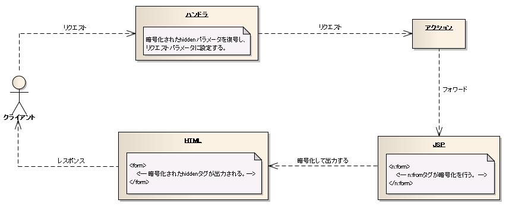
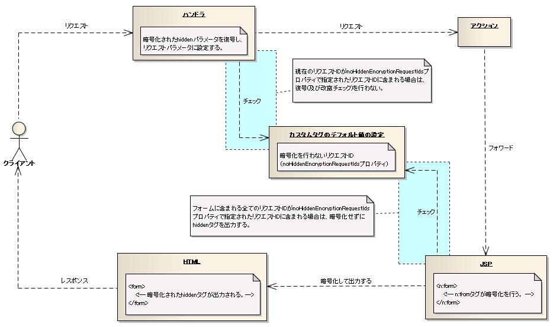
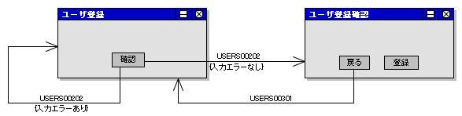
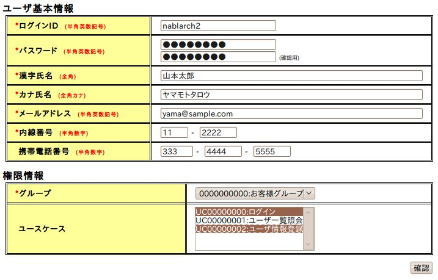
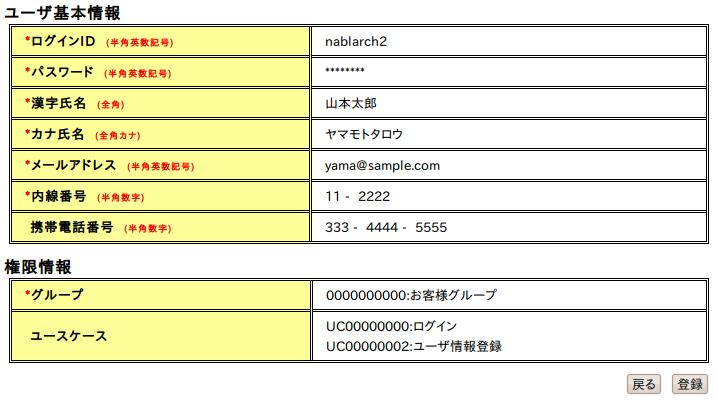

## 入力フォームのname属性

カスタムタグでは、入力データを取り扱うために、リクエストパラメータやリクエストスコープに設定された値にアクセスする必要がある。
このため、カスタムタグでは、リクエストパラメータやリクエストスコープに設定されたオブジェクト構造に透過的にアクセスできるように、
入力フォームのname属性の指定方法を規定する。
入力フォームの作成時は、下記の指定方法で入力フォームのname属性を指定する。

* Map型又はオブジェクトのプロパティにアクセスする場合は、ドット区切りを指定する。
* List型又は配列の要素にアクセスする場合は、角括弧(括弧内にはインデックス)を指定する。

以降では、下記のUserクラスを使用してname属性の指定例を示す。

```java
public class UserEntity {
    private String name;
    private String remarks;
    // アクセッサは省略。
}
```

### エンティティのプロパティにアクセスする場合の実装例

エンティティのプロパティにアクセスする場合の例を下記に示す。
例ではレイアウトを行うタグは省略する。

```jsp
<n:text name="user.name" />
<n:text name="user.remarks" />
```

上記のname属性の指定に対応するアクションの実装例を下記に示す。

```java
// "user"をプレフィックスに指定してバリデーションを行う。
ValidationContext<UserEntity> userCtx =
    ValidationUtil.validateAndConvertRequest("user", UserEntity.class, req, "insert");

// 入力エラーの場合はApplicationExceptionを送出する。
if (!userCtx.isValid()) {
    throw new ApplicationException(userCtx.getMessages());
}

// エンティティを取得して使用する。
UserEntity user = userCtx.createObject();
```

### Listのプロパティにアクセスする場合の実装例

Listのプロパティにアクセスする場合の例を下記に示す。

```jsp
<%-- JSTLのforEachタグを使用する。 --%>
<%-- アクション側でリクエストスコープにuserSizeという変数名でサイズを指定しているものとする。 --%>
<c:forEach begin="0" end="${userSize}" var="userIndex">
  <n:text name="user[${userIndex}].name" />
  <n:text name="user[${userIndex}].remarks" />
</c:forEach>
```

上記のname属性の指定に対応するアクションの実装例を下記に示す。

```java
int userSize = 3;
List<UserEntity> users = new ArrayList<UserEntity>(userSize);
List<Message> errors = new ArrayList<Message>();
boolean isValid = true;
for (int i = 0; i < userSize; i++) {

    // "user[n]"をプレフィックスに指定してバリデーションを行う。
    ValidationContext<UserEntity> userCtx =
        ValidationUtil.validateAndConvertRequest("user[" + i + "]", UserEntity.class, req, "insert");

    // 入力エラーの判定。
    if (userCtx.isValid()) {
        users.add(userCtx.createObject());
    } else {
        errors.addAll(userCtx.getMessages());
        isValid = false;
    }
}

// 入力エラーの場合はApplicationExceptionを送出する。
if (!isValid) {
    throw new ApplicationException(errors);
}

// 以降でエンティティ(users)を使用する。
```

> **Note:**
> **n:text** 等、 **name** 属性を使用したカスタムタグは、画面出力する値( **n:text** の場合 **input** タグの **value** 属性の値)は、下記順序で取得する。

> 1. >   **Page** スコープから **name** 属性に指定した値を保持するオブジェクトが取得できた場合、この値を使用する。( [1] 、 [2] )
> 2. >   リクエストスコープから **name** 属性に指定した値を保持するオブジェクトが取得できた場合、この値を使用する。([2])
> 3. >   リクエストパラメータから **name** 属性に指定した値が取得できた場合、この値を使用する。
>   リクエストパラメータからの値の取得は、入力エラー発生時に同一画面表示した場合と、 [ウィンドウスコープ](../../about/about-nablarch/about-nablarch-architectural-pattern-concept.md#ウィンドウスコープ) の値の表示に使用する。
> 4. >   セッションスコープから **name** 属性に指定した値が取得できた場合、この値を使用する。

> 上記順序で値が取得できなかった場合は、空文字列を画面出力する。

Nablarch では Page スコープのオブジェクトは [setタグ](../../component/libraries/libraries-07-TagReference.md#setタグ) を使用して設定できる。

Page スコープ、リクエストスコープでは、値の取得条件が
「name 属性に指定した値を保持するオブジェクトが取得できた場合」
という条件となっている。

これは、例えば [エンティティのプロパティにアクセスする場合の実装例](../../component/libraries/libraries-07-FormTag.md#エンティティのプロパティにアクセスする場合の実装例) の例で UserEntity クラスのプロパティ remarks が
null であれば、リクエストパラメータ "user.remarks" に "備考" が入っていても "" (空文字列)が出力されるという意味である。

この仕様は前画面で入力した値を null の値に上書きするための仕様である。

この仕様は、 [カスタムタグのデフォルト値の設定](../../component/libraries/libraries-07-HowToSettingCustomTag.md#カスタムタグのデフォルト値の設定) に記載した設定値 useValueAsNullIfObjectExists により変更可能である。
詳細は useValueAsNullIfObjectExists の説明を参照のこと。

## 入力データの保持

画面から入力されるデータは、クライアント側にhiddenタグとして保持される。
クライアント側に保持することで、サーバ側(セッション)に保持する場合に比べて、複数ウィンドウの使用やブラウザの戻るボタンの使用など、
ブラウザの使用制限を減らし、柔軟な画面設計が可能となる。
また、クライアント側に保持するデータは、単純に入力データだけではなく、サーバ側でDBに登録されているデータをhiddenタグで出力し保持する場合もある。
例えば、更新対象データのプライマリキーや楽観ロックのための更新対象データのバージョン番号(又は更新日時)をクライアント側に保持することが考えられる。
本フレームワークでは、これらクライアント側に保持するデータをウィンドウスコープと呼ぶ変数スコープに保持する。
変数スコープについては、 [変数スコープ](../../about/about-nablarch/about-nablarch-architectural-pattern-concept.md#変数スコープ) および [画面オンライン処理における変数スコープの利用](../../component/handlers/handlers-HttpMethodBinding.md#画面オンライン処理における変数スコープの利用) を参照。
尚、ログイン情報など、全ての業務に渡って必要になる情報は、サーバ側(セッション)に保持するので、クライアント側に保持するデータと混同しないこと。

> **Note:**
> データベースのデータについては、上記記載のある対象データを特定する主キーや楽観ロック用のデータなど必要最低限に留めること。
> 特に入力画面と確認画面で表示するデータ(入力項目ではなく、表示するだけの項目)等は、hiddenで引き回すのではなくデータが必要となる度にデータベースから値を取得するようにすること。

### windowScopePrefixes属性の使用方法

ウィンドウスコープにデータを設定するには、 [formタグ](../../component/libraries/libraries-07-TagReference.md#formタグ) のwindowScopePrefixes属性を指定することで行う。
ユーザ登録確認画面の使用例と属性の説明を下記に示す。

```jsp
<n:form windowScopePrefixes="systemAccount,users,ugroupSystemAccount">

    <%-- ボタン以外は省略 --%>

    <n:submit cssClass="buttons" type="button" name="back" value="戻る"
              uri="./USERS00301" />
    <n:submit cssClass="buttons" type="button" name="register" value="登録"
              uri="./USERS00302" allowDoubleSubmission="false" />
</n:form>
```

| 属性 | 説明 |
|---|---|
| windowScopePrefixes | ウィンドウスコープ変数のプレフィックス。 複数指定する場合はカンマ区切り。 指定されたプレフィックスがマッチするリクエストパラメータをhiddenタグとして出力する。 |

windowScopePrefixes属性には、ウィンドウスコープのデータとしてサーバ側に送信する必要があるリクエストパラメータの名前をプレフィックスで指定する。
上記例の場合は、3つのプレフィックス(systemAccount,users,ugroupSystemAccount)を指定している。
windowScopePrefixes属性の指定がない場合は、ウィンドウスコープのデータがサーバ側に送信されない。

### 複数画面に跨る画面遷移時のwindowScopePrefixes属性の指定方法

windowScopePrefixes属性の指定により、更新機能において更新対象を検索した際の検索条件だけを持ち回ることができる。
windowScopePrefixes属性の設定例を下記に示す。
検索条件のリクエストパラメータは"searchCondition.*"、更新対象のリクエストパラメータは"user.*"とする。

```jsp
<%--
  検索画面
  ウィンドウスコープのデータを送信しない。
--%>
<n:form>

<%--
  更新画面
  検索条件を送信する。
--%>
<n:form windowScopePrefixes="searchCondition">

<%--
  更新確認画面
  更新対象と検索条件を送信する。
--%>
<n:form windowScopePrefixes="user,searchCondition">

<%--
  更新完了画面
  検索条件を送信する。
--%>
<n:form windowScopePrefixes="searchCondition">
```

formタグでは、一律リクエストパラメータを全てhiddenタグに出力するのではなく、
既に入力項目として出力したリクエストパラメータはhiddenタグの出力から除外する。
この動作により、formタグは、ウィザード形式の画面のように、
画面の入力項目と他画面で入力された入力データをhiddenタグとして同時に出力することに対応する。

> **Warning:**
> パスワード入力についてもhiddenタグに出力されるため、パスワードがブラウザのキャッシュに残ることになる。
> インターネット越しに利用するアプリケーション等でキャッシュに残ると困る場合は、設計時に確認画面を出さなくする、
> またはパスワード変更画面のみサーバ側(セッション)を利用する等の方法で hidden にパスワードが出力されないよう考慮する必要がある。

### アクションの実装方法

一般的な開発では、入力データをサーバ側(セッション)に保持することが多いため、ここでアクションの実装方法について補足する。
入力データをサーバ側(セッション)に保持する場合とクライアント側(hiddenタグ)に保持する場合で、アクションの実装方法が異なる。

以降では、サーバ側(セッション)に保持する方式をサーバ方式、クライアント側(hiddenタグ)に保持する方式をクライアント方式と呼ぶ。

実装が異なる点を下記に示す。

a) クライアント方式ではアクションで入力データの設定を実装しない。

サーバ方式では、アクションでセッションに対して入力データの設定を明示的に実装する必要がある。クライアント方式では、formタグの指定に従いフレームワークが入力データを維持する。

b) クライアント方式ではアクションで入力データを取得する場合に毎回バリデーションを行う必要がある。

クライアント方式では、入力データを書き換えられる可能性があるため、入力データを使用する場合は毎回バリデーションを行う必要がある。

クライアント方式の実装例としてユーザ登録のシーケンス図を下記に示す。


## hiddenタグの暗号化

ウィンドウスコープやhiddenタグの値は、クライアント側で改竄されてリクエストされたり、
HTMLソースを参照することで容易に値を参照することが可能である。
本機能では、hiddenタグの改竄を防ぐこと、及びHTMLソース上でhiddenタグを参照させないことを目的に、hiddenタグの暗号化機能を提供する。

本フレームワークでは、アプリケーション内の全ての画面遷移でウィンドウスコープを使用することを想定しているため、
デフォルトでは全てのformタグで暗号化を行い、全てのリクエストで復号(及び改竄チェック)を行う。
このため、アプリケーションプログラマは、hiddenタグの暗号化機能に関して実装する必要がない。

### hiddenタグの暗号化機能の処理イメージ

hiddenタグの暗号化機能の処理イメージを下記に示す。



暗号化はformタグ、復号(改竄チェック)はハンドラが行う。
ここでは、上図のJSP→HTML→ハンドラの順に例を示し、formタグとハンドラの処理イメージを説明する。

まず、説明に使用するJSPを下記に示す。ユーザ情報の編集確認画面を想定している。

```jsp
<%-- JSPの実装例 --%>
<n:form windowScopePrefixes="user">
    <%-- hiddenタグでユーザIDの出力 --%>
    <n:hidden name="user.id" />
    <%-- ユーザ名の入力 --%>
    <n:text name="user.name" />
    <%-- パスワードの入力 --%>
    <n:password name="user.password" />
    <%-- ボタンは省略 --%>
</n:form>
```

先に、暗号化しない場合のHTML出力例を示す。
formタグは、確認画面のため、ウィンドウスコープの値として入力値もhiddenタグで出力する。

```html
<%-- 暗号化しない場合のHTMLの出力例 --%>
<form>
    <%-- 表示内容は省略 --%>
    <input type="hidden" name="user.id" value="U0001" />
    <input type="hidden" name="user.name" value="山田太郎" />
    <input type="hidden" name="user.password" value="pass1234" />
    <%-- ボタンは省略 --%>
</form>
```

次に、暗号化した場合のHTML出力例を示す。
出力例の"XXX･･･"は、暗号化した値を示している。
formタグでは、暗号化対象の値を全てまとめて暗号化を行い、BASE64でエンコードした結果を1つのhiddenタグで出力する。
暗号化した値は、"nablarch_hidden"という名前で常に出力する。
暗号化処理の詳細については、 [hiddenの暗号化処理](../../component/libraries/libraries-07-FormTag.md#hiddenの暗号化処理) を参照。

```html
<%-- 暗号化する場合のHTMLの出力例 --%>
<form>
    <%-- 表示内容は省略 --%>
    <input type="hidden" name="nablarch_hidden" value="XXXXXXXXXXXXXXXXXXXXXXXXXXXX" />
    <%-- ボタンは省略 --%>
</form>
```

リクエストを受けたハンドラは、"nablarch_hidden"パラメータの値をBASE64でデコードした結果に対して復号し、リクエストパラメータに設定する。
ハンドラの処理前後でのリクエストパラメータの状態を下記に示す。
ハンドラの復号処理では、改竄チェックも行っており、改竄を検知した場合は設定で指定された画面に遷移させる。
復号処理の詳細については、 [hiddenの復号処理](../../component/libraries/libraries-07-FormTag.md#hiddenの復号処理) を参照。

```bash
# ハンドラの復号例

# 復号前
nablarch_hidden=XXXXXXXXXXXXXXXXXXXXXXXXXXXX

# 復号後
user.id=U0001
user.name=山田太郎
user.password=pass1234
```

### hiddenタグの暗号化機能の設定

hiddenタグの暗号化機能は、 [カスタムタグのデフォルト値の設定](../../component/libraries/libraries-07-HowToSettingCustomTag.md#カスタムタグのデフォルト値の設定) により、下記の設定が可能である。
設定方法については、 [カスタムタグのデフォルト値の設定](../../component/libraries/libraries-07-HowToSettingCustomTag.md#カスタムタグのデフォルト値の設定) を参照。

* アプリケーション全体でhiddenタグの暗号化機能を使用するか否か(useHiddenEncryptionプロパティ)
* 暗号化を行わないリクエストID(noHiddenEncryptionRequestIdsプロパティ)

useHiddenEncryptionプロパティは、開発時にHTMLソース上でhiddenタグの内容を確認する場合に指定する。

以降では、noHiddenEncryptionRequestIdsプロパティを指定した場合の動作について解説する。

**noHiddenEncryptionRequestIdsプロパティを指定した場合の動作イメージ**

noHiddenEncryptionRequestIdsプロパティを指定した場合の動作イメージを下記に示す。



noHiddenEncryptionRequestIdsプロパティは、暗号化を行うformタグと復号を行うハンドラの両者から参照し、
それぞれ暗号化と復号を行うリクエストIDの同期を取る。
noHiddenEncryptionRequestIdsプロパティを指定した場合の動作結果を下記に示す。

noHiddenEncryptionRequestIdsプロパティに下記のリクエストIDが指定されているものとする。

```bash
ROO1, ROO2, ROO3
```

下記に状況別の動作結果を示す。
n:formタグが出力したHTMLからリクエストしている状況を想定している。
n:formタグに含まれるリクエストID列の()内に、n:formタグに含まれるリクエストIDと指定されたnoHiddenEncryptionRequestIdsプロパティの関係を示す。

| No | n:formタグに含まれるリクエストID | n:formタグの処理 | リクエスト | ハンドラの処理 |
|---|---|---|---|---|
| 1 | R111, R222(全て一致しない) | 暗号化される。 | R111 | 復号される。 |
| 2 | R001, R002(全て一致する) | 暗号化されない。 | R001 | 復号されない。 |
| 3 | R003, R004(一部だけ一致する) | 暗号化される。 | R003 | 復号される。 |
| 4 | R003, R004(一部だけ一致する) | 暗号化される。 | R004 | 復号される。 |

上記の通り、n:formに含まれるリクエストIDが一部だけ一致する場合は暗号化する。
これは、誤設定による暗号化漏れを防ぐためである。
そのため、 **No.3** の状況では、本来は暗号化の対象外とすべきリクエストに対しても暗号化が行われる。

### hiddenの暗号化処理

暗号化は、Encryptorインタフェースを実装したクラスが行う。
フレームワークでは、デフォルトの暗号化アルゴリズムとしてAES(128bit)を使用する。
暗号化アルゴリズムを変更したい場合は、Encryptorを実装したクラスをリポジトリに"hiddenEncryptor"という名前で登録する。

暗号化は、formタグ毎に行う。暗号化では、formタグに含まれる下記のデータをまとめて暗号化し、1つのhiddenタグで出力する。
このため、hiddenのパラメータ名も含めて暗号化するため、改竄すること自体を難しくしている。

* カスタムタグのhiddenタグで明示的に指定したhiddenパラメータ
* ウィンドウスコープの値
* サブミットを行うタグ(submit、submitLink、button)で指定したリクエストID
* サブミットを行うタグで指定した [変更パラメータ](../../component/libraries/libraries-07-SubmitTag.md#ボタン又はリンク毎にパラメータを変更する方法)

さらに、暗号化では、改竄を検知するために、上記のデータから生成したハッシュ値を含める。
リクエストIDは、異なる画面間での値の置き換えによる改ざんを検知するために、
ハッシュ値は、値の書き換えによる改竄を検知するために使用する。
暗号化した結果は、BASE64でエンコードしhiddenタグに出力する。

尚、 [変更パラメータ](../../component/libraries/libraries-07-SubmitTag.md#ボタン又はリンク毎にパラメータを変更する方法) は、暗号化する場合と暗号化しない場合で、
nablarch_hiddenタグの値が暗号化されることを除き、リクエスト時の動作が同じとなる。

> **Note:**
> カスタムタグのhiddenタグで明示的に指定したhiddenパラメータは、暗号化に含まれるため、クライアント側でJavaScriptを使用して値を操作することができない。
> クライアント側のJavaScriptでhiddenパラメータを操作する必要がある場合は、 [plainHiddenタグ](../../component/libraries/libraries-07-TagReference.md#plainhiddenタグ) を使用して出力する必要がある。
> 下記に [plainHiddenタグ](../../component/libraries/libraries-07-TagReference.md#plainhiddenタグ) の使用例を示す。

> [plainHiddenタグ](../../component/libraries/libraries-07-TagReference.md#plainhiddenタグ) に指定された値はhidden暗号化対象とならず、常にHTMLのinput(type="hidden")タグとして出力される。

> ```html
> <%-- JSPの実装例 --%>
> <n:plainHidden name="user.id" />
> 
> <%-- HTMLの出力例 --%>
> <input type="hidden" name="user.id" value="U0000000001" />
> ```

> **Note:**
> 入力画面などの入力データを暗号化して出力したhiddenタグのデータ量は、暗号化せずに平文で出力した場合に比べて約1.2倍に増量する(1Mバイトのデータ量で比較した結果)。
> このデータ量の増加は、特に問題ない範囲である。

**暗号化に使用する鍵の説明**

暗号化に使用する鍵は、鍵の有効期間をできるだけ短くするため、セッション毎に生成する。
このため、同じユーザであってもログインをやり直すと、ログイン前に使用していた画面から処理を継続することはできない。

> **Note:**
> hiddenの暗号化処理では、本フレームワークが出力したHTML以外からアクセスするリクエストを暗号化できない。
> 業務アプリケーションのログイン画面やショッピングサイトの商品ページが暗号化できないリクエストに該当する。
> ショッピングサイトのように、暗号化できないリクエストが多数を占めるアプリケーションでは、
> 別途パラメータの改竄と情報漏洩への対策が必要となる。

### hiddenの復号処理

hiddenの復号処理は、NablarchTagHandlerが行う。
NablarchTagHandlerの設定方法については、 [NablarchTagHandlerの設定](../../component/libraries/libraries-07-HowToSettingCustomTag.md#nablarchtaghandlerの設定) を参照。

NablarchTagHandlerの設定では、改竄を検知した場合に送信する画面のリソースパスとレスポンスステータスを指定する。
NablarchTagHandlerは、下記の場合に改竄と判定し、指定された画面に遷移させる。

* 暗号化したhiddenパラメータ(nablarch_hidden)が存在しない。
* BASE64のデコードに失敗する。
* 復号に失敗する。
* 暗号化時に生成したハッシュ値と復号した値で生成したハッシュ値が一致しない。
* 暗号化時に追加したリクエストIDと受け付けたリクエストのリクエストIDが一致しない。

## 入力データの復元

入力画面では、入力エラーの場合と確認画面から戻る場合に、入力データを復元した状態で再表示することが要求される。
下図に画面遷移を示す。
USER00202{入力エラーあり}とUSER00301のリクエストIDが該当する。



カスタムタグにより、リクエストパラメータから入力データを復元するため、
アプリケーションプログラマは入力データの取得先を意識した実装を行う必要がない。

カスタムタグでは、name属性に対応する値を下記の順に検索し、最初に見つかった値を出力する。
ただし、writeタグは出力専用のため、リクエストパラメータを検索対象に含めない。

* Servlet APIのページスコープ
* Servlet APIのリクエストスコープ
* Servlet APIのリクエストパラメータ
* Servlet APIのセッションスコープ

## 入力項目の確認画面用の出力

入力項目のカスタムタグは、入力画面と全く同じ記述のまま、確認画面用の出力を行うことができる。
確認画面のJSPに [confirmationPageタグ](../../component/libraries/libraries-07-TagReference.md#confirmationpageタグ) を追加する。

```java
<n:confirmationPage />
```

ユーザ登録画面とユーザ登録確認画面の例を示す。
はじめにそれぞれの画面イメージを示す。





### textタグの出力例

上記画面イメージのユーザIDについてHTML出力例を示す。
[textタグ](../../component/libraries/libraries-07-TagReference.md#textタグ) は、確認画面でそのまま出力する。

```jsp
<n:text name="systemAccount.loginId" size="22" maxlength="20" />
```

入力画面と確認画面のHTML出力例を下記に示す。

```html
<%-- 入力画面 --%>
<input type="text" name="systemAccount.loginId" value="nablarch2" size="22" maxlength="20" />

<%-- 確認画面 --%>
<%-- そのまま出力する。 --%>
nablarch2
```

### passwordタグの出力例

上記画面イメージのパスワードについてHTML出力例を示す。
[passwordタグ](../../component/libraries/libraries-07-TagReference.md#passwordタグ) は、確認画面では文字を置き換えて出力する。
置換文字はpasswordタグの属性で変更できる。

```jsp
<n:password name="systemAccount.newPassword" size="22" maxlength="20" />
```

入力画面と確認画面のHTML出力例を下記に示す。

```html
<%-- 入力画面 --%>
<input type="password" name="systemAccount.newPassword" value="password" size="22" maxlength="20" />

<%-- 確認画面 --%>
<%-- '*'に置換して出力する。置換文字は変更可能。 --%>
********
```

### selectタグの出力例

上記画面イメージのユースケースについてHTML出力例を示す。
[selectタグ](../../component/libraries/libraries-07-TagReference.md#selectタグ) は、確認画面では指定されたフォーマットで出力する。
デフォルトのフォーマットはbrタグである。

```jsp
<n:select name="systemAccount.useCase" multiple="true" size="5"
          listName="allUseCase" elementLabelProperty="useCaseName" elementValueProperty="useCaseId"
          elementLabelPattern="${VALUE}:${LABEL}" />
```

入力画面と確認画面のHTML出力例を下記に示す。
確認画面では、選択されたオプションのみが出力される。

```html
<%-- 入力画面 --%>
<select name="systemAccount.useCase" size="5" multiple="multiple">
  <option value="UC00000000" selected="selected">UC00000000:ログイン</option>
  <option value="UC00000001">UC00000001:ユーザ一覧照会</option>
  <option value="UC00000002" selected="selected">UC00000002:ユーザ情報登録</option>
</select>

<%-- 確認画面 --%>
<%-- brタグ区切りに出力する。divタグ、ulタグ、olタグ、スペース区切りに変更可能。 --%>
UC00000000:ログイン<br />UC00000002:ユーザ情報登録<br />
```
