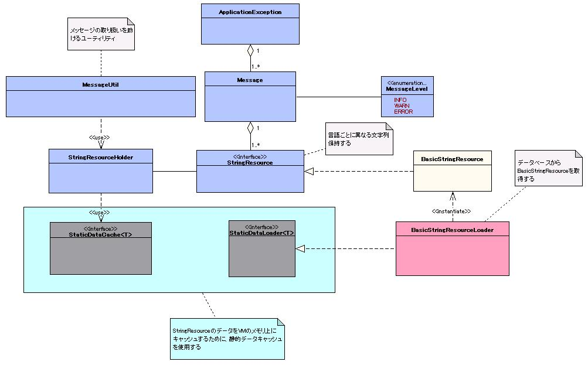

# メッセージ管理

## 概要

ユーザに通知するメッセージを取り扱う機能を提供する。

本機能は、リポジトリに登録して使用する。
このため、本機能に必要な初期化処理は [リポジトリ](../../component/libraries/libraries-02-Repository.md#リポジトリ) が実行する。

アプリケーションプログラマは、本機能を画面表示に使用するメッセージの取得に使用する。
メッセージの取得方法については、 [メッセージの取得](../../component/libraries/libraries-07-Message.md#メッセージの取得) 以降に記述する。

## 特徴

### メッセージの取得

ユーザに通知するメッセージを、通知する内容ごとに一意となるID(メッセージID)を指定して取得できる。

### 国際化

国際化対応が必要なアプリケーションでは、メッセージID1つに対して言語ごとに異なるメッセージを設定できる。

### メッセージのフォーマット

メッセージはjavaのMessageFormat形式で可変文字をフォーマットして取得できる。

### メッセージのキャッシュ

通常、メッセージはデータベースサーバ上に永続化しているが、 [静的データのキャッシュ](../../component/libraries/libraries-05-StaticDataCache.md) の機能を使用しているため高速にアクセスできる。

また、アプリケーションからはメッセージのキャッシュを意識する必要はない。

## 要求

### 実装済み

* メッセージIDをキーにデータベース上に登録したメッセージを取得できる。
* メッセージをメモリ上にキャッシュできる。
* メッセージのフォーマットができる。
* 多言語化ができる。

## 構造

### クラス図



### インタフェース定義

| インタフェース名 | 概要 |
|---|---|
| nablarch.core.message.StringResource | ユーザに通知するメッセージの元となる文字列リソースを保持するインタフェース。 文字列リソースは通知する内容ごとにメッセージIDという単位で管理される。 国際化したアプリケーションでは、通知したい内容を個々の言語で表す必要があるために1つの メッセージIDに言語毎に異なる複数の文字列が存在する。 |

### クラス定義

| クラス名 | 概要 |
|---|---|
| nablarch.core.message.BasicStringResource | StringResource の基本実装クラス。 各言語ごとの文字列リソースを Map に保持する。 |
| nablarch.core.message.StringResourceHolder | ユーザに通知するメッセージの元となる文字列リソースを管理するクラス。 文字列リソースのキャッシュには、 [静的データのキャッシュ](../../component/libraries/libraries-05-StaticDataCache.md) の機構を使用する。 |
| nablarch.core.message.BasicStringResourceLoader | StringResourceHolder が使うキャッシュに必要な文字列リソースをデータベースから取得するクラス。 StringResource の実装には BasicStringResource を用いる。 |
| nablarch.core.message.MessageLevel | メッセージの通知レベルを表す列挙型。 |
| nablarch.core.message.Message | メッセージに必要な情報を保持し、メッセージのフォーマットを行うクラス。 処理結果の通知のために、StringResource 、 MessageLevel 、 option パラメータ(StringResource の文字列置き換えに必要なパラメータ)を持つ。 |
| nablarch.core.message.ApplicationException | 処理結果メッセージを通知する際に使用する例外。 処理結果を表す Message のリストを持つ。 |
| nablarch.core.message.MessageUtil | アプリケーションがメッセージを取得する際に使用するユーティリティクラス。 |

### テーブル定義

BasicStringResourceLoader は、下記に示すデータベーステーブルから文字列リソースをロードする。

* テーブル名、カラム名は任意。
* データベースの型は、Javaの型に変換可能な型を選択する。

#### メッセージテーブル

| 定義 | Javaの型 | 制約 |
|---|---|---|
| メッセージID | java.lang.String | プライマリキー |
| 言語 | java.lang.String | プライマリキー |
| メッセージ | java.lang.String |  |

#### テーブル定義の例


## メッセージの取得

メッセージは MessageUtil を通じて取得できる。
取得例を以下に示す。

```java
// Message ID "MSG0001"の結果メッセージを取得
Message message = MessageUtil.createMessage(MessageLevel.INFO, "MSG0001");
```

## メッセージのフォーマット

メッセージは、 java.text.MessageFormat の形式で埋め込み文字をフォーマットして出力できる。
この機能を使用する場合、データベース上のメッセージカラムにはメッセージを埋め込み文字の状態で登録しておく。

下記にメッセージをフォーマットする実装例を示す。

### メッセージテーブル

| メッセージID | 言語 | メッセージ |
|---|---|---|
| MSG0001 | ja | {0} は {1} から {2} の間で指定してください。 |

### 実装例

```java
// "price は 1 から 10 の間で指定してください。" が取得できる。
Message message = MessageUtil.createMessage(MessageLevel.ERROR, "MSG0001", "price", 1, 10);
String messageStr = message.formatMessage();
```

## 国際化

データベースのメッセージテーブルに、言語ごとに異なるメッセージを設定することで、言語に合わせたメッセージが取得できる。
Message クラスの formatMessage メソッドを引数なしで呼び出した場合、 ThreadContex tに保持した言語に合わせたメッセージが取得できる。
通常 ThreadContext にはフレームワークで適切な言語がセットされるため、アプリケーション実装時には言語に合わせたメッセージを取得することを意識する必要がない [1] 。

ThreadContext に保持する値は、Webフレームワークあるいは Batch フレームワークで初期化、クリアされる。
このため、通常はアプリケーション実装時に値を設定することを意識する必要はない。

ThreadContext の詳細は [同一スレッド内でのデータ共有(スレッドコンテキスト)](../../component/libraries/libraries-thread-context.md#同一スレッド内でのデータ共有スレッドコンテキスト) を参照のこと。

ただし、画面上に日本語と英語両方のメッセージを同時に出力したい場合は、formatMessageメソッドの引数に取得したい言語を指定することで、
指定した言語に合わせたメッセージを取得することもできる。

以下に例を示す。

### メッセージテーブル

| メッセージID | 言語 | メッセージ |
|---|---|---|
| MSG0001 | en | User id is already registered. |
| MSG0001 | ja | そのユーザIDは既に登録されています。 |

### 実装例

```java
// ******** 注意 ********
// 直下のコードはフレームワークが行う処理であり、通常のアプリケーションでは実装する必要がない。
// 従って、本フレームワークを使用する場合、アプリケーション・プログラマはこのような実装を行わない。

// メッセージを作成(ビジネスロジックで行う)
Message message = MessageUtil.createMessage(MessageLevel.ERROR, "MSG0001");

// コンテキストの言語に"en"を設定(通常、フレームワークが行う)
ThreadContext.setLanguage(Locale.ENGLISH);
// 言語指定せずformatMessageを呼び出し(スレッドコンテキストの言語を使用)
// "User id is already registered."が取得できる。
String messageStr1 = message.formatMessage();

// コンテキストの言語に"ja"を設定(通常、フレームワークが行う)
ThreadContext.setLanguage(Locale.JAPANESE);

// 言語指定せず formatMessage を呼び出し(スレッドコンテキストの言語を使用)
// "そのユーザIDは既に登録されています。"が取得できる。
String messageStr2 = message.formatMessage();

// 特定の言語を指定して formatMessage を呼び出し
// "User id is already registered."が取得できる。
String messageStr3 = message.formatMessage(Locale.ENGLISH);
```

## オプションパラメータの国際化

メッセージのフォーマット時に使用するオプションパラメータについても、メッセージの機構を使用した国際化ができる。
この場合、メッセージのフォーマットに使用するオブジェクトに StringResource あるいは Message を配置すればよい。

以下に例を示す。

### メッセージテーブル

| メッセージID | 言語 | メッセージ |
|---|---|---|
| MSG0001 | en | value of {0} is not valid. |
| MSG0001 | ja | {0}の値が不正です。 |
| MSG0002 | en | unknown error occur. error message:"{0}". |
| MSG0002 | ja | 原因不明のエラーが発生しました。 エラーメッセージ:「{0}」。 |
| PRP0001 | en | name |
| PRP0001 | ja | 名前 |

### StringResourceを使用する実装例

```java
// ******** 注意 ********
// 直下のコードはフレームワークが行う処理であり、通常のアプリケーションでは実装する必要がない。
// 従って、本フレームワークを使用する場合、アプリケーション・プログラマはこのような実装を行わない。

// メッセージを作成(ビジネスロジック)
StringResource propertyStringResource = MessageUtil.getStringResource("PRP0001");
// createMessageメソッドのオプションにMessageを設定する。
Message message = MessageUtil.createMessage(MessageLevel.ERROR, "MSG0001", propertyStringResource);

// コンテキストの言語に"en"を設定(通常、フレームワークが行う)
ThreadContext.setLanguage(Locale.ENGLISH);
// "value of name is not valid."が取得できる。
String message1 = message.formatMessage();

// コンテキストの言語に"ja"を設定(通常、フレームワークが行う)
ThreadContext.setLanguage(Locale.JAPANESE);
// "名前の値が不正です。"が取得できる。
String message2 = message.formatMessage();

// 特定の言語を指定
// "value of name is not valid."が取得できる。
String message3 = message.formatMessage(Locale.ENGLISH);
```

### Messageを使用する実装例

```java
// ******** 注意 ********
// 直下のコードはフレームワークが行う処理であり、通常のアプリケーションでは実装する必要がない。
// 従って、本フレームワークを使用する場合、アプリケーション・プログラマはこのような実装を行わない。

// メッセージを作成(ビジネスロジック)
StringResource propertyStringResource = MessageUtil.getStringResource("PRP0001");
// createMessageメソッドのオプションにMessageを設定する。
Message message = MessageUtil.createMessage(MessageLevel.ERROR, "MSG0001", propertyStringResource);

// コンテキストの言語に"ja"を設定(通常、フレームワークが行う)
ThreadContext.setLanguage(Locale.JAPANESE);
// createMessage メソッドのオプションに Message を設定する。(Message のネスト)
Message errorMessage =  = MessageUtil.createMessage(MessageLevel.ERROR, "MSG0002", message);
// "原因不明のエラーが発生しました。 エラーメッセージ:「名前の値が不正です。」。"が取得できる。
String errorMessage1 = errorMessage.formatMessage();
```

## 例外によるメッセージの通知

業務的なエラーが発生した際は、通常このエラーの内容を使用者に伝えるためにメッセージの出力が必要になる。
メッセージ機能では、このようなメッセージ通知に使用する ApplicationException という例外クラスを提供している。

アプリケーション実装時には、この ApplicationException クラスまたは ApplicationException クラスのサブクラスを
使用することで、フレームワークが提供する例外処理機構が使用できる。

以下にこの例外の使用例を示す。

### 例外を送出するクラス

```java
// メッセージを作成(ビジネスロジック)
Message message = MessageUtil.createMessage(MessageLevel.ERROR, "MSG0001");

// 例外を投げる。
throw new ApplicationException(message);
```

### 例外からエラーメッセージを受けとるクラス。

```java
// ******** 注意 ********
// 直下のコードは、本フレームワークの機能により実現されるべき処理の疑似コードである。
// 従って、本フレームワークを使用する場合、アプリケーション・プログラマはこのような実装を行わない。

    try {
            anyBussinessLogic();
    } catch (ApplicationException e) {
        List<Message> messages = e.getMessages();

        // エラーメッセージの表示
        showErrorMessage(messages);
    }
```

## 設定の記述

### 設定ファイル例

メッセージを使用する際は、リポジトリに "messageResource" というコンポーネント名で MessageResource クラスを登録する必要がある。

以下に設定例を示す。

```xml
<!-- SimpleDbTransactionManager の設定 -->
<component name="messageDbManager" class="nablarch.core.db.transaction.SimpleDbTransactionManager">
    <property name="dbTransactionName" value="message"/>
</component>

<component name="stringResourceLoader"
      class="nablarch.core.message.BasicStringResourceLoader">
  <!-- データロードに使用するSimpleDbTransactionManagerのインスタンス -->
  <property name="dbManager" ref="messageDbManager"/>
  <!-- メッセージリソーステーブル名 -->
  <property name="tableName" value="TEST_MESSAGE"/>
  <!-- メッセージリソーステーブル IDカラム名 -->
  <property name="idColumnName" value="MESSAGE_ID"/>
  <!-- メッセージリソーステーブル 言語カラム名 -->
  <property name="langColumnName" value="LANG"/>
  <!-- メッセージリソーステーブル メッセージカラム名 -->
  <property name="valueColumnName" value="MESSAGE"/>
</component>

<component name="stringResourceHolder" class="nablarch.core.message.StringResourceHolder">
  <property name="stringResourceCache">
    <component class="nablarch.core.cache.BasicStaticDataCache">

      <!--
        起動時初期化要否の設定
          true  : 初期化時一括ロード
          false : オンデマンドロード
       -->
      <property name="loadOnStartup" value="true"/>

      <property name="loader" ref="stringResourceLoader">
      </property>
    </component>
  </property>
</component>
```

### 設定内容詳細

#### nablarch.core.message.StringResourceHolder の設定

| property名 | 設定内容 |
|---|---|
| stringResourceCache(必須) | StringResourceインタフェースを実装したクラスを保持するStaticDataCacheを設定する。 |

#### nablarch.core.cache.BasicStaticDataCache クラスの設定

[静的データのキャッシュ](../../component/libraries/libraries-05-StaticDataCache.md) を参照。

> **Warning:**
> このプロパティに設定する StaticDataLoader は、必ず BasicStringResourceLoader クラスのように、 StringResource インタフェースを実装したクラスを
> 読み込むように実装すること。

#### nablarch.core.message.BasicStringResourceLoader クラスの設定

| property 名 | 設定内容 |
|---|---|
| dbManager (必須) | メッセージのロード時に使用する SimpleDbTransactionManager クラスを指定する。 |
| tableName (必須) | メッセージを永続化したテーブル名を指定する。 |
| idColumnName (必須) | メッセージを永続化したテーブルのメッセージIDのカラム名を指定する。 |
| langColumnName (必須) | メッセージを永続化したテーブルの言語のカラム名を指定する。 |
| valueColumnName (必須) | メッセージを永続化したテーブルのメッセージのカラム名を指定する。 |
