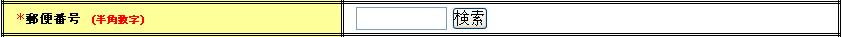

## ボタン又はリンクによるフォームのサブミット

フォームのサブミットは、ボタン及びリンクに対応しており、下記のカスタムタグを提供している。
これらのカスタムタグでは、ボタン又はリンクとURIを関連付けるためにname属性とuri属性を指定する。
name属性は、フォーム内で一意な名前を指定する。
uri属性の指定方法については、 [URIの指定方法](../../component/libraries/libraries-07-BasicRules.md#webview-specifyuri) を参照。

タグ名が「popup」から始まるタグは、新しいウィンドウをオープンし、オープンしたウィンドウに対してサブミットを行う。
タグ名が「download」から始まるタグは、ダウンロード用のサブミットを行う。

| カスタムタグ | 出力するHTMLタグ |
|---|---|
| [submitタグ](../../component/libraries/libraries-07-TagReference.md#webview-submittag) | inputタグ(type=submit,button,image) |
| [buttonタグ](../../component/libraries/libraries-07-TagReference.md#webview-buttontag) | buttonタグ |
| [submitLinkタグ](../../component/libraries/libraries-07-TagReference.md#webview-submitlinktag) | aタグ |
| [popupSubmitタグ](../../component/libraries/libraries-07-TagReference.md#webview-popupsubmittag) | inputタグ(type=submit,button,image) |
| [popupButtonタグ](../../component/libraries/libraries-07-TagReference.md#webview-popupbuttontag) | buttonタグ |
| [popupLinkタグ](../../component/libraries/libraries-07-TagReference.md#webview-popuplinktag) | aタグ |
| [downloadSubmitタグ](../../component/libraries/libraries-07-TagReference.md#webview-downloadsubmittag) | inputタグ(type=submit,button,image) |
| [downloadButtonタグ](../../component/libraries/libraries-07-TagReference.md#webview-downloadbuttontag) | buttonタグ |
| [downloadLinkタグ](../../component/libraries/libraries-07-TagReference.md#webview-downloadlinktag) | aタグ |

### サブミット先の指定方法

ボタン又はリンクによるフォームのサブミットでURIを指定する場合、uri属性にコンテキストからの相対パスを指定する。
ユーザ登録機能の例であれば、入力画面と確認画面はUserActionにより表示されるため、これらの画面が表示される際のパスはUserActionにサブミットしたパスとなる。
このため、入力画面の確認ボタン、確認画面の戻るボタンと登録ボタンのuri属性には、コンテキストからUserActionへの相対パスを指定する。
ユーザ登録確認画面の戻るボタンと登録ボタンの使用例を下記に示す。

```jsp
<n:submit cssClass="buttons" type="button" name="back" value="戻る"
          uri="/action/management/user/UserAction/USERS00301" />
<n:submit cssClass="buttons" type="button" name="register" value="登録"
          uri="/action/management/user/UserAction/USERS00302" />
```

ボタンを押した場合のサブミット先のURIを下記に示す。
サブミット先のURIはコンテキストパスを付加したパスとなる。

```bash
# ユーザ登録確認画面を表示したURI
<コンテキストパス>/action/management/user/UserAction/USER00202

# 戻るボタンを押した場合のサブミット先のURI
<コンテキストパス>/action/management/user/UserAction/USER00301

# 登録ボタンを押した場合のサブミット先のURI
<コンテキストパス>/action/management/user/UserAction/USER00302
```

> **Warning:**
> サブミット先は現在のURIからの相対パスでも指定することができるが、現在のURIからの相対パスを指定した場合、
> 想定していない画面遷移により不正なURIを組み立ててしまうことがある。
> そのため、ボタン又はリンクによるフォームのサブミットでURIを指定する場合は、コンテキストからの相対パスを指定すること。

### サブミットを制御するJavaScript関数

フォームのサブミットは、JavaScriptを使用してURIを組み立てることで実現する。
カスタムタグは、画面内で1回だけ、サブミットを制御するJavaScript関数を出力する。
フレームワークが出力するサブミットを制御するJavaScript関数のシグネチャを下記に示す。

```javascript
// フレームワークが出力するJavaScript関数

/**
 * @param event イベントオブジェクト
 * @param element イベント元の要素(ボタン又はリンク)
 * @return イベントを伝搬させないため常にfalse
 */
function nablarch_submit(event, element)
```

### アプリケーションでonclick属性を指定する場合の制約

カスタムタグは、アプリケーションによるonclick属性の指定有無により処理内容が異なる。
アプリケーションによりonclick属性が指定されなかった場合、カスタムタグは、出力するタグのonclick属性に上記のJavaScript関数を自動で設定する。
アプリケーションによりonclick属性が指定された場合、カスタムタグは、JavaScript関数を設定しない。
アプリケーションは、onclick属性を指定する場合、アプリケーションで作成するJavaScript内で、フレームワークが出力するJavaScript関数を明示的に呼び出す必要がある。

アプリケーションがonclick属性を指定する場合の実装例を下記に示す。
下記の実装例では、サブミット前に確認ダイアログを表示する。

```javascript
// アプリケーションで作成するJavaScript関数
function popUpConfirmation(event, element) {
    if (window.confirm("登録します。よろしいですか？")) {
        // OK
        // フレームワークが出力するJavaScript関数を明示的に呼び出す。
        return nablarch_submit(event, element);
    } else {
        // キャンセル
        return false;
    }
}
```

```jsp
// onclick属性にアプリケーションで作成したJavaScript関数を設定する。
<n:submit cssClass="buttons" type="button" name="register" value="登録"
          uri="./USERS00302" onclick="return popUpConfirmation(event, this);" />
```

### アプリケーションでformタグのname属性を指定する場合の制約

カスタムタグが出力するJavaScript関数は、サブミット対象のフォームを特定するために、formタグのname属性を使用する。
このため、アプリケーションでformタグのname属性を指定する場合は、画面内で一意な名前をname属性に指定する必要がある。
アプリケーションでformタグのname属性を指定しなかった場合、カスタムタグは「nablarch_form<連番>」形式でname属性の値を生成してformタグのname属性に設定する。
<連番>部分には、画面内でformタグの出現順に1から番号を振る。

> **Warning:**
> サブミット制御を行うJavaScriptにおいてformタグのname属性を使用するため、
> formタグのname属性にはJavaScriptの変数名の構文に則った値を指定すること。
> 下記に変数名の構文を示す。

> * >   値の先頭は英字始まり
> * >   先頭以降の値は英数字またはアンダーバー

### ボタン又はリンク毎にパラメータを変更する方法

更新機能などにおいて、一覧画面から詳細画面に遷移するケースでは、1つのフォームに複数のリンクで異なるパラメータを送信したい場合がある。
本機能では、フォームのボタンやリンク毎にパラメータを変更するために [paramタグ](../../component/libraries/libraries-07-TagReference.md#webview-paramtag) を提供する。
尚、以降では、フォームのボタンやリンク毎に変更するパラメータを変更パラメータと呼ぶ。

paramタグでは、リクエストで送信する際に使用するパラメータ名を指定するparamName属性と、
直接値を指定する場合はvalue属性、リクエストスコープなどスコープ上のオブジェクトを参照する場合はname属性を指定する。

paramタグの使用例を下記に示す。検索結果から一覧画面でリンク毎に変更パラメータを指定している。

```jsp
<n:form>
    <table>
        <%-- テーブルのヘッダ行は省略 --%>
        <c:forEach var="user" items="${searchResult}" varStatus="status">
        <tr>
            <td>
                <%--
                  リンク毎にsampleIdパラメータを変更している。
                  検索結果には、id(プライマリキー)とname(名前)が含まれているものとする。
                --%>
                <n:submitLink uri="./R0001" name="R0001_${status.index}">
                    <n:write name="user.id"/><%-- リンクのラベル指定 --%>
                    <n:param paramName="sampleId" name="user.id" /><%-- 変更パラメータの指定 --%>
                </n:submitLink>
            </td>
            <td><n:write name="user.name"/></td>
        </tr>
        </c:forEach>
    </table>
</n:form>
```

HTMLの出力イメージを下記に示す。
「nablarch_hidden」というパラメータに必要な情報を入れておき、
変更パラメータをリクエストパラメータとして使用できるようにNablarchTagHandlerクラスが設定を行う。
このため、変更パラメータを使用する場合は、NablarchTagHandlerの設定が必須となる。
NablarchTagHandlerの設定方法については、 [NablarchTagHandlerの設定](../../component/libraries/libraries-07-HowToSettingCustomTag.md#webview-nablarchtaghandler) を参照。

ユーザ2のリンクが選択された場合は、リクエストパラメータとして「sampleId=U0002」が使用できる状態となる。

```html
<a name="R0001_0" href="./R0001" onclick="return window.nablarch_submit(event, this);">
    ユーザ1
</a>
<a name="R0001_1" href="./R0001" onclick="return window.nablarch_submit(event, this);">
    ユーザ2
</a>
<a name="R0001_2" href="./R0001" onclick="return window.nablarch_submit(event, this);">
    ユーザ3
</a>
<%-- nablarch_hiddenパラメータ --%>
<input type="hidden" name="nablarch_hidden" value="・・・省略・・・" />
```

> **Warning:**
> 変更パラメータを使用する場合は、その数に応じてリクエストのデータ量は増大する。
> このため、一覧画面で詳細画面へのリンク毎に変更パラメータを指定する場合は、
> 変更パラメータをプライマリキーだけにするなど、必要最小限のパラメータのみ指定するよう考慮すること。

### 認可判定と開閉局判定の結果に応じた表示切り替え

認可判定と開閉局判定の結果に応じて、フォームのサブミットを行うボタン又はリンクの表示を切り替えたい場合がある。
例えば、閉局状態の機能へサブミットを行うボタンやリンクを画面表示時点で非活性にしておきたい場合が挙げられる。
これにより、ユーザーが実際にボタン又はリンクを押下する前に該当の機能が使用可能かどうかが分かるため、ユーザビリティの向上につながる。

本機能では、フォームのサブミットを行うボタン又はリンクに対して、下記機能に対応した表示切り替えを提供する。それぞれ、下記機能に対応するハンドラがハンドラ構成に含まれている場合のみ本機能は有効となる。

* [認可](../../component/libraries/libraries-04-Permission.md#permission)
* [開閉局](../../component/libraries/libraries-05-ServiceAvailability.md#serviceavailable)

本機能は次の仕様に基づき表示切り替えを行う。

* サブミットを行うタグに指定されたリクエストIDに対して認可判定と開閉局判定を行う。
* 認可判定で認可失敗となるか、または開閉局判定で閉局となった場合に表示切り替えを行う。
* 切り替え時の表示方法には次の3パターンがある。

  | 表示方法 | 説明 |
  |---|---|
  | 非表示 | タグを表示しない。 |
  | 非活性 | タグを非活性にする。   ボタンの場合は、disabled属性を有効にする。   リンクの場合は、以下の2種類のうち、いずれかの動作となる。   1. ラベルのみ表示する（デフォルトの動作。aタグを出力しない）。   2. 非活性リンク描画用JSPをインクルードする（ [カスタムタグのデフォルト値の設定](../../component/libraries/libraries-07-HowToSettingCustomTag.md#webview-customtagconfig) で指定した場合 [1] ）。 |
  | 通常表示 | 表示方法の切り替えを行わない。 |
* デフォルトでは、 [カスタムタグのデフォルト値の設定](../../component/libraries/libraries-07-HowToSettingCustomTag.md#webview-customtagconfig) で指定された表示方法を使用する。設定方法は [カスタムタグのデフォルト値の設定](../../component/libraries/libraries-07-HowToSettingCustomTag.md#webview-customtagconfig) を参照。
* 個別に表示方法を変更したい場合は、各タグのdisplayMethod属性に指定する。下記に属性の説明と設定例を示す。

  | 属性 | 説明 |
  |---|---|
  | displayMethod | 認可判定と開閉局判定の結果に応じて表示制御を行う場合の表示方法。   下記のいずれかを指定する。   NODISPLAY (非表示)   DISABLED (非活性)   NORMAL (通常表示) |

  ```jsp
  <%-- このタグは常に表示する。 --%>
  <n:submit displayMethod="NORMAL" type="button" name="login"
            value="ログイン" uri="/LoginAction/LOGIN001" />
  ```

  > **Note:**
> [カスタムタグのデフォルト値の設定](../../component/libraries/libraries-07-HowToSettingCustomTag.md#webview-customtagconfig) でアプリケーション全体の切り替え時の表示方法を非活性や非表示にした場合は、
  > ログイン画面のログインボタンなど認可されていない状態で使用するボタン又はリンクも表示制御され使用できなくなる。
  > このため、常に表示したいボタン又はリンクには、個別にdisplayMethod属性にNORMALを指定する。

本機能は、デフォルトで認可判定と開閉局判定を行う。これらの判定処理は、nablarch.common.web.tag.DisplayControlCheckerインタフェースを実装したクラスが行う。
実装したクラスを [カスタムタグのデフォルト値の設定](../../component/libraries/libraries-07-HowToSettingCustomTag.md#webview-customtagconfig) でdisplayControlCheckersプロパティに指定することで、判定処理を変更することができる。
フレームワークがデフォルトでサポートしている判定処理に対する設定例を下記に示す。
displayControlCheckersプロパティが指定されていない場合は、フレームワークがデフォルトでサポートしている判定処理を使用する。

```xml
<list name="displayControlCheckers" >
    <component class="nablarch.common.web.tag.ServiceAvailabilityDisplayControlChecker" />
    <component class="nablarch.common.web.tag.PermissionDisplayControlChecker" />
</list>

<component name="customTagConfig"
           class="nablarch.common.web.tag.CustomTagConfig">

    <!-- 判定条件を設定する。 -->
    <property name="displayControlCheckers" ref="displayControlCheckers" />
</component>
```

非活性リンクの描画に任意のJSPを使用することができる。
これによりプロジェクト毎に表示方法を容易にカスタマイズできる。
 [カスタムタグのデフォルト値の設定](../../component/libraries/libraries-07-HowToSettingCustomTag.md#webview-customtagconfig) の submitLinkDisabledJsp の項を参照。

### 複数ウィンドウを立ち上げる方法

ユーザの操作性を向上させるために、複数ウィンドウを立ち上げたい場合がある。
例えば、郵便番号の入力欄から住所検索など、検索画面を別ウィンドウで立ち上げ入力補助を行う場合などが挙げられる。
本機能では、複数ウィンドウの立ち上げをサポートする下記のタグ(以降はポップアップタグと称す)を提供する。

**ポップアップタグ**

* [popupSubmitタグ](../../component/libraries/libraries-07-TagReference.md#webview-popupsubmittag)
* [popupButtonタグ](../../component/libraries/libraries-07-TagReference.md#webview-popupbuttontag)
* [popupLinkタグ](../../component/libraries/libraries-07-TagReference.md#webview-popuplinktag)

ポップアップタグは、画面内のフォームに対するサブミットを行うsubmitタグ、buttonタグ、submitLinkタグと下記の点が異なる。
ここまでに、既に説明した内容(URI指定や変更パラメータなど)は、ポップアップタグにも全て共通する。

* 新しいウィンドウをオープンし、オープンしたウィンドウに対してサブミットを行う。
* 入力項目のパラメータ名を変更できる。

ポップアップは、JavaScriptのwindow.open関数を使用して実現する。
オープンするウィンドウのウィンドウ名とスタイルは、下記の属性に指定する。

| 属性 | 説明 |
|---|---|
| popupWindowName | ポップアップのウィンドウ名。 新しいウィンドウを開く際にwindow.open関数の第2引数(JavaScript)に指定する。 |
| popupOption [2] | ポップアップのオプション情報。 新しいウィンドウを開く際にwindwo.open関数の第3引数(JavaScript)に指定する。 |

popupWindowName属性が指定されない場合、 [カスタムタグのデフォルト値の設定](../../component/libraries/libraries-07-HowToSettingCustomTag.md#webview-customtagconfig) で指定したデフォルト値が使用される。
デフォルト値が設定されていない場合、フレームワークは、JavaScriptのDate関数から取得した現在時刻(ミリ秒)を新しいウィンドウの名前に使用する。
デフォルト値の指定有無により、ポップアップのデフォルト動作が下記のとおり決まる。

* デフォルト値を指定した場合、常に同じウィンドウ名を使用するため、オープンされるウィンドウが1つとなる。
* デフォルト値を指定しなかった場合、常に異なるウィンドウ名を使用するため、常に新しいウィンドウをオープンする。

popupOption属性が指定されない場合、 [カスタムタグのデフォルト値の設定](../../component/libraries/libraries-07-HowToSettingCustomTag.md#webview-customtagconfig) で指定したデフォルト値
が使用される（デフォルト値が設定されていない場合は何も指定しない）。
詳細は、 [カスタムタグのデフォルト値の設定](../../component/libraries/libraries-07-HowToSettingCustomTag.md#webview-customtagconfig) の popupOption の項を参照。

**パラメータ名変更タグ**

ポップアップタグは、元画面のフォームに含まれる全てのinput要素を動的に追加してサブミットする。
ポップアップタグにより表示した画面の処理を行うアクションと、元画面のアクションでパラメータ名が一致するとは限らない。
このため、本機能では、元画面の入力項目のパラメータ名を変更するために [changeParamNameタグ](../../component/libraries/libraries-07-TagReference.md#webview-changeparamnametag) を提供する。
changeParamNameタグの属性を下記に示す。

| 属性 | 説明 |
|---|---|
| paramName(必須) | サブミット時に使用するパラメータの名前。 |
| inputName(必須) | 変更元となる元画面のinput要素のname属性。 |

入力補助を行う別ウィンドウへのサブミットを行う場合の使用例を下記に示す。
画面イメージを下記に示す。
画面イメージでは、検索ボタンが選択されると、郵便番号欄に入力された番号に該当する住所を検索する別ウィンドウが開くことを想定している。



上記画面イメージに対応するJSPを下記に示す。
changeParamNameタグを指定して、郵便番号のパラメータ名"users.postalCode"を"condition.postalCode"に変更している。
さらに、変更パラメータ"condition.max"を追加している。

```jsp
<tr>
    <th>
        <span class="essential">*</span>郵便番号<span class="instruct">(半角数字)</span>
    </th>
    <td>
        <n:text name="users.postalCode" size="7" maxlength="9"/>
        <n:popupButton name="searchAddress" uri="/action/SearchAction/RW11AB0101">
            検索
            <%-- 郵便番号のパラメータ名"users.postalCode"を"condition.postalCode"に変更する。 --%>
            <n:changeParamName inputName="users.postalCode" paramName="condition.postalCode" />
            <%-- 変更パラメータを追加する。 --%>
            <n:param paramName="condition.max" value="10" />
        </n:popupButton>
    </td>
</tr>
```

上記の検索ボタンが選択された場合は、新しいウィンドウをオープンし、新しいウィンドウに対して下記のリクエストが送信される。

```bash
# URI
<コンテキストパス>/action/SearchAction/RW11AB0101

# リクエストパラメータ

# changeParamNameタグの指定により、users.postalCodeパラメータはパラメータ名が変更される。
# 郵便番号の入力項目に"1234567"が入力されている場合
condition.postalCode=1234567

# ParamNameタグの指定により、追加されたパラメータ。
condition.max=10

# 元画面のフォームに含まれる全てのinput要素。
# users.postalCodeパラメータは、パラメータ名を変更したため含まれない。
users.xxxxx=xxxxx
```

**オープンしたウィンドウへのアクセス方法**

入力補助を行う別ウィンドウを開いた状態で元画面が遷移した場合、元画面が遷移するタイミングで不要となった別ウィンドウを全て閉じるなど、
アプリケーションでオープンしたウィンドウにアクセスしたい場合がある。
このため、フレームワークは、オープンしたウィンドウに対する参照をJavaScriptのグローバル変数に保持する。
オープンしたウィンドウを保持する変数名を下記に示す。

```javascript
// keyはウィンドウ名
var nablarch_opened_windows = {};
```

元画面が遷移するタイミングで不要となった別ウィンドウを全て閉じる場合の実装例を下記に示す。

```javascript
// onunloadイベントハンドラにバインドする。
// nablarch_opened_windows変数に保持されたWindowのclose関数を呼び出す。
onunload = function() {
  for (var key in nablarch_opened_windows) {
    var openedWindow = nablarch_opened_windows[key];
    if (openedWindow && !openedWindow.closed) {
      openedWindow.close();
    }
  }
  return true;
};
```

### ファイルダウンロードの実現方法

ファイルダウンロードの実装をサポートするために、
ダウンロード専用のサブミットを行うタグ(以降はダウンロードタグと称す)と
アクションの実装を容易にするHttpResponseのサブクラス(以降はダウンロードユーティリティと称す)を本フレームワークが提供する。

**ダウンロードタグ**

* [downloadSubmitタグ](../../component/libraries/libraries-07-TagReference.md#webview-downloadsubmittag)
* [downloadButtonタグ](../../component/libraries/libraries-07-TagReference.md#webview-downloadbuttontag)
* [downloadLinkタグ](../../component/libraries/libraries-07-TagReference.md#webview-downloadlinktag)

**ダウンロードユーティリティ**

| クラス名 | 説明 |
|---|---|
| StreamResponse | ストリームからHTTPレスポンスメッセージを生成するクラス。 ファイルシステム上のファイルやデータベースのBLOB型のカラムに格納したバイナリデータをダウンロードする場合に使用する。 java.io.Fileまたはjava.sql.Blobのダウンロードをサポートする。 |
| DataRecordResponse | データレコードからHTTPレスポンスメッセージを生成するクラス。 検索結果など、アプリケーションで使用するデータをダウンロードする場合に使用する。 ダウンロードされるデータはフォーマット定義ファイルを使用してフォーマットされる。 Map<String, ?>型データ(SqlRowなど)のダウンロードをサポートする。 |

本フレームワークではフォームのサブミット制御にJavaScriptを使用しているため、
画面内のフォームに対するサブミット(submitタグなど)でダウンロードを行うと、
同じフォーム内の他のサブミットが機能しなくなる。
そこで、本フレームワークでは、画面内のフォームに影響を与えずにサブミットを行うダウンロードタグを提供する。
ダウンロードを行うボタンやリンクには必ずダウンロードタグを使用すること。

ダウンロードタグは、画面内のフォームに対するサブミットを行うsubmitタグ、buttonタグ、submitLinkタグと下記の点が異なる。
ここまでに、既に説明した内容(URI指定や変更パラメータなど)は、ダウンロードタグにも全て共通する。

* 新しいフォームを作成し、新規に作成したフォームに対してサブミットを行う。
* 入力項目のパラメータ名を変更できる。

ダウンロードタグは、画面内のフォームに含まれる全てのinput要素を動的に追加してサブミットする。
ダウンロードタグによるサブミットの処理を行うアクションと、元画面のアクションでパラメータ名が一致するとは限らない。
このため、本機能では、画面内の入力項目のパラメータ名を変更するために [changeParamNameタグ](../../component/libraries/libraries-07-TagReference.md#webview-changeparamnametag) を提供する。
changeParamNameタグの属性を下記に示す。

| 属性 | 説明 |
|---|---|
| paramName(必須) | サブミット時に使用するパラメータの名前。 |
| inputName(必須) | 変更元となる元画面のinput要素のname属性。 |

ダウンロードタグとダウンロードユーティリティの使用例を示す。

**ファイルのダウンロード方法**

ボタンが押されたらサーバ上のファイルをダウンロードする場合の使用例を示す。

JSPの実装

```jsp
<%-- downloadButtonタグを使用してダウンロードボタンを実装する。 --%>
<n:downloadButton uri="./TempFile" name="tempFile">ダウンロード</n:downloadButton>
```

アクションの実装

```java
public HttpResponse doTempFile(HttpRequest request, ExecutionContext context) {

    // ファイルを取得する処理はプロジェクトの実装方式に従う。
    File file = getTempFile();

    // FileのダウンロードにはStreamResponseクラスを使用する。
    // コンストラクタ引数にダウンロード対象のファイルと
    // リクエスト処理の終了時にファイルを削除する場合はtrue、削除しない場合はfalseを指定する。
    // ファイルの削除はフレームワークが行う。
    // 通常ダウンロード用のファイルはダウンロード後に不要となるためtrueを指定する。
    StreamResponse response = new StreamResponse(file, true);

    // Content-Typeヘッダ、Content-Dispositionヘッダを設定する。
    response.setContentType("text/plain; charset=UTF-8");
    response.setContentDisposition(file.getName());

    return response;
}
```

**BLOB型カラムのダウンロード方法**

下記テーブル定義に対して、行データ毎にリンクを表示し、選択されたリンクに対応するデータをダウンロードする場合の使用例を示す。

| カラム(論理名) | カラム(物理名) | データ型 | 補足 |
|---|---|---|---|
| ファイルID | FILE_ID | CHAR(3) | PK |
| ファイル名 | FILE_NAME | NVARCHAR2(100) |  |
| ファイルデータ | FILE_DATA | BLOB |  |

JSPの実装

```jsp
<%-- recordsという名前で行データのリストが
     リクエストスコープに設定されているものとする。 --%>
<c:forEach var="record" items="${records}" varStatus="status">
    <n:set var="fileId" name="record.fileId" />
    <div>
        <%-- downloadLinkタグを使用してリンクを実装する。 --%>
        <n:downloadLink uri="./BlobColumn" name="blobColumn_${status.index}">
            <n:write name="record.fileName" />(<n:write name="fileId" />)
            <%-- 選択されたリンクを判別するためにfileIdパラメータをparamタグで設定する。 --%>
            <n:param paramName="fileId" name="fileId" />
        </n:downloadLink>
    </div>
</c:forEach>
```

アクションの実装

```java
public HttpResponse doBlobColumn(HttpRequest request, ExecutionContext context) {

    // fileIdパラメータを使用して選択されたリンクに対応する行データを取得する。
    SqlRow record = getRecord(request);

    // BlobのダウンロードにはStreamResponseクラスを使用する。
    StreamResponse response = new StreamResponse((Blob) record.get("FILE_DATA"));

    // Content-Typeヘッダ、Content-Dispositionヘッダを設定する。*/
    response.setContentType("image/jpeg");
    response.setContentDisposition(record.getString("FILE_NAME"));
    return response;
}
```

**データレコードのダウンロード方法**

下記テーブル定義に対して、全データをCSV形式でダウンロードする場合の使用例を示す。

| カラム(論理名) | カラム(物理名) | データ型 | 補足 |
|---|---|---|---|
| メッセージID | MESSAGE_ID | CHAR(8) | PK |
| 言語 | LANG | CHAR(2) | PK |
| メッセージ | MESSAGE | NVARCHAR2(200) |  |

フォーマット定義の実装

```bash
#-------------------------------------------------------------------------------
# メッセージ一覧のCSVファイルフォーマット
# N11AA001.fmtというファイル名でプロジェクトで規定された場所に配置する。
#-------------------------------------------------------------------------------
file-type:        "Variable"
text-encoding:    "Shift_JIS" # 文字列型フィールドの文字エンコーディング
record-separator: "\n"        # レコード区切り文字
field-separator:  ","         # フィールド区切り文字

[header]
1   messageId    N "メッセージID"
2   lang         N "言語"
3   message      N "メッセージ"

[data]
1   messageId    X # メッセージID
2   lang         X # 言語
3   message      N # メッセージ
```

JSPの実装

```jsp
<%-- downloadSubmitタグを使用してダウンロードボタンを実装する。 --%>
<n:downloadSubmit type="button" uri="./CsvDataRecord"
                  name="csvDataRecord" value="ダウンロード" />
```

アクションの実装

```java
public HttpResponse doCsvDataRecord(HttpRequest request, ExecutionContext context) {

    // レコードを取得する。
    SqlResultSet records = getRecords(request);

    // データレコードのダウンロードにはDataRecordResponseクラスを使用する。
    // コンストラクタ引数にフォーマット定義のベースパス論理名と
    // フォーマット定義のファイル名を指定する。
    DataRecordResponse response = new DataRecordResponse("format", "N11AA001");

    // DataRecordResponseのwrite(String recordType, Map<String, ?> record)メソッド
    // を使用してヘッダーを書き込む。
    // フォーマット定義に指定したデフォルトのヘッダー情報を使用するため、
    // 空のマップを指定する。*/
    response.write("header", Collections.<String, Object>emptyMap());

    // DataRecordResponseのwrite(String recordType, Map<String, ?> record)メソッド
    // を使用してレコードを書き込む。*/
    for (SqlRow record : records) {

        // レコードを編集する場合はここで行う。

        response.write("data", record);
    }

    // Content-Typeヘッダ、Content-Dispositionヘッダを設定する。*/
    response.setContentType("text/csv; charset=Shift_JIS");
    response.setContentDisposition("メッセージ一覧.csv");

    return response;
}
```

## 二重サブミットの防止

二重サブミットの防止は、データベースにコミットを伴う処理を要求する画面で使用する。
二重サブミットの防止方法は、クライアント側とサーバ側の2つがある。

クライアント側では、ユーザが誤ってボタンをダブルクリックした場合や、
リクエストを送信したがサーバからのレスポンスが返ってこないので再度ボタンをクリックした場合に、
リクエストを2回以上送信するのを防止する。
以降では、クライアント側の防止方法を「リクエストの二重送信防止」と呼ぶ。

一方、サーバ側では、ブラウザの戻るボタンにより完了画面から確認画面に遷移し再度サブミットした場合など、
2回以上同じ内容のリクエストが送信された場合に、アプリケーションが既に処理済みのリクエストを重複して処理しないように、
処理済みリクエストの受け付けを防止する。
以降では、サーバ側の防止方法を「処理済みリクエストの受信防止」と呼ぶ。

二重サブミットを防止する画面では、どちらか一方のみ使用した場合は下記の懸念があるため、
2つの防止方法を併用することを推奨する。

* リクエストの二重送信防止のみ使用した場合は、上記の「処理済みリクエストの受信防止」で説明したように処理済みのリクエストを重複して処理する恐れがある。
* 処理済みリクエストの受信防止のみ使用した場合は、ボタンのダブルクリックにより2回リクエストが送信されると、送信した順番でサーバ側の処理が行われると、ユーザに2回目のリクエストに対するレスポンス(処理済みのためエラー)が返され、ユーザは1回目のリクエストに対する処理結果が返されない。

### リクエストの二重送信防止

リクエストの二重送信防止は、JavaScriptを使用して実現する。
下記のカスタムタグが対応している。

* [submitタグ](../../component/libraries/libraries-07-TagReference.md#webview-submittag) (inputのtype=submit,button,imageに対応)
* [downloadSubmitタグ](../../component/libraries/libraries-07-TagReference.md#webview-downloadsubmittag) (inputのtype=submit,button,imageに対応)
* [buttonタグ](../../component/libraries/libraries-07-TagReference.md#webview-buttontag)
* [downloadButtonタグ](../../component/libraries/libraries-07-TagReference.md#webview-downloadbuttontag)
* [submitLinkタグ](../../component/libraries/libraries-07-TagReference.md#webview-submitlinktag)
* [downloadLinkタグ](../../component/libraries/libraries-07-TagReference.md#webview-downloadlinktag)

a) allowDoubleSubmission属性の使用方法

allowDoubleSubmission属性を指定することで、特定のボタン及びリンクだけを対象に二重サブミットを防止する。
二重サブミットは、1回目のサブミット時に対象要素のonclick属性を書き換え、2回目以降のサブミット要求はサーバ側に送信しないことで防止する。
さらにボタンの場合は、disabled属性を設定し、画面上でボタンをクリックできない状態にする。

| 属性 | 説明 |
|---|---|
| allowDoubleSubmission | 二重サブミットを許可するか否か。 許可する場合はtrue、許可しない場合はfalse。 デフォルトはtrue。 |

ユーザ登録確認画面の使用例を下記に示す。
登録ボタンはデータベースにコミットを行うので、登録ボタンのみ二重サブミットを防止する。

```jsp
<n:submit cssClass="buttons" type="button" name="back" value="戻る"
          uri="./USERS00301" />
<n:submit cssClass="buttons" type="button" name="register" value="登録"
          uri="./USERS00302" allowDoubleSubmission="false" />
```

> **Note:**
> リクエストの二重送信防止を使用している画面では、1回目のサブミット後に処理結果が返ってこない(画面が遷移しない)ため、
> ユーザがブラウザの中止ボタンを押した場合、ボタンはクリックできない状態(disabled属性により非活性)が続くため、
> 再度サブミットすることはできなくなる。
> この場合、ユーザは、サブミットに使用したボタン以外のボタン又はリンクを使用して処理を継続することができる。

b) アプリケーションでの二重サブミット発生時の振る舞いの追加方法

個別アプリケーションにて二重サブミット発生時の振る舞いを追加する場合は、JavaScriptでコールバック関数を実装する。
フレームワークのJavaScript関数は、2回目以降のサブミット要求が発生した場合、コールバック関数が存在していれば、コールバック関数を呼び出す。
コールバック関数のシグネチャを下記に示す。

```javascript
// アプリケーションで作成するJavaScript関数

/**
 * @param element 二重サブミットが行われた対象要素(ボタン又はリンク)
 */
function nablarch_handleDoubleSubmission(element) {
  // ここに処理を記述する。
}
```

### 処理済みリクエストの受信防止

処理済みリクエストの受信防止は、サーバ側で発行した一意なトークンをサーバ側(セッション)とクライアント側(hiddenタグ)に保持し、
サーバ側で突合することで実現する。このトークンは、1回のチェックに限り有効である。

> **Note:**
> 処理済みリクエストの受信防止では、一意なトークンを業務(ユーザ登録機能の入力から完了画面までなど)毎にサーバ側(セッション)に設定する。
> このため、同じ業務(入力から完了画面まで)で複数のリクエストに対しては、別々にトークンをチェックすることができない。
> 例えば、1人のユーザがユーザ登録機能を複数ウィンドウで並行に操作し、複数の確認画面を同時に開いた場合に問題となる。
> この場合、後に確認画面に遷移したウィンドウのみ処理を継続でき、先に確認画面に遷移したウィンドウはトークンが古いので処理を実行すると、
> 二重サブミットと判定する。
> 別々の業務を複数ウィンドウで並行に操作することは、問題とならない。
> 問題となる場合の画面遷移を下記に示す。

> 

処理済みリクエストの受信防止では、トークンの設定を行うJSPとトークンのチェックを行うアクションにおいて、それぞれ作業が必要となる。
以降は、それぞれについて解説する。

a) トークンの設定

a.1) useToken属性の使用方法

トークンの発行及びサーバ側とクライアント側へのトークンの設定は、 [formタグ](../../component/libraries/libraries-07-TagReference.md#webview-formtag) のuseToken属性を指定することで行う。
ユーザ登録確認画面の使用例と属性の説明を下記に示す。

```jsp
<n:form useToken="true">
```

| 属性 | 説明 |
|---|---|
| useToken | トークンを設定するか否か。 トークンを設定する場合はtrue、設定しない場合はfalse。 デフォルトはfalse。 confirmationPageタグが指定された場合は、デフォルトがtrueとなる。 confirmationPageタグについては、 [入力画面と確認画面の共通化をサポートするカスタムタグ](../../component/libraries/libraries-07-FacilitateTag.md#webview-inputconfirmationcommon) を参照。 |

クライアント側のトークンの設定では、1つの画面内で複数のformタグのuseToken属性にtrueが指定された場合、
画面内で一番最初に発行されたトークンを全てのformタグで使用する。
このため、useToken属性は、1つの画面内で複数のformタグを使用することに対応している。

a.2) アプリケーションでトークンの発行処理を変更する方法

トークンの発行処理は、TokenGeneratorインタフェースを実装することで変更することができる。
実装したクラスをリポジトリに"tokenGenerator"という名前で登録する。

本機能では、基本実装としてRandomTokenGeneratorクラスを提供している。
RandomTokenGeneratorでは、16文字のランダムな文字列を生成する。
リポジトリに"tokenGenerator"が登録されていない場合、フレームワークはRandomTokenGeneratorを生成して使用する。

b) トークンのチェック

b.1) OnDoubleSubmissionアノテーションの使用方法

サーバ側でのトークンのチェックは、アクションのメソッドにOnDoubleSubmissionアノテーションを指定することで行う。
UserActionでの使用例と属性の説明を下記に示す。

```java
// ユーザ登録確認画面の登録ボタンに対応するメソッド
@OnDoubleSubmission(path = "forward://MENUS00103", messageId = "MSG00022")
public HttpResponse doUSERS00302(HttpRequest req, ExecutionContext ctx) {
    // 省略。
}
```

| 属性 | 説明 |
|---|---|
| path | 二重サブミットと判定した場合の遷移先のリソースパス |
| messageId | 二重サブミットと判定した場合の遷移先画面に表示するエラーメッセージに使用するメッセージID |
| statusCode | 二重サブミットと判定した場合のレスポンスステータス デフォルトは400(Bad Request)。 |

b.2) アプリケーションでOnDoubleSubmissionアノテーションの振る舞いを変更する方法

OnDoubleSubmissionアノテーションの振る舞いは、DoubleSubmissionHandlerインタフェースを実装することで変更することができる。
実装したクラスをリポジトリに"doubleSubmissionHandler"という名前で登録する。

本機能では、基本実装としてBasicDoubleSubmissionHandlerクラスを提供している。
リポジトリにDoubleSubmissionHandlerインタフェースを実装したクラスが存在しない場合、フレームワークはBasicDoubleSubmissionHandlerを生成し使用する。

アプリケーション全体で使用するOnDoubleSubmissionアノテーションのデフォルト値を設定する場合は、BasicDoubleSubmissionHandlerをリポジトリに登録する。
BasicDoubleSubmissionHandlerでは、アノテーションの属性が指定されなかった場合に、自身のプロパティに設定されたリソースパス、メッセージID、ステータスコードを使用する。
BasicDoubleSubmissionHandlerクラスの設定例を下記に示す。

```xml
<component name="doubleSubmissionHandler"
           class="nablarch.common.web.token.BasicDoubleSubmissionHandler">
    <%-- 入力画面に戻したいのでpathは各アクションで指定する。 --%>
    <property name="messageId" value="MSG00022" />
    <property name="statusCode" value="200" />
</component>
```

プロパティの説明を下記に示す。

| property名 | 設定内容 |
|---|---|
| path | 二重サブミットと判定した場合の遷移先のリソースパス。 OnDoubleSubmissionアノテーションで個別に指定していない場合は、ここに指定したリソースパスを使用する。 |
| messageId | 二重サブミットと判定した場合の遷移先画面に表示するエラーメッセージに使用するメッセージID。 OnDoubleSubmissionアノテーションで個別に指定していない場合は、ここに指定したメッセージIDを使用する。 |
| statusCode | 二重サブミットと判定した場合のレスポンスステータス。 OnDoubleSubmissionアノテーションで個別に指定していない場合は、ここに指定したレスポンスステータスを使用する。 デフォルトは400(Bad Request)。 |

> **Warning:**
> アノテーション又はBasicDoubleSubmissionHandlerのどちらもpath属性の指定がない場合は、二重サブミットと判定した場合に遷移先が不明なため、システムエラーとなる。
> このため、トークンを使用した二重サブミットの防止機能を使用するアプリケーションでは、必ずどちらか一方のpath属性を指定すること。

## ブラウザのキャッシュ防止

ブラウザのキャッシュ防止とは、ブラウザの戻るボタンが押された場合に、前画面を表示できないようにすることである。
ブラウザのキャッシュ防止は、 [noCacheタグ](../../component/libraries/libraries-07-TagReference.md#webview-nocachetag) を使用する。
ブラウザの戻るボタンは、画面表示時にキャッシュしておいた画面を再表示するので、キャッシュを防止したい画面のJSPでnoCacheタグを使用する。
noCacheタグの使用例を下記に示す。

```jsp
<%-- headタグ内にnoCacheタグを指定する。 --%>
<head>
  <n:noCache/>
  <%-- 以下省略。 --%>
</head>
```

上記JSPは、下記のレスポンスヘッダをブラウザに返す。

```bash
Expires Thu, 01 Jan 1970 00:00:00 GMT
Cache-Control no-store, no-cache, must-revalidate, post-check=0, pre-check=0
Pragma no-cache
```

さらに、下記のHTMLを生成する。

```html
<head>
  <meta http-equiv="pragma" content="no-cache">
  <meta http-equiv="cache-control" content="no-cache">
  <meta http-equiv="expires" content="0">
</head>
```

> **Note:**
> HTTPの仕様上は、レスポンスヘッダのみを指定すればよいはずであるが、この仕様に準拠していない古いブラウザのためにmetaタグも指定している。

> **Note:**
> 本機能は、下記ブラウザでHTTP/1.0かつSSL(https)が適用されない通信において有効にならない。
> このため、本機能を使用する画面は、必ずSSL通信を適用するように設計すること。

> 問題が発生するブラウザ： IE6, IE7, IE8

> **Warning:**
> noCacheタグは、 **<n:include>(<jsp:include>)** でinclude [3] されるJSPでは指定できない為、必ずforwardされるJSPで指定すること。

> ただし、システム全体でキャッシュ防止機能を使用する場合は、各JSPで実装漏れが発生しないようにハンドラで一律設定すること。
> ハンドラでは、上記のレスポンスヘッダ例の内容をレスポンスヘッダーに設定する。

> Servlet API(javax.servlet.RequestDispatcher#include)の仕様で、「includeされたServlet(JSP)でヘッダへの値設定などは行えない」と定められているためである。
