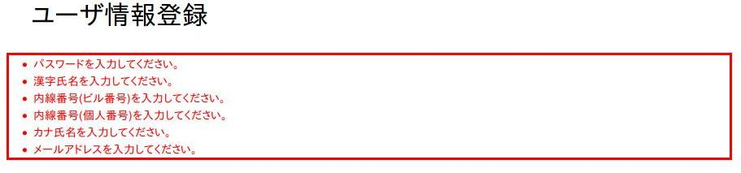

# 値のフォーマット出力

## 値のフォーマット出力

:ref:`WebView_WriteTag` と :ref:`WebView_TextTag` のvalueFormat属性でフォーマット出力を指定。形式: `"データタイプ{パターン}"` 。属性指定なしの場合はフォーマットなしで出力。

> **注意**: データタイプは「アプリケーションでのフォーマットの変更方法」で設定するデータタイプ名を使用すること。

> **注意**: `dateTime` は writeタグのみで使用できる。

## yyyymmdd

年月日フォーマット。

- 値: yyyyMMdd形式またはパターン形式文字列
- パターン: java.text.SimpleDateFormat構文。**y(年)・M(月)・d(日)のみ指定可能**
- パターン省略時: :ref:`WebView_CustomTagConfig` のデフォルトパターンを使用
- ロケール: `|`区切りで付加。省略時はThreadContext → システムデフォルト

```bash
valueFormat="yyyymmdd"                     # デフォルトパターン+ThreadContextロケール
valueFormat="yyyymmdd{yyyy/MM/dd}"         # パターン指定+ThreadContextロケール
valueFormat="yyyymmdd{|ja}"                # デフォルトパターン+ロケール指定
valueFormat="yyyymmdd{yyyy年MM月d日|ja}"   # パターン+ロケール指定
```

> **注意**: textタグでvalueFormat指定時、入力画面にもフォーマット値が出力される。アクションで年月日を取得する場合は :ref:`ExtendedValidation_yyyymmddConvertor` を使用すること。textタグとコンバータが連携し、valueFormatのパターンで値変換と入力精査を行う。

## yyyymm

年月フォーマット。値はyyyyMM形式またはパターン形式。使用方法はyyyymmddと同様。

> **注意**: yyyyMMの場合、コンバータには :ref:`ExtendedValidation_yyyymmConvertor` を使用する。

## dateTime

日時フォーマット。**writeタグのみで使用可能。**

- 値: java.util.Date型
- パターン: java.text.SimpleDateFormat構文
- デフォルト: ThreadContextのロケールとタイムゾーンに応じた日時を出力
- `|`区切りでロケールおよびタイムゾーンを明示指定可能
- :ref:`WebView_CustomTagConfig` でデフォルトパターンと`|`の変更が可能

```bash
valueFormat="dateTime"                                              # デフォルト+ThreadContext
valueFormat="dateTime{|ja|Asia/Tokyo}"                             # ロケール+タイムゾーン指定
valueFormat="dateTime{||Asia/Tokyo}"                                # タイムゾーンのみ指定
valueFormat="dateTime{yyyy年MMM月d日(E) a hh:mm|ja|America/New_York}}"  # 全指定
valueFormat="dateTime{yy/MM/dd HH:mm:ss||Asia/Tokyo}"              # パターン+タイムゾーン
```

## decimal

10進数フォーマット。

- 値: java.lang.Number型または数字の文字列（文字列の場合、言語対応の1000区切り文字を除去後フォーマット）
- パターン: java.text.DecimalFormat構文
- デフォルト: ThreadContextの言語を使用。`|`区切りで言語指定可能
- :ref:`WebView_CustomTagConfig` で`|`の変更が可能

```bash
valueFormat="decimal{###,###,###.000}"      # ThreadContext言語+パターン指定
valueFormat="decimal{###,###,###.000|ja}"   # パターン+言語指定
```

> **注意**: パターンに桁区切りと小数点を指定する場合、言語に関係なく常に桁区切りはカンマ・小数点はドットを使用すること。es(スペイン語)の場合は桁区切りがドット・小数点がカンマにフォーマットされるが、パターン指定は常にカンマ/ドットで行う:
>
> ```bash
> # es(スペイン語)の場合は、桁区切りがドット、小数点がカンマにフォーマットされる。
> # パターン指定では常に桁区切りにカンマ、小数点にドットを指定する。
> valueFormat="decimal{###,###,###.000|es}"
>
> # 下記は不正なパターン指定のため実行時例外がスローされる。
> valueFormat="decimal{###.###.###,000|es}"
> ```

> **注意**: textタグでvalueFormat指定時、入力画面にもフォーマット値が出力される。アクションで数値取得時は [数値コンバータ(BigDecimalConvertor、IntegerConvertor、LongConvertor)](libraries-validation_basic_validators.md) を使用する。textタグと数値コンバータが連携し、valueFormatの言語に対応した値変換と入力精査を行う。

`n:error` タグの属性:

| 属性名 | 必須 | デフォルト値 | 説明 |
|---|---|---|---|
| name | ○ | | エラーメッセージを表示する入力項目のname属性 |
| errorCss | | nablarch_error | エラーレベルのメッセージに使用するCSSクラス名 |
| messageFormat | | div | メッセージ表示フォーマット（`div`（divタグ）または `span`（spanタグ）） |

JSP使用例:
```jsp
<n:text name="systemAccount.loginId" size="22" maxlength="20" />
<n:error name="systemAccount.loginId" />
```

## 共通属性

4つのタグ（codeSelect、codeRadioButtons、codeCheckboxes、code）に共通する属性。

| 属性 | 必須 | デフォルト値 | 説明 |
|---|---|---|---|
| name | 選択項目のみ必須 | | 選択されたコード値をリクエストパラメータ/変数スコープから取得するname属性。表示項目の場合は変数スコープから取得するための名前。 |
| codeId | ○ | | コードID |
| pattern | | | 使用するパターンのカラム名。デフォルト指定なし。 |
| optionColumnName | | | 取得するオプション名称のカラム名 |
| labelPattern | | `$NAME$` | ラベル整形パターン。プレースホルダ: `$NAME$`（コード名称）、`$SHORTNAME$`（略称）、`$OPTIONALNAME$`（オプション名称、optionColumnName指定が必須）、`$VALUE$`（コード値） |
| listFormat | | `br` | リスト表示フォーマット: `br`（brタグ）、`div`（divタグ）、`span`（spanタグ）、`ul`（ulタグ）、`ol`（olタグ）、`sp`（スペース区切り） |

> **注意**: listFormat属性の適用範囲はタグにより異なる。codeSelectタグは確認画面用出力時のみ。codeRadioButtonsタグとcodeCheckboxesタグは入力・確認画面の両方（リスト要素をまとめるタグが元々存在しないため）。codeタグは表示専用のため画面種類を問わず常に使用。

以下のコードテーブルデータを使用した例を示す。

CODE_PATTERN テーブルのデータ例：

| ID | VALUE | PATTERN1 | PATTERN2 | PATTERN3 |
|---|---|---|---|---|
| 0001 | 01 | 1 | 0 | 0 |
| 0001 | 02 | 1 | 0 | 0 |
| 0002 | 01 | 1 | 0 | 0 |
| 0002 | 02 | 1 | 0 | 0 |
| 0002 | 03 | 0 | 1 | 0 |
| 0002 | 04 | 0 | 1 | 0 |
| 0002 | 05 | 1 | 0 | 0 |

CODE_NAME テーブルのデータ例：

| ID | VALUE | SORT_ORDER | LANG | NAME | SHORT_NAME | OPTION01 |
|---|---|---|---|---|---|---|
| 0001 | 01 | 1 | ja | 男性 | 男 | 0001-01-ja |
| 0001 | 02 | 2 | ja | 女性 | 女 | 0001-02-ja |
| 0002 | 01 | 1 | ja | 初期状態 | 初期 | 0002-01-ja |
| 0002 | 02 | 2 | ja | 処理開始待ち | 待ち | 0002-02-ja |
| 0002 | 03 | 3 | ja | 処理実行中 | 実行 | 0002-03-ja |
| 0002 | 04 | 4 | ja | 処理実行完了 | 完了 | 0002-04-ja |
| 0002 | 05 | 5 | ja | 処理結果確認完了 | 確認 | 0002-05-ja |
| 0001 | 01 | 2 | en | Male | M | 0001-01-en |
| 0001 | 02 | 1 | en | Female | F | 0001-02-en |
| 0002 | 01 | 1 | en | Initial State | Initial | 0002-01-en |
| 0002 | 02 | 2 | en | Waiting For Batch Start | Waiting | 0002-02-en |
| 0002 | 03 | 3 | en | Batch Running | Running | 0002-03-en |
| 0002 | 04 | 4 | en | Batch Execute Completed Checked | Completed | 0002-04-en |
| 0002 | 05 | 5 | en | Batch Result Checked | Checked | 0002-05-en |

> **注意**: SORT_ORDERは言語ごとに異なる場合がある（例: ID=0001/VALUE=01 は ja で SORT_ORDER=1、en で SORT_ORDER=2）。多言語環境では言語ごとに表示順が変わる。

アクションの実装例：
```java
BatchEntity batch = new BatchEntity();
batch.setStatus("03"); // "03"を設定
context.setRequestScopedVar("batch", batch);
```

```jsp
<n:codeSelect name="batch.status"
              codeId="0002" pattern="PATTERN2" optionColumnName="OPTION01"
              labelPattern="$VALUE$:$NAME$-$SHORTNAME$-$OPTIONALNAME$"
              listFormat="div" />
```

入力画面HTML出力：
```html
<select name="batch.status">
    <option value="">選択なし</option>
    <option value="03" selected="selected">03:処理実行中-実行-0002-03-ja</option>
    <option value="04">04:処理実行完了-完了-0002-04-ja</option>
</select>
```

確認画面HTML出力：
```html
<div>03:処理実行中-実行-0002-03-ja</div>
```

## codeCheckboxタグ

> **用途**: codeCheckboxタグはフラグに相当する値を扱うためのタグである。コード管理のパターン指定は使用しない。

| 属性 | 必須 | デフォルト値 | 説明 |
|---|---|---|---|
| value | | "1" | チェックありの場合に使用するコード値 |
| codeId | ○ | | コードID |
| optionColumnName | | | 取得するオプション名称のカラム名 |
| labelPattern | | "$NAME$" | ラベル整形パターン。プレースホルダ: `$NAME$`(コード名称)、`$SHORTNAME$`(略称)、`$OPTIONALNAME$`(オプション名称、使用時はoptionColumnName必須)、`$VALUE$`(コード値) |
| offCodeValue | | | チェックなしのコード値。未指定時はcodeId属性から検索: 検索結果が2件かつ1件がvalue属性値の場合、残りをチェックなしとして使用 |

> **重要**: コード値が2件以上の場合、codeIdからoffCodeValueを自動検索できないため、offCodeValue属性を明示的に指定すること。

チェックなしのリクエストパラメータ設定の仕組みは :ref:`WebView_SingleCheckBoxTag` を参照。

value・offCodeValue・labelPatternのデフォルト値は :ref:`WebView_CustomTagConfig` の **onCheckboxValueプロパティ**・**offCheckboxValueプロパティ**・**codeLabelPatternプロパティ** で設定可能。詳細は :ref:`WebView_CustomTagConfig` を参照。

ラベルはブランクでない場合のみ出力される。id属性未指定時、フレームワークが「nablarch_<checkbox><連番>」形式でid属性を生成（連番はcheckboxタグ出現順に1から）。

**コード値が2件のデータ（codeId:0001）の例**:

```jsp
<n:codeCheckbox name="user.canUpdate" codeId="0001" />
```

入力HTML出力:
```html
<input id="nablarch_checkbox1" type="checkbox" name="user.canUpdate" value="1" />
    <label for="nablarch_checkbox1">許可</label>
```

確認画面: チェックあり→"許可"（コード値1のNAME列）、チェックなし→"不許可"（コード値0のNAME列）

**コード値が2件以上のデータ（codeId:0002）の例**（offCodeValue明示指定が必要）:

```jsp
<n:codeCheckbox name="user.join" codeId="0002"
                value="Y" offCodeValue="N"
                labelPattern="$VALUE$:$SHORTNAME$($OPTIONALNAME$)"
                optionColumnName="OPTION01" />
```

入力HTML出力:
```html
<input id="nablarch_checkbox1" type="checkbox" name="user.join" value="Y" />
    <label for="nablarch_checkbox1">Y:YES(イエス)</label>
```

確認画面: チェックあり→"Y:YES(イエス)"（コード値YのラベルYES+オプション名称）、チェックなし→"N:NO(ノー)"（コード値NのラベルNO+オプション名称）

<details>
<summary>keywords</summary>

valueFormat, yyyymmdd, yyyymm, dateTime, decimal, ValueFormatter, SimpleDateFormat, DecimalFormat, フォーマット出力, 日付フォーマット, 金額フォーマット, WebView_WriteTag, WebView_TextTag, WebView_CustomTagConfig, ExtendedValidation_yyyymmddConvertor, ExtendedValidation_yyyymmConvertor, BigDecimalConvertor, IntegerConvertor, LongConvertor, n:error, name, errorCss, messageFormat, nablarch_error, エラーメッセージ表示, 入力項目エラー, codeSelect, codeRadioButtons, codeCheckboxes, code, codeId, pattern, optionColumnName, labelPattern, listFormat, コード値表示, 選択タグ共通属性, codeCheckbox, n:codeCheckbox, offCodeValue, onCheckboxValueプロパティ, offCheckboxValueプロパティ, codeLabelPatternプロパティ, コードチェックボックス, チェックボックス, コード値, フラグ入力, $NAME$, $SHORTNAME$, $OPTIONALNAME$, $VALUE$

</details>

## フォーマット出力の使用例

年月日に `yyyy/M/d` パターンを指定してフォーマット出力する例:

```jsp
<tr>
    <td class="boldTd" width="300" bgcolor="#ffff99">
        有効期限
    </td>
    <td width="400">
        <n:write name="systemAccount.effectiveDateFrom" valueFormat="yyyymmdd{yyyy/M/d}" />
        ～
        <n:write name="systemAccount.effectiveDateTo" valueFormat="yyyymmdd{yyyy/M/d}" />
    </td>
</tr>
```

出力対象の年月日が `"20101203"` の場合のHTML出力:

```html
<tr>
    <td class="boldTd" width="300" bgcolor="#ffff99">
        有効期限
    </td>
    <td width="400">
        2010/12/3
        ～
        2011/12/3
    </td>
</tr>
```

`n:error` タグのデフォルト出力はdivタグ。エラーがない項目は何も出力されない。

HTML出力例:
```html
<input class="nablarch_error" name="users.kanjiName" value="" type="text">
<div class="nablarch_error">漢字氏名を入力してください。</div>
```

> **注意**: errorタグで表示するエラーメッセージは、通常 [バリデーションの機能](libraries-validation-core_library.md) で自動設定される。バリデーション機能以外から任意のメッセージを表示する場合は :ref:`validation-message-creation` に記載した方法でエラーメッセージを作成すること。

## codeRadiobuttonsタグ、codeCheckboxesタグ

追加属性なし。共通属性（s1参照）のみ使用する。

ラベル出力時にlabelタグを出力する。idはフレームワークが`nablarch_<radio|checkbox><連番>`形式で自動生成する。連番は画面内でradioまたはcheckboxタグの出現順に1から付与。

tabindex属性で指定した値はすべてのinputタグに出力される。

```jsp
<n:codeRadioButtons name="team.color" tabindex="3"
          codeId="0001" labelPattern="$VALUE$:$NAME$" />
<n:codeCheckboxes name="team.titles" tabindex="5"
          codeId="0002" labelPattern="$VALUE$:$NAME$" />
```

HTML出力例（入力画面）：
```html
<input id="nablarch_radio1" tabindex="3" type="radio" name="team.color" value="001"><label for="nablarch_radio1">001:red</label><br>
<input id="nablarch_radio2" tabindex="3" type="radio" name="team.color" value="002"><label for="nablarch_radio2">002:blue</label><br>
<input id="nablarch_radio3" tabindex="3" type="radio" name="team.color" value="003"><label for="nablarch_radio3">003:green</label><br>
<input id="nablarch_radio4" tabindex="3" type="radio" name="team.color" value="004"><label for="nablarch_radio4">004:yellow</label><br>
<input id="nablarch_radio5" tabindex="3" type="radio" name="team.color" value="005"><label for="nablarch_radio5">005:pink</label><br>
<input id="nablarch_checkbox1" tabindex="5" type="checkbox" name="team.titles" value="01"><label for="nablarch_checkbox1">01:地区優勝</label><br>
<input id="nablarch_checkbox2" tabindex="5" type="checkbox" name="team.titles" value="02"><label for="nablarch_checkbox2">02:リーグ優勝</label><br>
<input id="nablarch_checkbox3" tabindex="5" type="checkbox" name="team.titles" value="03"><label for="nablarch_checkbox3">03:ファイナル優勝</label><br>
```

<details>
<summary>keywords</summary>

valueFormat使用例, n:write, yyyymmdd, フォーマット出力例, 年月日フォーマット, n:error, nablarch_error, divタグ, エラーメッセージ出力, バリデーション, validation-message-creation, codeRadioButtons, codeCheckboxes, nablarch_radio, nablarch_checkbox, tabindex, ラジオボタン, チェックボックス, コード値選択

</details>

## 入力画面でフォーマット出力する際の注意点

> **注意**: 入力項目に指定されたフォーマットはウィンドウスコープで管理される。入力値をウィンドウスコープに設定しないと、フォーマット編集が行えない。入力画面でフォーマット出力を行う際は、以下のように入力値をウィンドウスコープに設定すること。

```jsp
<%--
入力項目がウィンドウスコープに設定されるように、n:formのwindowScopePrefixes属性には、
「searchCondition」を設定する。
--%>
<n:form windowScopePrefixes="searchCondition">
  <n:text name="searchCondition.yyyymmdd" valueFormat="yyyymmdd{yyyy年MM月dd日|ja}" />
  <n:text name="searchCondition.yyyymm" valueFormat="yyyymm{yyyy年MM月|ja}" />
</n:form>
```

エラーがあった入力項目のカスタムタグは、class属性にCSSクラス名（デフォルト: `nablarch_error`）を追記する。`errorCss`属性でクラス名を変更可能。

CSS指定例（エラー項目の背景を黄色に）:
```css
input.nablarch_error, select.nablarch_error { background-color: #FFFF00; }
```

## codeSelectタグ

共通属性（s1参照）に加え、以下の属性を追加。

| 属性 | 必須 | デフォルト値 | 説明 |
|---|---|---|---|
| withNoneOption | | `false` | リスト先頭に「選択なし」オプションを追加するか（true: 追加、false: 追加しない） |
| noneOptionLabel | | `""` | 「選択なし」オプションのラベル。withNoneOptionがtrueの場合のみ有効。 |

使用例は :ref:`WebView_MultiSelectCustomTag` を参照。

<details>
<summary>keywords</summary>

windowScopePrefixes, ウィンドウスコープ, n:form, n:text, 入力画面フォーマット, searchCondition, nablarch_error, errorCss, CSSクラス, ハイライト表示, codeSelect, withNoneOption, noneOptionLabel, セレクトボックス, 選択なしオプション

</details>

## アプリケーションでのフォーマットの変更方法

**インタフェース**: `nablarch.common.web.tag.ValueFormatter`

ValueFormatterを実装したクラスをMap型（キー: データタイプ名、値: 実装クラス）で `"valueFormatters"` という名前でリポジトリに登録することでフォーマットを変更できる。リポジトリ未登録時はフレームワークのデフォルトフォーマットを使用。

デフォルトフォーマットの設定例:

```xml
<map name="valueFormatters">
    <entry key="yyyymmdd">
        <value-component class="nablarch.common.web.tag.YYYYMMDDFormatter" />
    </entry>
    <entry key="dateTime">
        <value-component class="nablarch.common.web.tag.DateTimeFormatter" />
    </entry>
    <entry key="decimal">
        <value-component class="nablarch.common.web.tag.DecimalFormatter" />
    </entry>
</map>
```

複数の入力項目が関連するエラー（項目間バリデーション）で複数項目をハイライト表示するには、`nameAlias` 属性を使用する。

**問題の背景**: 携帯電話番号（市外・市内・加入）の項目間バリデーションで、エラーメッセージを `mobilePhoneNumberAreaCode` というプロパティ名で登録すると、対応する1つの入力項目だけがハイライト表示される。3つ全ての入力項目がハイライトされるべきだが、1つしかハイライトされない。

項目間バリデーションの実装例（3フィールドすべて入力済み、またはすべて未入力かをチェック）:
```java
public static void validateForRegisterUser(ValidationContext<UsersEntity> context) {
    // userIdを無視してバリデーションを実行
    ValidationUtil.validateWithout(context, REGISTER_USER_SKIP_PROPS);

    // 単項目精査でエラーの場合はここで戻る
    if (!context.isValid()) {
        return;
    }

    // 携帯電話番号(市外、市内、加入)の項目間精査
    // 全て入力されている、もしくは、全て入力されていない
    String mobilePhoneNumberAereaCode = (String) context.getConvertedValue("mobilePhoneNumberAreaCode");
    String mobilePhoneNumberCityCode = (String) context.getConvertedValue("mobilePhoneNumberCityCode");
    String mobilePhoneNumberSbscrCode = (String) context.getConvertedValue("mobilePhoneNumberSbscrCode");

    if (!((mobilePhoneNumberAereaCode.length() != 0
                   && mobilePhoneNumberCityCode.length() != 0
                   && mobilePhoneNumberSbscrCode.length() != 0)
                  || (mobilePhoneNumberAereaCode.length() == 0
                              && mobilePhoneNumberCityCode.length() == 0
                              && mobilePhoneNumberSbscrCode.length() == 0))) {
        context.addResultMessage("mobilePhoneNumberAreaCode", "MSG00004");
    }
}
```

**解決策**: 各入力項目の `nameAlias` 属性に共通のエイリアス名を指定し、エラーメッセージをそのエイリアス名で登録する。

JSP（nameAlias指定）:
```jsp
<n:text name="users.mobilePhoneNumberAreaCode" nameAlias="users.mobilePhoneNumber" size="5" maxlength="3" />&nbsp;-&nbsp;
<n:text name="users.mobilePhoneNumberCityCode" nameAlias="users.mobilePhoneNumber" size="6" maxlength="4" />&nbsp;-&nbsp;
<n:text name="users.mobilePhoneNumberSbscrCode" nameAlias="users.mobilePhoneNumber" size="6" maxlength="4" />
```

Java（エイリアス名でメッセージ登録）:
```java
context.addResultMessage("mobilePhoneNumber", "MSG00004");
```

これにより、3つ全ての入力項目がハイライト表示される。

## codeタグ

追加属性なし。共通属性（s1参照）のみ使用する。

- name属性を省略した場合：codeIdとpatternで取得できる全てのコード値を表示する。
- name属性が指定された場合：表示専用タグのため、変数スコープから値を取得する。

アクションの実装例：
```java
BatchEntity batch = new BatchEntity();
batch.setStatus("03"); // "03"を設定
context.setRequestScopedVar("batch", batch);
```

```jsp
<%-- name属性を指定した場合 --%>
<n:code name="batch.status"
        codeId="0002" pattern="PATTERN2" optionColumnName="OPTION01"
        labelPattern="$VALUE$:$NAME$-$SHORTNAME$-$OPTIONALNAME$"
        listFormat="div" />

<%-- name属性を省略した場合 --%>
<n:code codeId="0002" pattern="PATTERN2" optionColumnName="OPTION01"
        labelPattern="$VALUE$:$NAME$-$SHORTNAME$-$OPTIONALNAME$"
        listFormat="div" />
```

HTML出力例：
```html
<%-- name属性を指定した場合 --%>
<div>03:処理実行中-実行-0002-03-ja</div>

<%-- name属性を省略した場合 --%>
<div>03:処理実行中-実行-0002-03-ja</div>
<div>04:処理実行完了-完了-0002-04-ja</div>
```

<details>
<summary>keywords</summary>

ValueFormatter, YYYYMMDDFormatter, DateTimeFormatter, DecimalFormatter, valueFormatters, フォーマットカスタマイズ, nablarch.common.web.tag.ValueFormatter, nameAlias, 項目間バリデーション, addResultMessage, validateForRegisterUser, ValidationUtil, ValidationContext, 複数項目ハイライト, code, codeId, コード値表示, 表示専用, name属性省略, 変数スコープ

</details>

## エラー表示

エラー表示用のカスタムタグ:

| カスタムタグ | 説明 |
|---|---|
| :ref:`WebView_ErrorsTag` | 複数のエラーメッセージをリスト表示する場合に使用 |
| :ref:`WebView_ErrorTag` | エラーの原因となった入力項目の近くにエラーメッセージを個別表示する場合に使用 |

errorsタグとerrorタグはリクエストスコープからApplicationExceptionを取得してエラーメッセージを出力する。ApplicationExceptionはWebフロントコントローラの例外制御（OnErrorアノテーション）でリクエストスコープに設定する。

**アノテーション**: `@OnError`

```java
@OnError(type = ApplicationException.class, path = "forward://MENUS00103")
public HttpResponse doUSERS00201(HttpRequest req, ExecutionContext ctx) {
    // 省略
}
```

コード管理機能から取得したコード値の選択項目・表示項目を出力するカスタムタグ。コード管理機能は [../../03_Common/02_CodeManager](libraries-02_CodeManager.md) を参照。

| カスタムタグ | 出力するHTMLタグ |
|---|---|
| :ref:`WebView_CodeSelectTag` | selectタグ |
| :ref:`WebView_CodeRadiobuttonsTag` | 複数のinputタグ（type=radio） |
| :ref:`WebView_CodeCheckboxesTag` | 複数のinputタグ（type=checkbox） |
| :ref:`WebView_CodeCheckboxTag` | 単一のinputタグ（type=checkbox） |
| :ref:`WebView_CodeTag` | 指定されたファーマットに対応するタグ |

- `code`タグ以外は選択項目を出力。`code`タグは表示項目を出力（:ref:`WebView_WriteTag` と同様、一覧・参照画面でのコード値表示用途）。
- `codeCheckbox`タグ: DB上でフラグ（1or0）で表されるデータ項目に対し、コード管理機能でチェック有無のラベルを管理したい場合に使用。単一のinputタグ（type=checkbox）を出力し、チェックなしに対応する値をリクエストパラメータに設定する（:ref:`WebView_SingleCheckBoxTag` と同様）。

<details>
<summary>keywords</summary>

エラー表示, ApplicationException, OnError, errorsタグ, errorタグ, WebView_ErrorsTag, WebView_ErrorTag, WebView_CodeSelectTag, WebView_CodeRadiobuttonsTag, WebView_CodeCheckboxesTag, WebView_CodeCheckboxTag, WebView_CodeTag, WebView_WriteTag, WebView_SingleCheckBoxTag, コード値表示, コード管理, codeCheckbox, selectタグ

</details>

## errorsタグ

| 属性 | デフォルト値 | 説明 |
|---|---|---|
| cssClass | nablarch_errors | リスト表示のulタグに使用するCSSクラス名 |
| infoCss | nablarch_info | 情報レベルメッセージのCSSクラス名 |
| warnCss | nablarch_warn | 警告レベルメッセージのCSSクラス名 |
| errorCss | nablarch_error | エラーレベルメッセージのCSSクラス名 |
| filter | all | `all`(全メッセージ表示)または`global`(入力項目に対応しないメッセージのみ表示)。`global`の場合、ValidationResultMessageのプロパティ名が入っているメッセージを取り除いて出力する。 |

```jsp
<n:errors />
```

HTML出力例:

```html
<ul class="nablarch_errors">
    <li class="nablarch_error">パスワードを入力してください。</li>
    <li class="nablarch_error">漢字氏名を入力してください。</li>
    <li class="nablarch_error">内線番号(ビル番号)を入力してください。</li>
    <li class="nablarch_error">内線番号(個人番号)を入力してください。</li>
    <li class="nablarch_error">カナ氏名を入力してください。</li>
    <li class="nablarch_error">メールアドレスを入力してください。</li>
</ul>
```



<details>
<summary>keywords</summary>

errorsタグ, cssClass, infoCss, warnCss, errorCss, filter, nablarch_errors, nablarch_error, nablarch_info, nablarch_warn, ValidationResultMessage, エラーメッセージリスト表示

</details>

## errorタグ

エラーの原因となった入力項目の近くにエラーメッセージを個別に表示する場合に使用するタグ（ :ref:`WebView_ErrorTag` ）。errorsタグと同様に、リクエストスコープからApplicationExceptionを取得してエラーメッセージを出力する。

<details>
<summary>keywords</summary>

errorタグ, WebView_ErrorViewErrorTag, WebView_ErrorTag, 個別エラーメッセージ表示

</details>
