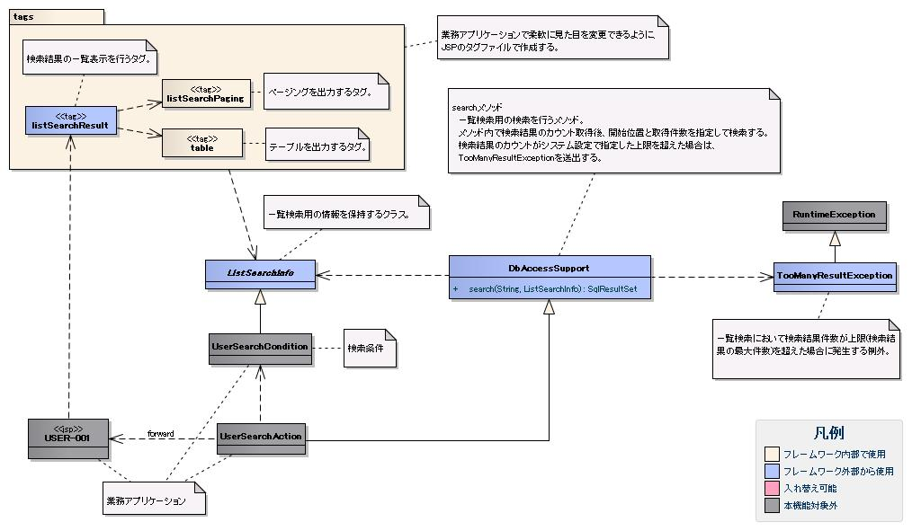

# 検索結果の一覧表示

## 

検索結果の一覧表示が提供する機能:

- 検索結果件数の表示
- 1画面に全検索結果を表示する一覧表示
- 指定件数毎に表示するページング
- 検索結果の並び替え

## 検索結果件数

`useResultCount`属性にtrue（デフォルト: true）が指定され、検索結果がリクエストスコープに存在する場合に表示される。

デフォルト書式: `検索結果 {ListSearchInfoのresultCountプロパティ}件`

書式変更: `resultCountFragment`属性にJSPフラグメントを指定する。フラグメントは`listSearchInfoName`属性で指定した名前でListSearchInfoオブジェクトにアクセス可能。

指定例:
```jsp
<n:listSearchResult listSearchInfoName="searchCondition"
                    searchUri="./USERS00101"
                    resultSetName="searchResult">
    <jsp:attribute name="resultCountFragment">
       [サーチ結果 <n:write name="searchCondition.resultCount" />頁]
    </jsp:attribute>
</n:listSearchResult>
```

検索結果の並び替えは、並び替え用の列見出しを出力する :ref:`WebView_ListSearchSortSubmitTag` と、データベースアクセス機能が提供する可変ORDER BY構文（ORDER BY句を動的に変更する構文）を使用した検索処理により実現する。可変ORDER BY構文の詳細は :ref:`VariableOrderBySyntaxConvertorクラス<variable_order_by_syntax_convertor-label>` 参照。

検索結果の一覧表示機能の画面表示をカスタマイズする場合、フレームワーク提供のタグファイルを業務アプリケーションの `/WEB-INF/tags` にコピーし、直接編集する。

**タグファイル構成**:

| タグファイル | 内容 |
|---|---|
| /META-INF/tags/listSearchResult.tag | 検索結果のリスト表示 |
| /META-INF/tags/listSearchPaging.tag | ページング部分の出力 |
| /META-INF/tags/listSearchSortSubmit.tag | ソート用リンクの出力 |
| /META-INF/tags/listSearchSubmit.tag | ページ間移動リンクの出力 |
| /META-INF/tags/listSearchParams.tag | ページ移動リンクに初回検索条件を保持する `<n:param>` タグを出力（表示上の不整合防止のため `listSearchSubmit.tag` 等で使用） |
| /META-INF/tags/table.tag | 検索結果テーブルの出力 |

**カスタマイズ手順**（ページ番号テキスト入力追加の例）:

1. 対象タグファイルを `/WEB-INF/tags` にコピー:
   - `/META-INF/tags/listSearchResult.tag`
   - `/META-INF/tags/listSearchPaging.tag`

2. `listSearchPaging.tag` にページ番号テキスト入力を追加（「最後」サブミットの後ろ）:

```jsp
<c:if test="${usePageNumberSubmit && listSearchInfo.pageCount != 1}">
    <br />
    <div style="float: right;">
        <div>ページ番号<n:text name="${listSearchInfoName}.pageNumber" style="width: 2em;" /></div>
        <n:listSearchSubmit tag="submit"
                            type="button"
                            css="${pageNumberSubmitCss}"
                            label="変更"
                            enable="true"
                            uri="${searchUri}"
                            name="manualPageNumberSubmit"
                            pageNumber=""
                            listSearchInfoName="${listSearchInfoName}" />
    </div>
</c:if>
```

3. `listSearchResult.tag` で業務アプリケーション配置のタグを使用するよう変更（`n:listSearchPaging` → `tags:listSearchPaging`）:

```jsp
<%@ taglib prefix="tags" tagdir="/WEB-INF/tags" %>
<tags:listSearchPaging ...>
    ...
</tags:listSearchPaging>
```

4. 検索画面JSPも同様に変更（`n:listSearchResult` → `tags:listSearchResult`）:

```jsp
<%@ taglib prefix="tags" tagdir="/WEB-INF/tags" %>
<tags:listSearchResult ...>
    ...
</tags:listSearchResult>
```

<details>
<summary>keywords</summary>

検索結果一覧表示, ページング, 並び替え, 検索結果件数表示, 一覧表示機能, useResultCount, resultCountFragment, listSearchInfoName, ListSearchInfo, resultCount, JSPフラグメント, listSearchSortSubmit, 検索結果並び替え, 可変ORDER BY, VariableOrderBySyntaxConvertor, ソートID, listSearchResult.tag, listSearchPaging.tag, listSearchSortSubmit.tag, listSearchSubmit.tag, listSearchParams.tag, table.tag, n:param, n:listSearchSubmit, 検索結果一覧カスタマイズ, タグファイル, /WEB-INF/tags

</details>

## 検索結果の一覧表示の全体構造

検索結果の一覧表示は以下のクラスとタグで実現される:

- :ref:`WebView_ListSearchResultDbAccessSupport` — 一覧検索用の検索処理を提供
- :ref:`WebView_ListSearchResultListSearcInfo` — 一覧検索用の情報を保持
- :ref:`WebView_ListSearchResultListSearchResultTag` — 検索結果の一覧表示を行う

ページングを使用する場合、フレームワークが上記タグとクラスによりページング処理を提供するため、業務アプリケーションはページングを作り込みせずに実現できる。



## ページング

`usePaging`属性にtrue（デフォルト: true）が指定された場合に表示される。ページング全体は検索結果件数が1件以上の場合に表示される。

**ページング画面要素と表示条件**:

| 画面要素 | 表示条件 |
|---|---|
| 現在のページ番号 | 常に表示 |
| 最初、前へ、次へ、最後 | 遷移可能な場合はサブミット可能状態。遷移不可の場合はリンクならラベル、ボタンなら使用不可状態 |
| ページ番号（1..n） | 総ページ数が2以上の場合のみ表示。各ページ番号は、遷移可能な場合はサブミット可能状態、遷移不可の場合はリンクならラベル、ボタンなら使用不可状態で表示 |

指定可能な代表的属性:
- 各画面要素の使用有無
- 各画面要素のラベル（最初、前へ、次へ、最後など）
  - 現在のページ番号はJSPフラグメントによる変更可
  - ページ番号はラベルに使用するため変更不可
- 各サブミット要素のタグ（n:submitLink、n:submit、n:buttonのいずれか）

> **重要**: ページング時の検索条件は前回検索時の条件を使用する。検索条件を変更してからページングを行った場合、変更した検索条件の値は破棄される。

検索条件の維持は、フレームワークがページングのサブミット要素に検索条件を変更パラメータとして設定することで実現する。変更パラメータに指定する検索条件は、:ref:`WebView_ListSearchResultListSearcInfo` の`getSearchConditionProps`メソッドが返すプロパティ名を使用してListSearchInfoから取得する。

**検索結果が減少した場合の動作**（前提: 取得件数20件/ページ、検索結果100件中3ページ目選択後、2ページ目（または前へ）を選択した後に検索結果が10件に減少した場合）:

| 画面要素 | 表示内容 |
|---|---|
| 現在のページ番号 | 2/1ページ（2ページ目指定、検索結果20件以下のため） |
| 最初、前へ | リンクで表示（前のページに遷移可能） |
| 次へ、最後 | ラベルで表示（次のページに遷移不可） |
| ページ番号 | 非表示（総ページ数1のため） |

現在のページ番号とサブミット要素の対応が取れているため操作不能にならない。「前へ」選択後は正常な状態に戻る。

検索結果の並び替えを行うには、可変ORDER BY構文を使用してSQL文を定義する。`$sort (sortId)`構文を使い、`sortId`フィールド値に応じたORDER BY句に動的変換する。例えば`sortId`=3の場合、`ORDER BY USR.MAIL_ADDRESS`に変換される。

```sql
$sort (sortId) {
   (1 SA.LOGIN_ID)
   (2 SA.LOGIN_ID DESC)
   (3 USR.MAIL_ADDRESS)
   (4 USR.MAIL_ADDRESS DESC) }
```

ListSearchInfoクラスはsortIdプロパティを持つ。並び替えを行う場合、sortIdプロパティを入力精査に含め、`getSearchConditionProps()`の返す配列に`"sortId"`を含める。

```java
public class UserSearchCondition extends ListSearchInfo {
    public UserSearchCondition(Map<String, Object> params) {
        // 検索条件のプロパティ設定は省略。
        setSortId((String) params.get("sortId"));
    }

    @PropertyName("ソートID")
    @Required
    public void setSortId(String sortId) {
        super.setSortId(sortId);
    }

    private static final String[] SEARCH_COND_PROPS = new String[] { ..., "sortId"};

    public String[] getSearchConditionProps() {
        return SEARCH_COND_PROPS;
    }
}
```

入力画面と確認画面が1対1に対応する場合、入力画面のJSPで実装を共通化することで確認画面のJSP作成工数を削減できる。

- 共通実装は入力画面のJSPで行い、確認画面のJSPは入力画面のJSPへのフォワードのみ行う
- アクションは入力・確認画面それぞれ別JSPにフォワードする（仕様変更時の影響を最小化するため）

確認画面のJSPでは :ref:`WebView_ConfirmationPageTag` を使用してフォワードを行う。入力・確認画面のJSPは同一ディレクトリに配置することが多いため相対パスで指定できる:

```jsp
<%-- USER003.jspは入力画面のJSP --%>
<n:confirmationPage path="./USER003.jsp" />
```

<details>
<summary>keywords</summary>

DbAccessSupport, ListSearchInfo, listSearchResultタグ, 一覧検索全体構造, ページング実装, usePaging, getSearchConditionProps, WebView_ListSearchResultListSearcInfo, n:submitLink, n:submit, n:button, ページング, 検索条件, 現在のページ番号, UserSearchCondition, sortId, @PropertyName, @Required, SEARCH_COND_PROPS, 可変ORDER BY, ソートID, $sort, n:confirmationPage, WebView_ConfirmationPageTag, 入力画面と確認画面の共通化, 確認画面フォワード

</details>

## DbAccessSupportクラス

**クラス**: `DbAccessSupport`

一覧検索用の`search`メソッドを提供する。詳細は [db-support-label](libraries-04_Statement.md) 参照。

`search(SQL_ID, ListSearchInfo)`の処理順:

1. SQL_IDとListSearchInfoから検索結果の件数取得
2. 件数が上限超過 → `TooManyResultException`を送出
3. 件数が上限以内 → 検索実行し結果を返す。検索結果件数はListSearchInfoに設定される

SQL文はSELECT文のみ指定する。件数取得や開始位置・取得件数の指定はフレームワークが担当する。

`TooManyResultException`は最大件数（上限）と実際の取得件数を保持する。上限設定は :ref:`WebView_ListSearchResultSetting` 参照。

```java
public class UserSearchAction extends DbAccessSupport {
    @OnError(type = ApplicationException.class, path = "/management/user/USER-001.jsp")
    public HttpResponse doUSERS00101(HttpRequest req, ExecutionContext ctx) {
        UserSearchCondition condition = ...;
        SqlResultSet searchResult = null;
        try {
            searchResult = search("SELECT_USER_BY_CONDITION", condition);
        } catch (TooManyResultException e) {
            throw new ApplicationException(
                MessageUtil.createMessage(MessageLevel.ERROR, "MSG00024", e.getMaxResultCount()));
        }
    }
}
```

## 検索結果テーブル必須属性

`n:listSearchResult`タグの検索結果テーブル関連の必須属性（:ref:`WebView_ListSearchResultTableElement` 参照）:

| 属性 | 必須 | 説明 |
|---|---|---|
| resultSetName | ○ | 検索結果をリクエストスコープから取得する際に使用する名前 |
| headerRowFragment | ○ | ヘッダ行のJSPフラグメント |
| bodyRowFragment | ○ | ボディ行のJSPフラグメント |

## 検索結果テーブル

検索結果は、検索結果がリクエストスコープに存在する場合は常に表示される。検索結果が0件の場合は、ヘッダ行のみ表示される。ボディ行のJSPフラグメントはJSTLのc:forEachタグのループ内で呼び出される。

**ボディ行フラグメント用変数属性**:

| 属性 | デフォルト値 | 説明 |
|---|---|---|
| varRowName | `row` | 行データ（c:forEachのvar属性）の変数名 |
| varStatusName | `status` | ステータス（c:forEachのstatus属性）の変数名 |
| varCountName | `count` | ステータスのcountプロパティの変数名 |
| varRowCountName | `rowCount` | 検索結果のカウント（取得開始位置＋ステータスカウント）の変数名 |

> **注意**: `n:write`タグでステータスにアクセスするとエラーが発生し値を取得できない。`n:set`タグを使用すること。例: `<n:set var="rowCount" value="${status.count}" />`

**奇数偶数行スタイル用属性**:

| 属性 | デフォルト値 | 説明 |
|---|---|---|
| varOddEvenName | `oddEvenCss` | ボディ行のclass属性参照用変数名 |
| oddValue | `nablarch_odd` | 奇数行のclass属性値 |
| evenValue | `nablarch_even` | 偶数行のclass属性値 |

ボディ行JSPフラグメント指定例:
```jsp
<n:listSearchResult listSearchInfoName="searchCondition"
                    searchUri="./USERS00101"
                    resultSetName="searchResult">
    <jsp:attribute name="headerRowFragment">
        <tr>
            <th>ログインID</th>
            <th>漢字氏名</th>
            <th>カナ氏名</th>
            <th>グループ</th>
            <th>内線番号</th>
            <th>メールアドレス</th>
        </tr>
    </jsp:attribute>
    <jsp:attribute name="bodyRowFragment">
        <tr class="<n:write name="oddEvenCss" />">
            <td>[<n:write name="count" />][<n:write name="rowCount" />]<n:write name="row.loginId" /></td>
            <td><n:write name="row.kanjiName" /></td>
            <td><n:write name="row.kanaName" /></td>
            <td><n:write name="row.ugroupId" />:<n:write name="row.ugroupName" /></td>
            <td><n:write name="row.extensionNumberBuilding" />-<n:write name="row.extensionNumberPersonal" /></td>
            <td><n:write name="row.mailAddress" /></td>
        </tr>
    </jsp:attribute>
</n:listSearchResult>
```

listSearchSortSubmitタグは、並び替え用のサブミット要素を出力する。全属性は :ref:`WebView_ListSearchSortSubmitTag` 参照。

| 属性 | 必須 | デフォルト値 | 説明 |
|---|---|---|---|
| sortCss | | nablarch_sort | 並び替えサブミットのclass属性（常に出力） |
| ascCss | | nablarch_asc | 昇順時に付加するclass属性（例: `class="nablarch_sort nablarch_asc"`） |
| descCss | | nablarch_desc | 降順時に付加するclass属性（例: `class="nablarch_sort nablarch_desc"`） |
| ascSortId | ○ | | 昇順のソートID |
| descSortId | ○ | | 降順のソートID |
| defaultSort | | asc | デフォルトのソート方向（asc/desc） |
| label | ○ | | サブミットのラベル |
| name | ○ | | name属性（画面内で一意にすること） |
| listSearchInfoName | ○ | | リクエストスコープからListSearchInfoを取得する名前 |

```jsp
<n:listSearchSortSubmit ascSortId="1" descSortId="2"
                        label="ログインID" uri="./USERS00101"
                        name="loginIdSort" listSearchInfoName="searchCondition" />
```

並び替えのサブミット要素では、検索フォームから検索された時点の検索条件を使用して検索を実行する。検索条件の維持は、フレームワークが並び替えのサブミット要素に検索条件を変更パラメータとして設定することで実現する。変更パラメータに指定する検索条件は、`ListSearchInfo`の`getSearchConditionProps()`が返すプロパティ名を使用して`ListSearchInfo`から取得する。このため、s2で解説した通り、並び替えに使用するプロパティ（`sortId`など）を`getSearchConditionProps()`の返す配列に含める必要がある。

並び替えのサブミット要素は常に先頭ページ（ページ番号:1）を検索する。並び替えが変更された場合、検索前のページ番号は異なる並び順に対する相対位置となり意味のあるページ位置とならないためである。

**現在の並び替え状態に応じた動作**（`ascSortId="1" descSortId="2"`の場合）:

| 検索に使用されたソートID | リクエスト送信するソートID | 使用されるCSSクラス |
|---|---|---|
| 1 (= ascSortId) | descSortId(=2) | ascCss (nablarch_asc) |
| 2 (= descSortId) | ascSortId(=1) | descCss (nablarch_desc) |
| その他 | defaultSort(=asc)に応じてascSortId(=1) | なし |

**CSS実装例**（昇順/降順の視覚表示）:

```css
a.nablarch_sort { padding-right: 15px; background-position: 100% 0%; background-repeat: no-repeat; }
a.nablarch_asc { background-image: url("../img/asc.jpg"); }
a.nablarch_desc { background-image: url("../img/desc.jpg"); }
```

入力画面のみ・確認画面のみでボディを評価するタグを使い、表示を切り替える:

| カスタムタグ | 出力するHTMLタグ |
|---|---|
| :ref:`WebView_ForInputPageTag` | 入力画面のみボディを評価する。 |
| :ref:`WebView_ForConfirmationPageTag` | 確認画面のみボディを評価する。 |

<details>
<summary>keywords</summary>

DbAccessSupport, search, TooManyResultException, SQL_ID, ListSearchInfo, 件数取得上限, ページング検索, resultSetName, headerRowFragment, bodyRowFragment, varRowName, varStatusName, varCountName, varRowCountName, varOddEvenName, oddValue, evenValue, n:listSearchResult, n:set, n:write, c:forEach, 奇数偶数行スタイル, nablarch_odd, nablarch_even, WebView_ListSearchResultTableElement, listSearchSortSubmit, ascSortId, descSortId, sortCss, ascCss, descCss, defaultSort, label, name, listSearchInfoName, 昇順, 降順, nablarch_sort, nablarch_asc, nablarch_desc, getSearchConditionProps, 変更パラメータ, 検索条件維持, n:forInputPage, n:forConfirmationPage, WebView_ForInputPageTag, WebView_ForConfirmationPageTag, 入力画面表示切り替え, 確認画面表示切り替え

</details>

## ListSearchInfoクラス

**クラス**: `ListSearchInfo`

業務アプリケーションの検索条件クラスは`ListSearchInfo`を継承して作成する。

`ListSearchInfo`継承クラスの必須実装:
- ページング用プロパティ`pageNumber`（取得対象のページ番号）を入力精査に含める

アクションの必須実装:
- 検索結果表示時、`ListSearchInfo`継承クラスのオブジェクトをリクエストスコープに設定する

**`getSearchConditionProps()`メソッド**:

オーバーライドして検索条件のプロパティ名を返す。通常は入力精査対象プロパティと同じとなる。ページングの各サブミット要素（前へ・次へなど）が検索条件をサブミットする際に使用される。

```java
public class UserSearchCondition extends ListSearchInfo {
    public UserSearchCondition(Map<String, Object> params) {
        setPageNumber((Integer) params.get("pageNumber"));
    }

    @PropertyName("ページ番号")
    @Required
    @NumberRange(max = 10, min = 1)
    @Digits(integer = 2)
    public void setPageNumber(Integer pageNumber) {
        super.setPageNumber(pageNumber);
    }

    private static final String[] SEARCH_COND_PROPS = new String[] { ..., "pageNumber"};

    // 検索条件のプロパティ名を返す。ページングのサブミット要素が検索条件をサブミットする際に使用する。
    public String[] getSearchConditionProps() {
        return SEARCH_COND_PROPS;
    }
}
```

アクション実装例（リクエストスコープ設定部分）:
```java
UserSearchCondition condition = searchConditionCtx.createObject();
ctx.setRequestScopedVar("searchCondition", condition); // ListSearchInfo継承クラスをリクエストスコープに設定
searchResult = search("SELECT_USER_BY_CONDITION", condition);
ctx.setRequestScopedVar("searchResult", searchResult);
```

なし

1画面にすべての検索結果を一覧表示する（ページングなし）場合の実装方法。基本的な実装方法はページングを使用する場合と変わらない。検索処理や並び替えの処理もページングを使用する場合と同じ実装方法となる。

> **重要**: ページングを使用しない場合、`condition.setMax(condition.getMaxResultCount())`の設定が必須。検索結果の取得件数に最大件数（上限）を設定しないと正しく動作しない。

`ListSearchInfo`継承クラスでは`pageNumber`プロパティの設定は不要（初期値が1のため常に1ページ目となる）。

```java
public class UserSearchCondition extends ListSearchInfo {
    public UserSearchCondition(Map<String, Object> params) {
        // ページングを使用する場合と異なり、pageNumberプロパティの設定は不要。
    }

    private static final String[] SEARCH_COND_PROPS = new String[] { ... };

    public String[] getSearchConditionProps() {
        return SEARCH_COND_PROPS;
    }
}
```

`listSearchResult`タグでは`usePaging="false"`を指定する。`searchUri`属性の指定は不要。

```jsp
<n:listSearchResult listSearchInfoName="searchCondition"
                    usePaging="false"
                    resultSetName="searchResult">
</n:listSearchResult>
```

Actionクラスでの必須設定:

```java
condition.setMax(condition.getMaxResultCount());
```

**パスワードの例**（入力画面は確認用の入力2つ、確認画面は1つ）:

```jsp
<n:password name="systemAccount.newPassword" size="22" maxlength="20" />
<n:forInputPage>
  <br/>
  <n:password name="systemAccount.confirmPassword" size="22" maxlength="20" /><span class="dinstruct">(確認用)</span>
</n:forInputPage>
```

**携帯電話番号の例**（確認画面では未入力の場合にハイフンを表示しない）:

```jsp
<n:forInputPage>
    <n:text name="users.mobilePhoneNumberAreaCode" size="5" maxlength="3" />&nbsp;-&nbsp;
    <n:text name="users.mobilePhoneNumberCityCode" size="6" maxlength="4" />&nbsp;-&nbsp;
    <n:text name="users.mobilePhoneNumberSbscrCode" size="6" maxlength="4" />
</n:forInputPage>
<n:forConfirmationPage>
  <c:if test="${users.mobilePhoneNumberAreaCode != ''}">
    <n:text name="users.mobilePhoneNumberAreaCode" size="5" maxlength="3" />&nbsp;-&nbsp;
    <n:text name="users.mobilePhoneNumberCityCode" size="6" maxlength="4" />&nbsp;-&nbsp;
    <n:text name="users.mobilePhoneNumberSbscrCode" size="6" maxlength="4" />
  </c:if>
</n:forConfirmationPage>
```

**ボタンの例**（入力画面：確認ボタン、確認画面：戻るボタンと確定ボタン）:

```jsp
<n:forInputPage> 
  <n:submit cssClass="buttons" type="button" name="confirm" value="確認" uri="/action/ss11AC/W11AC02Action/RW11AC0202"/> 
</n:forInputPage>
<n:forConfirmationPage> 
  <n:submit cssClass="buttons" type="button" name="back" value="登録画面へ" uri="/action/ss11AC/W11AC02Action/RW11AC0203"/>
  <n:submit cssClass="buttons" type="button" name="register" value="確定" uri="/action/ss11AC/W11AC02Action/RW11AC0204" allowDoubleSubmission="false"/>
</n:forConfirmationPage>
```

> **重要**: 上記タグで対応できない場合（差異が多い場合）は、無理に1つのJSPで作成せず、入力画面と確認画面のJSPを分けて開発すること。

<details>
<summary>keywords</summary>

ListSearchInfo, pageNumber, getSearchConditionProps, 検索条件クラス, ページング, リクエストスコープ設定, @PropertyName, @Required, @NumberRange, @Digits, WebView_ListSearchResultSort, ソート, UserSearchCondition, setMax, getMaxResultCount, usePaging, listSearchResult, ページングなし, 全件表示, n:forInputPage, n:forConfirmationPage, n:password, n:text, n:submit, パスワード入力, 携帯電話番号, allowDoubleSubmission

</details>

## listSearchResultタグ

:ref:`WebView_ListSearchResultTag` は検索結果のリスト表示を行うタグ。

`resultSetName`属性で指定された検索結果がリクエストスコープに存在しない場合、`listSearchResult`タグは何も出力しない（検索画面の初期表示に相当）。

> **注意**: 以下で解説する属性は主要なもののみ。全属性は :ref:`WebView_ListSearchResultTag` を参照。オプション設定で要件を実現できない場合はタグファイルを直接カスタマイズすること（:ref:`WebView_ListSearchResultCustomize` 参照）。

検索処理のデフォルト値は [環境設定ファイル](libraries-02_01_Repository_config.md) で設定する。`ListSearchInfo`生成時にリポジトリから取得される。設定値が存在しない場合は以下のデフォルト値が使用される。

| プロパティ名 | 説明 | デフォルト値 |
|---|---|---|
| nablarch.listSearch.maxResultCount | 検索結果の最大件数（上限） | 200 |
| nablarch.listSearch.max | 検索結果の取得最大件数（1ページの表示件数） | 20 |

個別機能のみ設定値を変更する場合:
- 画面表示設定: JSP上で :ref:`WebView_ListSearchResultTag` の属性を指定
- 検索処理設定: ActionメソッドでListSearchInfo継承クラスに値を設定

```java
condition.setMax(MAX_ROWS);              // 最大表示件数の変更例
condition.setMaxResultCount(MAX_RESULT_COUNT);  // 検索結果上限の変更例
```

:ref:`WebView_ConfirmationPageTag` を使用した確認画面では、ページ内のすべての入力項目カスタムタグが確認用出力になるため、共通ヘッダの検索フォームも確認用として出力される。

この問題を解決するために :ref:`WebView_IgnoreConfirmationTag` を使用する。`ignoreConfirmation` タグのボディ内の入力項目は、確認画面でも常に入力項目として出力される。これにより、画面内の一部分を常に入力項目として表示できる。

```jsp
<%-- ignoreConfirmationタグで囲まれた範囲は常に入力項目として表示される --%>
<n:ignoreConfirmation>
<n:form>
  <n:text name="searchWords" />
  <n:submit type="button" uri="./CUSTOM00207" name="CUSTOM00207_submit" value="検索" />
</n:form>
</n:ignoreConfirmation>
```

<details>
<summary>keywords</summary>

listSearchResultタグ, resultSetName, WebView_ListSearchResultTag, 検索結果リスト表示, 初期表示, nablarch.listSearch.maxResultCount, nablarch.listSearch.max, setMax, setMaxResultCount, ListSearchInfo, デフォルト値, 最大件数, 表示件数, n:ignoreConfirmation, WebView_IgnoreConfirmationTag, 確認画面入力項目表示, 共通ヘッダ検索フォーム, ignoreConfirmation

</details>

## 全体

| 属性 | 説明 |
|---|---|
| listSearchInfoName | ListSearchInfoをリクエストスコープから取得する際の名前。指定がない場合は「検索結果件数」および「ページング」を表示しない。一括削除確認画面など一覧表示のみ行う場合は指定しない。 |

<details>
<summary>keywords</summary>

listSearchInfoName, 検索結果件数表示, ページング表示制御, listSearchResult属性

</details>

## 検索結果件数

| 属性 | デフォルト値 | 説明 |
|---|---|---|
| useResultCount | true | 検索結果件数を表示するか否か |

<details>
<summary>keywords</summary>

useResultCount, 検索結果件数表示, listSearchResult属性

</details>

## ページング

| 属性 | デフォルト値 | 説明 |
|---|---|---|
| usePaging | true | ページングを表示するか否か |
| searchUri | | ページングのサブミット要素に使用するURI。ページングを表示する場合は必ず指定すること。 |

<details>
<summary>keywords</summary>

usePaging, searchUri, ページング設定, サブミットURI必須

</details>
