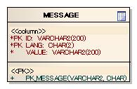

# メッセージ管理

## 概要

ユーザへの通知メッセージを管理する機能。本機能はリポジトリに登録して使用し、初期化処理は :ref:`repository` が実行する。アプリケーションプログラマは画面表示用メッセージの取得に使用する。

リポジトリに `messageResource` というコンポーネント名で `MessageResource` クラスを登録する必要がある。

**設定例**:

```xml
<component name="messageDbManager" class="nablarch.core.db.transaction.SimpleDbTransactionManager">
    <property name="dbTransactionName" value="message"/>
</component>

<component name="stringResourceLoader"
    class="nablarch.core.message.BasicStringResourceLoader">
  <property name="dbManager" ref="messageDbManager"/>
  <property name="tableName" value="TEST_MESSAGE"/>
  <property name="idColumnName" value="MESSAGE_ID"/>
  <property name="langColumnName" value="LANG"/>
  <property name="valueColumnName" value="MESSAGE"/>
</component>

<component name="stringResourceHolder" class="nablarch.core.message.StringResourceHolder">
  <property name="stringResourceCache">
    <component class="nablarch.core.cache.BasicStaticDataCache">
      <!-- true: 初期化時一括ロード / false: オンデマンドロード -->
      <property name="loadOnStartup" value="true"/>
      <property name="loader" ref="stringResourceLoader"/>
    </component>
  </property>
</component>
```

<details>
<summary>keywords</summary>

メッセージ管理, 初期化, repository, メッセージ取得, MessageResource, BasicStringResourceLoader, StringResourceHolder, BasicStaticDataCache, SimpleDbTransactionManager, messageResource, メッセージ設定, コンポーネント登録, DBメッセージ設定例

</details>

## 特徴

## メッセージの取得
メッセージIDを指定して通知内容ごとに一意なメッセージを取得できる。

## 国際化
メッセージID1つに対して言語ごとに異なるメッセージを設定可能。

## メッセージのフォーマット
`java.text.MessageFormat` 形式で可変文字をフォーマットして取得可能。

## メッセージのキャッシュ
[./05_StaticDataCache](libraries-05_StaticDataCache.md) の機構を使用するため高速アクセス可能。アプリケーション側でキャッシュを意識する必要はない。

## 実装済み機能
- メッセージIDをキーにDBに登録したメッセージを取得
- メモリ上へのキャッシュ
- メッセージのフォーマット
- 多言語化

**クラス**: `nablarch.core.message.StringResourceHolder`

| プロパティ名 | 必須 | 説明 |
|---|---|---|
| stringResourceCache | ○ | StringResourceインタフェースを実装したクラスを保持するStaticDataCacheを設定する |

<details>
<summary>keywords</summary>

メッセージ取得, 国際化, MessageFormat, StaticDataCache, キャッシュ, 多言語化, StringResourceHolder, nablarch.core.message.StringResourceHolder, stringResourceCache, StringResource, メッセージリソース保持

</details>

## メッセージテーブル


## インタフェース定義

**インタフェース**: `nablarch.core.message.StringResource`  
ユーザへの通知メッセージの元となる文字列リソースを保持。文字列リソースはメッセージIDで管理される。国際化対応アプリケーションでは1つのメッセージIDに言語ごとの複数文字列が存在する。

## クラス定義

| クラス名 | 概要 |
|---|---|
| `nablarch.core.message.BasicStringResource` | `StringResource` の基本実装。各言語の文字列リソースをMapで保持 |
| `nablarch.core.message.StringResourceHolder` | 文字列リソースを管理。キャッシュには [05_StaticDataCache](libraries-05_StaticDataCache.md) を使用 |
| `nablarch.core.message.BasicStringResourceLoader` | DBから文字列リソースを取得。`StringResource` の実装に `BasicStringResource` を使用 |
| `nablarch.core.message.MessageLevel` | メッセージ通知レベルを表す列挙型 |
| `nablarch.core.message.Message` | メッセージ情報を保持しフォーマットを行うクラス。`StringResource`・`MessageLevel`・optionパラメータを持つ |
| `nablarch.core.message.ApplicationException` | 処理結果メッセージを通知する例外クラス。`Message` のリストを持つ |
| `nablarch.core.message.MessageUtil` | アプリケーションがメッセージを取得する際のユーティリティクラス |

## テーブル定義

`BasicStringResourceLoader` が以下のテーブルから文字列リソースをロードする。テーブル名・カラム名は任意。

| 定義 | Javaの型 | 制約 |
|---|---|---|
| メッセージID | java.lang.String | プライマリキー |
| 言語 | java.lang.String | プライマリキー |
| メッセージ | java.lang.String | |

[./05_StaticDataCache](libraries-05_StaticDataCache.md) を参照。

> **警告**: このプロパティに設定するStaticDataLoaderは、必ず `BasicStringResourceLoader` クラスのように、`StringResource` インタフェースを実装したクラスを読み込むように実装すること。

<details>
<summary>keywords</summary>

StringResource, BasicStringResource, StringResourceHolder, BasicStringResourceLoader, MessageLevel, Message, ApplicationException, MessageUtil, テーブル定義, クラス定義, BasicStaticDataCache, nablarch.core.cache.BasicStaticDataCache, StaticDataLoader, キャッシュ設定, loadOnStartup

</details>

## テーブル定義の例



**クラス**: `nablarch.core.message.BasicStringResourceLoader`

| プロパティ名 | 必須 | 説明 |
|---|---|---|
| dbManager | ○ | メッセージのロード時に使用するSimpleDbTransactionManagerクラスを指定する |
| tableName | ○ | メッセージを永続化したテーブル名を指定する |
| idColumnName | ○ | メッセージを永続化したテーブルのメッセージIDのカラム名を指定する |
| langColumnName | ○ | メッセージを永続化したテーブルの言語のカラム名を指定する |
| valueColumnName | ○ | メッセージを永続化したテーブルのメッセージのカラム名を指定する |

<details>
<summary>keywords</summary>

メッセージテーブル, データベース定義, テーブル定義例, BasicStringResourceLoader, nablarch.core.message.BasicStringResourceLoader, dbManager, SimpleDbTransactionManager, tableName, idColumnName, langColumnName, valueColumnName, メッセージロード, テーブル設定

</details>

## メッセージの取得

`MessageUtil` を通じてメッセージを取得する。

```java
// Message ID "MSG0001"の結果メッセージを取得
Message message = MessageUtil.createMessage(MessageLevel.INFO, "MSG0001");
```

<details>
<summary>keywords</summary>

MessageUtil, createMessage, MessageLevel, メッセージ取得

</details>

## メッセージのフォーマット

`java.text.MessageFormat` 形式で埋め込み文字をフォーマット可能。DBのメッセージカラムには埋め込み文字の状態で登録する。

メッセージテーブル例:

| メッセージID | 言語 | メッセージ |
|---|---|---|
| MSG0001 | ja | {0} は {1} から {2} の間で指定してください。 |

```java
// "price は 1 から 10 の間で指定してください。" が取得できる。
Message message = MessageUtil.createMessage(MessageLevel.ERROR, "MSG0001", "price", 1, 10);
String messageStr = message.formatMessage();
```

<details>
<summary>keywords</summary>

MessageFormat, フォーマット, createMessage, formatMessage, 埋め込み文字

</details>

## 国際化

DBのメッセージテーブルに言語ごとのメッセージを設定することで言語に合わせたメッセージが取得できる。

`formatMessage()` を引数なしで呼び出すと `ThreadContext` に保持した言語のメッセージが返される。通常はフレームワークがThreadContextに適切な言語をセットするため、アプリケーション実装時に言語を意識する必要はない。ThreadContextに保持する値はWebフレームワークあるいはBatchフレームワークで初期化・クリアされるため、通常はアプリケーション実装時に値を設定することを意識する必要はない。日本語と英語を同時に出力したい場合は `formatMessage(Locale)` の引数に言語を指定する。

ThreadContextの詳細は [thread-context-label](libraries-thread_context.md) を参照。

メッセージテーブル例:

| メッセージID | 言語 | メッセージ |
|---|---|---|
| MSG0001 | en | User id is already registered. |
| MSG0001 | ja | そのユーザIDは既に登録されています。 |

> **注意**: 以下のコード例中の `ThreadContext.setLanguage()` 呼び出しはフレームワークが行う処理であり、通常のアプリケーションでは実装する必要がない。アプリケーション・プログラマはこのような実装を行わない。

```java
Message message = MessageUtil.createMessage(MessageLevel.ERROR, "MSG0001");

ThreadContext.setLanguage(Locale.ENGLISH); // 通常、フレームワークが行う
String messageStr1 = message.formatMessage(); // "User id is already registered."

ThreadContext.setLanguage(Locale.JAPANESE); // 通常、フレームワークが行う
String messageStr2 = message.formatMessage(); // "そのユーザIDは既に登録されています。"

// 特定言語を指定して取得
String messageStr3 = message.formatMessage(Locale.ENGLISH); // "User id is already registered."
```

<details>
<summary>keywords</summary>

国際化, ThreadContext, formatMessage, Locale, 多言語, 言語設定

</details>

## オプションパラメータの国際化

`createMessage()` のオプションパラメータに `StringResource` または `Message` を渡すことで、オプションパラメータ自体を国際化できる。

> **注意**: 以下のコード例中の `ThreadContext.setLanguage()` 呼び出しはフレームワークが行う処理であり、通常のアプリケーションでは実装する必要がない。アプリケーション・プログラマはこのような実装を行わない。

メッセージテーブル例:

| メッセージID | 言語 | メッセージ |
|---|---|---|
| MSG0001 | en | value of {0} is not valid. |
| MSG0001 | ja | {0}の値が不正です。 |
| MSG0002 | en | unknown error occur. error message:"{0}". |
| MSG0002 | ja | 原因不明のエラーが発生しました。 エラーメッセージ:「{0}」。 |
| PRP0001 | en | name |
| PRP0001 | ja | 名前 |

**StringResourceを使用する場合:**
```java
StringResource propertyStringResource = MessageUtil.getStringResource("PRP0001");
Message message = MessageUtil.createMessage(MessageLevel.ERROR, "MSG0001", propertyStringResource);

ThreadContext.setLanguage(Locale.ENGLISH); // 通常、フレームワークが行う
String message1 = message.formatMessage(); // "value of name is not valid."

ThreadContext.setLanguage(Locale.JAPANESE); // 通常、フレームワークが行う
String message2 = message.formatMessage(); // "名前の値が不正です。"

String message3 = message.formatMessage(Locale.ENGLISH); // "value of name is not valid."
```

**Messageをネストする場合:**
```java
StringResource propertyStringResource = MessageUtil.getStringResource("PRP0001");
Message message = MessageUtil.createMessage(MessageLevel.ERROR, "MSG0001", propertyStringResource);

ThreadContext.setLanguage(Locale.JAPANESE); // 通常、フレームワークが行う
Message errorMessage = MessageUtil.createMessage(MessageLevel.ERROR, "MSG0002", message);
String errorMessage1 = errorMessage.formatMessage(); // "原因不明のエラーが発生しました。 エラーメッセージ:「名前の値が不正です。」。"
```

<details>
<summary>keywords</summary>

オプションパラメータ, StringResource, Message, 国際化, getStringResource, createMessage, ネスト

</details>

## 例外によるメッセージの通知

業務的なエラー発生時に `ApplicationException`（またはそのサブクラス）を使用することで、フレームワークの例外処理機構が使用できる。

```java
// 例外を送出
Message message = MessageUtil.createMessage(MessageLevel.ERROR, "MSG0001");
throw new ApplicationException(message);
```

```java
// 例外からメッセージを受け取る（フレームワーク側の疑似コード）
try {
    anyBussinessLogic();
} catch (ApplicationException e) {
    List<Message> messages = e.getMessages();
    showErrorMessage(messages);
}
```

<details>
<summary>keywords</summary>

ApplicationException, getMessages, 例外, 業務エラー, メッセージ通知

</details>
