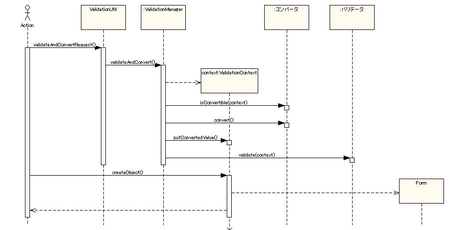

# バリデーション機能の構造

## クラス図

ここまでに示したバリデーションの機能を実現するために必要クラスの構造を以下に示す。


以下に各インタフェース、クラスの概要を記述する。
なお、 Convertor インタフェースおよび Validator インタフェースを実装したクラスは数が多いため、上記クラス図では一部省略している。
これらのクラスについては、 [基本バリデータ・コンバータ](../../component/libraries/libraries-validation-basic-validators.md#基本バリデータコンバータ) を参照。

### インタフェース定義

| インタフェース名 | 概要 |
|---|---|
| nablarch.core.validation.Convertor | 入力値から対応するプロパティの型に変換するインタフェース。 このインタフェースを実装したクラスを以降コンバータと呼ぶ。 [1] |
| nablarch.core.validation.Validator | プロパティの値のバリデーションを行うインタフェース。 このインタフェースを実装したクラスを以降バリデータと呼ぶ。 [1] |
| nablarch.core.validation.Validatable | ValidationUtil でバリデーション可能なオブジェクトが実装するインタフェース。 |

### クラス定義

| クラス名 | 概要 |
|---|---|
| nablarch.core.validation.ValidationManager | バリデーションおよび変換の処理を実行するクラス。 |
| nablarch.core.validation.ValidationContext | バリデーションの処理に必要な情報を保持するクラス。 |
| nablarch.core.validation.ValidationResultMessage | バリデーション結果のメッセージ表示に必要な情報を保持するクラス。 |
| nablarch.core.validation.ValidationUtil | システムリポジトリから ValidatorManager を取得し、呼び出しを行うユーティリティクラス。 |

バリデータ、コンバータを使用したバリデーション処理の流れは、 [バリデーションの処理の流れ](../../component/libraries/libraries-08-01-validation-architecture.md#バリデーションの処理の流れ) で説明する。

## バリデーションの処理の流れ

バリデーションの処理の概要を表すシーケンス図を以下に簡単に示す。



このシーケンス図からわかるとおり、バリデーションの処理は、 ValidationManager が中心となってコンバータ、バリデータの呼び出しを
行うことで実現している。

ValidationUtil はバリデーションの機構を容易に使用するためのユーティリティクラスであり、リポジトリから取得した ValidationManager
に処理を委譲する責務のみを持つ。

コンバータおよびバリデータはそれぞれ Convertor 、 Validator インタフェースを実装したクラスのインスタンスであり、
ValidationManager の convertorsプロパティおよび validators プロパティに設定することで、 ValidationManager から
Form に対応付けて自動的に呼び出される。

## 設定例

このようなバリデーションの処理を行う ValidationManager クラスのインスタンスは、リポジトリ上に validationManager
というコンポーネント名で保持されている必要がある。

通常、 ValidationManager の設定は下記のように記述する。

```xml
<!--
    ValidationManager は、リポジトリ上で必ず validationManager という名称で登録しておく必要がある。
-->
<component name="validationManager" class="nablarch.core.validation.ValidationManager">
    <!-- 使用するコンバータはconvertorsプロパティに全て設定する。 -->
    <property name="convertors" >
        <list>
            <component class="nablarch.core.validation.convertor.StringConvertor">
                <property name="conversionFailedMessageId" value="MSG00001"/>
            </component>
            <component class="nablarch.core.validation.convertor.StringArrayConvertor">
            </component>
            <component class="nablarch.core.validation.convertor.LongConvertor">
                <property name="invalidDigitsIntegerMessageId" value="MSG00031"/>
                <property name="multiInputMessageId" value="MSG00001"/>
            </component>
            <component class="nablarch.core.validation.convertor.BigDecimalConvertor">
                <property name="invalidDigitsIntegerMessageId" value="MSG00031"/>
                <property name="invalidDigitsFractionMessageId" value="MSG00032"/>
                <property name="multiInputMessageId" value="MSG00001"/>
            </component>
        </list>
    </property>
    <!-- 使用するバリデータはプロパティ validators に全て設定する。 -->
    <property name="validators" >
        <list>
            <component class="nablarch.core.validation.validator.RequiredValidator">
                <property name="messageId" value="MSG00011"/>
            </component>
            <component class="nablarch.core.validation.validator.NumberRangeValidator">
                <property name="maxMessageId" value="MSG00051"/>
                <property name="maxAndMinMessageId" value="MSG00052"/>
                <property name="minMessageId" value="MSG00053"/>
            </component>
            <component class="nablarch.core.validation.validator.LengthValidator">
                <property name="maxMessageId" value="MSG00021"/>
                <property name="maxAndMinMessageId" value="MSG00022"/>
                <property name="fixLengthMessageId" value="MSG00023" />
            </component>
        </list>
    </property>
    <!--  Form 定義をキャッシュするディクショナリの参照設定。(通常下記設定のままでよい) -->
    <property name="formDefinitionCache" ref="formDefinitionCache">
    </property>

</component>

<!-- バリデーション情報のキャッシュ(通常下記設定のままでよい) -->
<component name="formDefinitionCache" class="nablarch.core.cache.BasicStaticDataCache">
    <property name="loader">
        <component class="nablarch.core.validation.FormValidationDefinitionLoader" />
    </property>
</component>
```

また ValidationManager クラスは初期化が必要なため、  [初期化処理の使用手順](../../component/libraries/libraries-02-02-Repository-initialize.md#初期化処理の使用手順)  に記述した Initializable インタフェースを実装している。
[初期化処理の使用手順](../../component/libraries/libraries-02-02-Repository-initialize.md#初期化処理の使用手順) を参考にして、下記のように validationManager が初期化されるよう設定すること。

```xml
<component name="initializer" class="nablarch.core.repository.initialization.BasicApplicationInitializer">
    <property name="initializeList">
        <list>
            <!-- 他のコンポーネントは省略 -->
            <component-ref name="formDefinitionCache"/>
            <component-ref name="validationManager"/>
        </list>
    </property>
</component>
```

## 設定内容詳細

### nablarch.core.validation.ValidationManager の設定

ValidationManager の各設定項目の詳細を以下に示す。

| property名 | 設定内容 |
|---|---|
| convertors          (必須) | 使用するコンバータを List で設定する。 コンバータは、nablarch.core.validation.Convertor を実装したクラスであり、 本プロパティのリストに追加することで、使用できるようになる。 |
| validators (必須) | 使用するバリデータを List で設定する。 バリデータは、 nablarch.core.validation.Validator を実装したクラスであり、 本プロパティのリストに追加することで、使用できるようになる。 |
| formDefinitionCache (必須) | FormValidationDefinitionのStaticDataCache を設定する。 通常上記設定例のように、BasicStaticDataCacheクラスとFormValidationDefinitionLoaderクラスを設定すればよい。 |
| invalidSizeKeyMessageId (必須) | ValidationTargetアノテーションのsizeKeyに不正な長さを指定した際のエラーメッセージID。 詳細は [Form の配列を入力する際のバリデーション](../../component/libraries/libraries-08-03-validation-recursive.md#form-の配列を入力する際のバリデーション) を参照。 |
| stringResourceHolder   (必須) | nablarch.core.message.StringResourceHolder のインスタンス。 バリデーションのエラーメッセージは、ここで指定した StringResourceHolder から取得される。  > **Note:** > 通常のシステムでは、 StringResourceHolder のインスタンスはシステムで1つのみ > しか使用しないため、 [自動インジェクション](../../component/libraries/libraries-02-01-Repository-config.md#自動インジェクション) の機能を使用することで設定ファイルにこの > プロパティを記載する必要はない。 |
| useFormPropertyNameAsMessageId | 後述する [プロパティ名に対応する表示名称を使用する方法](../../component/libraries/libraries-08-04-validation-form-inheritance.md#プロパティ名に対応する表示名称を使用する方法) を使用するか否かを設定する。 設定しなかった場合、false。 |
| formArraySizeValueMaxLength | Form の配列サイズ文字列の最大長。 配列の添え字にこの長さを超える長さの文字列を指定したリクエストが送られた場合、 ValidationManager は無条件にその項目をエラー(リクエストの改竄)と判断する。 設定しなかった場合、3(999個までの配列を許容する)。 .. note::  この設定値は、配列の最大値ではなく、添え字の文字列長であることに注意すること。  例えば 999 個までの配列を使用するシステムでは、この設定値に 3 を設定する。 |
| invalidSizeKeyMessageId  (必須) | formArraySizeValueMaxLength で設定した値を超えた配列の添え字がリクエスト として送られた際に表示するメッセージのメッセージID。 |
