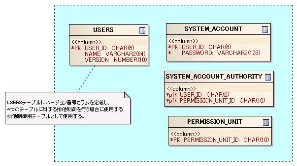
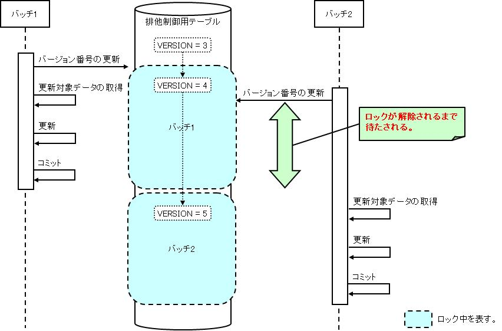
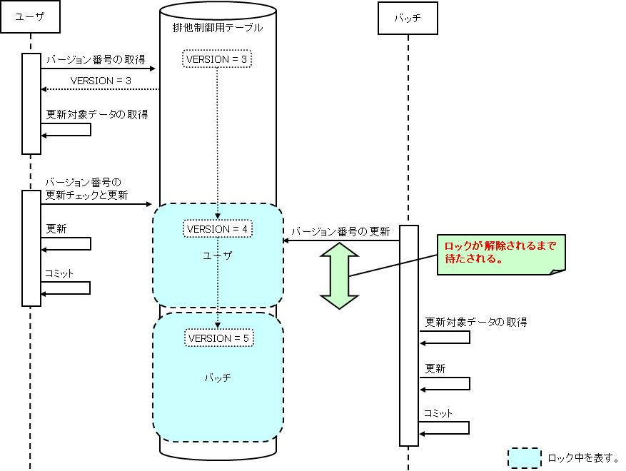

# 排他制御機能

## 概要

データベースに格納したデータに対する排他制御機能を提供する。
本機能を使用することで、複数ユーザ(又は複数バッチなど)がデータベース上の同一データを更新するシステムにおいて、
同一データが同時に更新されることを防止できる。

本機能では、排他制御の手法として、悲観的ロックと楽観的ロックの2種類を提供する。
下記にそれぞれの手法の説明を示す。

| 手法 | 説明 |
|---|---|
| 悲観的ロック | 悲観的ロックは、データ検索から更新までの間、更新対象データのロックを取得し続け、 更新が完了したタイミングでロックを解除する。ロックを取得する時間は長くなるが、 更新処理は確実に成功する手法である。検索から更新までにかかる時間が短い処理、 またはロックを取得する時間が長くなるデメリットを差し置いても、 更新処理を失敗させたくない処理で使用される。 検索から更新までが1トランザクションで行われる処理(バッチ処理など)では、悲観的ロックを採用する。 |
| 楽観的ロック | 楽観的ロックは、データ検索時にはロックを取得せず、 更新時に更新対象データが他の処理によって更新されたかをチェックし、 更新が行われていた場合は、更新を中止する。 データ検索から更新までロックし続ける悲観的ロックのデメリットが許容されない場面で楽観的ロックを使用する。 ユーザの操作待ち時間を少なくしたい(検索時にロックを取得したくない)画面処理では、楽観的ロックを採用する。 |

## 特徴

### 排他制御の実装負荷軽減

本機能では、排他制御に必要なデータベースアクセスや、楽観的ロックに使用するバージョン番号の画面間の引き継ぎ処理をフレームワークが行う。
このため、排他制御を使用する機能の実装は、フレームワークのAPI呼び出しのみに集約され、実装負荷を軽減できる。

## 要求

### 実装済み

* 複数ユーザ(画面)が、同一データを同時に更新することを防ぐことができる。
* 複数バッチが、同一データを同時に更新することを防ぐことができる。
* バッチとユーザ（画面）が、同一データを同時に更新することを防ぐことができる。

## 排他制御の実現方法

### 排他制御用テーブル

本機能は、排他制御対象のデータにバージョン番号を付与することで実現する。
バージョン番号は、排他制御対象のデータが格納されるテーブルにバージョン番号カラムを定義することで保持する。
本フレームワークではバージョン番号カラムが定義されたテーブルを排他制御用テーブルと呼ぶ。

本機能で提供する悲観的ロックと楽観的ロックは、同じ排他制御用テーブルを使用して実現するため、
悲観的ロックと楽観的ロックを並行して使用しても、同一データが同時に更新されることを防止できる。
たとえば、楽観的ロックを使用する画面処理と、悲観的ロックを使用するバッチ処理を並行稼働させても、排他制御が実現できる。

排他制御用テーブルは排他制御を行う単位ごとに定義する。

排他制御用テーブルは、競合が許容される最大の単位で定義することを推奨する。
たとえば、「ユーザ」という大きな単位でロックすることが業務的に許容されるならば、
その単位で排他制御用テーブルを定義する。
ただし、ロック範囲を広くすると、更新処理が競合する可能性が高くなる点に注意すること。
更新処理の競合は、処理遅延や更新失敗(楽観的ロックの場合)を招く。

通常、業務的な観点で排他制御用テーブルの単位を定義する。
たとえば、売上処理と入金処理による更新が同時に行われる場合は、
それらの処理に関連するテーブルをまとめた単位で排他制御用テーブルを定義する。
また、テーブル設計の観点からも排他制御用テーブルの単位を定義できる。
たとえば、ヘッダ部(親)と明細部(子)など、テーブルの親子関係が明確であれば、
親の単位で排他制御用テーブルを定義する。
親子関係が明確でない場合は、どちらを親にするのが良いかを判断し、排他制御用テーブルを定義する。

排他制御用テーブルの例を下記に示す。

**排他制御用テーブルの例**



排他制御用テーブルの実装例を下記に示す。

**親となるテーブル**

```sql
-- 親となるテーブルにバージョン番号カラムを定義する。
CREATE TABLE USERS (

    USER_ID CHAR(6) NOT NULL,

    -- 主キー以外のカラムは省略。

    -- バージョン番号カラムを定義する。
    -- カラム名、データ型は任意。
    VERSION NUMBER(10) NOT NULL,

    PRIMARY KEY (USER_ID)
)
```

> **Note:**
> 排他制御用テーブルは、業務のデータを格納するテーブルとは別に、排他制御専用のテーブルとして定義することもできる。
> 排他制御専用テーブルを作成した場合は、排他制御の対象となる業務データ(上記例ではUSERSテーブルのデータ)を追加、物理削除する場合は、
> 排他制御専用テーブルにもデータの追加、物理削除が必要となる。
> 本機能では、排他制御専用テーブルへのデータ追加、物理削除を行うAPI(ExclusiveControlUtilクラス)を提供している。

**排他制御用テーブルの更新順序**

排他制御用テーブルの設計が終わったら、更新順序の設計を行う。
各テーブルのロック順序を定めることで、デッドロックの防止、及び更新時のデータ整合性の保証を実現する。
(RDBMSの仕様では、レコードを更新するとそのレコードに対して自動的にロックがかかるので、
更新順序を定めておかなければデッドロックが発生する可能性が非常に高くなる。)

> **Note:**
> 排他制御用テーブルに限らず、個別のテーブルに関しても更新順序を決める。
> また、複数の排他制御を行うことも考えられるため、排他制御を行う順序も決めること。
> (ユーザ排他制御→残高排他制御→ＸＸ排他制御)

また、一括削除など、複数件を順次更新する場合の主キーのソート順を決めておくこと。
これはデッドロック防止を目的としたルールであるため、コミット間隔が1件であることが保証されている処理で、
かつソート処理が性能に与える影響が大きい場合は、ソートを行わなくともよい。

### 悲観的ロックと楽観的ロックの動作イメージ

悲観的ロックは、更新対象データを取得する前に、排他制御用テーブルのバージョン番号を更新することで実現する。
更新対象データを取得する前に、排他制御用テーブルのバージョン番号を更新することで、
更新処理のトランザクションがコミット又はロールバックされるまで、排他制御用テーブルの対象行がロックされる。
このため、他のユーザ(又はバッチ)の更新処理はロックが解除されるまで待たされる。
排他制御用テーブルを使用した悲観的ロックの動作イメージを下記に示す。

図中のバッチは悲観的ロック、ユーザは楽観的ロックを使用して更新処理を行うものとする。

**悲観的ロックの動作イメージ**



楽観的ロックは、更新対象データを取得する時点で、排他制御用テーブルのバージョン番号を取得しておき、
更新を行う時点で、事前に取得した排他制御用テーブルのバージョン番号が更新されていないかをチェックすることで実現する。
排他制御用テーブルを使用した楽観的ロックの動作イメージを下記に示す。

**楽観的ロックの動作イメージ**


悲観的ロックと楽観的ロックを並行して使用する場合の動作イメージを下記に示す。

**悲観的ロック→楽観的ロックの動作イメージ**


**楽観的ロック(バージョン番号の取得)→悲観的ロックの動作イメージ**


**楽観的ロック(バージョン番号の更新)→悲観的ロックの動作イメージ**



## 構造

### クラス図


### 各クラスの責務

#### インタフェース定義

| インタフェース名 | 概要 |
|---|---|
| nablarch.common.exclusivecontrol.ExclusiveControlManager | 排他制御(悲観的ロック、楽観的ロック)を管理するインタフェース。  排他制御用テーブルを使用した排他制御(悲観的ロック、楽観的ロック)を行うための機能、 及び排他制御用テーブルに対する行データの追加と削除を行う機能を提供する。 各プロジェクトで独自の実装が必要になった場合(SQL文を変更するなど)には、 本インタフェースを実装することにより実現可能となっている。 |

#### クラス定義

| クラス名 | 概要 |
|---|---|
| nablarch.common.exclusivecontrol.BasicExclusiveControlManager | ExclusiveControlManagerの基本実装クラス。 |
| nablarch.common.exclusivecontrol.ExclusiveControlUtil | 排他制御機能のユーティリティクラス。  バッチ処理などで悲観的ロックを行いたい場合、及び排他制御用テーブルへのデータ追加と物理削除を行いたい場合は、 このクラスを使用する。 排他制御用テーブルの操作は、ExclusiveControlManagerに委譲する。 |
| nablarch.common.exclusivecontrol.ExclusiveControlContext | 排他制御の実行に必要な情報を保持するクラス。  排他制御用テーブルのスキーマ情報と排他制御対象のデータを指定する主キー条件を保持する。 |
| nablarch.common.exclusivecontrol.OptimisticLockException | 楽観的ロックでバージョン番号が更新されている場合に発生する例外クラス。 |
| nablarch.common.exclusivecontrol.Version | 排他制御用テーブルのバージョン番号を保持するクラス。 |
| nablarch.common.exclusivecontrol.ExclusiveControlTable | 排他制御用テーブルのスキーマ情報とSQL文を保持するクラス。  アクセスした排他制御用テーブルのスキーマ情報とSQL文をメモリ上にキャッシュする際に使用する。 |
| nablarch.common.web.exclusivecontrol.HttpExclusiveControlUtil | 画面処理における排他制御機能(楽観的ロック)のユーティリティクラス。 |

UsersExclusiveControlクラスは、排他制御用テーブルに対応させて作成するクラス(以降は主キークラスと称す)である。
主キークラスの責務は、バージョン番号を検索する際に必要な情報を提供することである。
主キークラスは、設計書から自動生成することを想定している。

下記に排他制御用テーブルの定義と、排他制御用テーブルに対応する主キークラスの例を下記に示す。

```sql
CREATE TABLE USERS (
    USER_ID CHAR(6) NOT NULL,
    -- 主キー以外の業務データは省略。
    VERSION NUMBER(10) NOT NULL,
    PRIMARY KEY (USER_ID)
)
```

```java
// ExclusiveControlContextを継承する。
public class UsersExclusiveControl extends ExclusiveControlContext {

    // 排他制御用テーブルの主キーは列挙型で定義する。
    private enum PK { USER_ID }

    // 主キーの値をとるコンストラクタを定義する。
    public UsersExclusiveControl(String userId) {

        // 親クラスのsetTableNameメソッドでテーブル名を設定する。
        setTableName("USERS");

        // 親クラスのsetVersionColumnNameメソッドでバージョン番号カラム名を設定する。
        setVersionColumnName("VERSION");

        // 親クラスのsetPrimaryKeyColumnNamesメソッドで
        // Enumのvaluesメソッドを使用して、主キーの列挙型を全て設定する。
        setPrimaryKeyColumnNames(PK.values());

        // 親クラスのappendConditionメソッドで主キーの値を追加する。
        appendCondition(PK.USER_ID, userId);
    }
}
```

## 悲観的ロック

悲観的ロックは、ExclusiveControlUtilのupdateVersionメソッドを呼び出すことで実現する。
[クラス定義](../../component/libraries/libraries-08-ExclusiveControl.md#exclusivecontrol-classes) で説明したUsersExclusiveControlクラスを使用した実装例を示す。

```java
// 更新対象データの取得前に下記メソッドを呼び出し、排他制御用テーブルの対象データをロックする。
ExclusiveControlUtil.updateVersion(new UsersExclusiveControl("U00001"));
```

> **Note:**
> バッチ処理で複数件の更新処理を行う場合は、ロックしている時間をできるだけ短くし、並列処理に与える影響を極小化すること。
> 具体的には、ロックを行うための主キーのみを取得する前処理を設け、本処理では、前処理で取得した主キーを使用して、
> 1件ずつロックを取得してからデータ取得と更新を行うように実装する。

## 楽観的ロック

### シーケンス図

ここでは、ユーザ情報の更新処理を行う場合を想定し、楽観的ロックのシーケンスについて解説する。

楽観的ロックは、下記の処理を行うことで実現する。

* バージョン番号の準備(HttpExclusiveControlUtilのprepareVersionメソッド)
* バージョン番号の更新チェック(HttpExclusiveControlUtilのcheckVersionsメソッド)
* バージョン番号の更新チェックと更新(HttpExclusiveControlUtilのupdateVersionsメソッド)

以下、上記処理のシーケンスを示す。

**バージョン番号の準備(HttpExclusiveControlUtilのprepareVersionメソッド)**


**バージョン番号の更新チェック(HttpExclusiveControlUtilのcheckVersionsメソッド)**


> **Note:**
> バージョン番号の更新チェック(HttpExclusiveControlUtilのcheckVersionsメソッド)を行わなければ、
> 画面間でバージョン番号が引き継がれない。

**バージョン番号の更新チェックと更新(HttpExclusiveControlUtilのupdateVersionsメソッド)**


### 使用例

ここでは、 [クラス定義](../../component/libraries/libraries-08-ExclusiveControl.md#exclusivecontrol-classes) で説明したUsersExclusiveControlクラスを使用した実装例を示す。

#### アクションの実装例

実装例では、排他制御のための実装と、業務処理に必要な実装を区別するため、コメントに"(排他制御)"、"(業務処理)"を付加する。

**バージョン番号の準備(HttpExclusiveControlUtilのprepareVersionメソッド)**

```java
/** 入力画面の初期表示 */
public HttpResponse doUU00201(HttpRequest request, ExecutionContext context) {

    // (業務処理)
    // 更新対象データを取得するための主キー条件の入力精査を行う。
    User user = validate("user", User.class, request, "search");

    // (排他制御)
    // 主キークラスを生成し、バージョン番号を準備する。
    // 取得したバージョン番号は、フレームワークにより、指定されたExecutionContextに設定される。
    HttpExclusiveControlUtil.prepareVersion(context, new UsersExclusiveControl(user.getUserId());

    // (業務処理)
    // 更新対象データを取得し、入力画面表示のために、リクエストスコープに設定する。
    ParameterizedSqlPStatement stmt = support.getParameterizedSqlStatement("SELECT_USER_BY_PK", user);
    context.setRequestScopedVar("user", new User(stmt.retrieve(user).get(0)));

    return new HttpResponse("/input.jsp");
}
```

> **Note:**
> バージョン番号の準備を行う下記メソッドは、
> バージョン番号を準備できたか否かを伝えるためにbooleanを返す。
> 排他制御用テーブルに、排他制御用主キークラスに設定した主キーに合致するデータが存在しない場合にfalseが返る。
> (排他制御対象のデータが物理削除されていた場合など)

> プロジェクトでバージョン番号が存在しない場合の処理を共通化したい場合は、
> HttpExclusiveControlUtilのラッパクラスを作成し対応する。
> バージョン番号が存在しない場合に共通メッセージを表示させる場合の実装例を示す。

> ```java
> public final class CommonExclusiveControlUtil {
> 
>     public static void prepareVersion(ExecutionContext context, ExclusiveControlContext exclusiveControlContext) {
> 
>         if (HttpExclusiveControlUtil.prepareVersion(context, exclusiveControlContext)) {
>             // バージョン番号を準備できた場合は何もしない。
>             return;
>         }
> 
>         // バージョン番号を準備できなかった場合は共通メッセージを指定したApplicationExceptionを送出する。
>         Message message = MessageUtil.createMessage(MessageLevel.ERROR, "M001101");
>         throw new ApplicationException(message);
>     }
> 
>     // 他のメソッドは省略。
> }
> ```

**バージョン番号の更新チェック(HttpExclusiveControlUtilのcheckVersionsメソッド)**

```java
/** 入力画面の確認ボタン */
@OnErrors({
    @OnError(type = ApplicationException.class, path = "/input.jsp"),
    @OnError(type = OptimisticLockException.class, path = "/search.jsp")
})
public HttpResponse doUU00202(HttpRequest request, ExecutionContext context) {

    // (排他制御)
    // バージョン番号の更新チェックを行う。
    // バージョン番号は、フレームワークにより、指定されたHttpRequestから取得する。
    // バージョン番号が更新されている場合は、OptimisticLockExceptionが送出されるので、
    // @OnErrorを指定して遷移先を指定する。
    HttpExclusiveControlUtil.checkVersions(request, context);

    // (業務処理)
    // 入力データの入力精査を行い、確認画面表示のために、リクエストスコープに設定する。
    User user = validate("user", User.class, request, "update");
    context.setRequestScopedVar("user", user);

    return new HttpResponse("/confirm.jsp");
}
```

**バージョン番号の更新チェックと更新(HttpExclusiveControlUtilのupdateVersionsメソッド)**

```java
/** 確認画面(排他制御)の更新ボタン */
@OnErrors({
    @OnError(type = ApplicationException.class, path = "/input.jsp"),
    @OnError(type = OptimisticLockException.class, path = "/search.jsp")
})
public HttpResponse doEXCLUS00203(HttpRequest request, ExecutionContext context) {

    // (排他制御)
    // バージョン番号の更新チェックと更新を行う。
    // バージョン番号は、フレームワークにより、指定されたHttpRequestから取得する。
    // バージョン番号が更新されている場合は、OptimisticLockExceptionが送出されるので、
    // @OnErrorを指定して遷移先を指定する。
    HttpExclusiveControlUtil.updateVersionsWithCheck(request);

    // (業務処理)
    // 入力データの入力精査を行い、更新処理を行う。
    // 完了画面表示のために、更新データをリクエストスコープに設定する。
    User user = validate("user", User.class, request, "update");
    ParameterizedSqlPStatement stmt = support.getParameterizedSqlStatement("UPDATE_USER", user);
    stmt.executeUpdateByObject(user);
    context.setRequestScopedVar("user", user);

    return new HttpResponse("/complete.jsp");
}
```

**一括更新処理における更新チェック(主キーが組み合わせキーではない場合)**

複数のレコードに対し、特定のプロパティ(論理削除フラグなど)を一括更新するような処理では、
実際の更新対象となるレコードに対してのみ更新チェックを行う必要がある。

この場合、 **HttpExclusiveControlUtil.checkVersions()** および、 **HttpExclusiveControlUtil.updateVersionsWithCheck()**
の引数に、更新対象レコードの主キーのリストを格納したリクエストパラメータ名指定することにより、
画面上で実際に更新対象として選択されたレコードに対してのみ更新チェックを行うことができる。

例えば、ユーザエンティティに対する論理削除を行う以下の様な画面の例を考える。

```html
<tr>
  <th> 削除対象 </th>
  <th> ユーザ名 </th>
</tr>
<tr>
  <td> <checkbox name="user.deactivate" value="user001" /> </td>
  <td> ユーザ001 </td>
</tr>
<tr>
  <td> <checkbox name="user.deactivate" value="user002" /> </td>
  <td> ユーザ002 </td>
</tr>
<!-- 後略 -->
```

この場合、以下のように更新チェックを行うメソッドの引数に、チェックボックスのリクエストパラメータ名を指定する。

```java
// (排他制御:更新チェック)
// リクエストパラメータ "user.deactivate" に設定されたエンティティの主キーのみを
// 更新チェックの対象とする。
HttpExclusiveControlUtil.checkVersions(request, context, "user.deactivate");
```

```java
// (排他制御:更新チェックと更新処理)
// リクエストパラメータ "user.deactivate" に設定されたエンティティの主キーのみを
// 更新チェックおよび、更新処理の対象とする。
HttpExclusiveControlUtil.updateVersionsWithCheck(request, "user.deactivate");
```

> **Note:**
> チェックボックスのvalue値には更新対象レコードの主キーを指定する必要がある。

**一括更新処理における更新チェック(主キーが組み合わせキーの場合)**

一括更新処理であるが主キーが組み合わせキーの場合、 **HttpExclusiveControlUtil.checkVersion()** および、 **HttpExclusiveControlUtil.updateVersionWithCheck()**
(共にVersionにsが付かず、主キークラスを引数に取る)を使用する。

例えば、ユーザエンティティが以下に示すようなUSER_IDとPK2、PK3からなる組み合わせキーを持つエンティティとする。

```sql
CREATE TABLE USERS (

    USER_ID CHAR(6) NOT NULL,
    PK2     CHAR(6) NOT NULL,
    PK3     CHAR(6) NOT NULL,

    -- 主キー以外の業務データは省略。

    -- バージョン番号カラムを定義する。
    VERSION NUMBER(10) NOT NULL,

    PRIMARY KEY (USER_ID,PK2,PK3)
)
```

この時、主キークラスは以下のようになる。

```java
// ExclusiveControlContextを継承する。
public class UsersExclusiveControl extends ExclusiveControlContext {

    // 排他制御用テーブルの主キーは列挙型で定義する。
    private enum PK { USER_ID, PK2, PK3 }

    // 主キーの値をとるコンストラクタを定義する。
    public UsersExclusiveControl(String userId, String pk2, String pk3) {

        setTableName("USERS");

        setVersionColumnName("VERSION");

        setPrimaryKeyColumnNames(PK.values());

        // 親クラスのappendConditionメソッドで主キーの値を追加する。
        appendCondition(PK.USER_ID, userId);
        appendCondition(PK.PK2, pk2);
        appendCondition(PK.PK3, pk3);
    }
}
```

このエンティティに対して一括論理削除を行う以下のような画面を考える。

```html
<tr>
  <th> 削除対象 </th>
  <th> ユーザ名 </th>
</tr>
<tr>
  <td>
    <input id="checkbox" type="checkbox" name="user.userCompositeKeys"
                                          value="user001, pk2001, pk3001" />
  </td>
  <td>
    ユーザ001
  </td>
</tr>
<tr>
  <td>
    <input id="checkbox" type="checkbox" name="user.userCompositeKeys"
                                          value="user002, pk2002, pk3002" />
  </td>
  <td>
    ユーザ002
  </td>
</tr>
<!-- 後略 -->
```

> **Note:**
> 主キーが組み合わせキーとなるエンティティに対する一括更新処理を作成するために、本フレームワークでは、
> [compositeKeyCheckboxタグ](../../component/libraries/libraries-07-TagReference.md#webview-compositekeycheckboxtag) と [compositeKeyRadioButtonタグ](../../component/libraries/libraries-07-TagReference.md#webview-compositekeyradiobuttontag) 、nablarch.common.web.compositekey.CompositeKeyクラスを提供している。

この場合Actionでは、以下のように **HttpExclusiveControlUtil.checkVersion()** 、
 **HttpExclusiveControlUtil.updateVersionWithCheck()** を選択されたレコード毎に繰り返し呼び出す。

```java
// (排他制御:更新チェック)
// formには、リクエストパラメータ "user.userCompositeKeys" から、主キーが設定されたエンティティクラス
// の配列を作成して返す処理を実装している。
User[] deletedUsers = form.getDeletedUsers();

// formから取得したエンティティの主キーを使用して主キークラスを作成し、更新チェックをレコードごとに
// 呼び出す。
for( int i=0; i < deletedUsers.length; i++) {
    User deletedUser = deletedUsers[i];
    HttpExclusiveControlUtil.checkVersion(request,
                                          context,
                                          new UsersExclusiveControl(deletedUser.getUserId(),
                                                                     deletedUser.getPk2(),
                                                                     deletedUser.getPk3()));
}
```

```java
// (排他制御:更新チェックと更新処理)
// 更新チェックと同じ
User[] deletedUsers = form.getDeletedUsers();

// formから取得したエンティティの主キーを使用して主キークラスを作成し、更新チェックおよび、更新処理を
// レコードごとに呼び出す。
for( int i=0; i < deletedUsers.length; i++) {
    User deletedUser = deletedUsers[i];
    HttpExclusiveControlUtil.updateVersionWithCheck(request,
                                                   new ExclusiveUserCondition(deletedUser.getUserId(),
                                                                               deletedUser.getPk2(),
                                                                               deletedUser.getPk3()));
}
```

> **Note:**
> チェックボックスのvalue値には更新対象レコードの主キーを区切り文字(任意、ただし主キーの値にはなり得ないこと)で結合した文字列
> を指定する必要がある。またformクラスには、リクエストパラメータから主キーを取り出す処理(上記コード例ではエンティティの配列に
> して返している)を実装する必要がある。

#### 設定ファイルの定義

排他制御機能を使用する際は、リポジトリに”exclusiveControlManager”というコンポーネント名で
ExclusiveControlManagerインタフェースを実装したクラスを登録する必要がある。

以下にExclusiveControlManagerインタフェースのデフォルト実装であるBasicExclusiveControlManagerクラスを使用した設定例を示す。

楽観的ロックでは、バージョン番号が更新されている場合に、OptimisticLockExceptionが送出される。
OptimisticLockExceptionは、ApplicationExceptionを継承しており、n:errorsタグを使用して、
画面上にエラーメッセージを表示することができる。
OptimisticLockExceptionのメッセージIDは、BasicExclusiveControlManagerのoptimisticLockErrorMessageIdプロパティに指定する。

```xml
<!-- メッセージIDの設定例 -->
<component name="exclusiveControlManager"
           class="nablarch.common.exclusivecontrol.BasicExclusiveControlManager">
    <property name="optimisticLockErrorMessageId" value="CUST0001" />
</component>
```

> **Note:**
> 楽観ロックエラーに対するメッセージは、アプリケーションで1つだけ指定できる。
> 楽観ロックエラーに対するメッセージを機能毎に変更したい場合は、
> アクションでOptimisticLockExceptionをキャッチして例外処理を実装する必要がある。

##### 設定内容詳細

a) ExclusiveControlManagerインタフェースを実装したクラスの設定

| 属性値 | 設定内容 |
|---|---|
| name(必須) | "exclusiveControlManager"(変更不可) |
| class(必須) | nablarch.common.exclusivecontrol.BasicExclusiveControlManager。 プロジェクトで独自の実装を使用する場合(SQL文を変更するなど)は、ExclusiveControlManagerを実装したクラスを指定する。 |

b) nablarch.common.exclusivecontrol.BasicExclusiveControlManagerの設定

| property名 | 設定内容 |
|---|---|
| optimisticLockErrorMessageId(必須) | 楽観ロックエラーメッセージID |
