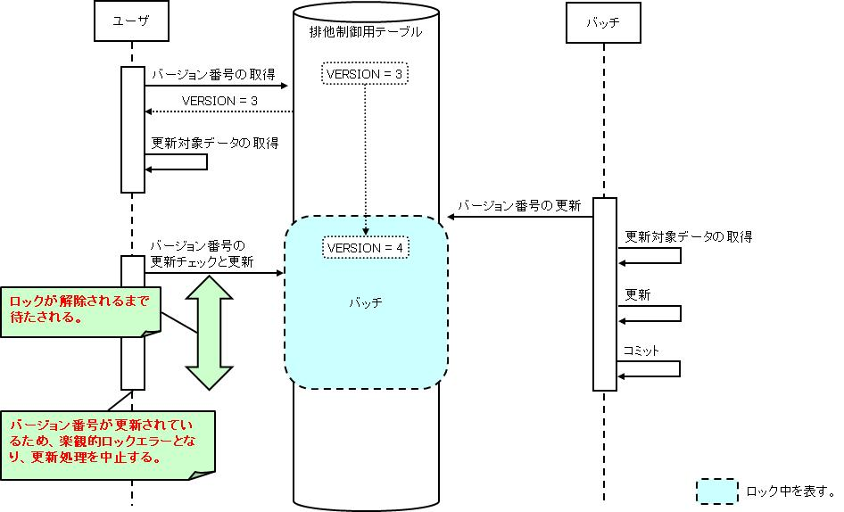

# 排他制御機能

## 概要

データベースに格納したデータに対する排他制御機能を提供する。複数ユーザ（または複数バッチ）が同一データを同時に更新することを防止できる。

排他制御の手法として悲観的ロックと楽観的ロックの2種類を提供する。

| 手法 | 説明 | 採用場面 |
|---|---|---|
| 悲観的ロック | データ検索から更新までロックを取得し続ける。更新処理は確実に成功する | 検索から更新までにかかる時間が短い処理、またはロックを取得する時間が長くなるデメリットを差し置いても更新処理を失敗させたくない処理（例: 検索から更新が1トランザクションで行われるバッチ処理） |
| 楽観的ロック | 検索時にロックを取得せず、更新時に他処理による更新を確認。更新されていれば中止する | 検索時にロックを取得したくない画面処理 |

**クラス**: `HttpExclusiveControlUtil`, `ExclusiveControlContext`, `UsersExclusiveControl`, `CommonExclusiveControlUtil`
**アノテーション**: `@OnErrors`, `@OnError`
**例外**: `OptimisticLockException`, `ApplicationException`

## バージョン番号の準備（`prepareVersion`）

```java
HttpExclusiveControlUtil.prepareVersion(context, new UsersExclusiveControl(user.getUserId()));
```

バージョン番号はフレームワークにより指定された`ExecutionContext`に設定される。

> **注意**: `prepareVersion` / `prepareVersions` はbooleanを返す。排他制御用テーブルに主キーに合致するデータが存在しない場合（物理削除済みなど）はfalseが返る。

メソッドシグネチャ:
- `boolean prepareVersion(ExecutionContext context, ExclusiveControlContext exclusiveControlContext)`
- `boolean prepareVersions(ExecutionContext context, List<? extends ExclusiveControlContext> exclusiveControlContexts)`

バージョン番号が存在しない場合の処理を共通化するには、`HttpExclusiveControlUtil`のラッパークラスを作成する。

```java
public final class CommonExclusiveControlUtil {
    public static void prepareVersion(ExecutionContext context, ExclusiveControlContext exclusiveControlContext) {
        if (HttpExclusiveControlUtil.prepareVersion(context, exclusiveControlContext)) {
            return;
        }
        Message message = MessageUtil.createMessage(MessageLevel.ERROR, "M001101");
        throw new ApplicationException(message);
    }
}
```

## バージョン番号の更新チェック（`checkVersions`）

バージョン番号はフレームワークが指定された`HttpRequest`から取得する。バージョン番号が更新されている場合は`OptimisticLockException`が送出されるため、`@OnError`で遷移先を指定する。

```java
@OnErrors({
    @OnError(type = ApplicationException.class, path = "/input.jsp"),
    @OnError(type = OptimisticLockException.class, path = "/search.jsp")
})
public HttpResponse doUU00202(HttpRequest request, ExecutionContext context) {
    HttpExclusiveControlUtil.checkVersions(request, context);
    ...
}
```

## バージョン番号の更新チェックと更新（`updateVersionsWithCheck`）

バージョン番号はフレームワークが指定された`HttpRequest`から取得する。バージョン番号が更新されている場合は`OptimisticLockException`が送出されるため、`@OnError`で遷移先を指定する。

```java
@OnErrors({
    @OnError(type = ApplicationException.class, path = "/input.jsp"),
    @OnError(type = OptimisticLockException.class, path = "/search.jsp")
})
public HttpResponse doEXCLUS00203(HttpRequest request, ExecutionContext context) {
    HttpExclusiveControlUtil.updateVersionsWithCheck(request);
    ...
}
```

## 一括更新処理における更新チェック（主キーが組み合わせキーではない場合）

実際の更新対象レコードに対してのみ更新チェックを行う場合、更新対象レコードの主キーのリストを格納したリクエストパラメータ名を引数に指定する。

```java
// 更新チェック
HttpExclusiveControlUtil.checkVersions(request, context, "user.deactivate");
```

```java
// 更新チェックと更新処理
HttpExclusiveControlUtil.updateVersionsWithCheck(request, "user.deactivate");
```

> **注意**: チェックボックスのvalue値には更新対象レコードの主キーを指定する必要がある。

## 一括更新処理における更新チェック（主キーが組み合わせキーの場合）

`checkVersions`/`updateVersionsWithCheck`（複数形）ではなく、`checkVersion`/`updateVersionWithCheck`（単数形、主キークラスを引数に取る）をレコードごとに繰り返し呼び出す。

`ExclusiveControlContext`を継承した主キークラスを実装する。コンストラクタで`setTableName`、`setVersionColumnName`、`setPrimaryKeyColumnNames`、`appendCondition`を呼び出す。

```java
// ExclusiveControlContextを継承する。
public class UsersExclusiveControl extends ExclusiveControlContext {

    // 排他制御用テーブルの主キーは列挙型で定義する。
    private enum PK { USER_ID, PK2, PK3 }

    // 主キーの値をとるコンストラクタを定義する。
    public UsersExclusiveControl(String userId, String pk2, String pk3) {

        setTableName("USERS");

        setVersionColumnName("VERSION");

        setPrimaryKeyColumnNames(PK.values());

        // 親クラスのappendConditionメソッドで主キーの値を追加する。
        appendCondition(PK.USER_ID, userId);
        appendCondition(PK.PK2, pk2);
        appendCondition(PK.PK3, pk3);
    }
}
```

> **注意**: 主キーが組み合わせキーとなるエンティティに対する一括更新処理のために、フレームワークは`WebView_CompositeKeyCheckboxTag`、`WebView_CompositeKeyRadioButtonTag`、`nablarch.common.web.compositekey.CompositeKey`クラスを提供している。

```java
// 更新チェック
User[] deletedUsers = form.getDeletedUsers();
for (int i = 0; i < deletedUsers.length; i++) {
    User deletedUser = deletedUsers[i];
    HttpExclusiveControlUtil.checkVersion(request, context,
        new UsersExclusiveControl(deletedUser.getUserId(), deletedUser.getPk2(), deletedUser.getPk3()));
}
```

```java
// 更新チェックと更新処理
User[] deletedUsers = form.getDeletedUsers();
for (int i = 0; i < deletedUsers.length; i++) {
    User deletedUser = deletedUsers[i];
    HttpExclusiveControlUtil.updateVersionWithCheck(request,
        new ExclusiveUserCondition(deletedUser.getUserId(), deletedUser.getPk2(), deletedUser.getPk3()));
}
```

> **注意**: チェックボックスのvalue値には、更新対象レコードの主キーを区切り文字（主キー値にはなり得ない文字）で結合した文字列を指定する。formクラスには主キーを取り出す処理の実装が必要。

<details>
<summary>keywords</summary>

排他制御, 悲観的ロック, 楽観的ロック, バッチ処理での排他制御, 画面処理での排他制御, 同時更新防止, HttpExclusiveControlUtil, ExclusiveControlContext, UsersExclusiveControl, CommonExclusiveControlUtil, ExclusiveUserCondition, OptimisticLockException, ApplicationException, @OnErrors, @OnError, prepareVersion, prepareVersions, checkVersions, checkVersion, updateVersionsWithCheck, updateVersionWithCheck, setTableName, setVersionColumnName, setPrimaryKeyColumnNames, appendCondition, MessageUtil, MessageLevel, 排他制御実装, バージョン番号準備, 一括更新排他制御, 組み合わせキー排他制御

</details>

## 特徴

排他制御に必要なDBアクセスや、楽観的ロックで使用するバージョン番号の画面間引き継ぎ処理をフレームワークが担当するため、実装はフレームワークAPIの呼び出しのみに集約される。

**クラス**: `nablarch.common.exclusivecontrol.BasicExclusiveControlManager`
**インターフェース**: `ExclusiveControlManager`

リポジトリに`"exclusiveControlManager"`というコンポーネント名で`ExclusiveControlManager`実装クラスを登録する必要がある。`OptimisticLockException`は`ApplicationException`を継承しており、`n:errors`タグでエラーメッセージを画面表示できる。メッセージIDは`BasicExclusiveControlManager`の`optimisticLockErrorMessageId`プロパティに指定する。

```xml
<component name="exclusiveControlManager"
           class="nablarch.common.exclusivecontrol.BasicExclusiveControlManager">
    <property name="optimisticLockErrorMessageId" value="CUST0001" />
</component>
```

> **注意**: 楽観ロックエラーメッセージはアプリケーションで1つのみ指定可能。機能ごとにメッセージを変更する場合は、アクションで`OptimisticLockException`をキャッチして例外処理を実装する。

### ExclusiveControlManagerの設定

| 属性値 | 設定内容 |
|---|---|
| name（必須） | `"exclusiveControlManager"`（変更不可） |
| class（必須） | `nablarch.common.exclusivecontrol.BasicExclusiveControlManager`。独自実装を使用する場合は`ExclusiveControlManager`を実装したクラスを指定。 |

### BasicExclusiveControlManagerのプロパティ

| プロパティ名 | 必須 | 説明 |
|---|---|---|
| optimisticLockErrorMessageId | ○ | 楽観ロックエラーメッセージID |

<details>
<summary>keywords</summary>

排他制御実装負荷軽減, バージョン番号引き継ぎ, フレームワーク排他制御API, BasicExclusiveControlManager, ExclusiveControlManager, optimisticLockErrorMessageId, exclusiveControlManager, OptimisticLockException, n:errors, 排他制御設定, 楽観ロックエラーメッセージ

</details>

## 要求

- 複数ユーザ（画面）が同一データを同時に更新することを防止できる
- 複数バッチが同一データを同時に更新することを防止できる
- バッチとユーザ（画面）が同一データを同時に更新することを防止できる

<details>
<summary>keywords</summary>

排他制御要件, 複数ユーザ同時更新防止, 複数バッチ同時更新防止

</details>

## 排他制御用テーブル

排他制御対象テーブルにバージョン番号カラムを定義することで実現する。悲観的ロックと楽観的ロックは同じ排他制御用テーブルを使用するため、並行使用でも同一データの同時更新を防止できる。

**テーブル設計の指針**:
- 競合が許容される最大の単位で排他制御用テーブルを定義することを推奨
- ロック範囲を広くすると更新処理の競合が高まり、処理遅延や更新失敗（楽観的ロックの場合）を招く
- 明確な親子関係があるテーブルは親の単位で定義する
- 業務的な観点とテーブル設計の観点の両方から単位を決める

**排他制御用テーブルの例**:


**実装例**:
```sql
CREATE TABLE USERS (
    USER_ID CHAR(6) NOT NULL,
    VERSION NUMBER(10) NOT NULL,  -- カラム名・データ型は任意
    PRIMARY KEY (USER_ID)
)
```

> **注意**: 排他制御専用テーブルを別途作成する場合、対象業務データの追加・物理削除時に排他制御専用テーブルへも同様の操作が必要となる。この操作にはExclusiveControlUtilクラスのAPIを使用する。

**更新順序の設計**:

各テーブルのロック順序を定めることでデッドロックを防止し、データ整合性を保証する。RDBMSはレコード更新時に自動的にロックするため、更新順序が未定義だとデッドロックが発生しやすい。

- 個別テーブルと排他制御テーブル両方について更新順序を決める
- 複数の排他制御を行う場合は順序を決める（例: ユーザ排他制御→残高排他制御）
- 一括削除など複数件を順次更新する場合は主キーのソート順を決める（コミット間隔が1件保証でソート性能影響が大きい場合は省略可）

<details>
<summary>keywords</summary>

排他制御用テーブル, バージョン番号カラム, デッドロック防止, 更新順序, 排他制御テーブル設計, ExclusiveControlUtil

</details>

## 悲観的ロックと楽観的ロックの動作イメージ

悲観的ロックは、更新対象データ取得前にバージョン番号を更新することで、トランザクションのコミット/ロールバックまで排他制御用テーブルの対象行がロックされる。

図中のバッチは悲観的ロック、ユーザは楽観的ロックを使用して更新処理を行うものとする。

**悲観的ロックの動作イメージ**:


楽観的ロックは、データ取得時にバージョン番号を保存し、更新時にバージョン番号が変更されていないかチェックする。変更されていれば更新を中止する。

**楽観的ロックの動作イメージ**:


悲観的ロックと楽観的ロックの並行使用時の動作:





<details>
<summary>keywords</summary>

悲観的ロック動作イメージ, 楽観的ロック動作イメージ, 排他制御動作, バージョン番号更新, 並行使用動作

</details>

## 構造

**クラス図**:


<details>
<summary>keywords</summary>

クラス図, 排他制御機能構造, ExclusiveControlManager, ExclusiveControlUtil, HttpExclusiveControlUtil

</details>

## インタフェース定義

**インタフェース**: `nablarch.common.exclusivecontrol.ExclusiveControlManager`

排他制御（悲観的ロック、楽観的ロック）を管理するインタフェース。排他制御用テーブルに対する行データの追加・削除機能も提供する。プロジェクト独自の実装（SQL文の変更など）が必要な場合は、このインタフェースを実装する。

<details>
<summary>keywords</summary>

ExclusiveControlManager, 排他制御インタフェース, 独自実装, SQL文変更

</details>

## クラス定義

| クラス名 | 概要 |
|---|---|
| `nablarch.common.exclusivecontrol.BasicExclusiveControlManager` | ExclusiveControlManagerの基本実装クラス |
| `nablarch.common.exclusivecontrol.ExclusiveControlUtil` | バッチ処理での悲観的ロック、排他制御用テーブルへのデータ追加・物理削除に使用。操作はExclusiveControlManagerに委譲 |
| `nablarch.common.exclusivecontrol.ExclusiveControlContext` | 排他制御用テーブルのスキーマ情報と主キー条件を保持するクラス |
| `nablarch.common.exclusivecontrol.OptimisticLockException` | 楽観的ロックでバージョン番号が更新されている場合に発生する例外 |
| `nablarch.common.exclusivecontrol.Version` | バージョン番号を保持するクラス |
| `nablarch.common.exclusivecontrol.ExclusiveControlTable` | スキーマ情報とSQL文をメモリにキャッシュするクラス |
| `nablarch.common.web.exclusivecontrol.HttpExclusiveControlUtil` | 画面処理（楽観的ロック）のユーティリティクラス |

排他制御用テーブルごとに`ExclusiveControlContext`を継承する主キークラスを作成する（設計書から自動生成を想定）。

**主キークラスの実装例**:
```java
public class UsersExclusiveControl extends ExclusiveControlContext {
    private enum PK { USER_ID }
    public UsersExclusiveControl(String userId) {
        setTableName("USERS");
        setVersionColumnName("VERSION");
        setPrimaryKeyColumnNames(PK.values());
        appendCondition(PK.USER_ID, userId);
    }
}
```

<details>
<summary>keywords</summary>

BasicExclusiveControlManager, ExclusiveControlUtil, ExclusiveControlContext, OptimisticLockException, Version, ExclusiveControlTable, HttpExclusiveControlUtil, 主キークラス, UsersExclusiveControl

</details>

## 悲観的ロック

`ExclusiveControlUtil.updateVersion()` を更新対象データ取得前に呼び出すことで悲観的ロックを実現する。

```java
ExclusiveControlUtil.updateVersion(new UsersExclusiveControl("U00001"));
```

> **注意**: バッチで複数件更新する場合、ロック時間を最短にするため、前処理で主キーのみを取得し、本処理では1件ずつロックを取得してからデータ取得と更新を行うこと。

<details>
<summary>keywords</summary>

ExclusiveControlUtil, updateVersion, 悲観的ロック実装, バッチ処理ロック, UsersExclusiveControl

</details>

## 楽観的ロック

楽観的ロックは以下の3つのメソッドで実現する。

1. **バージョン番号の準備**: `HttpExclusiveControlUtil.prepareVersion()` — 検索時にバージョン番号を取得・保存する
2. **バージョン番号の更新チェック**: `HttpExclusiveControlUtil.checkVersions()` — 画面間でバージョン番号を引き継ぐ。このメソッドを呼ばないとバージョン番号が画面間で引き継がれない
3. **バージョン番号の更新チェックと更新**: `HttpExclusiveControlUtil.updateVersions()` — 更新時にバージョン番号をチェックして更新する

シーケンス図:
- バージョン番号の準備: 
- バージョン番号の更新チェック: 
- バージョン番号の更新チェックと更新: 

<details>
<summary>keywords</summary>

HttpExclusiveControlUtil, prepareVersion, checkVersions, updateVersions, 楽観的ロック実装, バージョン番号引き継ぎ

</details>
