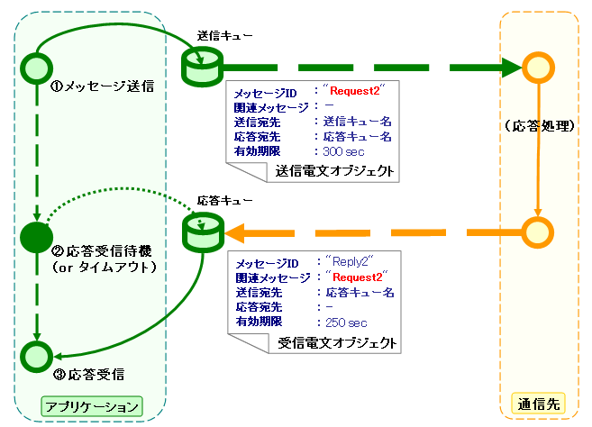
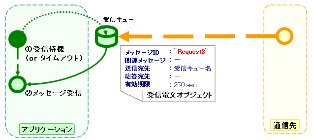
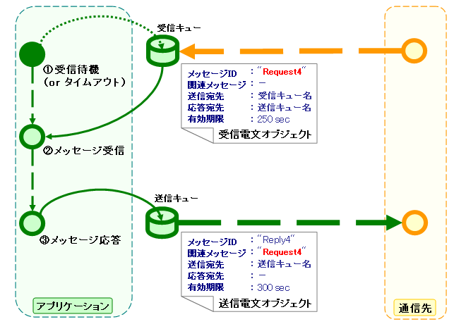

# システム間メッセージング機能

## システム間メッセージング機能

- [../architectural_pattern/messaging](../../processing-pattern/mom-messaging/mom-messaging-messaging.md)
- [messaging_sending_batch](libraries-messaging_sending_batch.md)
- [messaging_sender_util](libraries-messaging_sender_util.md)

**クラス**: `MessagingContext`, `SendingMessage`, `ReceivedMessage`

- `MessagingContext`: 送受信機能を実装したクラス。メッセージングプロバイダによって生成される。
- `SendingMessage`: 送信前の電文情報を格納するクラス。
- `ReceivedMessage`: 受信した電文情報を格納するクラス。

## 1. 応答不要メッセージ送信

ローカルキューへのPUTが完了した時点でリターン。対向システム側に電文が正常に送信されるかどうかは判断できないため、必要に応じて補償電文などの仕組みと組み合わせること。


| プロトコルヘッダー | 設定内容 |
|---|---|
| メッセージID | 設定不要（送信後に採番） |
| 関連メッセージID | 設定不要 |
| **送信宛先** | **送信先論理名を設定** |
| 応答宛先 | 設定不要 |
| 有効期間 | 任意 |

```java
MessagingContext context = provider.createContext();
String messageId = messaging.sendSync(new SendingMessage()
    .setDestination(sendQueueName)
    .setTimeToLive(300)
    .setFormatter(formatter)
    .addRecord(new HashMap() {{ put("FIcode", "9999"); /* ... */ }})
);
```

## 2. 同期応答メッセージ送信

応答電文を受信するまでブロック。タイムアウト時は `null` が返される。タイムアウトした場合は補償処理が必要。



送信側プロトコルヘッダー:

| プロトコルヘッダー | 設定内容 |
|---|---|
| メッセージID | 設定不要（送信後に採番） |
| 関連メッセージID | 設定不要 |
| **送信宛先** | **送信宛先の論理名を設定** |
| **応答宛先** | **応答宛先の論理名を設定** |
| 有効期間 | 任意 |

通信先が作成する応答電文のプロトコルヘッダー要件:

| プロトコルヘッダー | 受信内容 |
|---|---|
| メッセージID | 送信先システム側で採番された一意文字列 |
| **関連メッセージID** | 送信電文の**メッセージIDヘッダ**の値 |
| **送信宛先** | 送信電文の**応答宛先ヘッダ**の値 |
| 応答宛先 | [N/A] |
| 有効期間 | 任意 |

```java
MessagingContext context = provider.createContext();
ReceivedMessage reply = messaging.sendSync(new SendingMessage()
    .setDestination(sendQueueName)
    .setReplyTo(replyQueueName)
    .setTimeToLive(300)
    .setFormatter(formatter)
    .addRecord(new HashMap() {{ put("FIcode", "9999"); /* ... */ }})
    , timeout
);
```

## 3. 応答不要メッセージ受信

特定の宛先に送信されるメッセージを受信。タイムアウト時は `null` が返される。



| プロトコルヘッダー | 受信内容 |
|---|---|
| メッセージID | 送信先システム側で採番された一意文字列 |
| 関連メッセージID | [N/A] |
| 送信宛先 | 宛先の論理名 |
| 応答宛先 | [N/A] |
| 有効期間 | 任意 |

```java
ReceivedMessage incomingRequest = messaging.receiveSync(queueName, timeout);
```

## 4. 同期応答メッセージ受信

受信電文のメッセージIDヘッダの値を応答電文の関連メッセージIDヘッダに設定して応答を送信する。



| プロトコルヘッダー | 設定内容 |
|---|---|
| メッセージID | 設定不要（送信後に採番） |
| **関連メッセージID** | 受信電文の**メッセージIDヘッダ**の値を設定する |
| **送信宛先** | 受信電文の**応答宛先ヘッダ**の値を設定する |
| 応答宛先 | 設定不要 |
| 有効期間 | 任意 |

```java
ReceivedMessage incomingRequest = messaging.receiveSync(queueName, timeout);
SendingMessage reply = incomingRequest.reply();
messaging.sendSync(reply.setFormatter(formatter)
    .addRecord(new HashMap() {{ put("data1", "value1"); /* ... */ }})
);
```

<details>
<summary>keywords</summary>

システム間メッセージング, メッセージングプロバイダ, メッセージング基盤API, フレームワーク機能, MessagingContext, SendingMessage, ReceivedMessage, MessagingProvider, 応答不要メッセージ送信, 同期応答メッセージ送信, 応答不要メッセージ受信, 同期応答メッセージ受信, メッセージング送受信, プロトコルヘッダー, sendSync, receiveSync, messaging_sending_batch, messaging_sender_util

</details>

## 全体構成

本機能は3つのレイヤで構成される。

**1. メッセージング基盤API**

以下の4つの送受信処理を実行するためのAPIクラス群:
- 応答不要メッセージ送信
- 同期応答メッセージ送信
- 応答不要メッセージ受信
- 同期応答メッセージ受信

**2. メッセージングプロバイダ**

メッセージング基盤APIの実装系を提供するモジュール。

- **JMSメッセージングプロバイダ**: JMSインターフェース実装を使用。メッセージングミドルウェアがJMS互換であれば利用可能。
- **組込みメッセージングプロバイダ**: JVM上の1つのサブスレッドとして動作するMOMを使用。自動テストで使用。

**3. フレームワーク機能**

メッセージング基盤APIを使用したフレームワーク提供機能。フレームワーク制御ヘッダの利用を前提として設計されている。

- [../architectural_pattern/messaging](../../processing-pattern/mom-messaging/mom-messaging-messaging.md): 外部から送信される要求電文に対して適切な業務アプリケーションを実行する制御基盤。
- [messaging_sending_batch](libraries-messaging_sending_batch.md): 特定のテーブルを定期監視し、各レコードをもとにメッセージを作成・送信する常駐バッチ。業務側はINSERT文を発行するだけでメッセージ送信可能。応答不要メッセージ送信で使用。
- [messaging_sender_util](libraries-messaging_sender_util.md): 対外システムへのメッセージ同期送信ユーティリティ。フレームワーク制御ヘッダの再送電文フラグを利用した再送/タイムアウト機構を実装。応答不要メッセージ送信には [messaging_sending_batch](libraries-messaging_sending_batch.md) を使用すること。

**クラス**: `MessagingProvider` — メッセージング基盤APIの実装系を与えるモジュール。JMSメッセージングプロバイダと組込みメッセージングプロバイダの2種類がある。

<details>
<summary>keywords</summary>

JMSメッセージングプロバイダ, 組込みメッセージングプロバイダ, メッセージング基盤API, 応答不要メッセージ送信, 同期応答メッセージ送信, メッセージング送信バッチ, メッセージング送信ユーティリティ, MessagingProvider, メッセージングプロバイダ

</details>

## 基本概念

## 送受信電文のデータモデル

**プロトコルヘッダー**: MOMによるメッセージ送受信で使用される情報を格納。Mapインターフェースでアクセス可能。

**共通プロトコルヘッダー**: メッセージングコンテキストが使用するヘッダー。以下のキー名でアクセス可能。

| ヘッダー論理名 | キー名 | 内容 | JMSメッセージングプロバイダでの実装 |
|---|---|---|---|
| メッセージID | MessageId | MOMが電文ごとに一意採番する文字列。送信時はMOMが採番した値、受信時は送信側MOMが発番した値。 | MessageID JMSヘッダーの値を設定 |
| 関連メッセージID | CorrelationId | 関連する電文のメッセージID。応答電文では要求電文のMessageId、再送要求では応答再送要求する要求電文のMessageIdを設定。 | CorrelationID JMSヘッダーの値を設定 |
| 送信宛先 | Destination | 電文の送信宛先論理名。送信時は送信キューの論理名、受信時は受信キューの論理名。 | 送信キューのDestinationオブジェクトに紐付けられた論理名を設定 |
| 応答宛先 | ReplyTo | 応答送信先の宛先論理名。送信時: 同期応答処理では応答受信キューの論理名を設定、応答不要送信は設定不要。受信時: 同期応答受信では応答宛先キューの論理名が設定されている。応答不要受信では通常設定なし。 | 応答受信キューのDestinationオブジェクトに紐付けられた論理名を設定 |
| 有効期間 | TimeToLive | 送信処理開始時点からの電文有効期間(msec)。受信時は設定なし。 | Expiration JMSヘッダーに(送信処理実行時点での時刻+有効期間)を設定 |

**個別プロトコルヘッダ**: 共通プロトコルヘッダー以外のヘッダー。各メッセージングプロバイダ側で任意定義可能。JMSの場合、全JMSヘッダー・JMS拡張ヘッダー・任意属性が個別プロトコルヘッダとして扱われる。

**メッセージボディ**: プロトコルヘッダーを除いたデータ領域。メッセージングプロバイダ・コンテキストは原則プロトコルヘッダー領域のみ使用し、ボディは未解析のバイナリデータとして扱う。メッセージボディの解析は [record_format](libraries-record_format.md) で行い、フィールド名をキーとするMapとして読み書き可能。

## フレームワーク制御ヘッダー

電文中に定義が必要な制御項目。フレームワーク提供機能の前提として設計されている。

| フレームワーク制御ヘッダ | 役割 | 使用するハンドラ |
|---|---|---|
| リクエストID | 受信アプリが実行すべき業務処理を識別するID | [../handler/RequestPathJavaPackageMapping](../handlers/handlers-RequestPathJavaPackageMapping.md), [../handler/RequestHandlerEntry](../handlers/handlers-RequestHandlerEntry.md), [../handler/ServiceAvailabilityCheckHandler](../handlers/handlers-ServiceAvailabilityCheckHandler.md), [../handler/PermissionCheckHandler](../handlers/handlers-PermissionCheckHandler.md), [../reader/FwHeaderReader](../readers/readers-FwHeaderReader.md) 他 |
| ユーザID | 電文の実行権限を表す文字列 | [../handler/PermissionCheckHandler](../handlers/handlers-PermissionCheckHandler.md) |
| 再送要求フラグ | 再送要求電文送信時に設定されるフラグ | [../handler/MessageResendHandler](../handlers/handlers-MessageResendHandler.md) |
| ステータスコード | 要求電文に対する処理結果コード値。応答電文に設定される。 | [../handler/MessageReplyHandler](../handlers/handlers-MessageReplyHandler.md) |

デフォルト設定では、メッセージボディの最初のデータレコード中に以下のフィールド名で定義する必要がある。

| フレームワーク制御ヘッダ | フィールド名 |
|---|---|
| リクエストID | requestId |
| ユーザID | userId |
| 再送要求フラグ | resendFlag |
| ステータスコード | statusCode |

標準的なフレームワーク制御ヘッダの定義例:

```bash
[NablarchHeader]
1   requestId   X(10)       # リクエストID
11  userId      X(10)       # ユーザID
21  resendFlag  X(1)  "0"   # 再送要求フラグ (0: 初回送信 1: 再送要求)
22  statusCode  X(4)  "200" # ステータスコード
26 ?filler      X(25)       # 予備領域
```

フォーマット定義にフレームワーク制御ヘッダ以外の項目を含めた場合、任意ヘッダ項目としてアクセス可能で、PJ毎の簡易拡張に使用できる。将来的な任意項目の追加・フレームワーク機能追加に伴うヘッダ追加に対応するため、予備領域を設けることを強く推奨する。

**クラス**: `nablarch.fw.messaging.provider.JndiLookingUpJmsMessagingProvider`

JMSインターフェースの実装系を使用したメッセージングコンテキスト実装。JMS互換のメッセージングミドルウェアであれば利用可能。各JMSプロバイダの `ConnectionFactory` および `Queue` オブジェクトを設定することで動作する。その他のプロパティは親クラス (`JmsMessagingProvider`) と同じ。

**Poison電文退避**: `JMSXDeliveryCount` ヘッダに依存するため、同ヘッダをサポートしないMOM製品/バージョンでは利用不可。以下のMOMはサポートを確認済み:
- Websphere MQ
- WebLogic MQ
- ActiveMQ

**設定項目**:

| プロパティ名 | 型 | 必須 | デフォルト値 | 説明 |
|---|---|---|---|---|
| connectionFactoryJndiName | String | ○ | | JMSコネクションファクトリのJNDI名 |
| destinationNamePairs | Map<String, String> | ○ | | キューの論理名とJNDI名のMap |
| defaultResponseTimeout | long | | 5分 | 同期送信時の応答タイムアウトのデフォルト値(msec) |
| defaultTimeToLive | long | | 1分 | 送信電文有効期間のデフォルト値(msec) |
| redeliveryLimit | int | | 0 | MOMによる受信リトライ上限。0以下で退避処理無効。上限超過時は退避キューに転送後、実行時例外を送出 |
| defaultPoisonQueue | String | | "DEFAULT.POISON" | デフォルト受信退避キューの論理名 |
| poisonQueueNamePattern | String | | "%s.POISON" | 受信キューに対する退避キューの論理名パターン（(受信キュー名).POISON） |

```xml
<component name="messagingProvider"
           class="nablarch.fw.messaging.provider.JndiLookingUpJmsMessagingProvider">
    <property name="jndiHelper">
        <component class="nablarch.core.repository.jndi.JndiHelper">
            <property name="jndiProperties">
                <map>
                    <entry key="java.naming.factory.initial" value="weblogic.jndi.WLInitialContextFactory"/>
                    <entry key="java.naming.provider.url"    value="t3://192.168.160.125:7001"/>
                </map>
            </property>
        </component>
    </property>
    <property name="connectionFactoryJndiName" value="javax.jms.QueueConnectionFactory"/>
    <property name="destinationNamePairs">
        <map>
            <entry key="TEST.REQUEST"  value="TEST.REQUEST"/>
            <entry key="TEST.RESPONSE" value="TEST.RESPONSE"/>
        </map>
    </property>
</component>
```

<details>
<summary>keywords</summary>

MessageId, CorrelationId, Destination, ReplyTo, TimeToLive, プロトコルヘッダー, メッセージボディ, フレームワーク制御ヘッダー, requestId, userId, resendFlag, statusCode, NablarchHeader, RequestPathJavaPackageMapping, RequestHandlerEntry, ServiceAvailabilityCheckHandler, PermissionCheckHandler, FwHeaderReader, MessageResendHandler, MessageReplyHandler, JndiLookingUpJmsMessagingProvider, JmsMessagingProvider, connectionFactoryJndiName, destinationNamePairs, defaultResponseTimeout, defaultTimeToLive, redeliveryLimit, defaultPoisonQueue, poisonQueueNamePattern, JMS, Poison電文退避, JMSXDeliveryCount

</details>

## 組込みメッセージングプロバイダ

**クラス**: `nablarch.test.core.messaging.EmbeddedMessagingProvider`

開発環境でのテスト用メッセージングプロバイダ。JVM上の1つのサブスレッドとして動作するMOMを使用。外部的な接続不要で、キューの論理名を設定するだけで動作する。

```xml
<component name="messagingProvider"
           class="nablarch.test.core.messaging.EmbeddedMessagingProvider">
    <property name="queueNames">
        <list>
            <value>TEST.REQUEST</value>
            <value>TEST.REQUEST.POISON</value>
            <value>TEST.RESPONSE</value>
            <value>TEST.RESPONSE.POISON</value>
        </list>
    </property>
    <property name="defaultTimeToLive" value="0" />
</component>
```

<details>
<summary>keywords</summary>

EmbeddedMessagingProvider, 組込みメッセージングプロバイダ, テスト用メッセージングプロバイダ, queueNames, defaultTimeToLive

</details>
