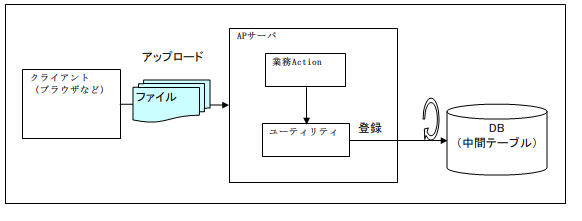
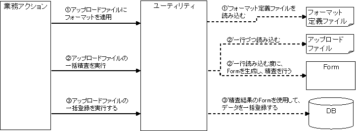
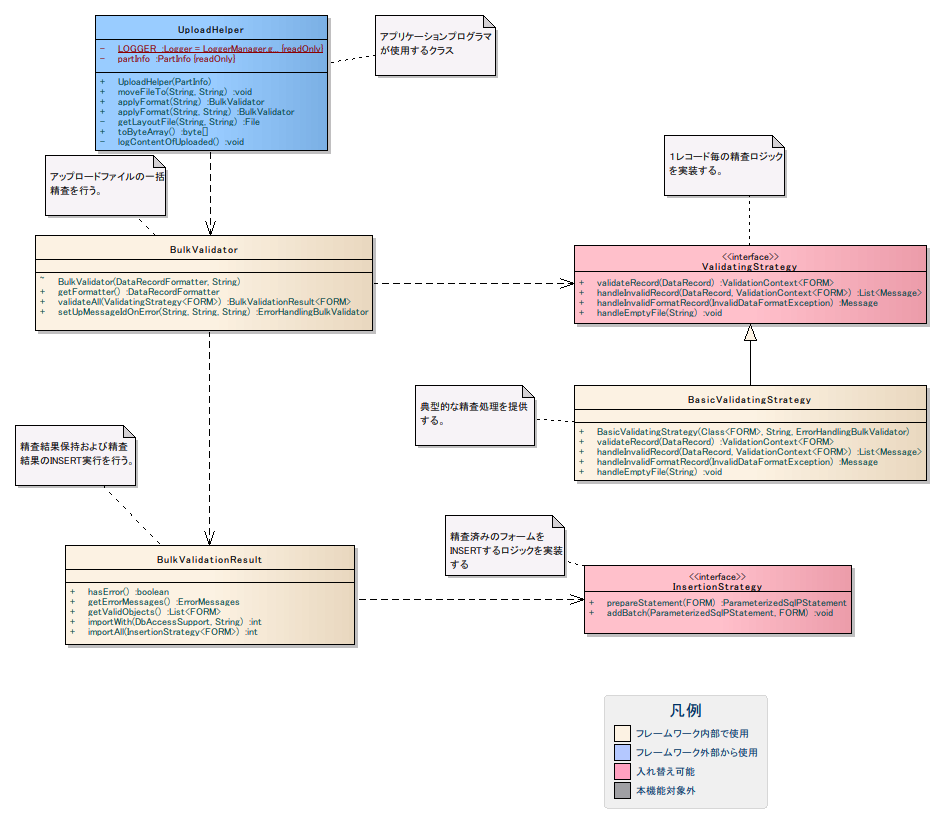
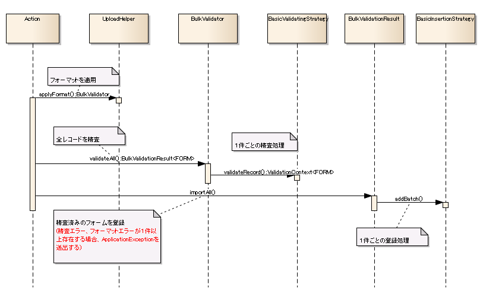

# ファイルアップロード業務処理用ユーティリティ

## 概要

ファイルアップロードを伴う業務処理では、ファイルの内容を業務アクション内で同期処理するのではなく、
ファイルの内容を一旦DB(中間テーブルなど)に格納した時点でレスポンスを返し、
ファイル内の各レコードに対する業務処理は後続のバッチで行う形をとることが多い。(下図)



本機能では、このような処理を実装する際に必要となる以下のような共通処理をユーティリティとして提供する。

* ファイルを一時ディレクトリから移動する
* ファイルをバイナリとして読み込む
* ファイルをデータベースに登録する

## 要求

### 実装済み

* アップロードファイルの形式が正しくない場合、アップロードを禁止できる。

  * アップロードユーティリティを使用する場合、固定長ファイルやCSVファイルの形式が不正な場合に例外をスローするので、その例外をハンドリングすることでエラー画面への遷移が可能。
* アップロードファイルを指定のディレクトリに移動する機能

### 未実装機能

* トランザクション制御

  * １件づつコミット
    ユーティリティがActionとは別のトランザクションを開始し、１件づつコミットする。

## 特徴

アプリケーションプログラマは必要な情報をユーティリティに設定して実行するだけで、
ファイルデータをDBに登録できる。このユーティリティを使用することで、生産性が大幅に向上する。

## 構造



### クラス図



#### クラス定義

nablarch.fw.web.uploadパッケージのクラス

| クラス名 | 概要 |
|---|---|
| UploadHelper | ユーティリティクラス本体。アプリケーションプログラマは本クラスを使用する。 |
| BulkValidator | ファイルの各レコードに対して一括精査処理を行う。 |
| BulkValidationDriver | 精査処理を呼び出す。 |
| BulkValidationResult | 全精査結果を保持する。精査済みフォームの一括登録を受け付ける |
| ValidatingStrategy | １レコード毎の精査処理を行う。アプリケーション開発者が実装する。 |
| BasicValidatingStrategy | 典型的な精査ロジックを提供するValidationStrategy実装クラス。 |
| InsertionStrategy | フォーム１件のINSERT処理を行う。アプリケーション開発者が実装する。 |
| BasicInsertionStrategy | 典型的なINSERT処理を提供するInsertionValidationStrategy実装クラス。 |

### シーケンス図

特に複雑な処理である、「 ファイルをデータベースに登録する 」機能について、
以下ににシーケンスを示す。



## 使用方法

### ファイルを一時ディレクトリから移動する

アップロードファイルを一時ディレクトリから移動する。
第１引数には、移動先のディレクトリを、PathSettingsで管理されている論理ディレクトリ名で指定する。
第２引数には、移動後のファイル名を指定する。

```java
// ファイルを所定のフォルダに移動する。
public void doMoveFile(HttpRequest req, ExecutionContext ctx) {
    PartInfo part = req.getPart("fileToMove").get(0);
    UploadHelper helper = new UploadHelper(part);
    helper.moveFileTo("basePathName", "newFileName");
}
```

### ファイルをバイナリとして読み込む

ファイルをバイト配列に変換して扱いたい場合の簡易的なメソッドを用意している。

```java
// アップロードされたファイル内容をバイナリ読み込む
public void doSaveBinary(HttpRequest req, ExecutionContext ctx) {
    PartInfo part = req.getPart("image").get(0);
    byte[] bytes = new UploadHelper(part).toByteArray();
    // 以下省略
}
```

### ファイルをデータベースに登録する

ファイルをデータベースに登録する場合、UploadHelperクラスを起点として
各種クラスのメソッドをチェーンすることで、ファイルの精査および登録を簡易的に行うことができる。

本ユーティリティが行う処理の概要は以下のとおり。

| 処理 | 説明 | 業務処理側で必要な実装内容 |
|---|---|---|
| フォーマット定義のロード | アップロードされるファイルのデータフォーマットを定義した ファイルを決定し読み込む。 | フォーマット定義ファイルパスの指定 |
| レコード内容チェック | アップロードされたファイル中の各レコードに対して以下の検査を 行う。  **形式チェック**  アップロードされたファイル中の各レコードを フレームワークが読み込む際に、自動的に行う検証。 ファイル内のデータが、 フォーマット定義ファイルに記述されている 1レコードあたりの項目数、各項目のデータ形式などの定義に合致 していることを検証する。 形式チェックを通過したレコードはMap型のオブジェクトに 変換される。  **精査処理**  形式チェックを通過した各レコードに対して行われる検証。 通常の業務Actionと同様の実装を行うことができるので、 ドメインベースの単項目精査やDB精査、ビジネスロジックを伴う 複雑な精査処理を実装することができる。 | 精査エラー発生時のメッセージID指定  精査処理を実装したクラス、メソッドの指定 |
| レコードの登録 | アップロードされたファイル中の全てのレコードが上記の検査を 通過したした場合は、それらをDBに登録する。 | データベース一括登録 |

コード例を以下に示す。

```java
// ファイルをDBに投入する
@OnError(type = ApplicationException.class, path = "/path/to/forward")
public void doSaveFile(HttpRequest req, ExecutionContext ctx) {
    // 保存対象のパート
    PartInfo part = req.getPart("fileToSave").get(0);
    UploadHelper helper = new UploadHelper(part);
    helper.applyFormat("FORMAT0001")                         // フォーマットを適用する
          .setUpMessageIdOnError("MSG_FORMAT_ERR",           // 形式エラー時のメッセージIDを指定する
                                 "MSG_VALIDATION_ERROR",     // 精査エラー時のメッセージIDを指定する
                                 "MSG_EMPTY_FILE")           // ファイルが空の場合のメッセージIDを指定する
          .validateWith(HogeForm.class, "validateUpload")    // 精査メソッドを指定する
          .importWith(this, "SQL0001");                      // 精査済みフォームをINSERTする
}
```

#### フォーマット定義ファイルパスの指定

以下のいずれかのメソッドを使用し、アップロードファイルに適用するフォーマットを指定する。

* UploadHelper#applyFormat(String layoutFileName)
* UploadHelper#applyFormat(String basePathName, String layoutFileName)

#### 精査エラー発生時のメッセージID指定

以下のメソッドを使用し、エラー発生時のメッセージIDを指定する。

* BulkValidator#setUpMessageIdOnError(String messageIdOnFormatError, String messageIdOnValidationError, String messageIdOnEmptyFile)

引数には、以下のエラーに対するメッセージIDを指定する。

1. 形式エラー 時のメッセージID
2. 精査エラー 時のメッセージID
3. ファイルが空の場合 のメッセージID

##### 形式エラー

アップロードしたファイルがapplyFormatメソッドで指定したフォーマットで書かれていなかった場合、
フレームワーク内部で以下のようにMessageが生成され蓄積される [1] 。

```java
MessageUtil.createMessage(
       MessageLevel.ERROR,               // エラーレベル
       errors.msgIdOnValidationError,    // setUpMessageIdOnError第1引数のメッセージID
       e.getRecordNumber());             // フォーマットエラーが発生したレコード番号
```

よって、setUpMessageIdOnErrorの第1引数には以下のようなメッセージを指定すれば良い。

**【メッセージ例】**

```text
{0}行目の形式に誤りがあります。
```

そうすると、形式エラー発生時には以下のようなメッセージとなる。

**【メッセージ出力例】**

```text
12行目の形式に誤りがあります。
```

##### 精査エラー

同様に、精査エラー発生時には、フレームワーク内部で以下のようにMessageが生成され蓄積される [1] 。

```java
MessageUtil.createMessage(
        MessageLevel.ERROR,               // エラーレベル
        errors.msgIdOnFormatError,        // setUpMessageIdOnError第2引数のメッセージID
        errorRecord.getRecordNumber(),    // 精査エラーが発生したレコードのレコード番号
        e.formatMessage());               // 精査エラーの内容
```

よって、setUpMessageIdOnErrorの第２引数には以下のようなメッセージを指定すれば良い。

**【メッセージ例】**

```text
{0}行目にエラーがあります。[ {1} ]
```

そうすると、精査エラー発生時、以下のようなメッセージとなる。

**【メッセージ出力例】**

```text
1行目にエラーがあります。[ 電話番号は半角数字で入力してください。]
```

エラー発生時、即座に例外が発生するのではなく、そのエラーに対応するMessageが蓄積される。
これは、全レコードの形式エラー、精査エラーをまとめてユーザに通知するためである。
例外の送出要否は、 データベース一括登録 のタイミングで判断される。

##### ファイルが空の場合

空のファイルがアップデートされた場合には、以下のようにMessageが生成され例外が送出される。

```java
throw new ApplicationException(
        MessageUtil.createMessage(
                MessageLevel.ERROR,         // エラーレベル
                errors.msgIdOnEmptyFile,    // setUpMessageIdOnError第3引数のメッセージID
                fileName));                 // アップロードされたファイル名
```

よって、setUpMessageIdOnErrorの第３引数には以下のようなメッセージを指定すれば良い。

**【メッセージ例】**

```text
空のファイルがアップロードされました。 [ {0} ]
```

そうすると、精査エラー発生時、以下のようなメッセージとなる。

**【メッセージ出力例】**

```text
空のファイルがアップロードされました。 [ new_users.csv ]
```

ファイル名のみが表示され、ファイルパスは表示されない。

> **Note:**
> 一括登録のような業務において、空のファイルがアップロードされた場合、
> 0件のデータを登録するというのは意味をなさない。このような場合は、
> ユーザのオペレーションミス（ファイル選択誤り）であると考えるべきである。
> 本ユーティリティが空ファイルの場合のメッセージIDを必須としているのは、
> このような理由からである。

#### 精査処理を実装したクラス、メソッドの指定

以下のメソッドを起動し、精査に使用するフォームクラスと精査メソッド名を指定する。

* BulkValidator.MsgIdHolder#validateWith(Class<F> formClass, String validateFor)

指定された精査メソッドで精査が実行される。
そのエラーメッセージは蓄積され、 データベース一括登録 まで例外は送出されない。

#### データベース一括登録

以下のメソッドを起動し、精査済みのフォームを一括登録する。

* BulkValidationResult#importWith(DbAccessSupport dbAccessSupport, String insertSqlId)

第１引数にはDbAccessSupportクラスのインスタンスを指定する。
通常ActionクラスはDbAccessSupportクラスを継承しているので、自分自身の参照(this参照)を使用すれば良い。
第２引数には、INSERT文のSQLIDを指定する。

形式エラー、精査エラーが１件でも存在する場合には、ApplicationExceptionが送出される。
エラーが発生した場合、 精査エラー発生時のメッセージID指定 で指定した精査エラー時のメッセージが生成される。
この例外には、これまでに蓄積されたメッセージ（形式エラー、精査エラー）が全て設定される。

#### データベース一括登録（独自実装）

データベース一括登録 で説明した機能は、単純なINSERT処理を実行する。
INSERTに際して何らかの処理が必要な場合は、独自のINSERT処理を差し込むことができる。

importWithメソッドの代わりに以下のメソッドを使用する。
引数には、独自のINSERT処理を実装したInsertionStrategy実装クラスを指定する。

`BulkValidationResult#importAll(InsertionStrategy<FORM> strategy)`

以下に、INSERT時にIDを採番して登録する例を示す。

```java
helper.applyFormat("N11AA002")
      .setUpMessageIdOnError("MSG00037", "MSG00038")
      .validateWith(UserInfoTempEntity.class, "validateRegister")
      .importAll(new UserInfoInsertionStrategy());     // 独自INSERT処理
```

```java
/** ユーザ情報テンポラリテーブルに登録するクラス。 */
private class UserInfoInsertionStrategy implements InsertionStrategy<UserInfoTempEntity> {

    /** {@inheritDoc} */
    public ParameterizedSqlPStatement prepareStatement(UserInfoTempEntity userInfoTempEntity) {
        return getParameterizedSqlStatement(
                "INSERT_USER_INFO_TEMP", userInfoTempEntity);
    }

    /** {@inheritDoc} */
    public void addBatch(ParameterizedSqlPStatement statement, UserInfoTempEntity userInfoTempEntity) {
        // ユーザ情報IDを採番する。
        String id = IdGeneratorUtil.generateUserInfoId();
        userInfoTempEntity.setUserInfoId(id);
        statement.addBatchObject(userInfoTempEntity);
    }
}
```
