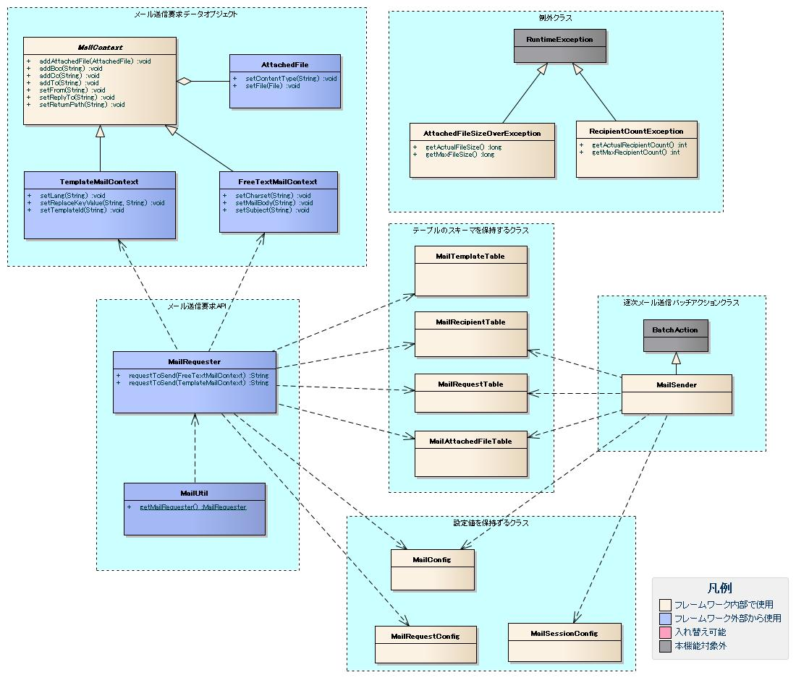

# メール送信

**公式ドキュメント**: [メール送信](http://www.oracle.com/technetwork/java/javamail/index.html)

## クラス図



## テーブルスキーマ定義

以下4クラスにテーブルのスキーマ情報を設定する。これらはInitializableインターフェース実装クラスのため、初期化処理の設定が必要。

| クラス | スキーマ情報を保持するテーブル |
|---|---|
| `nablarch.common.mail.MailRequestTable` | メール送信要求 |
| `nablarch.common.mail.MailRecipientTable` | メール送信先 |
| `nablarch.common.mail.MailAttachedFileTable` | メール添付ファイル |
| `nablarch.common.mail.MailTemplateTable` | メールテンプレート |

```xml
<component name="mailRequestTable" class="nablarch.common.mail.MailRequestTable">
    <property name="tableName" value="MAIL_REQUEST" />
    <property name="mailRequestIdColumnName" value="MAIL_REQUEST_ID" />
    <property name="subjectColumnName" value="SUBJECT" />
    <property name="fromColumnName" value="MAIL_FROM" />
    <property name="replyToColumnName" value="REPLY_TO" />
    <property name="returnPathColumnName" value="RETURN_PATH" />
    <property name="charsetColumnName" value="CHARSET" />
    <property name="statusColumnName" value="STATUS" />
    <property name="requestDateTimeColumnName" value="REQUEST_DATETIME" />
    <property name="sendDateTimeColumnName" value="SEND_DATETIME" />
    <property name="mailBodyColumnName" value="MAIL_BODY" />
    <property name="mailSendPatternIdColumnName" value="MAIL_SEND_PATTERN_ID" />
</component>
<component name="mailRecipientTable" class="nablarch.common.mail.MailRecipientTable">
    <property name="tableName" value="MAIL_RECIPIENT" />
    <property name="mailRequestIdColumnName" value="MAIL_REQUEST_ID" />
    <property name="serialNumberColumnName" value="SERIAL_NUMBER" />
    <property name="recipientTypeColumnName" value="RECIPIENT_TYPE" />
    <property name="mailAddressColumnName" value="MAIL_ADDRESS" />
</component>
<component name="mailAttachedFileTable" class="nablarch.common.mail.MailAttachedFileTable">
    <property name="tableName" value="MAIL_ATTACHED_FILE" />
    <property name="mailRequestIdColumnName" value="MAIL_REQUEST_ID" />
    <property name="serialNumberColumnName" value="SERIAL_NUMBER" />
    <property name="fileNameColumnName" value="FILE_NAME" />
    <property name="contentTypeColumnName" value="CONTENT_TYPE" />
    <property name="fileColumnName" value="ATTACHED_FILE" />
</component>
<component name="mailTemplateTable" class="nablarch.common.mail.MailTemplateTable">
    <property name="tableName" value="MAIL_TEMPLATE" />
    <property name="mailTemplateIdColumnName" value="MAIL_TEMPLATE_ID" />
    <property name="langColumnName" value="LANG" />
    <property name="subjectColumnName" value="SUBJECT" />
    <property name="charsetColumnName" value="CHARSET" />
    <property name="mailBodyColumnName" value="MAIL_BODY" />
</component>
<component name="initializer" class="nablarch.core.repository.initialization.BasicApplicationInitializer">
    <property name="initializeList">
        <list>
            <component-ref name="mailRequestTable" />
            <component-ref name="mailRecipientTable" />
            <component-ref name="mailAttachedFileTable" />
            <component-ref name="mailTemplateTable" />
        </list>
    </property>
</component>
```

## コード値とメッセージID

メール送信に使用するコード値・メッセージID・障害コードを`nablarch.common.mail.MailConfig`クラスのプロパティとして設定する。

```xml
<component name="mailConfig" class="nablarch.common.mail.MailConfig">
    <property name="mailRequestSbnId" value="9999" />
    <property name="recipientTypeTO" value="0" />
    <property name="recipientTypeCC" value="1" />
    <property name="recipientTypeBCC" value="2" />
    <property name="statusUnsent" value="0" />
    <property name="statusSent" value="1" />
    <property name="statusFailure" value="2" />
    <property name="mailRequestCountMessageId" value="MREQCOUNT0" />
    <property name="sendSuccessMessageId" value="MSENDOK000" />
    <property name="sendFailureCode" value="MSENDFAIL0" />
    <property name="abnormalEndExitCode" value="199" />
</component>
```

<details>
<summary>keywords</summary>

クラス図, メール送信構造, MailRequester, MailSender, クラス設計, MailRequestTable, MailRecipientTable, MailAttachedFileTable, MailTemplateTable, MailConfig, BasicApplicationInitializer, Initializable, テーブルスキーマ定義, 初期化設定, コード値設定, メッセージID設定, recipientTypeTO, recipientTypeCC, recipientTypeBCC, statusUnsent, statusSent, statusFailure, mailRequestSbnId, mailRequestCountMessageId, sendSuccessMessageId, sendFailureCode, abnormalEndExitCode

</details>

## 各クラスの責務

### メール送信要求API

| クラス名 | 概要 |
|---|---|
| `nablarch.common.mail.MailRequester` | メール送信受付API |
| `nablarch.common.mail.MailUtil` | MailRequesterインスタンス取得用のユーティリティ |

### 逐次メール送信バッチアクションクラス

**クラス**: `nablarch.common.mail.MailSender`

メール送信要求テーブルから未送信データを抽出してメール送信を行う。未送信データ抽出条件を以下から選択可能:

- テーブル全体から未送信データを抽出する
- メール送信パターンID毎に未送信データを抽出する（この場合、パターンID毎にプロセスを起動し、起動引数にmailSendPatternIdを指定する）

電子署名付加やメール本文暗号化は本クラスを継承して実現可能。

| メール送信パターンID | 送信内容 | 使用するバッチアクション |
|---|---|---|
| 01 | 電子署名なし | MailSender |
| 02 | 電子署名あり | MailSenderを継承した拡張クラス |

### メール送信要求データオブジェクト

| クラス名 | 概要 |
|---|---|
| `nablarch.common.mail.MailContext` | メール送信要求を表す抽象クラス |
| `nablarch.common.mail.FreeTextMailContext` | 非定形メール送信要求を表すクラス |
| `nablarch.common.mail.TemplateMailContext` | 定型メール送信要求を表すクラス |
| `nablarch.common.mail.AttachedFile` | メール添付ファイルの情報を保持するクラス |

### 設定値を保持するクラス

| クラス名 | 概要 |
|---|---|
| `nablarch.common.mail.MailRequestConfig` | メールのデフォルト設定を保持するクラス |
| `nablarch.common.mail.MailConfig` | 出力ライブラリ(メール送信)のコード値を保持するクラス |
| `nablarch.common.mail.MailSessionConfig` | メール送信用設定値を保持するクラス |

### テーブルのスキーマ情報を保持するクラス

| クラス名 | 概要 |
|---|---|
| `nablarch.common.mail.MailRecipientTable` | メール送信先管理テーブルのスキーマ情報を保持するクラス |
| `nablarch.common.mail.MailRequestTable` | メール送信要求管理テーブルのスキーマを保持するクラス |
| `nablarch.common.mail.MailAttachedFileTable` | 添付ファイル管理テーブルのスキーマ情報を保持するクラス |
| `nablarch.common.mail.MailTemplateTable` | メールテンプレート管理テーブルのスキーマ情報を保持するクラス |

### 例外クラス

| クラス名 | 概要 |
|---|---|
| `nablarch.common.mail.AttachedFileSizeOverException` | 添付ファイルサイズが上限値を超えている場合に発生する例外 |
| `nablarch.common.mail.RecipientCountException` | 宛先数が不正な場合（宛先なし or 上限数超過）に発生する例外 |

**クラス**: `nablarch.common.mail.MailRequester`

業務アプリケーションは`nablarch.common.mail.MailUtil`クラスの`getMailRequester`メソッドでこのコンポーネントを取得する。

プロパティに設定するコンポーネント:
- MailRequestConfig
- IdGenerator
- MailRequestTable
- MailRecipientTable
- MailAttachedFileTable
- MailTemplateTable

メール送信要求時の省略可能な項目のデフォルト値と、精査に使用する最大宛先数・添付ファイルサイズ上限値を`nablarch.common.mail.MailRequestConfig`クラスのプロパティとして設定する。

```xml
<component name="mailRequester" class="nablarch.common.mail.MailRequester">
    <property name="mailRequestConfig" ref="mailRequestConfig" />
    <property name="mailRequestIdGenerator" ref="idGenerator" />
    <property name="mailRequestTable" ref="mailRequestTable" />
    <property name="mailRecipientTable" ref="mailRecipientTable" />
    <property name="mailAttachedFileTable" ref="mailAttachedFileTable" />
    <property name="mailTemplateTable" ref="mailTemplateTable" />
</component>
<component name="mailRequestConfig" class="nablarch.common.mail.MailRequestConfig">
    <property name="defaultReplyTo" value="default.reply.to@nablarch.sample" />
    <property name="defaultReturnPath" value="default.return.path@nablarch.sample" />
    <property name="defaultCharset" value="ISO-2022-JP" />
    <property name="maxRecipientCount" value="100" />
    <property name="maxAttachedFileSize" value="2097152" />
</component>
```

## メール送信要求ID採番

メール送信要求IDの採番には`IdGenerator`を使用する（[id-generator-top](libraries-06_IdGenerator.md) 参照）。他の採番用コンポーネントと併用可能。メール送信APIのプロパティとして設定する（:ref:`mailApiComponentConfig` 参照）。

<details>
<summary>keywords</summary>

MailRequester, MailUtil, MailSender, MailContext, FreeTextMailContext, TemplateMailContext, AttachedFile, MailRequestConfig, MailConfig, MailSessionConfig, MailRecipientTable, MailRequestTable, MailAttachedFileTable, MailTemplateTable, AttachedFileSizeOverException, RecipientCountException, メール送信パターンID, 電子署名メール, IdGenerator, getMailRequester, mailRequestIdGenerator, defaultReplyTo, defaultReturnPath, defaultCharset, maxRecipientCount, maxAttachedFileSize, メール送信要求API, ID採番, デフォルト値設定

</details>

## テーブル定義

テーブル名・カラム名は任意に指定可能。データベースの型はJavaの型に変換可能な型を選択する。

### メール送信要求テーブル

| 定義 | Javaの型 | 備考 |
|---|---|---|
| メール送信要求ID | java.lang.String | PK |
| メール送信パターンID | java.lang.String | 任意項目。定義しなくてもメール送信機能は動作する |
| 件名 | java.lang.String | |
| 送信者メールアドレス | java.lang.String | Fromヘッダのメールアドレス |
| 返信先メールアドレス | java.lang.String | Reply-Toヘッダのメールアドレス |
| 差戻し先メールアドレス | java.lang.String | Return-Pathヘッダのメールアドレス |
| 文字セット | java.lang.String | Content-Typeヘッダの文字セット |
| ステータス | java.lang.String | 未送信/送信済/送信失敗のコード値 |
| 要求日時 | java.sql.Timestamp | |
| 送信日時 | java.sql.Timestamp | |
| 本文 | java.lang.String | |

### メール送信先テーブル

| 定義 | Javaの型 | 備考 |
|---|---|---|
| メール送信要求ID | java.lang.String | PK |
| 連番 | int | PK、一つのメール送信要求内の連番 |
| 送信先区分 | java.lang.String | TO/CC/BCCのコード値 |
| メールアドレス | java.lang.String | |

### メール添付ファイルテーブル

| 定義 | Javaの型 | 備考 |
|---|---|---|
| メール送信要求ID | java.lang.String | PK |
| 連番 | int | PK |
| 添付ファイル名 | java.lang.String | |
| 添付ファイルContent-Type | java.lang.String | |
| 添付ファイル | byte[] | |

### メールテンプレートテーブル

| 定義 | Javaの型 | 備考 |
|---|---|---|
| メールテンプレートID | java.lang.String | PK |
| 言語 | java.lang.String | PK |
| 件名 | java.lang.String | |
| 本文 | java.lang.String | |
| 文字セット | java.lang.String | メール送信時に指定する文字セット |

## 処理対象のメール送信パターンID

コマンドライン引数として指定する。`MailRequestTable`の`mailSendPatternIdColumnName`を設定した場合は必須。

- パラメータ名: `mailSendPatternId`
- パラメータ値: 処理対象のメール送信パターンID

コマンドライン引数の指定方法は :ref:`parsing_commandLine` を参照。

## メールセッション

SMTPサーバーへの接続情報を`nablarch.common.mail.MailSessionConfig`クラスのプロパティとして設定する（JavaMail APIの`javax.mail.Session`オブジェクトに設定するプロパティ）。

```xml
<component name="mailSessionConfig" class="nablarch.common.mail.MailSessionConfig">
    <property name="mailSmtpHost" value="localhost" />
    <property name="mailHost" value="localhost" />
    <property name="mailSmtpPort" value="25" />
    <property name="mailSmtpConnectionTimeout" value="100000" />
    <property name="mailSmtpTimeout" value="100000" />
</component>
```

その他の設定項目は [../architectural_pattern/batch_resident](../../processing-pattern/nablarch-batch/nablarch-batch-batch_resident.md) の各ハンドラの設定項目を参照。

<details>
<summary>keywords</summary>

メール送信要求テーブル, メール送信先テーブル, メール添付ファイルテーブル, メールテンプレートテーブル, テーブルスキーマ, メール送信パターンID, MailSessionConfig, mailSendPatternId, mailSmtpHost, mailHost, mailSmtpPort, mailSmtpConnectionTimeout, mailSmtpTimeout, SMTPサーバー接続設定, コマンドライン引数, メールセッション

</details>

## メール送信要求

メール送信要求APIを呼び出すと、メール送信要求テーブルとその関連テーブル（:ref:`mailTables` 参照）に格納される。格納時に最大宛先数と添付ファイルサイズの精査を行う。

2パターンのメール送信をサポート:

| No | パターン | 説明 |
|---|---|---|
| 1 | 定型メール送信 | 予めDBに登録されたテンプレートを元にメール作成。プレースホルダを業務アプリケーションから指定された文字列に置き換える |
| 2 | 非定型メール送信 | 任意の件名・本文でメール作成 |

**クラス**: `nablarch.common.mail.MailRequestTable`

| No | プロパティ名 | 説明 |
|---|---|---|
| 1 | tableName | メール送信要求管理テーブルの名前 |
| 2 | mailRequestIdColumnName | 要求IDカラムの名前 |
| 3 | subjectColumnName | 件名カラムの名前 |
| 4 | fromColumnName | 送信者メールアドレスカラムの名前 |
| 5 | replyToColumnName | 返信先メールアドレスカラムの名前 |
| 6 | returnPathColumnName | 差し戻し先メールアドレスカラムの名前 |
| 7 | charsetColumnName | 文字セットカラムの名前 |
| 8 | statusColumnName | ステータスカラムの名前 |
| 9 | requestDateTimeColumnName | 要求日時カラムの名前 |
| 10 | sendDateTimeColumnName | メール送信日時カラムの名前 |
| 11 | mailBodyColumnName | 本文カラムの名前 |
| 12 | mailSendPatternIdColumnName | メール送信パターンIDのカラム名（任意）。省略した場合はメール送信パターンIDを使用しない。 |

<details>
<summary>keywords</summary>

TemplateMailContext, FreeTextMailContext, 定型メール送信, 非定型メール送信, メール送信要求API, 添付ファイルサイズ検証, 最大宛先数, MailRequestTable, tableName, mailRequestIdColumnName, subjectColumnName, fromColumnName, replyToColumnName, returnPathColumnName, charsetColumnName, statusColumnName, requestDateTimeColumnName, sendDateTimeColumnName, mailBodyColumnName, mailSendPatternIdColumnName, メール送信要求テーブル設定

</details>

## メール送信要求実装例

```java
TemplateMailContext ctx = new TemplateMailContext();
ctx.setFrom("from@tis.co.jp");
ctx.addTo("to@tis.co.jp");
ctx.addCc("cc@tis.co.jp");
ctx.addBcc("bcc@tis.co.jp");
ctx.setSubject("件名");
ctx.setTemplateId("テンプレートID");
ctx.setLang("ja");
ctx.setReplaceKeyValue("name", "名前");
ctx.setReplaceKeyValue("address", "住所");
ctx.setReplaceKeyValue("tel", "電話番号");
// 値にnullを設定した場合、空文字列で置き換えが行われる。
ctc.setReplaceKeyValue("opeion", null);
// メール送信要求テーブルにメール送信パターンIDを定義している場合は設定する。
ctx.setMailSendPatternId("00001");
AttachedFile attachedFile = new AttachedFile();
attachedFile.setContentType("text/plain");
attachedFile.setFile(new File("path/to/file"));
ctx.addAttachedFile(attachedFile);
MailRequester requester = MailUtil.getMailRequester();
String requestId = requester.requestToSend(ctx);
```

**クラス**: `nablarch.common.mail.MailRecipientTable`（全て必須）

| No | プロパティ名 | 説明 |
|---|---|---|
| 1 | tableName | メール送信先テーブルの名前 |
| 2 | mailRequestIdColumnName | 要求IDカラムの名前 |
| 3 | serialNumberColumnName | 連番カラムの名前 |
| 4 | recipientTypeColumnName | メール送信区分カラムの名前 |
| 5 | mailAddressColumnName | メールアドレスカラムの名前 |

<details>
<summary>keywords</summary>

TemplateMailContext, AttachedFile, MailRequester, MailUtil, requestToSend, setTemplateId, setReplaceKeyValue, setMailSendPatternId, addAttachedFile, 定型メール送信実装, MailRecipientTable, tableName, mailRequestIdColumnName, serialNumberColumnName, recipientTypeColumnName, mailAddressColumnName, メール送信先テーブル設定

</details>

## nablarch.common.mail.MailAttachedFileTableの設定(すべて必須)

**クラス**: `nablarch.common.mail.MailAttachedFileTable`（すべて必須）

| No | プロパティ名 | 説明 |
|---|---|---|
| 1 | tableName | メール添付ファイルテーブルの名前 |
| 2 | mailRequestIdColumnName | 要求IDカラムの名前 |
| 3 | serialNumberColumnName | 連番カラムの名前 |
| 4 | fileNameColumnName | ファイル名カラムの名前 |
| 5 | contentTypeColumnName | Content-Typeカラムの名前 |
| 6 | fileColumnName | 添付ファイルカラムの名前 |

<details>
<summary>keywords</summary>

MailAttachedFileTable, tableName, mailRequestIdColumnName, serialNumberColumnName, fileNameColumnName, contentTypeColumnName, fileColumnName, 添付ファイルテーブル設定

</details>

## nablarch.common.mail.MailTemplateTableの設定(すべて必須)

**クラス**: `nablarch.common.mail.MailTemplateTable`（すべて必須）

| No | プロパティ名 | 説明 |
|---|---|---|
| 1 | tableName | メールテンプレート管理テーブルの名前 |
| 2 | mailTemplateIdColumnName | テンプレートIDカラムの名前 |
| 3 | langColumnName | 言語カラムの名前 |
| 4 | subjectColumnName | 件名カラムの名前 |
| 5 | charsetColumnName | 文字セットカラムの名前 |
| 6 | mailBodyColumnName | 本文カラムの名前 |

<details>
<summary>keywords</summary>

MailTemplateTable, tableName, mailTemplateIdColumnName, langColumnName, subjectColumnName, charsetColumnName, mailBodyColumnName, メールテンプレートテーブル設定

</details>

## nablarch.common.mail.MailConfigの設定

**クラス**: `nablarch.common.mail.MailConfig`

| No | プロパティ名 | 必須 | 説明 |
|---|---|---|---|
| 1 | mailRequestSbnId | ○ | メール送信要求IDの採番対象識別ID |
| 2 | recipientTypeTO | | メール送信先区分(TO)。指定しない場合は"1" |
| 3 | recipientTypeCC | | メール送信先区分(CC)。指定しない場合は"2" |
| 4 | recipientTypeBCC | | メール送信先区分(BCC)。指定しない場合は"3" |
| 5 | statusUnsent | | メール送信ステータス(未送信)。指定しない場合は"0" |
| 6 | statusSent | | メール送信ステータス(送信済)。指定しない場合は"1" |
| 7 | statusFailure | | メール送信ステータス(送信失敗)。指定しない場合は"9" |
| 8 | mailRequestCountMessageId | ○ | メール送信要求件数出力時のメッセージID。メッセージテーブルにこのIDに対応するメッセージが必要。 |
| 9 | sendSuccessMessageId | ○ | メール送信成功時のメッセージID。メッセージテーブルにこのIDに対応するメッセージが必要。 |
| 10 | sendFailureCode | ○ | メール送信失敗時の障害コード。メッセージテーブルにこのIDに対応するメッセージが必要。 |
| 11 | abnormalEndExitCode | ○ | メール送信失敗時の終了コード |

<details>
<summary>keywords</summary>

MailConfig, mailRequestSbnId, recipientTypeTO, recipientTypeCC, recipientTypeBCC, statusUnsent, statusSent, statusFailure, mailRequestCountMessageId, sendSuccessMessageId, sendFailureCode, abnormalEndExitCode, メール送信区分, 送信ステータス設定, 障害コード設定

</details>

## nablarch.common.mail.MailRequestConfigの設定(すべて必須)

**クラス**: `nablarch.common.mail.MailRequestConfig`（すべて必須）

| No | プロパティ名 | 説明 |
|---|---|---|
| 1 | defaultReplyTo | デフォルトの返信先メールアドレス(Reply-To)。メール送信要求時に指定を省略した場合に適用される。 |
| 2 | defaultReturnPath | デフォルトの戻し先メールアドレス(Return-Path)。メール送信要求時に指定を省略した場合に適用される。 |
| 3 | defaultCharset | デフォルトの文字セット(Charset)。メール送信要求時に指定を省略した場合に適用される。 |
| 4 | maxRecipientCount | 最大宛先数。メール送信要求受付時にこの値に基づいた精査が行われる。 |
| 5 | maxAttachedFileSize | 添付ファイルサイズ上限値(byte数)。メール送信要求受付時にこの値に基づいた精査が行われる。 |

<details>
<summary>keywords</summary>

MailRequestConfig, defaultReplyTo, defaultReturnPath, defaultCharset, maxRecipientCount, maxAttachedFileSize, デフォルト値設定, 宛先数上限, 添付ファイルサイズ上限

</details>

## nablarch.common.mail.MailSessionConfigの設定

**クラス**: `nablarch.common.mail.MailSessionConfig`

| No | プロパティ名 | 必須 | 説明 |
|---|---|---|---|
| 1 | mailSmtpHost | ○ | SMTPサーバー名 |
| 2 | mailHost | ○ | 接続ホスト名 |
| 3 | mailSmtpPort | ○ | SMTPポート |
| 4 | mailSmtpConnectionTimeout | ○ | 接続タイムアウト値 |
| 5 | mailSmtpTimeout | ○ | 送信タイムアウト値 |
| 6 | option | | 上記以外の`javax.mail.Session`のプロパティ。プロパティ名と値のマップ形式で設定する。 |

> **注意**: JavaMail APIはMessage-Idヘッダ生成時にメールセッションの`mail.host`プロパティをドメイン名として使用する。`mail.host`プロパティの設定を省略した場合、メール送信自体は可能だが、RFCに則った正しいMessage-Idヘッダを生成できない。そのため明示的に設定すること。

<details>
<summary>keywords</summary>

MailSessionConfig, mailSmtpHost, mailHost, mailSmtpPort, mailSmtpConnectionTimeout, mailSmtpTimeout, option, SMTPサーバー設定, Message-Idヘッダ, JavaMail設定, javax.mail.Session

</details>
