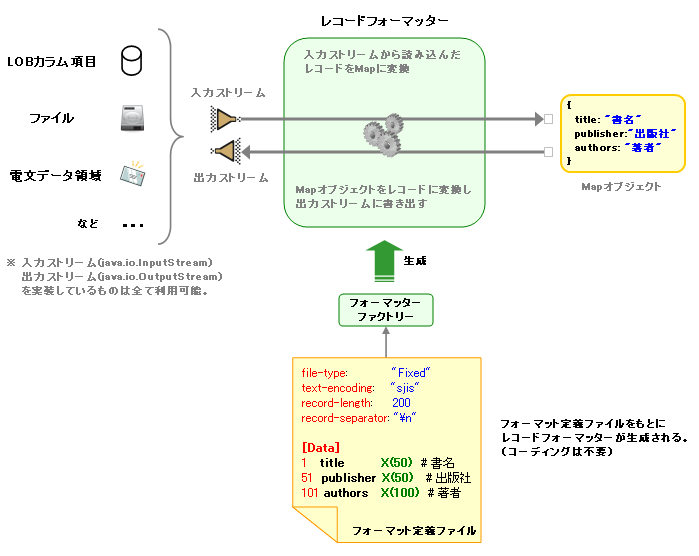

# 汎用データフォーマット機能

## 

EDI等で利用される多様なデータ形式に対応する汎用の入出力ライブラリ。システム間通信・バッチ処理のデータファイル読み書き・ファイルアップロード処理など様々な場面で使用される。

フォーマット定義ファイルは以下の2部構成:
1. **ディレクティブ宣言部**: データ形式(固定長/可変長)・エンコーディングなど共通設定を記述
2. **レコードフォーマット定義部**: レコード内の各フィールドの開始位置・データ型・変換処理などを記述。マルチフォーマット形式では複数のレコードフォーマットを定義し、条件に従って動的に切り替え可能

### コメント・文字コード・リテラル

- `#` から行末はコメント
- デフォルトの文字コードはUTF-8。他の文字コードを使う場合は **フォーマッターファクトリ** に設定を追加
- リテラル型:
  - 文字列: `"Nablarch"` — Javaの文字リテラルと同仕様。`\\Uxxxx` のUnicodeエスケープは非サポート
  - 10進整数: `0, 123, -456`（小数は不可）
  - 真偽値: `true, false, TRUE, FALSE`
- 任意識別子（レコードタイプ名・フィールド名等）: `/[a-zA-Z_$][a-zA-Z0-9_$]*/`

### ディレクティブ宣言部

書式: `[ディレクティブ名]: [ディレクティブ値(リテラル)]`

**共通ディレクティブ**

| ディレクティブ名 | 必須 | 内容 |
|---|---|---|
| `file-type` | ○ | データ形式。`"Fixed"`(固定長)または`"Variable"`(可変長) |
| `text-encoding` | ○ | 文字列フィールドのエンコーディング。JDKで利用可能な名称(`"UTF-8"`, `"MS932"`など) |
| `record-separator` | 可変長では○ | レコード終端文字列。可変長ではレコード終端判断に使用。固定長では各レコード直後に付加。バイト長は`record-length`に含まれない |

**固定長データ形式専用ディレクティブ**

| ディレクティブ名 | 必須 | デフォルト | 内容 |
|---|---|---|---|
| `record-length` | ○ | | 1レコードのバイト長 |
| `positive-zone-sign-nibble` | | ASCII: 0x3 / EBCDIC: 0xC | 符号付きゾーン数値の正符号Nibble値。`text-encoding`の値に応じて自動設定 |
| `negative-zone-sign-nibble` | | ASCII: 0x7 / EBCDIC: 0xD | 符号付きゾーン数値の負符号Nibble値 |
| `positive-pack-sign-nibble` | | ASCII: 0x3 / EBCDIC: 0xC | 符号付きパック数値の正符号Nibble値 |
| `negative-pack-sign-nibble` | | ASCII: 0x7 / EBCDIC: 0xD | 符号付きパック数値の負符号Nibble値 |
| `required-decimal-point` | | true | 符号無し/付き数値の小数点の要否。trueなら書き込みデータに小数点付与 |
| `fixed-sign-position` | | true | 符号位置の固定/非固定。true=フィールド左端固定、false=数値直前 |
| `required-plus-sign` | | false | 正符号の要否。trueなら読込データに正符号がなければエラー、書込データに正符号を出力 |

**可変長データ形式専用ディレクティブ**

| ディレクティブ名 | 必須 | デフォルト | 内容 |
|---|---|---|---|
| `field-separator` | ○ | | フィールドの区切り文字 |
| `quoting-delimiter` | | `"` (ダブルクォート) | フィールド値クォートに使用する文字 |
| `ignore-blank-lines` | | true | 空行を無視するか。trueなら空行をスキップ |
| `requires-title` | | false | 最初の行をタイトルとして読み書きするか。trueなら`[Title]`というレコードタイプ名で読み書き可能 |
| `max-record-length` | | 1000000 | 読み込みを許容する1行の文字列数 |
| `title-record-type-name` | | `[Title]` | タイトルのレコードタイプ名 |

### レコードフォーマット定義部

書式（シングルフォーマット）:
```bash
[レコードタイプ名]
[フィールド定義]
...
```

フィールド定義の書式:
```
[フィールド開始位置] [フィールド名] [フィールドタイプ定義] ([フィールドコンバータ定義] ...)
```

| 要素 | 必須 | 内容 |
|---|---|---|
| フィールド開始位置 | ○ | 固定長: 開始バイト数(1起算)、可変長: カラム通番 |
| フィールド名 | ○ | 任意識別子。`?`を先頭に付けるとFILLER項目（入力時にMapに格納されない）。**数字のみのフィールド名は定義不可（実行時例外）** |
| フィールドタイプ定義 | ○ | 詳細は [types_and_converters](#) 参照 |
| フィールドコンバータ定義 | | 詳細は [types_and_converters](#) 参照。複数指定可 |

記述例（固定長）:
```bash
[Default]
1    dataKbn       X(1)  "2"
2    FIcode        X(4)
39  ?tegataNum     X(4)  "9999"
114 ?unused        X(7)  pad("0")
```

## 固定長データ形式

### フィールドタイプ

| タイプ識別子 | Java型 | 内容 | デフォルト実装クラス | 引数 |
|---|---|---|---|---|
| X | String | シングルバイト文字列 (バイト長=文字数)。デフォルト: 半角空白による右トリム・パディング。null→空文字変換 | `nablarch.core.dataformat.convertor.datatype.SingleByteCharacterString` | バイト長(数値, 必須) |
| N | String | ダブルバイト文字列 (バイト長=文字数÷2)。デフォルト: 全角空白による右トリム・パディング。バイト長が2の倍数でない場合は構文エラー。null→空文字変換 | `nablarch.core.dataformat.convertor.datatype.DoubleByteCharacterString` | バイト長(数値, 必須) |
| XN | String | マルチバイト文字列。UTF-8のようにバイト長の異なる文字が混在するフィールドや全角文字列のパディングに半角スペースを使用する場合に使用。デフォルト: 半角空白による右トリム・パディング。null→空文字変換 | `nablarch.core.dataformat.convertor.datatype.ByteStreamDataString` | バイト長(数値, 必須) |
| Z | BigDecimal | ゾーン10進数値 (バイト長=桁数)。デフォルト: '0'による左トリム・パディング。null→0変換 | `nablarch.core.dataformat.convertor.datatype.ZonedDecimal` | 引数1: バイト長(必須), 引数2: 少数点以下桁数(任意, デフォルト=0) |
| SZ | BigDecimal | 符号付ゾーン10進数値 (バイト長=桁数)。デフォルト: '0'による左トリム・パディング。null→0変換 | `nablarch.core.dataformat.convertor.datatype.SignedZonedDecimal` | 引数1: バイト長(必須), 引数2: 少数点以下桁数(任意, デフォルト=0), 引数3: 正数時の最小桁バイト上位4ビットパターン(16進, 任意), 引数4: 負数時の最小桁バイト上位4ビットパターン(16進, 任意) |
| P | BigDecimal | パック10進数値 (バイト長=桁数÷2[端数切り上げ])。デフォルト: '0'による左トリム・パディング。null→0変換 | `nablarch.core.dataformat.convertor.datatype.PackedDecimal` | 引数1: バイト長(必須), 引数2: 少数点以下桁数(任意, デフォルト=0) |
| SP | BigDecimal | 符号付パック10進数値 (バイト長=(桁数+1)÷2[端数切り上げ])。デフォルト: '0'による左トリム・パディング。null→0変換 | `nablarch.core.dataformat.convertor.datatype.SignedPackedDecimal` | 引数1: バイト長(必須), 引数2: 少数点以下桁数(任意, デフォルト=0), 引数3: 正数時の最下位4ビットパターン(16進, 任意), 引数4: 負数時の最下位4ビットパターン(16進, 任意) |
| B | byte[] | バイナリ列。パディングなし。null時は値変換せずInvalidDataFormatExceptionを送出。アプリケーション側で明示的に値を設定すること。 | `nablarch.core.dataformat.convertor.datatype.Bytes` | バイト長(数値, 必須) |
| X9 | BigDecimal | 符号無し数値文字列 (バイト長=文字数)。シングルバイト文字列を数値として扱う。デフォルト: '0'による左トリム・パディング。文字列中に小数点記号(".")を含めることできる。null→0変換 | `nablarch.core.dataformat.convertor.datatype.NumberStringDecimal` | 引数1: バイト長(必須), 引数2: 小数点記号がない場合の少数点以下桁数(任意, デフォルト=0) |
| SX9 | BigDecimal | 符号付き数値文字列 (バイト長=文字数)。シングルバイト文字列を符号付き数値として扱う。デフォルト: '0'による左トリム・パディング。null→0変換 | `nablarch.core.dataformat.convertor.datatype.NumberStringDecimal` | 引数1: バイト長(必須), 引数2: 小数点記号がない場合の少数点以下桁数(任意, デフォルト=0) |

### フィールドコンバータ

| コンバータ名 | Java型(変換前後) | 内容 | デフォルト実装クラス | 引数 |
|---|---|---|---|---|
| pad | N/A | パディング・トリムの対象値を設定。X/N/XN: 右トリム・パディング、Z/SZ/P/SP/X9/SX9: 左トリム・パディング、B: 無効 | `nablarch.core.dataformat.convertor.value.Padding` | パディング・トリムの対象となる値(必須) |
| encoding | N/A | 文字エンコーディングを指定。X/N/XN以外では無視される | `nablarch.core.dataformat.convertor.value.UseEncoding` | エンコーディング名(文字列, 必須) |
| リテラル値 | Object <-> Object | 入力時: なにもしない。出力時: 値が未設定の場合に指定されたリテラル値を出力 | `nablarch.core.dataformat.convertor.value.DefaultValue` | なし |
| replacement | String <-> String | 入出力とも、寄せ字対象文字を変換先の文字に置換して返す | — | 寄せ字タイプ名(文字列, 任意) |

## 可変長データ形式

### フィールドタイプ

| タイプ識別子 | Java型 | 内容 |
|---|---|---|
| X、N、XN、X9、SX9 | String | すべてのフィールドを文字列として読み書き。どのタイプ識別子を指定しても動作は変わらない。フィールド長の概念がないので引数不要。Number型(BigDecimalなど)を読み書きしたい場合はnumber/signed_numberコンバータを使用。null→空文字変換 |

### フィールドコンバータ

| コンバータ名 | Java型(変換前後) | 内容 | デフォルト実装クラス | 引数 |
|---|---|---|---|---|
| encoding | N/A | 文字エンコーディングを指定。X/N以外では無視される | `nablarch.core.dataformat.convertor.value.UseEncoding` | エンコーディング名(文字列, 必須) |
| リテラル値 | Object <-> Object | 入力時: なにもしない。出力時: 値が未設定の場合に指定されたリテラル値を出力 | `nablarch.core.dataformat.convertor.value.DefaultValue` | なし |
| number | String <-> BigDecimal | 入力時: 符号なし数値であることをチェックしBigDecimalに変換（null/空文字→null）。出力時: 文字列に変換し符号なし数値であることをチェック（null→空文字） | `nablarch.core.dataformat.convertor.value.NumberString` | なし |
| signed_number | String <-> BigDecimal | 符号が許可される点以外はnumberコンバータと同じ仕様 | `nablarch.core.dataformat.convertor.value.SignedNumberString` | なし |
| replacement | String <-> String | 入出力とも、寄せ字対象文字を変換先の文字に置換して返す | `nablarch.core.dataformat.convertor.value.CharacterReplacer` | 寄せ字タイプ名(文字列, 任意) |

<details>
<summary>keywords</summary>

汎用データフォーマット機能, EDI, データ形式, 入出力ライブラリ, データファイル読み書き, ファイルアップロード, file-type, text-encoding, record-separator, record-length, field-separator, positive-zone-sign-nibble, negative-zone-sign-nibble, positive-pack-sign-nibble, negative-pack-sign-nibble, required-decimal-point, fixed-sign-position, required-plus-sign, quoting-delimiter, ignore-blank-lines, requires-title, max-record-length, title-record-type-name, ディレクティブ宣言部, レコードフォーマット定義部, 固定長データ形式, 可変長データ形式, フィールドタイプ定義, フィールドコンバータ定義, FILLER項目, X, N, XN, Z, SZ, P, SP, B, X9, SX9, SingleByteCharacterString, DoubleByteCharacterString, ByteStreamDataString, ZonedDecimal, SignedZonedDecimal, PackedDecimal, SignedPackedDecimal, Bytes, NumberStringDecimal, NumberString, SignedNumberString, Padding, UseEncoding, DefaultValue, CharacterReplacer, InvalidDataFormatException, フィールドタイプ, フィールドコンバータ, パディング, トリム, ゾーン10進数値, パック10進数値, number, signed_number, replacement, encoding, pad

</details>

## 基本構造

データ形式の定義を**フォーマット定義ファイル**に記述し、フレームワークがデータソースに対してレコードの読み書きを行う。このファイルには、レコード内のフィールドのレイアウトやデータ型に関する情報だけでなく、パディング・トリミング、寄せ字処理など、入出力の際の事前処理の実行定義についても指定できる。これにより、データ入出力に係わるほとんどの処理をフレームワーク側で行うことができる。プログラム側はレコードをMapオブジェクトとして扱うだけでよく、パース/シリアライズ等の定型処理の実装は不要。

> **注意**: 別添のツールを使用することで、データファイルや電文の形式を定義した各種仕様書からフォーマット定義ファイルを生成可能。

本機能は3つの要素から構成される:

1. **フォーマット定義ファイル**: データのフォーマット定義を記述したファイル。アプリケーションプログラマが作成する。
2. **レコードフォーマッター** (`DataRecordFormatter`): フォーマット定義ファイルに従いデータの読み書きを行うオブジェクト。入力ストリームからレコードを各フィールド名をキーとするMapで読み込み、MapインタフェースのオブジェクトをレコードとしてOutput可能。
3. **レコードフォーマッターファクトリ**: フォーマット定義ファイルを解析しレコードフォーマッターを生成するクラス（フレームワーク提供）。フォーマッターの機能拡張時はこのファクトリに拡張クラスを設定する。



マルチフォーマット形式では、定義ファイル上に複数のレコードフォーマットを定義し、特定のフィールドの値に応じてフォーマットを動的に切り替える。ヘッダーレコードとデータレコードでフォーマットが異なるデータ形式には必須。

### レコードタイプ識別フィールド定義

レコードタイプ名を **`Classifier`** とした特別なレコードフォーマット定義を追加する。書式は通常のレコードフォーマット定義と同じ。

```bash
[Classifier]
1   dataKbn   X(1)
```

各レコードフォーマット定義のレコードタイプ名の直後に、識別フィールドの適用条件を記述する:

```bash
[header]
dataKbn = "1"
1   dataKbn     X(1)  "1"
2   sysDate     X(8)
10  ?filler     X(411)
```

> **注意**: レコードタイプ識別フィールドの定義内容と、各レコードフォーマット定義の内容は必ずしも一致させる必要はない。

フォーマット定義例（マルチフォーマット）:
```bash
file-type:        "Fixed"
text-encoding:    "MS932"
record-length:    420
record-separator: "\r\n"

[Classifier]
1   dataKbn   X(1)

[header]
dataKbn = "1"
1   dataKbn  X(1)  "1"
2   sysDate  X(8)
10  ?filler  X(411)

[data]
dataKbn = "2"
1   dataKbn   X(1)   "2"
2   userId    X(10)
12  loginId   X(20)
32  kanjiName N(100)

[trailer]
dataKbn = "8"
1   dataKbn     X(1)  "8"
2   totalCount  Z(19)
21  ?filler     X(400)

[end]
dataKbn = "9"
1   dataKbn  X(1)   "9"
2   ?filler  X(419)
```

`requires-title: true` を設定することで、最初の行をタイトル行として通常のレコードタイプとは別に取り扱う機能が有効となる。最初の行はタイトル固有のレコードタイプ名 `[Title]` で読み書きされる。

タイトル行とデータ行を識別するフィールドが存在しない場合でも、本機能を使用することでシングルフォーマットの定義で読み込むことができる。

> **補足**: タイトル行が存在するファイルを読み込む場合、本機能の使用を推奨する。最初の行がタイトル行であることが保証されるため、ファイルレイアウトの精査を省略できる。

**制約:**
- レコードタイプ `[Title]` を必ずフォーマット定義しなければならない
- 最初の行を書き込む際に指定するレコードタイプは `[Title]` でなければならない
- 最初の行以降を書き込む際に指定するレコードタイプは `[Title]` 以外でなければならない
- レコードタイプ `[Title]` にフォーマットの適用条件が定義されている場合、最初の行は必ずその適用条件を満たさなければならない。また、最初の行以降の行はその適用条件を満たしてはいけない

タイトル固有のレコードタイプ名はデフォルトでは `[Title]` だが、`title-record-type-name` ディレクティブで個別に指定することも可能。

**シングルフォーマット定義の例:**

```
file-type:    "Variable"
text-encoding:     "ms932"
record-separator:  "\r\n"
field-separator:   ","
quoting-delimiter: "\""
requires-title: true

[Title]
1   Name       N  "書籍名"
2   Publisher  N  "出版社"
3   Authors    N  "著者"
4   Price      N  "価格"

[Books]
1   Name       X
2   Publisher  X
3   Authors    X
4   Price      X  Number
```

**マルチフォーマット定義の例:**

```
file-type:    "Variable"
text-encoding:     "ms932"
record-separator:  "\r\n"
field-separator:   ","
quoting-delimiter: "\""
requires-title: true

[Classifier]
1  Kubun X

[Title]
1   Kubun      N  "データ区分"
2   Name       N  "書籍名"
3   Publisher  N  "出版社"
4   Authors    N  "著者"
5   Price      N  "価格"

[DataRecord]
  Kubun = "1"
1   Kubun      X
2   Name       N
3   Publisher  N
4   Authors    N
5   Price      N

[TrailerRecord]
  Kubun = "2"
1   Kubun      X
2   RecordNum  X
```

<details>
<summary>keywords</summary>

DataRecordFormatter, フォーマット定義ファイル, レコードフォーマッター, レコードフォーマッターファクトリ, Mapオブジェクト, データフォーマット機能構造, パディング, トリミング, 寄せ字処理, 入出力事前処理, マルチフォーマット形式, Classifier, レコードタイプ識別フィールド, ヘッダーレコード, データレコード, 動的フォーマット切り替え, requires-title, title-record-type-name, タイトル行, 可変長ファイル, シングルフォーマット, マルチフォーマット, [Title], Title

</details>

## 使用例

フォーマット定義ファイルを作成後、`FormatterFactory`でレコードフォーマッター(`DataRecordFormatter`)を作成してデータの読み書きを行う。

**フォーマット定義ファイル例（固定長）:**

```bash
#
# ディレクティブ定義部
#
file-type:     "Fixed"  # 固定長ファイル
text-encoding: "ms932"  # 文字列型フィールドの文字エンコーディング
record-length:  120     # 各レコードbyte長

#
# データレコード定義部
#
[Default]
1    dataKbn       X(1)  "2"      # 1. データ区分
2    FIcode        X(4)           # 2. 振込先金融機関コード
6    FIname        X(15)          # 3. 振込先金融機関名称
21   officeCode    X(3)           # 4. 振込先営業所コード
24   officeName    X(15)          # 5. 振込先営業所名
39  ?tegataNum     X(4)  "9999"   # (手形交換所番号)
43   syumoku       X(1)           # 6. 預金種目
44   accountNum    X(7)           # 7. 口座番号
51   recipientName X(30)          # 8. 受取人名
81   amount        X(10)          # 9. 振込金額
91   isNew         X(1)           # 10.新規コード
92   ediInfo       X(20)          # 11.EDI情報
112  transferType  X(1)           # 12.振込区分
113  withEdi       X(1)  "Y"      # 13.EDI情報使用フラグ
114 ?unused        X(7)  pad("0") # (未使用領域)
```

**フォーマッター作成:**

```java
File formatFile = new File("./test.fmt");
DataRecordFormatter formatter = FormatterFactory
                               .getInstance()
                               .createFormatter(formatFile);
```

**レコード読み込み:**

```java
InputStream in = new FileInputStream("./data.dat");
formatter.setInputStream(in).initialize();
List<Map<String, Object>> records = new ArrayList<Map<String, Object>>();
while (formatter.hasNext()) {
  records.add(formatter.readRecord());
}
```

**レコード書き込み（同じフォーマッターを使用して出力(追加)）:**

```java
OutputStream out = new FileOutputStream("./data.dat");
formatter.setOutputStream(out).initialize();
formatter.writeRecord(new HashMap() {{
    put("FIcode",     "9999");
    put("FIname",     "ﾅﾌﾞﾗｰｸｷﾞﾝｺｳ");
    put("officeCode", "111");
}});
```

<details>
<summary>keywords</summary>

DataRecordFormatter, FormatterFactory, file-type, text-encoding, record-length, 固定長ファイル, レコード読み込み, レコード書き込み, フォーマット定義ファイル作成, ディレクティブ定義部, データレコード定義部

</details>
