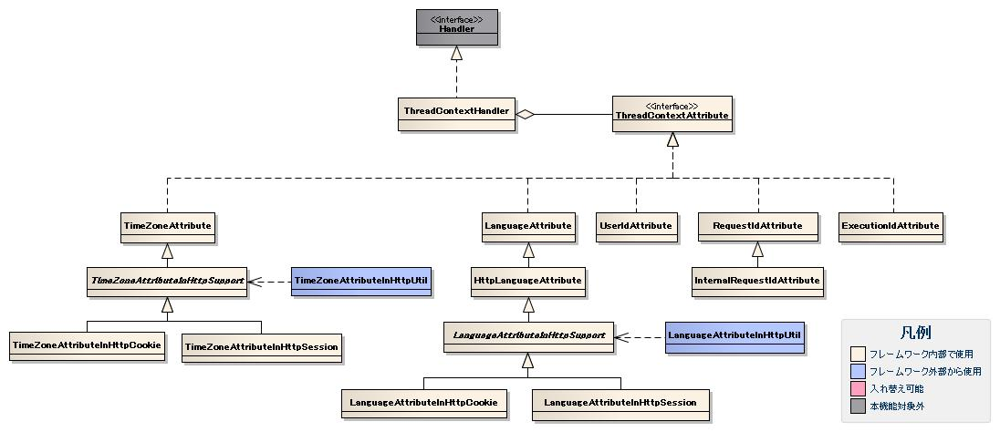

# 同一スレッド内でのデータ共有(スレッドコンテキスト)

スレッドコンテキストは、スレッドローカル変数上に保持された変数スコープである。
ユーザIDや、リクエストIDのように、ログ出力やDB共通項目への設定などの用途において、実行コンテキストを経由した
引き回しが難しいパラメータ類を格納する。

その内容の多くは、 [スレッドコンテキスト変数管理ハンドラ](../../component/handlers/handlers-ThreadContextHandler.md) によって設定されるが、
それ以外ハンドラでも、スレッドコンテキストに変数を設定するものが存在するほか、
業務アクションハンドラから任意の変数を設定することも可能である。

カレントスレッド内で子スレッドを起動した場合、本クラスで保持する値を暗黙的に子スレッドに引き継ぐ仕様となっている。
このため、子スレッドでは個別に値を設定することなく、親スレッドで設定した値を使用することが出来る。
ただし、子スレッドで値を変更する場合は、明示的に子スレッドにて値を設定する必要がある。

-----

## クラス図



### インタフェース定義

| クラス・インタフェース名 | 概要 |
|---|---|
| nablarch.common.handler.threadcontext.ThreadContextAttribute | スレッドコンテキストに属性を設定するインタフェース。 このインタフェースを実装したクラスは、コンテキストから属性値を取得する責務を持つ。 |

### クラス定義

| クラス名 | 概要 |
|---|---|
| nablarch.common.handler.threadcontext.ThreadContextHandler | スレッドコンテキストを初期化するハンドラ。 |
| nablarch.common.handler.threadcontext.RequestIdAttribute | [リクエストID](../../about/about-nablarch/about-nablarch-architectural-pattern-concept.md#request-processing) をスレッドコンテキストに設定するThreadContextAttribute。 |
| nablarch.common.handler.threadcontext.InternalRequestIdAttribute | [内部リクエストID](../../about/about-nablarch/about-nablarch-architectural-pattern-concept.md#internal-request-id) をリクエストIDと同じ値に初期設定する。 |
| nablarch.common.handler.threadcontext.UserIdAttribute | ログインしているユーザのユーザIDをスレッドコンテキストに設定するThreadContextAttribute。 ログインしていない場合には未認証ユーザを表すユーザIDを設定する。 |
| nablarch.common.handler.threadcontext.LanguageAttribute | 言語をスレッドコンテキストに設定するThreadContextAttribute。 |
| nablarch.common.handler.threadcontext.TimeZoneAttribute | タイムゾーンをスレッドコンテキストに設定するThreadContextAttribute。 |
| nablarch.common.handler.threadcontext.ExecutionIdAttribute | 実行時IDをスレッドコンテキストに設定するThreadContextAttribute。 実行時IDについては、 [実行時ID](../../component/libraries/libraries-01-Log.md#execution-id) を参照。 |

**LanguageAttributeのサブクラスとユーティリティ**

| クラス名 | 概要 |
|---|---|
| nablarch.common.web.handler.threadcontext.HttpLanguageAttribute | スレッドコンテキストに設定する言語をHTTPヘッダ(Accept-Language)から取得するThreadContextAttribute。 |
| nablarch.common.web.handler.threadcontext.LanguageAttributeInHttpSupport | HTTP上で言語の選択と選択された言語の保持を行うThreadContextAttributeの実装をサポートするクラス。 |
| nablarch.common.web.handler.threadcontext.LanguageAttributeInHttpCookie | クッキーを使用して言語の保持を行うThreadContextAttribute。 |
| nablarch.common.web.handler.threadcontext.LanguageAttributeInHttpSession | HTTPセッションを使用して言語の保持を行うThreadContextAttribute。 |
| nablarch.common.web.handler.threadcontext.LanguageAttributeInHttpUtil | HTTP上で選択された言語の保持を行う際に使用するユーティリティクラス。 |

**TimeZoneAttributeのサブクラスとユーティリティ**

| クラス名 | 概要 |
|---|---|
| nablarch.common.web.handler.threadcontext.TimeZoneAttributeInHttpSupport | HTTP上で選択されたタイムゾーンの保持を行うThreadContextAttributeの実装をサポートするクラス。 |
| nablarch.common.web.handler.threadcontext.TimeZoneAttributeInHttpCookie | クッキーを使用してタイムゾーンの保持を行うThreadContextAttribute。 |
| nablarch.common.web.handler.threadcontext.TimeZoneAttributeInHttpSession | HTTPセッションを使用してタイムゾーンの保持を行うThreadContextAttribute。 |
| nablarch.common.web.handler.threadcontext.TimeZoneAttributeInHttpUtil | HTTP上で選択されたタイムゾーンの保持を行う際に使用するユーティリティクラス。 |

## 使用方法

ThreadContextHandlerは、リクエスト毎にスレッドコンテキストの初期化を行う。
実際にスレッドコンテキストに設定する値を取得する責務は、
本クラスではなくThreadContextAttributeインタフェース実装クラスが持つ。

本フレームワークでは、スレッドコンテキストに持つ属性のうち、
フレームワーク内で使用する下記の属性を設定する
ThreadContextAttributeインタフェース実装クラスを提供している。

* [リクエストID](../../about/about-nablarch/about-nablarch-architectural-pattern-concept.md#request-processing)
* [内部リクエストID](../../about/about-nablarch/about-nablarch-architectural-pattern-concept.md#internal-request-id)
* ユーザID
* 言語
* タイムゾーン
* [実行時ID](../../component/libraries/libraries-01-Log.md#execution-id)

実行制御基盤によっては、ThreadContextHandlerによって初期化された上記属性を更新する場合がある。
上記属性のうち、初期化以降に更新される属性について、その状況を下記に示す。

| 属性 | ThreadContextHandler以外の箇所で更新される状況 |
|---|---|
| [リクエストID](../../about/about-nablarch/about-nablarch-architectural-pattern-concept.md#request-processing) | [メッセージング実行制御基盤](../../processing-pattern/mom-messaging/mom-messaging-messaging.md) のみ、 [要求電文(FWヘッダ)リーダ](../../component/readers/readers-FwHeaderReader.md) によって更新される。 |
| [内部リクエストID](../../about/about-nablarch/about-nablarch-architectural-pattern-concept.md#internal-request-id) | [画面オンライン実行制御基盤](../../processing-pattern/web-application/web-application-web-gui.md) では、内部フォーワード時に [内部フォーワードハンドラ](../../component/handlers/handlers-ForwardingHandler.md) によって更新される。 [メッセージング実行制御基盤](../../processing-pattern/mom-messaging/mom-messaging-messaging.md) では、 [要求電文(FWヘッダ)リーダ](../../component/readers/readers-FwHeaderReader.md) によって更新される。 |
| ユーザID | [メッセージング実行制御基盤](../../processing-pattern/mom-messaging/mom-messaging-messaging.md) のみ、 [要求電文(FWヘッダ)リーダ](../../component/readers/readers-FwHeaderReader.md) によって更新される。 |

ThreadContextAttributeインタフェース実装クラスについて、以下に記述する。

## RequestIdAttribute

RequestIdAttributeクラスは、スレッドコンテキストに設定する [リクエストID](../../about/about-nablarch/about-nablarch-architectural-pattern-concept.md#request-processing) を取得する責務を持つ。
本クラスは、URLの最後に現れる"/"から"."の間の文字列をリクエストIDと判断する。

## InternalRequestIdAttribute

InternalRequestIdAttributeクラスは、スレッドコンテキスト変数 [内部リクエストID](../../about/about-nablarch/about-nablarch-architectural-pattern-concept.md#internal-request-id) を
[リクエストID](../../about/about-nablarch/about-nablarch-architectural-pattern-concept.md#request-processing) と同じ値に初期化する責務を持つ。

## UserIdAttribute

UserIdAttributeクラスは、スレッドコンテキストに設定するユーザIDを取得する責務を持つ。

スレッドコンテキストのユーザIDには、Httpセッションに格納されたユーザIDを設定する。
ただし、HttpセッションからユーザIDを取得できなかった場合は未ログインのユーザとみなし、
未ログイン状態を示す特別なユーザIDを設定する。

認証処理では、セッションにユーザIDを設定しておく必要がある。

> **Note:**
> HttpセッションからユーザIDを取得する為のキー、未ログインユーザに設定するユーザIDについては、
> 本クラスのプロパティ設定により変更可能である。

## LanguageAttribute

LanguageAttributeクラスは、スレッドコンテキストに設定する言語を取得する責務を持つ。
LanguageAttributeは、国際化を行うアプリケーション向けにサブクラスを提供する。
LanguageAttributeおよびサブクラスとLanguageAttributeInHttpUtilの説明を下記に示す。

| クラス名 | 説明 |
|---|---|
| LanguageAttribute | リポジトリの設定で指定された言語をスレッドコンテキストに設定する。 明示的に指定しなかった場合、システムのデフォルトロケールが使用される。 |
| HttpLanguageAttribute | HTTPヘッダ(Accept-Language)から取得した言語をスレッドコンテキストに設定する。 具体的には以下の処理を行う。  HTTPヘッダ(Accept-Language)から言語の取得を試みる。 サポート対象の言語が取得できた場合は取得できた言語をスレッドコンテキストに設定する。 サポート対象の言語が取得できない場合は親クラスであるLanguageAttributeに処理を委譲する。 |
| LanguageAttributeInHttpCookie | クッキーを使用した言語の保持を行う。 具体的には以下の処理を行う。  クッキーに保持している言語の取得を試みる。 サポート対象の言語が取得できた場合は取得できた言語をスレッドコンテキストに設定する。 サポート対象の言語が取得できない場合は親クラスであるHttpLanguageAttributeに処理を委譲する。 |
| LanguageAttributeInHttpSession | HTTPセッションを使用した言語の保持を行う。 言語の保持にHTTPセッションを使用することを除き、具体的な処理はLanguageAttributeInHttpCookieと同じ。 |
| LanguageAttributeInHttpUtil | LanguageAttributeInHttpSupportのサブクラスを使用するアプリケーションに対して、 ユーザが選択した言語を保持する処理を提供する。 具体的には、言語選択処理やログイン処理を行うアクションでクッキーやHTTPセッションに言語を設定する際に使用する。  LanguageAttributeInHttpUtilはリポジトリから取得したLanguageAttributeInHttpSupportのサブクラスに処理を委譲する。 このため、本クラスを使用する場合は、リポジトリにLanguageAttributeInHttpSupportのサブクラスを"languageAttribute"という名前で登録する。 |

LanguageAttributeおよびサブクラスの選択基準を下記に示す。

| クラス名 | 言語の選択 | 言語の保存 | 説明 |
|---|---|---|---|
| LanguageAttribute | なし | なし | 国際化を行わないアプリケーションで使用する。  * 言語は常に固定となる。 * 言語設定に関してアプリケーションで何も実装しなくてよい。 |
| HttpLanguageAttribute | ブラウザの言語設定 | ブラウザの言語設定 | ブラウザの言語設定に応じて言語を切り替える場合に使用する。  * ログイン前であってもユーザが選択した言語に切り替わる。 * ユーザ毎でなくブラウザ(IE、Firefoxなど)毎に言語を保持する。 * 言語設定に関してアプリケーションで何も実装しなくてよい。 |
| LanguageAttributeInHttpCookie | 選択画面やリンクなど | クッキー | アプリケーションが提供する画面上でユーザに言語を選択させる場合に使用する。  * ログイン前であってもユーザが選択した言語に切り替わる。 * ユーザ毎でなくブラウザ(IE、Firefoxなど)毎に言語を保持する。 * アプリケーションではユーザに言語を選択させる画面処理の実装を行う。   選択された言語をクッキーに設定する処理はLanguageAttributeInHttpUtilが提供する。 |
| LanguageAttributeInHttpSession | 選択画面やリンクなど | データベース | アプリケーションが提供する画面上でユーザに言語を選択させる場合に使用する。  * ログイン前はユーザが選択した言語に切り替わらない。 * ユーザ毎に言語を保持するため、複数マシンからアプリケーションを使用した場合でも   ユーザが選択した言語に切り替わる。 * アプリケーションでは下記の実装を行う。    * ログイン時にユーザに紐づく言語の取得処理。     HTTPセッションに言語を設定する処理はLanguageAttributeInHttpUtilが提供する。   * ユーザに言語を選択させる画面処理。     選択された言語をHTTPセッションに設定する処理はLanguageAttributeInHttpUtilが提供する。   * 選択された言語をユーザに紐付けてデータベースに保存する処理。 |

## TimeZoneAttribute

TimeZoneAttributeクラスは、スレッドコンテキストに設定するタイムゾーンを取得する責務を持つ。
TimeZoneAttributeは、国際化を行うアプリケーション向けにサブクラスを提供する。
TimeZoneAttributeおよびサブクラスとTimeZoneAttributeInHttpUtilの説明を下記に示す。

| クラス名 | 説明 |
|---|---|
| TimeZoneAttribute | リポジトリの設定で指定されたタイムゾーンをスレッドコンテキストに設定する。 明示的に指定しなかった場合、システムのデフォルトタイムゾーンが使用される。 |
| TimeZoneAttributeInHttpCookie | クッキーを使用したタイムゾーンの保持を行う。 具体的には以下の処理を行う。  クッキーに保持しているタイムゾーンの取得を試みる。 サポート対象のタイムゾーンが取得できた場合は取得できたタイムゾーンをスレッドコンテキストに設定する。 サポート対象のタイムゾーンが取得できない場合は親クラスであるTimeZoneAttributeに処理を委譲する。 |
| TimeZoneAttributeInHttpSession | HTTPセッションを使用したタイムゾーンの保持を行う。 タイムゾーンの保持にHTTPセッションを使用することを除き、具体的な処理はTimeZoneAttributeInHttpCookieと同じ。 |
| TimeZoneAttributeInHttpUtil | TimeZoneAttributeInHttpSupportのサブクラスを使用するアプリケーションに対して、 ユーザが選択したタイムゾーンを保持する処理を提供する。 具体的には、タイムゾーン選択処理やログイン処理を行うアクションでクッキーやHTTPセッションにタイムゾーンを設定する際に使用する。  TimeZoneAttributeInHttpUtilはリポジトリから取得したTimeZoneAttributeInHttpSupportのサブクラスに処理を委譲する。 このため、本クラスを使用する場合は、リポジトリにTimeZoneAttributeInHttpSupportのサブクラスを"timeZoneAttribute"という名前で登録する。 |

TimeZoneAttributeおよびサブクラスの選択基準を下記に示す。

| クラス名 | タイムゾーンの選択 | タイムゾーンの保存 | 説明 |
|---|---|---|---|
| TimeZoneAttribute | なし | なし | 国際化を行わないアプリケーションで使用する。  * タイムゾーンは常に固定となる。 * タイムゾーン設定に関してアプリケーションで何も実装しなくてよい。 |
| TimeZoneAttributeInHttpCookie | 選択画面やリンクなど | クッキー | アプリケーションが提供する画面上でユーザにタイムゾーンを選択させる場合に使用する。  * ログイン前であってもユーザが選択したタイムゾーンに切り替わる。 * ユーザ毎でなくブラウザ(IE、Firefoxなど)毎にタイムゾーンを保持する。 * アプリケーションではユーザにタイムゾーンを選択させる画面処理の実装を行う。   選択されたタイムゾーンをクッキーに設定する処理はTimeZoneAttributeInHttpUtilが提供する。 |
| TimeZoneAttributeInHttpSession | 選択画面やリンクなど | データベース | アプリケーションが提供する画面上でユーザにタイムゾーンを選択させる場合に使用する。  * ログイン前はユーザが選択したタイムゾーンに切り替わらない。 * ユーザ毎にタイムゾーンを保持するため、複数マシンからアプリケーションを使用した場合でも   ユーザが選択したタイムゾーンに切り替わる。 * アプリケーションでは下記の実装を行う。    * ログイン時にユーザに紐づくタイムゾーンの取得処理。     HTTPセッションにタイムゾーンを設定する処理はTimeZoneAttributeInHttpUtilが提供する。   * ユーザにタイムゾーンを選択させる画面処理。     選択されたタイムゾーンをHTTPセッションに設定する処理はTimeZoneAttributeInHttpUtilが提供する。   * 選択されたタイムゾーンをユーザに紐付けてデータベースに保存する処理。 |

## ExecutionIdAttribute

ExecutionIdAttributeクラスは、スレッドコンテキストに設定する実行時IDを取得する責務を持つ。
実行時IDについては、 [実行時ID](../../component/libraries/libraries-01-Log.md#execution-id) を参照。

## 設定例

上記の基本的な属性を設定するには、下記のように設定を記述する。

```xml
<component class="nablarch.common.handler.threadcontext.ThreadContextHandler">
  <property name="attributes">
    <list>
      <!-- ユーザID -->
      <component class="nablarch.common.handler.threadcontext.UserIdAttribute">
        <property name="sessionKey"  value="user.id" />
        <property name="anonymousId" value="guest" />
      </component>

      <!-- リクエストID -->
      <component class="nablarch.common.handler.threadcontext.RequestIdAttribute" />

      <!-- 内部リクエストID -->
      <component class="nablarch.common.handler.threadcontext.InternalRequestIdAttribute" />

      <!-- 言語 -->
      <component class="nablarch.common.handler.threadcontext.LanguageAttribute">
          <property name="defaultLanguage" value="ja" />
      </component>

      <!-- タイムゾーン -->
      <component class="nablarch.common.handler.threadcontext.TimeZoneAttribute">
          <property name="defaultTimeZone" value="Asia/Tokyo" />
      </component>

      <!-- 実行時ID -->
      <component class="nablarch.common.handler.threadcontext.ExecutionIdAttribute" />
    </list>
  </property>
</component>
```

## 設定の記述

### ThreadContextHandlerの設定

| property名 | 設定内容 |
|---|---|
| attributes | ThreadContextAttributeインタフェースを実装したクラスのリストを設定する。 |

### UserIdAttributeの設定

| property名 | 設定内容 |
|---|---|
| sessionKey | セッションからユーザIDを取得する際のキーを設定する。設定しなかった場合、"USER_ID"がキーとして使用される。 |
| anonymousId | 未ログインユーザに対して設定するユーザIDを設定する。設定しなかった場合、未ログインユーザ対するユーザIDは設定されない。 |

### RequestIdAttributeの設定

RequestIdAttributeには設定値は存在しない。

### InternalRequestIdAttributeの設定

InternalRequestIdAttributeには設定値は存在しない。

### LanguageAttributeの設定

LanguageAttributeの設定項目詳細は下記の通り。

| property名 | 設定内容 |
|---|---|
| defaultLanguage | システムで使用するデフォルトの言語を文字列で指定する。 指定がない場合はシステムのデフォルトロケールを使用する。 |

HttpLanguageAttributeの設定例と設定項目詳細は下記の通り。

```xml
<component class="nablarch.common.web.handler.threadcontext.HttpLanguageAttribute">
  <property name="defaultLanguage" value="ja" />
  <property name="supportedLanguages" value="ja,en" />
</component>
```

| property名 | 設定内容 |
|---|---|
| defaultLanguage | システムで使用するデフォルトの言語を文字列で指定する。 指定がない場合はシステムのデフォルトロケールを使用する。 |
| supportedLanguages(必須) | サポート対象の言語を文字列配列で指定する。 |

LanguageAttributeInHttpCookieの設定例と設定項目詳細は下記の通り。

```xml
<component class="nablarch.common.web.handler.threadcontext.LanguageAttributeInHttpCookie">
  <property name="defaultLanguage" value="ja" />
  <property name="supportedLanguages" value="ja,en" />
  <property name="cookieName" value="app_language" />
  <property name="cookiePath" value="/action/" />
  <property name="cookieDomain" value="localhost" />
  <property name="cookieMaxAge" value="300" />
</component>
```

| property名 | 設定内容 |
|---|---|
| defaultLanguage | システムで使用するデフォルトの言語を文字列で指定する。 指定がない場合はシステムのデフォルトロケールを使用する。 |
| supportedLanguages(必須) | サポート対象の言語を文字列配列で指定する。 |
| cookieName | 言語を保持するクッキーの名前を指定する。 指定がない場合は"nablarch_language"を使用する。 |
| cookiePath | 言語を保持するクッキーが送信されるURIのパス階層を指定する。 指定がない場合はコンテキストパスを使用する。 |
| cookieDomain | 言語を保持するクッキーが送信されるドメイン階層を指定する。 指定がない場合はリクエストURLのドメイン名となる。 |
| cookieMaxAge | 言語を保持するクッキーの最長存続期間(秒単位)を指定する。 指定がない場合の存続期間はブラウザが終了するまでとなる。 |
| cookieSecure | 言語を保持するクッキーのsecure属性有無をを指定する。 指定がない場合secure属性は付与され **ない** 。 |

LanguageAttributeInHttpCookieを使用し、リンクにより言語を選択させる画面の実装例を示す。

**設定例**

```xml
<!-- LanguageAttributeInHttpUtilを使用するため、
     コンポーネント名を"languageAttribute"にする。-->
<component name="languageAttribute"
           class="nablarch.common.web.handler.threadcontext.LanguageAttributeInHttpCookie">
  <property name="defaultLanguage" value="ja" />
  <property name="supportedLanguages" value="ja,en" />
</component>
```

**JSPの実装例**

```jsp
<%-- n:submitLinkタグを使用しリンクを出力し、
     n:paramタグを使用しリンク毎に別々の言語を送信する。 --%>
<n:submitLink uri="/action/MenuAction/MENU00101" name="switchToEnglish">
  英語
  <n:param paramName="user.language" value="en" />
</n:submitLink>
<n:submitLink uri="/action/MenuAction/MENU00101" name="switchToJapanese">
  日本語
  <n:param paramName="user.language" value="ja" />
</n:submitLink>
```

**ハンドラの実装例**

```java
// ユーザが選択した言語の保持を行うハンドラ。
// 複数画面でユーザに言語を選択させる場合を想定しハンドラとして実装する。
public class I18nHandler implements HttpRequestHandler {

    public HttpResponse handle(HttpRequest request, ExecutionContext context) {
        String language = getLanguage(request, "user.language");
        if (StringUtil.hasValue(language)) {

            // LanguageAttributeInHttpUtilのkeepLanguageメソッドを呼び出し、
            // クッキーに選択された言語を設定する。
            // スレッドコンテキストにも言語が設定される。
            // 指定された言語がサポート対象の言語でない場合は、
            // クッキーとスレッドコンテキストへの設定を行わない。
            LanguageAttributeInHttpUtil.keepLanguage(request, context, language);
        }
        return context.handleNext(request);
    }

    private String getLanguage(HttpRequest request, String paramName) {
        if (!request.getParamMap().containsKey(paramName)) {
            return null;
        }
        return request.getParam(paramName)[0];
    }
}
```

> **Note:**
> I18nHandlerはアプリケーションの共通ハンドラとして使用することを想定しているため、
> HttpRequestのgetParamMapメソッドとgetParamメソッドを使用して直接リクエストパラメータにアクセスしている。
> 業務機能を提供する画面をアクションで実装する場合は、バリデーション機能を使用してリクエストパラメータを取得すること。

LanguageAttributeInHttpSessionの設定例と設定項目詳細は下記の通り。

```xml
<component class="nablarch.common.web.handler.threadcontext.LanguageAttributeInHttpSession">
  <property name="defaultLanguage" value="ja" />
  <property name="supportedLanguages" value="ja,en" />
  <property name="sessionKey" value="app_language" />
</component>
```

| property名 | 設定内容 |
|---|---|
| defaultLanguage | システムで使用するデフォルトの言語を文字列で指定する。 指定がない場合はシステムのデフォルトロケールを使用する。 |
| supportedLanguages(必須) | サポート対象の言語を文字列配列で指定する。 |
| sessionKey | 言語が格納されるセッション上のキー名を指定する。 指定がない場合はLanguageAttributeのgetKeyメソッドを使用する。 |

言語を選択させる画面の実装例は、LanguageAttributeInHttpCookieと同じため省略する。
ここでは、ログイン処理でユーザに紐づく言語をHTTPセッションに設定する実装例を示す。

**設定例**

```xml
<!-- LanguageAttributeInHttpUtilを使用するため、
     コンポーネント名を"languageAttribute"にする。-->
<component name="languageAttribute"
           class="nablarch.common.web.handler.threadcontext.LanguageAttributeInHttpSession">
  <property name="defaultLanguage" value="ja" />
  <property name="supportedLanguages" value="ja,en" />
</component>
```

**アクションの実装例**

```java
public HttpResponse doLOGIN00101(HttpRequest request, ExecutionContext context) {

    // ログイン処理は省略。
    // 認証に成功した場合の処理を以下に示す。

    // ログインユーザに紐づく言語を取得する。
    String language = // データベースからの取得処理は省略

    // LanguageAttributeInHttpUtilのkeepLanguageメソッドを呼び出し、
    // HTTPセッションに言語を設定する。
    // スレッドコンテキストにも言語が設定される。
    LanguageAttributeInHttpUtil.keepLanguage(request, context, language);

    return new HttpResponse("/MENU00101.jsp");
}
```

### TimeZoneAttributeの設定

TimeZoneAttributeの設定項目詳細は下記の通り。

| property名 | 設定内容 |
|---|---|
| defaultTimeZone | システムで使用するデフォルトのタイムゾーンを文字列で指定する。 指定がない場合はシステムのデフォルトタイムゾーンを使用する。 |

TimeZoneAttributeInHttpCookieの設定例と設定項目詳細は下記の通り。

```xml
<component class="nablarch.common.web.handler.threadcontext.TimeZoneAttributeInHttpCookie">
  <property name="defaultTimeZone" value="Asia/Tokyo" />
  <property name="supportedTimeZones" value="Asia/Tokyo,America/New_York" />
  <property name="cookieName" value="app_timeZone" />
  <property name="cookiePath" value="/action/" />
  <property name="cookieDomain" value="localhost" />
  <property name="cookieMaxAge" value="300" />
</component>
```

| property名 | 設定内容 |
|---|---|
| defaultTimeZone | システムで使用するデフォルトのタイムゾーンを文字列で指定する。 指定がない場合はシステムのデフォルトタイムゾーンを使用する。 |
| supportedTimeZones(必須) | サポート対象のタイムゾーンを文字列配列で指定する。 |
| cookieName | タイムゾーンを保持するクッキーの名前を指定する。 指定がない場合は"nablarch_timeZone"を使用する。 |
| cookiePath | タイムゾーンを保持するクッキーが送信されるURIのパス階層を指定する。 指定がない場合はコンテキストパスを使用する。 |
| cookieDomain | タイムゾーンを保持するクッキーが送信されるドメイン階層を指定する。 指定がない場合はリクエストURLのドメイン名となる。 |
| cookieMaxAge | タイムゾーンを保持するクッキーの最長存続期間(秒単位)を指定する。 指定がない場合の存続期間はブラウザが終了するまでとなる。 |
| cookieSecure | 言語を保持するクッキーのsecure属性有無をを指定する。 指定がない場合secure属性は付与され **ない** 。 |

TimeZoneAttributeInHttpCookieを使用し、リンクによりタイムゾーンを選択させる画面の実装例を示す。

**設定例**

```xml
<!-- TimeZoneAttributeInHttpUtilを使用するため、
     コンポーネント名を"timeZoneAttribute"にする。-->
<component name="timeZoneAttribute"
           class="nablarch.common.web.handler.threadcontext.TimeZoneAttributeInHttpCookie">
  <property name="defaultTimeZone" value="Asia/Tokyo" />
  <property name="supportedTimeZones" value="Asia/Tokyo,America/New_York" />
</component>
```

**JSPの実装例**

```jsp
<%-- n:submitLinkタグを使用しリンクを出力し、
     n:paramタグを使用しリンク毎に別々のタイムゾーンを送信する。 --%>
<n:submitLink uri="/action/MenuAction/MENU00101" name="switchToNewYork">
  ニューヨーク
  <n:param paramName="user.timeZone" value="America/New_York" />
</n:submitLink>
<n:submitLink uri="/action/MenuAction/MENU00101" name="switchToTokyo">
  東京
  <n:param paramName="user.timeZone" value="Asia/Tokyo" />
</n:submitLink>
```

**ハンドラの実装例**

```java
// ユーザが選択したタイムゾーンの保持を行うハンドラ。
// 複数画面でユーザにタイムゾーンを選択させる場合を想定しハンドラとして実装する。
public class I18nHandler implements HttpRequestHandler {

    public HttpResponse handle(HttpRequest request, ExecutionContext context) {
        String timeZone = getTimeZone(request, "user.timeZone");
        if (StringUtil.hasValue(timeZone)) {

            // TimeZoneAttributeInHttpUtilのkeepTimeZoneメソッドを呼び出し、
            // クッキーに選択されたタイムゾーンを設定する。
            // スレッドコンテキストにもタイムゾーンが設定される。
            // 指定されたタイムゾーンがサポート対象のタイムゾーンでない場合は、
            // クッキーとスレッドコンテキストへの設定を行わない。
            TimeZoneAttributeInHttpUtil.keepTimeZone(request, context, timeZone);
        }
        return context.handleNext(request);
    }

    private String getTimeZone(HttpRequest request, String paramName) {
        if (!request.getParamMap().containsKey(paramName)) {
            return null;
        }
        return request.getParam(paramName)[0];
    }
}
```

> **Note:**
> I18nHandlerはアプリケーションの共通ハンドラとして使用することを想定しているため、
> HttpRequestのgetParamMapメソッドとgetParamメソッドを使用して直接リクエストパラメータにアクセスしている。
> 業務機能を提供する画面をアクションで実装する場合は、バリデーション機能を使用してリクエストパラメータを取得すること。

TimeZoneAttributeInHttpSessionの設定例と設定項目詳細は下記の通り。

```xml
<component class="nablarch.common.web.handler.threadcontext.TimeZoneAttributeInHttpSession">
  <property name="defaultTimeZone" value="Asia/Tokyo" />
  <property name="supportedTimeZones" value="Asia/Tokyo,America/New_York" />
  <property name="sessionKey" value="app_timeZone" />
</component>
```

| property名 | 設定内容 |
|---|---|
| defaultTimeZone | システムで使用するデフォルトのタイムゾーンを文字列で指定する。 指定がない場合はシステムのデフォルトタイムゾーンを使用する。 |
| supportedTimeZones(必須) | サポート対象のタイムゾーンを文字列配列で指定する。 |
| sessionKey | タイムゾーンが格納されるセッション上のキー名を指定する。 指定がない場合はTimeZoneAttributeのgetKeyメソッドを使用する。 |

タイムゾーンを選択させる画面の実装例は、TimeZoneAttributeInHttpCookieと同じため省略する。
ここでは、ログイン処理でユーザに紐づくタイムゾーンをHTTPセッションに設定する実装例を示す。

**設定例**

```xml
<!-- TimeZoneAttributeInHttpUtilを使用するため、
     コンポーネント名を"timeZoneAttribute"にする。-->
<component name="timeZoneAttribute"
           class="nablarch.common.web.handler.threadcontext.TimeZoneAttributeInHttpSession">
  <property name="defaultTimeZone" value="Asia/Tokyo" />
  <property name="supportedTimeZones" value="Asia/Tokyo,America/New_York" />
</component>
```

**アクションの実装例**

```java
public HttpResponse doLOGIN00101(HttpRequest request, ExecutionContext context) {

    // ログイン処理は省略。
    // 認証に成功した場合の処理を以下に示す。

    // ログインユーザに紐づくタイムゾーンを取得する。
    String timeZone = // データベースからの取得処理は省略

    // TimeZoneAttributeInHttpUtilのkeepTimeZoneメソッドを呼び出し、
    // HTTPセッションにタイムゾーンを設定する。
    // スレッドコンテキストにもタイムゾーンが設定される。
    TimeZoneAttributeInHttpUtil.keepTimeZone(request, context, timeZone);

    return new HttpResponse("/MENU00101.jsp");
}
```

### ExecutionIdAttributeの設定

ExecutionIdAttributeには設定値は存在しない。
