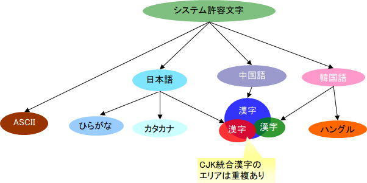

## 基本バリデータ・コンバータ

### 基本バリデータ・コンバータ一覧

**バリデータ**

| バリデータクラス名 | 対応するアノテーション | 説明 |
|---|---|---|
| nablarch.core.validation.validator.RequiredValidator | @Required | 必須入力チェックを行うバリデータ。 |
| nablarch.core.validation.validator.LengthValidator | @Length | 文字列長チェックを行うバリデータ。 String#length()メソッドによる文字列長チェックを行う。  > **Note:** > 文字列長のチェックのうち、長さ0の文字列に対するバリデーションは @Required で実施する想定であるため、 > 長さ0の入力は常に受付ける。 |
| nablarch.core.validation.validator.NumberRangeValidator | @NumberRange | 数値型のプロパティが指定する数値の間にあるかをチェックするバリデータ。 |
| nablarch.core.validation.validator.unicode.SystemCharValidator | @SystemChar | システム許容文字からなる文字列であるかをチェックするバリデータ。 |

**コンバータ(nablarch.core.validation.convertorパッケージ)**

| コンバータクラス名 | 変換後のオブジェクト | 変換可能なオブジェクト | 説明 |
|---|---|---|---|
| StringConvertor | java.lang.String | * java.lang.String * java.lang.String[]   **(ただし、要素数1の配列に限る。)** | 文字列型のプロパティへ設定するデータの変換を行うコンバータ。 設定値によって入力文字の前後に入ったスペースを trim できる。 |
| StringArrayConvertor | java.lang.String[] | * java.lang.String[] | String配列のプロパティへ設定するデータに使用するコンバータ。 |
| BigDecimalConvertor | java.math.BigDecimal | * java.lang.Numberのサブクラス * java.lang.String * java.lang.String[]   **(ただし、要素数1の配列に限る。)** | BigDecimal型のプロパティへ設定するデータの変換を行うコンバータ。 なお、本コンバータの入力値精査の詳細については、 [BigDecimalConvertor](../../javadoc/nablarch/core/validation/convertor/BigDecimalConvertor.html) を参照のこと。  > **Note:** > BigDecimalConvertorには、@Digitsアノテーションの設定が必須である。 > 下記例のように、セッタに@Digitsアノテーションを設定すること。  > @Digitsアノテーションの詳細は、 [値の変換](../../component/libraries/libraries-08-02-validation-usage.md#convert-property) > を参照。  > ```java > /** >  * 認証失敗回数を設定する。 >  * >  * @param failedCount 設定する認証失敗回数。 >  */ > @PropertyName("認証失敗回数") > @Required > @NumberRange(min = 0, max = 9) > @Digits(integer = 1, fraction = 0) > public void setFailedCount(Integer failedCount) { >     this.failedCount = failedCount; > } > ``` |
| IntegerConvertor | java.lang.Integer | * java.lang.Numberのサブクラス * java.lang.String * java.lang.String[]   **(ただし、要素数1の配列に限る。)** | Integer型のプロパティへ設定するデータの変換を行うコンバータ。  本コンバータでは、9桁までの値が変換できる。 9桁を超えるプロパティへの変換には、LongConvertorまたは、 BigDecimalConvertorを使用すること。 なお、本コンバータの入力値精査の詳細については、 [IntegerConvertor](../../javadoc/nablarch/core/validation/convertor/IntegerConvertor.html) を参照のこと。  > **Note:** > IntegerConvertorには、@Digitsアノテーションの設定が必須である。 > 詳細は、 [BigDecimalConvertorのDigits設定](../../component/libraries/libraries-validation-basic-validators.md#bigdecimal-digits) を参照すること |
| LongConvertor | java.lang.Long | * java.lang.Numberのサブクラス * java.lang.String * java.lang.String[]   **(ただし、要素数1の配列に限る。)** | Long型のプロパティへ設定するデータの変換を行うコンバータ。  本コンバータでは、18桁までの値が変換できる。 18桁を超えるプロパティへの変換には、BigDecimalConvertorを使用すること。  なお、本コンバータの入力値精査の詳細については、 [LongConvertor](../../javadoc/nablarch/core/validation/convertor/LongConvertor.html) を参照のこと。  > **Note:** > LongConvertorには、@Digitsアノテーションの設定が必須である。 > 詳細は、 [BigDecimalConvertorのDigits設定](../../component/libraries/libraries-validation-basic-validators.md#bigdecimal-digits) を参照すること |

### システム許容文字のバリデーション

システムが許容する文字は、そのシステムの要件によって異なる。
それぞれのシステムに相応しい許容文字を定義できるバリデーションを提供する。

> **Note:**
> 本バリデーションでは、JVMが扱える範囲の文字(U+0000～U+10FFFF)は全て扱えるが、
> サロゲートペアを許容する場合は、文字列中のchar値の数と実際の文字数が合わなくなる問題が
> 発生する点に注意すること。

#### 基本的な考え方

以下のようにして、文字集合を定義する。

* Unicodeのコードポイントを用いて、システムで使用可能な文字集合を定義する。 [1]
* 定義した文字集合の和集合をシステム許容文字として定義する。



例えば「制御コードを除くASCIIコード」という文字集合を定義するには、U+0020～U+00FEというコードポイントを使用する。

システム許容文字のバリデーションの機能は、下記クラス図に示すクラスで実現する。


#### インタフェース定義

| インタフェース名 | 概要 |
|---|---|
| nablarch.core.validation.validator.unicode.CharsetDef | 許容する文字の集合の定義する為のインタフェース。 |

#### クラス定義

| クラス名 | 概要 |
|---|---|
| nablarch.core.validation.validator.unicode.CharsetDefSupport | CharsetDef実装クラスのサポートクラス。 本クラスでは、CharsetDef毎のメッセージIDの保持のみを行う。 |
| nablarch.core.validation.validator.unicode.RangedCharsetDef | コードポイント範囲指定による許容文字集合定義 クラス。 |
| nablarch.core.validation.validator.unicode.LiteralCharsetDef | リテラル文字列指定による許容文字集合定義 クラス。 |
| nablarch.core.validation.validator.unicode.CompositeCharsetDef | 許容文字集合の組み合わせによる許容文字集合定義 クラス |
| nablarch.core.validation.validator.unicode.CachingCharsetDef | 許容文字判定結果のキャッシュ を行うクラス。 |
| nablarch.core.validation.validator.unicode.SystemChar | システム許容文字で構成された文字列であることを表わすアノテーション。 |
| nablarch.core.validation.validator.unicode.SystemCharValidator | システム許容文字のみからなる文字列であるかをチェックするクラス。 |

#### コードポイント範囲指定による許容文字集合定義

最も基本的な許容文字集合の定義方法である。
Unicodeのコードポイントで、開始位置と終了位置を定義する。
この範囲に含まれる文字が許容文字となる。

```xml
<!-- 制御コードを除いたASCII文字 -->
<component name="asciiWithoutControlCode" class="nablarch.core.validation.validator.unicode.RangedCharsetDef">
  <property name="startCodePoint" value="U+0020" />
  <property name="endCodePoint" value="U+007F" />
  <property name="messageId" value="MSG00092" />
</component>
```

> **Note:**
> コードポイント記載には、Unicode標準の U+n 表記を使用する。

#### リテラル文字列指定による許容文字集合定義

定義したい文字集合の要素が、Unicodeコードポイント上に散在する場合、
コードポイント範囲指定による許容文字集合定義 による集合定義は煩雑になるおそれがある。
そのような場合には、本クラスを利用することで簡便に文字集合を定義できる。

```xml
<!-- "A"と"1"と"あ"を許容 -->
<component name="literal" class="nablarch.core.validation.validator.unicode.LiteralCharsetDef">
  <property name="allowedCharacters" value="A1あ" />
  <property name="messageId" value="MSG00092" />
</component>
```

> **Note:**
> 上記の例では説明を簡略化するため、許容文字リテラルをvalue属性に直接記入しているが、
> config-file要素を利用して外部化することを推奨する。（ [import 要素および config-file 要素による外部ファイル読み込み時の優先順位](../../component/libraries/libraries-02-04-Repository-override.md#repository-import-override-priority) を参照）

#### 許容文字集合の組み合わせによる許容文字集合定義

複数の許容文字集合を組み合わせて許容文字集合を定義する。

```xml
<!-- 組み合わせ -->
<component name="composite" class="nablarch.core.validation.validator.unicode.CompositeCharsetDef">
  <property name="charsetDefList">
    <list>
      <component-ref name="asciiWithoutControlCode"/>
      <component-ref name="kana"/>
    </list>
  </property>
</component>
<!-- ASCII -->
<component name="asciiWithoutControlCode" class="nablarch.core.validation.validator.unicode.RangedCharsetDef">
  <property name="startCodePoint" value="U+0020" />
  <property name="endCodePoint" value="U+007E" />
</component>
```

> **Note:**
> 引数で与えられたコードポイントが許容文字か否かの判定処理は、
> リストの設定順に行われる。上記の例で言うと、ASCII、カナの順で判定が行われる。
> よって、そのシステムで出現頻度が高い許容文字集合定義を先頭に配置することで
> 処理性能が向上する。

#### 許容文字判定結果のキャッシュ

多数のCharsetDefを組み合わせて許容文字を定義する場合、
判定処理は定義した順番に実施される。
つまり、ヒットする許容文字集合定義が後方であるほど処理時間を要する。

出現頻度が多い許容文字集合定義を先頭に配置することで、性能劣化を最小限に防ぐことができるが、
これでも十分な性能が確保できない場合も想定される。
多種の文字を許容し、かつ各文字の出現頻度に偏りが少ないほど、
性能が劣化する可能性が高くなる。

このような場合は、判定結果をキャッシュすることで性能を改善できる。
特に、処理時間のバラつきを抑えたい場合に有効である。

以下に設定例を示す。
ここでは、 許容文字集合の組み合わせによる許容文字集合定義 で例示したCompositeCharsetDefに
キャッシュ機能を追加する例を挙げる。

```xml
<!-- 許容文字集合定義のキャッシュ -->
<component name="charsetDefCache" class="nablarch.core.validation.validator.unicode.CachingCharsetDef" >
  <!-- キャッシュする対象となる許容文字集合定義 -->
  <property name="charsetDef" ref="composite"/>
</component>
```

#### 許容文字集合の登録方法

定義した許容文字集合をバリデータ( SystemCharValidator )に設定することで、
 @SystemChar アノテーションによるシステム許容文字チェックが実施できる。

以下に設定例を示す。

```xml
<component class="nablarch.core.validation.validator.unicode.SystemCharValidator">
  <!-- 定義した許容文字集合を設定 -->
  <property name="defaultCharsetDef" ref="systemPermittedCharset"/>
  <property name="messageId" value="MSG90001"/>
</component>
```

#### 精査エラー時に使用するメッセージIDの指定方法

精査エラー時にエラーメッセージを取得するために使用するメッセージIDは、以下の3種類の指定方法から用途に応じて選択すること。

* SystemCharアノテーションに指定

  個別の機能で表示するメッセージを切り替えたい場合に、SystemCharアノテーションにメッセージIDを指定する。

  以下に実装例を示す

  ```java
  @PropertyName("パスワード")
  @Required
  @SystemChar(charsetDef = "alphaCharacter", messageId = "PASSWORD")
  @Length(max = 20)
  public void setConfirmPassword(String confirmPassword) {
      this.confirmPassword = confirmPassword;
  }
  ```
* CharsetDefに指定

  CharsetDefに指定した文字集合に該当しない場合に使用するメッセージIDを指定する。
  例えば、半角英字のみを許容する文字集合の場合には、「半角英字で入力してください。」を示すメッセージIDを指定することになる。

  精査の種別毎に表示するメッセージを切り替えるシステム(多くのシステムが該当するはずである)では、CharasetDefへメッセージIDを指定する方法を使用することになる。

  以下に設定例を示す。

  ```xml
  <component name="alphaCharacter" class="nablarch.core.validation.validator.unicode.RangedCharsetDef">
    <property name="startCodePoint" value="U+0061" />
    <property name="endCodePoint" value="U+007A" />
    <property name="messageId" value="MSG00002" />
  </component>
  ```
* SystemCharValidatorに指定

  システムで精査エラー時のメッセージを統一したい場合には、SystemCharValidatorにメッセージIDを指定する。
  例えば、精査の種類に関わらずエラーメッセージを「正しい値を入力してください。」と表示する場合には、
  SystemCharValidatorに上記メッセージを示すメッセージIDを指定することになる。

  以下に設定例を示す。

  ```xml
  <component class="nablarch.core.validation.validator.unicode.SystemCharValidator">
    <property name="defaultCharsetDef" ref="systemPermittedCharset"/>
    <property name="messageId" value="MSG99999"/>
  </component>
  ```

> **Note:**
> どのメッセージIDを使用するかの優先順位は、上記に記述した順となる。
> 例えば、全てにメッセージIDを指定した場合は最も優先されるSystemCharアノテーションに付与されたメッセージIDが使用される。

> なお、SystemCharValidatorのメッセージIDは、SystemChar及びCharsetDefにメッセージID指定がない場合に、
> デフォルトで使用されるメッセージIDがとなるため必ず指定する必要がある。

### 基本コンバータ、バリデータの設定値

#### nablarch.core.validation.convertor.StringConvertor

| property名 | 設定内容 |
|---|---|
| conversionFailedMessageId(必須) | 変換失敗時のデフォルトのエラーメッセージのメッセージIDを設定する。  例 : "{0}の値が不正です。" |
| allowNullValue | 変換対象の値にnullを許容するか否かを設定する。  設定を省略した場合のデフォルト動作では、nullを許容しない。  null値を許容するケースは、バッチアプリケーションのようにデータベースから取得した SqlRow(Mapインタフェースの実装クラス)をバリデーションする場合である。 (null値を許容した場合、データベースにnullが格納されていた場合でも、 精査エラーとならずに処理を継続することができる。)  逆に画面処理のように、バリデーション対象のKEY-VALUEの組み合わせが必ずHTTPリクエストで送信されてくる ケースでは、nullを許可してはならない。 なぜなら、nullを許可してしまうとバリデーション対象の値(KEY)がクライアントから送信されていない場合に 精査エラーとして処理を停止することができないためである。 |
| trimPolicy | トリムを行う際のポリシーを設定する。  設定できる値は以下の2種類である。  すべての文字に対してトリムを行う場合に設定するポリシー。  すべての文字に対してトリムを行わない場合に設定するポリシー。  設定を省略した場合は、すべての文字に対してトリムが行われない（"noTrim"を設定した場合と同様の動作となる）。  > **Note:** > トリムはJavaが標準で提供するString#trim()メソッドを用いて行う。具体的には、文字列の前後の'\\u0020'以下のコード（半角スペースやタブ、改行コード、null文字など）の文字を空白として認識し、削除する。 > '\\u0020'より大きいコードの文字についてはトリムは行われないので、全角スペースなどのトリムを行う要求がある場合はアクションから全角スペースのトリムを行うか、全角スペースのトリム機能を持ったコンバータを作成し、対応すること。 |
| extendedStringConvertors | String型に変換後、追加の変換を行うExtendedStringConvertorインタフェースを実装したクラスのリストを設定する。  スラッシュが付与された年月日文字列（2011/09/09）からスラッシュを除去したい場合などにextendedStringConvertors属性を指定する。 該当するプロパティのセッタには、設定したExtendedStringConvertorインタフェースを実装したクラスに対応するアノテーションを付与する。  [年月日コンバータ](../../component/libraries/libraries-validation-advanced-validators.md#extendedvalidation-yyyymmddconvertor) を使用する場合の例を下記に示す。  設定ファイル  ```xml <component class="nablarch.core.validation.convertor.StringConvertor">   <property name="conversionFailedMessageId" value="MSG90001"/>   <!--     extendedStringConvertors属性にExtendedStringConvertorインタフェースを     実装したクラスのリストを設定する。   -->   <property name="extendedStringConvertors">     <list>       <component class="nablarch.common.date.YYYYMMDDConvertor">         <property name="parseFailedMessageId" value="MSG90001" />       </component>     </list>   </property> </component> ```  Formクラス  ```java private String date;  // 追加の変換を行うコンバータに対応したアノテーションを // 追加で変換を行うプロパティのセッタに付与する。 // この例では、YYYYMMDDConvertorに対応するYYYYMMDDアノテーションを付与している。 @PropertyName("日付") @YYYYMMDD(allowFomat = "yyyy/MM/dd") public void setDate(String date) {     this.date = date; } ```  extendedStringConvertors属性が設定されない場合は、追加の変換を行わない。 |

#### nablarch.core.validation.convertor.StringArrayConvertor

本クラスは特に設定値を持たない。

#### nablarch.core.validation.convertor.BigDecimalConvertor

| property名 | 設定内容 |
|---|---|
| invalidDigitsIntegerMessageId(必須) | 小数部を指定しなかった場合の桁数不正時のデフォルトのエラーメッセージのメッセージIDを設定する。  例 : "{0}には{1}桁の数値を入力してください。" |
| invalidDigitsFractionMessageId(必須) | 小数部を指定した場合の桁数不正時のデフォルトのエラーメッセージのメッセージIDを設定する。  例 : "{0}には整数部{1}桁、小数部{2}桁の数値を入力してください。" |
| multiInputMessageId(必須) | 入力値に複数の文字列が設定された場合のデフォルトのエラーメッセージのメッセージIDを設定する。  例 : "{0}の値が不正です。" |
| allowNullValue | 詳細は、 StringConvertor#allowNullValue を参照。 |

#### nablarch.core.validation.convertor.IntegerConvertor

| property名 | 設定内容 |
|---|---|
| invalidDigitsIntegerMessageId(必須) | 小数部を指定しなかった場合の桁数不正時のデフォルトのエラーメッセージのメッセージIDを設定する。  例 : "{0}には{1}桁の数値を入力してください。" |
| multiInputMessageId(必須) | 入力値に複数の文字列が設定された場合のデフォルトのエラーメッセージのメッセージIDを設定する。  例 : "{0}の値が不正です。" |
| allowNullValue | 詳細は、 StringConvertor#allowNullValue を参照。 |

#### nablarch.core.validation.convertor.LongConvertor

| property名 | 設定内容 |
|---|---|
| invalidDigitsIntegerMessageId(必須) | 小数部を指定しなかった場合の桁数不正時のデフォルトのエラーメッセージのメッセージIDを設定する。  例 : "{0}には{1}桁の数値を入力してください。" |
| multiInputMessageId(必須) | 入力値に複数の文字列が設定された場合のデフォルトのエラーメッセージのメッセージIDを設定する。  例 : "{0}の値が不正です。" |
| allowNullValue | 詳細は、 StringConvertor#allowNullValue を参照。 |

#### nablarch.core.validation.validator.RequiredValidator

| property名 | 設定内容 |
|---|---|
| messageId(必須) | デフォルトのエラーメッセージのメッセージIDを設定する。 例 : "{0}は必ず入力してください。" |

#### nablarch.core.validation.validator.LengthValidator

| property名 | 設定内容 |
|---|---|
| maxMessageId(必須) | 最大文字列長を越えるエラーが発生した際に、最小文字列が指定されていなかった場合のデフォルトのエラーメッセージのメッセージIDを設定する。 例 : "{0}は{2}文字以下で入力してください。" |
| maxAndMinMessageId(必須) | 最大文字列長を越えるエラーが発生した際に、最小文字列が指定されていた場合のデフォルトのエラーメッセージのメッセージIDを設定する。 例 : "{0}は{1}文字以上{2}文字以下で入力してください。" |
| fixLengthMessageId(必須) | 固定桁数の文字列チェック(maxとminに同じ値を設定した場合)でエラーが発生した際のデフォルトのメッセージIDを設定する。 例 : "{0}は{1}文字で入力してください。" |

#### nablarch.core.validation.validator.NumberRangeValidator

| property名 | 設定内容 |
|---|---|
| maxMessageId(必須) | バリデーションの条件に最大値のみが指定されていた場合のデフォルトのエラーメッセージのメッセージIDを設定する。 例 : "{0}は{2}以下で入力してください。" |
| maxAndMinMessageId(必須) | バリデーションの条件に最大値と最小値が指定されていた場合のデフォルトのエラーメッセージのメッセージIDを設定する。 例 :  "{0}は{1}以上{2}以下で入力してください。" |
| minMessageId(必須) | バリデーションの条件に最小値のみが指定されていた場合のデフォルトのエラーメッセージのメッセージIDを設定する。 例 : "{0}は{1}以上で入力してください。" |

#### nablarch.core.validation.validator.unicode.SystemCharValidator

| property名 | 設定内容 |
|---|---|
| messageId(必須) | 有効文字以外が入力された場合のデフォルトのエラーメッセージのメッセージIDを設定する。 例 : "{0}に許容されない文字が含まれてています。" |
| defaultCharsetDef(必須) | バリデーションの条件に、許容文字集合定義の名称が指定されていない場合に使用する デフォルトの許容文字集合定義 |
