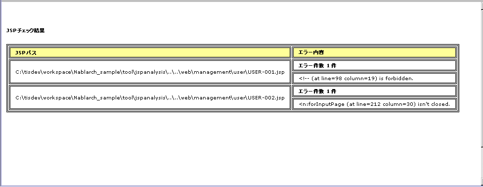

# JSP静的解析ツール

## 概要

JSPで使用を許可する構文とタグを設定ファイルに定義し、定義外の構文・タグの使用箇所を指摘するツール。保守性の向上とサニタイジング漏れの検出が目的。

**前提**: JSPコンパイルが成功するファイルのみ対応。taglibの閉じタグが存在しない等、JSPコンパイルが通らないファイルは正しく解析できない。

> **注意**: リクエスト単体テストが通っている場合、JSPコンパイルが通っていると判断してよい。

<details>
<summary>keywords</summary>

JSP静的解析ツール, サニタイジング漏れ検出, 保守性向上, JSPコンパイル, リクエスト単体テスト

</details>

## 仕様

設定ファイルに使用を許可する構文とタグの一覧を定義する。定義外の構文・タグが使用されている箇所を指摘し、チェック結果をHTMLまたはXML形式で出力する。

**指定可能な構文とタグ**: XMLコメント / HTMLコメント / EL式 / 宣言 / 式 / スクリプトレット / ディレクティブ / アクションタグ / カスタムタグ（HTMLタグ等の上記以外は指定不可）

**チェック対象外**: 使用を許可したタグの属性（属性内のEL式等は指摘しない）

EL式禁止時のチェック動作:
- 許可タグの属性に指定: **指摘しない**（例: `<jsp:include page="${ Expression }" />`）
- 許可タグのボディに指定: 指摘する（例: `<jsp:text>` 内の `${ Expression }`）
- HTMLタグの属性に指定: 指摘する（例: `<td height="${ Expression }">`）
- HTMLタグのボディに指定: 指摘する
- JavaScript中に指定: 指摘する（例: `var id = ${user.id}`）

<details>
<summary>keywords</summary>

EL式, カスタムタグ, アクションタグ, ディレクティブ, スクリプトレット, チェック対象外, 構文チェック, HTMLタグ

</details>

## 前提条件

Nablarch開発環境構築ガイドに従って開発環境を構築済みであること。

<details>
<summary>keywords</summary>

前提条件, 開発環境構築, Nablarch開発環境

</details>

## 設定ファイルの準備

任意のディレクトリに以下のファイルを配置する:

- `config.txt` — JSP静的解析ツール設定ファイル
- `transform-to-html.xsl` — JSP静的解析結果XMLをHTMLに変換する際の定義ファイル
- `jsp-analysis-build.xml` — Antビルドファイル
- `jsp-analysis-build.properties` — 環境設定ファイル

詳細は [02_JspStaticAnalysisInstall](java-static-analysis-02_JspStaticAnalysisInstall.md) を参照。

<details>
<summary>keywords</summary>

config.txt, transform-to-html.xsl, jsp-analysis-build.xml, jsp-analysis-build.properties, 設定ファイル準備

</details>

## JSP静的解析ツール設定ファイルの記述方法

> **警告**: 開発時にアプリケーションプログラマの都合に合わせて設定を変えてはいけない。

設定ファイルには使用を許可する構文とタグを記述する。`--` で始まる行はコメント行。

| 構文・タグ | 設定ファイルへの記述方法 |
|---|---|
| XMLコメント (`<%-- --%>`) | `<%--` |
| HTMLコメント (`<!-- -->`) | `<!--` |
| EL式 (`${...}`) | `${` |
| 宣言 (`<%! ... %>`) | `<%!` |
| 式 (`<%= ... %>`) | `<%=` |
| スクリプトレット (`<% ... %>`) | `<%` |
| ディレクティブ | `<%@` から始まり最初の空白まで（例: `<%@ taglib`） |
| アクションタグ | `<jsp:` から始まり最初の空白まで。`<jsp:` のみで全アクションタグ許可（例: `<jsp:attribute`） |
| カスタムタグ | アクションタグと同じ方法 |

**デフォルトで許可される構文・タグ**:

```
<n:
<c:
<%--
<%@ include
<%@ page
<%@ tag
<%@ taglib
<jsp:include
<jsp:directive.include
<jsp:directive.page
<jsp:directive.tag
<jsp:param
<jsp:params
<jsp:attribute
```

**デフォルトで除外される構文・タグ**（Nablarchカスタムタグに同等機能があるか、セキュリティホールとなりうる）:

```
<!--
<%!
${
<%
<%@ attribute
<%@ variable
<jsp:declaration
<jsp:expression
<jsp:scriptlet
<jsp:directive.attribute
<jsp:directive.variable
<jsp:body
<jsp:element
<jsp:doBody
<jsp:forward
<jsp:getProperty
<jsp:invoke
<jsp:output
<jsp:plugin
<jsp:fallback
<jsp:root
<jsp:setProperty
<jsp:text
<jsp:useBean
```

<details>
<summary>keywords</summary>

config.txt, デフォルト設定, セキュリティホール, EL式禁止, カスタムタグ設定, XMLコメント, HTMLコメント, アクションタグ設定, 設定ファイル記述方法

</details>

## 実行方法

`jsp-analysis-build.properties` のプロパティを設定して実行する。

1. `nablarch-tfw.jar` の配置ディレクトリ（デフォルト: `<プロジェクトルート>/test/lib`）を確認し、`common.project.test.lib` プロパティにパスを設定する。
2. チェック対象JSPを変更する場合は `checkjspdir` プロパティを変更する（`jsp-analysis-build.xml` からの相対パスまたは絶対パスで指定、例: `checkjspdir=../../main/web`）。
3. `jsp-analysis-build.xml` をEclipseのAntビューに追加し、実行したいターゲットを実行する。

> **注意**: 各プロパティの意味は :ref:`01_customJspAnalysisProp` を参照。


<details>
<summary>keywords</summary>

nablarch-tfw.jar, common.project.test.lib, checkjspdir, jsp-analysis-build.properties, Antビュー, Eclipse, 01_customJspAnalysisProp

</details>

## 出力結果確認方法

**HTML出力（JSP解析 HTMLレポート出力）**:
- デフォルトの出力先: Ant実行ディレクトリ
- 出力先変更: `jsp-analysis-build.properties` の `htmloutput` プロパティで指定
- 許可されていないタグが使用されている場合: `"構文またはタグ名" + "指摘位置" is forbidden.` が表示される
- 対処: プロジェクト規約で許可された構文・タグを使用する



**XML出力（JSP解析 XMLレポート出力）**:
- 出力先: `jsp-analysis-build.properties` の `xmloutput` プロパティで指定
- 出力XMLをXSLT等で整形することで任意のレポート作成可能

| 要素名 | 説明 |
|---|---|
| result | ルートノード |
| item | 各JSPに対して作成されるノード |
| path | 該当のJSPのパスを表すノード |
| errors | 該当のJSPに対する指摘を表すノード |
| error | 個々の指摘内容 |

```xml
<?xml version="1.0" encoding="UTF-8" standalone="no"?>
<result>
  <item>
    <path>C:\tisdev\workspace\Nablarch_sample\web\management\user\USER-001.jsp</path>
    <errors>
      <error>&lt;!-- (at line=17 column=6) is forbidden.</error>
      <error>&lt;c:if (at line=121 column=2) is forbidden.</error>
    </errors>
  </item>
</result>
```

<details>
<summary>keywords</summary>

htmloutput, xmloutput, HTMLレポート, XMLレポート, forbidden, XSLT, チェック結果出力

</details>
