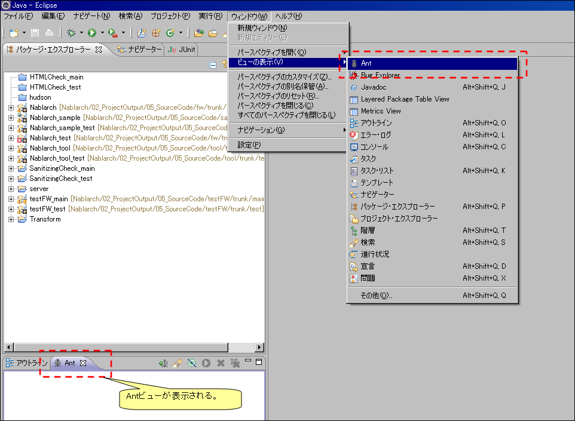
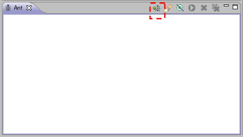
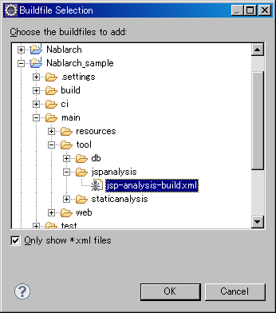

# JSP静的解析ツール インストールガイド

[JSP静的解析ツール](../../development-tools/java-static-analysis/java-static-analysis-04-JspStaticAnalysis.md) のインストール方法について説明する。

## 前提条件

* Nablarch開発環境構築ガイドに従ってNablarchサンプルアプリケーションがインストールされていること。

## インストール

本ツールはNablarchサンプルアプリケーションの <プロジェクトルート>/tool/jspanalysis 直下に配置した状態で配布されている。
ディレクトリごと任意の場所にコピーすればインストールは完了する。

## ツール構成

ツールの構成は下表の通り。

| ファイル名 | 説明 |
|---|---|
| jsp-analysis-build.properties | 環境設定ファイル |
| jsp-analysis-build.xml | Antビルドファイル |
| config.txt | JSP静的解析ツール設定ファイル |
| transform-to-html.xsl | JSP静的解析結果XMLをHTMLに変換する際の定義ファイル |

## プロパティファイルの書き換え

jsp-analysis-build.properties を各環境にあわせて設定する。

設定プロパティは次のとおりである。パスは相対パス、絶対パスが使用可能である。

| 設定プロパティ | 説明 |
|---|---|
| project.test | テストディレクトリパス |
| project.test.lib | テスト用ライブラリディレクトリパス |
| checkjspdir | チェック対象JSPディレクトリパスもしくはファイルパス |
| xmloutput | 出力先XMLファイルパス |
| checkconfig | 使用を許可するタグの設定ファイルパス |
| charset | チェック対象JSPファイルの文字コード |
| lineseparator | チェック対象JSPファイルで使用されている改行コード |
| htmloutput | チェック結果を出力するHTMLファイルパス |
| xsl | チェック結果のXMLをHTMLファイルに変換する際のXSLTファイルパス |

## Eclipseとの連携設定

以下に、Eclipseから本ツールを起動する手順を示す。

### Antビュー起動

ツールバーから、ウィンドウ(Window)→設定(Show View)を選択し、Antビューを開く。

### ビルドファイル登録

＋印のアイコンを押下し、ビルドスクリプトを選択する。

Antビルドファイル(jsp_analysis_build.xml)を選択する。

Antビューに登録したビルドファイルが表示されることを確認する。

