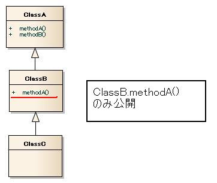

# 使用不許可APIチェックツール

使用不許可APIチェックツールの仕様と使用方法を記述する。

## 概要

本ツールは、Javaコーディング規約にて規定されている使用許可API以外のAPIを使用させないため、使用されているAPIをチェックするツールである。

使用できるAPIを限定することにより、安全でない実装を抑制でき、また、保守性向上などのメリットも得られる。

## 前提条件

* Nablarch開発環境構築ガイドに従って開発環境を構築済みであること。

## 仕様

本ツールは、コーディング規約で定められた使用を許可するAPI(以下、公開API)以外を使用していないことをチェックするツールである。
公開APIの指定は、ホワイトリスト形式で設定ファイルに記述する仕様となっているため、Nablarch導入プロジェクトのコーディング規約に従いカスタマイズを行うことが可能である。

公開APIは設定ファイルで指定する。詳細は [設定ファイル記述方法](../../development-tools/java-static-analysis/java-static-analysis-UnpublishedApi.md#01-customjavaanalysis) を参照のこと。

公開API以外の呼び出しは、下記ルールに従いチェックを行う。

* 非公開クラスの参照（インスタンス化、クラスメソッドの呼び出し）
* 非公開メソッドの呼び出し
* 非公開例外の補足、及び送出

設定ファイルには次の単位で公開APIを指定できる。

* パッケージ
* クラスまたはインタフェース
* コンストラクタまたはメソッド

デフォルトでは、Nablarchが提供する標準のJavaコーディング規約に準拠した以下の設定ファイルを提供する。

| 設定ファイル名 | 概要 |
|---|---|
| JavaOpenApi.config | Nablarchが規定するJava標準ライブラリ使用可能API |
| NablarchApiForProgrammer.config | プログラマ向け Nablarch Application Framework 使用可能API （業務機能の実装に必要なAPI） |
| NablarchTFWApiForProgrammer.config | プログラマ向け Nablarch Testing Framework 使用可能API （業務機能のテストに必要なAPI） |
| NablarchApiForArchitect.config | アーキテクト向け Nablarch Application Framework 使用可能API （NAFの機能拡張などで利用する必要があるAPI） |
| NablarchTFWApiForArchitect.config | アーキテクト向け Nablarch Testing Framework 使用可能API （NTFの機能拡張などで利用する必要があるAPI） |

本ツールはFindBugsのカスタムルールとして提供する。
つまり、次のように通常のFindBugs使用と同じ方法で使用できる。また、チェック結果も他のFindBugsのバグと同様の方法で確認できる。

* Antを使用して実行
* Eclipse Pluginとして実行

各使用方法についての詳細は [Eclipse Pluginとして使用](../../development-tools/java-static-analysis/java-static-analysis-UnpublishedApi.md#01-customjavaanalysiseclipse) 、 [FindBugsのAntタスクとして使用](../../development-tools/java-static-analysis/java-static-analysis-UnpublishedApi.md#01-customjavaanalysisant) を参照のこと。

本ツールが提供するFindBugsのカスタムルールのバグコード、バグタイプは次のとおりである。

* バグコード ： UPU
* バグタイプ ： UPU_UNPUBLISHED_API_USAGE

### 継承・インタフェース実装に関するチェック仕様

継承されたメソッド、インタフェースにて定義されたメソッドに対するチェック仕様は通常のチェック仕様とは異なる。
ここでは継承・インタフェース実装に関するチェック仕様について詳述する。
なお、本ツールはJavaコーディング規約に従い、インタフェース実装クラスへのアクセスはインタフェースを型として宣言していることを前提としている。

* 以下に、SubClassがSuperClassを継承している場合のチェック仕様を示す。

例：

```
List list = new ArrayList();
list.add(test); // Listインタフェースのaddメソッドが公開されていることをチェックする

SuperClass varSuper = new SubClass();
varSuper.testMethod(); // SuperClass.testMethodが公開されていることをチェックする。

SubClass varSub = new SubClass();
varSub.testMethod(); // SubClass.testMethod()が公開されていることをチェックする。
```

* 宣言されているクラス・インタフェースに当該のAPIが定義されていない場合、その親クラスまたはインタフェースを自クラスに近い方から順次検索する。
  そして、最初にそのAPIが定義されているクラスが見つかったら、そのクラスのメソッドが公開されているか否かを判定する。

  例：

  下図のような継承関係を考える。

  

  この時、使用可能か否かは次のとおりである。

  ```
  ClassC hoge = new ClassC();
  hoge.methodA(); // 使用可能
  hoge.methodB(); // 使用不可
  ```

## 設定ファイル

ここでは、本ツールの設定ファイルの配置方法、記述方法を記述する。

### 設定ファイル配置方法

設定ファイルを格納したディレクトリ（以後、設定ファイルディレクトリ）には、複数の設定ファイルを配置することが可能である。
設定ファイルの拡張子は「config」とすること。

> **Warning:**
> 当ツールは、使用されている全てのAPIに対してチェックを行う。そのため、デフォルトで提供する設定ファイルのみでは、自プロジェクトで宣言しているAPIにもチェックしてしまう。
> そのため、自プロジェクトで宣言しているAPIを公開する設定を行う必要がある。
> **デフォルトの2つの設定ファイルとは別に、自プロジェクト用の設定ファイルを設定ファイルディレクトリに配置し、自プロジェクトのパッケージを一意に特定できるパッケージを記述すること。**

> 例：プロジェクトにて作成する全てのパッケージが「jp.co.tis.sample」で始まる場合、「jp.co.tis.sample」と記述したテキストファイルを1つ設定ファイルディレクトリに配置する。

また上記の通り、Nablarchは対象とする開発者・スコープごとに4種類の設定ファイルを提供している。これらの設定ファイルの配置例を以下に示す。

* チェックする単位（各Eclipseプロジェクトなど）毎に、プロダクションコード向けの設定ファイルディレクトリとテストコード向けの設定ファイルディレクトリを用意し、下記のようにファイルを配置する

  ```
  <ワークスペース>
  ├─<プロジェクト>
  │  │  ├─tool
  │  │  │   ├─staticanalysis
  │  │  │   │  ├─production（プロダクションコード用設定ファイルディレクトリ）
  │  │  │   │  │  └─ NablarchApiForProgrammer.config
  │  │  │   │  ├─test（テストコード用設定ファイルディレクトリ）
  │  │  │   │  │  ├─ NablarchApiForProgrammer.config
  │  │  │   │  │  └─ NablarchTFWApiForProgrammer.config
  ```
* チェック対象がフレームワークの拡張などを行うためのコードの場合には、NablarchApiForArchitect.config, NablarchTFWApiForArchitect.configを利用する。

### 設定ファイル記述方法

設定ファイルには、パッケージ、クラス、インタフェース、コンストラクタ、メソッドのレベルで公開したいAPIを指定できる。

| 指定レベル | 説明と記述方法 |
|---|---|
| パッケージ | 指定されたパッケージに含まれる全てのAPI（サブパッケージのAPIを含める。）を公開する。  > **設定例:** > ```java > // java.lang配下を公開する場合 > java.lang > // nablarch.fw.web配下を公開する場合 > nablarch.fw.web > ``` |
| クラス、インタフェース | 指定されたクラスまたはインタフェースに含まれる全てのAPIを公開する。  クラスの完全修飾名を記述する。  > **設定例:** > ```java > // CodeUtilの全ての機能を公開する場合 > nablarch.common.code.CodeUtil > // Result.Successの全ての機能を公開する場合 > // Successは、Resultのネストクラス > nablarch.fw.Result.Success > ``` |
| コンストラクタ、メソッド | 指定されたコンストラクタまたはメソッドを公開する。  コンストラクタまたはメソッドの完全修飾名を記述する。 参照型の引数も完全修飾名を記述すること。  > **設定例:** > ```java > // コンストラクタの場合 > java.lang.Boolean.Boolean(boolean) > java.lang.StringBuilder.StringBuilder(java.lang.String) > nablarch.fw.web.HttpResponse.HttpResponse() >  > // メソッド呼出の場合 > java.lang.String.indexOf(int) > nablarch.core.validation.ValidationContext.isValid() > nablarch.fw.web.HttpResponse.write(byte[]) > nablarch.fw.web.HttpRequest.setParam(java.lang.String, java.lang.String...) >  > //******************************************************************* > // ネストクラスのコンストラクタの場合 > //******************************************************************* > // ネストクラスの場合は、記述方法が完全修飾名とは異なるため注意すること。 > // 以下にネストクラスの場合の記述例を示す。 >  > // コンストラクタの場合 > // SuccessがResultクラスのネストクラスの場合で引数なしコンストラクタを公開する場合は、 > // コンストラクタ名は「Result.Success()」と設定すること。 > // ※nablarch.fw.Result.Success.Success()と設定した場合、 > // Result.Successクラスのコンストラクタは使用可能とはならないので注意すること。 > nablarch.fw.Result.Success.Result.Success() > // 引数ありコンストラクタの場合 > nablarch.fw.Result.Success.Result.Success(java.lang.String) >  > // メソッド呼出の場合 > nablarch.fw.Result.Success.Result.getStatusCode() > ``` |

設定ファイルの1行につき、1つの公開APIを記述する。記述の順序は問わない。
次は、設定ファイルの記述例である。

```
java.lang
nablarch.fw.web
nablarch.common.code.CodeUtil
java.lang.Object
java.lang.Boolean(boolean)
java.lang.StringBuilder(java.lang.String)
nablarch.fw.web.HttpResponse.HttpResponse()
java.lang.String.indexOf(int)
nablarch.core.validation.ValidationContext.isValid()
nablarch.fw.web.HttpResponse.write(byte[])
nablarch.fw.web.HttpRequest.setParam(java.lang.String, java.lang.String...)
```

## Eclipse Pluginとして使用

ここでは、Eclipse Pluginとして本使用する場合の設定方法とチェック結果確認方法を記述する。

なお、Eclipseでのチェックではアーキテクト向けとプログラマ向け、プロダクションコードとテストコードなどの分類に従ったチェックを行うことができない。
CIなどでAntタスクとしても実行し、使用不許可APIが使用されていないことを分類に従って定期的に必ずチェックすること。

* 設定方法は次のとおりである。Nablarch開発環境構築ガイドに従って環境構築を行った場合、この設定を行わなくてよい。

  * 下記のように、本ツールが含まれるJAR「nablarch-tfw.jar」をFindBugsEclipsePluginホームディレクトリ直下にあるpluginディレクトリに配置する。

    ```
    <Eclipseホームディレクトリ>
    ├─dropins(またはplugins)
    │  │  ├─<FindBugsEclipsePluginホームディレクトリ>
    │  │  │   ├─plugin
    │  │  │   │  └─ nablarch-tfw.jar
    ```
  * Eclipseホームディレクトリにある、eclipse.iniファイルを修正する。

    システムプロパティに「nablarch-findbugs-config」をキーとして設定ファイルディレクトリの絶対パスを設定する。
    具体的には、次のように「-vmargs」の下に「-Dnablarch-findbugs-config=<テストコード用設定ファイルディレクトリの絶対パス>」を記述する。

    ```
    -vmargs
    -Dnablarch-findbugs-config=C:/nablarch/workspace/Nablarch_sample/tool/staticanalysis/published-config
    ```
  * Eclipseを再起動する。
* チェック結果は、エディターの左端に現れるバグマークまたは、FindBugsパースペクティブにて確認することができる。

## FindBugsのAntタスクとして使用

ここでは、Antから本ツールを実行する場合の方法を記述する。チェック結果の確認方法は、各プロジェクトでFindBugsをどう使用するかによって異なるためここでは述べない（CI上で使用することを想定している）。

FindBugsをAntから実行する場合、「nablarch-tfw.jar」をクラスパスに含めること。

また、systemProperty要素に「nablarch-findbugs-config」というキーで、設定ファイルディレクトリの絶対パスを下記のように設定する必要がある。

* プロダクションコードに対してチェックするタスク
  プロダクションコード用設定ファイルディレクトリの絶対パスを設定する
* テストコードに対してチェックするタスク
  テストコード用設定ファイルディレクトリの絶対パスを設定する

以下に、本ツールを使用する際のfindbugsタスクの定義例を示す。 (findbugsタスクの詳細は [Findbugs公式サイト](http://findbugs.sourceforge.net/ja/manual/anttask.html) を参照のこと。)

```xml
<target name="findbugs">
  <taskdef name="findBugs" classname="edu.umd.cs.findbugs.anttask.FindBugsTask" classpath="tool_lib/findbugs-1.3.9-rc1/findbugs-ant.jar" />
  <delete dir="reports/findbugs" />
  <mkdir dir="reports/findbugs" />
  <findbugs home="reports/findbugs"
      output="xml"
      outputFile="nablarch-findbugs.xml"
      excludeFilter="findbugs-exclude.xml" >
      <class location="target/main" />
      <auxClasspath path="main/web/WEB-INF/lib/xxxxx.jar" />
      <sourcePath path="main/java" />
      <systemProperty name="nablarch-findbugs-config" value="C:/nablarch/workspace/Nablarch_sample/tool/staticanalysis/published-config" />
  </findbugs>
</target>
```
