# 単体テスト概要

Nablarch Testing Frameworkでは、テストに必要となる開発プロセス、標準、各種ソフトウェアを提供する。
ここではNablarch Testing Frameworkが提供する単体テストについて概要を説明する。

> **Note:**
> 標準はbeta版リリース時点には含まれない。

## 単体テスト方法

Nablarch Testing Frameworkでは、単体テストとして以下の３つのテスト方法を提供する。

* [クラス単体テスト概要](../../development-tools/testing-framework/testing-framework-01-UnitTestOutline.md#class-unit-test)
* [リクエスト単体テスト概要](../../development-tools/testing-framework/testing-framework-01-UnitTestOutline.md#request-unit-test)
* [取引単体テスト概要](../../development-tools/testing-framework/testing-framework-01-UnitTestOutline.md#deal-unit-test)

それぞれのテストについて、概要を説明する。

### クラス単体テスト概要

クラス単体でのテスト。それぞれのクラスが単体で正しく動作することを確認する。

クラス単体テストでは、以下のステレオタイプについて単体テストを行う。

* Form
* Component（設計書に定義されたメソッドのみ）

これらのクラスの実装およびクラス単体テストの概念は、
バッチや画面オンラインといった処理の形態に依存しない共通のものとなっている。

Componentクラスが共通して利用される場合や、特に複雑な処理を行う場合は、
Componentクラスのインタフェースや処理概要が設計書に記載される。
この場合は、設計書の内容に基づいてクラス単体テストを実施する 。

Componentクラスに関する記載がない場合は、後述する [リクエスト単体テスト](../../development-tools/testing-framework/testing-framework-01-UnitTestOutline.md#request-unit-test) の中で
Componentクラスのテストもあわせて行う。

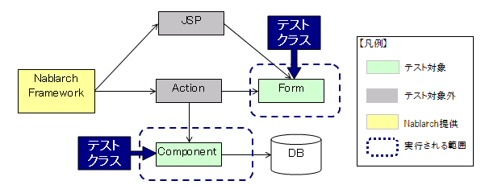

アプリケーションプログラマは、以下の成果物を作成する。

* テストソースコード(Java)
* テストデータ(Excel)

自動テストフレームワークを用いてテストクラスを作成し、自動テストを行う。
テストデータをExcelファイルに記述できる。

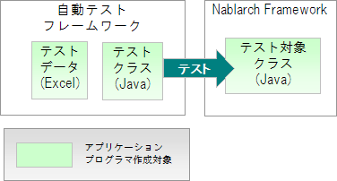

Form,Component各クラスに対して、単体テストを行うことができる。

* テスト実施の詳細については、 [クラス単体テストの実施方法](../../development-tools/testing-framework/testing-framework-01-ClassUnitTest.md) を参照。

> **Note:**
> クラス単体テストでは、Actionと設計書に記載が無いComponentについては対象外としている。
> これは以下の理由による。

> * >   クラス単体テストでカバーすべき範囲がリクエスト単体テスト（後述）でカバー可能であり、
>   かつリクエスト単体テストの実施は必須であるため、クラス単体テストの実施が非効率となるため。
>   (Actionのテストとリクエスト単体テストは内容が重複する)
> * >   これらのクラス、メソッドはアプリケーションプログラマの判断により作成されるものであり、
>   設計書に記載されたものではない。これらのクラス、メソッドに対するテストは、
>   アプリケーションプログラマの観点によるホワイトボックス的なテストであり、
>   その妥当性を設計書と照らし合わせて確認することができないため。

### リクエスト単体テスト概要

リクエスト単位のテスト。

クラス単体テストでFormおよび一部のComponentの品質を確保したのち、それらのクラスを組み合わせ、
ひとつの処理リクエストを受け取って正しく動作するかを確認する。

処理リクエストの実体は、画面オンラインであればHTTPリクエスト、
メッセージング処理では要求電文のように処理の形態ごとに異なるため、
リクエスト単体テストの方式もそれぞれ異なっている。

#### 画面オンライン処理におけるリクエスト単体テスト

画面オンライン処理におけるリクエスト単体テストでは、テストクラスと同一のJVM上で動作する内蔵サーバを使用することにより、
HTTPリクエスト送信から、サーブレットコンテナ上の処理、JSPのレンダリング、HTTPレスポンス送信までの
一連の処理を自動テストの範囲とすることを可能としている。
これにより、従来はアプリケーションサーバにデプロイして打鍵しなければ確認できなかったテストの大部分を、
自動テストで確認することができる。

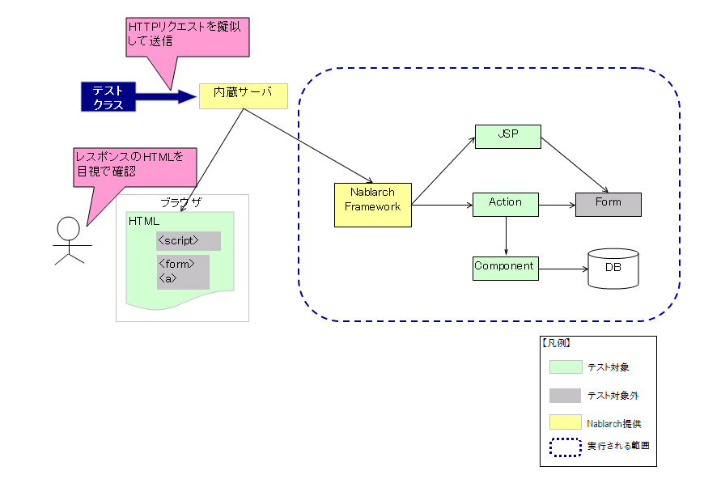

本テストフレームワークの特色と利点を以下にあげる。

1. リクエストやセッション等のサーバ上のオブジェクトを自動テストから設定・検証することが可能。

内蔵サーバはテストコードと同一VM上で動作するので、セッションスコープやリクエストスコープ上の変数をアサートの対象とすることが可能である。
また、セッションスコープ上のログイン状態や、ワークフローステータスといったデータをテストケースから直接セットアップすることで、
画面遷移上の制約によらず任意の状態・画面をテストすることができる。

1. JSP上のエラーを自動テストで検出することが可能。

内蔵サーバのレスポンスをテストケースから参照することが可能であり、
HTTPレスポンスコードや、ボディの内容を検証できる。
これにより、JSP上のエラー等についても自動テストで検出することが可能である。
例えば、JSPからリクエストコンテキスト上のオブジェクトを参照した際にNullPointerExceptionが発生した場合は、
HTTPレスポンスコードが500となり、自動テストでエラーとなる。
また、レスポンス中のHTMLはテストフレームワークによって自動的に構文チェックされ [1] 、
問題が検出された場合は、その違反内容に応じた例外が発生し、そのテストケースは失敗となる。
特に、 **<jsp:include>** や、 **Tiles** といった仕組みを使用している画面では、各モジュールが生成したHTMLを組み合わせて
表示することになるので、結果として不正なHTMLを生成してしまう危険性が高い。
このような不具合は十分な打鍵テストを行っても検出できないことが多く、それを自動テストで確認できることは大きな利点となる。

1. 画面レイアウト等の目視確認テスト作業負荷の軽減

本テストフレームワークでは、自動テストの各ケース毎に、その処理結果画面(HTTPレスポンスボディ)を
HTMLファイルとして取得することができる。このHTMLファイルには、HTMLが参照するCSSや画像ファイルも付属するため、
そのままブラウザで開いてレイアウトを確認することができる。(サーバの実行等は一切不要である。)

最大桁のデータ入力/表示の際のレイアウト確認などのテストは、通常、打鍵作業が必要となるが、
本テストフレームワークを使用することで、自動テストが出力したHTMLを流れ作業で目視確認することができ、
作業工数を低減させることができる。

1. リグレッションテストにおける自動テスト範囲の拡大

一定規模以上のプロジェクトでは、そのテスト工数の多くがリグレッションテスト工数に充てられる。
本テストフレームワークでは、従来の方式では打鍵が必要となるテストについても、自動テストの範囲とすることで
リグレッションテストに必要な工数を大幅に圧縮することができる。

1. アプリケーションサーバを使用しない高速開発

通常のアプリケーションサーバを使用したテストとは異なり、ソースコード修正の際にサーバを再起動する必要がない。
その為、少しずつ試しながら画面を作るというように、柔軟かつ高速に製造工程を進めることができる。

> **Note:**
> リクエスト単体テストでは、HTTPリクエスト送信を擬似しているだけであり、実際にブラウザ上からサブミットしている訳ではない。
> このため、以下の確認項目はリクエスト単体テストの対象外となる。（後述の  [取引単体テスト](../../development-tools/testing-framework/testing-framework-01-UnitTestOutline.md#deal-unit-test) で実施）。

> * >   formタグのaction属性が正しいか
> * >   anchorタグのリンク先が正しいか
> * >   inputタグ、selectタグのname属性は正しいか
> * >   JavaScriptが正しく動作するか

HTML構文については、 [HTMLチェックツール](../../development-tools/toolbox/toolbox-03-HtmlCheckTool.md) を参照。

クラス単体と同様、自動テストフレームワークを用いてテストクラスを作成し、自動テストを行う。

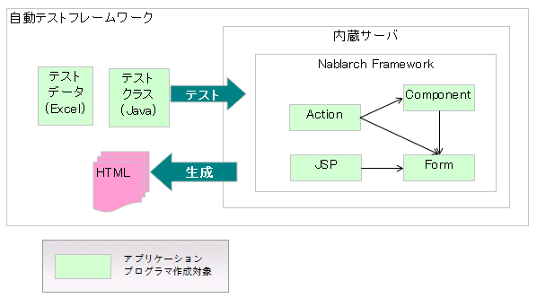

* テスト実施の詳細については、 [リクエスト単体テストの実施方法](../../development-tools/testing-framework/testing-framework-02-requestunittest-index.md) を参照。

#### バッチ処理におけるリクエスト単体テスト

バッチ処理のリクエスト単体テストは、バッチ処理に付与されたリクエストID単位の
処理 [2] を確認する。

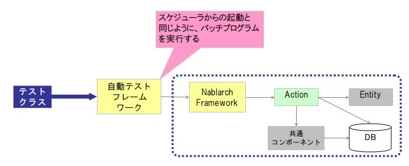

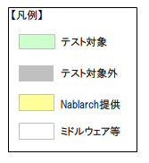

処理のおおまかな流れを以下に示す。

1. テスト準備を行う。

* 入力ファイルの配置
* データベースのセットアップ
  等

1. Nablarch Application Frameworkのメインクラスを起動する。

これによりテスト対象となるバッチ処理が実行される。

1. テスト結果を確認する。

* 出力ファイルの内容
* データベースの更新結果
* 期待したログが出力されたかどうか
  等

バッチ処理におけるリクエストは、実行される処理の種類ごとにリクエストIDが振られる。
例えば、都度起動バッチの場合、ジョブスケジューラから起動されるジョブまたはジョブステップの単位でリクエストIDが付与される。

常駐バッチの場合、本来は１度起動されると常駐して処理し続けるが、
リクエスト単体テストにおいては、常駐処理を制御しているハンドラを自動テストフレームワークが解除する。
これにより、常駐バッチが処理対象データを処理しきった後に、起動元に制御が戻る為、自動テストが可能となっている。

**【通常の常駐バッチ】**

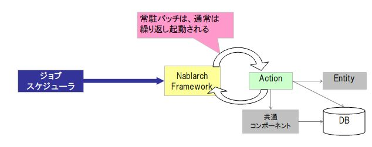

**【リクエスト単体テスト時の常駐バッチ】**

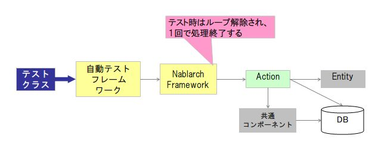

本テストフレームワークの特色と利点を以下に挙げる。

1. 本番に近い動作確認が可能

クラス単体テストがテスト対象クラスを直接呼び出すのに対して、リクエスト単体テストはメインクラスから通しでテストを実行する。
これにより、ほぼ本番時相当の動作でテストを実行できることになり、コンポーネント設定ファイル不備などを早期に発見できる。

1. 書きやすいテストデータ

バッチ処理では、固定長ファイルのようにテストデータとして記載しにくいものも扱う必要がある。
Excelファイルを使用することで、外部インターフェース設計書のフォーマット定義に沿って
テストデータを記載できる。

また、バッチ処理用のテストデータ書式が提供されており、これに準拠することで
テストデータを容易に作成することができる。

これらの特徴により、テストデータが作りやすくかつ保守しやすいものとなっている。

1. 必要最低限のテストコード

オンライン処理に比べて、バッチ処理のテストコードはどれも似通ったものになりがちである。
このような典型的な定型処理を実装したスーパークラスが提供されており、これを利用することで、
テスト準備、テスト対象の実行、テスト結果確認が可能である。
これにより、テストデータさえ作成すれば、ほぼコーディングなしでテストが実行可能である。

#### メッセージング処理におけるリクエスト単体テスト

##### 同期応答メッセージ受信処理・応答不要メッセージ受信処理のリクエスト単体テスト

同期応答メッセージ受信処理・応答不要型メッセージ受信処理におけるリクエスト単体テストは、メッセージに付与されたリクエストID単位の処理 [3] を確認する。

メッセージング処理におけるリクエストは、電文の種類ごとにリクエストIDが付与される。

リクエスト単体テスト実施時のイメージを以下に示す。

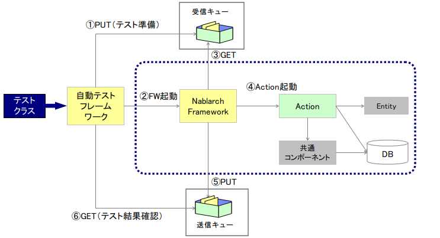

* ①自動テストフレームワークは、テストデータを元に受信キューに要求電文を予め用意しておく
* ②自動テストフレームワークは、フレームワークを起動する。
* ③フレームワークは受信キューから、①で用意された受信電文をGETする。
* ④フレームワークはActionに受信電文の内容を渡す。Actionは業務処理を行い、応答電文の内容を返却する。
* ⑤フレームワークは、応答電文を送信キューにPUTする。
* ⑥自動テストフレームワークは、応答電文の内容が想定通りであることを確認する。
  **※応答不要メッセージ受信処理の場合は、応答電文が存在しないため応答電文が想定通りであるかの確認は必要ない。**

> **Note:**
> 上記表中にある「送信キュー」「受信キュー」は、自動テストフレームワークにて提供される。
> 特別なミドルウェアのインストールや環境設定は不要である。

本テストフレームワークの特色と利点を以下に挙げる。

1. 本番に近い動作確認が可能

クラス単体テストがテスト対象クラスを直接呼び出すのに対して、リクエスト単体テストはメインクラスから通しでテストを実行する。
これにより、ほぼ本番時相当の動作でテストを実行できることになり、コンポーネント設定ファイル不備などを早期に発見できる。

1. 書きやすいテストデータ

電文レイアウトはフィールド長が固定されていることがほとんどであり、固定長ファイル同様に
テストデータとしては記載しにくいが、本自動テストフレームワークでは、
Excelファイルを使用することで、外部インターフェース設計書のフォーマット定義に沿って
テストデータを記載できる。

また、メッセージング処理用のテストデータ書式が提供されており、これに準拠することで
テストデータを容易に作成することができる。

これらの特徴により、テストデータが作りやすくかつ保守しやすいものとなっている。

1. 必要最低限のテストコード

オンライン処理に比べて、メッセージング処理はインタフェースが疎であるため、
準備処理、結果検証処理はほとんどのテストで同じようなものとなる（要求電文準備→テスト実行→応答電文内容確認）。
このような典型的な定型処理を実装したスーパークラスが提供されており、これを利用することで、
テスト準備、テスト対象の実行、テスト結果確認が可能である。
これにより、テストデータのみで、ほぼコーディングなしでテストが実行可能である。

#### 同期応答メッセージ送信処理・応答不要メッセージ送信処理におけるリクエスト単体テスト

同期応答メッセージ送信・応答不要メッセージ送信処理のリクエスト単体テストは、メッセージング処理に付与されたリクエストID単位の
処理 [4] を確認する。

同期応答メッセージ送信・応答不要メッセージ送信処理におけるリクエストは、電文の種類ごとにリクエストIDが付与される。

リクエスト単体テスト実施時のイメージを以下に示す。

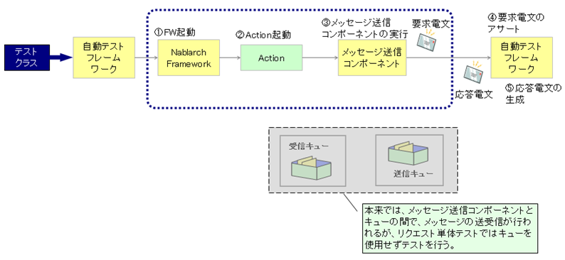

* ①自動テストフレームワークは、フレームワークを起動する。
* ②フレームワークはActionの入力となるパラメータ（画面ならばリクエスト、バッチならばファイルやDB）を読み込み、Actionを起動する。
* ③Actionはメッセージ送信コンポーネントを実行する。メッセージ送信コンポーネントはActionから受け取ったパラメータを要求電文に変換する。
* ④自動テストフレームワークは、テストデータを元に要求電文をアサートする。（要求電文はキューにPUTしない）
* ⑤自動テストフレームワークは、テストデータを元に応答電文を生成し、Actionへ返却する。（応答電文はキューからGETしない）
  **※  応答不要メッセージ送信処理の場合は、応答電文が存在しないため応答電文は返却されない。**

> **Note:**
> 自動テストフレームワークは、「送信キュー」「受信キュー」を使用せず、キューの手前で要求電文のアサートおよび、応答電文の生成を行う。
> このため、特別なミドルウェアのインストールや環境設定は不要である。

本テストフレームワークの特色と利点を以下に挙げる。

1. 書きやすいテストデータ

電文レイアウトはフィールド長が固定されていることがほとんどであり、固定長ファイル同様に
テストデータとしては記載しにくいが、本自動テストフレームワークでは、
Excelファイルを使用することで、外部インターフェース設計書のフォーマット定義に沿って
テストデータを記載できる。

また、メッセージング処理用のテストデータ書式が提供されており、これに準拠することで
テストデータを容易に作成することができる。

これらの特徴により、テストデータが作りやすくかつ保守しやすいものとなっている。

1. メッセージ同期送信についてのテストコードを記載する必要がない

テストデータ（要求電文の期待値および応答電文）はExcelに記載することができ、自動テストフレームワークはそのテストデータをもとに要求電文のアサートおよび応答電文の返却を自動的に行う。

このような典型的な定型処理を実装したスーパークラスが提供されており、これを利用することで、 テスト準備、テスト対象の実行、テスト結果確認が可能である。
これにより、テストデータのみで、ほぼコーディングなしでテストが実行可能である。

### 取引単体テスト概要

業務的な取引 [5] 単位のテスト。リクエスト単体テストで個々の品質を確保したのち、それらのリクエストを繋ぎ合せ業務的な取引として動作させた場合に正しく動作するかを確認する。

**「取引」の定義**

「取引」とは、一連のリクエストから成る、業務的な意味を持つ最小単位を指す。サンプルアプリケーションを例に取ると、ユーザ情報登録、ユーザ一覧照会などが取引にあたる。なお、この定義は本書独自のものであり、一般的な定義ではない。

#### 画面オンライン処理における取引単体テスト

TomcatやWeblogic等のアプリケーションサーバ上に、Webアプリケーションをデプロイして打鍵テストを行う。

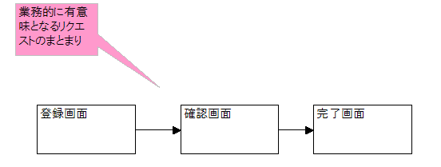

またリクエスト単体テストでは確認できないテスト項目についてもここでテストする。

* ブラウザに入力した内容が、正しくサーバアプリケーションに受け渡しできているか（formタグ（およびその内部のタグ）の属性が正しいか）
* 画面遷移が正しいか（anchorタグのリンク先が正しいか）
* JavaScriptが正しく動作するか

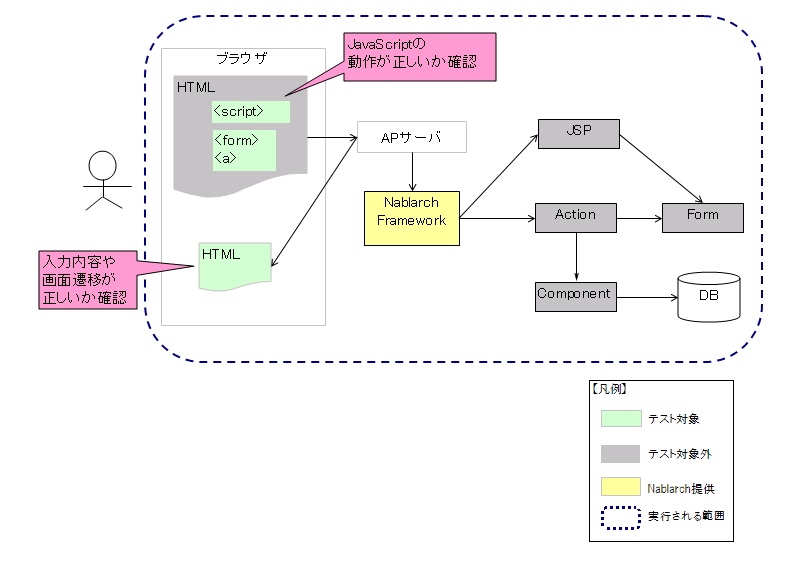

* テスト実施の詳細については、 [取引単体テストの実施方法](../../development-tools/testing-framework/testing-framework-03-DealUnitTest.md) を参照。

#### バッチ処理における取引単体テスト

取引が一連のバッチ処理により構成される場合、取引単体テストにてその組み合わせを確認する。
バッチ処理の場合は、自動テストフレームワークを用いて、各バッチを連続してテストすることで
取引単体テストが実施可能である。

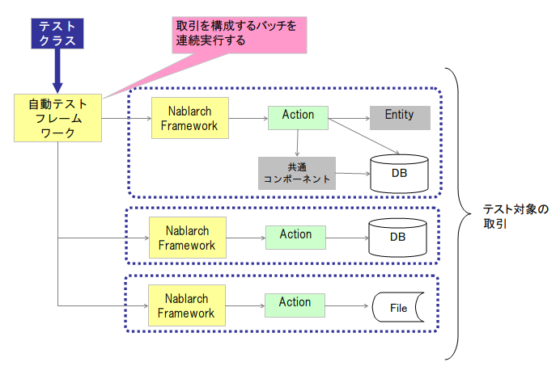

#### メッセージング処理における取引単体テスト

メッセージング処理では、リクエストと取引とでスコープが同じであることがほとんである。
このように、１リクエスト＝１取引である場合は、取引単体テストを実施する必要はない。

ただし、複数のメッセージにより取引が成立する場合 [6] は、 バッチ処理における取引単体テスト
と同様に、リクエスト毎のテストを連続実行することにより取引単体テストが実施可能である。

例えば、最初に事前条件確認用の照会電文が来て、その後に本処理用の要求電文が送信されるような場合。
