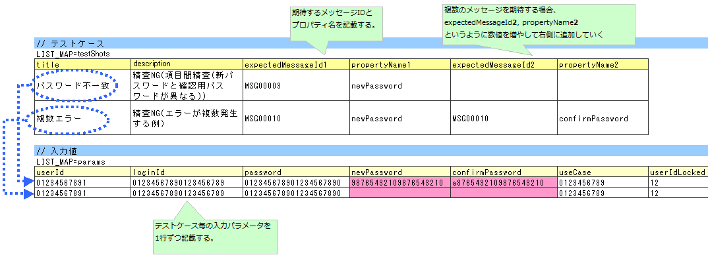
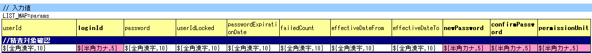
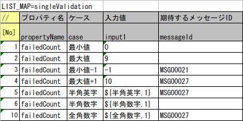
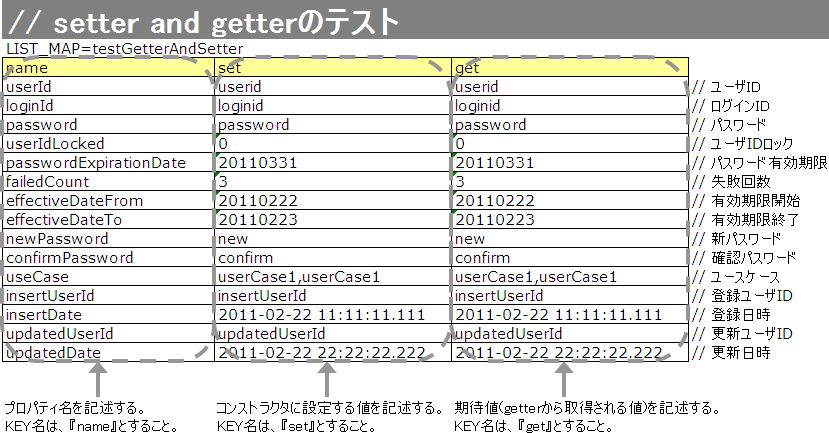

# Form/Entityのクラス単体テスト

## Form/Entityのクラス単体テスト

> **注意**: Entityとはテーブルのカラムと1対1に対応するプロパティを持つFormのこと。FormおよびEntityの単体テストはほぼ同じ方法で `nablarch.test.core.db.EntityTestSupport` を使って行える。共通する内容についてはEntity単体テストをベースに説明し、Form特有の処理については個別に説明する。

**テストケース表** (ID: `testShots` 固定):

| カラム名 | 記載内容 |
|---|---|
| title | テストケースのタイトル |
| description | テストケースの簡単な説明 |
| expectedMessageId*n* | 期待するメッセージ（*n*は1からの連番） |
| propertyName*n* | 期待するプロパティ（*n*は1からの連番） |

複数メッセージを期待する場合、`expectedMessageId2`, `propertyName2` のように数値を増やして右側に追加する。

**入力パラメータ表** (ID: `params` 固定): テストケース表に対応する入力パラメータを1行ずつ記載する。



**クラス**: `nablarch.test.core.entity.EntityTestConfiguration`

コンポーネント設定ファイルで以下の値を設定する（全項目必須）。

| プロパティ名 | 必須 | 説明 |
|---|---|---|
| maxMessageId | ○ | 最大文字列長超過時のメッセージID |
| maxAndMinMessageId | ○ | 最長最小文字列長範囲外のメッセージID（可変長） |
| fixLengthMessageId | ○ | 最長最小文字列長範囲外のメッセージID（固定長） |
| underLimitMessageId | ○ | 文字列長不足時のメッセージID |
| emptyInputMessageId | ○ | 未入力時のメッセージID |
| characterGenerator | ○ | 文字列生成クラス（`nablarch.test.core.util.generator.CharacterGenerator`の実装クラスを指定） |

`characterGenerator`には通常`nablarch.test.core.util.generator.BasicJapaneseCharacterGenerator`を使用する。

設定するメッセージIDは、バリデータの設定値と合致させること。

<details>
<summary>keywords</summary>

EntityTestSupport, Entity単体テスト, Form単体テスト, nablarch.test.core.db.EntityTestSupport, テスト方法概要, testShots, params, expectedMessageId, propertyName, テストケース表, 入力パラメータ表, バリデーションテストデータ, EntityTestConfiguration, nablarch.test.core.entity.EntityTestConfiguration, CharacterGenerator, BasicJapaneseCharacterGenerator, nablarch.test.core.util.generator.CharacterGenerator, nablarch.test.core.util.generator.BasicJapaneseCharacterGenerator, maxMessageId, maxAndMinMessageId, fixLengthMessageId, underLimitMessageId, emptyInputMessageId, characterGenerator, エンティティテスト設定, メッセージID設定, 文字列長バリデーション

</details>

## Form/Entity単体テストの書き方

## テストデータの作成

- テストデータExcelファイルはテストソースコードと同じディレクトリに同じ名前で格納する（拡張子のみ異なる）
- 精査のテストケース・コンストラクタのテストケース・setter/getterのテストケースはそれぞれ1シートずつ使用する
- メッセージデータ・コードマスタ等の静的マスタデータはプロジェクト管理データが投入済みの前提（個別テストデータとして作成しない）

## テストクラスの作成

テストクラス作成ルール:
1. パッケージはテスト対象のForm/Entityと同じ
2. クラス名は `<Form/Entityクラス名>Test`
3. **クラス**: `nablarch.test.core.db.EntityTestSupport` を継承する

```java
public class SystemAccountEntityTest extends EntityTestSupport {
```

## 文字種と文字列長の単項目精査テストケース

> **注意**: プロパティとして別のFormを保持するForm（`<親Form>.<子Form>.<子フォームのプロパティ名>` 形式でアクセスする）には使用できない。その場合は独自に精査処理のテストを実装すること。

### 精査対象確認

:ref:`validation_specifyProperty` で精査対象プロパティを指定した場合の確認ケース。全プロパティに対して単項目精査エラーとなるデータを用意する。期待値として全精査対象プロパティ名と各プロパティ単項目精査エラー時のメッセージIDを記載する。

> **注意**: 精査対象プロパティが漏れていた場合、期待メッセージが出力されずアサートが失敗する。精査対象でないプロパティが誤って含まれた場合、入力値不正で予期しないメッセージが出力される。これにより精査対象の誤りを検知できる。




> **注意**: Form単体テストで別FormのプロパティをExcelに指定する場合:
> - 保持Formのプロパティ（例: `SystemUserEntity.userId`）: `sampleForm.systemUser.userId`
> - Form配列の要素（配列先頭）: `sampleForm.userTelArray[0].telNoArea`
>
> Formコード例:
> ```java
> public class SampleForm {
>     private SystemUserEntity systemUser;
>     private UserTelEntity[] userTelArray;
> }
> ```

### 項目間精査など

:ref:`entityUnitTest_ValidationMethodSpecifyNormal` で行った精査対象指定以外の動作確認（項目間精査など）ケースを作成する。


**【精査クラスのコンポーネント設定ファイル】**

```xml
<property name="validators">
  <list>
    <component class="nablarch.core.validation.validator.RequiredValidator">
      <property name="messageId" value="MSG00010"/>
    </component>
    <component class="nablarch.core.validation.validator.LengthValidator">
      <property name="maxMessageId" value="MSG00011"/>
      <property name="maxAndMinMessageId" value="MSG00011"/>
      <property name="fixLengthMessageId" value="MSG00023"/>
    </component>
  </list>
</property>
```

**【テストのコンポーネント設定ファイル】**

```xml
<component name="entityTestConfiguration" class="nablarch.test.core.entity.EntityTestConfiguration">
  <property name="maxMessageId"        value="MSG00011"/>
  <property name="maxAndMinMessageId"  value="MSG00011"/>
  <property name="fixLengthMessageId"  value="MSG00023"/>
  <property name="underLimitMessageId" value="MSG00011"/>
  <property name="emptyInputMessageId" value="MSG00010"/>
  <property name="characterGenerator">
    <component name="characterGenerator"
               class="nablarch.test.core.util.generator.BasicJapaneseCharacterGenerator"/>
  </property>
</component>
```

<details>
<summary>keywords</summary>

EntityTestSupport, テストクラス作成, テストデータExcel, クラス命名規則, nablarch.test.core.db.EntityTestSupport, 単項目精査テスト, 精査対象確認, 項目間精査, 単項目精査, validation_specifyProperty, entityUnitTest_ValidationMethodSpecifyNormal, Form配列, バリデーションメソッド, SampleForm, SystemUserEntity, UserTelEntity, entityTestConfiguration, nablarch.test.core.entity.EntityTestConfiguration, nablarch.test.core.util.generator.BasicJapaneseCharacterGenerator, RequiredValidator, LengthValidator, エンティティテスト XML設定, コンポーネント設定ファイル, バリデータ設定例

</details>

## テストケース表の作成方法（文字種・文字列長）

以下のカラムを用意する:

| カラム名 | 記載内容 |
|---|---|
| propertyName | テスト対象のプロパティ名 |
| allowEmpty | そのプロパティが未入力を許容するか |
| min | 許容する最小文字列長（省略可） |
| max | 許容する最大文字列長 |
| messageIdWhenNotApplicable | 文字種不適合時に期待するメッセージID |
| 半角英字 | 半角英字を許容するか |
| 半角数字 | 半角数字を許容するか |
| 半角記号 | 半角記号を許容するか |
| 半角カナ | 半角カナを許容するか |
| 全角英字 | 全角英字を許容するか |
| 全角数字 | 全角数字を許容するか |
| 全角ひらがな | 全角ひらがなを許容するか |
| 全角カタカナ | 全角カタカナを許容するか |
| 全角漢字 | 全角漢字を許容するか |
| 全角記号その他 | 全角記号その他を許容するか |
| 外字 | 外字を許容するか |

許容フラグ: `o`（半角英小文字のオー、許容する）/ `x`（半角英小文字のエックス、許容しない）


テスト対象エンティティクラス・シート名・`validateFor` 値を変数で指定し `testValidateAndConvert` を呼び出す。変数内容を変更するだけで異なるEntityの精査テストに対応できる。

```java
private static final Class<SystemAccountEntity> ENTITY_CLASS = SystemAccountEntity.class;

@Test
public void testValidateForRegisterUser() {
    String sheetName = "testValidateForRegisterUser";
    String validateFor = "registerUser";
    testValidateAndConvert(ENTITY_CLASS, sheetName, validateFor);
}
```

<details>
<summary>keywords</summary>

propertyName, allowEmpty, messageIdWhenNotApplicable, 文字種テストケース表, 文字列長テストケース, min, max, testValidateAndConvert, EntityTestSupport, SystemAccountEntity, validateFor, テストメソッド, testValidateForRegisterUser

</details>

## テストメソッドの作成方法（文字種・文字列長）

スーパークラスの以下のメソッドを起動する:

```java
void testValidateCharsetAndLength(Class entityClass, String sheetName, String id)
```

使用例:

```java
public class SystemAccountEntityTest extends EntityTestSupport {

    /** テスト対象エンティティクラス */
    private static final Class<SystemAccountEntity> ENTITY_CLASS = SystemAccountEntity.class;

    /**
     * 文字種および文字列長のテストケース
     */
    @Test
    public void testCharsetAndLength() {
        String sheetName = "testCharsetAndLength"; // テストデータを記載したシート名
        String id = "charsetAndLength";            // テストデータのID
        testValidateCharsetAndLength(ENTITY_CLASS, sheetName, id);
    }
}
```

各行で実行されるテスト観点:

| 観点 | 入力値 | 備考 |
|---|---|---|
| 文字種（各種） | 半角英字/半角数字/半角記号/半角カナ/全角英字/全角数字/全角ひらがな/全角カタカナ/全角漢字/全角記号その他/外字 | maxの長さの文字列 |
| 未入力 | 空文字 | 長さ0の文字列 |
| 最小文字列 | 最小文字列長の文字列 | o印の文字種で構成 |
| 最長文字列 | 最長文字列長の文字列 | o印の文字種で構成 |
| 文字列長不足 | 最小文字列長－1の文字列 | o印の文字種で構成 |
| 文字列長超過 | 最大文字列長＋1の文字列 | o印の文字種で構成 |

コンストラクタテストでは、引数に指定した値が全プロパティに正しく設定されているかを確認する（全プロパティ対象）。テストデータにはプロパティ名、設定する値、期待値（getterで取得した値）を用意する。

> **注意**: Entityは自動生成のためアプリで使用されないコンストラクタが生成される可能性がある。その場合リクエスト単体テストではテストできないため、Entity単体テストでコンストラクタのテストを必ず行うこと。一般的なFormはリクエスト単体テストでコンストラクタテスト可能なため、クラス単体テストでのテストは不要。

Excelへの定義:


テストコード (`testConstructorAndGetter` を使用):

```java
public class SystemAccountEntityTest extends EntityTestSupport {
    @Test
    public void testConstructor() {
        Class<?> entityClass = SystemAccountEntity.class;
        String sheetName = "testAccessor";
        String id = "testConstructor";
        testConstructorAndGetter(entityClass, sheetName, id);
    }
}
```

> **注意**: `testConstructorAndGetter` でテスト可能な型には制限がある。以下以外の型は個別にコンストラクタとgetterを明示的に呼び出してテストする:
> - `String` および `String[]`
> - `BigDecimal` および `BigDecimal[]`
> - `valueOf(String)` メソッドを持つクラスおよびその配列（`Integer`, `Long`, `java.sql.Date`, `java.sql.Timestamp` など）

制限外の型の個別テスト（`getParamMap` でテストデータ取得後、コンストラクタを呼び出してgetterで検証）。テスト対象プロパティが複数ある場合は `getListParamMap` を使用する。

Excelへのデータ記述例:


テストコード例:

```java
@Test
public void testConstructor() {
    Class<?> entityClass = SystemAccountEntity.class;
    String sheetName = "testAccessor";
    String id = "testConstructor";
    testConstructorAndGetter(entityClass, sheetName, id);

    // (テスト対象のプロパティが複数ある場合は、getListParamMapを使用する。)
    Map<String, String[]> data = getParamMap(sheetName, "testConstructorOther");
    Map<String, Object> params = new HashMap<String, Object>();
    params.put("users", Arrays.asList(data.get("set")));
    SystemAccountEntity entity = new SystemAccountEntity(params);
    assertEquals(entity.getUsers(), Arrays.asList(data.get("get")));
}
```

<details>
<summary>keywords</summary>

testValidateCharsetAndLength, 文字種精査, 文字列長精査, 単項目精査テスト, EntityTestSupport, testConstructorAndGetter, SystemAccountEntity, testConstructor, コンストラクタテスト, valueOf, BigDecimal, getParamMap, getListParamMap, entityUnitTest_ConstructorOther

</details>

## テストケース表の作成方法（その他の単項目精査）

文字種と文字列長の単項目精査テストでカバーできない精査（例：数値の範囲精査）についても、簡易にテストできる仕組みを用意している。各プロパティに1つの入力値と期待するメッセージIDのペアを記述することで、任意の値で単項目精査テストができる。

> **注意**: プロパティとして別のFormを保持するForm（`<親Form>.<子Form>.<子フォームのプロパティ名>` 形式でアクセスする）には使用できない。その場合は独自に精査処理のテストを実装すること。

以下のカラムを用意する:

| カラム名 | 記載内容 |
|---|---|
| propertyName | テスト対象のプロパティ名 |
| case | テストケースの簡単な説明 |
| input1 | 入力値（複数パラメータの場合はinput2, input3と増やす） |
| messageId | 期待するメッセージID（精査エラーにならない場合は空欄） |

セルの特殊記法（テストフレームワークの `special_notation_in_cell` 参照）を使用することで、効率的に入力値を作成できる。



setter/getterテストでは、setterで設定した値とgetterで取得した値が期待通りかを全プロパティに対して確認する。各プロパティにsetterに渡すデータと期待値を用意する。

> **注意**: Entityは自動生成のためアプリで使用されないsetter/getterが生成される可能性がある。その場合リクエスト単体テストではテストできないため、Entity単体テストでsetter/getterのテストを必ず行うこと。一般的なFormはリクエスト単体テストでテスト可能なため、クラス単体テストでのテストは不要。

Excelへの定義:


テストコード:

```java
public class SystemAccountEntityTest extends EntityTestSupport {
    @Test
    public void testSetterAndGetter() {
        Class<?> entityClass = SystemAccountEntity.class;
        String sheetName = "testAccessor";
        String id = "testGetterAndSetter";
        testSetterAndGetter(entityClass, sheetName, id);
    }
}
```

> **注意**: `testGetterAndSetter` でテスト可能な型には制限がある（:ref:`entityUnitTest_ConstructorCase` 参照）。

> **注意**: setter/getterにロジックを記述した場合（例: setterは上3桁・下4桁で受け取り、getterは7桁で返すなど）は、そのロジックを確認するテストケースを作成すること。


<details>
<summary>keywords</summary>

propertyName, messageId, input1, testSingleValidation, 単項目精査テストケース表, case, testSetterAndGetter, testGetterAndSetter, EntityTestSupport, SystemAccountEntity, setter/getterテスト, entityUnitTest_ConstructorCase

</details>

## テストメソッドの作成方法（その他の単項目精査）

スーパークラスの以下のメソッドを起動する:

```java
void testSingleValidation(Class entityClass, String sheetName, String id)
```

使用例:

```java
public class SystemAccountEntityTest extends EntityTestSupport {

    /** テスト対象エンティティクラス */
    private static final Class<SystemAccountEntity> ENTITY_CLASS = SystemAccountEntity.class;

    /**
     * 単項目精査のテストケース（上記以外）
     */
    @Test
    public void testSingleValidation() {
        String sheetName = "testSingleValidation";
        String id = "singleValidation";
        testSingleValidation(ENTITY_CLASS, sheetName, id);
    }
}
```

**バリデーションメソッドのテスト**

単項目精査テスト（`testValidateCharsetAndLength` / `testSingleValidation`）では、setterメソッドのアノテーションが正しいかテストされるが、`@ValidateFor` アノテーションを付与したstaticバリデーションメソッドは実行されない。エンティティに独自バリデーションメソッドを実装した場合は、別途テストを作成すること。

EclipseのOutline（アウトライン）ビューを使用してEntityクラスのプロパティ名一覧を取得し、Excelに貼り付ける手順。コンストラクタテスト・setter/getterテストのExcelデータ作成時に活用する。

1. Eclipseでテスト対象のEntityクラスをオープンし、Outline（アウトライン）を表示する。
2. コピーしたいプロパティを選択する。
3. マウスの右クリックで表示されるメニューから「Copy Qualified Name（修飾名のコピー）」を選択する。
4. コピーしたプロパティ名のリストをExcelに貼り付ける。貼り付けた値は「クラス名 + プロパティ名」の完全修飾名の形式になっているため、Excelの置き換え機能を使用して不要なクラス名を削除する。

置き換え例（Entityクラスが `nablarch.sample.management.user.SystemAccountEntity` の場合）:
- 検索する文字列: `nablarch.sample.management.user.SystemAccountEntity.`
- 置き換え後の文字列: （空のまま）

<details>
<summary>keywords</summary>

testSingleValidation, testValidateCharsetAndLength, ValidateFor, バリデーションメソッドテスト, @ValidateFor, EntityTestSupport, property-name-copy-label, Eclipse, Outline, アウトライン, Copy Qualified Name, 修飾名のコピー, 完全修飾名, プロパティ名取得, Excel置き換え

</details>

## 自動テストフレームワーク設定値

:ref:`entityUnitTest_ValidationCase` を実施する際に必要な初期値設定について説明する。

<details>
<summary>keywords</summary>

entityUnitTest_ValidationCase, 自動テストフレームワーク設定値, 初期値設定

</details>
