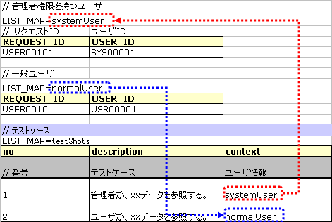
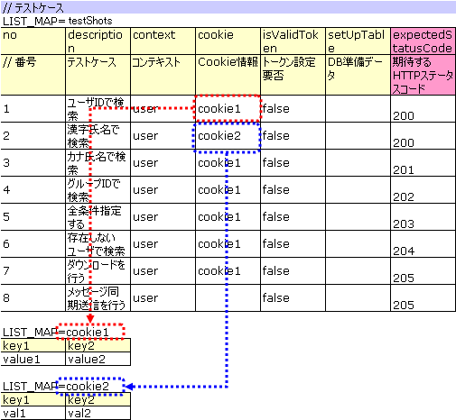
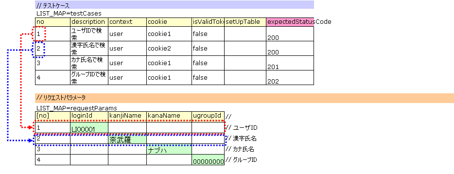

# リクエスト単体テストの実施方法

## テストクラスの書き方

テストクラス作成ルール: (1) テスト対象Actionと同一パッケージ (2) クラス名は`{Action名}RequestTest` (3) `nablarch.test.core.http.BasicHttpRequestTestTemplate`を継承。

**クラス**: `nablarch.test.core.http.BasicHttpRequestTestTemplate`

> **注意**: `BasicHttpRequestTestTemplate`はリクエスト単体テストに必要なメソッドと`DbAccessTestSupport`の機能を兼ね備えており、データベース設定はクラス単体テストと同様に実行できる。

```java
package nablarch.sample.management.user;

public class UserSearchActionRequestTest extends BasicHttpRequestTestTemplate {
```

<details>
<summary>keywords</summary>

BasicHttpRequestTestTemplate, DbAccessTestSupport, テストクラス作成, リクエスト単体テスト, パッケージ設定

</details>

## テストメソッド分割

テストメソッド分割ルール:
- リクエストID毎（Actionのメソッド毎）にテストケースを正常系と異常系に分類し、それぞれテストメソッドを作成
- 異常系が無い場合（メニューからの単純な画面遷移など）は正常系のみ作成
- 画面表示検証: 同一シートでの条件分岐が煩雑になる場合は別途テストメソッドを作成。そうでない場合は正常系または異常系のテストメソッドに含める

メソッド分割例（正常系・異常系・画面表示検証用で分割した場合）:

| リクエストID | Actionメソッド名 | 正常系 | 異常系 | 画面表示検証用 |
|---|---|---|---|---|
| USERS00101 | doUsers00101 | testUsers00101Normal | testUsers00101Abnormal | testUsers00101View |

> **注意**: 上記以外でも、１つのテストデータシートにさまざまなテストケースを詰め込むと可読性が下がる場合は、テストデータシートを分割する。

<details>
<summary>keywords</summary>

テストメソッド分割, 正常系, 異常系, 画面表示検証, リクエストID

</details>

## テストデータの書き方とデータベース初期値 (setUpDb)

テストデータExcelファイルはテストソースコードと同じディレクトリに同じ名前で格納する（拡張子のみ異なる）。詳細は :ref:`how_to_write_excel` 参照。

## テストクラスで共通のデータベース初期値 (setUpDb)

`setUpDb`という名前のシートに共通データベース初期値を記載。テストメソッド実行時に自動投入される。


<details>
<summary>keywords</summary>

setUpDb, テストデータ, データベース初期値, Excelファイル, テストクラスで共通のデータベース初期値

</details>

## テストケース一覧 (testShots)

LIST_MAPのデータタイプで1テストメソッド分のケース表を記載。IDは`testShots`。

各ケースのカラム:

| カラム名 | 説明 | 必須 |
|---|---|---|
| no | テストケース番号（1からの連番） | ○ |
| description | テストケースの説明 | ○ |
| context | リクエストIDとユーザ情報を指定（詳細は :ref:`request_test_user_info` 参照） | ○ |
| cookie | Cookie情報（詳細は :ref:`request_test_cookie_info` 参照） | |
| isValidToken | トークン設定が必要な場合`true`（詳細は :ref:`double_submit_use_Token` 参照） | |
| setUpTable | テストケース実行前にDBに登録するデータの :ref:`グループID<tips_groupId>` | |
| expectedStatusCode | 期待するHTTPステータスコード | ○ |
| expectedMessageId | 期待するメッセージID（複数はカンマ区切り、不要は空欄。空欄で実際に出力された場合はテスト失敗） | |
| expectedSearch | 期待する検索結果のLIST_MAP ID（リクエストスコープのキーは`searchResult`） | |
| expectedTable | 期待するDBテーブルの :ref:`グループID<tips_groupId>` | |
| forwardUri | 期待するフォワード先URI（空欄の場合JSPフォワードなしとしてアサート。システムエラー画面の場合は`/jsp/systemError.jsp`など） | |
| expectedContentLength | コンテンツレングス・ヘッダの期待値（ファイルダウンロードテスト用） | |
| expectedContentType | コンテンツタイプ・ヘッダの期待値（ファイルダウンロードテスト用） | |
| expectedContentFileName | コンテンツディスポジション・ヘッダのファイル名期待値（ファイルダウンロードテスト用） | |
| expectedMessage | メッセージ同期送信の期待する要求電文の :ref:`グループID<tips_groupId>` | |
| responseMessage | メッセージ同期送信の返却する応答電文の :ref:`グループID<tips_groupId>` | |

> **注意**: 画面オンライン処理のリクエスト単体テストでは、HTTPステータスコード302と303は同一視してアサートされる（予想302・実際303またはその逆でもアサート正常終了）。

<details>
<summary>keywords</summary>

testShots, LIST_MAP, テストケース一覧, context, cookie, isValidToken, setUpTable, expectedStatusCode, expectedMessageId, expectedSearch, expectedTable, forwardUri, expectedContentLength, expectedContentType, expectedContentFileName, expectedMessage, responseMessage

</details>

## ユーザ情報

テストケースでのリクエストIDとユーザ情報をLIST_MAPのデータタイプで記載。複数のユーザ情報を使い分けることで、権限によって処理が異なる機能をテスト可能。



<details>
<summary>keywords</summary>

ユーザ情報, context, LIST_MAP, リクエストID, 権限

</details>

## Cookie情報

テストケースで必要なCookie情報をLIST_MAPのデータタイプで記載。ケースごとに異なるCookie情報を送信可能。Cookie不要なケースは記載不要（値を空白にする）。



<details>
<summary>keywords</summary>

Cookie情報, cookie, LIST_MAP

</details>

## リクエストパラメータ (requestParams)

各テストケースで送信するHTTPパラメータをLIST_MAPのデータタイプで記載。IDは`requestParams`。:ref:`http_dump_tool` を使用してデータ作成（初期画面表示リクエスト以外）。テストケース一覧と行単位で関連付けられる。テストケース番号を :ref:`marker_column` として記載すること。



> **注意**: リクエストパラメータは必ず記載が必要。リクエストパラメータが存在しない場合（初期画面表示など）でもLIST_MAP=requestParamsには必ず列を定義し、テストケース数分のデータ行を用意する。パラメータ不要な場合はテストケース番号列（ :ref:`marker_column` ）のみ記載でよい。

<details>
<summary>keywords</summary>

リクエストパラメータ, requestParams, LIST_MAP, http_dump_tool, marker_column

</details>

## ひとつのキーに対して複数の値を設定する場合

HTTPリクエストパラメータで1つのキーに複数の値を設定する場合、**値をカンマ区切りで記述**する。

例: `foo`キーに`one`と`two`を設定:

| foo | bar |
|---|---|
| one,two | three |

値にカンマ自体を含める場合: `\`でエスケープ（`\,`）。
値に`\`自体を含める場合: `\\`でエスケープ。

例: `\1,000`を表す場合は`\\1\,000`と記述:

| foo | bar |
|---|---|
| \\\\1\\,000 | three |

<details>
<summary>keywords</summary>

リクエストパラメータ複数値, カンマ区切り, エスケープ, HTTPリクエストパラメータ

</details>

## 期待する検索結果

期待する検索結果をテストケース一覧とIDでリンクさせる。


<details>
<summary>keywords</summary>

期待する検索結果, searchResult, テストケースリンク, LIST_MAP

</details>

## 期待するデータベースの状態

更新系テストケースでは、期待するデータベースの状態をテストケース一覧とIDでリンクさせる。


<details>
<summary>keywords</summary>

期待するデータベースの状態, 更新系テスト, expectedTable, グループID

</details>

## テストメソッドの書き方

`BasicHttpRequestTestTemplate`を継承する。テストデータに基づき以下の手順でリクエスト単体テストを実行:

1. データシートから`testShots` LIST_MAPを取得
2. 各テストケースに対して繰り返し実行:
   1. データベース初期化
   2. ExecutionContext・HTTPリクエスト生成
   3. `beforeExecuteRequest`メソッド呼び出し（業務テストコード拡張ポイント）
   4. トークンが必要な場合に設定
   5. テスト対象リクエスト実行
   6. 実行結果の検証（HTTPステータスコード/メッセージID、HTTPレスポンス値、検索結果、テーブル更新結果）
   7. `afterExecuteRequest`メソッド呼び出し（業務テストコード拡張ポイント）

抽象メソッド`getBaseUri()`をオーバーライドする:

```java
@Override
protected String getBaseUri() {
    return "/action/management/user/UserSearchAction/";
}
```

テストメソッドを作成し、スーパクラスの`execute(String sheetName)`または`execute(String sheetName, Advice advice)`を呼び出す。通常は`execute(String sheetName)`を使用:

```java
@Test
public void testUsers00101Normal() {
    execute("testUsers00101Normal");
}
```

<details>
<summary>keywords</summary>

BasicHttpRequestTestTemplate, getBaseUri, execute, Advice, beforeExecuteRequest, afterExecuteRequest, テストメソッド実行手順, スーパクラス, testShots

</details>
