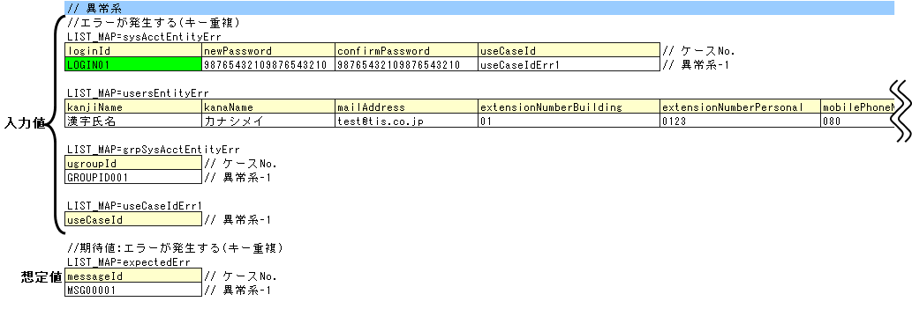

# Componentのクラス単体テスト

## テストケース実行のパターン分け

Component単体テストのテストケースは以下4パターンに分類される。パターンによりテストクラス・データの作成方法が異なる。

| パターン | 当てはまる処理の例 |
|---|---|
| 戻り値(データベースの検索結果)を確認しなければならないもの | 検索処理 |
| 戻り値(データベースの検索結果以外)を確認しなければならないもの | 計算、判定処理 |
| 処理終了後のデータベースの状況を確認しなければならないもの | 更新(挿入、削除含む)処理 |
| メッセージIDを確認しなければならないもの | エラー処理 |

> **注意**: 戻り値を確認する2つのパターン(「戻り値(データベースの検索結果)を確認しなければならないもの」と「戻り値(データベースの検索結果以外)を確認しなければならないもの」)については、このドキュメントでは説明が未記載(将来追記予定)。これらのパターンに関する具体的な実装方法はこのファイルからは得られない。

<details>
<summary>keywords</summary>

Component単体テスト, テストケースパターン, 検索処理テスト, 更新処理テスト, エラー処理テスト, メッセージID検証, 戻り値検証

</details>

## テストデータの作成

テストデータ(Excelファイル)はテストソースコードと同じディレクトリに同じ名前で格納(拡張子のみ異なる)。全テストデータは同じExcelシートに記載する。

メッセージデータやコードマスタなどのDBに格納する静的マスタデータは、プロジェクト管理データがあらかじめ投入されている前提(個別のテストデータとして作成不要)。

テストデータの記述方法詳細については、テストフレームワーク抽象ガイドおよびDbAccessTestガイドを参照。

<details>
<summary>keywords</summary>

テストデータ作成, Excelファイル, テストソースコード同ディレクトリ, 静的マスタデータ, DbAccessTest

</details>

## テストクラスの作成

Component単体テストのテストクラス作成ルール:
1. テスト対象のComponentと同じパッケージ
2. クラス名は`<Componentクラス名>Test`
3. `nablarch.test.core.db.DbAccessTestSupport`を継承

```java
package nablarch.sample.management.user; // パッケージはUserComponentと同じ

import nablarch.test.core.db.DbAccessTestSupport;
import org.junit.Test;

public class UserComponentTest extends DbAccessTestSupport {
    // クラス名はUserComponentTestで、DbAccessTestSupportを継承する
}
```

<details>
<summary>keywords</summary>

DbAccessTestSupport, テストクラス作成, パッケージ, クラス名命名規則, 継承

</details>

## 事前準備データの作成処理

事前データと事前データ投入処理を作成する。

- `setThreadContextValues(sheetName, "threadContext")`: スレッドコンテキスト(USER_ID、REQUEST_IDなど)をExcelから読み込んで設定
- `setUpDb(sheetName)`: 事前データ投入。各ケースごとに初期化するためループ中で実行する

採番テーブル(ID_GENERATEなど)は事前初期化が必須。初期化しないとテスト実行時の採番結果が不定になり挿入結果の検証ができなくなる。

```java
@Test
public void testRegisterUser1() {
    String sheetName = "registerUser";

    setThreadContextValues(sheetName, "threadContext"); // スレッドコンテキストの設定

    for (int i = 0; i < sysAcctDatas.size(); i++) {
        // データベース準備
        setUpDb(sheetName); // 事前データの投入。各ケースごとに初期化するためループ中で実行する
    }
}
```


<details>
<summary>keywords</summary>

setThreadContextValues, setUpDb, スレッドコンテキスト, USER_ID, REQUEST_ID, 事前データ投入, ID_GENERATE, 採番テーブル初期化, テーブル初期化

</details>

## 処理終了後のデータベースの状況を確認

クラス単体テストではフレームワークによるトランザクション制御は行われない。処理終了後のDB状況確認には、テストクラスでトランザクションをコミットする必要がある。

- `commitTransactions()`: スーパクラスのメソッド。全トランザクションをコミットする。コミットしない場合、テスト結果確認が正常に行われない
- 参照系テストはコミット不要

**テストデータ(入力値)**:
- `getListMap(sheetName, id)`: ExcelシートからList<Map<String, String>>形式でデータ取得
- 配列型プロパティ(例: useCaseId)は別表のデータをキーで参照して配列を組み立ててセットする

```java
SystemAccountEntity sysAcct = null;
UsersEntity users = null;
UgroupSystemAccountEntity grpSysAcct = null;

// システムアカウント
work.clear();
for (Entry<String, String> e : sysAcctDatas.get(i).entrySet()) {
    work.put(e.getKey(), e.getValue());
}
String id = sysAcctDatas.get(i).get("useCaseId");
useCaseData = getListMap(sheetName, id);
String[] useCaseId = new String[useCaseData.size()];
for (int j = 0; j < useCaseData.size(); j++) {
    useCaseId[j] = useCaseData.get(j).get("useCaseId");
}
work.put("useCase", useCaseId);
sysAcct = new SystemAccountEntity(work);

// ユーザ
work.clear();
for (Entry<String, String> e : usersDatas.get(i).entrySet()) {
    work.put(e.getKey(), e.getValue());
}
users = new UsersEntity(work);

// グループシステムアカウント
work.clear();
for (Entry<String, String> e : grpSysAcctDatas.get(i).entrySet()) {
    work.put(e.getKey(), e.getValue());
}
grpSysAcct = new UgroupSystemAccountEntity(work);

// 実行
target.registerUser(sysAcct, users, grpSysAcct);
commitTransactions(); // 全てのトランザクションをコミット
```


**テストデータ(想定結果)**:
- 自動設定項目も想定結果を用意すること
- `assertTableEquals(expectedGroupId, sheetName, expectedGroupId)`: グループIDを引数に複数テーブルの内容を一括検証。グループIDにより複数想定結果に対応可能

```java
String expectedGroupId = getListMap(sheetName, "expected").get(i).get("caseNo");
assertTableEquals(expectedGroupId, sheetName, expectedGroupId);
```


<details>
<summary>keywords</summary>

commitTransactions, getListMap, assertTableEquals, トランザクションコミット, SystemAccountEntity, UsersEntity, UgroupSystemAccountEntity, テストデータ入力値, テストデータ想定結果, グループID, 自動設定項目

</details>

## メッセージIDを確認しなければならないもの

入力値は処理終了後のDB確認パターンと同様の方法で作成する。異常系データのIDには、正常系のIDの末尾に`"Err"`を付加する命名規則を使用する(例: 正常系IDが`sysAcctEntity`なら異常系は`sysAcctEntityErr`)。これにより、同じExcelシート内に正常系と異常系のデータを混載できる。想定値はメッセージIDである。

ここで確認すべき内容は、ユニークキー制約違反による例外の発生である。テストコードでは、目的の例外をキャッチし、メッセージIDを比較することで検証を行う。

> **警告**: キャッチする例外は発生を想定する例外とし、RuntimeExceptionなどの上位例外クラスは用いないこと。メッセージIDが正しくても例外クラスが間違っているバグを検出できなくなる。

- `ApplicationException`をキャッチし`ae.getMessages().get(0).getMessageId()`でメッセージIDを取得して検証
- 例外が発生しなかった場合は`fail()`でテスト失敗にする

```java
try {
    target.registerUser(sysAcct, users, grpSysAcct); // テスト対象メソッド実行
    fail(); // 例外が発生しなかったらテスト失敗
} catch (ApplicationException ae) { // 発生するはずの例外をキャッチ
    // メッセージIDを検証
    assertEquals(expected.get(i).get("messageId"), ae.getMessages().get(0).getMessageId());
}
```



<details>
<summary>keywords</summary>

ApplicationException, メッセージID検証, Errサフィックス, 正常系異常系混載, ユニークキー制約違反, getMessageId, fail

</details>
