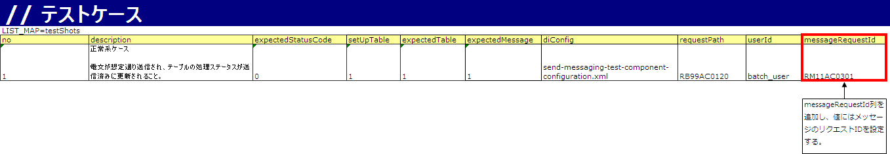
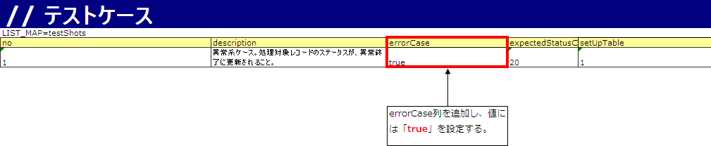

# リクエスト単体テストの実施方法（応答不要メッセージ送信処理）

## 概要

応答不要メッセージ送信処理のアクションクラスはNablarchが提供するため、**条件網羅・限界値テストは実施不要**（他の処理とは異なる）。

テスト対象成果物:
- フォーマット定義ファイル（電文のレイアウト定義）
- SELECT文: 電文送信テーブルからステータス未送信のデータを取得
- UPDATE文: 電文送信後に該当データのステータスを処理済みに更新
- UPDATE文: 電文送信失敗時に該当データのステータスをエラーに更新

<details>
<summary>keywords</summary>

応答不要メッセージ送信, リクエスト単体テスト, テスト対象成果物, フォーマット定義ファイル, SQL文テスト, 条件網羅不要

</details>

## テストクラスの書き方

テストクラス作成ルール:
1. テスト対象機能と同一パッケージ
2. クラス名は`{電文のリクエストID}RequestTest`
3. `nablarch.test.core.batch.BatchRequestTestSupport`を継承

<details>
<summary>keywords</summary>

BatchRequestTestSupport, テストクラス命名規則, RequestTest, パッケージ設定

</details>

## データシートの書き方

データシートの記述方法は :ref:`message_sendSyncMessage_test` に従う。以下はその差分。

### 正常系ケースの準備

testShotsの定義に`KEY=messageRequestId`、`VALUE=メッセージのリクエストID`を追加する。



> **注意**: 以下の設定は不要:
> - testShots: `responseMessage`
> - 期待値・準備データ: `RESPONSE_HEADER_MESSAGES`、`RESPONSE_BODY_MESSAGES`

### 異常系ケースの準備

送信失敗時のエラーUPDATE文を確認するケース。testShotsに`KEY=errorCase`、`VALUE=true`を設定する。異常系では電文が送信されないため送信電文の期待値設定は不要。



> **注意**: 異常系テストでは、応答不要メッセージ送信処理用共通アクションをテスト用アクションに切り替える必要がある。

本番用設定:
```xml
<component name="requestPathJavaPackageMapping" class="nablarch.fw.handler.RequestPathJavaPackageMapping">
  <!-- 応答不要メッセージ送信処理用共通アクションを設定する。 -->
  <property name="basePackage" value="nablarch.fw.messaging.action.AsyncMessageSendAction" />
  <property name="immediate" value="false" />
</component>
```

テスト用設定（本番設定を上書き）:
```xml
<component name="requestPathJavaPackageMapping" class="nablarch.fw.handler.RequestPathJavaPackageMapping">
  <property name="basePackage" value="nablarch.test.core.messaging.AsyncMessageSendActionForUt" />
  <property name="immediate" value="false" />
</component>
```

<details>
<summary>keywords</summary>

AsyncMessageSendAction, AsyncMessageSendActionForUt, RequestPathJavaPackageMapping, testShots, messageRequestId, errorCase, 正常系テスト, 異常系テスト, データシート記述, responseMessage, RESPONSE_HEADER_MESSAGES, RESPONSE_BODY_MESSAGES

</details>
