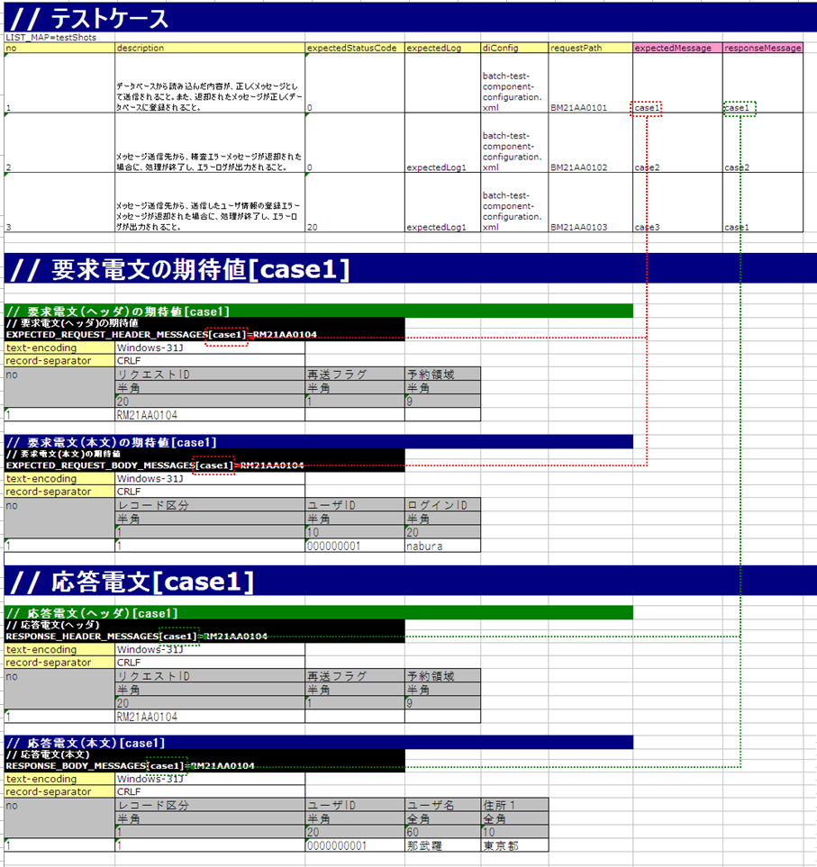
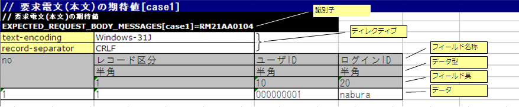

# リクエスト単体テストの実施方法(同期応答メッセージ送信処理)

## 出力ライブラリ(同期応答メッセージ送信処理)の構造とテスト範囲

同期応答メッセージ送信処理のリクエスト単体テストは、**リクエストID単位**で実施する。ここでのリクエストIDは相手先システムの機能を一意に識別するIDであり、要求電文・応答電文のフォーマット、送信キュー名、受信キュー名を決定する（画面オンライン処理やバッチ処理のリクエストIDとは意味が異なる）。

テスト実施時の動作:

1. 自動テストフレームワークがNablarch Application Frameworkを起動する
2. Nablarch AFがActionの入力パラメータ（画面: リクエスト、バッチ: ファイル/DB）を読み込み、Actionを起動する
3. ActionがNablarch AFのメッセージ同期送信処理を実行し、Nablarch AFがパラメータを要求電文に変換する
4. 自動テストフレームワークがテストデータをもとに要求電文をアサートする（キューへのPUTは行わない）
5. 自動テストフレームワークがテストデータをもとに応答電文を生成し、Actionへ返却する（キューからのGETは行わない）

> **注意**: 自動テストフレームワークは「送信キュー」「受信キュー」を使用せず、キューの手前で要求電文のアサートおよび応答電文の生成を行う。特別なミドルウェアのインストールや環境設定は不要。

本自動テストフレームワークを用いた同期応答メッセージ送信処理のリクエスト単体テストの特色と利点:

1. **書きやすいテストデータ**: Excelファイルを使用することで、外部インタフェース設計書のフォーマット定義に沿ってテストデータを記載できる。同期応答メッセージ送信処理用のテストデータ書式が提供されており、テストデータが作りやすくかつ保守しやすい。

2. **メッセージ同期送信処理のテストコードが不要**: テストデータ（要求電文の期待値および応答電文）はExcelに記載でき、自動テストフレームワークが要求電文のアサートおよび応答電文の返却を自動的に行う。典型的な定型処理を実装した**スーパークラスが提供**されており、これを利用することでテスト準備・テスト対象の実行・テスト結果確認が可能。**テストデータのみで、ほぼコーディングなしでテストが実行可能**。

keywords

同期応答メッセージ送信, リクエスト単体テスト, テスト実施フロー, メッセージキュー不使用, ミドルウェア不要, スーパークラス, コーディングなし, 特色と利点

## テストの実施方法

同期応答メッセージ送信処理のテストは、画面オンライン処理やバッチ処理などのテスト方式を踏襲して行われる。テストクラスの書き方や各種準備データの準備方法については、これらのテストの実施方法を参照すること。

本項では、同期応答メッセージ送信処理固有の実施方法についてのみ解説する。

keywords

テストの実施方法, 画面オンライン処理, バッチ処理, テスト方式踏襲, テストクラスの書き方

## テストデータの書き方

テストデータは、テストソースコードと同じディレクトリに同じ名前（拡張子のみ異なる）のExcelファイルとして格納する。

### テストケースとの対応

テストケースと要求電文・応答電文は**グループID**で対応付ける。テストケースの`expectedMessage`および`responseMessage`フィールドに記載されたグループIDが、対応する識別子を持つ表と紐付けられる。

> **警告**: テストケース一覧に`expectedMessage`および`responseMessage`の欄がない場合、または空欄の場合にメッセージ同期送信処理が行われると、テストが失敗する。メッセージ同期送信処理を行う場合は必ず記載すること。

1テストケースで同一グループIDかつ同一リクエストIDの電文が複数件送信される場合は、件数分のデータ行を記載する。`no`列の順番（連番）は送信順に一致する。

> **注意**: 標準の同期応答メッセージ送信機能では、ヘッダ部フォーマットはリクエスト単位で統一（要求電文・応答電文共通）。ボディ部は要求・応答で異なるフォーマットを定義可能。

### 識別子の書式

| 識別子 | 書式 |
|---|---|
| 要求電文ヘッダの期待値 | `EXPECTED_REQUEST_HEADER_MESSAGES[グループID]=リクエストID` |
| 要求電文ボディの期待値 | `EXPECTED_REQUEST_BODY_MESSAGES[グループID]=リクエストID` |
| 応答電文ヘッダ | `RESPONSE_HEADER_MESSAGES[グループID]=リクエストID` |
| 応答電文ボディ | `RESPONSE_BODY_MESSAGES[グループID]=リクエストID` |

### 表の書式

| 行 | 内容 |
|---|---|
| 識別子 | 上記識別子書式で電文種類・グループID・リクエストIDを指定 |
| ディレクティブ行 | ディレクティブ名の右セルに設定値を記載（複数行可） |
| no | ディレクティブ行の次行に必ず「no」を記載 |
| フィールド名称 | フィールド数分記載 |
| データ型 | フィールド数分記載 |
| フィールド長 | フィールド数分記載 |
| データ | フィールドのデータ。複数レコードは次行に続けて記載 |

> **注意**: フィールド名称、データ型、フィールド長の記述は、**外部インタフェース設計書からコピー＆ペースト**することで効率良く作成できる。ペーストする際、「**行列を入れ替える**」オプションにチェックすること。

> **警告**: フィールド名称に**重複した名称は許容されない**（例: 「氏名」フィールドが2つ以上存在してはならない）。

### 障害系のテスト

応答電文の表の**ヘッダおよびボディ両方の「no」を除く最初のフィールド**に以下の値を設定することで障害系テストを実施できる:

| 設定値 | 障害内容 | フレームワークの動作 |
|---|---|---|
| `errorMode:timeout` | メッセージ送信中のタイムアウトエラー | `MessageSendSyncTimeoutException`（`MessagingException`のサブクラス）をスロー |
| `errorMode:msgException` | メッセージ送受信エラー | `MessagingException`をスロー |

> **注意**: 業務アクション内で`MessagingException`の制御を明示的に行っていない場合、個別リクエスト単体テストでの障害系テストは不要。

keywords

テストデータ, グループID, expectedMessage, responseMessage, EXPECTED_REQUEST_HEADER_MESSAGES, EXPECTED_REQUEST_BODY_MESSAGES, RESPONSE_HEADER_MESSAGES, RESPONSE_BODY_MESSAGES, MessageSendSyncTimeoutException, MessagingException, errorMode, フィールド名称重複禁止, 識別子書式, ディレクティブ, 外部インタフェース設計書, 行列を入れ替える

## テスト結果検証

要求電文の期待値を定義した場合、自動テストフレームワーク側で以下の検証が行われる:

- 要求電文の内容の検証
- 要求電文の送信件数の検証

keywords

テスト結果検証, 要求電文検証, 送信件数検証

