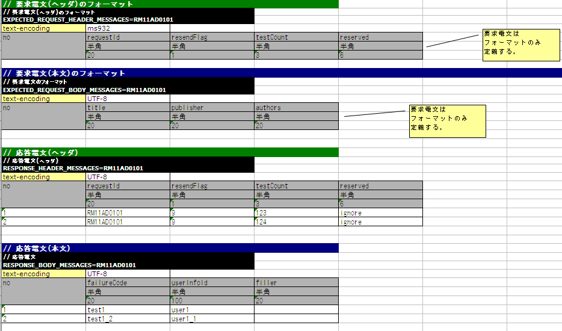

# 同期応答メッセージ送信処理を伴う取引単体テストの実施方法

## モックアップクラスを使用した取引単体テストの概要

同期応答メッセージ送信処理を伴う画面オンライン処理の取引単体テストには、Nablarchが提供するモックアップクラスを使用する。

**モックアップクラスの機能:**
1. **任意の応答電文を返却**: 送信キュー・受信キューに接続せず、テスト用応答電文を返却する
2. **要求電文のログ出力**: 同期送信された要求電文をMap形式・CSV形式でログに出力する
3. **障害系テスト**: タイムアウトエラーや`MessagingException`を発生させるテストが可能

> **補足**: モックアップクラスを使用することで、キューや特別なミドルウェアの準備なしに取引単体テストを実施できる。

**処理フロー:**
- 通常フロー: 
- モックフロー: 

<details>
<summary>keywords</summary>

MockMessagingProvider, 同期応答メッセージ送信, 取引単体テスト, モックアップクラス, キュー不要, MessagingException

</details>

## Excelファイルの書き方

モックアップクラス使用時は、応答電文のフォーマット・データ、および要求電文のフォーマットをExcelファイルに定義する。

**ファイル命名規則:**
- ファイル名をリクエストIDと一致させる（例: リクエストID「RM21AA0101」→「RM21AA0101.xls」）
- ここでのリクエストIDは、メッセージ送信先システムの機能を一意に識別するIDであり、画面オンライン処理・バッチ処理で使用するリクエストIDとは意味が異なる
- Excelファイルの配置ディレクトリは設定ファイルに定義する（詳細: [send_sync_test_data_path](#)）

**シートの記述ルール:**
- シート名: `message` 固定
- 応答電文のFW制御ヘッダ・本文のフォーマットを定義する
- 応答電文のFW制御ヘッダ・本文のデータを定義する（データは応答電文のみ）
- 要求電文のFW制御ヘッダ・本文のフォーマットのみ定義する（データは不要）

**電文フォーマット/データの記述書式:**

| 項目 | 説明 |
|---|---|
| 識別子 | 電文の種類を示すID。テストケース一覧のexpectedMessage/responseMessageのグループIDと紐付く |
| ディレクティブ行 | ディレクティブ名セルの右に設定値を記載（複数行指定可） |
| no | ディレクティブ行の下の行に必ず「no」を記載 |
| フィールド名称 | フィールドの数だけ記載 |
| データ型 | フィールドの数だけ記載 |
| フィールド長 | フィールドの数だけ記載 |
| データ | 応答電文のみ記載。複数件の場合は次行に続けて記載 |

**識別子の書式:**
- 要求電文ヘッダ: `EXPECTED_REQUEST_HEADER_MESSAGES=リクエストID`
- 要求電文本文: `EXPECTED_REQUEST_BODY_MESSAGES=リクエストID`
- 応答電文ヘッダ: `RESPONSE_HEADER_MESSAGES=リクエストID`
- 応答電文本文: `RESPONSE_BODY_MESSAGES=リクエストID`

> **注意**: フィールド名称・データ型・フィールド長は外部インタフェース設計書からコピー＆ペーストで作成可能。ペースト時に「**行列を入れ替える**」オプションを使用すること。



<details>
<summary>keywords</summary>

EXPECTED_REQUEST_HEADER_MESSAGES, EXPECTED_REQUEST_BODY_MESSAGES, RESPONSE_HEADER_MESSAGES, RESPONSE_BODY_MESSAGES, Excelファイル形式, 電文フォーマット定義, リクエストID, 識別子, ディレクティブ行

</details>

## Excelファイルの再読み込み

モックアップクラスは、Excelファイルのタイムスタンプが更新された場合にファイルを再読み込みする。

**動作仕様:**
- 応答電文を返却するたびに`no`がインクリメントされる
- アプリケーションサーバ起動中は`no`が初期化されない
- Excelファイルを編集・上書きしてタイムスタンプを更新すると、サーバ起動中にファイルを再読み込みできる

この機能により、Excelファイルを手動編集してテストをやり直すケースや、同じデータで繰り返しテストを行うケースに対応できる。

<details>
<summary>keywords</summary>

Excelファイル再読み込み, タイムスタンプ更新, noインクリメント, サーバ起動中編集

</details>

## 障害系のテスト

応答電文本文の最初のフィールドに`errorMode:`で始まる値を設定することで、障害系テストを実施できる。

| 設定値 | 障害内容 | フレームワークの動作 |
|---|---|---|
| `errorMode:timeout` | メッセージ送信中のタイムアウトエラー | `sendSync`メソッドの戻り値として`null`を返却 |
| `errorMode:errorMode:msgException` | メッセージ送受信エラー | `MessagingException`をスロー |

<details>
<summary>keywords</summary>

errorMode:timeout, errorMode:errorMode:msgException, MessagingException, タイムアウトエラー, 障害系テスト, sendSync

</details>

## Excelファイルの配置場所の設定

Excelファイルの配置場所のパスは`filepath.config`に設定する。

```bash
# Excelファイルのパス
file.path.send.sync.test.data=file:///C:/nablarch/workspace/Nablarch_sample/test/message
```

> **注意**: 配置ディレクトリのパスはクラスパス（`classpath:`）ではなく、ファイルシステムのパス（`file:`）で指定することを推奨する。`file:`を指定することで、サーバ起動中に直接Excelファイルを編集してテストが可能となる。

<details>
<summary>keywords</summary>

file.path.send.sync.test.data, filepath.config, Excelファイルパス設定, file:プロトコル

</details>

## 要求電文のログ出力

要求電文はMap形式（デバッグ用）とCSV形式（エビデンス用）でログに出力される。

**ログ出力例:**

Map形式:
```bash
2011-10-26 13:16:10.958 MESSAGING_SEND_MAP request id=[RM11AD0101]. following message has been sent: 
  message fw header = {requestId=RM11AD0101, testCount=, resendFlag=0, reserved=}
  message body      = {authors=test3, title=test1, publisher=test2}
```

CSV形式:
```bash
2011-10-26 13:16:10.958 MESSAGING_SEND_CSV request id=[RM11AD0102]. following message has been sent: 
header: 
"requestId","testCount","resendFlag","reserved"
"RM11AD0102","","0",""
body: 
"authors","title","publisher"
"test3","test1","test2"
```

**log.properties設定例:**
```bash
writer.MESSAGING_CSV.className=nablarch.core.log.basic.FileLogWriter
writer.MESSAGING_CSV.filePath=./messaging-evidence.log
writer.MESSAGING_CSV.formatter.className=nablarch.core.log.basic.BasicLogFormatter
writer.MESSAGING_CSV.formatter.format=$message$

loggers.MESSAGING_CSV.nameRegex=MESSAGING_CSV
loggers.MESSAGING_CSV.level=DEBUG
loggers.MESSAGING_CSV.writerNames=MESSAGING_CSV

loggers.MESSAGING_MAP.nameRegex=MESSAGING_MAP
loggers.MESSAGING_MAP.level=DEBUG
loggers.MESSAGING_MAP.writerNames=stdout,appFile
```

<details>
<summary>keywords</summary>

MESSAGING_CSV, MESSAGING_MAP, MESSAGING_SEND_MAP, MESSAGING_SEND_CSV, FileLogWriter, BasicLogFormatter, 要求電文ログ, Map形式ログ, CSV形式ログ, log.properties

</details>

## フレームワークで使用するクラスの設定

> **補足**: 通常、これらの設定はアーキテクトが行うものであり、アプリケーションプログラマが設定する必要はない。

**クラス `nablarch.test.core.messaging.MockMessagingProvider` の設定:**
```xml
<component name="messagingProvider"
           class="nablarch.test.core.messaging.MockMessagingProvider">
</component>
```

**クラス `nablarch.core.util.FilePathSetting` の設定:**
```xml
<config-file file="web/filepath.config" />

<component name="filePathSetting"
         class="nablarch.core.util.FilePathSetting" autowireType="None">
   <property name="basePathSettings">
     <map>
       <!- Excelファイルの配置場所のパスを記載するプロパティのキー名を指定する -->
       <entry key="sendSyncTestData" value="${file.path.send.sync.test.data}" />
       <entry key="format" value="classpath:web/format" />
     </map>
   </property>
   <property name="fileExtensions">
     <map>
       <!- Excelファイルの拡張子（xls）を定義する-->
       <entry key="sendSyncTestData" value="xls" />
       <entry key="format" value="fmt" />
     </map>
   </property>
</property>
```

**必要なJARファイル（アプリケーションサーバのクラスパスに追加）:**
- `nablarch-tfw.jar`
- Apache POIのJAR

> **補足**: これらのJARは単体テスト以外では使用しないので、`WEB-INF/lib`ではなく`test/lib`等の別の場所に配置することを推奨する。

<details>
<summary>keywords</summary>

MockMessagingProvider, nablarch.test.core.messaging.MockMessagingProvider, FilePathSetting, nablarch.core.util.FilePathSetting, nablarch-tfw.jar, Apache POI, sendSyncTestData, messagingProvider

</details>
