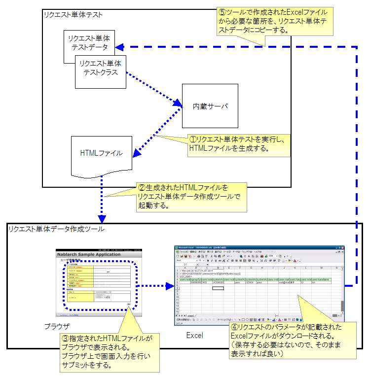

# リクエスト単体データ作成ツール

## 概要

リクエスト単体テスト（画面オンライン処理）では、HTMLからのリクエストパラメータ（form内のname属性）のキーと値をテストデータとして作成する必要がある。手動作成ではパラメータ名を写し間違える恐れがあり、特に登録画面などパラメータ数が多い画面ではその可能性が高くなる。

本ツールは、リクエスト単体テストで生成されたHTMLを使用して次画面へのリクエストパラメータを作成することで、人手によるミスを解消する。

keywords

リクエスト単体テスト, テストデータ作成, リクエストパラメータ, 画面オンライン処理, name属性, 写し間違え防止

## 特徴

リクエスト単体テストで生成されたHTMLをブラウザで操作することで、次画面へのリクエストパラメータをExcel形式で取得できる。Webアプリケーションを操作するような感覚で直感的にテストデータが作成できる。

keywords

Excelダウンロード, ブラウザ操作, リクエストパラメータ取得, テストデータ生成, 直感的操作

## 使用方法

ツールの使用手順:

**前提条件**

開発環境構築ガイドに従って開発環境を構築済みであること。詳細は [02_SetUpHttpDumpTool](toolbox-02_SetUpHttpDumpTool.md) の [http_dump_tool_prerequisite](toolbox-02_SetUpHttpDumpTool.md) を参照。

**入力となるHTML生成**

リクエスト単体テストを実行し、HTMLファイルを生成する。初期画面表示のリクエスト単体テスト用データのみ手動で用意する必要がある。初期画面表示リクエスト（例：メニューからの単純な画面遷移）にはリクエストパラメータが含まれていないことがほとんどであるため、通常は空のリクエストパラメータを作成すればよい。

**ツール起動**

Eclipse上からHTMLファイルを右クリックし、ツールを起動する（ :ref:`howToExecuteFromEclipse` 参照）。

> **注意**: Windows上で本ツールを起動するとコマンドプロンプトが現れるが、これはツール内部で使用される内蔵サーバのプロセスである。本ツールを使用する間はこのコマンドプロンプトは実行したままにしておくとよい。ツール起動時に既にサーバが起動されている場合はサーバ起動がスキップされるため、2回目以降の起動が速くなる。誤ってコマンドプロンプトを落としても、次回のツール起動時に自動的に起動される。

**データ入力**

HTMLファイルがブラウザで起動されるので、ブラウザ上で画面入力を行いサブミットを実行する。

**Excelダウンロード**

サブミットで発生したHTTPリクエストがExcelファイルに記載された状態でダウンロードできる。ブラウザから直接ExcelやOpenOfficeで起動すればよい（ローカルへの保存不要）。

**データ編集**

ダウンロードしたExcelファイルにHTTPリクエストパラメータのデータが記載されている。そのデータをリクエスト単体テストのテストデータにコピーする。

keywords

ツール起動, Eclipse, HTML生成, Excelダウンロード, データ編集, howToExecuteFromEclipse, http_dump_tool_prerequisite, 内蔵サーバ, コマンドプロンプト

